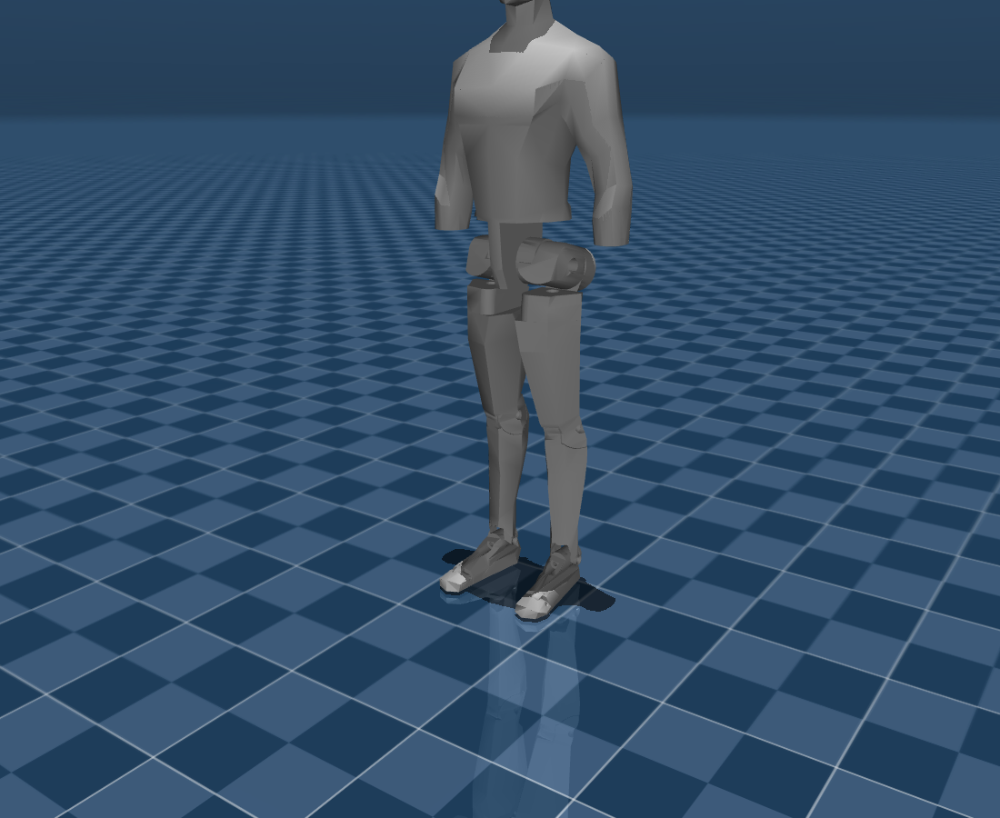
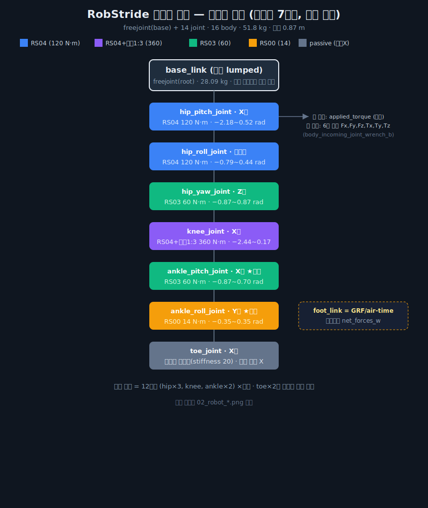

# 00 · 프로젝트 개요 & 환경 (Overview)

> [!abstract] 한 줄 요약
> RobStride 모터 구동 **하반신 14-DOF 이족 로봇**을 Isaac Lab에서 "사람처럼 걷도록" 학습시키고,
> 키보드 조작·실시간 토크/축력(x,y,z 반력)/GRF 로깅으로 **하드웨어 설계용 하중 데이터**를 얻는다.

---

## 왜 (Why)
- 하드웨어(모터·구조) 사양을 검증하려면, 실제로 걷는 동작에서 **각 관절 토크**와 **링크에 걸리는 축력(반력)**,
  **발 지면반력(GRF)** 이 얼마나 발생하는지 정량 데이터가 필요하다.
- 실물 제작 전, 시뮬레이션에서 평지·계단·울퉁불퉁·경사·외란 조건의 하중을 측정해 설계 마진을 잡는다.

## 무엇을 (What)
1. 깨끗한 conda 환경 + Isaac Sim/Isaac Lab (`sim/` 아래, 격리)
2. 분리된 locomotion 학습 워크스페이스 (`pygmalion_locomotion/`, Isaac Lab 원본 무수정)
3. 사람형 보행 Policy (속도추종 + 보행 쉐이핑 → 이후 AMP 옵션)
4. 키보드 조작 평지/계단/울퉁불퉁/경사 환경 + 실시간 HUD + CSV/npz 로깅
5. 조정 가능한 로봇 질량
6. cmd_vel·외란·지형 스윕 측정 캠페인 + 분석
7. 이 문서들 (재현 가능하도록 단계별 정리)

## 어디서 (Where)
```
Human-Pygmalion/
├── sim/                   # conda + Isaac Sim 5.0 + Isaac Lab 2.2 (격리)
├── pygmalion_locomotion/  # 우리 학습 코드 (외부 프로젝트)
├── docs/                  # 이 노트들 + assets/(스크린샷)
└── robot_files/           # 입력 (불변): robot.xml, biped_cfg.py, mjcf.zip
```

## 어떻게 (How) — 전체 흐름
`MJCF→USD 변환` → `velocity env 구성` → `지형/명령/외란/질량` → `reward 튜닝·학습` →
`센싱/로깅` → `키보드 play + HUD` → `측정 캠페인` → `분석·문서화`

---


> 하반신 이족 (base_link 메시는 몸통 외형을 포함하나 단일 강체). 다리당 7관절.

## 대상 로봇 요약 (robot_files)
| 항목 | 값 |
|---|---|
| 형태 | 하반신 이족 (상체/팔 없음, base_link = 몸통 lumped 28kg) |
| DOF | 다리당 7 (hip pitch/roll/yaw, knee, ankle pitch/roll, **toe=패시브**) → 총 14 |
| 총질량 | 51.8 kg | 
| 기립 높이 | 0.87 m (base), 전체 키 ≈ 1.24 m |
| 모터 | RS04(120/360 N·m), RS03(60), RS00(14) — [[01_install]] 표 참조 |

### 관절·모터 매핑
| 관절 | 모터 | effort_limit | 비고 |
|---|---|---|---|
| hip pitch/roll | RS04 | 120 N·m | |
| hip yaw | RS03 | 60 N·m | |
| knee | RS04+AT3 1:3 | 360 N·m | armature 큼(0.0875) |
| ankle pitch | RS03 | 60 N·m | **직결 모터**(로드/링키지 아님), 정책 제어 |
| ankle roll | RS00 | 14 N·m | **직결 모터**, 정책 제어 |
| toe | 없음 | — | **패시브 스프링**(stiffness=20, effort_limit=25로 스프링 작동), 액션 제외 |

> [!note] 발목·토 모델링 (사용자 확정)
> - 발목 pitch/roll은 **모터가 관절축에 직결** — G1처럼 로드/병렬링키지로 rp 제어하지 않음. 정책이 직접 제어.
> - toe는 **모터 없는 패시브 스프링-댐퍼**(기본각 0으로 복원). 정책 액션에서 제외.
>   `effort_limit=0`이면 스프링 토크가 0으로 클립되어 죽으므로 `effort_limit=25`로 둠.

### 운동학 체인 (한눈에)


---

## 시스템 환경 (측정값, 2026-06-20)
| 항목 | 값 | 영향 |
|---|---|---|
| OS | Ubuntu 22.04.5 (kernel 6.8) | Isaac Sim 주 타겟 ✅ |
| GPU | **RTX 5060 Ti 16GB (Blackwell, sm_120)** | torch cu128 필요, Sim 4.5 불가 |
| Driver | 580.167.08 / CUDA 13.0 | 595 브랜치 크래시 회피 기대 ✅ |
| CPU | 4 코어 | 학습 느림 → 적은 num_envs |
| RAM | **9.7 GB (+swap 2GB)** | ⚠️ 권장 32GB. **최대 리스크** → num_envs 축소 |
| Disk | 68 GB 여유 (84% 사용) | Isaac Sim ~15GB, 빠듯하나 가능 |

> [!warning] 핵심 리스크
> RAM이 권장(32GB)의 1/3 수준. Isaac Sim 구동/학습 시 OOM 위험 → **headless + num_envs 256~1024**로 시작하고,
> 무거운 실행 직전 사용자에게 RAM 확보를 요청한다. 학습은 백그라운드로 길게 돌린다.

## 핵심 설계 결정 (리서치 근거)
- **Isaac Sim 5.0 GA + Isaac Lab 2.2** (Blackwell 지원 stable: Python 3.11 + torch 2.7 cu128).
  - Sim 4.5: Blackwell에서 CUDA compute capability 에러 → ❌
  - Sim 5.1/Lab 2.3: scenedb 크래시는 **595 드라이버 한정** → 우리(580)는 fallback 여지
- **원본 무수정**: Isaac Lab은 참조·러너로만, 우리 코드는 외부 프로젝트로 분리.
- 학습: **속도추종 + 보행 쉐이핑** 먼저 → AMP 단계적.
- 모니터링: **인-시뮬 HUD + CSV/npz**.

## 다음 노트
- [[01_install]] — 설치 절차 (이 노트와 함께 작성 중)
