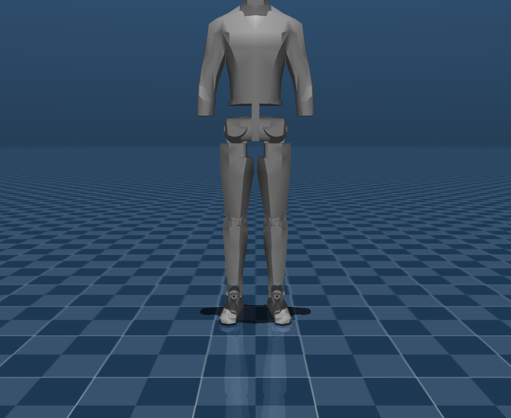
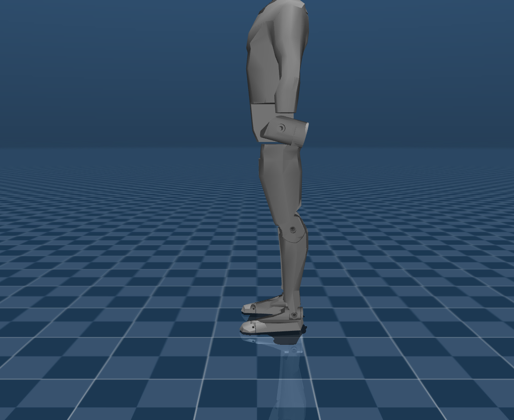
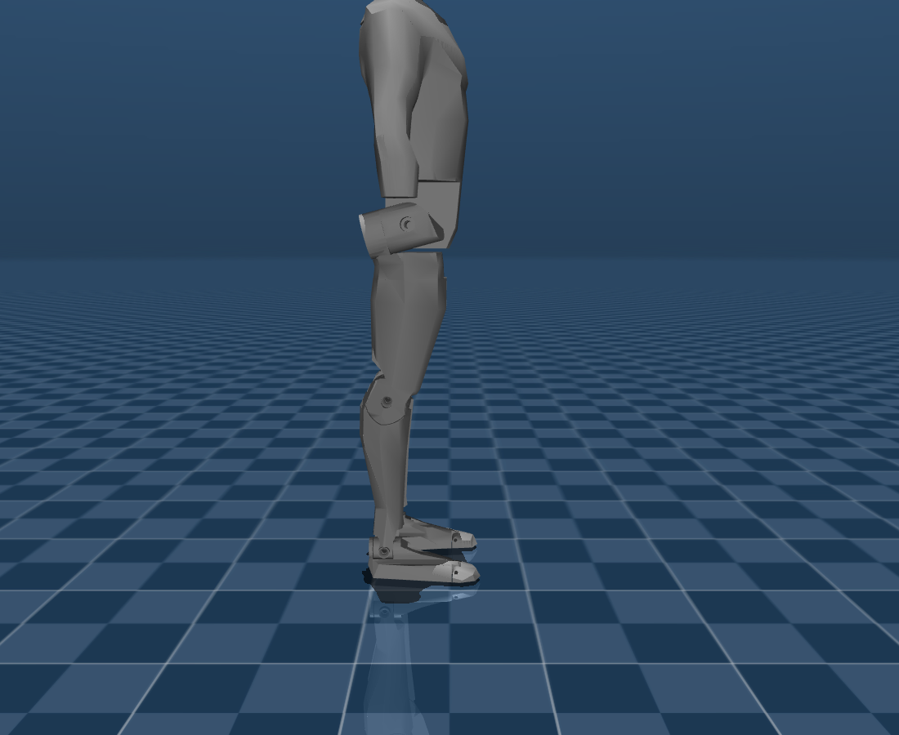

# 02 · 로봇 에셋 변환 (MJCF → USD)

> [!abstract] 목표
> 주어진 MJCF(`robot.xml` + STL 15개)를 Isaac Lab이 쓰는 **USD**로 변환한다.
> robot_files는 입력(불변)이며, 변환 산출물은 `pygmalion_locomotion/usd/`에만 쓴다.

---

## 왜 (Why)
- Isaac Sim/Isaac Lab의 물리·렌더는 **USD** 기반. MJCF는 직접 시뮬에 못 올린다.
- Isaac Lab은 `MjcfConverter`로 MJCF→USD(instanceable)를 만들어 `ArticulationCfg`로 로드한다.

## 무엇을 / 어디서 (What / Where)
- 입력: `robot_files/biped_lower_body_mjcf.zip` → 압축해제본 `pygmalion_locomotion/assets/biped_lower_body_mjcf/`
  (robot.xml + meshes/*.stl 15개).
- 출력: `pygmalion_locomotion/usd/biped_lower_body.usd`.
- 스크립트: `pygmalion_locomotion/scripts/convert_asset.py`.

> [!tip] spec 기반 (자동 재변환)
> 변환은 이제 [[08_robot_hotswap]]의 spec(`robot_specs/*.yaml`)이 주도한다. source가 **.xml/.mjcf면 MjcfConverter,
> .urdf면 UrdfConverter**가 확장자로 자동 선택된다. USD는 **소스 바이트+변환옵션 해시**로 캐시되어
> 소스가 바뀌면 자동 재생성(메시만 바꾸면 `--force` 필요).
> ```bash
> python scripts/convert_asset.py           # 변경 시 자동 재변환
> python scripts/convert_asset.py --force   # 강제 재변환
> ```

## 어떻게 (How)
`MjcfConverterCfg`의 핵심 옵션 (이유와 함께):

| 옵션 | 값 | 이유 |
|---|---|---|
| `fix_base` | `False` | 자유부유 베이스 = locomotion (걸으려면 베이스가 떠 있어야) |
| `import_inertia_tensor` | `True` | MJCF `<inertial>`의 질량/관성 그대로 사용 (하드웨어 설계 정합) |
| `self_collision` | `False` | MJCF의 contype/conaffinity 스킴과 일치(자기충돌 OFF, 바닥과만) |
| `make_instanceable` | `True` | 다수 env 복제 시 메모리 절약 (저RAM에 중요) |

```bash
python scripts/convert_asset.py        # headless, usd/biped_lower_body.usd 생성
```
> 내부적으로 `isaacsim.asset.importer.mjcf` 확장을 사용 → Kit 앱이 떠야 하므로 스크립트가
> `AppLauncher(headless=True)`를 먼저 띄운다.

## 검증 포인트 (변환 후)
1. USD prim 트리에 `base_link`, `*_hip_*_link`, `*_thigh_link`, `*_shin_link`, `*_foot_link`, `*_toe_link` 존재.
   → 우리 env cfg의 body 이름 매핑(`base_link`, `.*_foot_link`)이 이 트리에 맞춰져 있음. [[03_environment]]
2. 빈 씬에 1개 스폰 → 'stand' 자세로 떨어뜨려 **NaN/폭발 없이 접지** 확인. (스크린샷)
3. 관절 14개 / actuator 12개(toe 패시브) 일치.

> [!note] 주의 — 메시 단위
> robot_files README에 따르면 원본 익스포터의 `scale=0.001` 버그를 변환 단계에서 `scale=1`로 교정함.
> 이미 미터 단위 STL이므로 추가 스케일 불필요.

## 스크린샷 — 로봇 외형 (MuJoCo 오프스크린 렌더, 'stand' 자세)
> `MUJOCO_GL=egl python scripts/render_robot.py --out ../docs/assets --prefix 02_robot` 로 생성
> (CPU/EGL 렌더 → GPU 드라이버 이슈와 무관. 로봇을 바꾸면 다시 돌려 갱신).

| 투시(perspective) | 측면(sagittal) |
|---|---|
|  |  |
| 정면(coronal) | 후면(back) |
|  |  |

> [!note] 관찰
> `base_link` 메시가 **몸통 형상(상체 외형)** 을 포함하지만, 관절은 없는 **단일 강체(28kg lumped)** 다.
> 즉 외형은 휴머노이드지만 자유도는 **하반신 14관절**뿐. 다리 관절 체인(hip→knee→ankle→toe)이 명확히 보인다.

## 다음 노트
- [[03_environment]] — velocity env 구성
