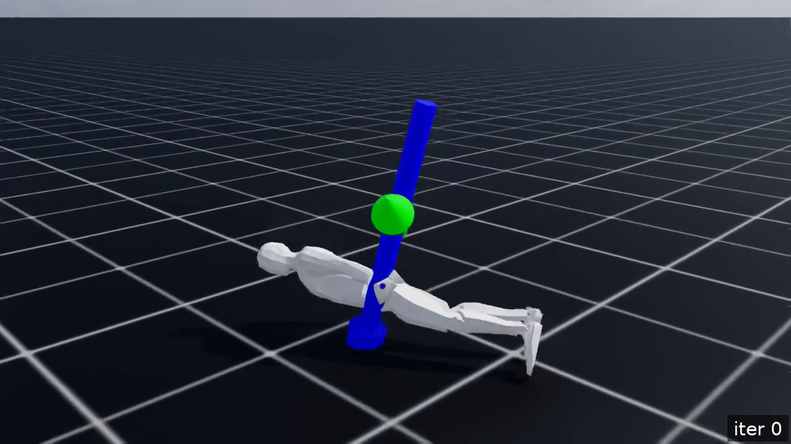
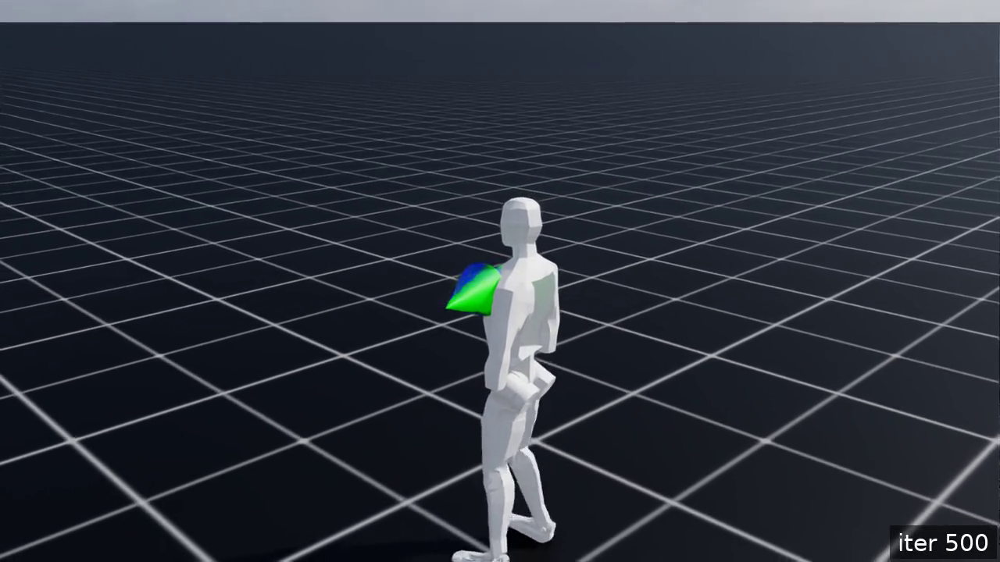
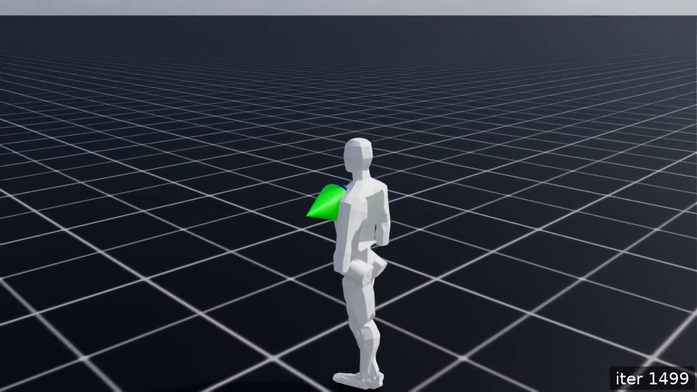

# 04 · Reward 실험 로그 (Trial & Error)

> [!abstract] 목표
> "사람처럼 걷는다"를 reward 가중치 조합으로 유도한다. 각 실험의 **가설 → 변경 → 결과 → 해석**을
> 표로 누적해, 어떤 항이 무엇을 바꾸는지 학습 가능하게 한다.

---

## 왜 trial-and-error인가
보행 reward는 여러 항의 **균형**이다. 한 항을 키우면 다른 게 망가진다(예: 속도추종↑ → 발 끌기,
토크 페널티↑ → 너무 소극적). 정답 가중치는 로봇·물리마다 달라 **반복 실험**으로 찾는다.

## 평가 지표 (무엇을 보고 판단)
- TensorBoard: `Rewards/track_lin_vel_xy`, `Episode/..._reward`, `Train/mean_reward`, episode length.
- 정성: play 영상에서 (1) 넘어지지 않고 (2) cmd 추종하며 (3) 발을 번갈아 들고 (4) 직립·자연스러운지.
- 정량(사람다움 proxy): 평균 보폭/스텝주기, base 높이 분산, 양발 air-time 대칭, 발 슬립량.

## 실행
```bash
python scripts/train.py --task Pygmalion-Velocity-Flat-v0 --headless --num_envs 512 --max_iterations 500
tensorboard --logdir logs/rsl_rl/pygmalion_flat   # 곡선 확인 (스크린샷 → assets/)
```

## 실험 표 (누적)
| # | 가설 | 변경(항: 가중치) | 결과 | 해석·다음 |
|---|---|---|---|---|
| 0 | G1 레시피 + 사람다움 항 시작점 (03 초기값) | baseline | **CPU, 1024 env, 330/1500 iter**: reward +7.76, ep_len 814, **error_vel_xy 0.9**(미흡) | 균형은 OK인데 속도추종 부족 → **단지 학습 부족**으로 판단 → GPU로 1500까지 |
| 1 | **#0를 GPU로 1500 iter 완주** (가중치 동일) | 변경 없음 | ✅ **GPU, 2048 env, 1500/1500 iter (~15분)**: Mean reward −5→**+41.9**, **ep_len 990/1000**(전구간 안넘어짐), **error_vel_xy 0.9→0.25**(양호!) | **수렴 — 사람다운 보행 정책 완성.** 첫 reward 구성이 그대로 통함(튜닝 불필요). 체크포인트 31개. run=`2026-06-20_17-08-09_gpu_flat_v1` |
| 2 | **방향+자기충돌+DR+토크리밋 종합 수정** (사용자 리뷰) | 아래 6+α | ✅ **GPU 16384env**: iter83 ep_len961/**err_vel 1.09(서있기)** → iter300 ep_len1000/**err_vel 0.29(보행!)** | **회복**: 균형 먼저(서있기 local opt) → 보행 학습. 재밸런스 불필요. run=`gpu_flat_v3fix` |
| 3 | (필요시) rough(계단/경사)로 커리큘럼 확장 | — | _(다음)_ | Flat 정책을 rough 학습 초기화로 |

> [!note] 실험 #2 관찰: "서있기→보행" 전환
> 제약(자기충돌·토크리밋·강한 feet_distance·강한 외란)을 추가하니 **iter 83에서 episode length 961인데 error_vel 1.09**
> (= 안 넘어지려고 **가만히 서는** local optimum). 성급히 재밸런스하지 않고 더 학습하니 **iter 300에서 error_vel 0.29로 보행 수렴**.
> → 교훈: episode length가 먼저 차고(균형) error_vel은 나중에 떨어진다(보행). 중간의 높은 error_vel에 과민반응 말 것.

> [!warning] 실험 #1 정책의 문제 (영상 검토로 발견) → 실험 #2에서 수정
> 1. **한 방향으로만 이동**: `lin_vel_x=(0,1)` = 전진만 학습(후진 명령 없음). → **(-1,1)로 omnidirectional**.
> 2. **체중(mass) DR 꺼짐**: spec이 질량 소유하며 `add_base_mass=None`으로 비활성화함. → **재활성화(±5kg)** + `apply_robot_physics`를
>    "변경 없으면 no-op"으로 만들어 DR이 작동하게.
> 3. **마찰 DR 무효**: 기본 `static_friction_range=(0.8,0.8)`(범위 동일) → **(0.4,1.25)로 확대**. COM DR도 재활성화.
> 4. **발/신체 교차(scissoring)**: self_collision=False라 다리가 통과. → `feet_distance` 페널티 **−0.5→−2.0**, min_dist 0.18.
>    (남으면 self-collision 활성화 검토 — PhysX는 부모-자식 링크는 자동 제외하므로 좌우 다리만 충돌)
> 5. 초기 관절·속도 randomization + 외란 강화 추가.
> 6. **영상은 25대 그리드**로 — 한 대만 보면 샘플 의미 약함(사용자 지적). `record_progress.py --num_envs 25`.

> [!success] 핵심 발견 (trial-and-error 결론)
> "사람처럼 걷기"에 **복잡한 reward 재설계가 필요 없었다** — G1 검증 레시피 + 사람다움 4종(upright/base_height/feet_distance/no_flight)이
> **첫 시도에 수렴**. baseline이 부진했던 건 reward가 아니라 **학습량(iter) 부족**이었고, GPU로 충분히 돌리니(1500 iter) 해결.
> → 교훈: reward 튜닝 전에 **충분한 학습량부터** 확보할 것. (error_vel_xy 0.9→0.25, ep_len 814→990)

> [!note] baseline 실측 (2026-06-20, CPU)
> 보상 항이 전부 정상 계산·로깅됨(track_lin/ang_vel, feet_air_time, feet_slide, flat_orientation, dof_torques/acc/action_rate,
> base_height, upright, feet_distance, no_flight, termination). 약 330 iter / 15분(CPU)에서 균형 습득.
> **속도추종(error_vel_xy 0.9)이 핵심 개선점** — 더 학습 또는 reward 재조정 대상.

## 현재 활성 Reward 전체 — 무엇을·왜·가중치 (2026-06-21)
> 출처: `velocity_env_cfg.py` BipedRewards + `__post_init__`, `flat_env_cfg.py` 오버라이드. ★=이번 세션 변경.

| 분류 | 항 (func) | 가중치 (rough/flat) | 무엇을 / **왜** |
|---|---|---|---|
| **과제** | track_lin_vel_xy_exp | **+1.0** | 명령 선속도(vx,vy) 지수추종 — **주 과제** |
| | track_ang_vel_z_exp | +2.0 / +1.0 | 명령 yaw rate 추종 |
| **자세(사람다움)** | upright | +0.5 | 몸통 직립 |
| | base_height (target 0.85) | −1.0 | 서있는 높이 유지(주저앉음 방지) |
| | flat_orientation_l2 | −1.0 | base 수평 |
| | joint_deviation_hip (hip yaw/roll) | −0.1 | 고관절 중립 — **다리 벌어짐/꼬임 방지** |
| **보행** | feet_air_time (thr 0.4) | +0.25 / +0.75 | 스윙(발 들기) 유도 — **끌지 않게** |
| | feet_slide | −0.1 | 스탠스 중 발 미끄럼 방지(깨끗한 접지) |
| | no_flight | −0.5 | flight(양발 뜸=달리기) 억제 — **걷기 유지** |
| | feet_distance (min 0.18) | −2.0 | 좌우 발/다리 **충돌(scissoring) 방지** |
| **안전** | termination_penalty | −200 | **낙상** 페널티 |
| | dof_pos_limits (ankle) | −1.0 | 관절한계 위반 방지 |
| | torque_soft_limit (0.85, 전 leg) | −0.0025 | 토크를 모터 포락선 내로 — **sim2real + HW 사이징 현실성** |
| | ★ **torque_soft_limit_ankle (0.80, ankle)** | **−0.01** | **포화 발목(RS03 60/RS00 14, 100% peak) offload** — 병목 부하분산 [세션] |
| **정칙화** | ★ **dof_acc_l2 (★전 구동관절)** | −1.25e-7 / −1.0e-7 | 관절가속도 — **진동/지터↓**. 발목 미규제였던 것 포함 확장 [세션] |
| | ★ action_rate_l2 | **−0.008** / −0.005 | 액션 1차 평활 — **진동↓** [세션 ↑] |
| | dof_torques_l2 | −1.5e-6(전관절) / −2e-6(hip·knee) | 토크 L2 — 효율 proxy |
| | lin_vel_z_l2 / ang_vel_xy_l2 | −0.2 / −0.05 | 수직 바운스·roll/pitch 억제(안정) |
| **관련(reward 아님)** | command 커리큘럼 (`command_lin_vel_x_levels`) | vx 1.0→2.0 | 고속 명령 점진확장 — **PPO 붕괴 방지** [세션] (Margolis [[Paperreview/margolis-rapid-locomotion]]) |

### ★ 이번 세션(2026-06-21) 핵심 Reward 변경 — 왜
1. **`torque_soft_limit_ankle` 신규** (−0.01, 0.80, 발목): 측정상 발목이 **Peak 100% 포화 = 병목**([[17_toe_usage_vibration]]·[[21_motor_power_weight]]). 발목 토크를 더 강하게 눌러 **무릎/고관절/수동 toe로 부하 분산**. 근거 리서치 [[22_energy_toe_reward]](wseyrv4mz, item4 ankle-only).
2. **`dof_acc_l2` → 전 구동관절 확장**: 기존 hip/knee만 → **발목·전관절**. 데이터상 발 진동은 **발목 가속도 미규제로 인한 >5Hz 지터**(knee40%/toe41%/ankle17-23%) → 발목 가속도 페널티로 억제. 근거 [[Paperreview/caps-smooth-control]].
3. **`action_rate_l2` −0.005→−0.008**: 1차 액션평활 보강(진동 보조).
4. **command 커리큘럼**: vx 상한 1.0→2.0 점진(넓은 속도 직접 주면 붕괴). 근거 [[Paperreview/margolis-rapid-locomotion]].

> [!important] 미적용 — 내일 신중 구현 (toe 적재)
> **순수 에너지/토크 페널티만으론 passive toe가 안 실린다**(toe가 정책 밖 → gradient 없음; ECO 휴머노이드서 heel-to-toe 미발현). 제대로 하려면 **속도정규화 power CoT + 종말기 forefoot rollover shaping**(신규 항 + annealing) → 레시피·근거 [[22_energy_toe_reward]]. **반드시 [[19_toe_ablation]] 로 검증.**

## 리서치: 토크-리밋 근접 페널티 (2026-06-20)
> **질문**: 토크가 한계에 가까워지면 페널티 주는 reward가 유효/유익한가?

**결론: 유효하고, 하드웨어 설계+sim2real 목적엔 좋은 reward (보통 가중치로).**
- **유효성**: 문헌상 액추에이터 제약은 **하드 제약이 아닌 reward 소프트 제약**으로 다루는 게 표준
  (토크 L2/파워/속도/가속도 페널티 = morphology-aware regularization). 포화 시 대칭 보행으로 부하 분산하는 기법도.
- **영향**: ① 한계 근처 회피 → **제어권 유지**(포화 모터는 토크 못 키워 불안정), ② 실모터 토크+**열** 한계 → **sim2real↑**,
  ③ 부하가 **달성 가능 범위** → 하드웨어 측정 현실적. 그래도 포화하면 **모터 부족의 강력한 증거**.
- **주의**: 너무 강하면 **과소극적**(동적보행/외란회복/계단에 필요한 큰 토크 회피). → 보통 가중치 + 기존 `dof_torques_l2`(전반 효율)와 상보적.
- **추가 권고**: 하드웨어 **사이징**엔 별도로 **"한계 해제(unclipped) 측정"**도 — 정책이 *진짜로 원하는 토크*를 봐야 정격 결정.

**적용**: `mdp.applied_torque_soft_limit`(implicit actuator 지원, |τ|>0.85·effort_limit 초과분만 quadratic) weight −0.0025 추가.
내장 `applied_torque_limits`는 explicit actuator 전용이라 직접 구현. 출처: [SATA](https://arxiv.org/abs/2502.12674), [Actuator-Constrained RL](https://arxiv.org/pdf/2312.17507).

## 방향(forward axis) 수정 + 자기충돌 (실험 #2 세부)
- **방향**: hip_pitch 축=X·다리 X분리 → 로봇 전진축이 **Y**인데 Isaac은 forward=**X** 가정 → 전진명령에 **게걸음**.
  `scripts/rotate_robot_forward.py`로 base_link 내부 지오메트리를 **Z −90° 회전**(프레임 유지) → forward=X. MuJoCo FK로 검증(발이 Y분리, X전방).
- **자기충돌**: 모든 geom `conaffinity=0`이라 OFF였음 → spec `self_collision: true`(PhysX가 부모-자식 자동제외 → 좌우 다리/발만 충돌). 재변환.

## 알려진 튜닝 레버 (경험칙)
- 발을 안 들고 끌면 → `feet_air_time`↑, `feet_slide`(−)↑.
- 주저앉으면 → `base_height_l2`(−)↑, `flat_orientation`(−)↑, init 자세 무릎 굽힘.
- 너무 소극적/안 걸으면 → `dof_torques_l2`/`action_rate` 페널티↓, `track_lin_vel`↑.
- 점프/뛰면 → `no_flight_phase`(−)↑, 명령 속도 범위↓.
- 다리 꼬이면 → `feet_distance_l1`(−)↑, `joint_deviation_hip`(−)↑.
- 떨림(진동) → `action_rate_l2`/`dof_acc_l2` 페널티↑.

## 학습 전략 (저RAM/4코어)
1. **평지 먼저** 빠르게 수렴(작은 net 256-128-128, num_envs 512).
2. 평지 폴리시를 rough(계단/경사) 학습의 초기화로 사용하거나 커리큘럼으로 확장.
3. 길게 돌릴 땐 백그라운드 잡 + 주기적 체크포인트.

## 학습 중 영상 자동 저장 (기본 ON) ★
학습이 끝날 때까지 기다리지 않고 **진행 중간을 확인**하려면 — `train.py`가 **기본으로 학습 중 주기적 영상**을 저장한다
(Isaac Lab 내장 `RecordVideo`). env-0 로봇을 따라가는 3/4 팔로우캠.
```bash
python scripts/train.py --task ... --headless       # 영상 기본 ON (videos/train/에 저장)
#   --video_interval 1500  (스텝 간격 ≈ 60 iter마다)  --video_length 200 (≈4초)
python scripts/train.py --task ... --no_video        # 끄려면
```
> 산출: `logs/rsl_rl/<exp>/<run>/videos/train/rl-video-step-*.mp4` — **학습 도중에 계속 쌓임**.
> 최초 1회는 RTX 셰이더 컴파일로 ~4분 지연(이후 빠름). (학습 후 체크포인트로 만드는 `record_progress.py`는 별도 "진화 영상"용.)

## 진화 영상 (학습 단계별 정책)
체크포인트들을 단일 로봇으로 재생·녹화해 **clumsy(iter 0) → 보행(iter 1499)** 진화를 한 영상에 담는다(각 ~3초, iter 캡션 우하단).
```bash
python scripts/record_progress.py --run logs/rsl_rl/pygmalion_flat/<run> --device cuda:0 --stride 5
# -> <run>/progress_accumulated.mp4  (+ progress/clip_iter*.mp4)
```
> 산출: `progress_accumulated.mp4` ([docs/assets/04_evolution_accumulated.mp4](assets/04_evolution_accumulated.mp4), 4.5MB, iter 0/250/500/750/1000/1250/1499).
> RTX 렌더 최초 1회는 셰이더 컴파일로 느림(이후 캐시). `record_progress.py`는 rsl_rl 래퍼가 아닌 `base.render()` 사용.

**정책 진화 (프레임)** — iter 0(어색) → iter 1499(직립 보행, 초록=속도명령):
| iter 0 | iter 500 | iter 1499 |
|---|---|---|
|  |  |  |

## 스크린샷
- _(tensorboard 곡선, 보행 영상 프레임)_ ``

## 다음 노트
- [[05_sensing_logging]] · [[07_measurement]]
