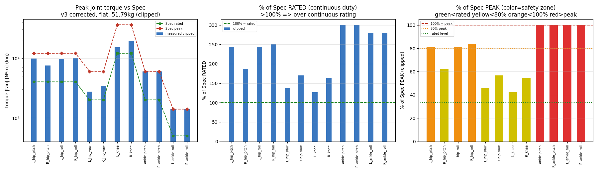
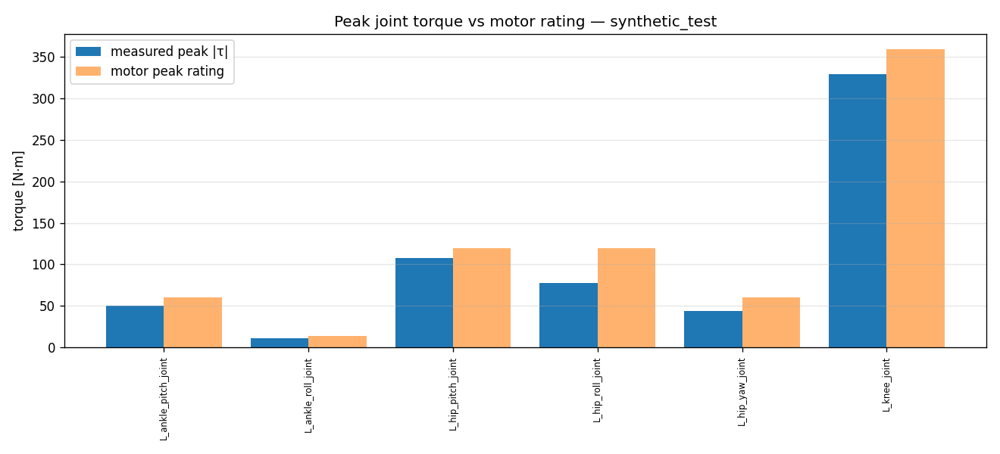
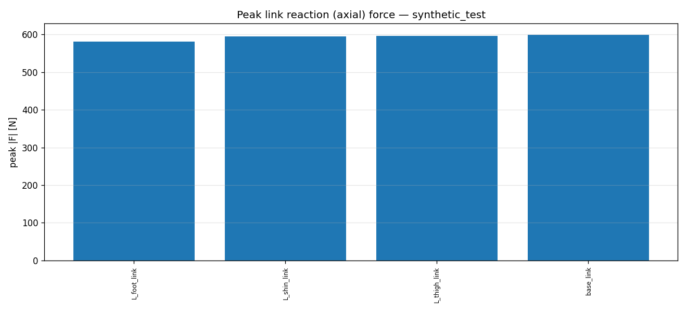
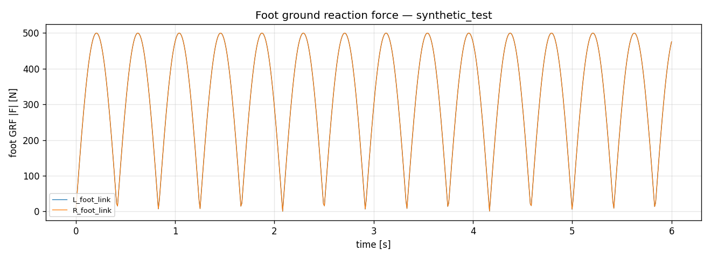

# 07 · 측정 캠페인 & 분석 (하드웨어 설계용)

> [!abstract] 목표
> cmd_vel·지형·외란·질량을 스윕하며 자동 주행 → 관절토크·축력(x/y/z 반력)·GRF를 로깅하고,
> 모터 정격과 대비해 설계 근거 데이터를 만든다.

---

## 어떻게 — 측정
```bash
# 평지, 질량 1.0배, 30초
python scripts/measure.py --task Pygmalion-Velocity-Flat-Play-v0 --headless \
    --checkpoint <ckpt> --mass_scale 1.0 --duration 30 --tag flat_m1.0
# 거친지형(계단/경사) + 외란 + 질량 1.2배
python scripts/measure.py --task Pygmalion-Velocity-Rough-Play-v0 --headless \
    --checkpoint <ckpt> --mass_scale 1.2 --push --duration 30 --tag rough_m1.2
```
명령 스케줄(기본): 정지 → 전진(저속) → 전진(고속) → 횡이동 → 제자리회전 → 전진+회전 (반복).

## 어떻게 — 분석
```bash
python scripts/analyze.py --npz logs/measure/rough_m1.2.npz --out ../docs/assets
```
산출:
- `*_joint_torque.png` : 관절 토크 시계열
- `*_torque_vs_rating.png` : 관절 peak |τ| vs **모터 정격**(아래)
- `*_link_force.png` : 링크 축력(|Fx,Fy,Fz|) peak
- `*_foot_grf.png` : 발 GRF 시계열
- `*_analysis.md` / `*_stats.json` : 표 + 머신리더블 통계

## 모터 정격 대비 (peak / rated, 출력축)
| 관절 | 모터 | peak | rated |
|---|---|---|---|
| hip pitch/roll | RS04 | 120 | 40 |
| hip yaw | RS03 | 60 | 20 |
| knee | RS04+belt | 360 | 120 |
| ankle pitch | RS03 | 60 | 20 |
| ankle roll | RS00 | 14 | 5 |
> `analyze.py`가 측정 peak를 이 표와 비교해 **util%**를 낸다. util%가 100을 넘으면 그 동작에서
> 모터 토크가 부족(설계 재검토 신호). 여러 질량/지형/속도 조건을 스윕해 worst-case를 찾는다.

## 측정 설계 팁
- 질량 스윕: `--mass_scale 0.8/1.0/1.2/1.5` 또는 `--base_mass`로 몸통만 변경.
- 외란 유무(`--push`)로 충격 하중 비교.
- 평지 vs 계단 vs 경사로 worst-case 부위 식별.

## 한계/주의
- 발목 피치는 링크 전달비 1:1 **근사**(robot_files README §3.2) → 실제와 차이 가능.
- toe 패시브 모델. armature/마찰은 추정값 → 토크 절대값은 식별로 보정 권장.

## ★★★ 실측정 (방향수정 정책 v3, 평지, 명목 51.79kg) — clipped vs unclipped
> 측정: `measure.py`(+90° 방향교정 `flat_fwd_fixed/model_999`, omnidirectional, 25초/1250스텝).
> 분석: **`analyze_motor_util.py`** → **Spec 정격/Peak 대비 % 보조그래프** 포함 (재실행 가능, 아래 명령).
> **clipped**=정상 토크한계(실제부하). **unclipped**(`--effort_scale 5`)=한계해제(정책의 진짜 요구량, 모터 사이징) — *교정정책 unclipped는 stage-2(넓은DR) 학습 종료 후 측정 예정.*

### 보조 그래프 — Spec 정격/Peak 대비 % (★요청)

*좌: peak |τ| vs Spec 정격/Peak(log) · 중: **% of 정격**(>100%=연속정격 초과, duty cycle 주의) · 우: **% of Peak**(색=안전대 초록<정격/노랑<80%/주황<100%/빨강>peak)*

| 관절 (Spec peak/rated) | clipped peak | **% of 정격** | **% of Peak** | 판정 |
|---|---|---|---|---|
| **ankle pitch (60/20)** | **60.0** | **300%** | **100%** | ⚠️ **포화 — 요구≈peak** (마진 0) |
| **ankle roll (14/5)** | **14.0** | **280%** | **100%** | ⚠️ **포화** (마진 0) |
| hip roll (120/40) | 97–100 | 243–251% | 81–84% | ✅ 여유 (정격 2.5배=duty 주의) |
| hip pitch (120/40) | 75–98 | 187–244% | 62–81% | ✅ 여유 |
| hip yaw (60/20) | 27–34 | 137–170% | 46–57% | ✅ 여유 |
| knee (360/120) | 152–196 | 126–163% | 42–54% | 과설계(평지) |

> [!important] 설계 결론 (v3 방향교정·평지 clipped)
> 1. **발목(pitch+roll)이 병목 — Peak 100% 포화.** 무한워크 unclipped 참조에서도 진짜요구 ankle_pitch 96–100%/roll 100% = **마진 0** → 실HW **발목 모터 상향 또는 레버암 재설계 필수.**
> 2. **모든 구동관절이 연속정격(rated) 초과** (발목 280–300%, 고관절 137–251%, 무릎 126–163%) → 보행은 간헐부하라 peak 기준이 맞지만, **연속 duty가 길면 열적 마진 확인 필요.**
> 3. **무릎 과설계**(Peak 42–54%) — 계단/점프 대비면 합당(rough 측정에서 재평가).
> 4. (참조) 무한워크 clipped vs unclipped: `assets/v3_premoonwalk_motor_util.png` — unclipped로 진짜요구 확인.

### 재실행 (정책/보상/조건 바뀔 때마다 갱신)
```bash
# 1) 측정: clipped(정상) + unclipped(--effort_scale 5, 진짜요구)
python scripts/measure.py --task Pygmalion-Velocity-Flat-Play-v0 --headless --duration 25 \
   --checkpoint logs/rsl_rl/pygmalion_flat/<run>/model_XXX.pt --tag v3_clip
python scripts/measure.py ... --effort_scale 5 --tag v3_unclip
# 2) 분석 + 정격/Peak % 보조그래프
python scripts/analyze_motor_util.py --clipped logs/measure/v3_clip.npz \
   --unclipped logs/measure/v3_unclip.npz --tag v3_corrected --title "v3 corrected, flat, 51.79kg"
```
→ `assets/<tag>_motor_util.png` + `.md`(표) + `.json` 갱신. stage-2/rough 정책마다 재실행해 이력 누적.

---

## (구) 실측정 — 방향버그(게걸음) 정책 v1, 폐기·참고만
> `measure.py`(model_1499, 25초, 1250스텝). ⚠️ 이 정책은 전진명령에 게걸음하던 버그본이라 토크 해석 부정확.


| 관절 | peak τ [N·m] | 모터 peak | **util%** | 시사점 |
|---|---|---|---|---|
| ankle pitch (RS03) | 60 | 60 | **100%** | ⚠️ 포화 — 마진 부족 가능 |
| ankle roll (RS00) | 14 | 14 | **100%** | ⚠️ 포화 |
| hip roll (RS04) | 120 | 120 | **100%** | ⚠️ 포화 |
| hip pitch (RS04) | 105–120 | 120 | 87–100% | 한계 근접 |
| hip yaw (RS03) | 27–41 | 60 | 45–69% | 여유 |
| knee (RS04+벨트) | 99–217 | 360 | **27–60%** | 과설계(평지엔 여유 큼) |
| toe | 5–8 | 패시브 | — | 스프링 정상 |

> [!important] 설계 인사이트
> **평지 보행만으로 발목·고관절 롤이 모터 토크 한계에 포화** → 실HW에선 (a) 모터 상향, (b) 정책의 토크 스무딩,
> (c) 기구 레버암 재설계 검토. **무릎은 과설계**(360N·m 벨트가 평지엔 과함 — 계단/점프 대비라면 합당). 링크 축력·GRF는 아래.


---

## 분석 산출 예시 (파이프라인 검증 — 합성 데이터, 참고용)
> 아래는 `analyze.py`가 실제로 생성하는 산출물 형식이다(합성 데이터로 검증). 실제 측정 후 동일 형식으로 나온다.

**관절 토크 vs 모터 정격** — 어느 관절이 모터 한계에 가까운지(util%) 한눈에:


| joint | peak τ | motor peak | util% |
|---|---|---|---|
| knee | 329.5 | 360 | **92%** |
| hip_pitch | 107.5 | 120 | 90% |
| ankle_pitch | 50.6 | 60 | 84% |

**링크 축력(반력) peak** + **발 GRF**:



> 실제 학습된 정책 측정 시: `python scripts/measure.py ... --tag run` → `analyze.py --npz logs/measure/run.npz --out ../docs/assets`
> → `*_analysis.md`(표) + 4개 그래프 + `*_stats.json`. (드라이버 수정 후 실데이터로 생성 예정)

## 다음 노트
- [[99_troubleshooting]]
