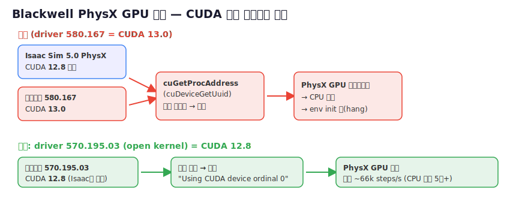

# 09 · GPU 드라이버 — PhysX GPU 폴백 해결 (Blackwell)

> [!abstract] 증상 / 목표
> Isaac Sim의 **PhysX GPU 파이프라인이 CPU로 폴백**(`GPU solver pipeline failed, switching to software`,
> `omni.physx handle on CUDA lib is (nil)`) → 다수 env GPU 학습 불가. GPU 가속 복구가 목표.



---

## 왜 (진단 근거)
- **GPU 연산 자체는 정상**: PyTorch(sm_120/cu128) ✅, 단독 warp(`cuda:0 RTX 5060 Ti`) ✅, RTX 렌더러 부팅 ✅, MJCF→USD ✅.
- **Isaac Sim 내부 PhysX/번들 warp만 실패**: PhysX·warp는 **CUDA 12.8 빌드**인데, 드라이버 **580.167.08
  (Open Kernel Module, CUDA 13.0)** 와 `cuGetProcAddress`(예: `cuDeviceGetUuid`) 호출이 안 맞음.
- **일관 재현됨**(nucleus 없는 최소 씬에서도 동일) → 일시적 아님. 알려진 Blackwell+R580 이슈
  ([IsaacLab #3477](https://github.com/isaac-sim/IsaacLab/issues/3477), [warp #851](https://github.com/NVIDIA/warp/issues/851)).

## 무엇을 (핵심 제약)
- **Blackwell(RTX 50)은 반드시 Open Kernel Module** 사용. proprietary 드라이버는 Blackwell 미지원 → **절대 proprietary로 가지 말 것**.
- Isaac Sim 5.0 권장: 드라이버 580.65.06+ (Open). 현재 580.167.08도 충족하나 PhysX GPU 미작동.

> [!success] 해결 확정 (2026-06-20) — 570.195.03 설치+재부팅 후 PhysX GPU 작동!
> - `nvidia-smi`=570.195.03, torch cu128 cap (12,0). `.run --kernel-module-type=open --dkms`가 unversioned `libcuda.so` 링크까지 자동 생성 → 수동 ⑤ 불필요.
> - kit 로그: **`Using CUDA device ordinal 0`** + `GPU solver pipeline failed` **사라짐**. Isaac Lab env가 cuda:0에서 빌드+학습, **~40,000 steps/s**(CPU 8천 대비 5배), ~0.6초/iter.
> - (참고: `handle on CUDA lib is (nil)` 로그는 여전히 뜨지만 이제 무해 — 직후 CUDA 디바이스 정상 획득.)

## ★ 정답 드라이버 (공식 문서 + 워크플로 리서치 + 직접 테스트로 확정): **570.195.03 (open kernel)**
- 권장: **570.195.03** (570 브랜치 최신, CUDA 12.8, 5060 Ti 지원, **IsaacLab Disc #3612에서 PhysX GPU 동작 확인**). 최소 570.153.02(5060 Ti 첫 지원).
- 설치: `.run` + `-m=kernel-open --dkms`, 그리고 **`sudo ln -sf libcuda.so.1 libcuda.so && sudo ldconfig`**(Ubuntu 패키징이 unversioned libcuda.so를 안 깔아 PhysX가 dlopen 실패 → 보완).
- 검증된 대안: 580.95.05(R580). 595.58.03은 scenedb 크래시 위험.
- ❌ 안 통한 것(직접 테스트): Isaac Sim 5.1(동일 실패+크래시), libcuda.so 링크만(580.167에선 cuGetProcAddress 문제로 부족), OS 24.04(무관). warp 교체(PhysX 별도 바이너리).

(이전 정리: NVIDIA Omniverse Blackwell 검증 드라이버 = R570 570.169 / R580 580.95.05 / R595 595.58.03)
이 중 **570.x(CUDA 12.8)**가 우리 상황의 정답:
- ✅ RTX 5060 Ti(GB206) 지원 (570.153.02+에서 추가, 570.169 포함)
- ✅ **CUDA 12.8** → Isaac Sim PhysX 12.8과 일치 → PhysX GPU/warp 문제 해결 기대
- ✅ Blackwell 검증 드라이버. (현재 580.167.08 = CUDA 13 + 비검증 빌드 = 문제 원인)
- OS는 22.04 유지 가능(Isaac Sim 5.1은 22.04/24.04 둘 다 지원). Isaac Sim 5.1로 올려도 드라이버 안 바꾸면 동일 실패(검증함).
```bash
sudo apt-get remove --purge '^nvidia-.*' ; sudo apt autoremove -y
wget https://us.download.nvidia.com/XFree86/Linux-x86_64/570.169/NVIDIA-Linux-x86_64-570.169.run
sudo systemctl stop gdm3
sudo sh NVIDIA-Linux-x86_64-570.169.run -m=kernel-open --dkms
sudo reboot
```
> fallback: 570.169로도 PhysX GPU가 안 되면 → 검증된 580.95.05(R580) 시도. (595은 scenedb 크래시 위험)

## (이전 일반 안내) 권장 절차 — 사용자 작업, sudo+재부팅
NVIDIA 권장 = **Latest Production Branch (Open Kernel) 드라이버**로 갱신. 둘 중 택1.

### A. graphics-drivers PPA (간단)
```bash
sudo add-apt-repository ppa:graphics-drivers/ppa
sudo apt update
sudo apt install nvidia-driver-580-open     # 최신 580 production, open kernel
sudo reboot
```

### B. NVIDIA .run (버전 정밀 제어)
```bash
# NVIDIA Unix Driver Archive에서 open-kernel .run 다운로드 후:
sudo systemctl stop gdm3                      # 디스플레이 매니저 중지 (sddm/lightdm일 수도)
chmod +x NVIDIA-Linux-x86_64-<VER>.run
sudo ./NVIDIA-Linux-x86_64-<VER>.run -m=kernel-open   # ★open kernel modules 필수
sudo reboot
```

## 소프트웨어 우회 불가 (확정 분석)
- Isaac Sim 5.0은 **번들 `omni.warp.core-1.7.1`**(구버전)을 사용 → 이 warp가 `cuDeviceGetUuid` 버그.
  반면 **pip `warp-lang 1.14`(CUDA 12.9)는 단독에서 GPU 정상** → 드라이버/GPU 자체는 멀쩡.
- 그러나 **PhysX(`libPhysXGpu_64.so`, CUDA 12.8)는 warp와 무관한 별도 C++ 바이너리**로, 자체 CUDA 로드에서
  `handle on CUDA lib is (nil)` 실패. warp를 고쳐도 PhysX는 독립적으로 실패 → **단순 패키지 교체로 해결 불가**.
- 결론: **PhysX 12.8 바이너리 ↔ CUDA 13 드라이버**의 `cuGetProcAddress` 불일치가 본질.
  유효 해결책은 **(A) 드라이버를 production branch로 변경** 또는 **(B) PhysX가 새로 빌드된 Isaac Sim 5.1** 둘뿐.

> [!danger] B(Isaac Sim 5.1) 검증 결과 — 실패 (2026-06-20)
> 별도 env(`pygmalion51`)에 Sim 5.1.0.0 설치 후 최소 PhysX 테스트:
> - **5.1도 `GPU solver pipeline failed, switching to software`** (5.0과 동일, warp 1.8.2/PhysX도 CUDA13 드라이버 불일치)
> - 게다가 **`libPhysXGpu_64.so!PxCreatePhysXGpu`에서 세그폴트 크래시** (5.0보다 불안정).
> → **버전 교체로 해결 불가. 근본 원인=드라이버 확정. A(드라이버 업데이트)가 유일.**
> (`pygmalion51` env는 효용 없으므로 제거 가능: `conda env remove -n pygmalion51`)

> [!warning] 정직한 한계
> #3477은 아직 upstream에서 추적 중인 OPEN 이슈다. 드라이버 갱신이 **유력한 해결책**이나 100% 보장은 아니다.
> 현재 이미 최근 open-580이므로, 더 도움이 될 수 있는 순서: **(1) production-branch 580-open으로 갱신**,
> 안 되면 **(2) CUDA 12.8과 더 잘 맞는 575/570-open(단 RTX 5060 Ti 지원 확인 필요)**,
> 또는 **(3) Isaac Sim 5.1 + Isaac Lab 2.3**(PhysX가 CUDA13 빌드면 드라이버 변경 없이 해결될 수 있음 — 단 5.1 자체 이슈 가능).

## 어디서 / 재부팅 후 검증
```bash
nvidia-smi                                   # 드라이버 버전 확인
source sim/miniforge3/etc/profile.d/conda.sh && conda activate pygmalion
OMNI_KIT_ACCEPT_EULA=YES python /tmp/physx_gpu_test.py --headless
# kit 로그에 'GPU solver pipeline failed'가 안 뜨고 STEPPED_OK 나오면 성공 → 학습 진행
```
성공 시 [[RESUME]]의 "다음 단계"로: spawn_check → train(Flat) → reward 튜닝 → measure.

## 관련 노트
- [[RESUME]] · [[99_troubleshooting]] · [[01_install]]
