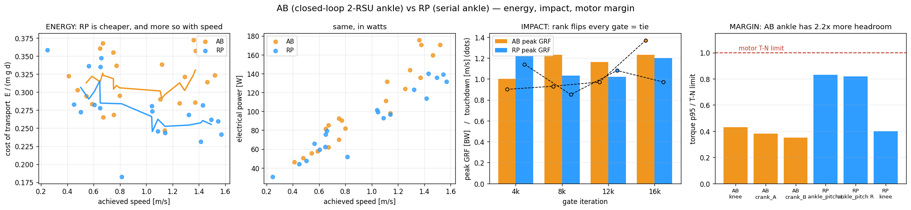
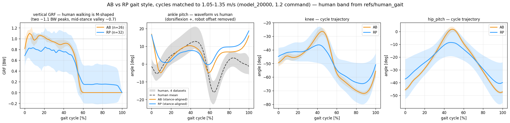

# 101. 정책 사양·리워드·문제·최종 학습계획·AB/RP 비교 (2026-08-25)

대상 런: `ankleAB_c3`(2026-08-24_03-22-35) / `ankleRP_c3`(03-22-58), 동일 스택·동일 시드, 유일 변인 = **발목 기구학**.
토글: `PYG_V2=1 PYG_INIT_BENT=1 PYG_ARM_ABD_DEG=15 PYG_SOFT_LANDING=1 PYG_INERTIAL_DR=1 PYG_ANKLE_MODE=AB|RP`.

---

## 1. 정책 입·출력 차원과 할당

### 1a. 출력 (동일, 12차원)
`JointPositionActionCfg`, **scale 0.25 rad/action**, `use_default_offset=True`
→ 지령 관절각 `q_target = q_default + 0.25 · a`, 이어서 관절 PD가 토크를 만든다.

| | AB (폐루프 크랭크) | RP (직렬) |
|---|---|---|
| 액션 12개 | L/R **crank_A, crank_B**, hip_yaw, hip_pitch, hip_roll, knee | L/R **ankle_pitch, ankle_roll**, hip_yaw, hip_pitch, hip_roll, knee |
| 발목 경로 | 정책 → 크랭크각 → 폐루프가 발 자세를 만듦 | 정책 → 발목각 → 루프 자코비안으로 크랭크공간 클램프(±60 N·m + T-N) → 되돌림 |

PD 게인/한계 (실측 모터 파라미터 `PYG_MOTOR_MEAS=1`: RS04 J .016333·b .009492·tc .269456, RS03 .015265·.022342·.285370):

| 관절 | Kp | Kd | effort limit | 모터 |
|---|---|---|---|---|
| hip_pitch / hip_roll | 150 | 6.0 | 120 N·m | RS04 |
| hip_yaw | 150 | 6.0 | 60 N·m | RS03 |
| knee | 220 | 16.0 | 120 N·m | RS04 |
| ankle (RP) | 28.5 | 1.81 | pitch 110 / roll 105 N·m(포락 외곽) | RS03 ×2 |
| crank (AB) | **22.3** = 28.5·1.25²/2 | **1.41** | 60 N·m | RS03 |
| T-N 클램프 | 실측 48 V 곡선, **구동 사분면만**(제동 = peak) | RS04 corner 9.95 rad/s·peak 120 / RS03 12.57·59.7 | | |

### 1b. 입력 — 비대칭 actor-critic

| 항 | 차원 (AB / RP) | 소스 | 노이즈 | actor | critic |
|---|---|---|---|---|---|
| base_ang_vel | 3 | `robot/imu_ang_vel` (자이로) | ±0.2 | ✅ | ✅ |
| projected_gravity | 3 | ⚠ 바디 쿼터니언(`projected_gravity_b`) | ±0.05 | ✅ | ✅ |
| joint_pos (−default) | **16 / 12** | AB: hip3+knee+**crank2**+ankle2 ×2 / RP: hip3+knee+ankle2 ×2 | ±0.01 | ✅ | ✅ |
| joint_vel | **16 / 12** | 〃 | ±1.5 | ✅ | ✅ |
| actions (직전) | 12 | — | — | ✅ | ✅ |
| command (vx,vy,wz) | 3 | — | — | ✅ | ✅ |
| **base_lin_vel** | 3 | velocimeter (실기 등가물 없음) | — | ❌ | ✅ |
| foot_height | 2 | 지형 높이센서 | — | ❌ | ✅ |
| foot_air_time | 2 | 접촉센서 | — | ❌ | ✅ |
| foot_contact | 2 | 접촉센서 | — | ❌ | ✅ |
| foot_contact_forces | 6 | 접촉센서 | — | ❌ | ✅ |
| **합계** | | | | **actor 53 / 45** | **critic 68 / 60** |

- critic은 `enable_corruption=False`(노이즈 없는 동일 항) + 특권 15항.
- 히스토리 스택 없음(단일 프레임). height_scan은 flat이라 양쪽 모두 제거.
- 네트워크: MLP 512-256-128 ELU, actor/critic 동형, `EmpiricalNormalization` 입력 정규화.
- PPO: `entropy_coef 0.01`, `desired_kl 0.01`(adaptive LR, 초기 1e-3), num_steps_per_env 24, 16384 env, 50 Hz(decimation 4, physics 5 ms), 에피소드 20 s = 1000 스텝.

---

## 2. 사용 중인 리워드와 계산법 (21항, weight≠0은 19항)

기여율은 iter 11.7k AB 실측(양의 예산 6.42 / 음의 예산 −1.00 대비).

| 항 | w | 계산식 | 기여 |
|---|---|---|---|
| track_linear_velocity | +2.0 | `exp(−(‖v_cmd,xy − v_xy‖² + v_z²)/σ²)`, σ²=0.75 | 27.0 % |
| track_angular_velocity | +2.0 | `exp(−((ω_z,cmd−ω_z)² + ‖ω_xy‖²)/σ²)`, σ²=0.5 | 24.3 % |
| upright | +1.0 | 중력벡터 기울기 exp 커널, σ²=0.2 | 15.4 % |
| pose (variable_posture) | +1.0 | `exp(−mean((q−q_ref)²/σ_j²))`, **상태별 σ**: 정지 0.05 / 보행 hip_p .3·hip_r .4·hip_y .15·**knee 1.2**·ankle_p .25 / 주행(>1.5 m/s) knee 1.5 | 11.8 % |
| track_lin_vel_progress | +1.0 | `clamp(min(v·ĉ, ‖c‖), 0)` — 명령방향 투영, 명령크기로 포화. exp 항의 기울기 소실 보완(2026-07-10) | 10.8 % |
| air_time | +1.0 | 체공시간이 [0.05, 0.5] s 안인 발 개수, 명령 게이트 0.5 | 10.7 % |
| **action_rate_l2** | −0.1 | `Σ(a_t − a_{t−1})²` | **−48.6 %** |
| contact_force_cap | −0.01 | `Σ clip(F_z − 420, 0, 560)` | −10.9 % |
| thermal_effort | −0.02 | `Σ (τ_j/τ_rated,j)²`, rated: hip 40·hip_y 20·knee 40·ankle(RP 32.7/27.9) | −9.6 % |
| foot_clearance | −2.0 | `Σ |h_foot − 0.1| · ‖v_foot,xy‖`, 명령 게이트 0.05 | −9.4 % |
| stand_still_penalty | −1.0 | 명령이 있는데 정지 시 정액 비용 | −6.1 % |
| angular_momentum | −0.02 | `‖L‖²` (전신 각운동량) | −6.0 % |
| **foot_impact_velocity** | −1.0 | `Σ relu(−v_z)^**2** · [h_sole<0.10 ∧ 비접촉]`, 명령 게이트 — **제곱형(선형은 해킹)** | −5.1 % |
| foot_slip | −0.1 | `Σ ‖v_foot,xy‖² · [접촉]`, 명령 게이트 | −1.7 % |
| dof_pos_limits | −1.0 | 소프트 한계 초과분 합 | −1.4 % |
| foot_swing_height | −0.25 | 스윙 피크 높이 vs 목표 0.1 m | −0.5 % |
| body_ang_vel | −0.05 | `Σ ω_xy²` (베이스) | −0.4 % |
| self_collisions | −1.0 | 자기접촉 힘 >10 N 발생 수 | −0.3 % |
| knee_overspeed | −0.5 | `Σ relu(|q̇_knee| − 19.9)²` — **실측 RS04 무부하 속도** | ≈0 |
| soft_landing | −0.0 | (꺼짐, 레거시) | 0 |
| **torque_limit** | **−0.0** | `Σ relu(|τ_cmd| − 0.7·effort_limit)` — **꺼져 있음** | 0 |

커리큘럼: 명령 vx ±0.8→±1.2(4k)→±1.6(8k)→±2.0(12k)→−2.0/+2.5(16k), yaw ±0.5→±1.0, **vy ±1.0 고정**. DR factor 0→1 (10k→20k): push ±0.7 m/s·마찰 0.3–1.2·엔코더 ±0.015·CoM ±25 mm + pseudo-inertia(다리 ±5 %, 골반 +15 %).

---

## 3. 분석된 문제와 개선방안

| # | 문제 (측정) | 근거 | 개선안 |
|---|---|---|---|
| P1 | `error_vel_xy`가 평균이 아님 — Σ/400이라 20 s 에피소드에서 **2.5배**, 못 걸으면 오히려 좋아 보임(iter 0–9에서 0.02–0.08) | [[96_tracking_error_bottleneck]] §1b | ✅ `error_vel_xy_mean`/`_steady` 추가(legacy 유지) |
| P2 | 커리큘럼 경계 적응이 **4–20 iter**인데 간격이 4,000 iter | [[97_c3_reward_trend_review]] §3 | **성능 게이트형 진급**(최소 800/최대 3,000 iter) |
| P3 | 탐색 σ 0.296→0.381·entropy 1.2→4.4, 경계마다 계단 상승 후 미복귀 | 97 §2 | **entropy_coef 어닐링** 0.01→0.002 |
| P4 | **`torque_limit` weight 0** — RP ankle_pitch가 T-N의 82 %·스텝 3.7 % 포화인데 신호 없음 | 96 §4 | **T-N 인지 토크 여유 항** |
| P5 | `vy ±1.0` 미램프(사족 기본값). vx 2.5에서 명령의 45 %가 \|v\|>1.5 | [[2026-08-24_command_box_lateral_survey]] | **vy 램프**(최종 ±1.0 유지) ± norm cap — 구현 완료(OFF) |
| P6 | 품질 드리프트: slip 0.085→**0.278**, contact_excess 3.6→**9.4**, dof_limits −0.001→−0.014 | 97 §1 | 원인 측정 후 가중치 |
| P7 | 단일 롤아웃 프로브 고분산 — 게이트 오판 유발(RP 스윙 0.039 vs 실제 0.052) | [[95_soft_landing_prescription]] §7b | **내장 평가기**(32 ep/시나리오)로 게이트 판정 |
| P8 | **모터 질량이 카탈로그값** — RS04 1.42 vs 실측 1.5144(+6.6 %), RS03 0.88 vs 0.9195(+4.5 %) → 로봇 +0.898 kg(+2.54 %) | 2026-08-25 실측 | ✅ `MOTOR_KG` 갱신 → **모델 재생성 필요**, mass DR 하한 ±5→±7 % |
| P9 | `projected_gravity`가 IMU를 안 거침 / URDF에 IMU 없음 / 관측 히스토리 없음 | [[100_observation_design_sim2real]] | IMU 센서 소스로 교체, URDF에 IMU 링크, (선택) 4프레임 |
| P10 | critic이 DR 파라미터를 못 봄(마찰·질량·CoM·push) | 100 §0 | **critic에 DR 항 추가**(배포 비용 0) |

---

## 4. 최종 수정 학습계획 (재현 가능) — **굵은 항목이 이번에 바뀌는 것**

### 4a. 사전 준비 (본 런 전에 끝내야 함)
1. **모델 재생성**: `MOTOR_KG = {'RS04': 1.5144, 'RS03': 0.9195}`(실측, RS04는 케이블 포함·RS03 단품)로 `tools/robot_model/massprops_step.py` → `build_robot.py` → XML/URDF 갱신. **URDF에 IMU 링크 추가**(CAD 실측 위치 확인).
2. **`tools/robot_model/mass_dr.py` 재실행**, 구조적 하한 **±5 % → ±7 %**(케이블·미체결 나사 흡수).
3. 리워드 연구 노트 3건 작성 후 구현: **T-N torque_limit**, **entropy 어닐링**, **품질 3종 가중치**.
4. **게이트형 커리큘럼** 구현 + **런처가 P1 실측 길이에서 DR start/end를 자동 계산**(2026-07-15 DR 0.33 고착 사고 재발 방지).
5. 스모크 런: 1024 env·1,500 iter로 게이트 전이·DR 계산·새 지표(`error_vel_xy_steady`) 동작 확인.

### 4b. Phase 1 — flat, DR off, **성능 게이트형 명령 커리큘럼**
| stage | vx | **vy** | yaw |
|---|---|---|---|
| S0 | ±0.8 | **±0.5** | ±0.5 |
| S1 | ±1.2 | **±0.6** | ±0.8 |
| S2 | ±1.6 | **±0.7** | ±1.0 |
| S3 | ±2.0 | **±0.85** | ±1.0 |
| S4 | −2.0/+2.5 | **±1.0** | ±1.0 |

**진급 조건**(100-iter 이동평균, 전부 충족): ① `error_vel_xy_steady` ≤ 직전 스테이지 정착값 ×1.10 ② `fell_over` ≤ 0.005 ③ 최소 dwell **800**, 최대 **3,000** iter(초과 시 강제 진급+경고). 예상 P1 **8k–14k**.

### 4c. Phase 2 — DR 램프 + 소화
- DR 0→1을 P1 종료 후 **8,000 iter**에 걸쳐, 이후 **4,000 iter 소화**(총 P2 ≈ 12,000).
- **entropy_coef 0.01 → 0.002 선형 어닐링**(P2 전 구간).
- 총 **20k–26k iter**(기존 32k), 16384 env·단독 3.2 s/iter → **18–23 h/arm**, AB·RP 동시 27–35 h.

### 4d. 관측 (변경점만)
- actor: **`projected_gravity`를 IMU 센서에서**(`projected_gravity_from_sensor`, site `imu_in_base`), (선택) **4프레임 히스토리**. `base_lin_vel` 제외 유지.
- critic: 기존 특권항 + **마찰·질량 스케일·CoM 오프셋·push force/torque 추가**.

### 4e. 게이트·측정 프로토콜
1. 게이트마다 `snapshot_review.py` 판정행 + **내장 평가기 축소판**(3시나리오×32 env, CPU 8 분/arm) + `impact_probe`(200 Hz) + `dr_factor`·`lin_vel_x_max` 기록.
2. **단일 롤아웃 프로브(`hack_check`)를 판정 게이트로 쓰지 않는다**(P7).
3. 완주 후: 내장 평가기 전체 격자(8방위×속도) + `measure_loads` fc/fcp(15 s dwell, 학습 박스 전체) + §7 모터 활용은 **T-N 대비**.
4. **시드 최소 2개**(승자 arm은 3개) — 지금까지 전부 단일 시드였다.
5. 논문·리포트 수치는 `error_vel_xy_steady`(결정론). legacy 값은 "2.5× 스케일" 명기.

### 4f. 재현 커맨드 (본 런)
```
PYG_V2=1 PYG_INIT_BENT=1 PYG_ARM_ABD_DEG=15 PYG_SOFT_LANDING=1 PYG_INERTIAL_DR=1 \
PYG_CMD_VY_STAGES=1 PYG_TN=1 PYG_MOTOR_MEAS=1 PYG_ANKLE_MODE=AB \
bash scripts/run_training.sh   # 직접 train.py 호출 금지(PreToolUse 훅이 차단)
```
(RP는 `PYG_ANKLE_MODE=RP`. `PYG_CMD_NORM_CAP`은 A/B 시험 후 결정.)

---

## 5. AB vs RP 비교

**전제**: 두 런은 리워드·커리큘럼·DR·시드·warm-start(model_3100)까지 동일하고 **발목 기구학만 다르다**. RP는 실제 하드웨어가 아니라 *대조군*이다 — 실물은 2-RSU 폐루프이고, RP는 "같은 토크 포락을 가진 직렬 발목이었다면"을 묻는 통제 조건이다.

### 5a. 학습 자체는 구별이 안 된다 (iter 18.5k, 21.7 h)
| 지표 | AB | RP | 차이 |
|---|---|---|---|
| reward plateau (50-avg max) | 114.4 | 114.5 | 0.1 % |
| 50/80/90/95 % 도달 iter | 3149 / 3163 / 3172 / 3179 | **완전 동일** | 0 |
| error_vel_xy (legacy) | 1.110 | 1.118 | 0.7 % |
| error_vel_yaw | 0.690 | 0.707 | 2.5 % |
| noise std | 0.474 | 0.483 | 1.9 % |
| action accel | 0.931 | 0.952 | 2.3 % |
| fell_over | 0.006 | **0.000** | AB에서 첫 낙상(vx 2.5·DR 0.85) |
| landing force [N] | 324.6 | 329.6 | 1.5 % |

→ **학습 난이도·수렴 속도·안정성에서 유의한 차이가 없다.** 폐루프 발목이 학습을 어렵게 만들지 않는다.

### 5b. 학습 비용
| | AB | RP |
|---|---|---|
| s/iter (동시 실행) | 5.16 | 5.22 |
| env-steps/s | 76,343 | 75,521 |
| **단독 처리량**(초기 벤치) | 121k | **204k (1.7×)** |
| GPU 메모리/프로세스 | 7,045 MiB | **6,457 MiB (−8.3 %)** |
| 모델 자유도 | 루프 수동관절 +8(로드 유니버설 ×8, 발목 ×4) | — |
| actor / critic obs | 53 / 68 | **45 / 60** |

→ GPU를 공유하면 차이가 사라지지만, **단독으로는 RP가 1.7배 빠르고 메모리도 8 % 적다**. 폐루프 구속이 solver 비용이다.

### 5c. ★ 에너지 — **RP가 싸다**, 속도가 오를수록 격차가 커진다
지표: **이동비용 CoT** = 소비 전기에너지 ÷ (질량×중력×이동거리), 무차원. 낮을수록 효율적이며 로봇 간 비교의 표준이다.
전력 모델은 [[21_motor_power_weight]]: `P = max(0, τ·ω)/η_drive + 1.5·I²·R`, `I = τ_motor/(Kt·G·η_gear)`,
RS04 Kt 2.1·R 0.16 / RS03 Kt 2.36·R 0.39, G 9, η_gear 0.9, η_drive 0.80.
데이터: 두 arm의 **동일 프로토콜** 롤아웃(무작위 명령 24개 × 5.5 s, model_9500, 결정론).



| 달성 속도 | AB CoT | RP CoT | AB 전력 | RP 전력 |
|---|---|---|---|---|
| 0–0.5 m/s | 0.313 | 0.321 | 48 W | 37 W |
| 0.5–1.0 | 0.314 | **0.291** | 75 W | 63 W |
| 1.0–1.5 | 0.312 | **0.261** | 139 W | 113 W |
| 1.5+ | 0.324 | **0.251** | 171 W | 135 W |
| **전체** | **0.314** | **0.277 (−12 %)** | 93 W | **73 W (−21 %)** |

→ **RP가 전 구간에서 더 효율적이고**(저속만 동률), **AB의 CoT는 속도와 무관하게 0.31 평탄한 반면 RP는 속도가 오를수록 0.25까지 내려간다.** 보행 속도(1 m/s)에서 실차 기준 약 **20 W 차이**다.

**어디서 새는가** — 같은 롤아웃의 관절별 `Σ(τ/τ_rated)²`(발열 지표, 에너지와 별개):
| 관절군 | AB | RP | AB/RP |
|---|---|---|---|
| 합계 | 3.780 | 2.938 | +28.7 % |
| **발목 경로** | 크랭크 A+B **1.029** | 발목 pitch+roll **1.064** | **−3 % (동률)** |
| knee | 0.928 | 0.569 | **+63 %** |
| hip_yaw | 0.847 | 0.476 | **+78 %** |
| hip_pitch | 0.320 | 0.227 | +41 % |
| hip_roll | 0.656 | 0.603 | +9 % |

**발목 자체는 동률이고 손해는 전부 무릎·힙에서 난다.** 폐루프 발목이 다리 전체 협응을 바꿔 근위 관절이 더 일한다 —
크랭크의 위치 권한이 낮고(크랭크당 Kp 22.3 vs 발목 28.5) 발끝 반사관성이 커서 근위로 보상하는 것으로 보인다.
즉 **AB의 에너지 손해는 발목 기구의 마찰·손실이 아니라 제어 전략의 변화에서 온다** — 게인 재조정으로 줄일 여지가 있다는 뜻이다(다음 세대 검증 항목).

### 5d. ★ 모터 여유 — T-N 곡선 대비 (사이징 관점의 핵심)
| arm | 최다 부하 관절 | util p95 | 한계 도달 비율 | τ p95 |
|---|---|---|---|---|
| AB | R_knee | 0.43 | 0.000 | 51.4 N·m |
| AB | L_crank_A / B | 0.38 / 0.35 | **0.000** | 22.4 / 21.0 |
| **RP** | **L/R ankle_pitch** | **0.83 / 0.82** | **0.037 / 0.038** | 49.4 / 48.9 |

→ **2-RSU 링키지의 전달비 이득이 실측으로 확인된다**: 같은 보행을 AB는 크랭크 2개가 각각 모터 곡선의 35–38 %로 나눠 내고, RP는 발목 모터 하나가 82 %에서 스텝의 3.7 %를 포화시킨다. 열은 AB가 비싸지만 **순시 토크 여유는 AB가 압도적으로 크다.**

### 5e. 착지 충격 — 게이트마다 뒤집힌다 (승자 없음)
| iter | AB 접지속도 / 피크 / 하중률 | RP |
|---|---|---|
| 4,000 | 0.90 / 1.00 BW / 112 | 1.14 / 1.22 / 137 |
| 8,000 | 0.93 / 1.23 / 104 | 0.85 / 1.03 / 86 |
| 12,000 | 0.97 / 1.16 / 88 | 1.08 / 1.02 / **53** |
| 16,000 | 1.37 / 1.23 / 72 | 0.97 / 1.20 / 102 |
| 평균 | 1.04 / 1.16 | 1.01 / 1.12 |

→ **충격은 무승부다.** 4개 게이트 쌍대차(AB−RP)는 접지속도 +0.03 ± 0.27 m/s, 피크 +0.04 ± 0.18 BW, 하중률 −0.5 ± 33 BW/s — 전부 평균이 표준편차보다 훨씬 작다(n=4). 순위도 매 게이트 뒤집힌다. 8k 동일 롤아웃의 GRF p99도 1.26 vs 1.29 BW, 입각 리플 0.149 vs 0.155로 동률이다.
**중간 게이트 한 점으로 착지 우열을 말하면 안 된다** — 이 표가 그 이유다.

### 5f. 추종 — 내장 평가기 (12k, arm당 96 에피소드, 명령 20 s 고정, 결정론)
| 명령 | AB 평균오차 | RP | 성공률 |
|---|---|---|---|
| +0.8 전진 | **0.102** | 0.120 | 32/32 · 32/32 |
| 0.8 측면 | 0.144 | **0.133** | 32/32 · 32/32 |
| −0.8 후진 | 0.129 | 0.131 | 32/32 · 32/32 |
| **+1.2 전진** (model_20000, 12 ep) | 0.157 | **0.106** | 12/12 · 12/12 |

→ **속도에 따라 순위가 뒤집힌다**: 0.8 m/s는 AB가 15 % 낫고, 1.2 m/s는 RP가 32 % 낫다. 측면은 RP가 8 % 낫다. **둘 다 낙상 0, 공개 휴머노이드 수치(0.05–0.12 m/s) 대역**.

### 5g. 정성적 차이 — 발목을 쓰는 방식
같은 롤아웃(iter 8000, 0.8 m/s, [[93_ankle_ab_rp_comparison_plan]] §5c, 영상 `abrp_shadow_g8000.mp4`):
- 리듬은 동일: 2.0–2.1 stride/s, 접지 다이어그램·이중지지 폭 유사.
- **AB**: 입각 말기에 **날카로운 배굴 스파이크(최대 31°)** 후 급하강 = 크랭크가 밀어내는 push-off형. 가동범위 28.9°.
- **RP**: 18–22°의 **평탄 구간**을 유지하다 스윙에서 내려가는 완만형. 가동범위 25.9°.
- 수직 GRF p99 1.26 vs 1.29 BW, 입각 리플 0.149 vs 0.155 → **동률**("RP가 더 떤다"는 iter 1200 인상은 8k에서 재현되지 않음).


### 5g-2. ★ 보행 스타일 정량 비교 (model_20000, 명령 1.2 m/s, **속도 1.05–1.35 m/s 사이클만**)
인간 기준은 `refs/human_gait` 4개 데이터셋(101점 게이트 사이클). Moissenet 2019는 자유보행 1.157 m/s·48명·215시행으로 명령속도와 거의 일치한다.
⚠ 속도가 다르면 보행 파라미터 비교가 무효라 두 arm 모두 1.05–1.35 m/s 사이클만 평균했다(AB 26 / RP 32 사이클).
⚠ AB의 첫 롤아웃은 중간 stall이 섞여 있어(§5g-3) **초기상태를 바꿔 재측정한 깨끗한 롤아웃**(20 s 내내 1.31–1.35 m/s)으로 교체했다.



| 시공간 지표 | AB | RP | 인간 @1.2 m/s |
|---|---|---|---|
| 달성 속도 [m/s] | 1.307 (명령 초과) | 1.214 | 1.157 |
| 케이던스 [steps/min] | 138 | **150** | ~110 |
| 스트라이드 길이 [m] | **1.153** | 1.001 | ~1.35 |
| duty factor | 0.558 | 0.547 | ~0.60 |
| 이중지지 [%] | 11.7 | 11.1 | ~20 |
| **보폭(좌우) [m]** | **0.273** | **0.175** | ~0.10 |
| 베이스 높이 [m] | 0.850 | 0.861 | — |
| CoM 상하 진폭 [mm] | 37 | 44 | 40–50 |

**AB vs RP 스타일 차이 (모두 같은 속도대에서)**
1. **AB는 훨씬 넓게 걷는다** — 보폭 **273 vs 175 mm (+56 %)**. 두 롤아웃 모두에서 재현된 가장 강건한 차이다. 인간(~100 mm) 기준으로는 RP가 낫다.
2. **AB는 크고 느린 걸음, RP는 잘고 빠른 걸음** — 스트라이드 1.15 m @138 spm vs 1.00 m @150 spm. AB가 **더 빠른데도 케이던스가 낮다** = 보폭 차이가 수치보다 더 크다.
3. **입각 비율은 사실상 같다**(0.558 vs 0.547). 둘 다 인간(0.60)보다 짧다.
4. **수직 GRF**: AB는 입각 초 **1.10 BW 첫 봉우리**를 만들고 0.9–1.0으로 유지, RP는 **0.8 평탄**. 인간의 M자 첫 봉우리(~1.1 BW)에는 AB가 근접하나 **둘 다 두 번째(밀어내기) 봉우리가 없다**.
5. **발목**: AB 배측굴곡 +11°→저측 −5°, RP +8°→−1°. 인간은 +13°→**−17°**. **AB가 인간에 더 가깝지만 push-off 깊이는 1/3에 불과**하다.
6. **무릎**: AB가 중간입각에서 더 편다(−27° vs −36°, 9° 더 신전) 그리고 스윙에서 더 굽힌다(−72° vs −65°). **인간의 무릎 패턴(입각 신전–스윙 굴곡)에 AB가 더 가깝다.**
7. **엉덩이**: 궤적 모양 동일, AB 진폭이 크다(48° vs 31°).

**둘 다 인간과 다른 공통점**
- 스탠스에서도 무릎이 −45~−50°인 **크라우치 워킹** — 인간의 M자 GRF가 안 나오는 근본 원인.
- **발목 push-off 부재**(−5°/−1° vs 인간 −17°).
- 스윙 중 발목이 +7~+15° 배측굴곡 유지(인간은 중립 복귀) — 발끝 걸림 회피로 보임.
- 케이던스 26–36 % 과다, 스트라이드 15–26 % 부족 = **잘고 빠른 걸음**.
- 보폭이 인간의 1.8–2.7배.

**인간 유사도 판정**: **파형(GRF·발목·무릎)은 AB가 확연히 더 인간에 가깝고, 시공간(보폭·명령추종)은 RP가 낫다.** 어느 쪽도 인간형 push-off를 못 한다 — 다음 세대의 최대 개선 여지([[62_policy_reward_design_review]] §2 toe-off 스택).

### 5g-3. AB의 유지-명령 stall — **프로브 아티팩트로 확정**
model_20000·1.2 m/s 단일 롤아웃에서 AB가 6 s 정상 보행 후 0.02 m/s까지 정지했다(2 s 창 1.22→1.26→0.73→0.16→0.05→0.02→0.59).
**검증**: 내장 평가기로 1.2 m/s를 리셋 시점부터 20 s 고정, **12 에피소드 × 2 arm**:

| arm | 에피소드 | 성공률 | 추종오차 평균 | RMS | **최대** |
|---|---|---|---|---|---|
| AB | 12 | **100 %** | 0.157 | 0.174 | **0.378** |
| RP | 12 | **100 %** | **0.106** | 0.132 | 0.356 |

stall이 하나라도 있었다면 최대 오차가 ≥1.0이어야 한다(명령 1.2, 달성 ~0). **0.378 → stall 없음.** 초기상태를 바꾼 재측정에서도 20 s 내내 1.31–1.35 m/s로 정상이었다.
⇒ **단일 env 결정론 프로브의 4번째 오판**이다([[95_soft_landing_prescription]] §7b 규칙 재확인). 다만 이 검증에서 **1.2 m/s 추종은 RP가 32 % 낫다**(0.106 vs 0.157)는 사실이 새로 나왔다 — 0.8 m/s에서는 AB가 나았으므로(0.102 vs 0.120) **속도에 따라 순위가 바뀐다**.

### 5h. 배포 비용
| | AB | RP |
|---|---|---|
| 관측 | ankle 각을 **크랭크 엔코더에서 FK로 50 Hz마다 계산**해야 함 | 엔코더 직결 |
| 액션 | ankle 위치 지령 → IK → 크랭크. Booster T1은 같은 상황에서 **위치 대신 계산 토크**로 보낸다(선례) | 직결 |
| 토크 한계 | 기구가 물리적으로 강제 | **런타임에 포락 클램프 테이블 필요**(없으면 포화 방치) |
| sim 충실도 | 구속 강성(solimp) 민감 — [[94_loop_constraint_stiffness]]에서 0.999 유지 결정 | 해당 없음 |
| obs/모델 크기 | +8 obs, +8 수동관절 | 작음 |

### 5i. 종합 판정 (18.5k 시점, 완주 후 재확인 필요)
**한 줄**: *에너지는 RP가 12 % 싸고, 충격은 무승부이며, 발목 모터 여유는 AB가 2.2배 크다. 하드웨어를 고르는 문제라면 여유가 이긴다 — 20 W를 더 쓰고 발목 포화를 없애는 거래다.*

1. **학습 관점**: 무승부. 수렴·안정성·추종이 1 % 안에서 같다. 폐루프가 RL을 어렵게 만들지 않는다.
2. **에너지**: **RP 우세, 12 %**(CoT 0.277 vs 0.314; 1 m/s에서 약 20 W). 격차는 속도와 함께 벌어진다(1.5 m/s에서 22 %). 단 손해의 출처가 발목이 아니라 무릎·힙이므로 **게인·리워드 재조정으로 회수 가능한 부분**이 있다.
3. **충격**: **무승부**(4 게이트 쌍대차가 표준편차 안).
4. **모터 여유**: **AB 압도적 우세**(발목 35–38 % vs 82 %, 포화 0 % vs 3.7 %). vx 2.5 + 만배 DR에서 RP 발목이 먼저 한계에 걸릴 것으로 예상 — 16k~20k 게이트가 시험대.
5. **개발·배포 비용**: **RP 우세**(단독 학습 1.7배, GPU −8 %, FK/IK 불필요, 모델 단순).
4. **미결**: 완주(32k) 후 ① 내장 평가기 전체 격자 ② fc/fcp 공통공간 하중표 ③ RP 발목 포화율의 최종값 ④ AB 낙상 0.006의 추이.
