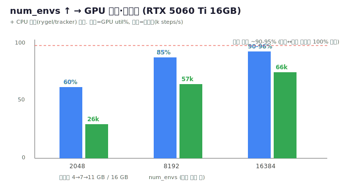

# 10 · GPU 활용 최적화 (학습 처리량)

> [!abstract] 목표
> 학습 시 GPU를 최대한 활용해 처리량을 높인다. RTX 5060 Ti(16GB)에서 util 60%→90-96%, 2.5배 처리량.



---

## 왜 GPU가 60%만 쓰였나 (진단)
`nvidia-smi`로 보니 학습 중 **GPU util 60-65%, 메모리 4GB/16GB**(여유 큼). 두 원인:
1. **num_envs가 너무 적음** — 2048 envs로는 GPU 연산/메모리를 못 채움.
2. **CPU 도둑** — `top`에서 `rygel`(GNOME 미디어서버)·`tracker-miner/extract`(파일색인)가 코어 점유 →
   env 관리·데이터전송(CPU측)이 느려져 GPU가 굶음.

## 무엇을 / 어떻게 (조치)
```bash
# 1) CPU 도둑 정지 (비필수 GNOME 서비스, sudo 불필요 — user 서비스)
systemctl --user mask rygel.service tracker-miner-fs-3.service tracker-extract-3.service
pkill -9 rygel; pkill -9 -f tracker-miner; pkill -9 -f tracker-extract
# 2) num_envs 대폭 증가 (GPU 메모리 한도까지)
python scripts/train.py --task Pygmalion-Velocity-Rough-v0 --device cuda:0 --num_envs 16384 --headless
```

## 결과 (측정값)
| num_envs | GPU util | 처리량 | GPU 메모리 |
|---|---|---|---|
| 2048 | 60-65% | 26k steps/s | 4 GB |
| 8192 | 85% | 57k steps/s | 7 GB |
| **16384** | **90-96%** | **66k steps/s** | **11 GB / 16 GB** |

## 어디까지 (한계 — 왜 100%가 안 되나)
RL 학습은 **수집(rollout, 물리 시뮬) ↔ 학습(PPO 그라디언트 업데이트)** 이 번갈아 일어난다.
업데이트 단계에선 물리 시뮬이 **잠깐 쉬므로** GPU가 100% 고정되지 않는다(실용 상한 ~90-95%).
util을 더 올리려면 envs↑(메모리 한도)·`num_steps_per_env`↑이지만, 16384에서 90-96%면 사실상 포화.

## 트레이드오프 (주의)
- envs↑ → util·iter당 데이터↑ → **수렴에 필요한 iter 수↓**. 단 **iter당 wall-clock은 길어짐**(더 많은 env step).
- 즉 "GPU 활용 최대"와 "wall-clock 최소"는 다를 수 있음. envs가 많으면 적은 iter로 수렴하므로
  `max_iterations`를 낮추거나, episode length·terrain_levels가 충분히 오르면 조기 종료해 측정에 사용.
- 메모리 한도: 16384에서 11GB. 더 키우면 OOM 위험(터레인/height-scanner 메모리 spike).

## 관련 노트
- [[04_reward_experiments]] (학습) · [[09_gpu_driver_fix]] (드라이버) · [[07_measurement]] (측정)
