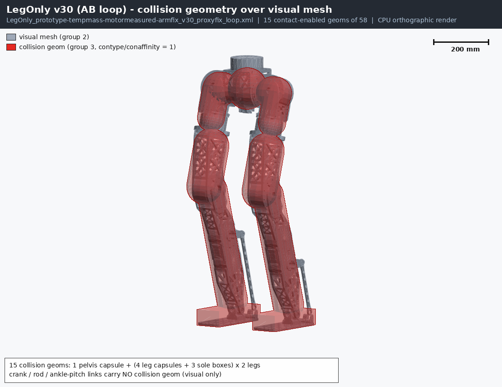
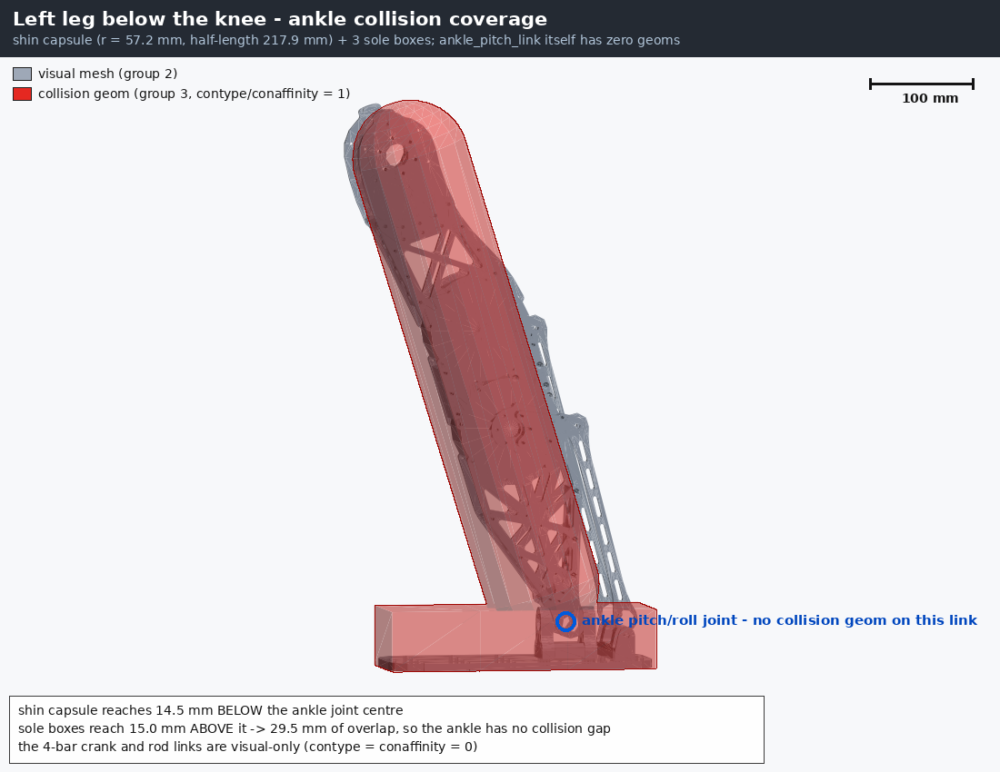
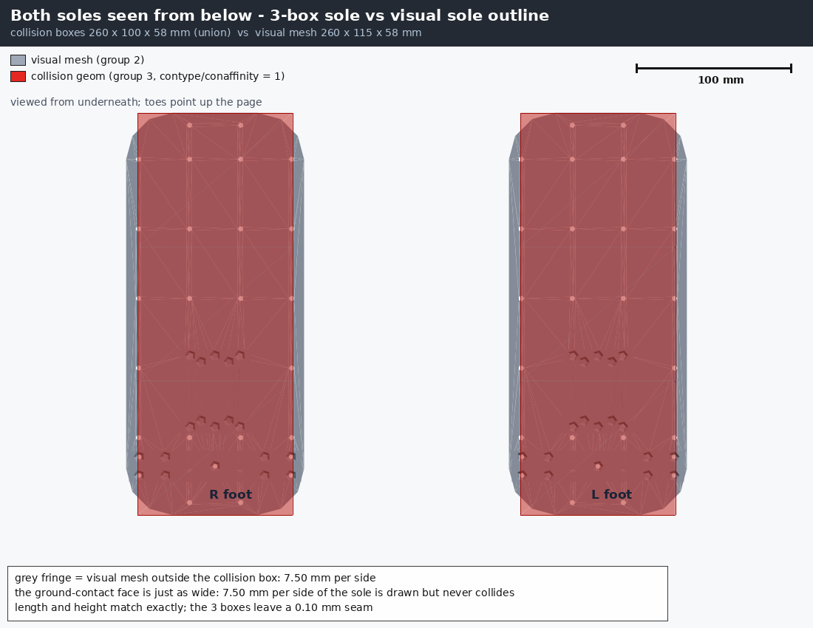
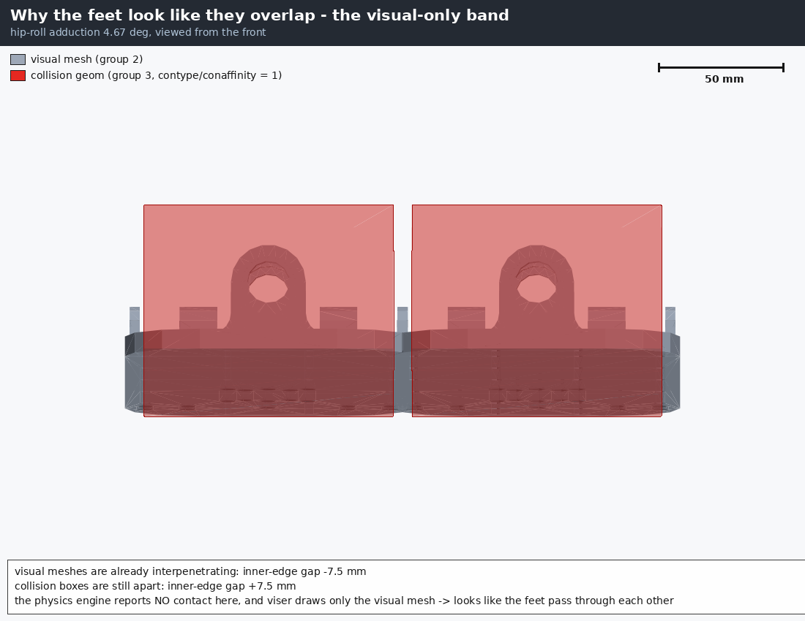

# 119. LegOnly 충돌(collision) 지오메트리 검토 — 발이 겹쳐 보이는 이유

작성일: 2026-09-03 KST
대상 모델: `LegOnly_prototype-tempmass-motormeasured-armfix_v30_proxyfix_loop.xml`
(현재 학습 중인 `legonly_ab_v1_p2`가 실제로 로드하는 파일. 학습 프로세스 환경변수
`PYG_MODEL_TAG=LegOnly_prototype-tempmass-motormeasured-armfix_v30_proxyfix` +
`PYG_ANKLE_MODE=AB` → `pygmalion_constants.py:160`의 `_MODEL_TAG + "_loop.xml"` 분기로 확인)
재현 도구: `tools/robot_model/collision_overlay_render.py`
관련: docs/117(모델 확정), 커밋 `bc2526d`(발바닥 → 3-box 전환)

> **이 문서에서는 모델을 수정하지 않았다.** 지금 돌고 있는 학습(`legonly_ab_v1_p2`)이 이
> XML을 물고 있어서, 지오메트리를 바꾸면 재현성이 깨진다. §6에 수정안만 적어 둔다.

---

## 0. 결론 먼저

**질문 1 — "지금 Ankle collision mesh 들어있나?"**

발목 링크(`L_ankle_pitch_link` / `R_ankle_pitch_link`) 자체에는 **geom이 하나도 없다**
(visual도 collision도 0개). 하지만 발목 *부피*는 충돌 계산에서 빠져 있지 않다. 정강이
캡슐이 발목 관절 중심보다 **14.5 mm 아래까지** 내려오고, 발바닥 박스가 발목 관절 중심보다
**15.0 mm 위까지** 올라와서 **29.5 mm가 겹친다**. 즉 발목 높이에 충돌 구멍은 없다.
(→ 그림 2)

**질문 2 — "발바닥이 겹치는 이유"** (a~d 후보 중 판정)

| 후보 | 판정 | 근거 숫자 |
|---|---|---|
| (a) 좌우 발 상호 충돌이 꺼져 있다 | **아님** | L↔R exclude 쌍 0개, 충돌 geom 15개 전부 contype=conaffinity=1. MuJoCo-C와 MuJoCo-Warp 양쪽 다 내전 5°부터 발-발 접촉 12~16개 보고 |
| (b) collision box가 visual보다 작다 | **★ 이것이 원인** | 발 visual 폭 **115.0 mm** vs 충돌 박스 폭 **100.0 mm** → 한쪽당 **7.50 mm**가 그려지기만 하고 부딪히지 않음. 좌우 합쳐 **15.0 mm**까지 시각적으로 파고들 수 있음 |
| (c) viser가 collision을 안 그린다 | **★ 함께 작용** | `mjviser/scene.py:155` `geom_groups_visible = [True, True, True, False, False, False]` → 그룹 3(충돌)·4(hull)은 **기본 숨김**. 브라우저에서 보이는 건 visual 메시뿐 |
| (d) 솔버의 실제 관통(soft contact) | **아님(무시 가능)** | 학습과 동일한 솔버 설정(timestep 5 ms, Newton 10 iter, pyramidal)에서 전체 체중 23.63 kg을 싣고 바닥 관통 최대 **0.320 mm** |

**한 문장 요약**: 물리는 정상이다. 발 겉모습(115 mm)이 실제 충돌 몸통(100 mm)보다 한쪽당
7.5 mm씩 넓게 그려져 있고, viser는 충돌 몸통을 아예 안 그리기 때문에, **최대 15 mm까지는
"겹쳐 보이는데 실제로는 안 닿은" 상태**가 정상적으로 발생한다. 발이 서로 통과해 버리는
버그가 아니다.

용어 풀이 — *collision geom*: 물리 엔진이 "부딪혔다"를 계산할 때 쓰는 단순 도형(상자·캡슐).
*visual mesh*: 화면에 그리는 CAD 형상. 둘은 별개이고, 로봇 시뮬레이션에서는 계산을 싸게
하려고 일부러 다르게 둔다.

---

## 1. 전신 인벤토리

충돌 판정에 참여하는 geom은 전체 58개 중 **15개**뿐이다. 나머지 43개는 visual 메시(그룹 2,
`contype=0 conaffinity=0`)와 hull 메시(그룹 4, 역시 비충돌)다.



위 그림에서 **회색이 CAD 형상(visual), 빨강 반투명이 실제 충돌 도형**이다. 골반(pelvis)에
얇은 원판 캡슐 하나, 다리 한쪽마다 캡슐 4개(hip_pitch·hip_roll·thigh·shin), 발마다 상자
3개가 전부다. 허벅지·정강이 캡슐이 CAD 형상보다 확연히 통통하게 감싸고 있는 것이 보이는데,
이건 의도된 것이다(볼록한 캡슐로 감싸면 접촉 계산이 싸고 안정적이다).

| body | geom | 타입 | group | contype | conaffinity | size (m) | pos (m) |
|---|---|---|---|---|---|---|---|
| base_link | base_pelvis_collision | capsule | 3 | 1 | 1 | r 0.0714, h/2 0.0050 | −0.0007, +0.0003, +0.0074 |
| L_hip_pitch_link | L_hip_pitch_link_collision | capsule | 3 | 1 | 1 | r 0.0614, h/2 0.0050 | −0.0006, +0.0053, −0.0018 |
| L_hip_roll_link | L_hip_roll_link_collision | capsule | 3 | 1 | 1 | r 0.0514, h/2 0.0496 | +0.0039, −0.0121, −0.0614 |
| L_thigh_link | L_thigh_link_collision | capsule | 3 | 1 | 1 | r 0.0659, h/2 0.0741 | −0.0111, +0.0005, −0.2900 |
| L_shin_link | L_shin_link_collision | capsule | 3 | 1 | 1 | r 0.0572, h/2 0.2179 | −0.0171, −0.0014, −0.2294 |
| L_foot_link | L_foot1_collision | box | 3 | 1 | 1 | 0.0433, 0.0500, 0.0290 | −0.0367, 0, −0.0140 |
| L_foot_link | L_foot2_collision | box | 3 | 1 | 1 | 0.0433, 0.0500, 0.0290 | +0.0500, 0, −0.0140 |
| L_foot_link | L_foot3_collision | box | 3 | 1 | 1 | 0.0433, 0.0500, 0.0290 | +0.1367, 0, −0.0140 |
| R_* | (좌측과 동일, y 부호 반전) | | 3 | 1 | 1 | | |

(R_hip_roll_link 캡슐 반지름만 0.0508로 좌측 0.0514와 6/100 mm 다르다. CAD 실측 hull에서
따온 값이라 좌우가 완전 대칭이 아니다. 물리적으로 의미 없는 차이.)

**충돌 geom이 아예 없는 body (10개)**:
`L/R_crank_A`, `L/R_crank_B`, `L/R_rod_A`, `L/R_rod_B`(발목 4절 링키지 8개),
`L/R_ankle_pitch_link`(2개). 앞의 8개는 visual 메시만 있고 무엇과도 부딪히지 않는다 —
발목 링키지 로드가 정강이나 반대쪽 다리를 그대로 통과할 수 있다는 뜻이다(§6-C).

---

## 2. 발목(ankle) 주변 — 구멍은 없다



파란 원이 발목 pitch/roll 관절 중심이고, 이 링크에는 geom이 0개다. 그런데 그림에서 보듯
**정강이 캡슐(빨강, 반지름 57.2 mm, 반길이 217.9 mm)**의 아래쪽 반구가 관절 중심을 지나
14.5 mm 더 내려오고, **발바닥 박스 3개**의 윗면이 관절 중심에서 15.0 mm 위까지 올라온다.
두 도형이 29.5 mm 구간에서 겹치므로 발목 높이에 충돌이 안 잡히는 틈은 없다.

계산 근거(정강이 링크 좌표계):
- 정강이 캡슐 아래 끝 = −0.2294 − 0.2179 − 0.0572 = **−0.5045 m**
- 발목 관절 = **−0.4900 m** → 캡슐이 14.5 mm 아래까지
- 발바닥 박스 윗면 = −0.4900 + 0.0150 = **−0.4750 m** → 관절보다 15.0 mm 위
- 겹침 = −0.4750 − (−0.5045) = **0.0295 m = 29.5 mm**

같은 그림에서 오른쪽 아래로 뻗은 회색 막대 두 개가 발목 4절 링키지의 로드(`rod_A`,
`rod_B`)인데, 빨강이 전혀 입혀지지 않은 것으로 이것들이 비충돌임을 확인할 수 있다.

---

## 3. 발바닥 3-box vs visual — 한쪽당 7.5 mm



발을 밑에서 올려다본 그림이다(발끝이 위쪽). 빨간 직사각형이 충돌 박스 3개를 합친 영역이고,
그 좌우로 **회색이 삐져나온 띠**가 보인다 — 이 회색 띠가 "그려지지만 절대 부딪히지 않는"
부분이다.

| 항목 | 길이 | 폭 | 높이 |
|---|---|---|---|
| 충돌 박스 3개 합집합 | 260.0 mm | **100.0 mm** | 58.0 mm |
| visual 메시 bbox | 260.0 mm | **115.0 mm** | 57.8 mm |
| 차이 | 0.0 | **15.0 mm (한쪽당 7.50)** | 0.2 mm |

길이와 높이는 사실상 정확히 일치하고, **폭만 15 mm 모자란다**. 그리고 이 폭 부족은 발
윗부분 장식이 아니라 **바닥에 닿는 면 자체**에서 그대로 나타난다 — 접지면 최하단
(z = −43.0 mm) 정점들의 y 범위가 ±57.5 mm로 박스의 ±50.0 mm보다 넓다.

박스 3개의 배치(발 좌표계 x): box1 [−80.0, +6.6], box2 [+6.7, +93.3], box3 [+93.4, +180.0] mm.
박스 사이 이음매는 **0.10 mm**로 사실상 붙어 있어 발바닥 중간에 접촉이 빠지는 구멍은 없다.

> **검토 중 정정**: 처음 단면 분석에서 "접지면은 102 mm라 오차가 1.17 mm뿐"이라는 중간
> 결과가 나왔는데, 이는 **집계 버그**였다. 메시 최저점이 z = −0.0430000324 m인데 구간
> 경계를 정확히 −0.043으로 잡아 최하단 정점 231개가 통째로 빠졌던 것이다. 올바른 값은
> 접지면에서도 **7.50 mm/side**다. 스크립트에는 이 함정을 주석과 함께 방어해 두었다
> (`inventory()`의 `sole` 선택).

---

## 4. 좌우 발 상호 충돌 — 켜져 있다 (설정 문제 아님)

- `<contact><exclude>`는 26쌍뿐이고 **전부 같은 다리 안의 인접 링크**다. 좌–우를 잇는
  exclude는 **0쌍**.
- 충돌 geom 15개 전부 `contype=1, conaffinity=1` → 비트마스크상 모든 조합이 서로 충돌 가능.
  L_foot 박스 3개 × R_foot 박스 3개 = 9쌍 모두 통과.
- 실제 접촉 생성도 확인했다. 좌우 hip_roll을 대칭으로 내전(adduction)시키며 접촉 수를 셌다:

| 내전 각 | MuJoCo-C 발–발 접촉 | MuJoCo-Warp 발–발 접촉 |
|---|---|---|
| 0.0° | 0 | 0 |
| 4.5° | 0 | 0 |
| 5.0° | 15 | 12 |
| 6.0° | 12 | 12 |
| 8.0° | 12 | 8 |
| 10.0° | 16 | 12 |

학습이 실제로 쓰는 엔진은 MuJoCo-Warp인데, C 엔진과 **같은 각도에서 접촉이 켜진다**
(개수 차이는 박스–박스 접촉점 축약 방식 차이지, 필터링 차이가 아니다). 즉 좌우 발
충돌은 학습 중에도 살아 있다.

---

## 5. 그래서 왜 겹쳐 보이나 — 결정적 그림



내전 4.67°에서 정면으로 본 두 발이다(발바닥이 수평이 되도록 발목 roll로 보정한, 실제 보행이
지나가는 자세). 이 한 장에 원인이 다 들어 있다:

- 회색 visual 메시는 이미 **−7.5 mm로 서로 파고들어 있다** (가운데에서 맞닿아 있다)
- 빨간 충돌 박스는 아직 **+7.5 mm 떨어져 있다** (가운데 빨간 띠 사이가 벌어져 있다)
- 물리 엔진은 이 자세에서 접촉을 **0개** 보고한다

viser는 빨간 박스를 안 그리므로, 사용자에게는 회색 발 두 개가 서로 뚫고 들어간 장면만
보인다. 임계각으로 보면 visual 접촉은 4.415°, 박스 접촉은 4.916°에서 시작하니
**0.50°의 hip_roll 구간**이 "겹쳐 보이지만 안 닿은" 구간이다. 각도로는 좁아 보이지만
공간으로는 15.0 mm이고, 이 근처를 지나는 자세는 보행 중 자주 나온다(내전 1°당 발 사이
간격이 약 **30.0 mm**씩 줄어든다: 0° 147.40 mm → 1° 117.38 mm).

발바닥을 수평으로 유지한 채 좌우로 접근시키면 이 어긋남은 자세와 무관하게 일정하다.
충돌 박스 간격이 정확히 0.00 mm가 되는 순간 visual 간격은 정확히 **−15.00 mm**다.

### 보조 요인: 가벼운 접촉은 벌점이 없다

`self_collisions` 리워드는 `force_threshold = 10.0 N`(가중치 −1.0)이다
(`mjlab/tasks/velocity/mdp/rewards.py:260`). **10 N 미만의 접촉은 세지 않는다.** 즉 발끼리
살짝 스치는 것은 정책 입장에서 공짜라, 발을 굳이 벌리고 다닐 이유가 없다. 물리가 막아주는
것은 "세게 밀고 들어가는" 경우뿐이고, 스치는 수준까지 붙는 자세는 학습이 적극적으로
선택할 수 있다. 겹쳐 보이는 장면이 "꽤 자주" 나오는 빈도는 이 항이 설명한다.

---

## 6. 수정안 (이번에 적용하지 않음 — 학습 재현성)

지금 돌고 있는 `legonly_ab_v1_p2`가 이 XML을 로드 중이므로 **아무것도 바꾸지 않았다.**
다음 모델 세대에서 검토할 것:

**A. 발바닥 박스 폭 100 → 115 mm** (`size` y: 0.0500 → 0.0575)
- 효과: 시각/물리 불일치 15 mm가 0이 되어 "겹쳐 보이는" 현상이 사라진다.
- 부작용: 지지다면적이 좌우로 넓어져 **횡방향 안정성이 실제보다 후해진다.** 발 폭은
  균형 난이도를 직접 정하는 값이라, 넓히면 기존 정책 대비 비교가 깨진다. 실물 발
  바닥판의 접지 폭이 정말 115 mm인지 CAD로 먼저 확인해야 한다(visual bbox가 115인 것은
  발 *전체* 최대폭이지 접지판 폭이라는 보장이 없다 — 다만 §3에서 최하단 정점도 115 mm임은
  확인했다).
- 대안: 반대로 **visual을 줄이는 게 아니라 그냥 그대로 두고** 관측만 고치는 것(아래 C).

**B. 좌우 발 최소 간격 항 추가 / self-collision 임계 하향**
- `force_threshold`를 10 N → 1~2 N으로 낮추거나, 발 사이 거리에 대한 별도 항을 두면
  스치는 접촉도 벌점이 된다.
- ★ 리워드 변경이므로 `docs/reward_research/` 사전 노트가 필수(훅이 막는다). 그리고 메모리
  규칙상 새 항은 +800 iter warm-start 시험을 먼저 거쳐야 한다.

**C. viser에서 충돌 그룹을 켜서 보기 (모델 무변경, 지금 바로 가능)**
- viser UI 좌측 패널 **"Geoms" 폴더의 `G3` 체크박스**를 켜면 빨간 충돌 도형이 같이 보인다
  (`mjviser/scene.py`의 `create_groups_gui()`가 G0~G5 체크박스를 만든다). `G4`는 hull이다.
  뷰어 표시 설정일 뿐이라 모델·물리·학습에 영향 없음.
- 이 문서의 그림을 다시 뽑고 싶으면 `tools/robot_model/collision_overlay_render.py`.

**D. 발목 링키지 로드에 충돌 geom 부여**
- `rod_A`/`rod_B`가 비충돌이라 반대쪽 다리를 통과할 수 있다. 실물에서는 간섭이므로
  얇은 캡슐을 붙이는 것이 물리적으로 맞다.
- 부작용: 접촉 쌍이 늘어 학습이 느려지고, 4절 링키지가 자기 정강이와 간섭 판정되면
  루프 구속이 불안정해질 수 있다. 붙인다면 반대쪽 다리와만 충돌하도록 contype/conaffinity
  비트를 나눠야 한다(같은 다리 쪽은 exclude).

**우선순위**: C(즉시, 무해) → A(다음 모델 세대, CAD 확인 후) → B(리워드 리서치 후) → D(선택).

---

## 7. 재현 방법

```
cd mujoco-sim/mjlab
CUDA_VISIBLE_DEVICES="" .venv/bin/python3 \
    ../../tools/robot_model/collision_overlay_render.py            # 그림 4장 + 인벤토리
CUDA_VISIBLE_DEVICES="" .venv/bin/python3 \
    ../../tools/robot_model/collision_overlay_render.py --inventory-only   # 숫자만
```

- 렌더러는 **CPU 소프트웨어 렌더**(matplotlib 직교투영 + 화가 알고리즘)다. 이 머신에는
  동작하는 EGL/OSMesa 컨텍스트가 없고(`MUJOCO_GL=egl/osmesa/glfw` 셋 다 실패), GPU는 학습이
  쓰고 있어서 `rom_sweep_video_cpu.py`와 같은 방식을 따랐다.
- 숫자는 `docs/img/legonly_collision_inventory.json`에도 저장된다.
- 다른 모델에 쓰려면 `--tag <모델태그> --model loop|serial` 또는 `--xml <경로>`.
