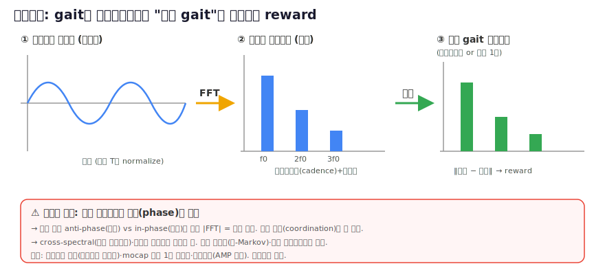

# 11 · 리서치 — 주파수영역 gait reward (비판적 평가)

> [!question] 질문 (2026-06-20)
> 사람·로봇 관절위치·각속도를 **푸리에 변환**으로 **주기 normalize**해서, 단순 모션매칭과 다르게
> **"최적 gait 사이클"과 비교**하는 reward는 유효한가? 선행연구는? Contribution이 될까?

## 한 줄 결론
**부분적으로 이미 존재 + 단독으론 약한 기여. 단 "위상정보 손실" 결함을 고치고 "궤적최적화(TO)-최적 gait와 비교" 각도로 좁히면 niche 기여 가능.** 백지 혁신은 아님.

> [!info] 📊 원문 그림 보기 (출처에서 원본 열람)
> - **주파수기반 gait 생성기 네트워크 구조**: [ar5iv 2511.17387](https://ar5iv.org/abs/2511.17387)
> - **주기 reward(von Mises 위상비용) 명세**: [ar5iv 2011.01387](https://ar5iv.org/abs/2011.01387) (Fig. 2)
> - **푸리에급수 주기 gait 계획**: [PMC9962549](https://www.ncbi.nlm.nih.gov/pmc/articles/PMC9962549/) (Figures 섹션)
*그림: 자작 개념도. 근거 — Fourier gait 표현 [Freq. Gait Generator](https://arxiv.org/abs/2511.17387), 위상 기반 주기 reward [Siekmann 2021](https://arxiv.org/abs/2011.01387), 고조파비 [Harmonic Ratio](https://pubmed.ncbi.nlm.nih.gov/23317758/). 위상손실 결함은 본문 분석.*
> 📷 원문 그림(저작권—링크): 주파수 gait 생성기 구조 [arXiv 2511.17387](https://arxiv.org/abs/2511.17387) · 주기 reward(von Mises 위상) [Siekmann 2021](https://arxiv.org/abs/2011.01387)

*주기 신호가 고조파(sine)의 합으로 분해되고 → 주파수 스펙트럼이 되는 원리. 출처: [Wikimedia Commons (자유 라이선스)](https://commons.wikimedia.org/wiki/File:Fourier_series_and_transform.gif). gait도 준주기적이라 같은 분해가 가능 = 본 아이디어의 토대.*

## 선행연구 (구성요소가 거의 다 있음)
| 구성 | 선행연구 |
|---|---|
| Fourier gait 표현+RL | [Frequency Based Gait Generator Network](https://arxiv.org/abs/2511.17387) (2025.11, 가장 근접 — 단 reward 아닌 *생성기*) · [Fourier Series Gait Planning](https://www.ncbi.nlm.nih.gov/pmc/articles/PMC9962549/) (2023) |
| 주기/위상 gait reward | [Siekmann Periodic Reward Composition](https://arxiv.org/abs/2011.01387) (ICRA'21, 표준 — von Mises 위상비용, **시간-위상**) → 리뷰 [[Paperreview/siekmann-periodic-reward]] · [Periodic Gait Reward](https://arxiv.org/abs/2506.08416) (2025) |
| gait 푸리에 품질지표 | 생체역학 **Harmonic Ratio**(체간가속 FFT 홀/짝 고조파비=대칭·부드러움) [Bellanca'13](https://pubmed.ncbi.nlm.nih.gov/23317758/), 한계 [Pasciuto'17](https://pubmed.ncbi.nlm.nih.gov/28104246/) |
| frame매칭 아닌 스타일매칭 | **AMP** [Learning to Walk/Fly w/ AMP](https://arxiv.org/pdf/2309.12784) — discriminator 분포매칭 (이미 일반적 해결) |

→ "주기 normalize + 최적 gait 비교"는 신규 아님. **"주파수영역에서 reward로 직접 비교"**만 부분적 빈공간.

## 비판적 평가 (유효성)
**장점**: gait는 준주기적(위상 normalize 표준). 푸리에=cadence·부드러움을 압축·**해석가능**(AMP 블랙박스 대비). **크기 스펙트럼=위상이동 불변** → 시간정렬 불필요, 템플릿 1개·mocap 없이 비교 가능.

**치명적 결함**:
1. **위상 손실 → 사지 협응 못잡음**. |FFT|만으론 좌우 anti-phase(걷기) vs in-phase(뛰기) **동일 점수** → cross-spectral/관절간 위상차 필요(정렬문제 일부 복귀).
2. **비-Markov/윈도우**: FFT는 1+주기 이력 필요 → reward가 history 의존(sparse 또는 위상을 state에).
3. **주파수 해상도 빈약**: 에피소드당 수 주기 → 기본+고조파 2-3개뿐 → 결국 "푸리에 계수 몇개 매칭"=기존 파라미터화의 reward판, 기준궤적 직접추종 대비 이득 작음.
4. cadence는 더 쉬운 접촉타이밍·위상 reward(Siekmann)로 이미 제어 → 주파수영역 추가가치 작음.

## Contribution 가능성
- 단독 신규 reward로 AMP/주기reward 대체 → **약함**(공간 붐빔 + 위상손실 결함).
- **방어 가능 niche**:
  1. **mocap 없이·정렬 없이 *TO-최적 gait*의 스펙트럼과 비교** ← 사용자 "최적 gait" 각도, 가장 흥미로움(대부분 imitation은 mocap이지 최적이 아님).
  2. **cross-spectral 위상**으로 협응결함 해결 → 진짜 새로움.
  3. **Harmonic Ratio를 해석가능 *보조* reward**(대칭·부드러움) → 저위험·생체역학 근거, **지금 추가하기 좋음**.
- Top venue엔 (a) AMP대비 우위실증 (b) 위상결함 해결 (c) "최적gait" 기준의 고유가치 증명 필요 → 본격 연구.

## 우리 프로젝트 적용
지금(속도추종+쉐이핑)엔 과함. "사람다움" 지름길은 계획된 **AMP(Phase 9)** 또는 Siekmann 주기reward. **Harmonic Ratio 보조항**만 저위험으로 지금 추가 가능. [[04_reward_experiments]] [[00_overview]]
