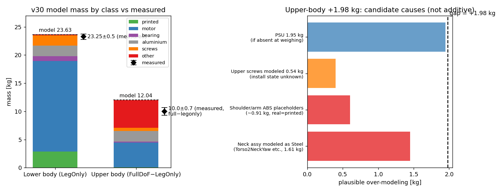

# 120. 설계(시뮬레이션) vs 실측 질량 감사 — v30 모델 (2026-09-03)

사용자 실측: **하체(LegOnly) 23.25 kg**, 상체(전신−하체 차집합) **10 kg**, 불확도 약 ±0.5 kg.

## 0. 결과 먼저

| 부위 | 모델(v30 proxyfix) | 실측 | 오차 | 판정 |
|---|---|---|---|---|
| 하체 (LegOnly) | **23.630 kg** | 23.25 ± 0.5 | **+0.380 kg (+1.6 %)** | ✅ 불확도 내. 지배 원인 = 나사 미장착(사용자 확인 사항)과 정확히 부합 |
| 상체 (FullDoF−LegOnly) | **12.044 kg** | 10.0 ± 0.7¹ | **+2.044 kg (+20 %)** | ❌ 범위 밖. 원인 = 넥·암의 **플레이스홀더 재질**(Steel/ABS) + 설치상태 미확인 부품 |
| 전신 (FullDoF) | **35.674 kg** | ≈33.25 | +2.42 kg (+7.3 %) | 상체 오차가 전부 |

¹ 차집합이므로 두 측정 불확도가 합성됨(±0.5 RSS ±0.5 ≈ ±0.7).

★부수 발견(DR 보수성, 106 G4 갭에 직결): 실측/모델 비 = **0.984**인데 현행 질량 DR의 하한은
p2.5 ≈ 0.989(링크 mass_scale, pelvis 예)이고, 체결구 완전성 DR은 **질량을 늘리는 방향만**
(CAD가 나사를 덜 그렸다는 가정, ×1.0~2.0) 감싼다. 즉 **"실물이 모델보다 가볍다"는 현실이 현행
DR 포락 밖**이다. 지금 도는 legonly_ab_v1은 약간 무거운 쪽으로 치우친 포락에서 학습 중(1.6 %
수준이라 치명적이진 않음). 다음 DR 재생성 때 완전성 범위를 양방향(예: 스케일 0.75~2.0)으로.

*좌: 부위별 모델 질량(클래스 적층)과 실측(◆). 하체는 오차막대 안, 상체는 2 kg 초과.
우: 상체 +1.98 kg의 후보 원인들(중복 가능, 합산 아님).*

## 1. 이론(모델) 질량 — 근거

XML 합산(`mujoco body_mass`, `*_v30_proxyfix_loop.xml`): FullDoF **35.6744**, SemiFullDoF
35.6744(질량 동일, DOF만 용접), LegOnly **23.6301 kg**. CAD 바디 집계(757바디 중 구조 89 +
체결구/모터/베어링, `bodies_printed_prototype_tempmass.json` → `massprops_fusion.collect`)와
0.06 kg 이내 일치(LegOnly 변형의 절단면 소부품 차이).

클래스별 분해 (다리·팔 ×2 반영, kg):

| 클래스 | 하체 | 상체 | 계 | 비고 |
|---|---|---|---|---|
| 모터 (RobStride) | 16.115 | 4.368 | 20.483 | 실측 RS03 0.9195 반영(docs/112) |
| 출력물 (PLA) | 2.839 | 0.086 | 2.925 | 실측비율 보정된 tempmass |
| 나사류 | 1.820 | 0.536 | 2.356 | 감사값 870개 2.4315(집계 기준차 소량) |
| 알루미늄 | 1.851 | 1.935 | 3.786 | 프로파일·판재 |
| 베어링 | 0.865 | 0.150 | 1.015 | |
| **기타(비-나사)** | 0.204 | **4.906** | 5.110 | ★상체 오차의 진원지, §3 |
| 합 | 23.693 | 11.981 | 35.675 | |

## 2. 하체 오차 +0.380 kg — 발생가능 범위 내인가? ✅

| 원인 | 방향 | 크기 추정 | 근거 |
|---|---|---|---|
| **나사 수량부족 미장착** (사용자 확인) | 실물↓ | 하체 나사 모델 1.90 kg의 10~25 % = **0.19~0.47 kg** | 체결구 감사: 하체 629개 1.895 kg. **Δ0.38 = 정확히 20 % 미장착에 해당** |
| PLA 출력밀도(인필) 불확실성 | 양방향 | ±0.09~0.28 kg | 출력물 2.84 kg × σ(실측부품 3 %/미실측 10 %) |
| 모터 카탈로그 공차 | 양방향 | ±0.09 kg | 13개 × ±20 g RSS |
| IMU 마운트가 Steel로 모델됨 | 실물↓ | ≤0.15 kg | IMUAdaptA/B+Chassis 0.19 kg Steel — 실물이 출력물이면 과대 |
| 케이블·커넥터 미모델 | 실물↑ | +0.1~0.3 kg(추정) | CAD에 하네스 없음 — 위 항목들과 부분 상쇄 |
| 저울·부분조립 불확도 | — | ±0.5 kg | 사용자 제시 |

판정: **+0.38 kg은 나사 미장착 단독으로도 설명되며, 전체 예산(−0.9~+0.4) 안에 넉넉히 든다.**
⚠ 가정 1건: 실측 23.25 kg에 **waist-yaw 모터(RS03 0.92 kg, 모델은 포함)가 달려 있었다**고
가정했다. 빠져 있었다면 오차는 −0.54 kg(실물이 더 무거움)으로 뒤집혀 별도 설명이 필요하다.

## 3. 상체 오차 +2.044 kg — 원인 분석 ❌ (범위 밖, 조치 필요)

상체 "기타" 4.906 kg의 대형 항목(모델값):

| 항목 | 모델 kg | CAD 재질 | 실물 추정 | 과대추정 폭 |
|---|---|---|---|---|
| PSU-RSP-2000-48 | 1.950 | Steel(스펙값) | 스펙 정확 | 0 (단, **계량 시 장착 여부 미확인** — 미장착이면 −1.95) |
| 넥 어셈블리 5부품² | 1.609 | **Steel** | 출력물이면 ~0.1-0.2 | **−1.4~−1.5** |
| 암 커넥터 3종+숄더홀더 | ~0.91 | **ABS/PMMA 솔리드** | PLA 인필 출력물 | −0.4~−0.6 |
| 상체 나사 241개 | 0.536 | Steel | 장착상태 미확인 | 0~−0.4 |

² Torso2NeckYaw 0.724 + Neck2PitchA_Main 0.408 + Neck2PitchB_Cap 0.229 + Pitch2Head 0.136 +
NeckFlange 0.112 (docs/img의 그림 우측 참조).

**판정: 넥·암 부품이 v30 재추출 때 CAD 플레이스홀더 재질(Steel/ABS) 그대로 들어왔다**
(모델명이 prototype-**tempmass**인 이유 그 자체). 어깨=출력물 원칙(docs/105 §4, 사용자 지시)이
v30 상체에는 아직 미적용. 넥이 실물에 아예 미조립이었을 가능성도 겹친다(어느 쪽이든 −1.6 kg급).
후보 (2)~(4)의 어떤 조합으로도 +2.04는 커버되므로 "미지의 오차"는 아니지만, **확정에는 실물
설치상태 확인이 필요**하다.

**사용자 확인 요청 3건**: ① 실측 23.25 kg에 waist-yaw 모터 포함? ② 전신 계량 때 PSU 장착?
③ 넥(목 2모터+헤드)·양팔 장착 상태? — 답에 따라 §3 표의 어느 행이 실제 원인인지 확정됨.

## 4. 조치 권고 (우선순위순)

1. **LegOnly 학습에는 영향 경미** — 하체 오차 +1.6 %는 DR mass_floor(±5 %) 안. 단 §0의
   방향성 문제(실물이 가벼운데 DR은 무거운 쪽 편향)는 다음 DR 재생성에서 체결구 완전성을
   양방향으로 교정(권고: included_fastener_mass_scale 0.75~2.0).
2. 상체 사용 변형(SemiFullDoF/FullDoF) 학습 **전에** 넥·암 플레이스홀더 재질을 출력물 밀도로
   재설정(`tools/fusion/set_printed_density.py` 경로 재사용) 후 상체만 재집계 — 예상 교정
   −1.8~−2.1 kg으로 실측 10 kg과 정합.
3. 실물 부분계량 1회(넥 어셈블리 단독, PSU 단독)로 §3 표를 실측 확정.

## 5. 방법·데이터 출처

- 모델: `src/mjlab/asset_zoo/.../xmls/{FullDoF,SemiFullDoF,LegOnly}_prototype-tempmass-motormeasured-armfix_v30_proxyfix_loop.xml`
- CAD 집계: `tools/robot_model/fusion_snapshots/v30_inspection/bodies_printed_prototype_tempmass.json` (757바디)
  → `massprops_fusion.collect` + `mass_dr.body_class` (학습 DR과 동일 코드 경로)
- 체결구: 동 폴더 `fastener_mass_audit.json` (870개 2.4315 kg; "약 2 kg" 발언은 기억치로 확인됨 — 모순 아님)
- DR 포락: `mass_dr_legonly_fastener50_prototype-tempmass.json` (legonly_ab_v1 사용 정본, /proc 검증)
