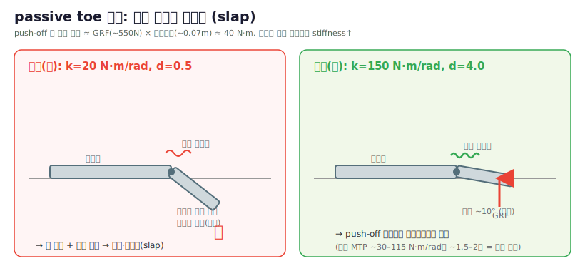

# 12 · 리서치 — passive toe 강성 (찰싹임 해결)

> [!question] 증상 (2026-06-20)
> passive toe 강성이 낮아 **그냥 걸을 때도 발끝이 찰싹거림**(slap). 실제 휴머노이드 toe 강성을 리서치해 반영.

*그림: 자작 개념도. 수치 근거 — 인체 MTP quasi-stiffness [Locomotor Speed & MTP Kinematics, PMC8093456](https://www.ncbi.nlm.nih.gov/pmc/articles/PMC8093456/) · [MTP 4-segment kinetic, PMC4101357](https://www.ncbi.nlm.nih.gov/pmc/articles/PMC4101357/), 휴머노이드 toe 스프링 [WABIAN](https://www.researchgate.net/publication/221067288_Human-like_Walking_with_Knee_Stretched_Heel-contact_and_Toe-off_Motion_by_a_Humanoid_Robot)·[Mithra](https://pmc.ncbi.nlm.nih.gov/articles/PMC12561541/), push-off 토크 산정은 본문.*
> 📷 원문 그림(저작권—링크): MTP 관절 보행 역학 그래프 [PMC8093456 Figs](https://www.ncbi.nlm.nih.gov/pmc/articles/PMC8093456/) · WABIAN-2R toe 기구 [논문](https://www.researchgate.net/publication/221067288_Human-like_Walking_with_Knee_Stretched_Heel-contact_and_Toe-off_Motion_by_a_Humanoid_Robot)

## 리서치
- **인체 MTP(발가락)관절** 보행 quasi-stiffness ≈ 0.5–1.5 N·m/deg = **~30–115 N·m/rad** (push-off에서 강직).
  단 인체는 **족저근막 windlass + 내재근**으로 능동 안정화 → 수동 로봇은 더 필요.

  > 📷 우→ 발의 MTP(중족지절)·IP 관절 위치. 출처: [Wikimedia Commons (자유 라이선스)](https://commons.wikimedia.org/wiki/File:DIP,_PIP,_IP_and_MTP_joints_of_the_foot.png). toe_joint = MTP에 해당.
- **휴머노이드 passive toe**: WABIAN-2R = 수동 toe + **비틀림 스프링**으로 heel-contact/toe-off 구현.
  가변강성 발은 0–1200 N·m/rad 범위.
  - [Variable Compliant Toe](https://www.researchgate.net/publication/301201526_Design_of_a_Variable_Compliant_Humanoid_Foot_with_a_New_Toe_Mechanism) · [Mithra feet](https://pmc.ncbi.nlm.nih.gov/articles/PMC12561541/) · [WABIAN toe-off](https://www.researchgate.net/publication/221067288_Human-like_Walking_with_Knee_Stretched_Heel-contact_and_Toe-off_Motion_by_a_Humanoid_Robot)

## 우리 로봇 산정 (51.8 kg, 수동, windlass 없음)
- push-off 시 toe 토크 ≈ GRF(~550 N) × toe 모멘트암(~0.07 m) ≈ **~40 N·m**.
- 변형을 ~10–15°(0.17–0.26 rad)로 제한하려면 stiffness ≈ 40/0.2 ≈ **~200 N·m/rad** (안전계수 고려 150–250).
- **1차 결정(150)은 과강성+발산** → [[15_toe_joint_research]] 후 **재수정**:
  > ⚠️ stiffness 150은 인간 MTP(~56)의 2.7배 과강성이고, 진짜 발산 원인은 **armature 과소**(0.0005 = Cassie 0.01225의 1/24).
  > **최종**: stiffness **60**, **armature 0.008**, damping 4, effort 60 — 슬랩 억제 + 수치 안정. (자세히 [[15_toe_joint_research]])
  damping **0.5 → 4.0** (슬랩 임팩트 흡수 = 진동/리바운드 제거). effort_limit **25 → 80** (push-off 스프링토크 60+ 클립 방지).

## 적용 (어디서)
`assets/robot_specs/robstride_biped.yaml` → `actuators.toe_passive` (stiffness/damping/effort_limit).
**actuator 속성이라 USD 재변환 불필요 — 학습 재시작만으로 적용** (run `gpu_rough_toe150`).
> 트레이드오프: 너무 높이면(>300) 강체처럼 = 컴플라이언스 이점 상실. 영상으로 슬랩 사라졌는지 확인 후 미세조정.
> 측정 시 toe 토크가 effort_limit(80) 안인지 [[07_measurement]]에서 확인.

## 관련
[[08_robot_hotswap]] (spec) · [[03_environment]] · [[07_measurement]]
