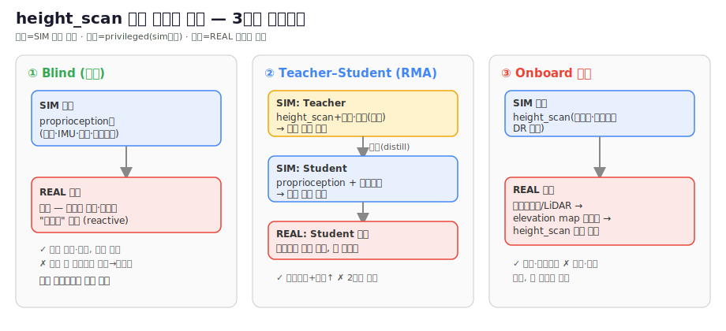

# 13 · sim2real — height_scan 없이 실기기 배포

> [!question] 질문
> sim에선 `height_scan`(발밑 지형 높이맵, raycast)을 관측에 주지만, **실기기엔 완벽한 지형맵이 없다.**
> 그럼 정책을 실제 로봇에서 어떻게 동작시키나?

## 핵심: height_scan은 "privileged"(특권) 관측 — 실기기엔 없음
sim raycast로만 공짜인 정보. 그대로 학습한 rough 정책은 **실기기 직접 배포 불가**. 표준 해법 3가지:

> [!info] 📊 원문 그림 보기 (출처에서 원본 열람 — 저작권상 복제 않고 링크)
> - **RMA teacher-student + adaptation module 구조도**: [ar5iv 2107.04034](https://ar5iv.org/abs/2107.04034) (Fig. 2)
> - **Lee 2020 privileged→proprioceptive 증류 파이프라인**: [ar5iv 2010.11251](https://ar5iv.org/abs/2010.11251) (Fig. 1)
> - **Miki 2022 perceptive belief-encoder(맵 오류에 강건)**: [ar5iv 2201.08117](https://ar5iv.org/abs/2201.08117) (Fig. 1–2)
*그림: 자작 개념도. 근거 — ① blind/teacher-student [Lee 2020](https://arxiv.org/abs/2010.11251)·[RMA](https://arxiv.org/abs/2107.04034), ③ onboard perceptive [Miki 2022](https://arxiv.org/abs/2201.08117)·[Elevation Mapping GPU](https://arxiv.org/pdf/2204.12876). 상세는 §출처.*
> 📷 원문 그림(저작권—링크): RMA 적응모듈 구조 [arXiv 2107.04034](https://arxiv.org/pdf/2107.04034) · teacher–student 파이프라인 [Lee 2020 (Science Robotics)](https://www.science.org/doi/10.1126/scirobotics.abc5986)

### ① Blind(맹목) proprioceptive 정책 — 가장 간단·강건
- **height_scan을 아예 빼고** proprioception(관절·IMU·직전액션)만으로 학습.
- 로봇이 지형을 **접촉·자세 변화로 "느껴서" 반응**(reactive). ANYmal·Cassie 등 실기기 다수가 이 방식.
- 우리 **평지 정책은 이미 blind = 배포 가능**. rough도 blind로 학습하면 됨(계단은 다소 보수적이지만 강건).
- 구현: rough env의 `observations.policy.height_scan = None` + DR 강하게.

### ② Teacher-Student 증류 (RMA류) — 성능·강건 균형, 표준
- **Teacher**: height_scan(+마찰·질량 등 특권정보)까지 보고 학습 → 최적 행동 습득.
- **Student**: 실기기 가용 관측(proprioception) + **과거 이력(history, 최근 N스텝)**만 입력 →
  이력으로 **지형/특권정보를 암묵 추정**해 teacher 모방.
- Student가 배포본(height_scan 불필요). [Kumar RMA] / ETH "robust perceptive locomotion" 계열.
- Isaac Lab엔 distillation 러너 있음(rsl_rl `Distillation`).

### ③ 온보드 지형추정 — 실제 height_scan을 센서로 재구성
- **깊이카메라/LiDAR → elevation map → height_scan** 추정해 정책에 입력.
- 지각(perceptive) 보행. 하드웨어(깊이센서)+연산 필요. ETH ANYmal perceptive가 대표.

## 우리 권장 경로
1. **지금**: 평지 blind 정책 = 이미 배포가능. **계단/경사는 ①(blind rough) 먼저** — 가장 빠른 실기기 경로.
2. **여유되면 ②(teacher-student)** — 계단 성능↑ 하면서 배포가능 유지.
3. 깊이센서 장착 시 ③.
> ⚠️ 현재 `gpu_rough_*` 정책은 height_scan 사용 = **teacher급(특권)**. 실배포엔 ①로 재학습 또는 ②로 증류 필요.

## 그 외 sim2real 갭 (동시 고려)
- 관측 노이즈(이미 enable_corruption) · DR(질량/마찰/외력, 이미 적용) · actuator 지연/마찰 모델 · 제어주기 일치.
- **actuator net**(실모터 토크-속도 곡선 식별) 권장 — RobStride 실측으로 sim 액추에이터 보정. [[07_measurement]]

## 출처 (References)
- Kumar et al., **RMA: Rapid Motor Adaptation for Legged Robots**, RSS 2021 — [arxiv 2107.04034](https://arxiv.org/abs/2107.04034) (teacher-student, 이력으로 환경 추정)
- Lee et al., **Learning quadrupedal locomotion over challenging terrain**, Science Robotics 2020 — [arxiv 2010.11251](https://arxiv.org/abs/2010.11251) (privileged teacher→proprioceptive student, blind)
- Miki et al., **Learning robust perceptive locomotion for quadrupedal robots in the wild**, Science Robotics 2022 — [arxiv 2201.08117](https://arxiv.org/abs/2201.08117) (온보드 perceptive + 강건)
- Agarwal et al., **Legged Locomotion in Challenging Terrains using Egocentric Vision**, CoRL 2022 — [arxiv 2211.07638](https://arxiv.org/abs/2211.07638)
- (휴머노이드 적용·heightmap 처리 종합은 [[14_heightmap_survey]])

## 관련
[[03_environment]] (관측·DR) · [[14_heightmap_survey]] · [[04_reward_experiments]] · [[00_overview]]
