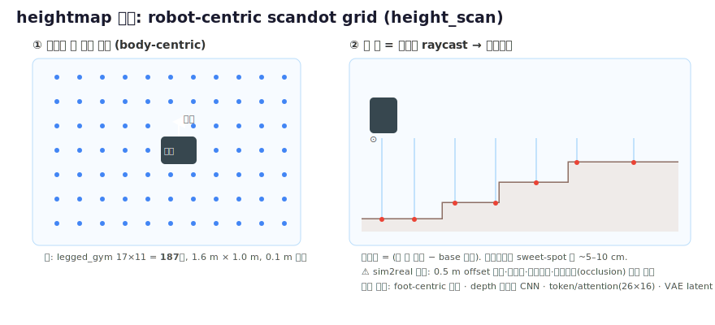

# 보행 로봇의 지형 Heightmap 처리 기술 서베이

> 하반신 이족 로봇(Isaac Lab) 엔지니어 대상. 현재 privileged `height_scan`을 쓰는 rough 정책을 실배포(sim2real)로 가져가기 위한 기술 지도.
> (조사: 7개 연구 에이전트 병렬 → 종합, 출처 §끝. 배포 3-패러다임 개념도는 [[13_sim2real_height_scan]].)

> [!info] 📊 원문 그림 보기 (출처에서 원본 열람 — 저작권상 복제 않고 링크)
> - **Blind 증류 + TCN(Lee 2020)**: [ar5iv 2010.11251](https://ar5iv.org/abs/2010.11251)
> - **RMA in-context adaptation**: [ar5iv 2107.04034](https://ar5iv.org/abs/2107.04034)
> - **온보드 perceptive(belief-encoder, elevation map)**: [ar5iv 2201.08117](https://ar5iv.org/abs/2201.08117)
> - **Egocentric vision locomotion**: [ar5iv 2211.07638](https://ar5iv.org/abs/2211.07638)
> - (그 외 §출처의 각 논문 링크에서 figure 열람)

---

## 1. 한 줄 요약 + 큰 그림

**한 줄 요약**: 지형을 보는 방법은 결국 3가지다 — (A) 아예 안 보고 접촉으로 느끼거나(blind), (B) 시뮬에서만 깨끗한 heightmap을 보는 teacher를 만들어 proprioception만 쓰는 student로 증류하거나(teacher-student), (C) 실제 로봇에 depth/LiDAR를 달아 onboard에서 elevation map을 재구성해 정책에 먹인다(onboard-perceptive). 휴머노이드는 불안정·고DoF라 quadruped처럼 완전 blind로 가기 어려워, **teacher-student 증류가 사실상 필수**이고, 이산 지형(계단·틈·sparse foothold)에는 exteroception이 반드시 필요하다.

### 3 패러다임 큰 그림

| 패러다임 | 런타임 지형 입력 | 핵심 메커니즘 | 강점 | 한계 |
|---|---|---|---|---|
| **A. Blind (proprioceptive)** | 없음 (고유감각만) | proprioception **history**를 memory(TCN/GRU/LSTM/Transformer)에 넣어 지형을 latent belief로 암시적 추론 | 가장 강건·단순, 센서 고장/안개/먼지/어둠 무관, zero-shot | **반응적(reactive)** — 접촉 후에야 지형을 알아 속도 제한, 틈/절벽/sparse foothold에서 실패 |
| **B. Teacher-Student (privileged)** | 없음 또는 egocentric depth | sim에서 heightmap을 본 teacher → proprioception(±depth)만 쓰는 student로 증류; student가 지형 latent를 history로 복원 | 배포 가능한 형태로 지형 인지 주입, 깨끗한 heightmap을 학습 신호로 활용 | student는 history가 드러내는 것만 복원 가능, teacher 품질에 상한, 여전히 대체로 반응적 |
| **C. Onboard-Perceptive** | robot-centric 2.5D elevation map 또는 raw depth | depth/LiDAR → elevation map(또는 학습 재구성) → 정책이 height grid 샘플 | **사전 예측(anticipation)** 가능, sparse foothold/계단/틈 유일한 길 | mapping 스택·odometry 의존(드리프트), 2.5D 한계(오버행 불가), 비강체 지형(눈·풀)에서 오류 |

> 실무적으로 B와 C는 배타적이지 않다. **현대 표준 = "sim의 privileged heightmap으로 teacher 학습(B) + 런타임은 onboard map 또는 depth 재구성(C) + map이 틀렸을 때 blind로 우아하게 후퇴(A)"** 의 결합이다.

---

## 2. 접근법별 상세

### A. Blind / Proprioceptive

**원리**: heightmap·카메라·LiDAR 없이 고유감각(joint pos/vel, IMU, foot contact) + gait clock + velocity command만 입력. 지형은 **과거 관측 history**를 memory 모델에 넣어 접촉 타이밍·발 슬립·예상치 못한 토크로부터 "지면 높이/접촉/마찰/외란"의 latent belief를 암시적으로 추론한다. 지배적 학습 레시피는 teacher-student privileged 증류(Lee 2020).

**대표 연구·로봇**

| 방법 | 메모리 | 로봇 | 핵심 숫자 |
|---|---|---|---|
| Privileged 증류 + TCN (Lee 2020) | TCN over history | ANYmal-B/C | DARPA SubT 4×60분 미션 locomotion 실패 0, 스텝 최대 13.4 cm, 페이로드 ~23% 불일치 견딤 |
| RMA (in-context adaptation) | ~50 timestep 1D conv | Unitree A1 | extrinsics latent ~8-dim, base 100 Hz / adapt 10 Hz, 서브초 적응; 계단 내려가기 ~70%, cement pile ~80% |
| LSTM blind stair (Siekmann 2021) | 2-layer LSTM(128+128) | Cassie | 계단 rise 10–21 cm / run 24–30 cm / 1–8단, ±1 cm 노이즈; 실측 상승 ~80% / 하강 100% (각 10회), **slatted 계단 실패** |
| Causal transformer (Radosavovic 2024) | 16-step context @50 Hz | Berkeley/Digit | heightmap 없이 수 마일 트레일, SF 31%+ 경사; arm-swing 등 자연 보행 창발 |

**장점**: 가장 강건·일반적, fine-tuning 없는 zero-shot sim2real, 센서 실패에 무관, 에너지 효율적, 배포 빠름. **모든 상용 휴머노이드의 연속 지형 기본값.**

**단점**: **근본적으로 반응적** — 물리적 접촉 전엔 적응 불가 → 거친 지형 속도 한계("발로 더듬기"), 틈/절벽/sparse foothold에서 위험. memoryless(feedforward) 정책은 같은 계단에서 실패 → **memory가 vision을 대체**하는 메커니즘임을 증명. latent가 지형 vs 페이로드를 혼동, history 길이는 고정 하이퍼파라미터 트레이드오프.

---

### B. Teacher-Student (Privileged Distillation)

**원리**: sim에서 **privileged state**(발 주변 heightmap/scandot grid + 마찰·접촉·질량·외란)를 본 teacher를 RL로 학습 → **student**가 onboard 신호만으로 teacher 행동을 모방(DAgger/BC). student는 teacher의 privileged 정보를 proprioception history(±egocentric depth)에서 추론한 latent로 압축. 두 갈래:

- **(1) Regress-to-latent 2단계 증류**: teacher가 latent를 노출, student가 history로 그 latent를 회귀 (RMA, Lee/ETH, Agarwal vision, perceptive-humanoid)
- **(2) 단일단계 asymmetric actor-critic + estimator/VAE**: privileged 정보는 critic에만, estimator가 온라인으로 context 복원 (DreamWaQ, CTS, DWL)

**대표 연구**

| 방법 | 핵심 구조 | 로봇 | 핵심 숫자 / 결과 |
|---|---|---|---|
| RMA (RSS 2021) | base(privileged param) → 8-dim extrinsics; adapt module가 ~50-step history로 회귀 | A1 | base 100 Hz / adapt 10 Hz, 모래·진흙·풀에 zero-shot |
| ETH blind (Sci Rob 2020) | privileged encoder → TCN student | ANYmal-B/C | 완전 blind, 진흙·눈·잔해·물에 zero-shot |
| ETH perceptive (Sci Rob 2022) | gated/attention **belief-state** recurrent encoder가 noisy heightmap+proprioception 융합, map 복원 | ANYmal-C | 2.2 km / 120 m Alpine 하이크 78분(인간 추정 76분), map 신뢰도 자동 게이팅 |
| Egocentric vision (CoRL 2022) | teacher scandots → student front-depth CNN + recurrent memory | A1급 | 계단 24 cm, 연석 26 cm; stepping-stone 1/16 memory-tracking 실패, 큰 음의 장애물 실패 |
| DreamWaQ (ICRA 2023) | CENet(β-VAE) explicit 속도 추정 + implicit "terrain imagination" | quadruped | 단일단계, blind 배포 |
| DWL (2024) | encoder-decoder world model이 full state 복원 | G1/H1급 | 눈·경사·계단 zero-shot, 첫 휴머노이드 야생 설지 주장 |
| Perceptive Humanoid (2025) | oracle heightmap teacher + VIB world model student | H1/G1급 | ~2 km 도심+오프로드 무개입 주행 |

**장점**: 깨끗한 heightmap을 학습 신호/복원 타깃으로 활용하면서 배포는 onboard 신호만으로. ETH belief-state는 map이 신뢰될 때 활용, 오염되면 자동으로 blind 후퇴 → map 의존 정책의 취약성 해결. 휴머노이드에서 **사실상 필수**(실세계 per-foot heightmap 불가능).

**단점**: student는 history가 드러내는 것만 복원 → teacher 품질·분포에 상한. 2단계(teacher freeze + DAgger)는 엔지니어링 부담. 여전히 대체로 반응적(anticipatory 아님) — depth 입력 없으면 음의 장애물/틈/sparse foothold 실패. 휴머노이드는 fall-prone hybrid dynamics라 증류 갭이 더 위험.

---

### C. Onboard-Perceptive (Elevation Map / Depth 재구성)

**원리**: 표준 파이프라인 = **onboard depth/LiDAR → robot-centric 2.5D elevation map → 로봇 주변 작은 height grid 샘플 → RL 정책**. 핵심 통찰은 "완벽한 map을 만드는 것"이 아니라 **"나쁜 map에 강건한 정책"**을 만드는 것. 최근(2025–26)엔 명시적 mapping 스택을 건너뛰고 raw depth에서 cross-attention으로 heightmap을 학습 재구성하는 방향.

**대표 시스템**

| 방법 | 표현 / 인코딩 | 로봇 | 핵심 숫자 |
|---|---|---|---|
| ETH 표준 파이프라인 (2022) | 2.5D elevation map, belief encoder | ANYmal-C/B/D | map ~20 Hz, 제어 50 Hz; SubT >1700 m 0낙상, Alpine 2.2 km |
| `elevation_mapping_cupy` | 10×10 m @ 4 cm/cell, ray casting + exclusion zone | ANYmal (Jetson Xavier) | RealSense 49.4 Hz / Bpearl LiDAR 20 Hz, 포인트클라우드당 ~6.86 ms(height update+raycast만 0.65 ms) |
| AME (Sci Rob 2025) | CNN(k=5) + multi-head attention(d=64, 16 heads), proprioception=Query, map cell=Key/Value | ANYmal-D(26×16), GR-1(17×11) | vs DTC +26.5%, vs baseline-RL +77.3% 성공률, 학습 60% 빠름(6 vs 14일) |
| DPL (2025) | cross-attention transformer로 depth→heightmap 재구성, occlusion-aware depth synthesis | TienKung Ultra(20 DoF) | 1.0×1.0 m / 5 cm / 20×20, 재구성 MAE 2.29–4.51 cm, latency ~20 ms, 계단 stumble 8/10→4/10 |
| Gait-Adaptive (2025) | base 아래 하향 카메라 + U-Net으로 under-base heightmap @50 Hz | LimX Oli | 1.2×0.8 m @ 5 cm, 회전 시 전방 카메라 occlusion 해결 목표 |

**장점**: **사전 foothold 예측** 가능 — sparse foothold/계단/틈의 유일한 길. map은 sensor-agnostic(LiDAR↔카메라 교체 무재학습), 계단을 어떤 방향으로도 모드 전환 없이 주파. ETH 야생 ANYmal은 zero-shot, 0낙상 야외 캠페인 실적.

**단점**: state-estimation/odometry 정확도에 강하게 의존(드리프트가 map을 직접 오염). 2.5D라 오버행/진짜 3D 표현 불가. 비강체 지형(풀·눈, geometry≠지지면)에서 실패. 전방 카메라는 회전/정지 시 occlusion으로 map이 stale. depth-only 재구성은 ANYmal map 파이프라인보다 덜 검증됨(아직 수 km 0낙상 기록 없음).

---

## 3. 휴머노이드별 실제 채택 방식

| 로봇 / 연구 | 패러다임 | 지형 입력 | 메모리 / 인코딩 | 핵심 숫자 |
|---|---|---|---|---|
| **Berkeley Digit** (Radosavovic 2024) | A. Blind | 없음 | causal transformer, 16-step @50 Hz | 4+ 마일 트레일, SF 31%+ 경사 |
| **Unitree G1/H1** (VB-Com 2025) | A. Blind+촉각 | 없음(손으로 더듬음) | history | 인지 결핍 시 손 접촉으로 보완 |
| **Cassie** (Siekmann 2021) | A. Blind | 없음 | 2-layer LSTM | 계단 상승 ~80% / 하강 100% |
| **Unitree G1 — BeamDojo** (2025) | C. Perceptive | LiDAR elevation map | 15×15 @ 0.1 m + foothold reward | sparse foothold 4/5(~80%), 실패: ~10 cm 반-발 foothold, ~55 cm 스텝, LiDAR odometry 드리프트 |
| **LimX Oli** (Gait-Adaptive, S-TS 2025) | B+C | under-base depth → U-Net heightmap | 1.2×0.8 m @ 5 cm @50 Hz | S-TS: teacher 4096 env 점유 → student 4000 iter 후 50%로 ramp; 15–20 cm 계단, 46 cm 틈, 미지 나선계단 |
| **TienKung Ultra — DPL** (2025) | B+C (depth-only) | cross-attention depth 재구성 | 20×20 @ 5 cm | MAE 2.29–4.51 cm, latency ~20 ms |
| **Unitree G1 — RPL** (2026) | B+C | ZED 2i depth(48×27) 재구성 | 1.6×1.0 m @ 10 cm 부근 | 20° 경사, 20 cm 계단, 60 cm 틈 위 25×25 cm 디딤돌, 2 kg 페이로드 |
| **Unitree H1 — Humanoid Parkour** (CoRL 2024) | C. End-to-end vision | egocentric depth(명시 map 없음) | WBC 정책 | 0.42 m 플랫폼 점프, 0.8 m 틈, 1.8 m/s 주행 |
| **Fourier GR-1 — AME** (2025) | C. Perceptive | elevation map, attention 인코딩 | 17×11(또는 13×26×3) | 첫 end-to-end DRL 휴머노이드 혼합 sparse 지형 주장 |
| **PIM** (ICRA 2025) | B+C | onboard elevation map(HIM) | robot-centered grid | 연속 계단 등반 |
| **HIT Perceptive** (2025) | B+C | onboard elevation map + VIB world model | — | **2 km 도심+오프로드 무개입** (대표 개방세계 실적) |
| **Boston Dynamics Atlas (전기)** | 상용 vision-centric | 2D/3D scene(미공개) | RL + teleop demo | parkour/백플립 데모, 방법 비공개 |
| **Tesla Optimus** | 상용 vision | FSD식 비전 신경망(미공개) | — | 미공개 |
| **Fourier GR-1 (vision-only)** | 상용 vision | 6 카메라 360°(미공개) | — | 미공개 |
| **ExBody2/OmniH2O/HumanPlus** | A. Blind (WBC tracking) | 없음(평지) | teacher-student | 표현적 전신, 지형 인지 부재 |

**참고 사양**: G1 ~23 DoF / 35 kg, H1 19-action, Digit ~45 kg / 1.6 m, LimX Oli 31 DoF / 55 kg, GR-1 55 kg / 1.65 m.

---

## 4. Heightmap 표현 / 인코딩 + 차원

### 표현 방식

| 표현 | 정의 | 대표 차원 | 비고 |
|---|---|---|---|
| **Body-centric scandot grid** (기본 baseline) | base에 고정된 직사각 grid에서 높이 샘플, base height 빼고 clip/normalize 후 flatten | legged_gym 표준 **17×11 = 187점**, 1.6 m×1.0 m (x∈[-0.8,0.8], y∈[-0.5,0.5]) | 구현 단순·저차원·해석 가능, 강한 privileged 신호. **현재 height_scan이 이것** |
| **Foot-centric / under-base patch** | 발 주변 또는 base 바로 아래에 샘플 집중 (~5 cm = 발 폭) | 1.8×1.2 m @ 5 cm 등 | foothold 관련 해상도 집중, "내 발 밑을 못 봄" 문제 해결 |
| **Token / attention map** | 각 cell = token(CNN feature + 3D 좌표), proprioception=Query, cell=Key/Value | ANYmal-D **26×16×3**, GR-1 **13×26×3** (×3 = height + 3D 좌표) | noisy/occluded cell 자동 down-weight, cross-embodiment 일반화 |
| **CNN/VAE latent 압축** | local heightmap을 저차원 latent로 압축, occlusion in-fill | — | 차원↓·denoise, 단 미세 foothold 디테일 wash-out 위험 |
| **Latent belief (map 없음)** | proprioception history로 RNN/TCN belief state 복원 | — | 카메라 무관·최강 강건, 단 look-ahead 불가 |

### 차원 / 해상도 요약

- **legged_gym height_scan**: 17×11=187점, 1.6×1.0 m. **구현 주의: 0.5 m offset을 더해 평지가 ~0으로 읽힘** (흔한 함정).
- **휴머노이드 sweet-spot**: 1.0–1.6 m extent @ 5–10 cm cell (DPL 20×20@5 cm; RPL 1.6×1.0 m@10 cm; ~6–8 cm/cell, ~0.98×0.7 m 보고).
- **proprioceptive history**: ~5 step (~400 ms @50 Hz)이 흔함; RMA는 ~50 step.
- 모든 표준 heightmap은 **2.5D** — 오버행/진짜 3D 표현 불가(능동 연구 한계).

---

## 5. Sim2Real: 노이즈 / 드롭아웃 / 재구성 / 실패모드

### 정설 레시피 (이대로 하라)

privileged teacher(깨끗한 elevation map) → **고의로 오염된 map**을 먹는 student로 증류 + belief/attention encoder가 map을 불신하고 proprioception으로 후퇴하도록 학습.

**map 노이즈는 단일 Gaussian이 아니라 다중 스코프로 주입**:

| 스코프 | 모사 대상 | 분포 |
|---|---|---|
| (1) 작은 per-cell 노이즈 | 센서 지터 | Gaussian/Laplace |
| (2) 큰 per-foot constant **offset** | pose-estimation 드리프트, 변형 지형(눈) | Laplace 근사 |
| (3) 거의 전체 corruption / **dropout** | occlusion, 센서 완전 실패 | near-total |

ETH 야생 ANYmal은 이를 'large offset' / 'large noise'로 명시 → SubT 0낙상 >1700 m, Alpine 하이크 달성.

### Depth-only 재구성 노이즈 모델 (전이 잘 됨)

- **RPL**: latency 0–20 ms, Gaussian σ=0.1·depth, ~5% 픽셀 dropout, ±2.5–3° 캘리브레이션 노이즈.
- **DPL**: 물리 기반 axial σ_z = a + b(z−μ)² + c/√z, lateral σ_L ~ α·z, **edge-aware dropout(Sobel gradient)** 로 깊이 불연속에 구멍 → 실제 센서가 실패하는 지점 재현. GPU ray-casting을 **로봇 자기 몸체 메쉬에도** 수행해 다리 self-occlusion 재현 → 재구성 오차 >30% 감소.

### 주요 실패모드

1. **Self-occlusion (#1 미해결)** — 틈 바닥·몸 아래 foothold를 못 봄, 능동 시선(gaze) 선택하는 방법 없음.
2. **Pose-estimation 드리프트** — 전체 map이 이동 (large-offset 노이즈로 대응).
3. **비강체/오인 지형** — 눈·풀·물이 지지면처럼 보임.
4. **sparse foothold에서 잘못된 map 과신** — blind 후퇴로 불충분, 정확한 재구성 또는 model-based foothold tracking(DTC)이 필요.

### 핵심 긴장과 두 해답

> **"나쁜 map에 강건"(ETH belief → blind 후퇴)** vs **"sparse foothold에 정밀"(map을 신뢰해야 함)** 은 반대 방향으로 당긴다.
> - 답 1 — **재구성 기반**(DPL/RPL): depth를 정밀 heightmap으로 복원, 단 MAE ~2–4.5 cm ≈ cell 1개라 foothold 배치엔 marginal.
> - 답 2 — **tracking 기반**(DTC, Sci Rob 2024): model-based 플래너가 foothold 생성, RL이 추종. ANYmal 0.2×0.2 m 디딤돌 2.0 m 필드 10/10, 미끄럽/변형 지면 강건.

> 주의: 다수 정량치는 demo 수준(예: 계단 stumble 8/10→4/10)이고 2026 휴머노이드 논문 다수는 pre-peer-review — 한 자릿수 시행 숫자는 신중히.

---

## 6. 우리 프로젝트 권장 경로 (height_scan rough 정책 → 실배포)

현 상태: Isaac Lab 하반신 이족, **privileged `height_scan`(scandot grid)을 직접 입력**으로 쓰는 rough 정책. 이건 sim에서만 깨끗하므로 실배포 불가. 단계적 추천:

### 단계 0 — 현 정책을 "teacher"로 재정의
- 지금 height_scan 정책을 버리지 말고 **teacher/oracle**로 보존. 여기에 ground-truth 마찰·접촉·외란·질량까지 critic 입력으로 추가(asymmetric actor-critic)해 신호를 강화.
- height_scan의 **0.5 m offset 같은 정규화 규약**과 grid 차원(예: 17×11)을 확정·문서화.

### 단계 1 — Blind student로 먼저 증류 (안전 baseline 확보)
- proprioception **history window(수십 step, ~5 step@50 Hz부터 시작, 필요시 늘림)** + estimator latent를 student 입력으로. heightmap은 sim 학습/복원 타깃으로만 사용.
- 단일단계가 편하면 **DreamWaQ/CTS식 asymmetric actor-critic + estimator(β-VAE)**, 안정성이 우선이면 **2단계(teacher freeze → DAgger)**.
- **기대치**: 연속 거친 지형·경사·완만 계단은 잘 됨. 틈/sparse foothold/큰 음의 장애물은 **반응적이라 실패** — 이게 blind의 천장. 휴머노이드 불안정성 때문에 여기서 멈추면 이산 지형은 포기해야 함.

### 단계 2 — Heightmap sim2real 강건화 (정설 레시피 적용)
- student가 먹는 map(또는 재구성 타깃)에 **3-스코프 노이즈**: 작은 per-cell + 큰 per-foot offset(드리프트) + dropout(occlusion). 미관측 cell은 학습 시 랜덤 값으로 채움.
- **belief/attention encoder**(ETH식)로 map 신뢰도를 게이팅 → map이 garbage일 때 blind로 우아하게 후퇴. 이로써 단계 1의 강건성을 잃지 않고 지형 인지를 추가.

### 단계 3 — Onboard exteroception 추가 (이산 지형이 목표일 때만)
- 하드웨어 선택:
  - **전방/하향 depth 카메라 1대 + 학습 재구성**(DPL/RPL식 cross-attention, proprioception=Query, depth=K/V). 저latency(~20 ms), SLAM 불요, blind-backbone + vision-modulator로 graceful degradation. 회전 시 occlusion엔 **under-base 하향 카메라**(Gait-Adaptive식)가 유리.
  - 또는 **LiDAR + `elevation_mapping_cupy`** (10×10 m@4 cm, Jetson에서 20–50 Hz) → 360°/후방 커버, 단 odometry 드리프트 의존.
- 인코더는 flat MLP 대신 **attention/token map 인코딩(AME식)** — noisy cell down-weight, sparse foothold 집중. **sim의 depth 노이즈 모델(RPL/DPL 수치)을 그대로 채택**해 sim2real 갭을 닫음.

### 단계 4 — 정밀 foothold가 필요하면 tracking 옵션
- 디딤돌/빔 같은 **sparse foothold**가 요구사항이면 blind 후퇴로는 부족. **DTC식 model-based foothold tracking** 또는 BeamDojo식 foothold-reward 2단계 커리큘럼(평지 soft constraint → 실제 sparse 지형 hard constraint)을 검토.

### 요약 의사결정

| 목표 지형 | 권장 경로 |
|---|---|
| 연속 거친 지형·경사·완만 계단 | 단계 1(blind student)에서 멈춰도 됨 |
| 일반 계단·중간 난이도 야외 | 단계 2 + 단계 3(depth 재구성 또는 elevation map) |
| 틈·디딤돌·빔(sparse/precise) | 단계 3 + 단계 4(tracking 또는 foothold reward) |

**핵심 원칙**: ① height_scan은 *배포 입력*이 아니라 *학습 신호*다. ② map을 절대 맹신하지 말고 blind 후퇴 능력을 항상 유지. ③ 휴머노이드는 fall-prone이라 단계 1의 강건한 blind baseline을 토대로 점진적으로 perception을 얹어라.

---

## 7. 출처

**Blind / proprioceptive**
- [Learning quadrupedal locomotion over challenging terrain (Lee et al., Science Robotics 2020)](https://www.science.org/doi/10.1126/scirobotics.abc5986) · [arXiv 2010.11251](https://arxiv.org/abs/2010.11251) · [프로젝트 페이지](https://leggedrobotics.github.io/rl-blindloco/)
- [RMA: Rapid Motor Adaptation for Legged Robots (Kumar et al., RSS 2021)](https://arxiv.org/abs/2107.04034)
- [CTS: Concurrent Teacher-Student RL for Legged Locomotion](https://arxiv.org/abs/2405.10830)
- [Blind Bipedal Stair Traversal via Sim-to-Real RL (Siekmann et al., RSS 2021)](https://arxiv.org/abs/2105.08328)
- [Real-World Humanoid Locomotion with RL (Radosavovic et al., Science Robotics 2024)](https://arxiv.org/abs/2303.03381) · [Science Robotics doi](https://www.science.org/doi/10.1126/scirobotics.adi9579)

**Teacher-student / perceptive (quadruped)**
- [Learning robust perceptive locomotion for quadrupedal robots in the wild (Miki et al., Science Robotics 2022)](https://www.science.org/doi/10.1126/scirobotics.abk2822) · [arXiv 2201.08117](https://arxiv.org/abs/2201.08117) · [프로젝트 페이지](https://leggedrobotics.github.io/rl-perceptiveloco/)
- [Legged Locomotion in Challenging Terrains using Egocentric Vision (CoRL 2022)](https://arxiv.org/abs/2211.07638) · [프로젝트 페이지](https://vision-locomotion.github.io/)
- [DreamWaQ: Implicit Terrain Imagination (ICRA 2023)](https://www.emergentmind.com/papers/2301.10602)
- [DTC: Deep Tracking Control (Jenelten et al., Science Robotics 2024)](https://arxiv.org/abs/2309.15462) · [Science Robotics doi](https://www.science.org/doi/10.1126/scirobotics.adh5401)

**Onboard mapping / 인코딩**
- [Elevation Mapping for Locomotion and Navigation using GPU (Miki et al., IROS 2022)](https://arxiv.org/abs/2204.12876) · [elevation_mapping_cupy (코드)](https://github.com/leggedrobotics/elevation_mapping_cupy)
- [Attention-Based Map Encoding (AME, Science Robotics 2025)](https://arxiv.org/abs/2506.09588) · [Science Robotics doi](https://www.science.org/doi/10.1126/scirobotics.adv3604) · [AME-2](https://arxiv.org/abs/2601.08485)
- [Learning to Walk in Minutes Using Massively Parallel Deep RL (legged_gym, Rudin et al.)](https://arxiv.org/abs/2109.11978) · [legged_gym base config](https://github.com/leggedrobotics/legged_gym/blob/master/legged_gym/envs/base/legged_robot_config.py)
- [Neural Volumetric Memory for Visual Locomotion Control](https://arxiv.org/abs/2304.01201)
- [Extreme Parkour with Legged Robots (CMU)](https://arxiv.org/abs/2309.14341)
- [SLR: Learning Quadruped Locomotion without Privileged Information](https://arxiv.org/abs/2406.04835)
- [Learning Terrain Aware Bipedal Locomotion via Reduced Dimensional Perceptual Representations](https://arxiv.org/abs/2512.12993)

**휴머노이드 (perceptive / 최신 2024–2025)**
- [Learning Perceptive Humanoid Locomotion over Challenging Terrain (2025)](https://arxiv.org/abs/2503.00692)
- [Advancing Humanoid Locomotion: Denoising World Model Learning, DWL (2024)](https://arxiv.org/abs/2408.14472)
- [Learning Humanoid Locomotion over Challenging Terrain (Digit, 2024)](https://arxiv.org/html/2410.03654v1)
- [VB-Com: Vision-Blind Composite Humanoid Locomotion (G1 & H1, 2025)](https://arxiv.org/abs/2502.14814)
- [BeamDojo: Agile Humanoid Locomotion on Sparse Footholds (G1, 2025)](https://arxiv.org/abs/2502.10363)
- [DPL: Depth-only Perceptive Humanoid Locomotion (2025)](https://arxiv.org/abs/2510.07152)
- [Gait-Adaptive Perceptive Humanoid Locomotion with Under-Base Terrain Reconstruction (LimX Oli, 2025)](https://arxiv.org/abs/2512.07464)
- [Global-Local Attention Decomposition for Terrain Encoding (G1)](https://arxiv.org/html/2606.00637v1)
- [Distillation-PPO: Two-Stage RL for Humanoid Perceptive Locomotion](https://arxiv.org/pdf/2503.08299)
- [RPL: Robust Humanoid Perceptive Locomotion on Challenging Terrains](https://arxiv.org/abs/2602.03002)
- [Learning Humanoid Locomotion with Perceptive Internal Model (PIM, ICRA 2025)](https://arxiv.org/abs/2411.14386)
- [Humanoid Parkour Learning (CoRL 2024)](https://arxiv.org/abs/2406.10759)
- [Now You See That: End-to-End Humanoid Locomotion from Raw Pixels](https://arxiv.org/abs/2602.06382)
- [PolygMap: Perceptive Framework for Humanoid Stair Climbing](https://arxiv.org/abs/2510.12346)

**표현적 전신 제어 (지형 blind, 참고)**
- [ExBody2: Advanced Expressive Humanoid Whole-Body Control](https://arxiv.org/abs/2412.13196)
- [OmniH2O: Universal Human-to-Humanoid Whole-Body Teleoperation](https://arxiv.org/abs/2406.08858)
- [HumanPlus: Humanoid Shadowing and Imitation from Humans](https://arxiv.org/abs/2406.10454)
- [Mobile-TeleVision: Predictive Motion Priors for Humanoid WBC](https://arxiv.org/abs/2412.07773)

**상용 (방법 미공개)**
- [Boston Dynamics + RAI Institute RL partnership for Atlas (보도자료)](https://rai-inst.com/resources/press-release/boston-dynamics-atlas-partnership/)
- [Atlas: research robot to industrial humanoid (BD 블로그)](https://bostondynamics.com/blog/atlas-evolution-from-research-robot-to-industrial-humanoid/)

**추가 출처 (elevation mapping / perceptive)**
- [Elevation Mapping for Locomotion and Navigation using GPU (arXiv 2204.12876)](https://arxiv.org/pdf/2204.12876)
- [Distillation-PPO: Two-Stage RL for Humanoid Perceptive Locomotion (arXiv 2503.08299)](https://arxiv.org/pdf/2503.08299)
- [MARG: Mastering Risky Gap Terrains with Elevation Mapping (arXiv 2509.20036)](https://arxiv.org/pdf/2509.20036)
- [FastStair: Learning to Run Up Stairs with Humanoid Robots (arXiv 2601.10365)](https://arxiv.org/pdf/2601.10365)

## 📷 원문 그림 (저작권 — 복제 대신 deep-link)
> 논문 그림은 저작권이라 본 노트에 복제하지 않음. 아래에서 **직접 확인**(개인 학습용 캡처는 본인이).
- **robot-centric elevation map 파이프라인**: Elevation Mapping GPU 논문 Fig.1–2 — [arXiv 2204.12876](https://arxiv.org/pdf/2204.12876)
- **teacher–student 증류 구조**: Lee 2020 Fig.1 — [Science Robotics](https://www.science.org/doi/10.1126/scirobotics.abc5986) · belief-encoder: Miki 2022 — [arXiv 2201.08117](https://arxiv.org/abs/2201.08117)
- **휴머노이드 perceptive 2-stage**: Distillation-PPO Fig.1 — [arXiv 2503.08299](https://arxiv.org/pdf/2503.08299)
- **scandot height samples 시각화**: legged_gym/Isaac terrain — [legged_gym repo](https://github.com/leggedrobotics/legged_gym)
- (우리 자작 개념도는 위 §heightmap 표현 — 수치 출처: legged_gym 17×11=187, Distillation-PPO/RPL 노이즈)
