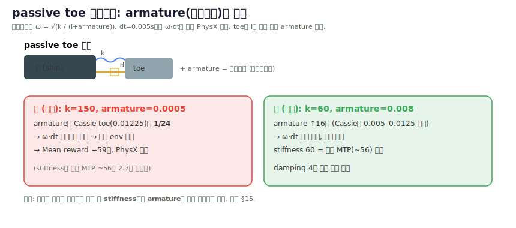

# Toe 관절 로봇의 Sim 모델링 + Sim2Real 리서치 노트

> **한 줄 요약**: Toe(MTP) 관절은 sim2real 갭이 가장 큰 부위(폐쇄 체인·접촉·비선형 스프링)이므로, 업계/RL의 실용 정답은 "passive spring-damper로 두고, **armature를 모든 조건에서 유지**해 저관성 수치불안정을 잡고, stiffness를 DR로 크게 흔드는 것"이다 — 우리의 현재 toe 값(stiffness 150 N·m/rad이 인간 생체역학 ~28–60 N·m/rad의 약 2.5–5배로 과강성, armature 0.0005가 Cassie의 1/24 수준으로 과소)은 두 방향 모두 조정이 필요하다.

*그림: 자작 개념도. 근거 — Cassie toe armature 0.01225 (Agility/OSU MuJoCo 모델), 인간 MTP ~28–60 N·m/rad. 본 리서치(§출처)로 우리 값을 stiffness 150→60, armature 0.0005→0.008로 수정 → 발산 해결. 발 해부 참고: [[12_toe_stiffness]] 의 MTP 그림.*

> ✅ **적용됨**: spec `toe_passive` = stiffness **60**, armature **0.008**, damping 4, effort 60 (run `flat_teacher`/`rough_from_flat`부터).

---

## 1. Sim 모델링: passive spring vs actuated (값 + 수치안정 + 우리 값 비교)

| 항목 | **Passive spring-damper** (인간 MTP 아날로그) | **Actuated toe** (모터 구동) | **우리 현재값** | 권고 |
|---|---|---|---|---|
| 메커니즘 | 무액추에이터 hinge, 스프링이 ref 각으로 복귀 + 가벼운 damping | leg 관절과 동일한 hinge + 모터/기어 | passive toe spring | passive 유지 (sim2real 갭 최소화) |
| **Stiffness** | 생체역학 타깃 **~0.5–1.0 N·m/deg ≈ 28–57 N·m/rad**; push-off ≈0.98 N·m/deg ≈56 N·m/rad; sim 최적 1.04 N·m/deg ≈59.6 N·m/rad | 스프링 없음(모터가 위치 제어) | **150 N·m/rad** | **과강성 → 40–60 N·m/rad로 하향** |
| **Damping** | 가볍게 (Cassie shin/tarsus 0.1, toe-free hinge damping=1) | 모터 PD의 Kd로 처리 | **4 N·m·s/rad** | 유지~소폭(스프링 낮추면 4도 합리적); damping은 **actuator 속성이 아닌 joint 속성**으로 둘 것(implicit 적분 → 안정) |
| **Armature (rotor-inertia)** | **모든 조건에서 추가 — 저관성 toe의 1차 안정화 레버**. Cassie toe armature **0.01225 kg·m²**(leg 중 최저관성인데도 명시 부여) | 동일하게 필요 | **0.0005 kg·m²** | **과소 → 0.005–0.01 kg·m²로 상향**(수치불안정 직접 해소) |
| Joint limit | MTP ROM ~45° 굴곡/70° 신전; COMAN+ ~20°(dorsi)/90°(plantar); Cassie toe −140°…−30° | 동일 | (확인 필요) | 인간 ROM 참고로 −30°~+60° 수준 |
| 접촉 | 전용 소형 capsule/box geom + 자체 collision class, soft-contact 침투깊이 ∝ 힘; 모듈 간 접촉은 명시적 exclude(불안정 방지) | 동일 | — | toe 전용 collision geom 분리 |
| 수치안정 핵심 | **armature 우선**; MuJoCo `springdamper`(timeconst+dampratio)로 관성 기반 자동 stiffness/damping 계산 → 거의 무질량 toe에 과강성 스프링이 폭발하는 것 방지 | 동일 | armature 0.0005가 핵심 원인 | **armature 상향 + stiffness 하향**이 불안정 해결의 정공법 |

**비교 결론**: 우리 toe는 (a) stiffness 150이 인간 push-off 강성(~56)의 약 2.7배로 과강성 — rollover를 죽이고 ankle로 부하를 과도하게 이전하며 toe-off가 튕김/불안정, (b) armature 0.0005가 Cassie(0.01225)의 약 1/24로 너무 낮아 저관성 수치불안정의 직접 원인. **stiffness↓ + armature↑** 두 축을 동시에 조정해야 한다.

---

## 2. Sim2Real 방법 + 실패모드 + DR

**핵심 전략 (필드 합의)**: toe를 "충실히 모델링"하기보다 **passive·적당히 강성·heavy DR**로 둔다. Actuated toe는 **action space에서 제외하고 fixed PD default로 고정**(Digit 4개 toe 모터 = 정책 비제어, model-based control에서도 널리 채택). 폐쇄 체인(four-bar+Achilles-rod)은 Isaac Gym/PhysX가 네이티브로 못 풀어 **high-stiffness "virtual spring"**(길이 편차 ∝ 힘)으로 에뮬레이트 — 이것이 sim2real 전이를 가능케 한 핵심 트릭.

**실패모드**
- **Foot/toe slap & 충격 스파이크**: sim 접촉모델이 heel-strike 충격력을 체계적으로 과소예측 → sim 튜닝 컨트롤러가 실기에서 거친 충격·불안정. articulated/compliant toe가 접촉면적을 키워 rigid foot의 edge-pivot 임펄스를 완화. → **접촉 stiffness + toe damping DR, 충격력 타이밍 검증**.
- **Numerical instability (저관성)**: armature 부족 시 toe DOF가 폭발 → **armature를 모든 조건 유지**(우리 케이스 직결).
- **Energy-return mismatch**: sim은 선형 k, 실제 스프링은 비선형·히스테리시스(고무 creep, 강재 set/fatigue) → push-off 에너지 반환 타이밍/크기 불일치 → "죽은 push-off" 또는 "튕기는 불안정 toe-off". → 강성을 고정 말고 randomize.

**Domain Randomization (보고된 값)**
- Leaf/toe **spring stiffness ±20%** (Cassie running/jumping 전이에 필수 — 스프링이 가장 압축되는 스킬에서 모델오차 영향 최대)
- **PD-gain ±30%** per joint (모터 노화/백래시/액추에이터 불확실성)
- Latency DR **0–20 ms**
- 기타: joint damping/friction/armature, link mass·inertia·CoM, ground friction

---

## 3. 로봇/논문별 toe 채택 표

| 로봇 / 논문 | passive/active | 메커니즘 | DoF / 비고 | 정량값 |
|---|---|---|---|---|
| **WABIAN-2R** (Waseda) | **Passive** (자유 toe) | 1-DoF 시상면 자유 hinge/foot당; 후속 arch+rubber bush/pad | 41 DoF, H1480mm, ~64kg; 무릎신전·heel-contact·toe-off | 강성=rubber bush/pad 유래(공개 N·m/rad 없음) |
| **SURENA III** (Tehran) | **Passive** (스프링+댐퍼) | 평발에 토셔널 스프링+댐퍼 retrofit, vision 식별 | 에너지: **ankle −15.3%, knee −9.0%** | 강성↑ ⇒ hip/knee↓·ankle↑ (load 재분배 노브) |
| **LOLA** (TUM) | **Active** | forefoot↔heel 능동 구동 link = 7-DoF leg | ~25–26 DoF, ~68kg, 176cm, 목표 5km/h; brushless | foot당 6축 F/T 2개 |
| **Cassie / Digit** (Agility) | **"toe"=actuated foot-pitch** (용어 함정) | passive는 shin/tarsus **leaf-spring four-bar**, toe 자체 아님 | leg 7DoF=5능동+2passive; 10 BLDC | toe hinge: range −140…−30°, damping=1, **armature 0.01225**; shin stiffness 1500·damping 0.1; heel-spring 1250; dt=5e-4 |
| **Atlas** (BD, electric) | **toe 관절 없음** | flat foot, 컨트롤러가 contact point를 toe edge로 이동 + foot pitch 자유 → toe-off emergent | 56 DoF | toe-off 트리거: capture point 근접 + reaction force 위치 |
| **KAIST HUBO/Gazelle** | **Active** | 2 toe 모터 **원격 구동**(distal 관성↓) | HUBO2 ~40모터; 무릎신전 gait | toe stiffness/torque 비공개 |
| **WPI/Atlas (sim)** | Active but **emergent** | toe를 토셔널 스프링으로 모델, pitch는 whole-body QP가 결정(미추적) | 28 actuated DoF; step 0.5m, swing 0.70s | toe torque ∝ pitch angle |
| **COMAN+ SoftFoot** | **Passive** | MTP revolute(~20°/90°), Gent식 강성, equality-constrained 모듈, box collider | MuJoCo open-source | damping 휴리스틱; 모듈 간 접촉 exclude |

---

## 4. Toe의 효용 + 제어 (passive vs active, push-off/energy)

**왜 toe인가 (생체역학)**: 인간 toe(MTP)는 stance의 **~75%** 동안 접지하며 terminal-stance push-off에서 에너지를 주입. 세 가지 효용:
1. **Push-off / energy return**: toe 이지 직전 토크가 강한 전방+상방 추력 → 인간 GRF의 두 번째(더 큰) toe-off 피크 재현.
2. **Heel-to-toe rollover**: 분절 발이 rigid edge pivot 대신 부드럽게 굴러 heel-strike 충돌 손실 감소.
3. **Naturalness/efficiency**: toe가 유효 다리 길이를 연장 → 무릎 펴고 보행(knee torque↓, CoM↑, 지면 클리어런스↑).

**제어 — passive vs active**
- **Passive (산업/PDW 지배적, 예: Tesla Optimus = articulated but not actuated)**: 설계 노브 = 토셔널 stiffness. **근본 트레이드오프**: 낮은 강성(~0)은 rollover에 유리, 높은 강성은 push-off에 유리 → 단일 passive 값은 항상 타협(rigid=∞는 rollover 소멸). 대표 타협값 **~0.98 N·m/deg ≈56 N·m/rad**.
- **Active (H6, WABIAN-2, LOLA, HRP, WPI/Atlas)**: 타이밍된 강한 push-off. 정량 타깃(ankle/toe 축 push-off): 토크 **30 N·m @ gait 43%** → 정규화 속도 0.40, CoT 2.25; push-off window ~41–48% gait; 피드백 변조 시 외란 제거 **≥60%** 개선. RL은 보통 toe를 fixed-PD/spring으로 두고 별도 학습 안 함.
- **중간 길 (권장 가능)**: toe trajectory를 미리 정하지 말고 토셔널 스프링으로 두어 under-constrained whole-body/정책에서 **emergent**하게.

**측정/시뮬 개선**: toe-off X·Z GRF 피크 증가, 2nd knee-angle 피크 감소, straight-knee gait, 인간형 2-peak GRF. (주의: active toe의 하드 속도/에너지 수치는 대부분 sim-only·preliminary.)

---

## 5. 우리 프로젝트 권고 (Isaac Lab, 하반신 이족, passive toe spring)

**구체 값 (현재 stiffness 150 · damping 4 · armature 0.0005 → 권고)**

| 파라미터 | 현재 | 권고 | 근거 |
|---|---|---|---|
| **stiffness** | 150 N·m/rad | **40–60 N·m/rad** (보수적 시작 50, ≈0.87 N·m/deg) | 인간 MTP push-off ~56, sim 최적 ~59.6 N·m/rad; 150은 과강성으로 rollover 소멸·ankle 과부하·toe-off 튕김 |
| **armature** | 0.0005 kg·m² | **0.005–0.01 kg·m²** | Cassie toe 0.01225(최저관성 leg 관절인데도 명시); armature는 저관성 toe의 1차 수치안정 레버 — 불안정 직접 원인 |
| **damping** | 4 N·m·s/rad | 유지(스프링 낮추면 합리적); joint 속성으로 유지 | Cassie passive 0.1~1 수준; implicit 적분 안정 |
| limit | — | 인간 ROM 참고 (~−30°…+60°) | MTP 45°굴곡/70°신전 |

> 보완: stiffness를 너무 낮추기 어렵다면 **armature 상향만으로도 수치불안정은 우선 해소** 가능. 이후 stiffness를 단계적으로 150→90→60으로 내리며 rollover/push-off 거동 확인. MuJoCo 경로라면 `springdamper`(timeconst+dampratio)로 관성 기반 자동 산정도 고려.

**Sim2Real 체크리스트**
- [ ] **armature를 모든 조건(평가 포함)에서 유지** — 끄지 말 것
- [ ] toe stiffness **±20% DR** (실제 스프링 set/fatigue·식별 불확실성 흡수)
- [ ] PD-gain **±30% DR**, latency **0–20 ms DR**
- [ ] toe **전용 collision geom**(capsule/box) + 자체 class, 인접 모듈 접촉 exclude
- [ ] damping은 **joint 속성**(actuator 아님)으로 → implicit 적분 안정
- [ ] **heel-strike 충격력·toe-off 타이밍 검증**(sim이 충격 과소예측; energy-return mismatch 주시)
- [ ] 접촉 stiffness/friction DR 추가
- [ ] 폐쇄 체인 도입 시 PhysX 한계 → high-stiffness virtual spring로 에뮬레이트
- [ ] 실기 스프링은 1095 spring-steel cantilever 두께로 k 매칭 가능(2mm=0.56 / 3.5mm=0.98 / 5mm=1.4 N·m/deg) — sim 최적 k → 강재 두께 선택
- [ ] (선택) toe를 학습 대상에서 빼고 fixed-PD/passive로 두면 sim2real 리스크 최소화

---

## 6. 출처

**Sim 모델링 / 수치안정**
- [MuJoCo Menagerie — Agility Cassie (cassie.xml)](https://github.com/google-deepmind/mujoco_menagerie/blob/main/agility_cassie/cassie.xml)
- [cassie-mujoco-sim model XML (shin spring & foot joint)](https://github.com/osudrl/cassie-mujoco-sim/blob/master/model/cassie.xml)
- [MuJoCo Docs — Modeling (springdamper, armature, damping)](https://mujoco.readthedocs.io/en/latest/modeling.html)
- [MuJoCo Docs — Computation (implicit damping integration)](https://mujoco.readthedocs.io/en/latest/computation.html)
- [Soft Adaptive Feet for Legged Robots (COMAN+ SoftFoot, MuJoCo)](https://arxiv.org/html/2412.03191v1)

**Sim2Real / DR / 실패모드**
- [Real-World Humanoid Locomotion with RL (arXiv 2303.03381)](https://arxiv.org/abs/2303.03381)
- [Real-world humanoid locomotion with RL (Science Robotics)](https://www.science.org/doi/10.1126/scirobotics.adi9579)
- [Booster Gym: End-to-End RL for Humanoid Locomotion (Isaac Gym)](https://arxiv.org/html/2506.15132v1)
- [RL for Versatile, Dynamic, Robust Bipedal Locomotion (arXiv 2401.16889)](https://arxiv.org/pdf/2401.16889)
- [Towards bridging the gap: Systematic sim-to-real for diverse legged robots (arXiv 2509.06342)](https://arxiv.org/html/2509.06342v1)
- [RL for Robust Parameterized Locomotion Control of Bipedal Robots (arXiv 2103.14295)](https://arxiv.org/pdf/2103.14295)
- [Mitigating Peak Impact Forces by Customizing Passive Foot Dynamics](https://www.researchgate.net/publication/340518457_Mitigating_Peak_Impact_Forces_by_Customizing_the_Passive_Foot_Dynamics_of_Legged_Robots)

**Toe 강성 / 생체역학 / 효용**
- [Optimizing toe joint stiffness to improve human-like walking (Sci. Reports 2025)](https://www.nature.com/articles/s41598-025-17957-4)
- [Adding adaptable toe stiffness affects energetic efficiency... (J. Theor. Biol.)](https://www.sciencedirect.com/science/article/abs/pii/S0022519315004890)
- [Study of Toe Joints to Enhance Locomotion of Humanoid Robots (Humanoids 2018, PDF)](http://crlab.cs.columbia.edu/humanoids_2018_proceedings/media/files/0186.pdf)
- [Straight-Leg Walking Through Underconstrained Whole-Body Control (arXiv 1709.03660)](https://arxiv.org/pdf/1709.03660)
- [How does ankle push-off balance walking speed and energy efficiency? (SAGE)](https://journals.sagepub.com/doi/10.1177/16878140211011905)
- [Torque Curve Optimization of Ankle Push-Off ... GA (MDPI Sensors)](https://www.mdpi.com/1424-8220/21/10/3435)

**로봇별 toe**
- [BiPed Humanoid Robot WABIAN-2R (Takanishi Lab)](http://www.takanishi.mech.waseda.ac.jp/top/research/wabian/)
- [Adding low-cost passive toe joints to SURENA III (Robotica)](https://www.cambridge.org/core/journals/robotica/article/abs/adding-lowcost-passive-toe-joints-to-the-feet-structure-of-surena-iii-humanoid-robot/624C50AB85916FAF506D11687705EA59)
- [Humanoid robot Lola: design and walking control (PubMed)](https://pubmed.ncbi.nlm.nih.gov/19665558/)
- [Feedback Control of a Cassie Bipedal Robot (arXiv 1809.07279)](https://arxiv.org/pdf/1809.07279)
- [Boston Dynamics' Atlas Walks with Straighter Legs (Tech Briefs)](https://www.techbriefs.com/component/content/article/33500-boston-dynamics-atlas-robot-walks-naturally-with-straighter-legs)
- [Human-like Walking with Knee Stretched, Heel-contact, Toe-off (KAIST, ResearchGate)](https://www.researchgate.net/publication/221067288_Human-like_Walking_with_Knee_Stretched_Heel-contact_and_Toe-off_Motion_by_a_Humanoid_Robot)
- [Stepping Forward: Active vs. Passive Toes in Humanoid Robotics (Humanoids Daily)](https://www.humanoidsdaily.com/news/stepping-forward-the-debate-over-active-vs-passive-toes-in-humanoid-robotics)
- [How we built humanoid legs in 100 days (Menlo, passive toe hinge)](https://menlo.ai/blog/humanoid-legs-100-days)
