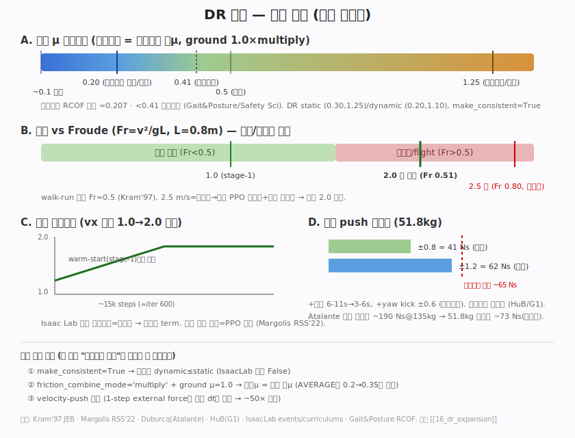

# 16 · DR 확장 — 이동속도·회전·마찰·외란 (리서치+검증)

> [!question] 요청 (2026-06-21)
> 이동속도 **2.5 m/s까지**, 제자리회전 **1.57 rad/s까지**, 마찰 **아스팔트~미끄러운 바닥**, **외란 더 세게** DR.

## 한 줄 결론
**속도는 2.0 m/s 상한이 옳다**(2.5는 달리기 영역 Fr 0.80 → 보행 PPO 불안정 + 하중 비대표). 마찰은 **static (0.30,1.25)/dynamic (0.20,1.10)** 인데 **combine_mode=multiply + ground μ=1.0**·**make_consistent=True**를 같이 넣어야 "미끄러운 바닥"이 실제 접촉에 도달. 외란 **±1.2 m/s(62 Ns) / 3–6 s / +yaw ±0.6**. 넓은 vx는 **명령 커리큘럼**으로 도달(직접 주면 붕괴).

## 적용값 (cfg)
| 항목 | 이전 | 적용 | 근거(요약) |
|---|---|---|---|
| `lin_vel_x` | (−1, 1) | **(−1, 2)** + 커리큘럼 | 2.0=walk-run 경계 Fr 0.51 (Kram'97) |
| `lin_vel_y` | (−0.6, 0.6) | (−0.6, 0.6) | 측보행 비용 ~3× 전진(PMC3917343) → 작게 유지 |
| `ang_vel_z` | (−1, 1) | **(−1.57, 1.57)** | 인간 제자리회전 최적 ~1.46 rad/s (arXiv 2001.02287) → 1.57 타당 |
| 마찰 static | (0.4, 1.25) | **(0.30, 1.25)** | 아스팔트 고무 ~1.0+; legged_gym [0.5,1.25] |
| 마찰 dynamic | (0.3, 1.0) | **(0.20, 1.10)** | 보행 RCOF ≈0.207; <0.41 조심보행 |
| `num_buckets`/`make_consistent` | 64 / — | **128 / True** | dynamic≤static 보장 (IsaacLab 기본 False) |
| ground material | μ0.5 average | **μ1.0 multiply** | 접촉μ=랜덤 발μ (압축 방지) |
| push 속도 | ±0.8 | **±1.2 m/s** (62 Ns) | < 회복한계 ~65 Ns (Atalante 스케일) |
| push 간격 | 6–11 s | **3–6 s** + **yaw ±0.6** | 고빈도 우세 (HuB/G1); 회전회복 추가 |

## 비판 포인트 (검증에서 교정됨)
1. **2.5 m/s 기각**: Fr=2.5²/(9.81·0.8)=**0.80** ≫ 전이 0.5. 달리기(flight phase)는 gait/위상 reward·기준모션·grid-adaptive 커리큘럼 필요(Cassie/mini-cheetah/3.5 m/s 휴머노이드 전부 별도 장치). **하중측정 플랫폼엔 과보폭 2.5 보행이 비대표 하중** → 목표 훼손. **상한 2.0**.
2. **마찰 combine_mode**(가장 중요): `randomize_rigid_body_material`은 **로봇 발μ**를 뽑음. 기본 **AVERAGE**면 접촉μ=avg(발0.2, 지면0.5)=0.35 → 절대 미끄럽지 않음. **지면 μ=1.0 + multiply** → 접촉μ=발μ×1.0=발μ (0.20~1.25 그대로 도달).
3. **외력 push API 함정**: 1-step `apply_external_force_torque`는 단일 dt(0.005s)만 유지 → ~50× 과소. **velocity-push**(`push_by_setting_velocity`) 사용(현 설정 OK).
4. **커리큘럼 필수**: Isaac Lab 2.2 내장은 지형뿐. 넓은 vx 직접=조기 고속명령 0 reward→PPO 붕괴(Margolis). 커스텀 `command_lin_vel_x_levels`로 vx 상한 1.0→2.0 점진(warm-start stage-1부터).

## 구현 위치
- `velocity_env_cfg.py` `__post_init__`: 마찰·push·명령 범위 + `terrain.physics_material`(multiply/1.0) + `BipedCurriculumCfg`.
- `curriculums.py`: `command_lin_vel_x_levels` (ramp_steps=15k).
- PLAY env: `curriculum.command_vel_x=None` (키보드 최대속도=전체범위).

## 출처

**속도 / Froude / 커리큘럼**
- [Margolis et al. — Rapid Locomotion via RL (RSS 2022)](https://www.roboticsproceedings.org/rss18/p022.pdf) — 격자적응 속도명령 커리큘럼으로 mini-cheetah 3.9 m/s. **왜**: 우리 명령 커리큘럼의 직접 근거 — 넓은 속도범위를 점진확장 안 하면 조기 고속명령이 0 보상→PPO 붕괴. → 리뷰 [[Paperreview/margolis-rapid-locomotion]]
- [Kram, Domingo, Ferris — walk-run 전이 Fr≈0.5 (JEB 1997)](https://www.cs.cmu.edu/~hgeyer/Teaching/R16-899B/Papers/KramEA97JEB.pdf) — 인간/동물 보행-달리기 전이가 Froude 0.5. **왜**: 2.5 m/s=달리기 영역(Fr 0.80) 정량 판정 → 상한 2.0 근거.
- [고속 휴머노이드 ~3.5 m/s (arXiv 2409.16611)](https://arxiv.org/abs/2409.16611) — kinodynamic prior로 달리기 학습. **왜**: 진짜 고속은 별도 장치 필요 = 우리가 2.5 포기한 이유.
- [IsaacLab curriculums.py](https://github.com/isaac-sim/IsaacLab/blob/main/source/isaaclab_tasks/isaaclab_tasks/manager_based/locomotion/velocity/mdp/curriculums.py) — 내장 커리큘럼=지형(terrain_levels)뿐. **왜**: 명령 커리큘럼을 커스텀으로 짜야 하는 근거.

**마찰**
- [RCOF 보행 ≈0.207 (Gait&Posture)](https://www.sciencedirect.com/science/article/abs/pii/S0966636216300820) — 인간 평지보행 마찰이용계수 평균 ~0.21. **왜**: "미끄러운 바닥" 하한 μ≈0.20의 생체역학 근거.
- [DCoF<0.41 조심보행 (Safety Science)](https://www.sciencedirect.com/science/article/abs/pii/S0925753509000903) — μ<0.41이면 인간이 조심보행 시작. **왜**: 마찰 DR 저단 구간의 물리적 의미.
- [legged_gym 기본 [0.5,1.25]](https://github.com/leggedrobotics/legged_gym/blob/master/legged_gym/envs/base/legged_robot_config.py) — 레퍼런스 RL 마찰 DR 범위. **왜**: 우리 상한 1.25의 표준 근거.
- [IsaacLab events.py (randomize_rigid_body_material)](https://github.com/isaac-sim/IsaacLab/blob/main/source/isaaclab/isaaclab/envs/mdp/events.py) — 마찰 랜덤화 구현. **왜**: `make_consistent` 기본 False → dynamic>static 샘플 방지하려면 True 필수임을 확인.
- [IsaacLab DR 토론 #2813](https://github.com/isaac-sim/IsaacLab/discussions/2813) — legged DR 실무 팁. **왜**: combine_mode 압축 등 마찰 DR 함정 파악.

**외란(push)**
- [Duburcq et al. — Atalante push recovery (arXiv 2203.01148)](https://arxiv.org/pdf/2203.01148) — 800N/400ms 펄스, per-push 램핑이 조기수렴 유발 경고. **왜**: 회복가능 충격량 ~190Ns@135kg→51.8kg 스케일 + "push 내부 램핑 금지" 근거.
- [HuB — G1 고빈도 push (arXiv 2505.07294)](https://arxiv.org/html/2505.07294) — U(0,0.5)/1s 고빈도가 저빈도-대진폭보다 효과적. **왜**: push 간격 6-11s→3-6s로 줄인 근거.
- [Push-recovery RL 50–300N (ScienceDirect)](https://www.sciencedirect.com/science/article/pii/S2090447923000564) — 휴머노이드 trunk force 시험 대역. **왜**: 외력 push 크기 sanity check.

**회전 / 측보행**
- [에너지최적 제자리회전 ~1.46 rad/s (arXiv 2001.02287)](https://arxiv.org/pdf/2001.02287) — 인간 통합에너지 최적 회전속도. **왜**: yaw 상한 1.57 타당성 근거.
- [측보행 ~3× 전진비용 (PMC3917343)](https://pmc.ncbi.nlm.nih.gov/articles/PMC3917343/) — 측보행 대사비용이 전진의 ~3배. **왜**: lin_vel_y를 작게(±0.6) 유지한 근거.

> [!info] 📊 원문 그림 보기 (저작권—원본 링크)
> - 타이어-노면 μ vs 노면상태(건/습/빙): [MDPI Machines 2025, 13(11):1005](https://www.mdpi.com/2075-1702/13/11/1005)
> - SCOF/DCOF + ANSI 0.42 임계 다이어그램: [Archtoolbox](https://www.archtoolbox.com/floor-slip-resistance-scof-vs-dcof/)
> - Atalante Fig.7 최대회복력 vs 방향(190 Ns 근거): [arXiv 2203.01148](https://arxiv.org/pdf/2203.01148)
> - Margolis grid-adaptive (vx,wz) 커리큘럼 확장: [RSS 2022 p022](https://www.roboticsproceedings.org/rss18/p022.pdf)
> - walk-run 전이속도·Froude 표: [ResearchGate tbl1/14136682](https://www.researchgate.net/figure/Walk-run-transition-speed-and-Froude-number-of-humans-at-different-gravity-levels_tbl1_14136682)

관련: [[03_environment]] [[04_reward_experiments]] [[13_sim2real_height_scan]] · 키보드 가속/댐핑·HUD 시계열은 [[06_teleop]]
