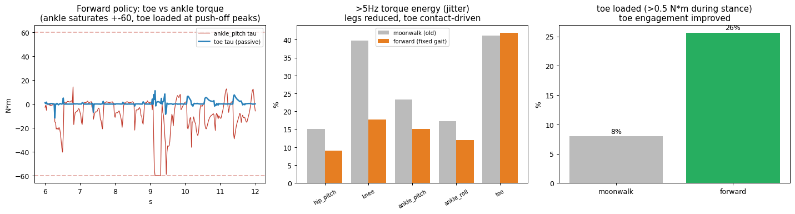

# 17 · Toe 사용도 + 발 진동 (데이터 검토 + 논문 리서치)

> [!question] 질문 (2026-06-21)
> ① Toe를 제대로 쓰고 있나? (학습데이터 검토) ② 걸을 때 발이 진동하는 이유? ③ Passive toe로 학습한 논문 있나? 어떤 reward로?

## 한 줄 결론
**Toe는 (전진 gait에서) 보조적으로 쓰임**(접지의 26%·peak 11° 변형) — 단 ankle이 포화(±60)라 더 분담 여지. **toe 보상은 추가하면 안 됨**(Digit/Cassie 등 RL은 toe를 정책 밖 수동/PD로 두고 toe 보상 없음 = 표준; toe 사용은 창발). **toe 강성 60 N·m/rad는 인간 push-off 최적(56–60)과 일치 → 유지.** **발 진동 = 고주파 액션/발목 지터**(toe 공진 아님: 과감쇠 ζ≈2.9) — 원인은 dof_acc 페널티가 hip/knee만이라 **발목 가속도 규제 0** → **전 구동관절로 확장 수정(적용)**.

## ① Toe 사용도 — 실측 데이터
| 지표 | 무한워크(수정 전) | **전진(수정 후 gait)** | ankle_pitch(참고) |
|---|---|---|---|
| 접지 중 하중>0.5N·m | 8% | **26%** | — |
| toe 토크 RMS | 0.75–1.16 | **1.6–1.9 N·m** | 14–16.6 |
| toe 토크 max | 6.7–7.3 | **11.7–11.9 N·m** | **60 (포화)** |
| 변형각 peak / mean | 6–7° / 0.5° | **11° / 0.8°** | — |

→ 방향 교정(+90°) 후 **toe 사용 3배↑** (발끝이 push-off 선행). toe가 피크 push-off에서 ~11°, 12 N·m로 하중 분담. **그러나 ankle_pitch가 ±60으로 포화** = toe가 더 실으면 ankle 부하 분산 + 안정성↑ 여지. 현재는 평발 ankle-주도 gait의 보조 수준.

## ② 발 진동 — 고주파 지터 (toe 공진 아님)
toe 감쇠비 ζ = c/(2√(k·I)) = 4/(2√(60·0.008)) ≈ **2.9 (과감쇠)** → 스프링 자체는 안 울림. 진동의 정체는 **고주파(>5Hz) 토크 지터**:
| 관절 | 무한워크 | 전진(stage-1, 수정 전) |
|---|---|---|
| knee | 40% | 18% |
| ankle_pitch | 23% | 15% |
| **toe** | 41% | **42%** (접촉 구동) |

**근본원인**: `dof_acc_l2` 페널티가 **HIP_KNEE만** → 발목·toe 가속도 규제 0 → 매 제어스텝 발목 목표가 ±진동(작은 delta의 고주파 limit-cycle, action_rate(1차)만으론 못 막음). toe 42%는 발이 매 스텝 접촉하며 받는 **충격 응답(접촉 구동)** — 다리 지터가 줄면 같이 감소.

**적용 수정(stage-2)**: `dof_acc_l2` → **전 구동관절(발목 포함)**, `action_rate` −0.005→−0.008. (추가 옵션: 2차 jerk 페널티 [CAPS], 액션 LPF — 잔여 진동 시.)

## ③ Passive toe 학습 논문 + 보상 (리서치)
| 논문/로봇 | toe | 학습 | toe 보상 |
|---|---|---|---|
| [Digit (Radosavovic, Science Robotics 2024)](https://www.science.org/doi/10.1126/scirobotics.adi9579) | 구동이나 **정책 제외**(고정 PD) | PPO+teacher, transformer, sim2real | **없음**(원문: "toe 모터 학습 안 함") |
| [Cassie RL (Li, IJRR 2024)](https://hybrid-robotics.berkeley.edu/publications/IJRR2024_Cassie_RL_Versatile_Locomotion.pdf) | foot-pitch held + 판스프링 | PPO, 스프링 ±20% DR, action-rate+accel+LPF | 없음(주기보상) |
| [Agarwal & Popovic (Humanoids 2018)](http://crlab.cs.columbia.edu/humanoids_2018_proceedings/media/files/0186.pdf) | 비틀림스프링 | QP 전신제어(모델기반) | toe-off 에너지주입, **단 heel-rise 하중 필요** |
| [toe 강성 최적화 (Sci Rep 2025)](https://www.nature.com/articles/s41598-025-17957-4) | 수동 캔틸레버 | 궤적최적화+실험 | 최적 **56–60 N·m/rad = 우리 60** |
| [Tesla Optimus (분석)](https://www.humanoidsdaily.com/news/stepping-forward-the-debate-over-active-vs-passive-toes-in-humanoid-robotics) | 수동 힌지+스프링 | RL/sim | 없음(수동 컴플라이언스) |

> **🔑 RL에서 toe-off / heel-to-toe / toe-contact 보상을 쓴 논문은 없음.** toe 사용은 항상 창발 → **toe 보상 추가 X**(우리 설계가 표준). toe를 더 쓰게 하려면 **발(ankle)을 제어해 종말기 앞발 하중**을 유도 = 정석은 **clock 기반 접촉스케줄 보상** ([Siekmann ICRA 2021](https://arxiv.org/abs/2011.01387) / [Walk-These-Ways CoRL 2022](https://github.com/Improbable-AI/walk-these-ways/blob/master/go1_gym/envs/rewards/corl_rewards.py): 스윙엔 발힘 페널티, 스탠스엔 발속도 페널티, 부드러운 Von Mises 위상으로 게이팅 → 채터도 감소). **단 gait clock을 obs에 추가 → 새 학습 필요한 큰 변경** → stage-2 결과 보고 도입 결정.

> [!info] 📊 원문 그림 (저작권—링크)
> - toe-off GRF(2차 피크) [Agarwal&Popovic Fig.6](http://crlab.cs.columbia.edu/humanoids_2018_proceedings/media/files/0186.pdf) · Von Mises 스윙/스탠스 위상창 [Siekmann Fig.3/5](https://arxiv.org/pdf/2011.01387) · 7-link vs 9-link MTP [SciRep2025 Fig.1](https://www.nature.com/articles/s41598-025-17957-4/figures/1) · CAPS 액션평활 [ai.bu.edu/caps](http://ai.bu.edu/caps/) · 게이트조건 footswing [Walk-These-Ways](https://gmargo11.github.io/walk-these-ways/)

## 출처 (검증 9에이전트)

**Toe를 정책 밖에 두는 RL 선례**
- [Radosavovic et al. — Real-World Humanoid Locomotion (Digit, Science Robotics 2024)](https://arxiv.org/html/2303.03381v2) — toe 4모터를 학습 안 하고 고정 PD. transformer 정책 + sim2real. **왜**: 우리 "toe 수동·정책 밖" 설계의 가장 강력한 직접 선례. → 리뷰 [[Paperreview/radosavovic-humanoid-transformer]]
- [Li et al. — Versatile/Robust Bipedal Locomotion (Cassie, IJRR 2024)](https://arxiv.org/pdf/2401.16889) — foot-pitch toe held + 판스프링 ±20% DR + action-rate/accel 페널티 + LPF. **왜**: 토 처리 + 진동억제(평활/필터)를 한 번에 보여주는 표준 RL biped.
- [Cassie MuJoCo 모델 (toe armature 0.01225)](https://github.com/osudrl/cassie-mujoco-sim/blob/master/model/cassie.xml) — 실제 toe armature/damping 값. **왜**: 우리 armature 0.008 튜닝의 비교 기준.

**Toe push-off 효용 + 강성**
- [toe 강성 최적화 (Scientific Reports 2025)](https://www.nature.com/articles/s41598-025-17957-4) — 최적 MTP 강성 ~56–60 N·m/rad(실험검증). **왜**: 우리 k=60이 인간 push-off 최적과 일치 → 유지 근거. → 리뷰 [[Paperreview/toe-stiffness-optimization]]
- [Agarwal & Popovic — Toe Joints for Humanoid Locomotion (Humanoids 2018)](http://crlab.cs.columbia.edu/humanoids_2018_proceedings/media/files/0186.pdf) — 비틀림스프링 toe가 toe-off에서 에너지 주입(단 heel-rise 하중 필요). **왜**: toe가 실리려면 종말기 앞발 하중이 필요함을 보임.
- [arch-toe coupling 예측시뮬 (Scientific Reports 2024)](https://www.nature.com/articles/s41598-024-65258-z) — push-off 이득은 아치-toe 결합에서 옴. **왜**: 우리는 아치가 없으니 toe 단독 이득이 제한적임을 인지.

**Toe를 쓰게 하는 보상 (접촉스케줄)**
- [Siekmann et al. — Periodic Reward Composition (ICRA 2021)](https://arxiv.org/abs/2011.01387) — clock 기반 스윙=발힘페널티/스탠스=발속도페널티. **왜**: toe를 실리게 하는 정석 보상 + 위상평활이 채터도 감소. → 리뷰 [[Paperreview/siekmann-periodic-reward]]
- [Walk-These-Ways 보상 코드 (CoRL 2022)](https://github.com/Improbable-AI/walk-these-ways/blob/master/go1_gym/envs/rewards/corl_rewards.py) — 접촉스케줄/footswing 보상의 복사가능 구현. **왜**: 우리가 그대로 참고할 코드.

**발 진동(지터) 억제**
- [CAPS — Regularizing Action Policies for Smooth Control (ICRA 2021)](https://arxiv.org/pdf/2012.06644) — 시간/공간 액션평활 정규화로 고주파 제어 ~80% 제거. **왜**: 우리 발 진동(고주파 지터) 수정의 핵심 근거. → 리뷰 [[Paperreview/caps-smooth-control]]
- [Unitree G1 config (dof_acc/action_rate, ankle kp=40/kd=2)](https://github.com/unitreerobotics/unitree_rl_gym/blob/main/legged_gym/envs/g1/g1_config.py) — 비교가능 휴머노이드 PD/페널티 값. **왜**: dof_acc 가중·발목 PD 튜닝의 레퍼런스.

관련: [[15_toe_joint_research]] (toe sim/armature) · [[04_reward_experiments]] · [[16_dr_expansion]]
