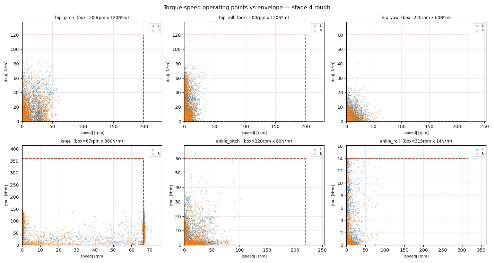
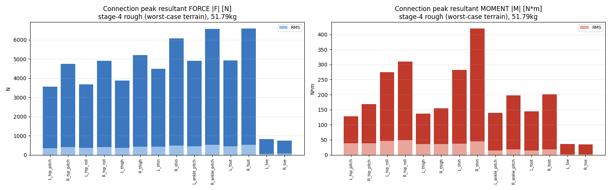

# 21 · 모터/감속비 · 부위별 파워 · 무게/페이로드 (HW 해석)

> 모터 선정·감속비·토크-속도·부위별 W·무게민감도 — HW "힘→강도/사양" 정량 근거. — 리서치 ws2d3t2mh

## ★ 모터 속도 + 토크-속도 (실측 — 토크만 보면 틀린다)
> `analyze_motor_speed.py` (omega 로깅). 모터는 **토크·속도 둘 다 한계**. % 속도한계 + 토크-속도 작동점.

| 관절 | 토크 %peak | **속도 %한계** | 진짜 병목 |
|---|---|---|---|
| **무릎(1:3, 67rpm한계)** | 51% (여유) | **106%** (71rpm) | ★**속도** — 감속비 과함 |
| **ankle_roll(RS00, 315rpm)** | 100% | **107%**(rough 337rpm) | **토크+속도 둘 다** |
| ankle_pitch(220rpm) | 100%(rough) | 48-66% | 토크 |
| hip pitch/roll/yaw | 70-95% | 21-32% | 여유 |

**핵심 (사용자 지적으로 발견)**:
1. ★ **무릎은 "토크 과설계"가 아니라 "속도 병목"** — 1:3 belt가 토크는 360(여유)인데 관절속도 한계를 66.7rpm으로 깎아, 보행이 요구하는 71rpm을 못 냄(106%). → **1:2로 낮추면**(한계 100rpm/토크 240) 속도 71%·토크 77%로 둘 다 여유. **감속비↓가 정답이되, 이유는 토크가 아니라 속도.**
2. ★ **ankle_roll(RS00)은 토크(100%)+속도(107%) 동시 포화** → **critically undersized, 상향 필수**(가장 시급).
3. ankle_pitch 토크 빠듯(속도 여유), hip 여유.
4. **부위별 peak 파워**: 무릎 ~1290W(dominant), ankle ~500W, hip ~400W, hip_yaw ~120W.

> ⚠️ **토크-속도 곡선 검증**: 위 box는 (peak토크 × max속도) 단순박스. 실모터는 고속서 토크가 강하 → 우상단 모서리 작동점은 실제론 못 냄. RobStride 공식 토크-속도 곡선으로 재검증 필요(로드맵).
> ✅ **공식 RS04 T-N 곡선 입수·검증 완료** (공식 GitHub `RS04User Manual260428.pdf` §1.3-12, 곡선 추출 = `assets/rs04_tn_curve_official.png`): 곡선은 **95rpm peak 120N·m서 단조 감소 → 190rpm ~10N·m**(no-load 200). **이전 OpenELAB 리셀러 요약 "100rpm까지 평탄, 200서 0"은 부정확** — 평탄부 corner는 ~95rpm 이하(그래프 미표시 저속), 그 위는 즉시 roll-off. 정격(연속) 40N·m@100rpm(345mm 방열판), 작은방열판 35, 스톨정격 28.5. 과부하 듀티 표·토크밀도(peak 84.5 N·m/kg, 연속 28.2)·효율맵 미공개 → 전부 [[robstride-datasheet]] 정리. **함의: 무릎/발목 trade study의 "RS04=120 flat to ~100rpm, 0 at 200" 가정은 corner를 낙관적으로 봤음** — 모터-side로 (omega,tau) 재투영해 이 곡선 아래 들어가는지 재검증 필요.

## 모터 선정 + 대안
KEEP RobStride; tune the EXTERNAL knee belt ratio rather than swapping motors. RobStride RS04 already has best-in-slot torque density (~85.7 N*m/kg peak); alternatives that match its torque (CubeMars AK80-64 at 64:1, MyActuator RMD-X8-60 at 36:1) do so only with much higher gear ratios that hurt the reflected-inertia/backdrivability you need for a learned, contact-rich gait. Current mapping is internally consistent and verified against the spec YAML: hip pitch/roll = RS04 (effort 120), hip_yaw = RS03 (60), knee = RS04 + 1:3 belt (effort 360, velocity_limit 66.7 rpm, armature 0.0875 = 0.0097*3^2 -- the ratio^2 reflected inertia is correctly baked in), ankle_pitch = RS03 (60), ankle_roll = RS00 (14). TIGHTEST 'direct' joint to watch: ankle_pitch on RS03 -- human-scaled push-off ~72 N*m exceeds RS03 rated 20 and approaches peak 60; validate it on the torque-SPEED envelope, not peak alone. CAVEAT: RS04 envelope (~120 N*m flat to ~100 rpm, linear to 0 at 200 rpm) is from a reseller summary, not the raw RobStride curve -- pull the official RS04/RS03 manual PDFs from github.com/RobStride/Product_Information and re-confirm corner speeds at your actual bus voltage before locking CAD.

### 비교표
| Model | Peak_Nm | Rated_Nm | NoLoad_rpm | Weight_g | Dims_mm | GearRatio | Kt_Nm_per_Arms | Voltage_V | Power_W | Role_in_biped |
|---|---|---|---|---|---|---|---|---|---|---|
| RS00 | 14 | 5 | 315 | 310 | 57x57x51 | 10:1 | 1.48 | 24-60 | ~170 | ankle_roll (smallest margin -> first to saturate under added/distal mass) |
| RS03 | 60 | 20 | 195 | 880 | 106x106x56 | 9:1 | 2.36 | 15-60 | 380 | hip_yaw + ankle_pitch (ankle_pitch is the tightest sagittal joint: ~72 Nm push-off vs 60 peak) |
| RS04 | 120 | 40 | 200 | 1420 | 120x120x56 | 9:1 | 2.1 | 15-60 | 700 | hip pitch/roll direct; knee via 1:3 belt |
| RS06 | 36 | 11 | 480 | 621 | 88x88x49 | 9:1 |  | 15-60 |  |  |
| CubeMars AK80-64 (alt) | 120 | 48 |  |  | O98 | 64:1 |  |  |  |  |
| CubeMars AK10-9 V3 (alt) | 53 | 18 |  |  |  | 9:1 |  |  |  |  |
| MyActuator RMD-X8-60 (alt) | 25 |  |  |  |  | 36:1 |  |  |  |  |
| Unitree GO-M8010-6 (alt) | 20 | 10 |  | 420 |  | ~6.33:1 |  |  |  |  |

## 무릎 감속비 1:3 → 1:2/2.5 판정
RECOMMEND CHANGING THE KNEE BELT FROM 1:3 TO 1:2.5. Verified trade study (RS04 = 120 N*m flat to ~100 rpm, 0 at 200 rpm):
  1:3 (current): 360 N*m peak, no-load 66.7 rpm = 6.98 rad/s, flat-torque corner ~3.49 rad/s, reflected inertia 1.00 (baseline, armature 0.0875), margin vs ~196 N*m sim peak = 1.84x.
  1:2.5 (RECOMMENDED): 300 N*m peak, no-load 80 rpm = 8.38 rad/s, corner ~4.19 rad/s, reflected inertia 0.69 (-31%, armature 0.061), margin 1.53x.
  1:2: 240 N*m peak, no-load 100 rpm = 10.47 rad/s, corner ~5.24 rad/s, reflected inertia 0.44 (-56%, armature 0.039), margin 1.22x.
RATIONALE: 360 N*m is overkill for walking (human level-walk knee ~26 N*m scaled; your own stiff-sim measured ~196 N*m flat peak). 1:2.5 keeps a comfortable ~1.5x headroom over 196 N*m for stairs/landing transients while GAINING ~20% knee speed (the binding constraint you are missing -- human knee angular velocity peaks ~5-7 rad/s in fast walking/swing, and at 1:3 torque has already started falling by 3.49 rad/s) and CUTTING reflected rotor inertia 31% (ratio^2), which improves backdrivability, impact tolerance, and sim2real. Keep 1:3 ONLY if unclipped logs show repeated landing/stair knee spikes above ~240 N*m; go to 1:2 only if the gait demands knee speeds >~6 rad/s with torque staying under 240. DO NOT pick the ratio from peak torque alone -- pick it on the torque-SPEED envelope. IMPLEMENTATION: changing the ratio means editing THREE YAML fields together (knee effort_limit, velocity_limit_rpm, armature = 0.0097*N^2) PLUS the MOTOR_RATING['knee'] constant in BOTH analyze.py (line 31) and analyze_motor_util.py (line 32), else util% charts go wrong. It is a runtime/YAML change -- no USD reconvert. VALIDATE the change by retraining and confirming knee (omega,tau) points stay inside the RS04 envelope with margin at both the high-torque (stairs/landing) and high-speed (fast swing) corners.

## 토크-속도 검증 (peak/정격만 보면 안 되는 이유)
WHY IT MATTERS: peak torque and max speed are NOT simultaneously available on a QDD. The RS04 envelope is flat ~120 N*m only up to ~100 rpm, then ramps linearly to 0 at 200 rpm (constant-power / back-EMF region); RS03 similarly ~60 N*m to low rpm, 0 at ~195 rpm. A peak-torque-only check (which is all analyze.py / analyze_motor_util.py currently do) passes joints that actually fail at speed -- e.g. a fast knee swing or quick recovery step can land on the falling part of the curve where available torque < peak. The knee at 1:3 (no-load only 6.98 rad/s, torque dropping by 3.49 rad/s) is exactly where this bites.

HOW TO VALIDATE (concrete, uses data you already log once omega is added): for each joint take the per-step (tau, omega) pairs, reflect to the MOTOR side -- motor_torque = joint_torque/(N*eta), motor_speed = joint_speed*N (N = belt 1:3, plus the internal 9:1 already inside the RobStride for absolute rotor speed) -- and scatter-plot them UNDER the motor's torque-speed envelope. Every operating point must sit inside with margin. Check TWO worst cases separately: the high-TORQUE point (stairs/landing, from --effort_scale>1 unclipped runs) AND the high-SPEED point (fast swing). Add a THERMAL check: tau_rms = sqrt(mean(tau^2)) over the duty cycle must sit <= continuous rated torque AND in the continuous region of the curve (peak on these QDDs is ~2.5-3x rated: RS04 120/40, RS03 60/20, RS00 14/5 -> peak-only checks miss thermal failure). Spot-checked copper losses are modest (knee ~6.6 A motor-side -> ~10 W; ankle_pitch ~3.5 A -> ~7 W), so the SPEED corner, not copper heating, is the binding limit at the knee.

## 부위별 파워(W) 해석 방법
PER-JOINT POWER ANALYSIS METHOD (two stages; Stage 1 is a one-line-class infra fix that unblocks everything).

STAGE 1 -- CLOSE THE LOGGER GAP (verified): wrench_logger.py record() reads joint_vel at line 72 but the write loop (lines 83-84) only writes tau_<joint>. ADD inside that loop: row['omega_<name>'] = float(joint_vel[j]) and row['P_mech_<name>'] = float(tau[j]*joint_vel[j]). (joint_pos at line 71 is likewise read-but-unwritten -- expose joint_pos_<name> too if you want per-stride work integrals.) Both tau (applied_torque) and joint_vel are OUTPUT-side / post-gear, which is exactly what P=tau*omega needs. Without omega logged, no offline power analysis is possible -- this is the single gap.

MECHANICAL power: P_mech(t) = tau_joint * omega_joint [W]. Sign is physical: P>0 = motor work (push-off, swing init); P<0 = absorption/braking (heel strike, knee yield). Current e-actuators have no regen -> use the zero-regeneration model: positive-only E+ = integral of max(0,P) dt counts toward energy; negative is dissipated. This feeds CoT = sum_j integral(max(0,tau*omega)) / (m*g*d).

ELECTRICAL power (the budget that sizes battery/bus/thermals; LARGER than mechanical): per joint P_elec = max(0,tau*omega)/eta_drive + 1.5*I_motor^2*R_phase + P_idle, where I_motor = tau_joint/(Kt*G*eta_gear). Use datasheet constants: RS04 Kt=2.1, R=0.16, G=9 (knee G_eff=27 at 1:3 / 22.5 at 1:2.5); RS03 Kt=2.36, R=0.39, G=9; RS00 Kt=1.48, G=10 (R NOT published -> estimate from Kt/rated current or bench-measure -> leaves ankle_roll copper term approximate). The 1.5*I_pk^2*R == 3*I_rms^2*R for 3-phase. eta_drive (gear+inverter, ~0.7-0.85; start at 0.80) is the LARGEST error source -> treat electrical W as +-15-20% until bench-calibrated. Validated functional form on a real humanoid joint: P = a*tau*omega + b*tau^2 + c*|omega| + d*omega^2 (Unitree G1 arm, arXiv 2606.15915, R^2 0.93-0.97) -- consider identifying per-joint coefficients on a RobStride test stand later. P_idle (holding torque copper loss at omega=0) is NONZERO -- include it.

PEAK vs RMS is the core sizing distinction: report BOTH per joint. PEAK W/torque -> inverter current limit, bus cap, battery surge, transient thermal. RMS (tau_rms=sqrt(mean(tau^2)), which analyze.py already computes) -> continuous thermal; size so tau_rms <= rated AND (omega,tau_rms) lands in the continuous region of the torque-speed curve.

PRESENTATION (extend analyze.py / analyze_motor_util.py, mirroring their existing 3-panel torque style): (1) per-joint grouped bar chart, peak-W vs continuous(RMS)-W side by side with a horizontal rated-W reference line; (2) single headline TOTAL average W (battery capacity / runtime) and TOTAL peak W (PSU/battery surge), summed over the 12 active joints + per-joint idle -- EXCLUDE the passive toe from electrical totals (analyze_motor_util.py already drops 'toe' at line 59) but INCLUDE toe spring power in mechanical/CoT; (3) a CoT number; (4) per-joint torque-speed scatter overlaid on each actuator envelope -- the real validity check.

## 무게/페이로드 민감도 (질량 sweep)
WEIGHT / PAYLOAD SENSITIVITY EXPERIMENT (Stage 2, after the power-logger fix).

THREE SCALING LAWS (human-biomech priors, set DIRECTION not exact numbers): (1) static/support torque scales ~LINEARLY with total mass (tau ~ m*g*lever); (2) at fixed gait speed, mechanical AND electrical power scale ~LINEARLY with mass (Griffin/Roberts/Kram 2003: net rate ~ direct proportion to load; Grabowski 2005: body-weight support ~28% of walking cost); (3) mass LOCATION matters -- trunk/COM mass behaves like a body-weight increase and IS captured by uniform scaling, but DISTAL leg/foot mass adds swing-leg inertia and costs disproportionately more per kg (Browning 2007; Royer/Martin 2005). So for +10 kg on 51.8 kg (~+19%) expect ~+15-25% support torque and average power, MORE in push-off/impact; and your tiny RS00 ankle_roll (14 N*m peak) is the first actuator to saturate, especially under distal load.

WHY RE-MEASURE, NOT EXTRAPOLATE: the RL policy re-optimizes the whole gait for each mass (step length, cadence, stance time, push-off, trunk lean, load distribution all shift), so the (tau,omega) timeseries is a different function of mass -- linear extrapolation of one run is invalid. Also +10 kg is OUTSIDE the training DR band (add_base_mass is only +-5 kg, velocity_env line 172), so a single play rollout at +10 kg will look degraded -> RETRAIN or at least fine-tune at the target mass.

EXPERIMENT MATRIX (infra already supports it):
 - Uniform body-mass sensitivity: mass_scale in {0.8, 1.0, 1.2} via measure.py --mass_scale (-> mass_utils.apply_mass_scale, which scales mass AND inertia via the PhysX view, lines 26-44).
 - Location pair (isolates law 3): {+10 kg at torso} via measure.py --base_mass (-> set_base_mass on base_link, lines 47-62) vs {+5 kg per distal foot/shank} via apply_mass_scale(body_regex='.*_foot_link' or '.*_shin_link').
 - Terrains: flat and rough+push.
HOLD CONSTANT across mass points: identical command SCHEDULE (measure.py SCHEDULE) and seed, so differences are mass-driven not command-driven. RETRAIN/fine-tune the policy at each mass point before measuring.
MEASURE per point: per-joint peak & RMS tau, util% vs rated/peak (analyze_motor_util.py), peak/RMS/total electrical W and CoT (new power code), GRF peak + loading rate, 6-axis link wrench, base height. Re-read total mass per point with get_mass_summary so CoT uses the correct m.
DESIGN GUIDANCE TO REPORT: place the ~10 kg payload HIGH and CENTERED near torso COM (set_base_mass) -- distal placement disproportionately loads swing legs and saturates RS00 ankle_roll first; flag ankle_roll in the util% chart as the binding actuator under payload.

## 출처
- [Optimizing toe joint stiffness to improve human-like walking (Nature Sci Rep 2025) -- human-like optimum 0.98 N*m/deg = 56 N*m/rad ~= your k=60; lower stiffness aids rollover, higher aids push-off](https://www.nature.com/articles/s41598-025-17957-4) — _toe_ablation_
- [Effect of upward curvature of toe springs on walking biomechanics (PMC7499201) -- stiffer toe reduces MTP negative work -2.81 -> -1.81 J](https://pmc.ncbi.nlm.nih.gov/articles/PMC7499201/) — _toe_ablation_
- [Deep RL at the Edge of the Statistical Precipice / RLiable (Agarwal et al. NeurIPS 2021) -- IQM + stratified bootstrap CIs for few-seed evaluation](https://proceedings.neurips.cc/paper_files/paper/2021/file/f514cec81cb148559cf475e7426eed5e-Paper.pdf) — _toe_ablation_stats_
- [Deep Reinforcement Learning that Matters (Henderson et al. 2017) -- seed-to-seed variance, need shared seeds for fair ablation](https://arxiv.org/pdf/1709.06560) — _toe_ablation_stats_
- [Validation of a Measure of Smoothness of Walking (Harmonic Ratio of trunk acceleration)](https://pmc.ncbi.nlm.nih.gov/articles/PMC3032432/) — _toe_ablation_
- [cadop/fusion360descriptor -- Fusion 360 URDF exporter (GUI, WYSIWYG STL, name mapping, visual/collision)](https://github.com/cadop/fusion360descriptor) — _fusion360_
- [syuntoku14/fusion2urdf -- Fusion 360 URDF export (component/joint/base_link rules, inertials)](https://github.com/syuntoku14/fusion2urdf) — _fusion360_
- [Isaac Sim MJCF Importer Extension -- naming rules, ArticulationRootAPI, body-tree nesting (the /Robot/base_link/<body> quirk)](https://docs.isaacsim.omniverse.nvidia.com/latest/importer_exporter/ext_isaacsim_asset_importer_mjcf.html) — _fusion360_
- [NVIDIA PhysX 5.3 Geometry -- convex mesh 255-vertex limit, convex-only rigid colliders](https://nvidia-omniverse.github.io/PhysX/physx/5.3.0/docs/Geometry.html) — _fusion360_
- [Isaac Lab Simulation Performance and Tuning -- remove non-essential colliders, primitives over meshes, GPU/CPU fallback](https://isaac-sim.github.io/IsaacLab/main/source/how-to/simulation_performance.html) — _fusion360_
- [RobStride Product_Information (official GitHub: manuals + spec PDF) -- pull official torque-speed curves + rotor inertia here](https://github.com/RobStride/Product_Information) — _motor_gear_
- [OpenELAB RobStride 04 complete guide -- envelope ~120 N*m to ~100 rpm, 0 at 200 rpm; Kt 2.1, R 0.16 ohm (reseller, verify vs official)](https://openelab.io/blogs/learn/robstride04-qdd-120n-m-integrated-joint-bldc-gear-motor-complete-guide) — _motor_gear_
- [Zhu & Gregg TMECH 2021 -- design principles for compact backdrivable actuation (gear ratio vs reflected inertia/efficiency)](https://locolab.robotics.umich.edu/documents/ZhuGregg-TMECH2021.pdf) — _motor_gear_
- [CubeMars AK80-64 (120 N*m peak, 64:1) -- torque-matched alt with reflected-inertia penalty](https://www.cubemars.com/product/ak80-64-kv80-robotic-actuator.html) — _motor_gear_
- [Identification of a Physics-Based Electrical Power Consumption Model for the Unitree G1 Humanoid Arm (arXiv 2606.15915) -- P=a*tau*omega+b*tau^2+c|omega|+d*omega^2, R^2 0.93-0.97](https://arxiv.org/html/2606.15915) — _power_weight_
- [Griffin, Roberts, Kram 2003 -- metabolic cost of load carrying: net rate ~ direct proportion to load](https://journals.physiology.org/doi/full/10.1152/japplphysiol.00944.2002) — _power_weight_
- [Browning et al. 2007 -- metabolic rate of carrying added mass: function of speed, mass, and mass LOCATION (distal != body-mass increase)](https://pubmed.ncbi.nlm.nih.gov/24793822/) — _power_weight_
- [LinearMotionTips -- why RMS torque matters for motor sizing (T_rms formula, thermal-equivalent continuous sizing)](https://www.linearmotiontips.com/why-rms-torque-is-important-for-motor-sizing/) — _power_weight_
- [Grabowski, Farley, Kram 2005 -- independent metabolic costs of supporting body weight vs accelerating mass (~28% is body-weight support)](https://journals.physiology.org/doi/full/10.1152/japplphysiol.00734.2004) — _power_weight_

## 연결부 / 링크 구조하중 (6축 wrench → 강도 사양) — Theme 1.3
> `analyze_link_loads.py` (stage-4 rough 최악부하). 각 링크의 조인트 반력 6축 wrench(Fx,Fy,Fz,Tx,Ty,Tz)를 **결합력 |F|·결합모멘트 |M|**로 환산 = 그 **연결부**(하우징·볼트패턴·베어링·링크단면)가 견뎌야 할 하중.

**핵심 (rough 최악부하)**:
- **힘-임계 연결부**: foot / ankle_pitch / shin = **peak |F| ~6600 N** (~13× 체중, 대부분 **축방향 Fz=착지충격**) → 강한 축/베어링 용량·볼트 전단 필요.
- **모멘트-임계 연결부**: **shin = 420 N·m**(굽힘 Tx≈379), **hip_roll 310 N·m**, ankle_pitch 197 → **굽힘강도 임계**(링크 단면계수).
- **toe 연결부는 가벼움**(|F| 730 N, |M| 35 N·m) — 수동 toe는 구조적으로 작게 가능.
- 좌우 비대칭(R>L)은 미수렴 gait 탓 → **대칭설계는 max(R) 기준**.

> ⚠️ caveat: **미수렴 rough 정책**(error_vel 1.10)이라 거친 착지로 peak |F|가 과장됐을 수 있음. **rough 수렴 후 재측정**으로 확정. 전체 표: `assets/stage4_rough_link_loads.md`(.json). flat은 `analyze_link_loads.py --npz stage3_clip.npz`로 비교.

관련: [[07_measurement]] · [[18_research_roadmap]]
