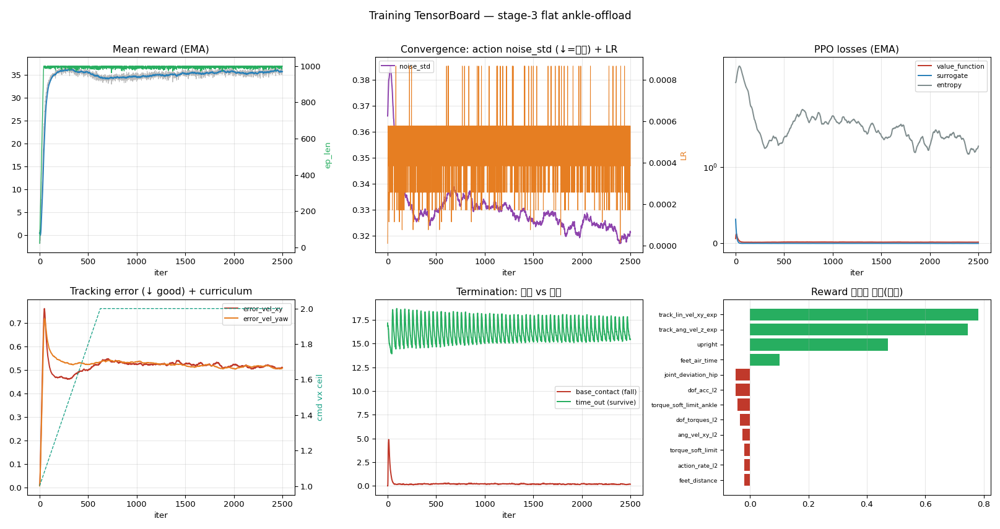
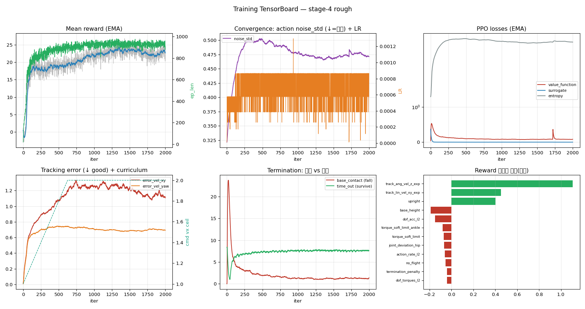
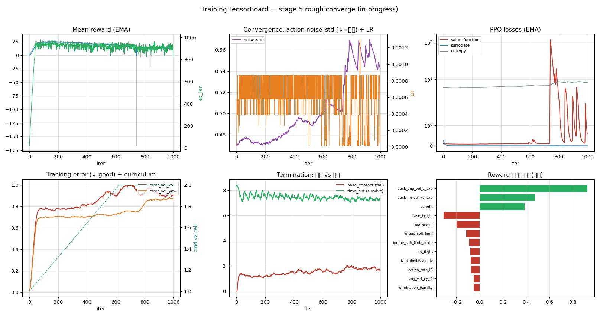
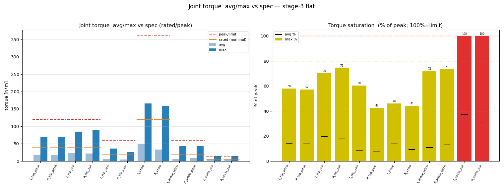
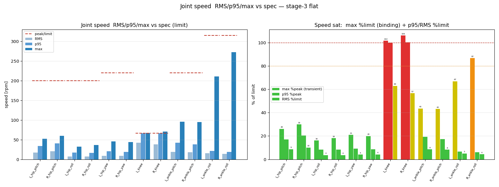
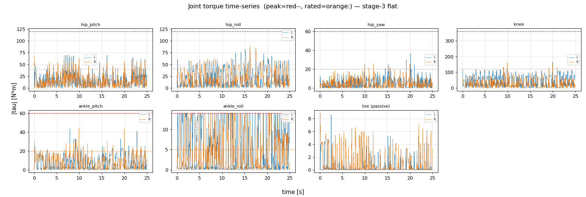
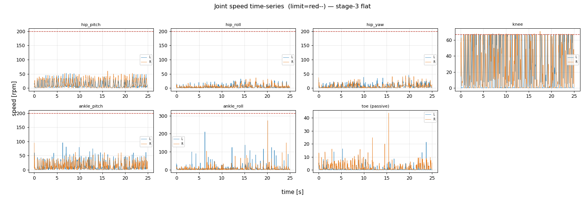
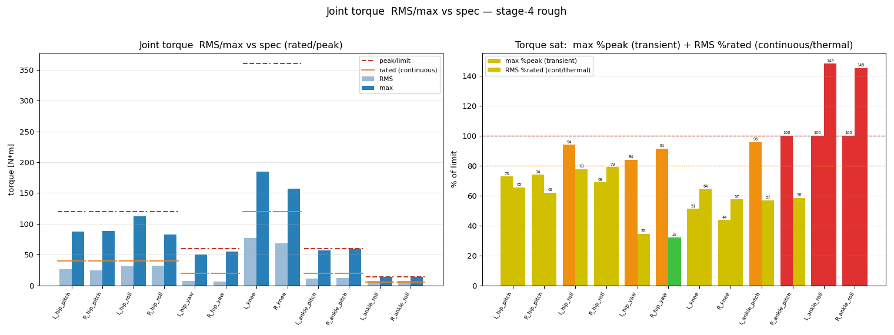
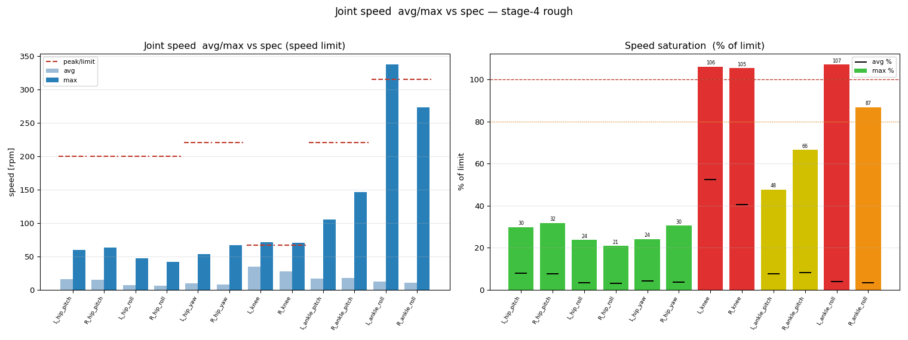

# 학습 건강도 분석 (TensorBoard: loss·수렴·낙상·보상항)

> [!abstract] 왜 이 분석을 추가하나
> reward 곡선만으론 *학습이 잘 됐는지/왜 안 됐는지/다음에 뭘 바꿀지*를 못 본다. rsl_rl TensorBoard의 **noise_std(탐색→활용)·value loss(critic 적합)·낙상률(base_contact vs time_out)·error_vel·보상항 기여**가 그 답을 준다. → `scripts/analyze_tensorboard.py`(6패널 PNG + 자동평가), `make_run_report.py`에 **2c. 학습 건강도** 섹션으로 자동 통합. **모든 학습 리포트에 포함**(규칙).

## 읽는 법 (지표별 진단)
| 지표 | 좋은 신호 | 나쁜 신호 → 처방 |
|---|---|---|
| **Policy/mean_noise_std** | ↓ 후 안정(탐색→활용=수렴) | **↑(증가) = 미수렴**, 정책이 계속 탐색 → iter↑ / 과제 난이도↓ / 커리큘럼 |
| **Loss/value_function** | ↓ 후 작게 안정(critic 확신) | 큼/요동 = 가치추정 불안(보상잡음·과제 어려움) |
| **Loss/entropy** | 점진 ↓(결정적化) | 높게 유지 = 불확실(미수렴) |
| **Loss/learning_rate**(KL적응) | 완만 | 심한 진동 = KL 불안정(스텝 과대) |
| **낙상률 base_contact/(.+time_out)** | <5% | **>15% = 불안정 보행** → 종료조건·보상·커리큘럼 |
| **error_vel_xy** | ↓ (<0.6 good) | 정체/높음 = 명령추종 실패 |

## 실측 (stage-3 평지 vs stage-4·5 rough)
### stage-3 flat ankle-offload — ✅ 건강 (성공)

- noise_std 0.37→0.32(낮게 유지, warm-start 미세조정) · reward 0.5**→36.2** · ep_len **1000** · **낙상 1%** · error_vel **0.50**(vx 2.0까지) · value loss **0.014**(확신) · entropy 1.31.
- **정성**: 발목offload 보상 변경이 보행을 **흔들지 않고 흡수**됨. 낙상 1% = 매우 안정. → **forefoot 실험 warm-start 베이스로 적합**.

### stage-4 rough (flat→rough 전이, 완료) — ⚠️ 미수렴

- noise_std 0.32**→0.47(증가)** · reward 22.2 · **낙상 20% ❌** · error_vel **1.08**(평지의 2배) · value loss **0.077**(평지의 5배) · entropy **6.0**(평지의 4.6배).
- **정성**: 평지→rough 전이가 어렵다. value loss·entropy 급등 = critic이 다양한 지형서 가치추정 못함. noise_std 증가 = 정책이 다시 탐색 모드. **전이만으론 부족**.

### stage-5 rough_converge (진행중 iter ~1000/2500) — ⚠️ + ★발견

- **★ reward 0.25에서 시작 = warm-start 없이 fresh로 학습**(stage-4 전이를 이어받지 못함 — pgrep 재실행 시 `--init_checkpoint` 유실 추정).
- noise_std 0.47**→0.54(계속 증가)** · 낙상 **24% ❌** · entropy 8.2 · 단 **error_vel 0.86(stage-4의 1.08보다 개선)**.
- **정성**: fresh인데도 추종은 stage-4보다 나음(rough를 더 오래 직접 학습). 그러나 std·낙상 계속 악화 = **완전 수렴 난망**. → **죽이지 않고 완주 후 재평가**(현 error_vel은 개선세).

## 결론 — 다음 학습 처방 (이 분석이 준 actionable)
1. **rough는 단순 전이/fresh로 안 됨** (낙상 20-24%, noise_std 상승). → **지형 커리큘럼**(쉬운 지형→점진 난이도; Isaac Lab `terrain_levels`)으로 재학습 + **flat 정책 warm-start 보장**(stage-3 model). 두 신호(std·낙상)가 같이 가리킴.
2. **warm-start 유실 방지**: 재학습 스크립트가 `--init_checkpoint`를 repro/cmd.txt에 기록(현 stage-5엔 없음) → 리포트서 검증 가능하게.
3. **평지 정책은 건강**(낙상 1%, error_vel 0.50) → forefoot CoP 실험은 stage-3서 warm-start.
4. value loss·entropy를 매 학습 기록 → 과제 난이도 정량 비교(평지 0.014 vs rough 0.077).

## 모터 활용 시각화 (토크·속도: avg/max·스펙선·포화%·시계열)
> 텍스트만으론 안 보임 → 측정 npz(env-0 시계열)에서 `analyze_motor_timeseries.py`가 생성. **모든 측정 리포트에 자동 임베드**(규칙). `bash scripts/analyze_run.sh <tag> <clip.npz>`.

### stage-3 평지 (건강 베이스라인)
**① 토크 avg/max + rated(주황)·peak(빨강--) 가로선 + 포화%** — ankle_roll L/R **100%(빨강존)**, 나머지 여유.

**② 속도 avg/max + 속도한계(빨강--) + 포화%** — knee L/R **102-106%(속도병목)**, ankle_roll 87%.

**③ 토크 시계열** (L파랑/R주황, peak=빨강--·rated=주황:) — ankle_roll이 push-off마다 peak 도달, knee는 큰 여유.

**④ 속도 시계열** — knee가 limit(66.7rpm) 근처서 반복 포화 = **속도병목을 눈으로 확인**.

### stage-4 rough (포화 심화)
**토크** — ankle_pitch+ankle_roll **둘 다 100%**(rough서 발목 토크 한계).

**속도** — ankle_roll **107%** + knee 105-106% (토크·속도 동시 포화).

### 시각화가 확정한 HW 결론 (텍스트가 아닌 그림으로)
- **ankle_roll(RS00)** = max%peak 100% + **RMS%rated 151%(평지)/148%(rough) = 연속/열적 과부하** + 속도 87→107% = **3중 포화 → 최우선 상향**. ★ RMS(=발열 등가 토크, heating~τ²) 도입으로 *연속 열한계 초과*가 드러남 — 산술평균(과도만 100%)이었으면 놓쳤을 신호. 포화 플롯은 이제 **max%peak(과도) + RMS%rated(연속)** 쌍.
- **knee** = 토크 46%(여유)인데 **속도 102-106% 포화** → 감속비 1:3 과함 → **1:2**(속도 시계열이 병목을 직관적으로 보여줌).
- **ankle_pitch** = rough서 토크 100% → 빠듯. L/R 비대칭 작음(보행 대칭) ✅.

**누적 영상(step 캡션 진화)**: `logs/rsl_rl/pygmalion_rough/2026-06-21_10-33-47_stage5_rough_converge/videos/accumulated_progress.mp4` — 학습 step별 보행 진화(모든 학습 자동 생성). 

관련: [[MIDREPORT_2026-06-21_1100]] · [[experiments/2026-06-21_06-41-42_stage4_rough]] · [[18_research_roadmap]] · [[04_reward_experiments]] · [[26_reading_list]] · [[23_toe_use_methods]]
