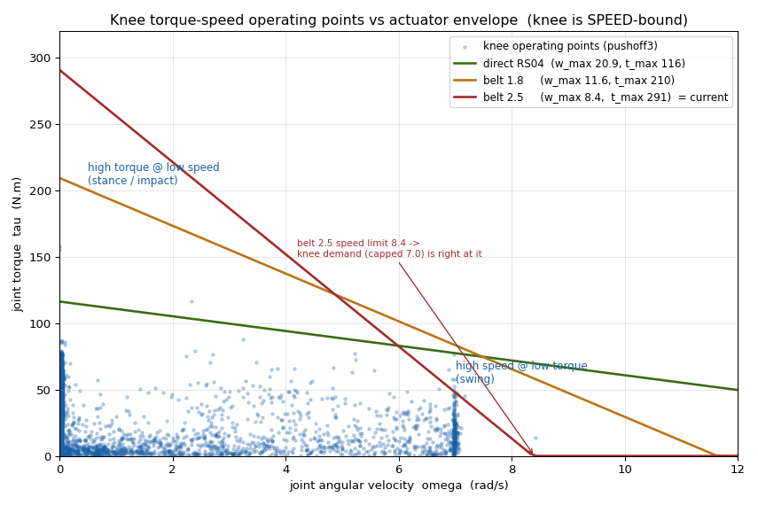
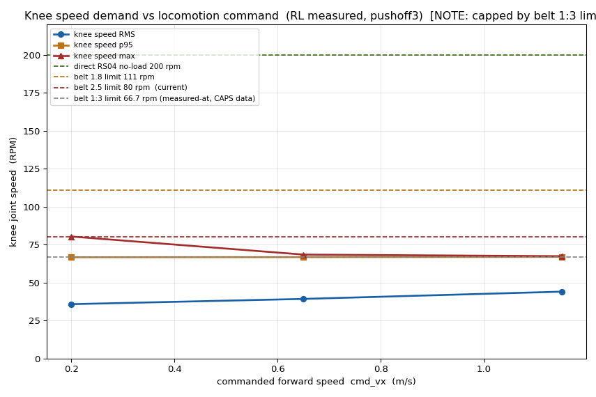
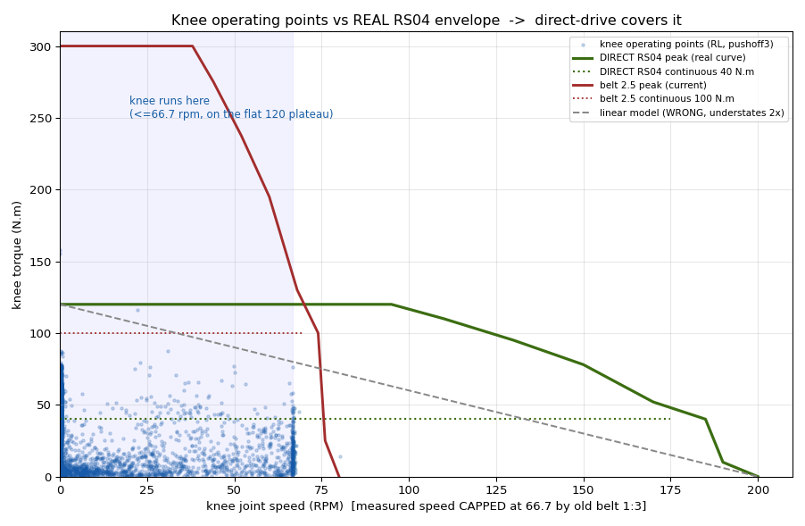
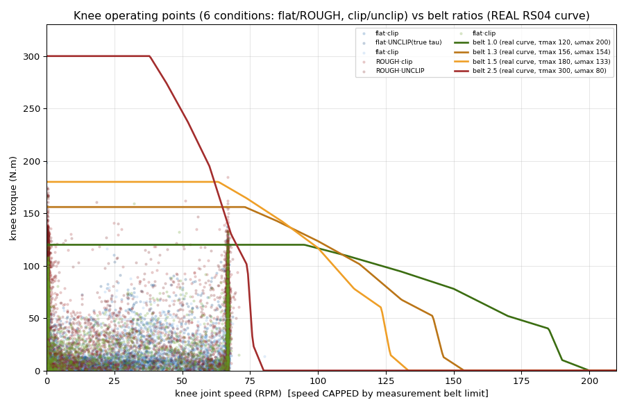
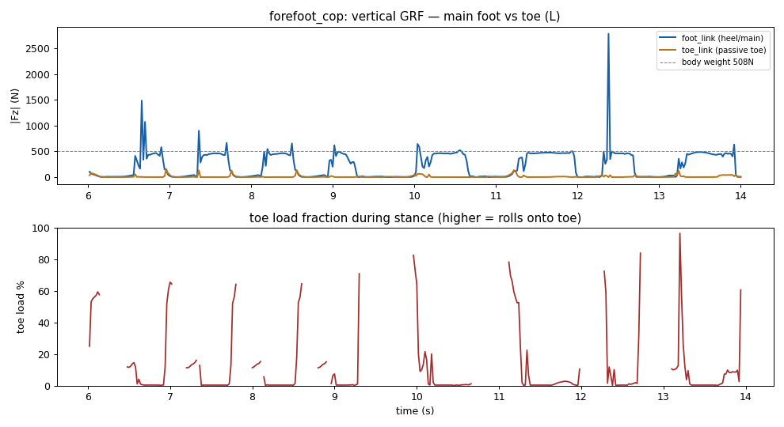
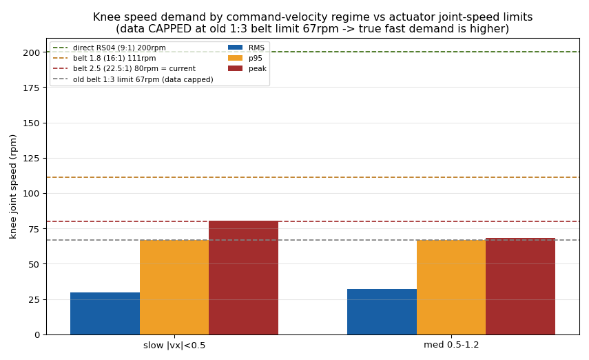

# 무릎 감속비 분석 — RL 액추에이터-정책 co-design

> 무릎 감속비를 *데이터+RS04 실측 T-N*으로 결정. 결론이 데이터 따라 진화: belt 2.5 → 직결 → belt 1.5 → **sweep**(순환성 깨기). 관련 [[21_motor_power_weight]] · [[28_reward_actuator_fidelity]] · [[32_actuator_damping]] · [[33_knee_actuator_landscape]] · [[experiment_queue]]. 검증 원문 [[raw/robstride-datasheet]].

## 1. 무릎 demand (측정) — 토크-속도 *분리(decoupled)*, **속도-병목**
무릎 작동점(env-0 tau·omega): **고토크는 속도~0(stance/충격), 고속은 토크~18(swing) — 동시에 안 일어남.**

- 명령속도별 무릎 속도: **p95가 벨트 1:3 한계(66.7rpm)에 *클립*** — 더 빠르게 돌고 싶으나 막힘(RMS 36→44로 명령 따라 증가).

## 2. RS04 실제 T-N 곡선 — **사다리꼴**(내 linear 모델은 틀림)
공식 매뉴얼 곡선 직접 판독([[raw/robstride-datasheet]]): **120 N·m가 ~95rpm까지 평평(plateau)** → 급락(190rpm 10, no-load 200). 연속(thermal) **40 N·m**. linear τ=120(1−ω/200)은 중속서 토크를 **2배 과소평가**.

- 직결 RS04가 무릎 작동범위(≤67rpm, plateau 95 안)를 **99% 덮음**, RMS토크 32<연속 40.

## 3. 다조건(ROUGH 포함) — ★ rough가 무릎토크 2배
| 조건 | tau RMS | p95 | max |
|---|---|---|---|
| 평지(forefoot/pushoff) | 31-32 | 58-63 | 158-198 |
| **ROUGH(stage4)** | **73** | **125** | **184** |

- 벨트비별 불가율: **직결 2.7%(rough가 120 초과) · 1.3 0.2% · 1.5 0.0%**. → 평지만 보면 직결, **rough 포함하면 belt 1.5**.

## 4. 결정 진화 + 사용자 제약
1. belt 2.5 — 토크peak(200)만 보고 사이징 = **과함**(속도캡 80·반사관성 6.25×).
2. 직결 — 평지 데이터로 99% 가능 = 좋아보임, 단 **rough서 2.7% 부족** + 사용자: **"공간 없어 직결 불가, 벨트 필수"**.
3. → **belt 1.5**(180 N·m, rough p95 125 커버 · 속도 133rpm · 반사관성 2.25×). 1:1은 rough 토크부족, 2.5는 과감속.

## 5. ★ 액추에이터 모델 + 순환성 (방법론 핵심)
- **우리 sim = `ImplicitActuatorCfg` = 박스**: effort_limit(평평 토크클립) + velocity_limit(**하드 속도벽**), 둘 독립. **실제 RS04 사다리꼴 droop 미모델** → 속도 cap은 T-N이 아니라 hard max-speed. 고속 토크 과대평가(Shin, [[28_reward_actuator_fidelity]]). (코드 주석 "swap to DCMotorCfg for droop".)
- **순환성**: 정책이 *그 비의 박스 한계*(1:3: effort 360·vel 66.7)에 적응 학습 → demand가 액추에이터 선택과 *공진화*. **1:3 데이터를 다른 envelope에 투영한 분석은 순환.**
- → **올바른 길 = 감속비 SWEEP**: 후보비를 *각각 학습*해 demand·성능 비교(순환 깨짐). + 충실 모델(사다리꼴 T-N 클립) = 향후.

## 6. 리워드 감사 (충격항, 관련)
- `foot_landing_vel`(접근속도, height<0.12 게이트)·`foot_impact_force`(접촉 수직GRF>650) **둘 다 wired+발화 ✓**.
- ★ 정정: contact sensor GRF가 충격을 **제대로 읽음**(GRF_z peak 4540~7205 ≈ 링크wrench 4954) — 이전 "과소독" 주장은 오진.
- 단 가중치 −2.0이 추종 plateau(error_vel 0.72) → sweep용 **−1.0/−0.005로 완화**.

## 7. SWEEP (진행) + 가설
- 직결·1.5·2.0·2.5 각각 학습(8192env·warm-start forefoot_cop·800iter) → 비별 측정(무릎 토크%·속도%·error_vel·CoT·충격·gait).
- **H2**: 무릎 speed-bound → 저감속(1.0-1.5) 추종·효율 우수, 고감속(2.5) 속도캡으로 추종↓; rough고려 **1.5 균형**일 것. (sweep이 검증.)

## 부록 — 관련 분석 플롯
- 발 heel/toe 수직GRF 분리 (충격/toe적재 분석, §6 리워드 감사 근거):

- 무릎 속도 demand (regime별 초기 분석, §1 보강):

> 영어 플롯(한글 폰트 없음). 공식 RS04 곡선 이미지는 저작권으로 gitignore(로컬만).
