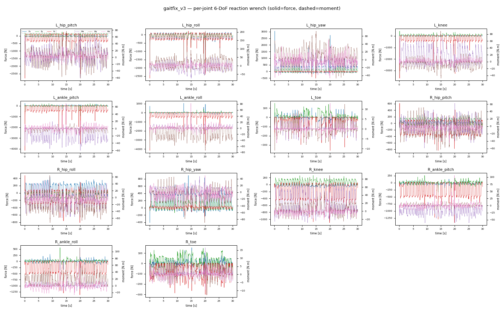
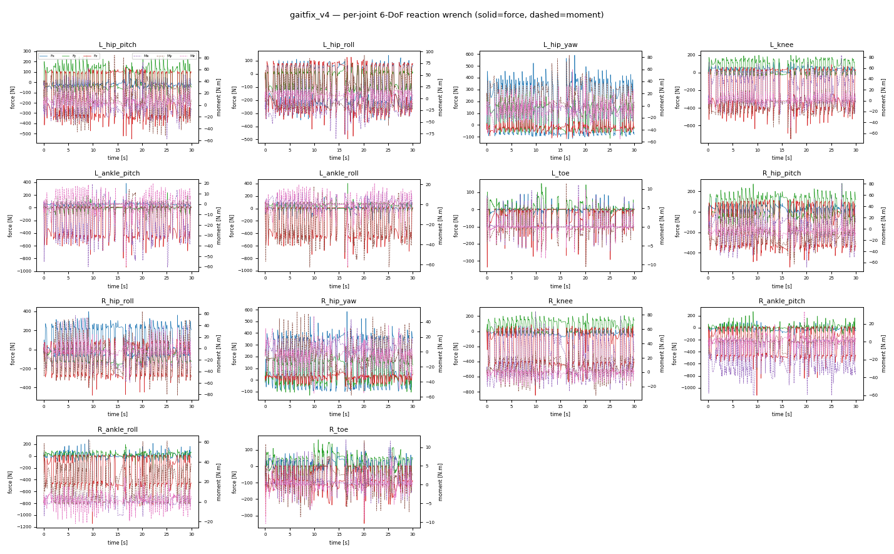
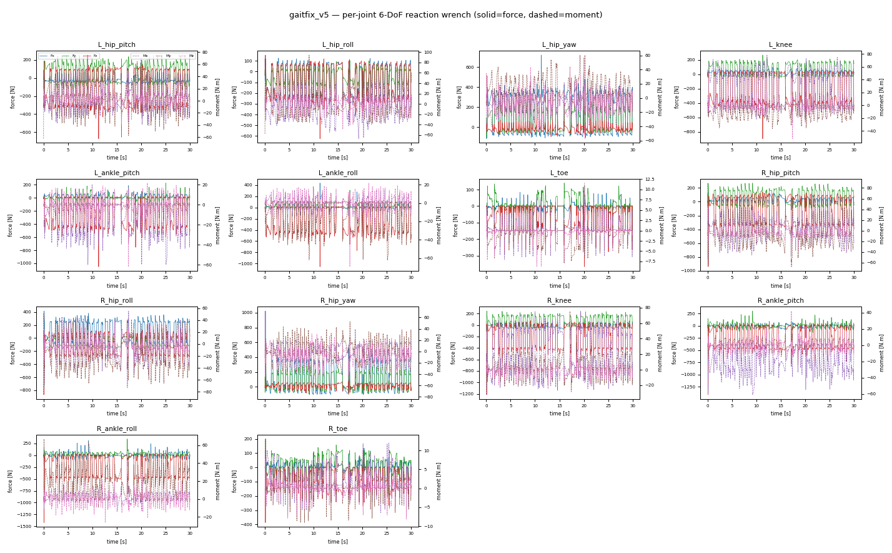
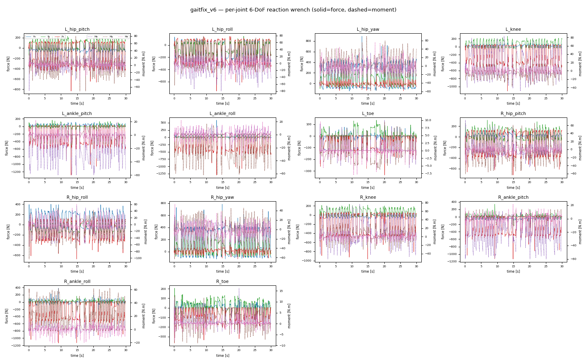
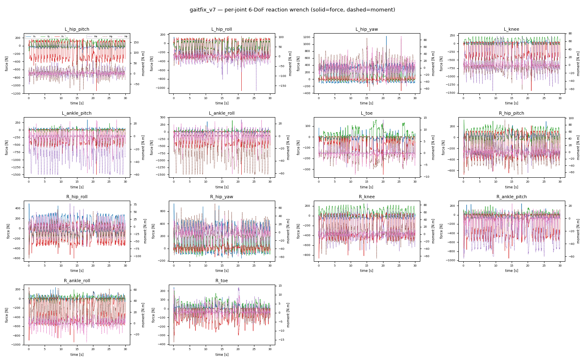
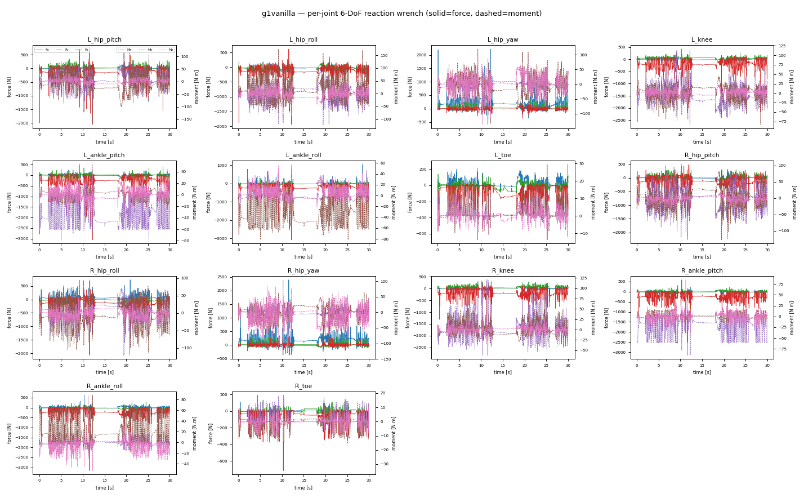
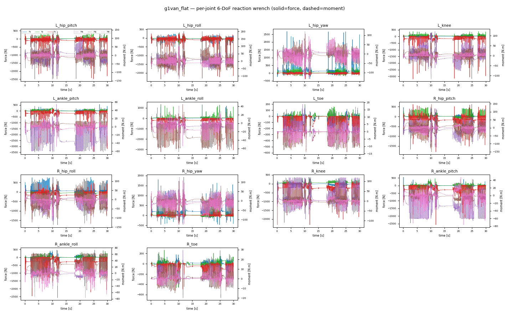
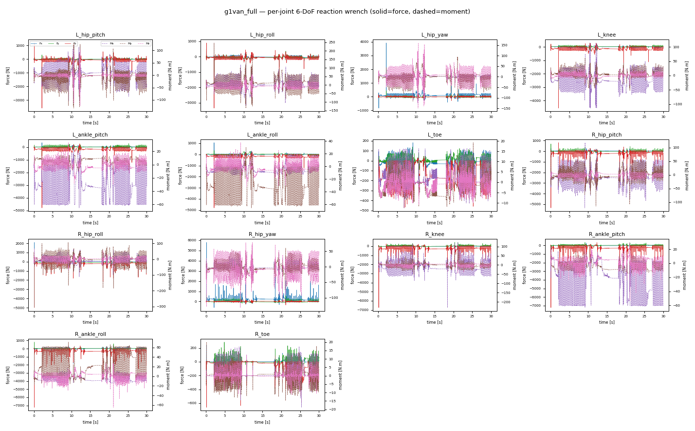
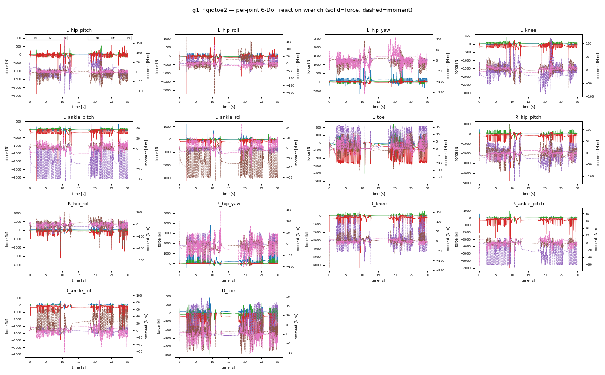

# 46 · 전 실험 관절 6-DoF 하중 (Fx/Fy/Fz·Mx/My/Mz) — Peak/RMS/p95

> measure npz의 관절별 incoming-joint-wrench(body frame). 링크→관절: thigh=hip_yaw·shin=knee·foot=ankle_roll. F=N, M(=T)=N·m. 전체 per-component CSV: `logs/measure/wrench_6dof_stats.csv`. 시계열 plot: `docs/assets/wrench/<exp>_6dof.png`.

## gaitfix_v3

| 관절(joint) | Fx pk | Fy pk | Fz pk | Mx pk | My pk | Mz pk | \|F\| pk/rms/p95 | \|M\| pk/rms/p95 |
|---|--:|--:|--:|--:|--:|--:|--:|--:|
| L_hip_pitch | 247 | 315 | 2806 | 73.2 | 77.0 | 32.3 | 2820/286/403 | 84.7/27.9/48.6 |
| L_hip_roll | 974 | 790 | 2633 | 74.4 | 205.2 | 49.1 | 2917/293/413 | 211.1/37.5/60.5 |
| L_hip_yaw | 3047 | 344 | 516 | 31.9 | 72.8 | 50.0 | 3060/304/433 | 77.4/25.9/47.8 |
| L_knee | 121 | 427 | 3680 | 69.2 | 88.7 | 70.7 | 3706/343/489 | 115.9/29.0/55.4 |
| L_ankle_pitch | 416 | 1039 | 4149 | 60.3 | 14.1 | 69.6 | 4218/373/521 | 86.0/21.0/38.8 |
| L_ankle_roll | 1047 | 845 | 4165 | 14.1 | 73.7 | 82.6 | 4240/374/522 | 91.5/22.0/40.1 |
| L_toe | 130 | 216 | 359 | 8.6 | 12.6 | 13.0 | 392/70/164 | 14.0/2.5/5.6 |
| R_hip_pitch | 205 | 291 | 831 | 62.3 | 65.4 | 44.4 | 843/272/406 | 74.9/26.7/42.7 |
| R_hip_roll | 443 | 331 | 812 | 58.7 | 72.9 | 45.6 | 870/277/415 | 81.7/35.5/57.1 |
| R_hip_yaw | 894 | 298 | 243 | 47.1 | 89.9 | 52.5 | 903/287/435 | 90.5/26.4/44.1 |
| R_knee | 180 | 262 | 1100 | 72.8 | 82.0 | 89.0 | 1145/321/486 | 115.7/31.5/59.4 |
| R_ankle_pitch | 442 | 524 | 1413 | 60.1 | 14.1 | 105.9 | 1557/344/515 | 110.4/23.9/42.8 |
| R_ankle_roll | 530 | 560 | 1373 | 14.9 | 62.7 | 111.3 | 1574/345/515 | 114.0/24.9/44.5 |
| R_toe | 152 | 178 | 305 | 16.5 | 12.6 | 9.5 | 327/110/208 | 18.0/4.1/7.6 |

## gaitfix_v4

| 관절(joint) | Fx pk | Fy pk | Fz pk | Mx pk | My pk | Mz pk | \|F\| pk/rms/p95 | \|M\| pk/rms/p95 |
|---|--:|--:|--:|--:|--:|--:|--:|--:|
| L_hip_pitch | 100 | 262 | 551 | 72.4 | 84.3 | 36.6 | 584/261/406 | 98.7/29.7/49.7 |
| L_hip_roll | 355 | 209 | 497 | 86.3 | 92.2 | 35.9 | 601/267/416 | 116.8/38.1/63.1 |
| L_hip_yaw | 590 | 281 | 117 | 38.5 | 83.2 | 59.6 | 632/277/434 | 87.2/28.7/49.5 |
| L_knee | 119 | 197 | 752 | 83.6 | 70.6 | 49.8 | 787/309/487 | 93.0/33.1/59.6 |
| L_ankle_pitch | 383 | 295 | 937 | 60.3 | 14.0 | 59.4 | 1054/331/515 | 64.5/21.9/40.6 |
| L_ankle_roll | 296 | 403 | 944 | 14.0 | 62.4 | 61.2 | 1068/331/516 | 67.5/22.8/42.0 |
| L_toe | 119 | 195 | 336 | 11.1 | 11.5 | 9.7 | 353/65/145 | 13.7/2.4/5.4 |
| R_hip_pitch | 154 | 279 | 543 | 81.0 | 62.6 | 40.7 | 563/262/408 | 84.7/28.2/45.7 |
| R_hip_roll | 398 | 206 | 482 | 59.0 | 81.5 | 45.3 | 578/268/419 | 91.4/36.6/57.1 |
| R_hip_yaw | 583 | 361 | 132 | 43.4 | 58.2 | 55.3 | 607/278/438 | 72.4/25.3/40.5 |
| R_knee | 108 | 259 | 847 | 84.7 | 45.8 | 30.1 | 869/311/492 | 87.4/31.4/56.3 |
| R_ankle_pitch | 157 | 701 | 1125 | 60.1 | 14.8 | 33.8 | 1330/333/521 | 61.2/23.4/38.7 |
| R_ankle_roll | 717 | 217 | 1143 | 14.8 | 62.3 | 34.6 | 1351/334/522 | 63.1/24.4/40.2 |
| R_toe | 123 | 173 | 348 | 12.0 | 11.8 | 10.3 | 358/113/212 | 15.3/4.2/8.1 |

## gaitfix_v5

| 관절(joint) | Fx pk | Fy pk | Fz pk | Mx pk | My pk | Mz pk | \|F\| pk/rms/p95 | \|M\| pk/rms/p95 |
|---|--:|--:|--:|--:|--:|--:|--:|--:|
| L_hip_pitch | 102 | 252 | 672 | 75.1 | 64.5 | 38.1 | 679/260/395 | 82.3/28.1/49.7 |
| L_hip_roll | 352 | 173 | 626 | 67.3 | 94.3 | 48.9 | 701/265/406 | 96.6/35.7/63.1 |
| L_hip_yaw | 720 | 270 | 197 | 32.3 | 60.4 | 57.4 | 733/275/424 | 84.4/26.8/49.1 |
| L_knee | 101 | 268 | 898 | 78.3 | 36.4 | 52.1 | 937/307/476 | 84.2/37.8/65.3 |
| L_ankle_pitch | 189 | 429 | 1051 | 60.0 | 14.0 | 62.0 | 1140/329/506 | 73.8/20.2/36.5 |
| L_ankle_roll | 436 | 309 | 1056 | 14.0 | 62.2 | 69.3 | 1149/330/507 | 76.0/21.2/38.2 |
| L_toe | 143 | 177 | 367 | 10.0 | 8.0 | 11.6 | 385/83/169 | 13.9/2.8/6.1 |
| R_hip_pitch | 138 | 271 | 940 | 89.2 | 67.8 | 38.0 | 953/264/399 | 89.8/28.2/47.4 |
| R_hip_roll | 414 | 346 | 867 | 73.3 | 84.8 | 39.7 | 985/269/408 | 93.5/36.4/60.1 |
| R_hip_yaw | 1023 | 292 | 104 | 39.3 | 76.3 | 71.4 | 1031/279/428 | 80.5/25.6/41.5 |
| R_knee | 110 | 245 | 1215 | 75.8 | 75.4 | 39.3 | 1241/313/478 | 90.6/36.6/60.3 |
| R_ankle_pitch | 331 | 300 | 1414 | 60.8 | 14.0 | 42.0 | 1433/335/506 | 61.5/22.7/39.0 |
| R_ankle_roll | 309 | 344 | 1422 | 14.0 | 67.1 | 43.1 | 1442/336/507 | 67.8/23.8/40.5 |
| R_toe | 135 | 200 | 387 | 12.0 | 13.0 | 9.7 | 414/118/217 | 14.9/4.3/8.0 |

## gaitfix_v6

| 관절(joint) | Fx pk | Fy pk | Fz pk | Mx pk | My pk | Mz pk | \|F\| pk/rms/p95 | \|M\| pk/rms/p95 |
|---|--:|--:|--:|--:|--:|--:|--:|--:|
| L_hip_pitch | 148 | 230 | 834 | 70.6 | 79.8 | 41.5 | 835/265/430 | 85.1/25.7/48.1 |
| L_hip_roll | 341 | 342 | 755 | 80.2 | 78.3 | 50.5 | 865/270/441 | 96.8/33.4/57.5 |
| L_hip_yaw | 893 | 257 | 140 | 30.5 | 70.1 | 55.7 | 903/279/461 | 75.5/25.3/48.3 |
| L_knee | 110 | 265 | 1114 | 83.2 | 42.2 | 25.2 | 1147/310/516 | 84.9/32.4/62.1 |
| L_ankle_pitch | 172 | 585 | 1286 | 60.0 | 14.6 | 30.1 | 1415/332/547 | 60.8/25.5/51.5 |
| L_ankle_roll | 589 | 181 | 1299 | 14.5 | 62.3 | 32.3 | 1427/333/548 | 62.7/26.5/53.3 |
| L_toe | 98 | 155 | 336 | 10.0 | 9.5 | 9.5 | 337/76/167 | 12.9/2.7/5.8 |
| R_hip_pitch | 148 | 313 | 721 | 73.0 | 65.8 | 48.1 | 751/271/415 | 93.1/26.8/49.0 |
| R_hip_roll | 400 | 201 | 675 | 63.9 | 103.0 | 60.5 | 774/277/427 | 122.0/34.9/60.3 |
| R_hip_yaw | 783 | 332 | 120 | 33.2 | 63.1 | 53.7 | 810/286/446 | 73.6/26.5/46.0 |
| R_knee | 102 | 237 | 966 | 76.7 | 43.8 | 19.7 | 991/319/499 | 77.2/32.3/58.9 |
| R_ankle_pitch | 146 | 341 | 1134 | 60.2 | 14.1 | 21.7 | 1178/340/527 | 61.5/25.0/50.0 |
| R_ankle_roll | 384 | 174 | 1136 | 14.1 | 62.2 | 28.1 | 1200/341/528 | 63.3/26.0/51.2 |
| R_toe | 98 | 206 | 368 | 16.2 | 12.8 | 12.0 | 383/114/212 | 17.7/3.9/7.7 |

## gaitfix_v7

| 관절(joint) | Fx pk | Fy pk | Fz pk | Mx pk | My pk | Mz pk | \|F\| pk/rms/p95 | \|M\| pk/rms/p95 |
|---|--:|--:|--:|--:|--:|--:|--:|--:|
| L_hip_pitch | 336 | 243 | 1135 | 65.9 | 179.9 | 36.5 | 1140/262/425 | 180.4/26.3/50.3 |
| L_hip_roll | 411 | 445 | 1065 | 176.8 | 104.8 | 52.6 | 1176/267/436 | 181.4/32.7/58.4 |
| L_hip_yaw | 1231 | 317 | 336 | 33.1 | 85.4 | 91.1 | 1239/276/458 | 123.3/27.1/48.1 |
| L_knee | 116 | 226 | 1436 | 73.3 | 61.7 | 48.3 | 1440/307/511 | 81.2/31.4/60.2 |
| L_ankle_pitch | 338 | 414 | 1498 | 60.1 | 15.1 | 57.9 | 1558/328/541 | 62.6/28.7/57.3 |
| L_ankle_roll | 417 | 397 | 1499 | 15.0 | 62.0 | 61.1 | 1563/329/542 | 65.1/29.8/58.7 |
| L_toe | 138 | 158 | 350 | 14.2 | 8.5 | 12.6 | 351/91/210 | 15.8/2.7/5.8 |
| R_hip_pitch | 286 | 314 | 675 | 67.1 | 94.9 | 31.4 | 752/268/441 | 100.5/27.7/48.9 |
| R_hip_roll | 496 | 277 | 601 | 78.3 | 107.7 | 48.8 | 774/273/453 | 122.9/34.3/58.6 |
| R_hip_yaw | 723 | 365 | 168 | 32.7 | 70.3 | 59.5 | 813/282/471 | 76.9/27.1/50.0 |
| R_knee | 108 | 247 | 866 | 83.7 | 66.2 | 30.0 | 891/314/530 | 86.5/32.9/62.5 |
| R_ankle_pitch | 247 | 261 | 955 | 62.9 | 14.2 | 29.9 | 993/336/561 | 63.9/27.4/50.2 |
| R_ankle_roll | 263 | 333 | 944 | 14.4 | 64.3 | 33.6 | 999/337/562 | 65.6/28.4/52.0 |
| R_toe | 238 | 201 | 376 | 14.1 | 16.3 | 13.1 | 427/116/219 | 21.0/4.2/8.5 |

## g1vanilla

| 관절(joint) | Fx pk | Fy pk | Fz pk | Mx pk | My pk | Mz pk | \|F\| pk/rms/p95 | \|M\| pk/rms/p95 |
|---|--:|--:|--:|--:|--:|--:|--:|--:|
| L_hip_pitch | 358 | 538 | 2055 | 121.3 | 170.2 | 40.6 | 2064/247/397 | 181.2/46.8/83.8 |
| L_hip_roll | 861 | 658 | 1941 | 120.7 | 174.4 | 87.3 | 2131/255/410 | 204.9/51.2/93.3 |
| L_hip_yaw | 2221 | 586 | 365 | 47.0 | 133.2 | 136.8 | 2225/268/423 | 157.8/41.0/75.7 |
| L_knee | 180 | 422 | 2681 | 116.6 | 86.7 | 52.8 | 2718/312/477 | 118.0/32.6/58.1 |
| L_ankle_pitch | 403 | 1038 | 3057 | 78.3 | 27.7 | 52.4 | 3170/344/521 | 82.9/40.6/62.0 |
| L_ankle_roll | 1045 | 601 | 3072 | 42.2 | 81.6 | 57.4 | 3189/346/522 | 97.4/41.5/63.3 |
| L_toe | 216 | 509 | 678 | 14.8 | 29.5 | 11.1 | 848/154/301 | 31.1/6.5/14.3 |
| R_hip_pitch | 284 | 308 | 2267 | 120.3 | 127.6 | 40.2 | 2283/238/439 | 145.4/41.8/78.2 |
| R_hip_roll | 730 | 845 | 2075 | 120.5 | 118.1 | 63.4 | 2339/245/451 | 153.1/43.8/81.0 |
| R_hip_yaw | 2397 | 328 | 300 | 37.5 | 98.3 | 138.2 | 2418/257/479 | 139.9/36.8/68.1 |
| R_knee | 170 | 367 | 2825 | 120.6 | 85.3 | 71.7 | 2854/296/551 | 126.8/29.3/58.5 |
| R_ankle_pitch | 521 | 905 | 3154 | 89.7 | 19.8 | 84.8 | 3282/325/594 | 97.6/31.2/61.6 |
| R_ankle_roll | 917 | 508 | 3163 | 22.9 | 88.1 | 88.0 | 3301/326/595 | 103.3/31.9/62.8 |
| R_toe | 242 | 699 | 715 | 18.6 | 34.5 | 13.9 | 1008/134/313 | 41.6/5.7/14.1 |

## g1van_flat

| 관절(joint) | Fx pk | Fy pk | Fz pk | Mx pk | My pk | Mz pk | \|F\| pk/rms/p95 | \|M\| pk/rms/p95 |
|---|--:|--:|--:|--:|--:|--:|--:|--:|
| L_hip_pitch | 397 | 355 | 2490 | 121.0 | 140.6 | 72.9 | 2529/256/335 | 188.1/43.9/82.2 |
| L_hip_roll | 1019 | 862 | 2349 | 125.4 | 200.7 | 98.9 | 2601/263/341 | 206.3/46.3/87.2 |
| L_hip_yaw | 2684 | 453 | 354 | 62.9 | 117.3 | 134.4 | 2715/277/354 | 165.4/39.8/78.9 |
| L_knee | 216 | 380 | 3204 | 122.0 | 89.4 | 44.5 | 3227/329/367 | 132.9/32.3/66.9 |
| L_ankle_pitch | 558 | 1297 | 3466 | 61.9 | 17.9 | 48.7 | 3658/368/400 | 74.3/33.1/61.2 |
| L_ankle_roll | 1307 | 1352 | 3237 | 21.2 | 68.0 | 54.1 | 3677/370/401 | 71.7/33.7/62.1 |
| L_toe | 211 | 412 | 587 | 18.7 | 13.8 | 11.8 | 727/140/293 | 20.3/6.1/13.8 |
| R_hip_pitch | 490 | 466 | 1795 | 121.0 | 151.2 | 78.3 | 1797/303/709 | 202.3/43.6/84.4 |
| R_hip_roll | 786 | 854 | 1743 | 122.1 | 137.8 | 96.0 | 1855/312/732 | 193.5/46.3/94.6 |
| R_hip_yaw | 1919 | 509 | 508 | 62.1 | 124.4 | 127.3 | 1935/327/775 | 165.0/42.8/90.1 |
| R_knee | 217 | 375 | 2320 | 121.4 | 120.7 | 70.4 | 2340/375/876 | 150.7/43.5/115.7 |
| R_ankle_pitch | 549 | 840 | 2574 | 66.5 | 19.0 | 76.6 | 2728/414/951 | 84.3/34.7/61.0 |
| R_ankle_roll | 848 | 665 | 2573 | 18.9 | 73.0 | 76.5 | 2746/416/953 | 90.4/35.4/61.8 |
| R_toe | 259 | 467 | 661 | 29.7 | 19.7 | 12.2 | 762/149/291 | 31.2/7.1/16.0 |

## g1van_full

| 관절(joint) | Fx pk | Fy pk | Fz pk | Mx pk | My pk | Mz pk | \|F\| pk/rms/p95 | \|M\| pk/rms/p95 |
|---|--:|--:|--:|--:|--:|--:|--:|--:|
| L_hip_pitch | 464 | 314 | 3598 | 118.0 | 132.9 | 123.5 | 3614/180/234 | 197.6/43.3/72.5 |
| L_hip_roll | 1308 | 989 | 3351 | 119.7 | 247.0 | 71.9 | 3731/185/235 | 256.0/47.5/80.0 |
| L_hip_yaw | 3920 | 416 | 292 | 26.7 | 115.6 | 160.3 | 3944/195/245 | 183.0/40.1/67.1 |
| L_knee | 187 | 285 | 4563 | 114.2 | 61.9 | 34.6 | 4568/234/291 | 120.1/36.1/59.8 |
| L_ankle_pitch | 353 | 1048 | 4796 | 65.0 | 14.5 | 33.0 | 4921/263/342 | 68.5/42.3/61.4 |
| L_ankle_roll | 1058 | 357 | 4808 | 14.7 | 65.5 | 37.5 | 4936/265/349 | 69.6/43.1/62.4 |
| L_toe | 186 | 372 | 473 | 16.4 | 19.2 | 12.3 | 594/217/348 | 21.1/7.4/13.9 |
| R_hip_pitch | 327 | 687 | 5348 | 120.7 | 114.5 | 39.3 | 5398/311/455 | 125.0/37.7/63.2 |
| R_hip_roll | 2099 | 1284 | 4989 | 111.9 | 307.1 | 68.8 | 5563/321/465 | 315.4/42.0/69.0 |
| R_hip_yaw | 5800 | 749 | 336 | 39.8 | 76.4 | 131.8 | 5848/340/485 | 133.3/35.4/57.7 |
| R_knee | 138 | 504 | 6748 | 231.3 | 100.3 | 45.3 | 6749/398/550 | 232.5/35.6/60.3 |
| R_ankle_pitch | 557 | 1781 | 7230 | 63.1 | 17.6 | 53.1 | 7256/437/613 | 77.5/38.6/61.6 |
| R_ankle_roll | 1811 | 799 | 7229 | 20.8 | 71.0 | 64.6 | 7277/439/630 | 82.8/39.5/62.7 |
| R_toe | 252 | 448 | 661 | 18.8 | 20.0 | 12.4 | 749/177/305 | 20.1/6.9/16.1 |

## g1_rigidtoe2

| 관절(joint) | Fx pk | Fy pk | Fz pk | Mx pk | My pk | Mz pk | \|F\| pk/rms/p95 | \|M\| pk/rms/p95 |
|---|--:|--:|--:|--:|--:|--:|--:|--:|
| L_hip_pitch | 278 | 531 | 2394 | 117.2 | 85.8 | 180.6 | 2419/176/224 | 216.5/32.5/63.2 |
| L_hip_roll | 943 | 596 | 2227 | 94.0 | 209.9 | 129.4 | 2490/180/229 | 263.9/34.8/65.1 |
| L_hip_yaw | 2575 | 632 | 289 | 56.8 | 93.6 | 158.3 | 2605/186/228 | 192.4/29.5/58.0 |
| L_knee | 188 | 405 | 3067 | 122.9 | 66.7 | 46.4 | 3086/225/273 | 125.4/27.0/51.4 |
| L_ankle_pitch | 350 | 1181 | 3219 | 64.1 | 33.0 | 48.6 | 3433/259/301 | 66.9/37.0/61.2 |
| L_ankle_roll | 1188 | 387 | 3230 | 36.2 | 67.2 | 49.0 | 3448/261/302 | 68.9/37.5/61.9 |
| L_toe | 156 | 423 | 499 | 17.1 | 22.6 | 11.3 | 662/153/282 | 23.2/8.7/17.1 |
| R_hip_pitch | 441 | 994 | 4793 | 120.1 | 122.6 | 65.5 | 4906/358/730 | 157.7/35.6/66.8 |
| R_hip_roll | 2238 | 1351 | 4338 | 86.1 | 362.0 | 113.0 | 5064/369/755 | 379.3/41.3/78.3 |
| R_hip_yaw | 5225 | 1040 | 404 | 59.2 | 100.4 | 145.4 | 5331/390/797 | 145.4/37.6/80.0 |
| R_knee | 193 | 611 | 6305 | 155.6 | 136.2 | 67.5 | 6320/453/890 | 164.9/39.7/105.1 |
| R_ankle_pitch | 559 | 1152 | 6960 | 68.2 | 28.6 | 86.9 | 7027/496/955 | 106.0/35.1/60.8 |
| R_ankle_roll | 1197 | 707 | 6979 | 29.1 | 93.4 | 85.4 | 7062/498/956 | 109.4/36.1/61.7 |
| R_toe | 216 | 496 | 492 | 19.4 | 15.3 | 10.2 | 623/139/261 | 21.2/7.8/16.4 |

## flat_trained_v1

| 관절(joint) | Fx pk | Fy pk | Fz pk | Mx pk | My pk | Mz pk | \|F\| pk/rms/p95 | \|M\| pk/rms/p95 |
|---|--:|--:|--:|--:|--:|--:|--:|--:|
| L_hip_pitch | 543 | 423 | 3918 | 103.7 | 127.0 | 30.7 | 3978/304/422 | 142.2/44.4/107.6 |
| L_hip_roll | 1473 | 1123 | 3649 | 123.4 | 228.3 | 72.1 | 4093/311/432 | 240.3/47.9/116.6 |
| L_hip_yaw | 4270 | 482 | 317 | 34.9 | 146.2 | 126.2 | 4297/323/450 | 154.7/40.7/97.7 |
| L_knee | 185 | 531 | 4907 | 203.5 | 152.0 | 29.6 | 4909/363/505 | 203.8/34.5/68.8 |
| L_ankle_pitch | 566 | 708 | 5232 | 60.6 | 18.1 | 30.6 | 5247/390/541 | 68.4/28.3/60.5 |
| L_ankle_roll | 716 | 750 | 5197 | 19.7 | 63.2 | 34.2 | 5260/391/542 | 73.2/29.3/62.6 |
| L_toe | 70 | 188 | 317 | 2.9 | 14.4 | 4.5 | 369/53/109 | 14.5/1.9/3.6 |
| R_hip_pitch | 553 | 252 | 1919 | 119.5 | 129.7 | 32.1 | 2006/302/442 | 147.4/41.2/73.0 |
| R_hip_roll | 725 | 607 | 1842 | 118.6 | 120.0 | 48.5 | 2066/307/452 | 138.2/46.1/72.6 |
| R_hip_yaw | 2170 | 269 | 248 | 24.6 | 107.1 | 100.9 | 2182/318/472 | 129.4/37.4/59.8 |
| R_knee | 169 | 344 | 2454 | 183.3 | 102.6 | 40.0 | 2478/352/524 | 189.1/35.8/55.0 |
| R_ankle_pitch | 428 | 455 | 2635 | 60.5 | 17.5 | 47.0 | 2702/377/567 | 63.8/27.2/56.7 |
| R_ankle_roll | 449 | 1152 | 2619 | 17.5 | 63.0 | 47.4 | 2713/378/568 | 65.3/28.3/58.4 |
| R_toe | 145 | 99 | 280 | 7.9 | 11.5 | 7.5 | 322/62/130 | 12.1/2.2/4.6 |

## forefoot_clip

| 관절(joint) | Fx pk | Fy pk | Fz pk | Mx pk | My pk | Mz pk | \|F\| pk/rms/p95 | \|M\| pk/rms/p95 |
|---|--:|--:|--:|--:|--:|--:|--:|--:|
| L_hip_pitch | 325 | 684 | 4199 | 85.4 | 79.6 | 30.5 | 4223/322/398 | 96.0/32.8/55.9 |
| L_hip_roll | 1095 | 1419 | 4052 | 76.0 | 251.1 | 93.1 | 4356/329/404 | 270.4/43.1/70.5 |
| L_hip_yaw | 4561 | 705 | 397 | 32.0 | 76.3 | 71.3 | 4582/340/421 | 83.7/31.2/53.9 |
| L_knee | 117 | 863 | 5200 | 401.1 | 107.5 | 32.1 | 5273/379/470 | 402.8/36.1/52.4 |
| L_ankle_pitch | 438 | 1155 | 5524 | 31.2 | 14.5 | 34.8 | 5645/406/498 | 38.3/13.8/28.1 |
| L_ankle_roll | 1173 | 634 | 5523 | 17.1 | 53.2 | 33.9 | 5661/407/499 | 56.7/14.7/29.5 |
| L_toe | 94 | 180 | 366 | 7.3 | 11.6 | 4.6 | 408/33/75 | 13.7/1.3/2.9 |
| R_hip_pitch | 269 | 466 | 3657 | 91.1 | 78.4 | 26.8 | 3678/319/425 | 91.5/30.6/56.6 |
| R_hip_roll | 1342 | 1113 | 3365 | 82.0 | 206.2 | 54.3 | 3789/325/433 | 213.7/41.1/72.5 |
| R_hip_yaw | 3920 | 521 | 569 | 27.6 | 84.7 | 106.6 | 3956/336/449 | 108.1/29.5/53.5 |
| R_knee | 120 | 787 | 4767 | 232.9 | 214.0 | 69.8 | 4832/381/499 | 244.3/32.4/53.5 |
| R_ankle_pitch | 1226 | 2055 | 5199 | 51.2 | 14.5 | 71.9 | 5598/417/528 | 78.0/12.4/25.4 |
| R_ankle_roll | 2076 | 2069 | 5233 | 15.1 | 53.4 | 84.0 | 5632/419/529 | 92.5/13.1/26.8 |
| R_toe | 139 | 204 | 427 | 7.8 | 13.9 | 4.7 | 493/58/108 | 13.9/2.1/4.1 |

## forefoot_unclip

| 관절(joint) | Fx pk | Fy pk | Fz pk | Mx pk | My pk | Mz pk | \|F\| pk/rms/p95 | \|M\| pk/rms/p95 |
|---|--:|--:|--:|--:|--:|--:|--:|--:|
| L_hip_pitch | 613 | 453 | 2111 | 81.0 | 77.8 | 21.7 | 2123/313/410 | 96.6/32.7/55.1 |
| L_hip_roll | 873 | 795 | 2027 | 74.2 | 159.4 | 53.4 | 2197/318/416 | 168.5/42.9/68.6 |
| L_hip_yaw | 2282 | 483 | 559 | 24.5 | 88.3 | 87.2 | 2307/329/429 | 93.0/31.3/53.2 |
| L_knee | 140 | 491 | 2599 | 265.9 | 169.5 | 50.2 | 2647/364/478 | 266.1/34.8/51.6 |
| L_ankle_pitch | 668 | 722 | 2802 | 32.5 | 26.6 | 55.5 | 2803/388/506 | 57.1/14.0/27.3 |
| L_ankle_roll | 724 | 1002 | 2798 | 26.6 | 36.1 | 56.5 | 2808/390/508 | 60.3/14.8/28.6 |
| L_toe | 88 | 127 | 209 | 4.8 | 8.3 | 5.8 | 235/29/70 | 9.0/1.2/2.9 |
| R_hip_pitch | 503 | 483 | 4463 | 75.6 | 91.2 | 40.9 | 4509/360/443 | 92.8/29.7/55.1 |
| R_hip_roll | 1591 | 1344 | 4143 | 77.0 | 272.8 | 75.0 | 4638/368/452 | 283.2/41.8/73.0 |
| R_hip_yaw | 4853 | 433 | 475 | 41.3 | 68.8 | 71.8 | 4874/383/463 | 86.6/28.7/51.8 |
| R_knee | 178 | 726 | 5508 | 250.2 | 86.7 | 54.4 | 5557/436/516 | 251.0/33.9/55.5 |
| R_ankle_pitch | 538 | 1698 | 5931 | 69.1 | 16.7 | 60.2 | 5960/474/544 | 70.0/12.4/25.4 |
| R_ankle_roll | 1714 | 2246 | 5514 | 16.7 | 53.5 | 64.2 | 5979/475/545 | 79.1/13.1/26.8 |
| R_toe | 169 | 198 | 430 | 6.5 | 11.0 | 13.6 | 434/63/109 | 15.0/2.3/4.4 |

## fwd_stage1_toe

| 관절(joint) | Fx pk | Fy pk | Fz pk | Mx pk | My pk | Mz pk | \|F\| pk/rms/p95 | \|M\| pk/rms/p95 |
|---|--:|--:|--:|--:|--:|--:|--:|--:|
| L_hip_pitch | 996 | 485 | 3129 | 96.0 | 109.5 | 23.9 | 3290/310/460 | 115.3/36.0/63.4 |
| L_hip_roll | 1053 | 1438 | 2867 | 96.2 | 142.3 | 107.7 | 3376/316/465 | 181.5/42.4/77.5 |
| L_hip_yaw | 3436 | 476 | 558 | 25.3 | 121.8 | 103.1 | 3505/327/486 | 160.1/34.1/61.2 |
| L_knee | 116 | 449 | 3966 | 160.3 | 187.9 | 58.9 | 3992/367/534 | 226.2/32.0/55.8 |
| L_ankle_pitch | 807 | 1347 | 4168 | 61.1 | 21.8 | 74.6 | 4454/399/577 | 90.5/19.2/34.5 |
| L_ankle_roll | 1352 | 1838 | 3851 | 36.9 | 63.0 | 99.4 | 4477/400/578 | 116.3/20.1/35.7 |
| L_toe | 158 | 279 | 413 | 11.9 | 14.3 | 9.6 | 499/65/125 | 15.2/2.5/5.2 |
| R_hip_pitch | 433 | 459 | 2787 | 74.4 | 110.9 | 25.8 | 2794/344/543 | 112.8/38.0/65.0 |
| R_hip_roll | 951 | 754 | 2627 | 98.4 | 140.8 | 71.2 | 2879/352/550 | 147.1/45.1/76.9 |
| R_hip_yaw | 3014 | 470 | 287 | 27.4 | 93.5 | 86.7 | 3026/366/569 | 100.6/36.5/62.3 |
| R_knee | 150 | 477 | 3494 | 253.7 | 119.9 | 31.3 | 3494/414/631 | 254.2/36.0/62.0 |
| R_ankle_pitch | 461 | 822 | 3713 | 60.5 | 38.8 | 35.3 | 3774/449/676 | 62.2/17.7/31.5 |
| R_ankle_roll | 820 | 1328 | 3718 | 42.1 | 63.1 | 39.2 | 3787/450/677 | 64.8/18.5/33.2 |
| R_toe | 150 | 197 | 383 | 9.7 | 12.7 | 7.7 | 437/73/155 | 13.4/2.7/6.0 |

## pushoff3

| 관절(joint) | Fx pk | Fy pk | Fz pk | Mx pk | My pk | Mz pk | \|F\| pk/rms/p95 | \|M\| pk/rms/p95 |
|---|--:|--:|--:|--:|--:|--:|--:|--:|
| L_hip_pitch | 606 | 467 | 3640 | 85.6 | 78.3 | 20.9 | 3640/356/425 | 98.5/35.2/64.4 |
| L_hip_roll | 1141 | 1246 | 3500 | 81.8 | 246.3 | 78.4 | 3756/364/434 | 254.5/45.5/72.9 |
| L_hip_yaw | 3966 | 442 | 474 | 29.1 | 87.4 | 83.0 | 3966/378/449 | 104.9/33.0/57.3 |
| L_knee | 139 | 703 | 4529 | 310.0 | 174.0 | 37.6 | 4584/422/492 | 310.5/36.5/56.3 |
| L_ankle_pitch | 859 | 1242 | 4928 | 42.9 | 29.8 | 32.1 | 4945/453/525 | 46.9/12.5/25.8 |
| L_ankle_roll | 1250 | 771 | 4954 | 29.5 | 66.6 | 29.0 | 4961/454/526 | 69.7/12.9/27.3 |
| L_toe | 155 | 210 | 509 | 8.4 | 13.6 | 8.8 | 514/35/47 | 15.7/1.2/1.6 |
| R_hip_pitch | 397 | 525 | 4622 | 100.7 | 202.0 | 27.7 | 4654/329/451 | 203.3/34.0/64.3 |
| R_hip_roll | 1770 | 1541 | 4196 | 194.8 | 261.3 | 83.2 | 4808/336/463 | 274.1/42.4/75.5 |
| R_hip_yaw | 4977 | 778 | 456 | 28.1 | 135.8 | 101.1 | 5044/347/473 | 156.6/32.0/60.0 |
| R_knee | 196 | 1224 | 6180 | 277.1 | 156.7 | 35.7 | 6301/393/522 | 278.2/31.6/52.0 |
| R_ankle_pitch | 663 | 3164 | 6697 | 52.6 | 17.2 | 34.1 | 7411/431/553 | 56.0/10.1/20.1 |
| R_ankle_roll | 3193 | 1033 | 6683 | 19.4 | 77.3 | 32.4 | 7459/433/554 | 83.8/10.5/20.4 |
| R_toe | 149 | 218 | 545 | 8.0 | 12.4 | 14.8 | 591/62/119 | 14.9/2.1/4.3 |

## stage3_clip

| 관절(joint) | Fx pk | Fy pk | Fz pk | Mx pk | My pk | Mz pk | \|F\| pk/rms/p95 | \|M\| pk/rms/p95 |
|---|--:|--:|--:|--:|--:|--:|--:|--:|
| L_hip_pitch | 459 | 711 | 4007 | 69.4 | 83.6 | 24.6 | 4046/381/447 | 94.8/34.4/59.5 |
| L_hip_roll | 1450 | 1718 | 3519 | 85.2 | 214.0 | 86.7 | 4165/390/458 | 230.6/44.8/74.7 |
| L_hip_yaw | 4296 | 664 | 751 | 29.3 | 82.5 | 111.7 | 4371/405/466 | 127.9/32.8/54.9 |
| L_knee | 128 | 679 | 4990 | 315.1 | 176.3 | 74.6 | 4993/453/508 | 315.2/38.6/54.2 |
| L_ankle_pitch | 745 | 891 | 5326 | 30.3 | 17.8 | 79.0 | 5417/486/541 | 80.0/12.3/22.2 |
| L_ankle_roll | 899 | 1691 | 5259 | 22.4 | 37.0 | 82.9 | 5436/488/544 | 86.4/13.0/23.5 |
| L_toe | 108 | 142 | 292 | 6.7 | 10.0 | 6.9 | 342/28/61 | 12.1/1.1/2.3 |
| R_hip_pitch | 546 | 584 | 3187 | 67.1 | 89.4 | 23.6 | 3237/321/467 | 90.2/32.1/55.3 |
| R_hip_roll | 1230 | 1037 | 3028 | 87.2 | 191.8 | 72.6 | 3325/327/472 | 203.9/40.5/69.3 |
| R_hip_yaw | 3480 | 650 | 397 | 24.3 | 96.2 | 99.9 | 3489/337/486 | 138.8/30.4/52.1 |
| R_knee | 116 | 512 | 3937 | 281.8 | 125.3 | 50.0 | 3961/374/536 | 305.4/34.5/50.3 |
| R_ankle_pitch | 568 | 458 | 4249 | 34.3 | 21.0 | 60.8 | 4263/401/565 | 61.4/12.0/21.4 |
| R_ankle_roll | 459 | 1195 | 4144 | 22.3 | 35.3 | 60.3 | 4278/402/567 | 60.5/12.5/22.4 |
| R_toe | 175 | 150 | 541 | 7.6 | 16.5 | 3.3 | 579/66/118 | 17.8/2.4/4.6 |

## stage3_unclip

| 관절(joint) | Fx pk | Fy pk | Fz pk | Mx pk | My pk | Mz pk | \|F\| pk/rms/p95 | \|M\| pk/rms/p95 |
|---|--:|--:|--:|--:|--:|--:|--:|--:|
| L_hip_pitch | 324 | 572 | 3519 | 66.8 | 78.1 | 28.5 | 3550/365/488 | 89.0/34.2/60.1 |
| L_hip_roll | 1419 | 1495 | 3053 | 89.3 | 190.2 | 79.7 | 3662/374/500 | 203.2/44.2/73.9 |
| L_hip_yaw | 3761 | 701 | 555 | 29.9 | 77.8 | 122.8 | 3848/389/493 | 131.3/32.8/55.7 |
| L_knee | 134 | 568 | 4527 | 323.2 | 126.9 | 48.9 | 4553/435/553 | 323.5/39.9/54.7 |
| L_ankle_pitch | 417 | 1350 | 4856 | 33.3 | 31.8 | 51.8 | 5044/467/584 | 55.2/12.7/24.3 |
| L_ankle_roll | 1354 | 1554 | 4801 | 35.7 | 39.4 | 57.9 | 5065/468/585 | 65.4/13.3/25.6 |
| L_toe | 67 | 137 | 224 | 5.3 | 8.9 | 5.9 | 248/30/71 | 10.3/1.1/2.4 |
| R_hip_pitch | 379 | 454 | 2410 | 71.6 | 82.3 | 20.7 | 2419/316/466 | 83.6/31.6/55.1 |
| R_hip_roll | 886 | 850 | 2325 | 79.4 | 162.7 | 61.4 | 2491/322/474 | 175.5/39.9/67.7 |
| R_hip_yaw | 2602 | 499 | 298 | 20.6 | 70.2 | 69.1 | 2611/332/480 | 95.1/29.7/50.9 |
| R_knee | 111 | 569 | 2933 | 302.2 | 79.3 | 51.0 | 2978/370/529 | 302.3/34.4/49.8 |
| R_ankle_pitch | 292 | 1057 | 3474 | 37.6 | 18.8 | 56.7 | 3634/399/561 | 57.1/12.1/21.8 |
| R_ankle_roll | 1079 | 423 | 3497 | 18.8 | 38.5 | 56.4 | 3663/400/562 | 60.2/12.6/22.8 |
| R_toe | 133 | 123 | 273 | 9.5 | 10.2 | 6.4 | 302/63/122 | 10.8/2.5/4.8 |

## stage4_clip

| 관절(joint) | Fx pk | Fy pk | Fz pk | Mx pk | My pk | Mz pk | \|F\| pk/rms/p95 | \|M\| pk/rms/p95 |
|---|--:|--:|--:|--:|--:|--:|--:|--:|
| L_hip_pitch | 348 | 611 | 3498 | 86.2 | 118.5 | 25.3 | 3565/354/456 | 127.6/38.2/66.9 |
| L_hip_roll | 1497 | 1636 | 2935 | 114.2 | 253.1 | 102.3 | 3679/361/462 | 274.6/45.5/79.8 |
| L_hip_yaw | 3757 | 750 | 578 | 25.0 | 86.1 | 135.5 | 3875/374/465 | 136.6/35.5/61.2 |
| L_knee | 175 | 617 | 4490 | 281.8 | 141.7 | 64.4 | 4491/418/515 | 282.0/37.0/64.6 |
| L_ankle_pitch | 422 | 1001 | 4864 | 136.2 | 69.1 | 66.6 | 4899/450/547 | 139.6/14.4/29.0 |
| L_ankle_roll | 1003 | 1548 | 4753 | 73.1 | 124.3 | 73.2 | 4917/452/548 | 144.9/15.1/30.6 |
| L_toe | 186 | 273 | 803 | 10.8 | 32.3 | 10.9 | 829/48/95 | 35.7/1.7/3.1 |
| R_hip_pitch | 639 | 575 | 4750 | 84.2 | 156.0 | 59.7 | 4752/404/591 | 169.0/37.9/64.9 |
| R_hip_roll | 1346 | 2001 | 4538 | 153.3 | 298.6 | 117.3 | 4912/415/606 | 310.5/48.6/76.7 |
| R_hip_yaw | 5203 | 681 | 785 | 53.0 | 144.0 | 141.3 | 5203/432/619 | 155.0/36.3/60.2 |
| R_knee | 239 | 922 | 6003 | 378.9 | 178.2 | 49.8 | 6076/488/700 | 420.0/45.1/66.1 |
| R_ankle_pitch | 796 | 1410 | 6386 | 195.2 | 48.1 | 62.2 | 6575/528/757 | 197.4/18.1/29.0 |
| R_ankle_roll | 1410 | 1693 | 6415 | 47.9 | 198.5 | 55.5 | 6596/529/759 | 201.6/18.6/30.5 |
| R_toe | 211 | 399 | 707 | 11.1 | 27.1 | 21.9 | 734/64/112 | 34.8/2.4/4.1 |

## stage4_unclip

| 관절(joint) | Fx pk | Fy pk | Fz pk | Mx pk | My pk | Mz pk | \|F\| pk/rms/p95 | \|M\| pk/rms/p95 |
|---|--:|--:|--:|--:|--:|--:|--:|--:|
| L_hip_pitch | 458 | 677 | 3458 | 94.9 | 329.7 | 56.9 | 3461/344/490 | 345.7/38.0/64.9 |
| L_hip_roll | 1027 | 1061 | 3377 | 338.8 | 231.9 | 66.3 | 3577/352/507 | 410.6/46.1/83.0 |
| L_hip_yaw | 3788 | 838 | 675 | 32.1 | 232.8 | 126.7 | 3790/365/516 | 251.6/34.4/58.3 |
| L_knee | 434 | 671 | 4364 | 289.0 | 109.2 | 47.6 | 4420/407/569 | 291.4/39.5/67.0 |
| L_ankle_pitch | 711 | 2205 | 4197 | 41.2 | 103.9 | 56.9 | 4794/440/612 | 117.6/14.5/29.8 |
| L_ankle_roll | 2206 | 725 | 4248 | 104.7 | 51.4 | 56.0 | 4811/441/614 | 119.8/15.3/31.2 |
| L_toe | 112 | 234 | 378 | 9.6 | 16.9 | 6.2 | 446/41/93 | 19.3/1.6/3.5 |
| R_hip_pitch | 431 | 660 | 4040 | 80.9 | 90.4 | 41.7 | 4041/332/503 | 104.7/36.5/62.6 |
| R_hip_roll | 1134 | 1473 | 3744 | 96.4 | 261.8 | 99.9 | 4180/340/512 | 283.2/45.4/76.9 |
| R_hip_yaw | 4411 | 683 | 416 | 38.1 | 86.6 | 109.4 | 4425/352/528 | 116.3/34.3/57.8 |
| R_knee | 204 | 850 | 5095 | 372.9 | 140.6 | 79.8 | 5166/393/593 | 373.9/40.3/64.0 |
| R_ankle_pitch | 774 | 1219 | 5501 | 57.0 | 121.1 | 88.7 | 5584/426/626 | 126.1/15.7/27.2 |
| R_ankle_roll | 1223 | 836 | 5455 | 120.6 | 64.1 | 90.0 | 5602/427/628 | 127.5/16.1/28.7 |
| R_toe | 119 | 255 | 297 | 5.7 | 13.3 | 11.6 | 321/38/78 | 17.7/1.3/3.0 |

## sweep_g1p0

| 관절(joint) | Fx pk | Fy pk | Fz pk | Mx pk | My pk | Mz pk | \|F\| pk/rms/p95 | \|M\| pk/rms/p95 |
|---|--:|--:|--:|--:|--:|--:|--:|--:|
| L_hip_pitch | 315 | 283 | 2890 | 58.5 | 79.5 | 30.3 | 2915/293/416 | 90.9/30.7/53.7 |
| L_hip_roll | 1062 | 1162 | 2556 | 85.0 | 209.1 | 71.0 | 3002/299/426 | 225.8/41.0/69.1 |
| L_hip_yaw | 3093 | 449 | 340 | 25.3 | 77.7 | 54.0 | 3144/310/445 | 82.2/30.0/52.2 |
| L_knee | 137 | 256 | 3688 | 117.5 | 53.7 | 23.0 | 3692/347/500 | 118.6/28.2/53.4 |
| L_ankle_pitch | 206 | 973 | 3954 | 57.4 | 14.6 | 24.3 | 4074/371/530 | 59.0/23.3/42.8 |
| L_ankle_roll | 963 | 515 | 3941 | 14.6 | 65.2 | 33.0 | 4090/372/531 | 65.7/24.3/44.6 |
| L_toe | 129 | 176 | 356 | 11.7 | 12.7 | 8.4 | 394/66/165 | 15.9/2.5/5.2 |
| R_hip_pitch | 606 | 512 | 3106 | 83.4 | 86.8 | 27.3 | 3206/275/406 | 91.5/30.2/51.9 |
| R_hip_roll | 1343 | 1174 | 2821 | 88.2 | 263.0 | 58.7 | 3337/280/416 | 283.5/40.0/67.8 |
| R_hip_yaw | 3503 | 521 | 380 | 26.6 | 82.4 | 73.3 | 3562/290/433 | 86.0/29.0/51.4 |
| R_knee | 124 | 348 | 4334 | 183.6 | 66.0 | 27.2 | 4340/327/483 | 185.1/25.6/48.9 |
| R_ankle_pitch | 224 | 395 | 4800 | 60.1 | 14.3 | 28.2 | 4808/352/511 | 63.1/20.8/42.9 |
| R_ankle_roll | 397 | 1315 | 4636 | 14.3 | 62.3 | 38.2 | 4827/353/512 | 63.9/21.8/44.6 |
| R_toe | 157 | 213 | 282 | 14.0 | 11.2 | 10.8 | 363/95/203 | 18.9/3.4/6.9 |

## sweep_g1p5

| 관절(joint) | Fx pk | Fy pk | Fz pk | Mx pk | My pk | Mz pk | \|F\| pk/rms/p95 | \|M\| pk/rms/p95 |
|---|--:|--:|--:|--:|--:|--:|--:|--:|
| L_hip_pitch | 400 | 396 | 2989 | 70.6 | 106.5 | 32.0 | 3031/290/400 | 109.9/32.5/55.3 |
| L_hip_roll | 1115 | 1125 | 2683 | 103.5 | 207.9 | 73.8 | 3116/295/410 | 222.3/42.9/71.6 |
| L_hip_yaw | 3219 | 429 | 399 | 26.8 | 87.7 | 69.5 | 3262/306/428 | 93.1/31.3/53.7 |
| L_knee | 135 | 213 | 3763 | 141.4 | 69.0 | 28.4 | 3766/343/480 | 142.2/31.6/57.7 |
| L_ankle_pitch | 201 | 1124 | 3916 | 59.9 | 14.2 | 34.2 | 4075/367/509 | 66.3/21.8/42.0 |
| L_ankle_roll | 1147 | 531 | 3915 | 14.2 | 61.5 | 45.8 | 4088/368/510 | 67.3/22.8/43.6 |
| L_toe | 189 | 154 | 348 | 11.5 | 9.2 | 9.4 | 349/66/151 | 13.0/2.4/5.6 |
| R_hip_pitch | 373 | 343 | 2346 | 72.0 | 84.3 | 44.3 | 2374/279/409 | 104.8/30.1/51.6 |
| R_hip_roll | 853 | 1002 | 2100 | 82.8 | 154.3 | 49.9 | 2478/285/419 | 169.3/40.2/66.7 |
| R_hip_yaw | 2602 | 364 | 393 | 32.1 | 87.4 | 56.8 | 2643/295/435 | 96.8/29.3/49.7 |
| R_knee | 166 | 289 | 3302 | 71.4 | 106.3 | 29.2 | 3319/331/485 | 111.8/25.8/51.7 |
| R_ankle_pitch | 493 | 668 | 3820 | 60.1 | 14.1 | 29.5 | 3857/358/513 | 64.7/26.4/52.4 |
| R_ankle_roll | 728 | 1472 | 3568 | 17.0 | 62.9 | 41.7 | 3882/359/514 | 65.6/27.4/54.1 |
| R_toe | 140 | 254 | 498 | 14.1 | 14.8 | 9.9 | 566/115/230 | 15.8/3.9/7.6 |

## sweep_g2p0

| 관절(joint) | Fx pk | Fy pk | Fz pk | Mx pk | My pk | Mz pk | \|F\| pk/rms/p95 | \|M\| pk/rms/p95 |
|---|--:|--:|--:|--:|--:|--:|--:|--:|
| L_hip_pitch | 343 | 370 | 3174 | 72.4 | 67.9 | 18.4 | 3179/285/388 | 84.0/29.4/52.1 |
| L_hip_roll | 1029 | 1054 | 2928 | 71.9 | 197.0 | 63.9 | 3277/290/395 | 208.3/39.4/65.8 |
| L_hip_yaw | 3411 | 405 | 281 | 21.9 | 64.6 | 91.5 | 3432/301/412 | 98.9/28.1/51.0 |
| L_knee | 138 | 388 | 4083 | 266.2 | 62.4 | 19.5 | 4099/338/461 | 266.7/26.5/49.9 |
| L_ankle_pitch | 262 | 1713 | 4279 | 60.1 | 17.5 | 21.2 | 4610/364/491 | 61.6/22.1/45.4 |
| L_ankle_roll | 1721 | 567 | 4296 | 17.4 | 65.5 | 30.4 | 4631/365/492 | 66.9/23.1/47.1 |
| L_toe | 92 | 152 | 314 | 10.3 | 12.6 | 8.4 | 326/65/153 | 15.6/2.4/5.1 |
| R_hip_pitch | 452 | 612 | 5560 | 68.3 | 110.9 | 44.8 | 5598/317/410 | 118.7/29.4/49.8 |
| R_hip_roll | 2099 | 1705 | 5094 | 90.0 | 360.2 | 105.8 | 5767/325/419 | 375.8/40.1/63.9 |
| R_hip_yaw | 6002 | 768 | 440 | 43.4 | 85.1 | 75.4 | 6053/338/437 | 95.5/29.0/49.5 |
| R_knee | 131 | 564 | 7031 | 94.7 | 67.9 | 36.7 | 7039/387/490 | 100.1/27.0/52.3 |
| R_ankle_pitch | 340 | 1540 | 7527 | 60.1 | 16.4 | 44.5 | 7627/421/519 | 62.2/26.6/47.1 |
| R_ankle_roll | 1554 | 1542 | 7546 | 21.5 | 88.1 | 51.3 | 7650/423/520 | 92.5/27.7/48.5 |
| R_toe | 225 | 399 | 590 | 13.5 | 19.4 | 9.1 | 747/126/232 | 19.9/4.4/8.1 |

## sweep_g2p5

| 관절(joint) | Fx pk | Fy pk | Fz pk | Mx pk | My pk | Mz pk | \|F\| pk/rms/p95 | \|M\| pk/rms/p95 |
|---|--:|--:|--:|--:|--:|--:|--:|--:|
| L_hip_pitch | 370 | 295 | 2659 | 74.9 | 93.5 | 26.0 | 2669/287/390 | 97.5/35.1/61.8 |
| L_hip_roll | 880 | 965 | 2570 | 97.3 | 155.6 | 66.6 | 2774/293/400 | 165.3/44.6/73.6 |
| L_hip_yaw | 2949 | 278 | 333 | 27.5 | 84.0 | 81.3 | 2960/304/416 | 89.7/32.7/56.8 |
| L_knee | 148 | 529 | 3556 | 258.4 | 73.8 | 33.3 | 3557/340/466 | 259.3/33.1/56.7 |
| L_ankle_pitch | 327 | 1278 | 3694 | 60.1 | 15.0 | 34.9 | 3913/365/494 | 69.5/20.2/38.5 |
| L_ankle_roll | 1284 | 513 | 3693 | 16.3 | 68.2 | 44.3 | 3928/366/495 | 70.5/21.1/40.1 |
| L_toe | 177 | 136 | 320 | 10.5 | 12.2 | 10.6 | 325/57/134 | 15.4/2.4/5.6 |
| R_hip_pitch | 529 | 271 | 4037 | 79.8 | 96.2 | 26.8 | 4072/288/403 | 98.5/33.5/58.9 |
| R_hip_roll | 1169 | 1136 | 3898 | 92.1 | 233.2 | 37.1 | 4225/294/412 | 246.1/43.3/69.9 |
| R_hip_yaw | 4465 | 301 | 174 | 26.0 | 80.5 | 107.8 | 4470/305/428 | 118.8/32.0/54.0 |
| R_knee | 140 | 385 | 5429 | 175.2 | 101.5 | 32.2 | 5444/345/477 | 175.5/32.8/58.2 |
| R_ankle_pitch | 632 | 2643 | 5507 | 59.9 | 35.4 | 36.9 | 6141/371/505 | 69.6/19.5/42.8 |
| R_ankle_roll | 2681 | 336 | 5549 | 35.4 | 74.1 | 44.6 | 6172/373/506 | 74.4/20.3/44.3 |
| R_toe | 187 | 204 | 411 | 12.4 | 10.1 | 10.0 | 437/82/155 | 14.6/3.0/5.5 |

## synthetic_test

| 관절(joint) | Fx pk | Fy pk | Fz pk | Mx pk | My pk | Mz pk | \|F\| pk/rms/p95 | \|M\| pk/rms/p95 |
|---|--:|--:|--:|--:|--:|--:|--:|--:|
| L_hip_yaw | 50 | 48 | 593 | 12.0 | 11.9 | 6.4 | 596/353/530 | 16.7/10.6/15.4 |
| L_knee | 52 | 51 | 591 | 12.2 | 12.4 | 6.1 | 594/357/524 | 17.3/10.7/15.4 |
| L_ankle_roll | 50 | 48 | 578 | 13.4 | 12.6 | 5.8 | 581/355/525 | 16.8/10.7/15.4 |

## v3_clipped

| 관절(joint) | Fx pk | Fy pk | Fz pk | Mx pk | My pk | Mz pk | \|F\| pk/rms/p95 | \|M\| pk/rms/p95 |
|---|--:|--:|--:|--:|--:|--:|--:|--:|
| L_hip_pitch | 581 | 598 | 2858 | 82.7 | 82.8 | 25.9 | 2888/323/423 | 91.2/33.3/61.5 |
| L_hip_roll | 1303 | 1165 | 2637 | 81.2 | 213.7 | 68.3 | 2968/329/432 | 217.1/38.2/69.3 |
| L_hip_yaw | 3086 | 595 | 602 | 29.8 | 77.9 | 92.6 | 3104/341/446 | 106.3/32.6/60.9 |
| L_knee | 112 | 458 | 3645 | 132.8 | 152.8 | 49.5 | 3656/386/489 | 175.4/27.4/48.8 |
| L_ankle_pitch | 724 | 1722 | 4019 | 60.4 | 21.9 | 54.5 | 4024/423/523 | 61.9/17.3/33.0 |
| L_ankle_roll | 1722 | 1231 | 4035 | 30.5 | 64.9 | 55.7 | 4039/425/524 | 65.4/17.9/34.6 |
| L_toe | 94 | 155 | 312 | 4.1 | 11.9 | 11.2 | 314/61/136 | 15.0/2.2/4.4 |
| R_hip_pitch | 456 | 708 | 2940 | 93.2 | 79.7 | 35.5 | 2954/331/462 | 98.9/34.8/59.1 |
| R_hip_roll | 1293 | 919 | 2770 | 70.1 | 150.6 | 48.8 | 3041/338/466 | 155.7/41.3/67.1 |
| R_hip_yaw | 3168 | 739 | 486 | 40.9 | 72.5 | 114.3 | 3184/350/483 | 122.5/34.6/56.9 |
| R_knee | 107 | 450 | 3686 | 195.5 | 111.1 | 50.3 | 3691/393/532 | 197.2/29.5/45.3 |
| R_ankle_pitch | 537 | 721 | 3937 | 60.4 | 21.6 | 56.9 | 4016/426/576 | 66.3/18.9/34.1 |
| R_ankle_roll | 783 | 902 | 3916 | 27.4 | 62.5 | 60.6 | 4031/427/580 | 73.9/19.6/35.5 |
| R_toe | 144 | 257 | 466 | 5.4 | 17.4 | 8.5 | 532/60/116 | 17.5/2.2/3.9 |

## v3_unclipped

| 관절(joint) | Fx pk | Fy pk | Fz pk | Mx pk | My pk | Mz pk | \|F\| pk/rms/p95 | \|M\| pk/rms/p95 |
|---|--:|--:|--:|--:|--:|--:|--:|--:|
| L_hip_pitch | 713 | 436 | 3288 | 78.9 | 142.4 | 23.4 | 3382/308/518 | 144.4/32.7/61.4 |
| L_hip_roll | 1223 | 1233 | 3061 | 78.2 | 180.5 | 97.9 | 3470/313/528 | 213.9/37.7/71.4 |
| L_hip_yaw | 3593 | 408 | 660 | 30.1 | 109.6 | 100.2 | 3622/322/549 | 126.8/32.5/65.4 |
| L_knee | 143 | 580 | 4095 | 117.6 | 187.1 | 49.6 | 4096/356/619 | 199.9/27.6/54.7 |
| L_ankle_pitch | 715 | 1490 | 4374 | 53.1 | 52.5 | 69.2 | 4410/388/669 | 88.2/17.5/38.1 |
| L_ankle_roll | 1516 | 1701 | 4077 | 62.8 | 56.3 | 89.6 | 4424/389/671 | 99.6/18.2/39.0 |
| L_toe | 122 | 168 | 292 | 3.3 | 13.4 | 6.7 | 336/60/145 | 13.4/2.4/5.6 |
| R_hip_pitch | 402 | 365 | 2131 | 93.0 | 87.2 | 37.3 | 2140/352/578 | 99.9/37.2/65.8 |
| R_hip_roll | 774 | 882 | 1993 | 83.3 | 117.0 | 41.8 | 2201/360/594 | 125.8/45.2/77.2 |
| R_hip_yaw | 2294 | 430 | 470 | 41.7 | 78.7 | 128.4 | 2303/373/619 | 135.4/37.2/63.4 |
| R_knee | 213 | 605 | 2646 | 190.8 | 87.0 | 74.1 | 2650/417/692 | 204.8/30.2/53.1 |
| R_ankle_pitch | 427 | 970 | 3082 | 110.3 | 52.0 | 71.4 | 3238/449/754 | 122.0/20.5/39.5 |
| R_ankle_roll | 962 | 1098 | 2927 | 61.2 | 111.4 | 54.6 | 3271/451/755 | 124.0/21.3/40.7 |
| R_toe | 129 | 167 | 370 | 2.7 | 12.2 | 7.7 | 395/69/143 | 14.3/2.6/5.7 |
