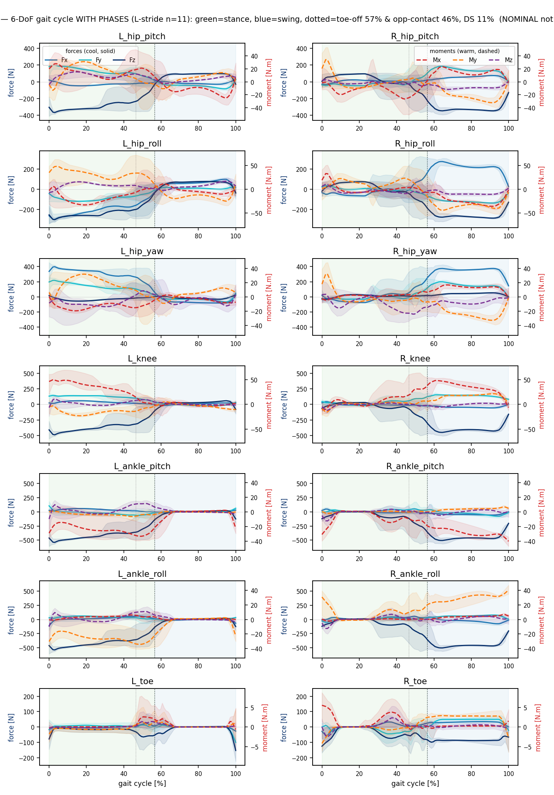
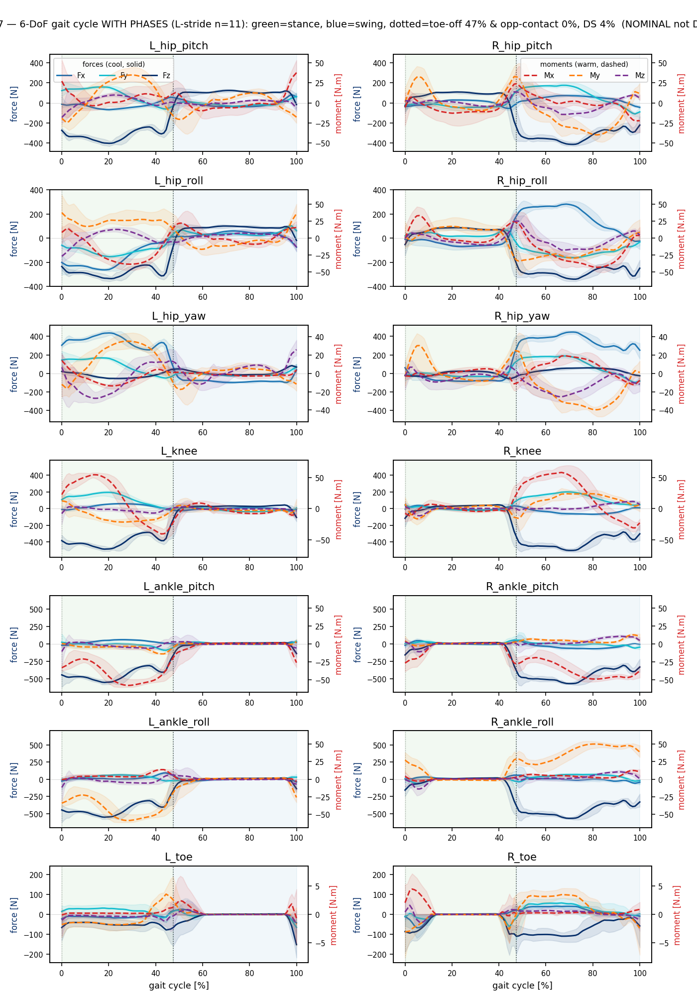
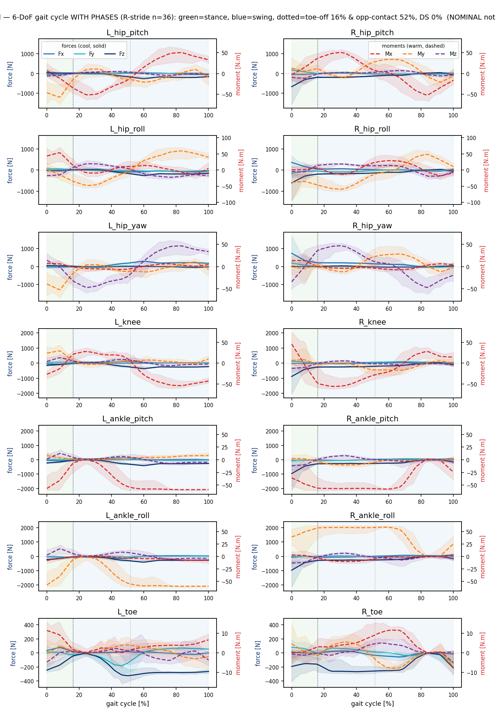
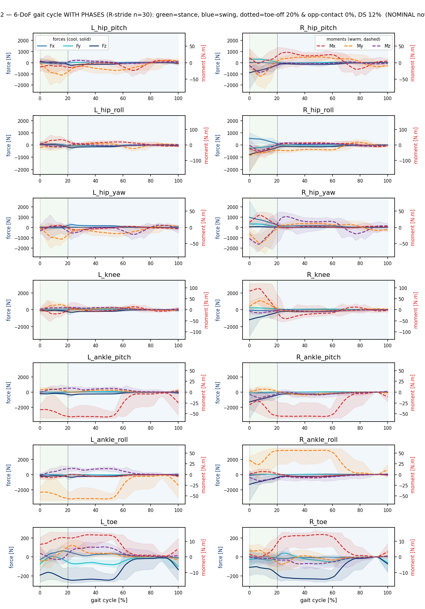
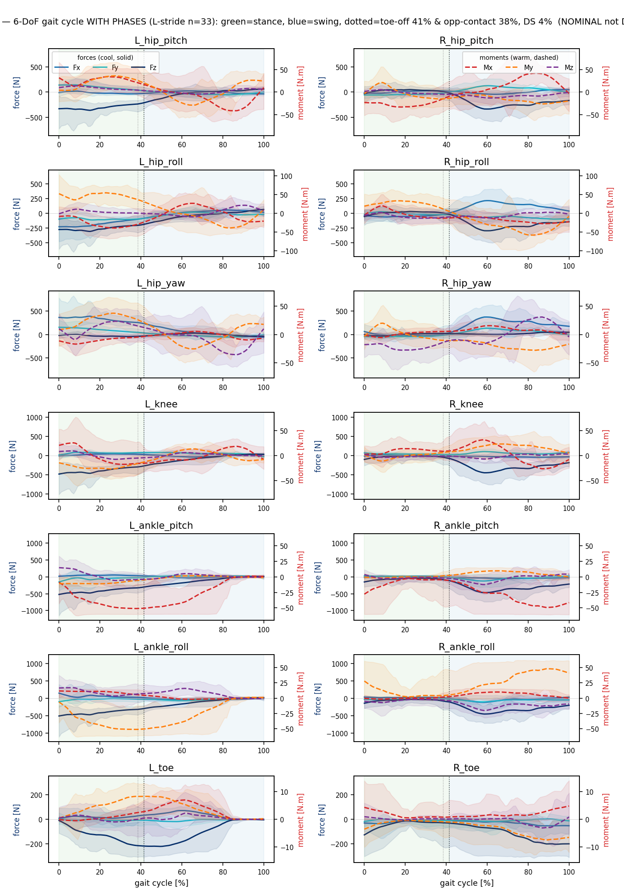
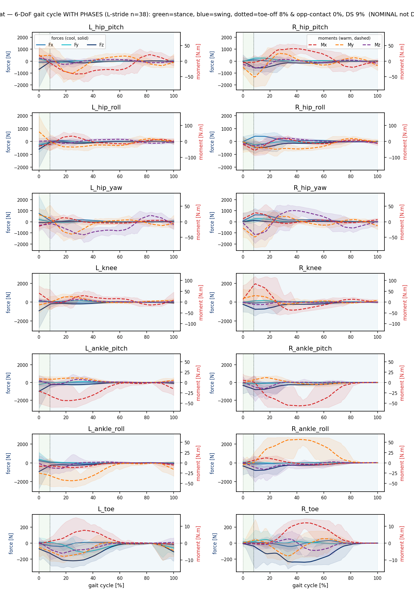
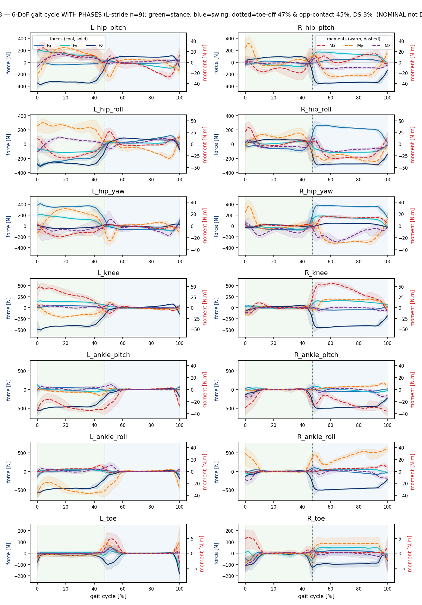
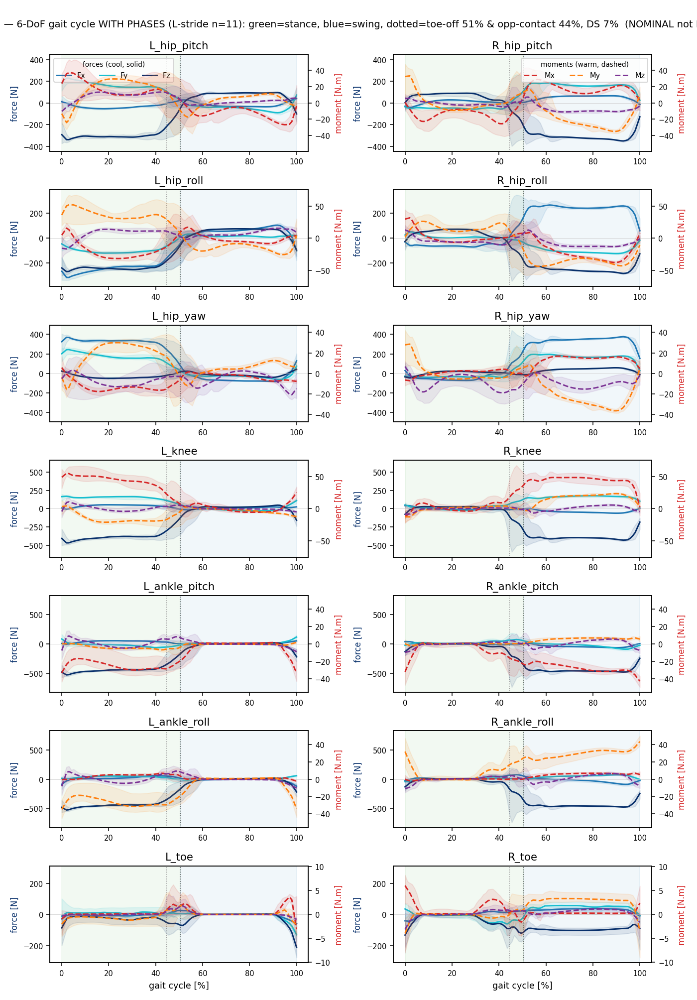
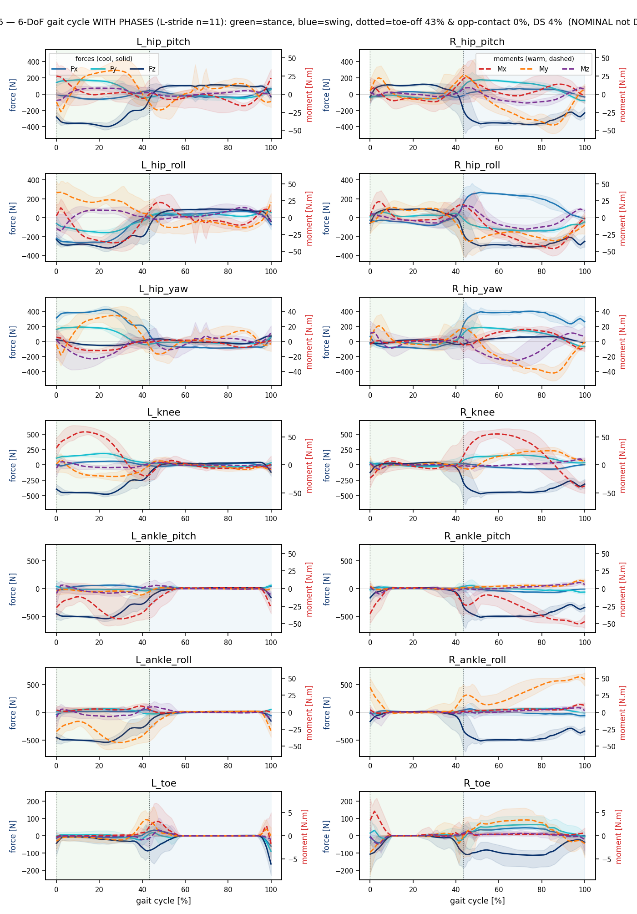

# 47 · 보행주기 6-DoF 관절하중 (위상 분할) — 설명 + plot

> [[46_wrench_6dof_loads]]의 시계열을 **보행주기로 정규화**한 버전. `scripts/wrench_gaitcycle.py` 생성. 실험별 plot 2종: `docs/assets/wrench/<exp>_gaitcycle.png`(plain)·`<exp>_gaitcycle_phased.png`(위상선·음영 추가).

## 어떻게 만들었나
1. measure sweep의 **정상-forward 구간**(cmd_vx>0.3·|vy|<0.15·|wz|<0.2)만 사용.
2. **heel-strike**(발 GRF 상승 crossing)로 stride 분할 — 접지 많은 발 자동선택(비대칭 gait 대응).
3. 각 stride를 **위상 0-100%**로 리샘플 → 관절별 6축(Fx/Fy/Fz·Mx/My/Mz) **위상별 평균 + p5-p95 음영밴드**.
- ★ **NOMINAL**(PLAY env, DR 끔). DR-worst 아님([[46_wrench_6dof_loads]] 주석 동일).

## 읽는 법
- **배치**: 행 = 관절(proximal→distal: hip_pitch→…→toe), 열 = **L \| R**(같은 행·y축 공유) → **좌우 비대칭 직접 비교**.
- **X = 보행주기 %** (0% = 기준발 heel-strike/접지). **Y = 힘[N] 좌축 / 모멘트[N·m] 우축**.
- **색 분리**: 힘 Fx/Fy/Fz = **쿨(파랑·청록·남색, 실선)**, 모멘트 Mx/My/Mz = **웜(빨강·주황·보라, 점선)** → 힘/모멘트 한눈에 구분. **음영** = 주기간 변동(p5-p95).
- **phased 버전**(권장): 🟢 **stance**(발 접지) / 🔵 **swing**(다리 흔듦) 음영 + 점선 = **toe-off**(발 뗌) · **opposite-contact**(반대발 접지 = double-support 시작).

## ★ 위상 타이밍 요약 (forward, 기준발 stride)
| 실험 | cycles | toe-off (stance%) | opp-contact% | double-support% | 비고 |
|---|--:|--:|--:|--:|---|
| gaitfix_v4 | 11 | **57** | 46 | 11 | stance 인간(~60%)에 근접·대칭 |
| gaitfix_v5 | 11 | 51 | 44 | 7 | 정상적 |
| gaitfix_v7 | 11 | 47 | — | 4 | 정상적(단 토우/골반 별문제) |
| gaitfix_v3 | 9 | 47 | 45 | 3 | 정상적 |
| gaitfix_v6 | 11 | 43 | — | 4 | 정상적 |
| g1vanilla | 33 | 41 | 38 | 4 | 중간 |
| g1_rigidtoe2 | 30 | **20** | — | 12 | ⚠ stance 짧음·비대칭(R발만) |
| g1van_full | 36 | **16** | 52 | 0 | ⚠ stance 매우 짧음·비대칭(R발만)·DS 0% |
| g1van_flat | 38 | **8** | — | 9 | ⚠ stance 극히 짧음 |

★ **관찰**: **gaitfix류(toe-off 43-57% = stance ~50%, 인간 ~60% 근접·대칭)** vs **G1-reward류(toe-off 8-20% = stance 매우 짧음 = 튀는/flighty, 비대칭 절뚝)**. 앞서의 L/R 비대칭(G1류는 한 발만 cycle, L발 GRF ~31N)과 일치. → **G1 reward gait는 추종(error_vel)은 좋아도 접지타이밍·대칭성이 비정상** = 사용자가 본 wobble의 정량 근거.

## phased plots

(plain 버전 = 위상선 없는 `<exp>_gaitcycle.png`. 전 per-component peak/rms/p95 표·시계열 = [[46_wrench_6dof_loads]].)
