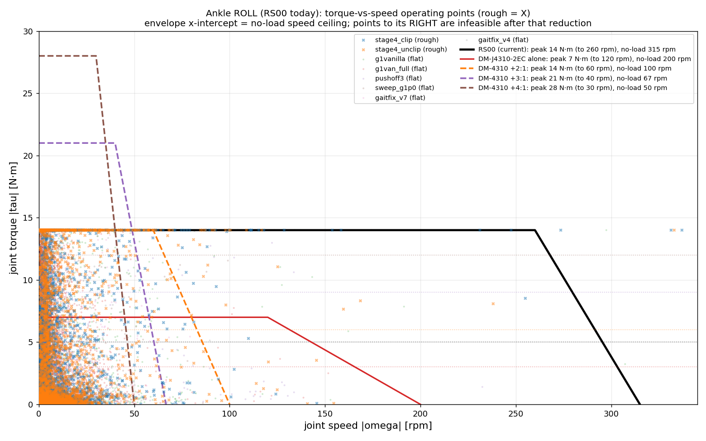
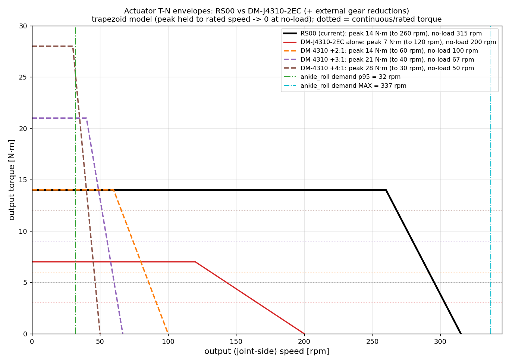

# 49 · Ankle 액추에이터 T-N 사이징 — RS00 vs DM-J4310-2EC + 감속비 (rough 포함)

> 트리거 (user 2026-06-25): "Ankle 토크를 더 늘려야. rough 포함 토크-RPM 산점도(실험별 색). **감속비 추가로 액추에이터 바꾸면 속도가 줄 텐데, 고속을 요구하는 경우가 있는지** 검토. RS00·DM-J4310-2EC 속도-토크 선도도."
> 데이터: 기존 measure npz (rough = stage4, base_height std 0.31≫0.01 flat로 확인) + 액추에이터 사양은 다중소스 검증 워크플로 `actuator-tn-specs`(공식 매뉴얼+유통사, HIGH confidence). 스크립트 `scripts/scatter_torque_rpm.py`·`scripts/motor_util_cross.py`.

> ★ **업데이트 2026-06-28 — 최종 ankle_roll 모터 = DM-J4340-2EC** (DM-J4310 아님; 더 큰 57mm 형제). 사용자 제공 **공식 데이터시트**: peak **27** / rated **9** N·m, 무부하 **100rpm@48V**(52@24V), 정격 36rpm, **40:1**, Kt~3.6, 362g. → 단일 모터로 충분(peak 27 > 필요 ~20, rated 9 > rough RMS 7.3, 무부하 100rpm은 운전점 ~0.6%만 클립) → **외부 감속비 불필요**(아래 DM-J4310+3:1 분석은 참고용). knee는 **+1.8:1**(effort 216/vel 111). 로봇모델은 reward_tuning 브랜치(primitive collision + G1 발바닥 + toe 복원) 채택. ⚠ 웹 일부는 "14/40 V1.1"을 인용하나 실물 데이터시트는 **27/9** — 이걸 사용.

## 1. 동기 — ankle_roll 토크기아 ([[48_motor_util_sizing]])
- **25 실험 전부** ankle_roll이 **peak(14 N·m)에 saturation**, RMS는 정격(5) 대비 **101~200%**. **rough(stage4)** RMS **7.3 = 147%**, peak에 16~18% 시간 붙음 = 정책이 14보다 더 원함. → 토크 증대는 데이터로 정당화.

## 2. 검증된 액추에이터 사양 (OUTPUT/관절측, 워크플로)
| | **RS00**(현재) | **DM-J4310-2EC V1.1** |
|---|--:|--:|
| peak 토크 | **14 N·m** | **7 N·m** |
| rated(연속) 토크 | 5 | 3 |
| 무부하속도 | **315 rpm** | **200 rpm** (24V) |
| 정격부하속도 | 260 | 120 |
| 내장 감속비 | 10:1 | 10:1 |
| 전압 | 48V | 24V |
| Kt | 1.48 | 0.945 |
| 무게 | 310 g | 300 g |

★ **DM-J4310-2EC 단독은 RS00의 절반 토크(7 vs 14)** — 그래서 **외부 감속비**가 필요. (주의: V1.2/V4는 12.5 N·m로 별개 모델. 48V→400rpm은 단일출처 저신뢰.)

## 3. 토크-RPM 운전점 산점도 (rough 포함, 실험별 색)

- 운전점이 **두 무리**: **저속(0~50rpm)·고토크(14까지 꽉 참)** = 지지/측방밸런스 / **고속(50~330rpm)·저토크(<5)** = 스윙 재배치.
- ★ ankle_roll 속도: **p95 = 32 rpm (낮음)**, 단 **MAX 337 rpm** (rough stage4 337, g1vanilla 307 — rare 스파이크).
- (ankle_pitch도 동일 경향, [scatter_tn_ankle_pitch.png](assets/scatter_tn_ankle_pitch.png) — RS03 60 N·m이라 토크 여유는 있으나 RMS 과부하는 별건.)

## 4. ★ 감속비 추가 = "고속요구가 있나?" 핵심 답
외부 감속비 N: **토크 ×N, 속도 ÷N** (이상적; 실제 단당 ~10-15% 손실).
| N | peak | rated | 무부하 | vs RS00 |
|---|--:|--:|--:|---|
| 1:1 (단독) | 7 | 3 | 200 | 토크 부족 |
| **2:1** | **14** | 6 | **100** | RS00 토크 일치 |
| **3:1** | **21** | 9 | **67** | RS00 +50% 토크 |
| 4:1 | 28 | 12 | 50 | RS00 2× (과함) |

★ **클립률 — 감속비의 낮아진 무부하속도를 초과하는 운전점 비율**:
| | p95 | max | >100rpm(2:1) | >67rpm(3:1) | >50rpm(4:1) |
|---|--:|--:|--:|--:|--:|
| **rough** | 38 | 337 | **0.6%** | **1.6%** | 3.1% |
| 전체 | 32 | 337 | 0.4% | 1.2% | 2.1% |

→ **고속요구는 존재하지만 극소수**(스윙의 드문 스파이크). 3:1을 넣어 무부하속도가 67rpm으로 떨어져도 **rough서 단 1.6%**의 운전점만 잘림. **p95(32rpm)에선 모든 감속비 옵션이 full peak 토크 제공**(T-N 곡선의 flat-top이 p95선 위). 즉 **감속비 추가는 속도 측면에서 거의 안전**.

## 5. 결론 / 권고 (rough 기준 "얼마나 강한 모터")
- **요구**: ankle_roll은 14에 clip+초과(16-18% 포화), rough RMS 7.3 → **peak ≥ ~20 N·m, rated(연속) ≥ ~9 N·m** 필요.
- ★ **권고: DM-J4310-2EC + 외부 3:1 (21 N·m peak / 9 N·m rated)** — peak 50% 헤드룸 + 연속이 rough RMS 7.3 커버. 무부하 67rpm으로 떨어지나 **rough 운전점 1.6%만 클립**(재학습 시 정책이 흡수 가능, 운전 98%가 <67rpm). RS00와 동급 무게(300g)에 컴팩트.
- **대안**: 토크 여유만 보면 2:1(14/6)은 RS00 동급(이미 포화라 실질 업그레이드 미미), 4:1(28/12)은 과토크+속도 더 클립. **3:1이 sweet spot.**
- **주의**: ① 기어 효율 ~10-15%/단 손실 → 실 토크 0.85~0.9×, ② 백래시·복잡도·관성 추가, ③ T-N은 사다리꼴 근사(실 datasheet 곡선과 차이 가능), ④ ankle_pitch(RS03)도 flat 푸시오프서 RMS 135-207% — 2차 검토 대상.

## 출처 (검증 워크플로 actuator-tn-specs, HIGH confidence)
- RS00: [RobStride 공식](https://robstride.com/products/robStride00) · [OpenELAB 가이드](https://openelab.io/blogs/learn/robstride00-qdd-14n-m-integrated-joint-motor-module-complete-guide) · [Seeed](https://www.seeedstudio.com/Robostride-00-Actuator-p-6664.html) · [매뉴얼](https://www.scribd.com/document/932254876/ROBSTRIDE-00-Motor-Instruction-Manual)
- DM-J4310-2EC: [Damiao datasheet(Seeed)](https://files.seeedstudio.com/products/Damiao/DM-J4310-en.pdf) · [V1.1 매뉴얼](https://sharingwin.com/wp-content/uploads/2025/09/DM-J4310-2EC-V1.1-Gear-Motor-User-Manual-V1.0.pdf) · [AIFITLAB](https://aifitlab.com/products/damiao-dm-j4310-2ec-v1-1-servo-motor) · [FoxTech](https://www.foxtechrobotics.com/damiao-j4310-2ec-mit-driven-brushless-servo-joint-motor) · [github dmBots](https://github.com/dmBots/DM-J4310-2EC)
- 내부: [[48_motor_util_sizing]] · [[43_ankle_hw_decision]] · [[41_ankle_pitch_pushoff_rs03_underspec]] · [[28_reward_actuator_fidelity]]

## 부록 — raw 검증 노트 (워크플로 actuator-tn-specs, 8 agent / 86 web tool-use)
- **RS00**: 출력측 14/5 N·m, 무부하 315rpm=펌웨어 ±33 rad/s(×9.549). 28극 3상 FOC, 정격 4.7 Apk / 최대 15.5 Apk, 전압 24-60V(공칭 48V). Kt 1.48 Nm/Arms. **만장일치**(공식 매뉴얼+OpenELAB+Seeed).
- **DM-J4310-2EC V1.1**: 출력측 7/3 N·m, 무부하 200rpm@24V, 정격속도 120rpm. 14 pole pair, 14-bit 듀얼 엔코더, CAN 1Mbps, ~300g. Kt 0.945 Nm/A(=모터측 ~0.0945×10:1, MEDIUM 신뢰 — 공식표 미기재, 정격점 3N·m/2.5~3.7A로 0.81~1.2 bracket). ★ **전압 의존**: 24V→200rpm(다수 출처 확실), 48V→400rpm(Seeed wiki 단일출처, 저신뢰 — 본 분석은 보수적으로 24V/200rpm 채택). ★ **모델 구분**: V1.1(7N·m/14-bit/300g)은 신형 **V1.2/V4(12.5N·m peak/16-bit/325g)와 별개** — 12.5N·m/450rpm 수치는 V1.2 또는 오기재라 제외.
- **감속비 출력(이상)**: 2:1=14/6@100rpm · 3:1=21/9@67rpm · 4:1=28/12@50rpm. 실제 단당 ~10-15% 손실. 기어다운은 모터 자체 정격전류/열포락은 불변(연속토크는 3N·m 점에서 ×N로 매핑).
