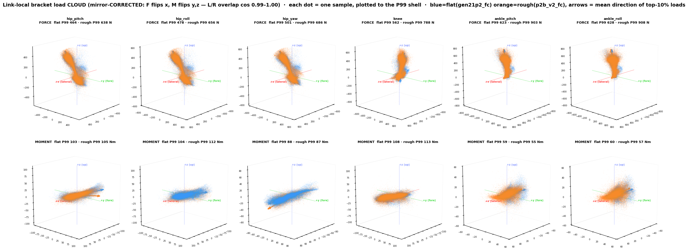
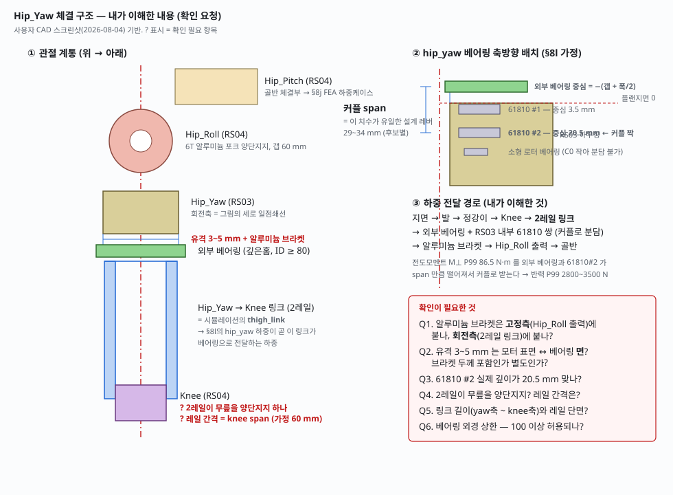

# 64 · 조인트 기구부·베어링 선정 — 설계 입력 사양 (Wrench 방법론 재정의)

> 2026-07-10. 사용자 질문: "설계용 관절별 Wrench — 모든 DR·모든 지형에서 각 성분 peak를 봐야 하나? 조인트 기구·베어링 선정에 뭐가 필요한지 다시 생각하라." 도구: [analysis/wrench_design_stats.py](../mujoco-sim/mjlab/analysis/wrench_design_stats.py). 액추에이터 선정 독트린(τ·ω의 RMS/P99/Peak)과 구별되는 **기구·베어링 전용 입력**을 정의.

## 1. ★핵심 정정 — "성분별 peak"는 틀린 통계
- 월드프레임 Fx/Fy/Fz/Mx/My/Mz의 **성분별 peak는 서로 다른 시각**에 발생 → 합성하면 존재하지 않는 하중(과설계). 반대로 베어링 피로엔 peak도 RMS도 아닌 다른 통계가 필요.
- 올바른 순서: ①**관절 로컬 프레임 분해**(축 $\hat a$): $F_r$(radial)·$F_a$(axial)·$M_t$(tilting, **앵커 이송** $M_{anchor}=M_{com}+r\times F$ 필수)·$M_z$(구동토크=액추에이터 몫) ②파생 스칼라별 통계 ③각 스칼라 **peak 시각의 동시 6-벡터**를 FEA 하중케이스로.

## 2. 용도별 통계 매핑 (docs/62 §4의 기구·베어링 확장)
| 설계 결정       | 통계                                                    | 비고                               |
| ----------- | ----------------------------------------------------- | -------------------------------- |
| 베어링 정적 C0   | 동시 P_0=X_0F_r+Y_0F_a의 in-DR **p99~peak** ×s0(1.5~3) | peak는 단일사건 지배·고분산(§4) — 멀티시드     |
| 베어링 수명 L10  | **RMC**(세제곱평균, 볼 p=3/롤러 10/3) + **등가회전수**(요동 스윙 보정)   | 피로등가하중∝P³ → RMS(p=2) 부적합         |
| 크로스롤러/틸팅 정격 | M_t p99·peak                                        | hip_yaw 145N·m vs SHD 사례([[56]]) |
| 하우징·볼트 정적   | F_r/F_a/M_t **각 peak 시각의 완전 동시 6-벡터** ×SF 1.5~2 | FEA 케이스 3~4개/관절                  |
| 하우징 피로      | rainflow(간이: p99 진폭+사이클수)                             | RMS는 근사                          |
| 낙상 tail     | 정적 사이징 ✗ → 과부하·퓨즈·보호정책 입력                             | [[56]]                           |

## 3. 캠페인 정의 ("모든 DR×모든 지형" 아님)
in-DR wide 랜덤 스윕 + 지형레벨 층화 + **멀티시드 3~5**(peak 분산 정량화) + push 주입. ⚠독트린의 "2.5 m/s"는 구 커리큘럼 — **현 정책 학습범위 ±1.5**이므로 in-DR 원칙상 2.5 측정은 2.5 재학습 후에만 유효(그 전엔 1.5 독트린).

## 4. 첫 결과 — P2-final flat 정식측정 (전체표: [[wds_p2_long]])
| 관절(L) | F_r RMS/RMC/p99/peak [N] | F_a p99 [N] | M_t p99/peak [N·m] | 등가회전 |
|---|---|---|---|---|
| hip_pitch | 259/291/519/**1884** | 79 | 82/229 | 40 rev/6분 |
| hip_roll | 240/270/456/1778 | 302 | 71/141 | 19 |
| hip_yaw | 72/86/205/329 | **518**(축=중력방향) | 91/176 | 31 |
| knee | 305/351/614/**2455** | 82 | 84/205 | 69 |
| ankle_pitch | 326/376/655/**2670** | 89 | 97/**317** | 61 |

관찰: ①**다관절 peak가 동일 시각(300.4s) 단일 착지 사건에 지배** — peak 단독 설계의 위험(p99 대비 4×)과 provenance 영상([[63]])의 필요성을 그대로 입증 ②하지 사슬 radial p99 ~500-650N(1~1.3×BW), RMC는 RMS의 +15% ③ankle_pitch $M_t$ peak 317 N·m는 별도 사건(98.6s) — 성분별 peak 시각이 다름의 실례.

## 6. ★관절별 반경력 로즈 — 베어링 타입 선정 (Request 3 시각화)
숫자표(§4-5)만으로는 "**하중이 한 섹터에 고정되나(정지하중) 링을 쓸고 도나(회전하중)**"를 볼 수 없다 — 이건 베어링 **수명계산식과 링 선정**을 바꾸는 1차 결정인데 스칼라 통계엔 안 나온다. [analysis/bearing_load_viz.py](../mujoco-sim/mjlab/analysis/bearing_load_viz.py)가 관절축 수직면의 **반경력 방향 분포를 극좌표 로즈**로 그린다(막대=섹터 평균 $|F_r|$, 색=하중-체류 빈도, 방향집중도 $R$=원형합성벡터: $R>0.6$ 고정하중·$R<0.3$ 회전하중). 패널마다 $F_r$ RMC/P99/peak, $F_a$ RMC/peak, $M_t$ P99/peak 병기.

![[bearing_load_p2r_final_wc.png]]

**설계 판독 (rough 최종 p2r_final_wc)**:
- **hip_yaw = 회전하중 + 대(大)축력**($F_a$ RMC 322/peak 1903N, 축=중력방향) → 반경 로즈가 넓게 퍼짐 + 축력 지배 ⇒ **스러스트(또는 앵귤러콘택트) 베어링 필수**, L10은 회전하중식. 캔틸레버 hip_yaw 이슈([[56]])와 결합해 재검토.
- **knee·ankle_pitch = 편향(biased, $R$≈0.30~0.40)** — 하중이 한 섹터에 완전 고정은 아니나 걸음 위상에 따라 좁은 호를 왕복 ⇒ **요동(oscillating) 등가회전수 보정한 L10**(§2), 링은 국부하중 대응.
- **ankle_roll = 최대 틸팅**($M_t$ P99/peak 최대) ⇒ **크로스롤러/틸팅정격 지배** 관절, 반경력은 작아도 모멘트가 사이징.
- 공통: 로즈 색(체류빈도)이 특정 섹터에 집중 = 그 링 구간 국부피로 → 정지륜 하중이면 **하중존 인덱싱**(주기적 각도 오프셋)로 수명 균등화 검토.

**한 줄**: §4-5 스칼라(크기)로 사이징하고, 이 로즈(방향·분포)로 **베어링 종류와 수명식**을 고른다. 로즈는 [[65_design_value_uncertainty]] 안전율 규칙과 짝 — 크기는 P99×SF, 종류는 로즈.

## 5. rough 최종 캠페인 결과 (2026-07-10 완료)
[[wds_p2r_final_wc]] 생성 — knee F_r RMS/RMC/p99/peak = 328/378/658~813/**~2980N**, peak는 초반 착지 사건(5~9s) 지배. peak 영상: [[63_peak_provenance_clips]]의 p2r_final_wc 편. 4절 설계기 worst 데이터도 이 캠페인으로 교체됨(무릎 ω p99 10.4 rad/s — 구 blind 캠페인 28.9의 인공물 해소). 남은 것: **멀티시드 3~5 반복**으로 peak 산포 정량화(단일 사건 지배 확인됨) + ±1.5 독트린 확정 또는 2.5 재학습.

## 7. ★설계 확정용 링크별 wrench 총괄 (2026-07-13, fc 권위 데이터 — RMS/P99/peak)
조인트프레임(앵커 이송) $F_r$(반경)·$F_a$(축)·$M_t$(틸팅), L+R pooled. 형식: **RMS / P99 / peak**. 사용법: 베어링 L10=RMC(≈RMS+15%)·정격/반복=**P99×1.25**·정적 C0=P99×1.5~3·**raw peak 사이징 금지**(클립/단발충격, [[65_design_value_uncertainty]] §4-5). 두 앵커 중 **관절별 큰 쪽**으로 설계.

### FLAT 앵커 (bentp2_fc)
| 관절(링크) | F_r [N] | F_a [N] | M_t [N·m] |
|---|---|---|---|
| hip_pitch | 257 / 476 / 1517 | 43 / 110 / 231 | 28 / 87 / 231 |
| hip_roll | 192 / 355 / 1576 | 185 / 403 / 542 | 37 / 112 / 160 |
| hip_yaw (thigh) | 148 / 343 / 470 | **233 / 431 / 1549** | 45 / 131 / 293 |
| knee (shin) | 306 / 566 / 2088 | 39 / 91 / 150 | 28 / 89 / 208 |
| ankle_pitch | 334 / 619 / 3104 | 38 / 99 / 266 | 29 / 105 / 358 |
| ankle_roll (foot) | 330 / 600 / 2373 | 67 / 259 / 2070 | **50 / 193 / 1127** |

### ROUGH 앵커 (p2r_fc) ⚠지형혼합 — §7c 교정본 사용
| 관절(링크) | F_r [N] | F_a [N] | M_t [N·m] |
|---|---|---|---|
| hip_pitch | 275 / 550 / 2366 | 36 / 99 / 228 | 23 / 73 / 376 |
| hip_roll | 246 / 494 / 2302 | 139 / 320 / 830 | 19 / 55 / 161 |
| hip_yaw (thigh) | 89 / 232 / 599 | **278 / 566 / 2560** | 25 / 74 / 333 |
| knee (shin) | **324 / 677 / 3019** | 38 / 87 / 154 | 21 / 73 / 385 |
| ankle_pitch | **347 / 740 / 3280** | 39 / 97 / 471 | 22 / 87 / 470 |
| ankle_roll (foot) | 347 / 730 / 3027 | 49 / 179 / 1295 | 35 / 124 / 522 |

- ⚠**2026-08-04**: 본 절 **$M_t$ 컬럼은 모멘트 기준점 버그(§8i)를 포함**해 과대평가다(관절별 −11~−57%). $F_r$·$F_a$ 컬럼은 기준점 무관이라 **유효**. 재계산 전까지 $M_t$는 보수적 상한.
- **관절별 지배 축**: hip_yaw=**축력**(스러스트 베어링, rough P99 566N) · ankle_roll=**틸팅**(크로스롤러, flat P99 193N·m) · knee/ankle_pitch=**반경력**(rough P99 677~740N) · hip_roll=축+반경 혼합(앵귤러콘택트).
- 반경력 P99는 flat<rough(+10~20%), 틸팅은 flat>rough — flat 고속기동이 모멘트를, rough 착지가 힘을 규정. 캐비앗: rough 앵커는 추종결손(65 §6c) 저속부하, gen2-rough 완성 시 갱신.

## 7b. 링크로컬 XYZ 성분별 wrench (2026-07-13 — FEA·하우징 방향별 설계용)
§7의 $F_r/F_a/M_t$(베어링 스칼라)와 상보: **링크 로컬축 성분별** RMS/P99(|·|)/peak(|·|), R다리 미러(부호 규약 [[51_joint_sign_conventions]]). signed 비대칭·방향 극값은 리포트 §10b 3D wrench(축별 빨간점)와 wds 동시 6-벡터 참조. ★시각화 정비 이력(2026-07-13): 설계선도(§8c)=구 부하선도 통합·regime_wrench→wrench 계통(§10) 이동·3D wrench 6관절(2×3) 확장 — 구조 표준은 experiment-note 스킬.

### FLAT 앵커 (bentp2_fc) — 링크로컬 XYZ 성분 (RMS/P99/peak, R다리 미러)
| 관절 | Fx [N] | Fy [N] | Fz [N] | Mx [N·m] | My [N·m] | Mz [N·m] |
|---|---|---|---|---|---|---|
| hip_pitch | 43/110/231 | 135/321/446 | 219/403/1461 | 29/99/176 | 25/80/225 | 13/47/90 |
| hip_roll | 42/107/219 | 138/331/458 | 224/412/1513 | 34/107/155 | 24/76/187 | 11/36/76 |
| hip_yaw | 44/111/227 | 141/338/470 | 233/431/1549 | 36/121/242 | 26/82/166 | 11/36/76 |
| knee | 39/91/150 | 108/256/452 | 286/538/2039 | 41/139/299 | 26/83/204 | 12/46/83 |
| ankle_pitch | 38/99/266 | 68/266/2052 | 327/597/2329 | 39/148/833 | 27/97/315 | 10/47/233 |
| ankle_roll | 43/127/345 | 67/259/2070 | 327/598/2373 | 49/191/1101 | 29/104/356 | 10/43/243 |

### ROUGH 앵커 (p2r_fc) — 링크로컬 XYZ ⚠지형혼합 — §7c 교정본 사용
| 관절 | Fx [N] | Fy [N] | Fz [N] | Mx [N·m] | My [N·m] | Mz [N·m] |
|---|---|---|---|---|---|---|
| hip_pitch | 36/99/228 | 75/201/532 | 264/527/2356 | 12/40/121 | 22/69/375 | 7/23/83 |
| hip_roll | 39/98/205 | 77/209/570 | 269/542/2430 | 16/50/139 | 19/60/296 | 6/18/67 |
| hip_yaw | 39/97/210 | 81/224/599 | 278/566/2560 | 15/49/195 | 20/64/270 | 6/20/68 |
| knee | 38/87/154 | 39/152/352 | 322/672/3018 | 20/64/283 | 20/72/385 | 5/16/64 |
| ankle_pitch | 39/97/471 | 49/180/1277 | 344/725/3022 | 20/76/382 | 21/86/435 | 5/19/178 |
| ankle_roll | 45/148/747 | 49/179/1295 | 344/722/3021 | 34/122/506 | 23/90/461 | 7/26/169 |

- ⚠**2026-08-04**: 본 절 **$M_x/M_y/M_z$ 컬럼은 기준점 버그(§8i) 포함** — 과대평가. $F_x/F_y/F_z$는 유효.
- **판독**: 전 관절 $F_z$(링크 축방향) 지배(P99 400~730N = 지지 압축), hip 사슬은 $F_y$(전후) P99 200~340N이 2위 — 하우징 굽힘은 $M_x$(P99: hip 40~121·knee 64~139·ankle_roll 122~191 N·m)가 규정. ankle 사슬의 $F_y$·$M_x$ peak(2052/1295 N·1101/506 N·m)는 착지 단발충격 — **P99×SF로 사이징**, peak는 FEA 하중케이스·과부하 정격 참조용.

## 7c. ROUGH 앵커 마스크 교정 (2026-07-13) ⚠선택편향 판명 — §7d(v2)가 권위
★발견(측정환경 영상 검수로 적발): p2r_fc 롤아웃에서 로봇이 4×4m 하이트필드 타일(7장) 밖으로 배회 — **rough 체류율 59.7%**(구 권위 p2r_wc_long도 68%). 즉 §7/§7b의 ROUGH 표는 **rough 60%+평지 40% 혼합**으로 rough 부하를 희석. 아래 = **타일 위 표본(47,888 steps)만** 재계산한 교정 권위값 (P99 약 +8~13% 상승). 프로토콜 수정 큐: 측정 시 주기적 중심 텔레포트 또는 대면적 uniform rough — gen2-rough 측정부터 적용.

**§7 교정 — ROUGH 앵커 rough-타일 한정 (p2r_fc, RMS/P99/peak)**
| 관절 | F_r [N] | F_a [N] | M_t [N·m] |
|---|---|---|---|
| hip_pitch | 278/598/2366 | 38/106/228 | 25/80/376 |
| hip_roll | 246/541/2302 | 147/350/830 | 21/60/161 |
| hip_yaw | 98/252/599 | 280/615/2560 | 28/80/333 |
| knee | 329/752/3019 | 38/90/154 | 23/80/385 |
| ankle_pitch | 354/838/3280 | 40/105/471 | 25/100/470 |
| ankle_roll | 352/815/3027 | 59/228/1295 | 39/148/522 |

**§7b 교정 — ROUGH 앵커 rough-타일 한정, 링크로컬 XYZ (R미러)**
| 관절 | Fx | Fy | Fz [N] | Mx | My | Mz [N·m] |
|---|---|---|---|---|---|---|
| hip_pitch | 38/106/228 | 83/223/532 | 265/572/2356 | 13/45/121 | 24/75/375 | 8/27/83 |
| hip_roll | 41/106/205 | 85/232/570 | 270/588/2430 | 17/55/139 | 21/65/296 | 7/22/67 |
| hip_yaw | 40/103/210 | 89/246/599 | 280/615/2560 | 17/54/195 | 22/69/270 | 7/22/68 |
| knee | 38/90/154 | 48/175/352 | 326/745/3018 | 22/71/283 | 23/78/385 | 5/20/64 |
| ankle_pitch | 40/105/471 | 59/229/1277 | 349/809/3022 | 23/88/382 | 24/97/435 | 6/23/178 |
| ankle_roll | 50/163/747 | 59/228/1295 | 349/806/3021 | 38/143/506 | 26/104/461 | 8/32/169 |

## 7d. ★★ROUGH 권위 확정 — 측정 v2 (텔레포트 프로토콜, 2026-07-13)
프로토콜 v2 = 명령블록마다 지형중심 텔레포트 + 엣지가드 + **시드고정 지형**(`PYG_TERRAIN_SEED`, fc/fcp 동일 지형) → **tile_dwell fc 99.8% / fcp 98.9%** (구 59.7%). ★교훈: §7c의 마스크 교정(+8~13%)은 **선택편향 과대**였음 — 클린 v2는 구 혼합치와 근접(예: knee $F_r$ P99 혼합 677/마스크 752/**v2 665**). **이 표가 rough 설계 권위.**

### v2 (텔레포트·시드, tile 99.8%) — $F_r$/$F_a$/$M_t$ RMS/P99/peak
| 관절 | F_r [N] | F_a [N] | M_t [N·m] |
|---|---|---|---|
| hip_pitch | 272/541/2387 | 35/91/247 | 23/72/283 |
| hip_roll | 242/493/2279 | 140/302/945 | 19/50/105 |
| hip_yaw | 90/214/382 | 275/560/2568 | 26/70/240 |
| knee | 320/665/2981 | 37/86/167 | 22/72/301 |
| ankle_pitch | 343/724/3194 | 38/92/322 | 23/87/427 |
| ankle_roll | 339/707/3046 | 70/235/1157 | 34/117/429 |

GRF: RMS 0.70 / P99 1.48 / peak 6.39 BW · knee tau RMS 17.3 P99 59.2
- 데이터: `p2r_v2_fc/fcp.npz`. push delta·영상은 리포트 §3b/§9 갱신분 참조. 잔여 갭: 정책 자체의 험지 추종결손(65 §6c)은 Gen-2.1 rough서 해소 예정.

## §8 전 관절 내장베어링 위험도 총괄 (2026-07-20, flat=gen21p2_fc·rough=p2b_v2_fc 실측 P99)
각 관절 축수직 굽힘 $M_\perp$·반경 $F_r$·축방향 $F_a$ (per-frame 실축 투영, worst=두 앵커 max):
| 관절 | M_⊥ P99 (flat/rough) | F_r P99 | F_a P99 | 위험도·처방 |
|---|---|---|---|---|
| **ankle_roll(발 gimbal)** | **199/222 N·m** ① | 599/859 | 277/323 | ★최대 — 단 2-RSU라 **관절 짐벌 베어링**이 받음(RS00 내장 아님). 짐벌 span·핀 직경이 좌우 최중요 |
| **hip_yaw** | **137/145** ② | 317/379 | 429/623 | ★캔틸레버 구조 — docs/56("우리 hip_yaw 145=SHD-20/25 틸팅한계, 업계는 저모멘트")과 정합. **내장 베어링 단독 불가**, 외부 지지/크로스롤러 필수 |
| ankle_pitch | 116/132 ③ | 616/908 | 108/125 | 2-RSU 짐벌 공유 — ankle_roll과 같은 짐벌 설계 사안 |
| hip_roll | 114/120 | 357/540 | **371/462** | 굽힘+**축방향 동시**(roll축 15° 캔트) — 축방향 정격 체크 |
| knee | 103/108 | 555/790 | 97/104 | shin 직결 캔틸레버면 hip_pitch와 동급 — span 확보 |
| hip_pitch | 97/105 | 459/637 | 120/132 | §67 §12 확정(span≥50mm/크로스롤러) |
- ★**일반 결론**: 전 관절 $M_\perp$가 **100~220 N·m** — 박형 내장 베어링(유효 span 10~20mm)이 단독으로 받으면 couple 5~22kN = 전부 정격 초과. **어느 관절도 "액추에이터 내장 베어링에 링크 직결 캔틸레버" 금지** — 출력측 외부 베어링(크로스롤러/span 쌍)이 모멘트를 받고 내장은 로터 지지만.
- rough가 전 관절 +5~15% (착지 GRF 1.74BW) — 사이징은 rough 값 기준.

## §8b 사용자 배치안 판정 — hip_pitch 크로스롤러 + 그외 61808(40×52×7) 반대편 지지 (2026-07-20)
구조 방향 ✓ (캔틸레버→양단지지, §8 원칙 충족). 61808 C0≈4.55kN(대표값, 메이커 확인 요), rough P99 기준, 베어링하중=couple($M_\perp$/L)+$F_r$/2:

| 관절 | 필요 span (s0=1.5 / 2.0) | 현실 span 50/70mm 사용률(설계값 P99×1.25) | 판정 |
|---|---|---|---|
| knee | 41 / 57 mm | 68% / 51% | ✓ |
| hip_roll | 43 / 60 mm | 72% / 53% | ✓ (Fa 10% OK) |
| hip_yaw | 51 / 70 mm | 84% / 61% | ✓ span ≥60mm 권장 (Fa 14% OK) |
| ankle_pitch | 51 / 73 mm | 83% / 62% | ✓ 짐벌 폭 ≥55mm 조건 |
| **ankle_roll** | **85 / 120 mm** | **131% / 97%(L70)** | ❌ **6808 불가** — 발 짐벌에 85mm span 비현실 |
- **ankle_roll 대안**: ① 6908(40×62×12, C0≈7.35kN) → L50서 81%(s0 1.23, 경계) ② 앵귤러/테이퍼 쌍 ③ 이 관절만 크로스롤러 ④ 짐벌 십자핀 대구경화. **발목 롤이 전 하지 베어링의 지배 지점**(M⊥ 222).
- 공통 주의: ①7mm 박형 링 — 하우징 끼워맞춤/크리프 관리, 축방향 고정은 한쪽만(반대편 플로팅) ②착지 peak(브리넬링) 별도 체크 — hip_pitch 선례상 raw peak≈P99×2.3 ③사이징은 rough 값(§8) 기준.

- ⚠**2026-08-04**: 본 절 판정은 $M_\perp$ 기준점 버그(§8i)를 포함한 **과대평가**다 — 보수측이라 판정은 유지되나 실제 여유는 더 크다. hip_roll/hip_yaw/knee는 **§8i가 최신**.
## §8c AB(2-RSU) 링크 스페리컬 베어링 C0 선정 (2026-07-24, 실측 동시성 기반)
로드엔드 하중 = GRF 아님, **링크 축력** $F=\frac{|\tau_p|}{2a_p}+\frac{|\tau_r|}{2a_r}$ (a_p 60·a_r 40mm, 프레임별 동시 합산 — 합산근사 아닌 실측 동시성). 5구성 스윕:
- **worst P99 = 571 N/rod (flat+push fcp!)** · peak ~1.1 kN · RMS 140~171 N. 순시설계 ×1.25=714 N, J^T 끝자세 계수 ×1.3~1.5 → **0.93~1.07 kN**.
- **스톨 상한(지배 기준) = RS03 60 N·m / r_c 30mm = 2.0 kN/rod** — 운용 P99의 2.8배로 하드스톱·폴트 시 물리 최대.
- **C0 선정**: 최소 = 스톨×s0 1.2 = **2.4 kN(≈245 kgf)** · 권장 = 스톨×s0 1.5 = **3.0 kN(≈306 kgf)** · **720 kgf(7.06 kN) = 운용 s0 9.9·스톨 s0 3.5 → 충분(안전 채택, 과잉 아님 — 끝자세·측하중 흡수)**.
- 근거 요점: ①GRF는 발목 짐벌 몫(§8 M⊥222와 분리) ②발목=push-민감 확인(fcp가 worst — fcp 직접앵커 규칙 재확인) ③특이점 회피는 ROM 하드스톱으로 보장 전제 ④조립오차 측하중 5~10% 여유는 s0에 포함 ⑤로드 좌굴·스윙각은 §69 §4c 체크리스트 병행.

### §8c-RT ★레드팀 정정 (2026-07-24) — "306kgf 하향 가능" 철회
§8c의 두 가정이 깨짐:
1. **스톨 2.0 kN은 물리 최대가 아님** — ①크랭크각: $F=\tau/(r_c\cos\theta)$ → 45°서 **2.83 kN**, 60°서 4.0 kN(작동범위 설계 의존). ②★**하드스톱/임팩트 경로가 모터클립을 우회**: 링크 wrench의 관절축 제약토크 실측 = **P99 148~160·peak 490~630 N·m**(모터 tau 클립 90의 5~7배!) — 관절리밋·착지 충격이 만드는 축토크. **이게 로드를 지나면 rod force P99 1.33 kN·peak ~5.3 kN** → 720 kgf(7.06 kN)조차 peak s0 **1.34(경계)**.
  ⚠**2026-08-17 폐기** — P99 148~160·peak 490~630과 거기서 파생된 1.33 kN/5.3 kN은 **§8i 기준점
  버그**(2026-08-04) 포함값이다. §8b·§8d·§8e·§8f엔 붙은 경고가 **본 절에만 없어서** 이 수치가
  docs/72 §3d와 docs/71 §17 감사목록으로 전파됐다. 보수측이 아니라 **무효**다: 모터토크와의 상관이
  보정 전 −0.06~+0.31 → 보정 후 +0.73~+0.99로, 보정 전 계열은 제약이 아니라 CoM 레버항이 지배한다.
  확정 기준은 [[78_ankle_stopper_derivation]] §12 — 캡 접촉 프레임만·31 롤아웃·전 프레임:
  **pitch 172.5 / 379.0 · roll 82.1 / 164.2 N·m**.
2. 미검증 5건: CAD 실측 암(a_p/a_r — F∝1/a)·J^T 전자세 최대(큐된 2-RSU 툴 미구축)·요동 마모 동정격(C0만 봤음)·로드엔드 미스얼라인각 vs 발목 ROM·rough+push(fcp) 데이터 부재.
**정정된 권고**:
- **720 kgf 유지가 "하한"** (306kgf 하향 금지 철회). 
- ★**구조 지시가 베어링 선정보다 중요**: **발목 기계 하드스톱을 로드가 아니라 짐벌/관절측에 배치** — 그러면 로드엔드는 스톨+크랭크각 기준(≤2.8 kN, 720kgf s0 2.5 ✓)으로 회귀. 하드스톱 하중이 로드 경유가 불가피한 설계면 **1000 kgf급+** 필요.
- 하향 검토 재개 조건: CAD 암 확정 + 2-RSU J^T 전자세 툴 + 스톱 위치 확정 3건 충족 후.

## §8d AB 링크 부품 선정 — 스페리컬(JS/JET) + 스트리퍼 볼트(MSB) (2026-07-24)
하중 기준(§8c/RT): 운용설계 714 N · 스톨+크랭크각 **2.83 kN** · (하드스톱 로드경유 금지 지시 전제).
**① 베어링: JET8 (무급유, 내경 8) 1순위 / JS8 대안**
- 사이즈 8 확정: 5/6은 정격·생크·M나사 모두 급수 부족(아래 볼트 굽힘도 동일 결론). 720kgf(7.06kN)급=8 사이즈 정격대와 정합.
- 무급유(JET) 사유: ①발목 링키지=재급유 불가 위치(정비성) ②하중비 극저(RMS 165N=정격의 ~2%)로 무급유 마모수명 여유 ③보행=고빈도 미소요동 — 그리스 프레팅·먼지 연마제화 회피 ④무급유 허용하중이 급유 대비 낮아도(카탈로그 확인 요) 스톨 2.83kN에 s0≥1.5면 성립. ⚠JET8 정적정격이 4.2kN 미만이면 JS8(급유)로 — 호핑·임팩트 시험 위주 rig도 JS8+정비주기 권장.
**② 볼트: MSB8 (생크 ø8·M6) — 단, 오프셋 규율이 본체**
- 굽힘 계산(SF2, 550MPa): M6 나사골 M_allow 5.9 N·m → **스톨 2.83kN서 허용 오프셋 2.1mm** = 나사골이 모멘트 받는 구조면 즉시 파단권. 생크 ø8은 27.6 N·m → 9.8mm.
- **설계 규율**: ①**예압 체결 필수**(규정토크+나사고정제) — 모멘트를 나사골이 아닌 **시트면 마찰·접촉**이 받게 함(스트리퍼 볼트 표준 관행) ②**스페이서 ≤3mm**(볼중심 오프셋 ≤7mm: 생크 기준 s≈4, 시트면 전달 전제) ③스페이서 두꺼워지면 **MSB10(M8)** 상향 또는 ★**양단지지(클레비스) 전환 — 굽힘 자체 소거, 스톨경로 불확실성까지 해소하는 최선** ④MSB6(M5 골 3.5 N·m)은 기각.
- 길이: 시트면~(스페이서 t + JET8 볼폭/2) + 나사 물림 ≥1.5d(M6→9mm+). 예: t=3 → MSB8-**(판두께+7)** 라운드업.

- ⚠**2026-08-04**: 본 절 판정은 $M_\perp$ 기준점 버그(§8i)를 포함한 **과대평가**다 — 보수측이라 판정은 유지되나 실제 여유는 더 크다. hip_roll/hip_yaw/knee는 **§8i가 최신**.
## §8e 발목 RP 짐벌 동/정하중 (2026-07-24, 하드스톱 짐벌배치 반영 실측)
⚠⚠**2026-08-17 정정 — 본 절 스톱잔여모멘트는 §8i 기준점 버그 포함, 4~6배 과대평가**:
§8c·§8d·§8f에는 붙은 §8i 경고가 본 절에만 누락돼 있었다. 같은 롤아웃(`rough.npz`)에
$M_{joint}=M_{com}+(p_{com}-p_{joint})\times F$ 전송을 적용해 재계산하면 아래 표의
**M_pitch 스톱 P99 213 → 45 (21 %) · peak 1056 → 280 (26 %)**, **M_roll 135 → 11 (8 %) ·
554 → 93 (17 %)**다. 확정 설계기준(캡 접촉 프레임만·7롤아웃 포락)은
**pitch 상시 172.5 / 설계 peak 379.0 · roll 82.1 / 164.2 N·m**(31 롤아웃·전 프레임;
roll은 docs/65 과부하층 `max(peak 153.8, P99×2)`가 지배) —
재계산 도구 `tools/ankle_stop_residual.py`, 사이징·판정은
**docs/78_ankle_stopper_derivation §12~§14**가 대체한다.
본 절의 **결론(하드스톱을 십자핀 밖 발↔정강이 패드로)은 보정 후에도 유지**된다.
경로분해: 정상작동 pitch/roll 모멘트=로드 몫 → 짐벌 = 힘 3성분(전량) + M_yaw(상시) + **스톱잔여모멘트**(=제약모멘트−모터토크: 리밋접촉+발 관성 성분). worst=rough:
| 하중 | RMS(동/수명) | P99 | 설계값(P99×1.25) | raw peak |
|---|---|---|---|---|
| 합력 F | 364 N | 920 | **1150 N** | 5.0 kN(착지) |
| M_yaw(상시 구조) | 11 | 44 | **55 N·m** | 195 |
| **M_pitch 스톱** | 52 | 213 | **266 N·m** | **1056 (스톱 임팩트)** |
| M_roll 스톱 | 36 | 135 | **168 N·m** | 554 |
- ★판독: ①스톱 모멘트를 십자핀 커플로 받으면 span 40mm 기준 peak **26 kN** — 불가. **하드스톱은 십자핀 경로 밖, 발↔정강이 직접 접촉 패드**로(§8c-RT 지시의 구체화) + **우레탄 범퍼로 임팩트 peak 완화**(강성 리밋 peak 1056은 sim 강체리밋 값 — 컴플라이언스로 1/3~1/5). ②베어링(십자핀) 사이징은 스톱 제외 시: F 설계 1150 N + M_yaw 55 N·m 커플(span 40→1.4 kN/핀) 수준 = 소형 니들/DU 부싱 성립권. ③rough 낙상성 peak 5 kN은 브리넬 체크(정적정격 대조).

## §8f hip_yaw 관절 6814 검토 — 방향별 실측 판정 (2026-07-24)
worst(flat/flat+push/rough 3구성): **Fr** RMS 150·P99 380·peak 629 N · **Fa** RMS 259·P99 625·**peak 3791 N** · **M⊥** RMS 48·P99 143·peak 273 N·m · M_axis(모터경로) P99 41.
| 항목 | 설계값(P99×1.25) | 6814(C0 11.4kN) 판정 |
|---|---|---|
| Fr+Fa 등가 P0 | 676 N | s0 **16.9** ✓✓ 여유 막대 |
| Fa 단독 | 782 N = 6.9% C0 | ✓ (단 **raw peak 3791 N=33% C0 → 25% 초과**, 착지 단발) |
| **M⊥ 179 N·m(설계)/273(peak)** | — | ★**단일 6814 불가**: 내부 커플 span 3~10mm 환산 시 **157~524% C0** |
⚠**2026-08-04 갱신**: 여기 M⊥(P99 143)은 기준점 버그 포함값이고 정정값은 **84 N·m(−41%)**다. §8i에서 span 30 mm·6814 기준 **s0 3.12로 통과**로 재판정됨 — 아래 "단일 6814 불가"는 span을 확보하지 못할 때만 유효.

**판정: ❌ 단일 6814로 yaw 링크 연결 불가** — Fr/Fa는 과할 정도로 여유지만 **전도모멘트가 지배**(단일 깊은홈은 모멘트 정격 사실상 0). 우리 §8 원칙(내장 단독 캔틸레버 금지)과 동일 결론.
**가능한 구성(같은 40~70 내경대, 우선순위)**:
1. ★**6814 2열 span ≥30mm**(동일 부품 2개, 하우징 폭만 확보): 커플 6.0kN=**52% C0**(s0 1.9 ✓), peak 80% ✓ — **가장 저렴·확실**. span 50mm면 31%.
2. **크로스롤러(RB70系, 70×90×10 근접)**: 1개로 모멘트·축·반경 전부 정격 — 스택 최단, §8 권고와 정합, 비용↑.
3. **단열 앵귤러(7014계) 2개 배면(back-to-back, DB)**: 유효 span이 접촉선 확장으로 실제 폭보다 커져 모멘트 지지 + 축하중 양방향. **단열 1개 단독은 6814와 동일하게 불가**(모멘트 못 받음) — 반드시 쌍.
4. **스러스트 단독: ❌** — Fa(782N)만 받고 M⊥·Fr 못 받음. 스러스트+깊은홈 조합도 M⊥ 미해결이라 비권장.
- 부수: Fa peak 3791 N(rough 착지)은 브리넬 체크 항목 — 2열/앵귤러 쌍이면 분담되어 무해권.

- ⚠**2026-08-04**: 본 절 판정은 $M_\perp$ 기준점 버그(§8i)를 포함한 **과대평가**다 — 보수측이라 판정은 유지되나 실제 여유는 더 크다. hip_roll/hip_yaw/knee는 **§8i가 최신**.
## §8g 6DoF 링크 지지부 방향별 설계 (2026-08-03, 프레임별 벡터합성 + 30° 섹터)
방법 정정 2건: ①**프레임별 벡터 합성**(기존 peak(M⊥)/L + peak(Fr)/2 스칼라합은 서로 다른 시각의 최댓값을 더한 과대추정 — knee peak 8960→7863) ②**링크로컬 30° 섹터별** P99/peak 분리(방향 무시 시 균일 두께 강제). 판재 8T·SF 설계값2/peak1.5.
| 관절 | span 가정 | 전체 P99 | 전체 peak | 살 두께 hot / cold | 방향성 | 판정 |
|---|---|---|---|---|---|---|
| hip_pitch | 50mm | 2016 | 8440 N | **5.0 / 0.8mm** | 5.9× | ★방향최적화 유효(hot 90~120°) |
| hip_roll | 60mm | 1965 | 3690 | 2.2 / 1.0 | 2.1× | 균일 2.5mm로 충분 |
| hip_yaw | 30mm | **4737** | 9053 | **5.3 / 3.4** | 1.5× | **전방향 5.5mm**(span 짧아 하중 큼·균일) |
| knee | 60mm | 1770 | 7815 | **4.6 / 0.6** | 7.4× | ★hot 60~120°만 5mm |
| ankle_pitch | 55mm | 2152 | 10949 | **6.5 / 0.7** | 9.6× | ★hot ±(60~120°) |
| **ankle_roll** | 55mm | 3689 | **22010** | **13.0 / 1.0** | 12.8× | ⚠하드스톱 경로 포함값 — §8e대로 **스톱을 패드로 우회하면 대폭 감소** |
- ★**공통 패턴**: 거의 모든 관절이 **±90° 밴드가 hot, 0°·180°(전후)가 cold** — 모멘트 커플이 한 평면에서 작용하기 때문. **살빼기 포켓은 0°·180°에, 스포크는 ±90°에** 배치가 일반 원칙.
- **예외 hip_yaw**: span 30mm으로 짧아 반력이 크고(P99 4737) 방향도 균일 → **전 방향 두껍게**. 캔틸레버성 구조의 대가.
- ⚠**2026-08-04 재계산으로 대체됨**: 방향(섹터) 컬럼은 §8h의 재계산 표를 사용할 것 — 재계산은 **330°~30°의 단일 hot 밴드**(90° 부근이 최저)를 주며 본 절의 "±90° 양쪽 hot"을 재현하지 못했다. 크기(P99/peak) 컬럼은 유효(직교변환 불변). hip_yaw는 미러 수정으로 방향성이 1.7×→2.7×로 커졌다.
- 캐비앗: span은 설계 가정치(hip_pitch 50·ankle 55 등). 실제 CAD 확정 시 F ∝ 1/span으로 재계산 필요. 각도는 관절축 로컬 기준이라 CAD 방향 매핑 별도.

---

## §8h 링크별 하중 구름 (load cloud) — 방향 분포 전수 시각화 (2026-08-04, ★자체검증으로 3건 정정)

각 점 = 측정 1샘플의 하중 벡터 **끝점**을 그 링크 자신의 좌표계에 찍은 것. 브라켓 하중(관절 반력 × −1), 조인트당 90,752 샘플(DS=2, 25 Hz), P99 껍질까지 표시. **파랑=flat**(gen21p2_fc) / **주황=rough**(p2b_v2_fc), 화살표=상위 10% 하중의 평균 방향.

### ★미러 규약 정정 (이 절의 초판 및 server.py의 버그)
모델 확인 결과 **L/R 링크 프레임은 방향이 동일**(대칭 자세에서 R_L^T·R_R = I)하고 **관절축이 링크로컬 x**(좌우)다. 따라서 시상면 반사는 **x를 뒤집어야** 한다:

| 물리량 | 올바른 R→L 미러 | 기존(틀림) | L·R 평균방향 일치도 |
|---|---|---|---|
| 힘 (폴라벡터) | (−1, +1, +1) | (+1, −1, +1) | 0.999~1.000 (기존 0.48~0.98) |
| 모멘트 (축벡터) | (+1, −1, −1) | (+1, −1, +1) | 0.986~0.999 (기존 −0.03~0.83) |

기존 미러는 y를 뒤집어 **R다리 구름을 반대쪽으로 접어버렸고, 없는 ±90° 쌍봉(bimodal)을 만들어냈다.** 수정 후 `tools/wrench_studio/server.py` 반영 완료. §7·§7b·`/api/agg`는 |성분| 절댓값 통계라 **영향 없음**. §8g의 30° 섹터 분석은 **hip_yaw만** 영향(아래 대조군 결과).

### 방향 구조 (미러 수정 후, 유의 하중 상위 10%)

| 관절 | +z 원뿔 중앙 | 원뿔 P95 | 방위 평균 | 방위 원형표준편차 | 반대쪽 로브 밀도 | 평균 방향 |
|---|---|---|---|---|---|---|
| hip_pitch | 31° | 47° | −78° | 25° | 0.01 | (+0.09, −0.48, +0.87) |
| hip_roll | 31° | 48° | −79° | 24° | 0.02 | (+0.08, −0.49, +0.87) |
| hip_yaw | 31° | 48° | −77° | 22° | 0.01 | (+0.10, −0.49, +0.87) |
| knee | 19° | 31° | **+72°** | 24° | 0.00 | (+0.09, +0.29, +0.95) |
| ankle_pitch | 10° | 32° | −16° | 71° | 0.28 | (+0.08, −0.07, +0.99) |
| ankle_roll | 13° | 33° | −22° | 82° | 0.30 | (+0.08, −0.07, +0.99) |

### 하중 역전 — 초판의 "부호 반전 없음"은 오류

초판은 상위 10% 표본만 보고 "+z 반구 100%, 맥동하중 R≈0"이라 했으나, **전 샘플로 보면 반대다.**

| 관절 | Fz<0 비율 | 역방향 \|Fz\| 최대 | 역방향 RMS | 정방향 RMS | 응력비 R |
|---|---|---|---|---|---|
| hip_pitch | 42.3% | 1569 N | 94 | 296 | −0.33 |
| hip_roll | 42.2% | 1607 | 89 | 304 | −0.32 |
| hip_yaw | 41.2% | 1628 | 77 | 317 | −0.30 |
| knee | 34.1% | 2225 | 47 | 370 | −0.34 |
| ankle_pitch | 31.7% | 2715 | 28 | 409 | −0.41 |
| ankle_roll | 32.3% | 2722 | 26 | 410 | −0.41 |

모멘트 주축(= 링크로컬 x, 시상면 굽힘, 성분 0.92~0.99)의 역전비도 **관절마다 다르다**(2026-08-04 기준점 수정 반영): hip_pitch −0.90 · hip_roll −0.85 · hip_yaw −0.82(거의 완전역전) · knee −0.54 · **ankle −0.40~−0.43(강한 단방향)**. 초판의 "전 관절 완전역전"은 틀렸다. 링크축 둘레 비틀림 share |Mz|/|M|는 중앙값 0.05~0.22, P99 0.31~0.88(hip_yaw·ankle에서 큼 — 단 hip_yaw의 Mz는 모터 자기 토크축).

⚠**모멘트 값 전반**: 아래 구름 그림과 통계는 §8i의 기준점 수정(로봇 CoM 기준)을 반영한 재계산본이다. 힘 관련 수치는 기준점과 무관해 불변(Fz<0 42.3% / R −0.33 등 재확인 완료).

### 지형 분리 — 통합 P99는 어느 조건도 아니다

| 관절 | flat P99 | rough P99 | (통합 P99) | flat peak | rough peak |
|---|---|---|---|---|---|
| hip_pitch | 464 | 638 | 563 | 1445 | 4849 |
| hip_roll | 478 | 656 | 579 | 1495 | 5049 |
| hip_yaw | 501 | 686 | 605 | 1523 | 5404 |
| knee | 562 | 788 | 686 | 1909 | 6552 |
| ankle_pitch | 623 | 903 | 789 | 2804 | 7183 |
| ankle_roll | 628 | 908 | 795 | 2844 | 7210 |

rough P99가 flat 대비 +37~45%. 통합 P99는 둘 사이의 혼합비에 의존하는 무의미한 값 → **관절별로 큰 쪽(rough)을 쓴다**(§7 원칙과 동일).

### peak는 여전히 설계값이 아님 — 지속시간으로 확증

2 BW 초과 사건의 **연속 구간 길이 중앙값 = 1샘플(40 ms 샘플간격), 최장 2**. 8 BW 초과는 flat 0회 / rough 4~5회이며 전부 단일 샘플. rough peak 7210 N = 14 BW인데 실측 GRF는 1.74~1.81 BW — 정상 보행으로 성립 불가한 **단일 스텝 수치 스파이크**다. 서브샘플 민감도도 확인됨(DS=4 → DS=2로 바꾸자 peak가 +30~40% 상승, P99는 ±2%). **§7의 "raw peak 사이징 금지" 원칙 그대로 유지.**

### 설계 결론 (정정본)

1. **하중은 단일 로브 원뿔**이다(쌍봉 아님). hip 3관절은 방위 −78°에서 완전히 일치, knee는 **반대편 +72°**, ankle은 방위가 퍼짐(원형표준편차 71~82°)이라 사실상 축대칭.
2. **hip과 knee의 hot 방향이 서로 반대다.** 브라켓 살빼기는 관절마다 반대쪽에 배치해야 하며, 공통 형상을 쓰면 한쪽이 과설계된다.
3. **원뿔은 좁다**: hip P95 47~48°, knee 31°, ankle 32~33°.
4. **볼트/브라켓은 역전하중을 받는다**(R = −0.30~−0.41, 역방향 최대 1569~2722 N). 프리로드로 갭핑·프레팅을 막아야 하며, 피로 허용응력을 맥동(R=0) 기준으로 잡으면 안 된다.
5. **모멘트는 시상면 굽힘**(주축 = 링크로컬 x, 성분 0.94~0.99)이고 hip은 완전역전·ankle은 단방향.
6. **ankle은 크고 순수한 축하중, hip은 작지만 기울어진 하중** — |F| RMS는 원위로 증가하나 원뿔각은 31°→13°로 좁아짐.

### §8g에 대한 영향 — 대조군 실행으로 확정 (초판의 추정은 틀림)
`support_sector_design.py`를 old/new 미러 두 조건으로 각각 돌린 결과, **hip_yaw를 제외한 5개 관절의 섹터표가 완전히 동일**했다. 이유: 섹터각은 **관절축에 수직인 평면**에서 재는데 pitch·roll 관절의 축은 링크로컬 x이고, 구 미러(y 반전)와 신 미러(x 반전)는 그 평면 안에서 같은 결과를 낸다. 축이 링크로컬 z인 **hip_yaw만 영향**을 받았다(hot/cold 1.7× → 2.7×, 최소 섹터 3267 → 2156 N).

따라서 **"§8g의 ±90° hot이 미러 버그 탓"이라던 §8h 초판의 추정은 기각**된다. 3D 구름의 쌍봉은 확실히 미러 버그였지만(방위각을 +z 축 둘레에서 재므로 x/y 반전에 민감), 섹터 분석은 다른 평면에서 재므로 무관하다.

남는 사실: **재계산 표는 ±90°가 아니라 330°~30°의 단일 hot 밴드**를 준다(90° 부근이 가장 cold). §8g 초판 스크립트는 남아 있지 않아 그 0° 기준선을 검증할 수 없다 — 기준선 차이로 추정되며, **아래 재계산 표가 §8g 방향 컬럼을 대체**한다.

### §8g 재계산 결과 (미러 + ★모멘트 기준점 모두 수정, 30° 섹터 지지반력 [N])
⚠**2026-08-04 2차 갱신**: §8i에서 모멘트 기준점 버그(로봇 CoM 기준을 링크 COM으로 오인)를 찾아 수정했다. 아래는 **두 버그를 모두 고친 최종값**이며, 하중이 전반적으로 **크게 내려갔다**(ankle_roll 전체 P99 4106 → 1273 N).

포크 양단지지 가정, 프레임별 벡터합성 지지반력 = Fr/2 ± (n × M⊥)/span. 각도는 **관절축에 수직인 평면**의 방위(0° = +z 투영 방향), flat+rough 통합.

| 관절 | 전체 P99 | 전체 peak | 0° | 30° | 60° | 90° | 120° | 150° | 180° | 210° | 240° | 270° | 300° | 330° | hot/cold |
|---|---|---|---|---|---|---|---|---|---|---|---|---|---|---|---|
| hip_pitch | 1554 | 5529 | 1626 | 1561 | 838 | 637 | 904 | 1402 | 1309 | 821 | 611 | 868 | **1704** | 1661 | 2.8× |
| hip_roll | 1817 | 6751 | 2075 | 1313 | 911 | 873 | 967 | 1560 | 1426 | 888 | 759 | 945 | 1342 | **2133** | 2.8× |
| hip_yaw | 2883 | 6307 | 2327 | 1541 | 2310 | 2098 | 2499 | **3251** | 3130 | 2542 | 2232 | 3091 | 3217 | 3122 | 2.1× |
| knee | 927 | 5408 | **1005** | 889 | 751 | 388 | 271 | 484 | 444 | 321 | 457 | 672 | 883 | 999 | 3.7× |
| ankle_pitch | 679 | 5291 | 700 | 798 | 587 | 241 | 117 | 59 | 60 | 96 | 204 | 591 | **858** | 762 | **14.6×** |
| ankle_roll | 1273 | 5265 | **1400** | 1222 | 871 | 204 | 149 | 132 | 127 | 154 | 246 | 841 | 1278 | 1367 | 11.0× |

- **hot 밴드는 300°~30°의 단일 밴드**(hip_yaw만 예외로 거의 전방향 균일 2.1×). §8g 초판의 "±90° 양쪽 hot"은 재현되지 않으며, 실제로는 **90°~240°가 cold**다.
- **ankle 계열의 방향성이 압도적**(14.6×, 11.0×) — 살빼기 이득이 가장 큰 관절. 반대로 **hip_yaw는 전방향 균일**이라 균일 두께가 맞다(§8g 결론 유지).
- 전체 P99가 §8g 초판(hip_pitch 2016 / ankle_roll 3689) 대비 **20~65% 낮다** — 초판은 모멘트 과대평가로 과설계였다.

재현: `analysis/support_sector_design.py [new|old]`.

재현: `analysis/loadcloud_collect.py`(수집) → `analysis/loadcloud_plot.py`(렌더). cwd=mjlab, `CUDA_VISIBLE_DEVICES="" .venv/bin/python3`.

---

## §8i hip_roll / hip_yaw / knee 베어링 재검토 (2026-08-04) — ★모멘트 기준점 버그 발견·수정

### ★★ 발견: 기록된 wrench의 모멘트 기준점이 틀려 있었다
`measure_loads.py`가 저장하는 `Tx/Ty/Tz`는 MuJoCo `cfrc_int`이고, 그 토크는 **로봇 CoM**(`subtree_com[body_rootid]`) 기준이다. 그런데 모든 후처리 코드가 **링크 COM**(`xipos`) 기준으로 가정하고 앵커로 이송하고 있었다.

물리 검증(모멘트의 관절축 성분 = 모터 토크여야 함):

| 가정한 기준점 | hip_roll corr | hip_yaw corr | knee corr | ankle_pitch corr | RMSE (knee) |
|---|---|---|---|---|---|
| `xipos` (링크 COM, 기존 코드) | 0.816 | 0.715 | 0.649 | **−0.082** | 34.3 N·m |
| **`subtree_com` (로봇 CoM, 정답)** | **1.000** | **0.999** | **1.000** | **0.980** | **3.5 N·m** |
| 무보정 | 0.776 | 0.643 | 0.392 | −0.081 | 44.6 N·m |

잔차 3.5 N·m(RMS τ 45.6 대비 8%)는 수동 감쇠·마찰·구속력으로 설명된다. **힘(`Fx/Fy/Fz`)은 기준점 무관이라 영향 없음** — 영향은 모든 모멘트 값에 한정된다.

수정 결과 M⊥가 **크게 내려갔다**(과대평가였음):

| 관절 | M⊥ P99 (구) | M⊥ P99 (정정) | 변화 |
|---|---|---|---|
| hip_roll | 119 | 106 N·m | −11% |
| hip_yaw | 143 | 84 | −41% |
| knee | 108 | 46 | **−57%** |

**반영 완료**: `server.py`(5곳), `analysis/loadcloud_collect.py`, `analysis/support_sector_design.py`, Wrench Studio 캐시 전량 폐기. **미반영(재계산 필요)**: §7 `M_t` 컬럼 · §7b `Mx/My/Mz` 컬럼 · §8b/§8e/§8f의 M⊥ 기반 판정 · §8g/§8h 초판 표. 모두 **보수측 과대평가**이므로 판정이 뒤집히지는 않으나 여유가 실제보다 작게 보였다.
⚠**2026-08-17 목록 누락 정정**: 이 목록에 **§8c-RT가 빠져 있었다**. 그 절의 관절축 제약토크
(P99 148~160·peak 490~630 N·m)와 파생 rod force(1.33/5.3 kN)도 같은 버그를 포함하며, 목록에
없었던 탓에 docs/72 §3d·docs/71 §17로 전파됐다 → **§8c-RT 폐기 처리 완료**(위 인라인 경고).
또한 이 계열은 "보수측 과대평가"가 아니라 **무효**다(모터토크 상관 −0.06~+0.31).

### 정정된 관절 하중 (미러·기준점 모두 수정, 관절축 분해, RMS / P99 / peak)

| 관절 | 지형 | F_r [N] | \|F_a\| [N] | M⊥ [N·m] |
|---|---|---|---|---|
| hip_roll | flat | 197 / 358 / 1494 | 181 / 371 / 697 | 35 / 97 / 170 |
| hip_roll | **rough** | 217 / **533** / 4592 | 187 / **464** / 2097 | 37 / **106** / 267 |
| hip_yaw | flat | 144 / 314 / 563 | 237 / 429 / 1502 | 34 / 86 / 125 |
| hip_yaw | **rough** | 147 / **380** / 782 | 259 / **619** / 5347 | 32 / **84** / 178 |
| knee | flat | 307 / 558 / 1908 | 42 / 97 / 176 | 15 / 36 / 72 |
| knee | **rough** | 331 / **785** / 6552 | 40 / **104** / 265 | 16 / **46** / 165 |

관절별 지배축은 유지: hip_yaw = **축력**, knee = **반경력**, hip_roll = 축+반경 혼합.

### span 스윕 — 베어링당 반경하중 (worst 지형, 프레임별 벡터합성)
설계값 = P99 × 1.25. 필요 C0 = 설계값 × s0.

| 관절 | span 30 | 40 | 50 | **60** | 70 | 80 mm |
|---|---|---|---|---|---|---|
| hip_roll 설계값 [N] | 4593 | 3489 | 2829 | **2392** | 2077 | 1843 |
| hip_yaw 설계값 [N] | 3649 | 2755 | 2216 | **1858** | 1601 | 1411 |
| knee 설계값 [N] | 2226 | 1755 | 1470 | **1285** | 1157 | 1061 |

### 판정 (설계 span 기준, C0는 docs 대표값 — 메이커 확인 요)

| 관절 | 설계 span | 설계값 | 베어링 | s0 = C0/P0 | 판정 |
|---|---|---|---|---|---|
| **knee** | 60 mm 포크 | 1285 N | 61810 (50×65×7, C0 6.1kN) | **4.75** | ✓✓ 매우 여유. 61808(4.55kN)도 s0 3.5로 가능 |
| **hip_roll** | 60 mm 포크 | 2392 N | 61810 | **2.55** | ✓ 여유. 61808은 s0 1.90(경계) → **61810 유지 권장** |
| **hip_yaw** | 30 mm | 3649 N | 6814 (70×90×10, C0 11.4kN) | **3.12** | ✓ span 30mm로도 통과 (기존 §8f는 M⊥ 과대평가로 1.9였음) |

축력 병합 체크: 각 관절에서 P0 = max(F_r, 0.6F_r + 0.5F_a)를 적용해도 F_r 항이 지배(hip_yaw 0.6×3649+0.5×774 = 2576 < 3649) → 위 s0 유효.

### ★ 새 발견: 지배 파손모드는 피로가 아니라 false brinelling(미동마모)

반전 사이 스윙 진폭을 실측했다(반전 약 6회/초):

| 관절 | 지형 | 스윙 중앙값 | P90 | 최대 | <10° 비율 | <30° 비율 |
|---|---|---|---|---|---|---|
| hip_roll | flat / rough | 3.5° / 3.8° | 14.0 / 13.0 | 26 / 37 | **78% / 81%** | **100% / 100%** |
| hip_yaw | flat / rough | 6.7 / 5.8 | 19.5 / 19.6 | 44 / 56 | **63% / 66%** | 99% / 98% |
| knee | flat / rough | 24.5 / 19.0 | 45.5 / 51.0 | 75 / 105 | 36% / 36% | 58% / 62% |

- 임계각 기준선 = 2 × (360/Z). 박형 볼베어링 Z ≈ 18~24 → **임계 30~40°**. 이보다 작은 진동은 볼이 인접 궤도까지 굴러가지 못해 **유막 재형성이 안 되고 미동마모(프레팅)** 가 진행된다.
- **hip_roll은 스윙의 100%가 30° 미만**, hip_yaw는 98~99%. 두 관절은 **완전히 false-brinelling 영역**이다.
- knee만 38~42%의 스윙이 30°를 넘겨 부분적으로 궤도를 재형성한다 — 세 관절 중 가장 안전.
- 피로수명은 구속조건이 **전혀** 아니다: 진동 등가속도가 hip_roll 5.5 rpm · hip_yaw 9.0 rpm · knee 22 rpm에 불과해, 형식적 L10은 10⁵~10⁷ 시간대다.
- §8h에서 밝힌 **하중 역전(R = −0.30 ~ −0.41)** 이 이를 악화시킨다: 하중이 매 스텝 부호를 바꾸면 볼-궤도 접촉이 풀렸다 물리며 미동 슬립이 커진다.

### 설계 처방 (재검토 결론)
1. **정격은 문제가 아니다.** 세 관절 모두 s0 2.5~4.8로 통과하며, 기준점 수정으로 여유가 더 생겼다. **베어링 형번을 키울 이유가 없다** — knee는 오히려 61808로 낮출 여지도 있다(s0 3.5).
2. **대신 미동마모 대책이 실질 설계항목이다**: ① 프레팅 방지 첨가제가 든 그리스(MoS₂/고체윤활 함유) ② 축방향 예압으로 내부 유격 제거(역전 시 갭핑 억제) ③ 하우징·축 끼워맞춤을 크리프가 나지 않게(헐거우면 링 자체가 미동) ④ 점검·재윤활 주기를 수명계산이 아니라 **미동마모 기준**으로 잡을 것.
3. **hip_roll이 가장 위험**(스윙 3.5° 중앙값, 100%가 임계 미만). 이 관절만은 **볼베어링 대신 니들/크로스롤러 또는 플레인 부시**를 검토할 가치가 있다 — 선접촉·미끄럼은 미동마모에 훨씬 둔감하다.
4. **span은 이미 충분**: 60 mm 포크에서 knee·hip_roll 모두 여유. span을 더 넓히는 것보다 위 2·3번이 실질 이득이다.
5. peak(hip_roll 4592 N, knee 6552 N F_r)는 §8h에서 확인한 대로 **단일 프레임 스파이크**라 정적 사이징에 쓰지 않는다. 다만 브리넬링 체크 항목으로는 남긴다.

재현: `analysis/bearing_review_rry.py` (cwd=mjlab, `CUDA_VISIBLE_DEVICES="" .venv/bin/python3`).

---

## §8j hip_pitch 체결부 FEA 하중케이스 (2026-08-04)

미러 규약(§8h)·모멘트 기준점(§8i) 모두 수정된 데이터. 하중은 **관절 앵커 기준 브라켓 하중**(반력 × −1), L+R 통합(R 미러), 50 Hz 전 프레임(181,500 샘플/지형).

**프레임 정의**
- **BASE-local(골반 고정측 브라켓용)**: x = 전방, y = 좌측(= hip_pitch 회전축), z = 상방
- **LINK-local(회전측 부품용)**: x = hip_pitch 회전축(좌우), y = 전방, z = 링크 상방
- 체결부가 골반에 볼트로 붙는다면 **BASE-local**을 쓴다.

### 성분별 통계 — BASE-local, rough(지배 지형)

| 성분 | RMS | P99 | peak | signed 범위 |
|---|---|---|---|---|
| Fx (전방) | 52 | 195 | 785 N | −693 ~ +785 |
| Fy (축방향) | 47 | 130 | 865 N | −559 ~ +865 |
| **Fz (상방)** | **272** | **623** | **4776 N** | **−3898 ~ +4776** |
| Mx | 26.0 | 70.4 | 153.0 N·m | −121.6 ~ +153.0 |
| My | 27.7 | 93.6 | 126.3 N·m | −126.3 ~ +124.3 |
| Mz | 5.6 | 18.6 | 119.3 N·m | −119.3 ~ +69.4 |
| \|F\| / \|M\| | 281 / 38.4 | 636 / 104.9 | 4849 / 168.4 | — |

flat은 전 성분에서 rough보다 작다(\|F\| P99 466 vs 636) → **rough가 설계 지형**.

### ★ 적용할 하중케이스 (동시성 — 축별 최댓값 조합 금지)

축별 P99를 그냥 합치면 \|F\| 665 N·\|M\| 118.6 N·m가 나오지만 **그 조합은 실제로 동시에 발생하지 않는다**. 아래는 전부 **같은 순간의 6성분 실측값**이다.

| 케이스 | 용도 | Fx | Fy | Fz | Mx | My | Mz | 비고 |
|---|---|---|---|---|---|---|---|---|
| **LC-1 정적강도** | 항복 판정 (지배) | −79 | +36 | **+638** | +35 | **+121** | −6 | P99 결합 대표 × 1.25 |
| **LC-2 최대 모멘트** | 굽힘 지배 확인 | +107 | −88 | +554 | **−122** | **−116** | −10 | rough max \|M\| 순간 |
| **LC-3 충격/과부하** | 소성 미발생 확인 | **+785** | −285 | **+4776** | **+153** | −15 | −28 | rough max \|F\| 순간 |
| **LC-4 역방향** | 볼트 이완/갭핑 | — | — | **−3898** | — | — | — | Fz 최대 음(뽑힘 방향) |

- **LC-1이 설계 지배 케이스**다. SF 1.25는 docs/65 doctrine(과도 = P99 × 1.25).
- **LC-3은 단발 스파이크**다: \|F\| > 2 BW 사건이 rough에서 0.26%·중앙 연속길이 **1프레임(20 ms)**, > 4 BW는 0.048%·전부 단일 프레임. **정적 사이징 기준으로 쓰지 말고**, "이 하중에서 소성이 안 나는가"만 확인한다(추가 SF 불필요).
- **LC-4를 반드시 볼 것**: Fz가 **−3898 N까지 역전**한다(P99 수준에서도 −209 N). 볼트 예압이 분리하중을 넘지 않으면 갭핑·프레팅이 난다.

### 피로 하중 (BASE-local, rough) — 평균 + 진폭, R비

| 성분 | +P99 | −P99 | R비 | 평균 | 진폭(P99) |
|---|---|---|---|---|---|
| Fx | 105 | 151 | −0.70 | +18 | 128 N |
| Fy | 207 | 373 | −0.55 | −73 | 290 N |
| Fz | 684 | 209 | **−0.31** | +147 | 447 N |
| Mx | 82 | 101 | **−0.81** | −4 | 91 N·m |
| My | 70 | 60 | **−0.86** | −7 | 65 N·m |
| Mz | 29 | 31 | **−0.94** | −3 | 30 N·m |

- **모멘트 3축은 사실상 완전역전(R −0.81 ~ −0.94)** → 굽힘 피로 허용응력은 **R = −1** 기준으로 잡는다. 맥동(R = 0) 기준을 쓰면 위험측이다.
- 힘은 부분역전(Fz R −0.31) → 평균응력 보정(Goodman/Haigh)에 평균 +147 N을 반영.
- 사이클 수: 보행 반전 약 6회/초(§8i) → 1시간 보행 ≈ 2.2×10⁴ 사이클, 100시간 ≈ 2.2×10⁶ → **고사이클 피로 영역**.

### 적용 시 주의
1. **볼트면으로 모멘트 이송 필수**: 위 M은 **관절 앵커 기준**이다. 볼트 패턴 중심이 앵커에서 d만큼 떨어져 있으면 $M_{bolt} = M_{anchor} + d \times F$. d = 50 mm·\|F\| = 636 N이면 최대 **+32 N·m**가 더해진다(기준 105 N·m 대비 +30%) — 무시 못 한다.
2. **방향 편중**: hip_pitch 지지반력은 300°~30° 밴드에 몰리고 90°~240°가 cold(§8h 섹터표, 방향비 2.8×). 살빼기 포켓은 cold 쪽에.
3. flat 값은 참고용으로만(\|F\| P99 466·\|M\| 103.4) — 설계는 rough.
4. peak는 시뮬레이션 접촉 해상도의 단일 스텝 스파이크를 포함한다(§8h). LC-3을 통과 못 하면 먼저 그 프레임이 물리적으로 타당한지 확인할 것.

재현: `analysis/fea_loadcase_hip_pitch.py` (cwd=mjlab, `CUDA_VISIBLE_DEVICES="" .venv/bin/python3`).

---

## §8k 관절 스토퍼(하드스톱) — 한계 근방 실측 토크 (2026-08-04)

전달 토크 = 관절 앵커 기준 모멘트의 **관절축 성분**(§8i 검증본, 모터토크와 corr 1.000). 한계 접촉 시 구속력이 여기 포함되므로 **스토퍼가 받는 몫**이 τ 초과분이다. flat(gen21p2_fc) + rough(p2b_v2_fc), L+R, 50 Hz 전 프레임.

### 관절별 실제 도달 각도 vs 모델 한계

| 관절 | 모델 range | flat 도달 | rough 도달 | rough 여유 (하한/상한) | 스토퍼 접촉 |
|---|---|---|---|---|---|
| **hip_pitch** | −125 ~ +30° | −59.3 ~ +13.3 | −89.9 ~ +20.0 | **+35.1 / +10.0°** | **없음** |
| hip_roll | −45 ~ +25 | −23.9 ~ +14.3 | −33.5 ~ +17.2 | +11.5 / +7.8 | 없음 |
| hip_yaw | −50 ~ +50 | −26.8 ~ +30.6 | −34.1 ~ +33.5 | +15.9 / +16.5 | 없음 |
| knee | −140 ~ 0 | −103.4 ~ −16.9 | −127.7 ~ **+0.7** | +12.3 / −0.7 | 상한 스침 |
| ankle_pitch | −50 ~ +40 | −34.6 ~ **+48.2** | −40.7 ~ **+57.7** | +9.3 / −17.7 | **상시 접촉** |
| ankle_roll | −20 ~ +20 | −22.2 ~ **+29.9** | **−43.3 ~ +35.0** | −23.3 / −15.0 | **상시 접촉** |

### ★ hip_pitch: 학습된 정책이 스토퍼를 **한 번도 쓰지 않는다**

| 한계 | 0–1° | 1–2° | 2–5° | 5–10° |
|---|---|---|---|---|
| 하한 −125° (flat/rough) | 없음 | 없음 | 없음 | 없음 |
| 상한 +30° (flat) | 없음 | 없음 | 없음 | 없음 |
| 상한 +30° (rough) | 없음 | 없음 | 없음 | **1 프레임(0.001%)**, \|M\| 8.4 N·m, τ 20.3, ω 113°/s |

가장 가까이 간 게 상한에서 **10°**이고 그때 전달 토크가 8.4 N·m다. **보행 데이터로는 hip_pitch 스토퍼를 사이징할 수 없다** — 데이터가 없는 것이지 하중이 작은 것이 아니다.

### hip_pitch 스토퍼 사이징 근거 (보행이 아닌 이상상황)

| 케이스 | 값 | 근거 |
|---|---|---|
| **정적 지배: 액추에이터 밀어붙임** | **RS04 peak 120 N·m** | 제어 이상/폭주 시 모터가 스토퍼를 정격 최대로 민다 — 스토퍼는 최소 이걸 견뎌야 한다 |
| 스토퍼 반경별 접촉력 | r 30 mm → 4000 N · 40 → 3000 · 50 → 2400 · 60 → 2000 N | F = 120 / r |
| 충격 에너지 (최악) | **116 J** | I_eff 2.12 kg·m² (중앙, 범위 1.59~2.30) × ω_max 600°/s = 10.47 rad/s |
| 충격 에너지 (P99 속도) | 22.5 J | ω P99 264°/s |

- I_eff는 질량행렬 대각항이라 **하한**이다(다리 전체가 함께 감속하면 더 크다).
- 116 J는 실측 최대 각속도로 스토퍼에 그대로 꽂히는 가정 — 낙상 시나리오의 상한 참고치.

### ⚠ 시뮬레이션 한계 (스토퍼 설계 시 반드시 감안)
sim의 관절 한계는 **soft constraint**다(`solref [0.02, 1.0]`, `solimp [0.9, 0.95, 0.001]`). 실측 침투량:

| 관절 | flat 최대 침투 | rough 최대 침투 | 침투 중 비율 (rough) |
|---|---|---|---|
| hip_pitch / knee | 0.0° | 0.0 / 0.7° | 0.000 / 0.001% |
| ankle_pitch | 8.2° | **17.7°** | 3.71% |
| ankle_roll | 9.9° | **23.3°** | 1.39% |

**ankle 계열은 한계를 최대 23°나 뚫고 들어간다.** 실물 하드스톱은 강체라 그 자리에서 멈추므로, sim이 23° 침투 동안 서서히 흡수한 에너지를 **실물은 순간에 받는다**. 따라서 §8e·§8k의 ankle 스토퍼 하중은 **과소평가**이며, ankle 스토퍼는 에너지 기준(½Iω²)으로 따로 사이징해야 한다. hip_pitch·knee는 침투가 0이라 이 문제에서 자유롭다.

재현: `analysis/stopper_limit_torque.py` (cwd=mjlab, `CUDA_VISIBLE_DEVICES="" .venv/bin/python3`).

### §8k-b 관통 사건의 실제 동작 (2026-08-04, 영상)
rough(p2b_v2_fc)에서 ankle_roll 649구간·ankle_pitch 1592구간이 한계를 관통한다. 최악 2건의 전후 ±5 s 클립(실시간 50 fps, CPU 스틱피겨 — GPU 드라이버 다운으로 메시 렌더 불가):

- ![[mujoco/assets/pen_ankle_roll_R_41939.mp4]] — **ankle_roll 관통 23.3°** @ t=838.8 s, R다리
- ![[mujoco/assets/pen_ankle_pitch_R_85126.mp4]] — **ankle_pitch 관통 17.7°** @ t=1702.5 s, R다리

**ankle_roll 23.3° (제자리 선회 중 발 바깥날 착지)** — cmd vx +0.25 · wz **−1.00**(우선회):

| t [s] | GRF 해당발 | GRF 반대발 | base z | ankle_roll |
|---|---|---|---|---|
| 838.60 | 0 | 330 | 0.927 | −1.8° |
| 838.66 | 605 | 145 | 0.901 | −1.8 |
| 838.72 | 446 | 0 | 0.868 | **−29.2** |
| 838.78 | 766 | 0 | 0.859 | **−43.3** ← 관통 |
| 838.84 | 237 | 298 | 0.865 | −15.1 |

스윙(GRF 0) → 1프레임 만에 GRF 605 N 접지 → **40 ms 만에 −1.8° → −43.3°(약 1000°/s)**. base가 7 cm 떨어지며 발 바깥날로 먼저 닿아 **지면이 발목을 스톱 너머로 밀어넣는다**. 모터가 만든 게 아니다.

**ankle_pitch 17.7° (측방 스텝 중 경사면 착지)** — cmd vx +0.28 · **vy +0.74**:

| t [s] | GRF 해당발 | GRF 반대발 | base z | ankle_pitch |
|---|---|---|---|---|
| 1702.34 | 187 | 0 | 0.859 | 18.2° |
| 1702.40 | 371 | 663 | 0.836 | 35.6 |
| 1702.46 | 221 | 742 | 0.805 | 50.2 |
| 1702.52 | 572 | 581 | 0.798 | **57.7** ← 관통 |

양발 지지 상태로 base가 6 cm 가라앉으며 **60 ms 만에 18° → 58°(660°/s)** 배굴. rough 타일 경사/모서리를 밟아 지면이 발등을 밀어올린 것.

**스토퍼 설계 함의**: 두 사건 모두 **지면이 가한 변위 구동**이지 모터 토크가 아니다. 따라서 ankle 스토퍼는 토크 정격이 아니라 **충격 에너지·접근 속도**로 사이징해야 한다(접근 각속도 660~1000°/s). 실물 하드스톱은 이 각도를 그대로 정지시키므로 sim의 구속 토크는 하한이다.

재현: `analysis/penetration_clip.py --tag p2b_v2_fc --frame <n> --joint <j> --side <L|R>`.

---

## §8l hip_yaw 외부 베어링 재선정 — 내경 80 이상·깊은홈 (2026-08-04)

§8f(2026-07-24)를 **미러 규약(§8h) + 모멘트 기준점(§8i)** 수정 후 다시 계산하고, 새 조건(내경 ≥ 80 mm, 모터면에서 3~4 mm 이격, 깊은홈 볼베어링)으로 재선정.

### 1단계 — 무엇을 받아야 하나 (좌·우 분리 실측)

미러 없이 L·R을 독립 집계했다. RMS / P99 / peak:

| 지형 | 다리 | F_r [N] | F_a (+방향) [N] | F_a (−방향) [N] | M⊥ [N·m] |
|---|---|---|---|---|---|
| flat | L | 146 / 321 / 469 | 74 / 178 / 372 | 304 / 454 / 1229 | 35 / 88 / 121 |
| flat | R | 142 / 307 / 563 | 79 / 176 / 354 | 299 / 447 / 1623 | 34 / 84 / 125 |
| rough | L | 153 / **397** / 963 | 82 / 196 / 4210 | 341 / **729** / 4213 | 33 / 80 / 184 |
| rough | R | 140 / 367 / 782 | 77 / 178 / 676 | 322 / **740** / 5347 | 32 / **87** / 178 |

- **좌우는 크기가 거의 같다**(Fr 397 vs 367, Fa 729 vs 740, M⊥ 80 vs 87) → 어느 쪽도 지배적이지 않으니 **양쪽 포락**을 쓴다: **F_r P99 397 / peak 963 · F_a P99 630 / peak 5347 · M⊥ P99 86.5 / peak 184**.
- **축력은 한쪽으로 4배 편중**(−방향 P99 729~740 vs +방향 178~196). 축방향 위치결정은 −방향을 주로 받되, 역전(+방향)도 반드시 받아야 한다.

방향별(30° 섹터, 0° = +z 투영) P99 — 좌우 패턴이 다르므로 포락 사용:

| 항목 | flat L hot | flat R hot | rough L hot | rough R hot |
|---|---|---|---|---|
| F_r | 353 @ 150° | 345 @ 150° | 478 @ 180° | 436 @ 180° |
| M⊥ | 102 @ 330° | 103 @ 0° | 105 @ 0° | 109 @ 0° |

### 2단계 — 깊은홈 볼베어링의 한계
**단일 깊은홈은 모멘트 정격이 사실상 0이다.** M⊥ 86.5 N·m를 볼 열 하나로 받으면 유효 커플 span이 볼 접촉폭(수 mm)뿐이라 수만 N이 나온다. 따라서 외부 베어링은 **단독 지지가 될 수 없고**, 액추에이터 내부 베어링과 **2점 지지 쌍**을 이뤄 커플을 나눠 받는 구조여야 한다. → **설계 레버는 span 하나뿐이다.**

### 3단계 — 실제 지지 기하 (RS03 내부 스택)
사용자 실측 스택(요 축 플랜지면 기준): **61810** → 갭 10 mm → **61810** → 갭 3 mm → 소형 로터 베어링(OD 26 · ID <12 · H 5).

| 지지점 | 플랜지면으로부터 중심 깊이 |
|---|---|
| 61810 #1 | 3.5 mm |
| **61810 #2** | **20.5 mm** ← 커플을 받는 안쪽 지지점 |
| 소형 로터 베어링 | 29.5 mm (C0가 작아 커플 분담 불가) |

외부 베어링 중심 = −(3.5 mm 갭 + 폭/2). **커플 span = 외부 중심 ~ 61810 #2 중심**.

### 4단계 — span에 따른 베어링 반력 (프레임별 벡터합성, L/R 포락)

| span [mm] | RMS | P99 | peak | 설계값 (P99×1.25) | 필요 C0 (s0 1.5 / 2.0) |
|---|---|---|---|---|---|
| **17 (외부 없음)** | 2091 | 5227 | 7183 | **6533** | 9.80 / 13.07 kN |
| 20 | 1787 | 4451 | 6112 | 5564 | 8.35 / 11.13 |
| 25 | 1442 | 3574 | 4899 | 4467 | 6.70 / 8.93 |
| 30 | 1212 | 2988 | 4090 | 3735 | 5.60 / 7.47 |
| 40 | 924 | 2258 | 3078 | 2822 | 4.23 / 5.64 |

★ **외부 베어링은 선택이 아니다**: 내부 61810 쌍(span 17 mm)만으로는 설계값 6533 N → **s0 = 0.93**(C0 6.1 kN). 상시 소성압흔 영역이다.

### 5단계 — 내경 80 후보 비교 (깊은홈, 표준 치수)

| 후보 | ID×OD×W | 외부 중심 | span | 설계값 [N] | **내부 61810 s0** | 외부 필요 C0 (1.5/2.0) | 후보 C0(대표) → s0 |
|---|---|---|---|---|---|---|---|
| 61816 (=6816) | 80×100×10 | 8.5 | 29.0 | 3861 | **1.58** | 5.79 / 7.72 kN | ≈13.7 kN → 3.5 |
| **61916 (=6916)** | **80×110×16** | 11.5 | 32.0 | 3507 | **1.74** | 5.26 / 7.01 | ≈19.3 → 5.5 |
| 16016 | 80×125×14 | 10.5 | 31.0 | 3618 | 1.69 | 5.43 / 7.24 | ≈21.2 → 5.9 |
| 6016 | 80×125×19 | 13.0 | 33.5 | 3353 | **1.82** | 5.03 / 6.71 | ≈23.2 → 6.9 |
| 6216 | 80×140×26 | 16.5 | 37.0 | 3045 | **2.00** | 4.57 / 6.09 | ≈45 → 14.8 |

C0는 대표값 — **카탈로그 확정 필요**. 단, 선정의 근거는 아래 두 가지라 C0 오차에 둔감하다.

- ★**지배 제약은 우리 외부 베어링이 아니라 내부 61810이다.** 외부는 어느 후보든 s0 3.5~14.8로 과여유인데, 내부 61810은 1.58~2.00으로 아슬아슬하다.
- ★**폭이 넓을수록 두 번 이득**: C0가 커지고, 중심이 바깥으로 나가 **span도 길어진다**(61816 29.0 → 6016 33.5 mm).

### 6단계 — 축하중·기타 체크

| 항목 | 값 | 판정 |
|---|---|---|
| F_a 설계값 788 N | 61816 5.8% C0 · 61916 4.1% · 6016 3.4% | ✓ (깊은홈 가이드 0.25·C0 대비 여유) |
| F_a peak 5347 N | 61816 **39%** · 61916 28% · 6016 23% | ⚠ 61816은 가이드 초과 — 단발 스파이크지만 폭 넓은 쪽이 안전 |
| 등가 정하중 P0 | 0.6·3507 + 0.5·788 = 2498 < 3507 → **P0 = F_r** | 반경력 지배 |
| 미동마모(§8i) | 스윙 중앙 5.8~6.7°, **63~66%가 10° 미만** | ⚠ 정격보다 **그리스·예압이 실질 설계항목** |

### 7단계 — 판정

1. ⚠**내경 80 + 기존 외경 90 제한은 양립 불가**다. 표준 깊은홈 볼베어링은 **보어 80에서 최소 외경이 100 mm**(61816)다. 외경 제한을 **100 이상으로 완화**해야 한다.
2. **권장: 61916 (80×110×16)**. 내부 61810 s0 1.74로 여유 확보, 외부 s0 5.5, 축하중 peak 28%, 외경 110으로 비교적 컴팩트.
3. 외경을 125까지 허용할 수 있으면 **6016 (80×125×19)** 가 더 낫다(내부 s0 1.82, 축 peak 23%).
4. **61816 (80×100×10)은 비권장**: 외경은 최소지만 폭이 얇아 span이 짧고(29 mm) 내부 61810 s0가 1.58로 가장 낮으며 축 peak가 39% C0다. 외경 100이 절대 제약일 때만.
5. **3~4 mm 이격은 유리하다** — 그만큼 span이 늘어난다. 줄일 이유가 없다.
6. 남은 리스크는 **내부 61810**이다(s0 1.6~1.8). 더 키우려면 span을 늘리는 수밖에 없고, 그러려면 외부 베어링을 더 바깥으로 빼거나 폭을 키워야 한다.

**확인 필요 치수**: 위 표는 **61810 #2 중심이 플랜지면에서 20.5 mm** 깊이라는 가정에 의존한다. 실제 RS03 단면에서 이 값이 다르면 span이 그대로 이동하므로 4단계 표에서 다시 읽으면 된다.

재현: `analysis/hipyaw_bearing_reselect.py` (cwd=mjlab, `CUDA_VISIBLE_DEVICES="" .venv/bin/python3`).

---

## §8m hip_yaw 체결 구조 이해 정리 (2026-08-04, 사용자 CAD 확인용)

사용자 CAD 스크린샷(2026-08-04, Hip_Roll / Hip_Pitch / Hip_Yaw / Hip_Yaw-Knee Link / Knee 라벨)을 받고 정리한 구조 이해. **확정이 아니라 확인 요청본**이다.

### 내가 이해한 조립 순서 (위 → 아래)
1. **Hip_Pitch (RS04)** — 골반 체결부. FEA 하중케이스는 §8j.
2. **Hip_Roll (RS04)** — 6T 알루미늄 포크 양단지지, 갭 60 mm (§8i에서 61810 s0 2.55로 통과).
3. **Hip_Yaw (RS03)** — 회전축이 연직에 가깝게 서 있다.
4. **유격 3~5 mm + 알루미늄 브라켓** — 그 아래에 **외부 깊은홈 베어링**(그림의 초록)이 붙는다. 내경 ≥ 80.
5. **Hip_Yaw → Knee 링크 (2레일)** — 그림의 파랑. 이게 시뮬레이션의 **`thigh_link`** 다.
6. **Knee (RS04)** — 2레일 사이에 위치.

### ★ 시뮬레이션과의 대응 (중요)
그림의 **Hip_Yaw-Knee 링크 = `thigh_link`** 이므로, §8l에서 계산한 hip_yaw 관절 하중(F_r P99 397 · F_a P99 630 · M⊥ P99 86.5 N·m, L/R 포락)이 **정확히 이 링크가 베어링으로 전달하는 하중**이다. 별도 환산이 필요 없다.

### 하중 전달 경로
지면 → 발 → 정강이 → Knee → **2레일 링크** → **외부 베어링 + RS03 내부 61810 쌍(커플 분담)** → 알루미늄 브라켓 → Hip_Roll 출력 → 골반.

전도모멘트 M⊥를 외부 베어링과 61810 #2가 span만큼 떨어져 커플로 받는다 → 베어링 반력 P99 2800~3500 N (§8l 4단계).

### 아직 못 정한 두 가지 (사용자 요청 항목)
- **내륜/외륜 중 어디를 잡나** — 판단 규칙은 정해져 있다: **하중 방향에 대해 회전하는 링에 억지끼움**, 정지한 링은 중간/헐거운 끼움. 다만 어느 링이 회전측인지가 **Q1(브라켓이 고정측이냐 회전측이냐)** 에 달려 있어 답을 확정할 수 없다.
- **브라켓 살 두께** — 베어링 설계 반력 3507 N(61916 기준)을 받는 구조이므로, **브라켓 단면 형상·지지 스팬·볼트 배치**가 정해져야 계산할 수 있다(§8g/§8h의 방향별 두께 산정과 동일 방식). Q1·Q5 답이 오면 바로 산출 가능.

### 확인 요청 (Q1~Q6)
1. 알루미늄 브라켓은 **고정측**(Hip_Roll 출력/요 하우징)에 붙나, **회전측**(2레일 링크)에 붙나?
2. 유격 3~5 mm는 모터 표면 ↔ 베어링 **면** 거리인가, 브라켓 두께를 포함한 값인가?
3. §8l이 가정한 **61810 #2 중심 깊이 20.5 mm**가 실제와 맞나?
4. 2레일이 무릎 액추에이터를 **양단지지**하나? 레일 간격(= knee span, §8i 가정 60 mm)은?
5. 링크 길이(요 축 ~ 무릎 축)와 레일 단면 치수는?
6. 베어링 **외경 상한** — 보어 80에서 표준 깊은홈의 최소 외경이 100 mm라 기존 "OD ≤ 90"과 양립 불가(§8l 7단계). 100 이상 허용되나?

---

## §8n hip_yaw 외부 베어링 확정 계산 — 기하 확정본 (2026-08-04)

§8m Q1~Q6 사용자 답변 반영. **확정 조건**: 브라켓은 **요 모터 하우징(고정측)** 에 체결 · 유격 3~5 mm는 **모터면 ↔ 가까운 베어링 면** · 내부 61810 #2 깊이 **18~20 mm** · 2레일 폭 **52.5 mm** · 레일 두께 **8 mm** · **외경 상한 해제** · 필요시 모터측 베어링 보강 가능.

### 옵션 A — 외부 1개 (내부 61810 #2와 커플)
span = 갭 + 폭/2 + 내부 #2 깊이. 표는 **span / 설계값 [N] / 내부 61810 s0**:

| 후보 | OD×W | 깊이 18·갭 4 | 깊이 20·갭 4 | 깊이 20·갭 5 |
|---|---|---|---|---|
| 61816 | 100×10 | 27.0 / 4142 / **1.47** | 29.0 / 3861 / 1.58 | 30.0 / 3735 / 1.63 |
| 61916 | 110×16 | 30.0 / 3735 / 1.63 | 32.0 / 3507 / 1.74 | 33.0 / 3403 / 1.79 |
| 6016 | 125×19 | 31.5 / 3562 / 1.71 | 33.5 / 3353 / 1.82 | 34.5 / 3259 / 1.87 |
| **6216** | **140×26** | 35.0 / 3214 / **1.90** | 37.0 / 3045 / **2.00** | 38.0 / 2967 / 2.06 |
| 6316 | 170×39 | 41.5 / 2723 / 2.24 | 43.5 / 2601 / 2.35 | 44.5 / 2544 / 2.40 |

- **지배 제약은 여전히 내부 61810**(외부는 어느 후보든 s0 3.5 이상). 외경 해제로 **6216이 s0 2.00 달성** — 내부 보강 없이 통과.
- 61816은 깊이 18일 때 **s0 1.47로 미달** → 탈락.

### 옵션 B — 브라켓 안에 외부 베어링 2개(쌍), 내부 완전 면제

| 쌍 중심간 간격 S | 설계값 [N] | 필요 C0 (1.5 / 2.0) |
|---|---|---|
| 30 mm | 3735 | 5.60 / 7.47 kN |
| 40 | 2822 | 4.23 / 5.64 |
| 50 | 2272 | 3.41 / 4.54 |

**전 후보가 s0 ≥ 2.0을 통과한다.** 가장 얇은 **61816 2개를 30 mm 간격**만 줘도 외부 s0 3.7이고, 하중이 브라켓 안에서 닫히므로 **RS03 내부 베어링은 하중을 거의 안 받는다**.

### 옵션 A vs B

| | 축방향 돌출 | 내부 61810 | 외부 s0 | 정비성 |
|---|---|---|---|---|
| A: 6216 1개 | 갭4 + 26 = **30 mm** | s0 2.00 (하중 경로에 포함) | 14.8 | 내부는 교체·점검 불가 |
| B: 61816 ×2 @30 | 갭4 + 5 + 30 + 5 = **44 mm** | **거의 무부하** | 3.7 | 외부만 관리하면 됨 |

★ **B 권장**. 이유: §8i에서 hip_yaw는 **스윙 중앙값 5.8~6.7°, 63~66%가 10° 미만**으로 미동마모(false brinelling) 영역 한복판이다. 옵션 A는 그 마모를 **액추에이터 내부 베어링**이 나눠 받는데, 내부는 분해 없이 점검·재윤활·교체가 불가능하다. B는 마모 지점을 전부 외부로 빼서 관리 가능하게 만든다. 대가는 축방향 +14 mm.

### 내륜/외륜 — 어디를 잡나
**브라켓이 하우징(고정측)에 붙는다**는 답이 이 문제를 결정한다.

1. 브라켓은 하우징 **바깥 둘레**에서 내려오므로 기하학적으로 **외륜**을 잡는다. 중앙은 로터가 돌고 있어 고정측 보스를 통과시킬 수 없다.
2. 회전측인 2레일 링크의 보스(OD 80)가 **내륜**에 들어간다.

**끼워맞춤 방향은 직관과 반대다.** §8l 섹터 결과에서 F_r은 **링크 로컬 프레임**에서 150~180°에 고정돼 있다 = 하중 방향이 링크와 함께 돈다. 따라서

- **내륜(회전측·링크)**: 하중 방향이 이 링에 대해 **정지** → 점하중 → **중간/헐거운 끼움 + 축방향 클램프**로 충분
- **외륜(고정측·브라켓)**: 하중 방향이 이 링에 대해 **회전**(요 ±34° 범위) → 원주하중 → **억지끼움 필요**

단 요 스윙이 ±34°라 완전 회전은 아니므로 크리프 위험은 중간 수준이다. 알루미늄 브라켓 + 강 외륜은 열팽창 차(23 vs 11.5 ppm/K)로 ΔT +30 K·Ø140에서 **48 µm의 죔이 사라진다**. 과설계하지 말고 기존 방침대로: **가벼운 억지 + Loctite 638 + 숄더/리테이너 축방향 클램프**.

### 브라켓 살 두께
설계 하중 3045~3735 N. 브라켓을 **닫힌 원통(컵)** 으로 보면:

| 검토 항목 | 계산 | 결론 |
|---|---|---|
| 굽힘 응력 | Ø140·t에서 M 108 N·m → 필요 t ≈ 0.06 mm (6061 허용 120 MPa) | **전혀 지배 아님** |
| 후프 응력(억지끼움 0.02 mm) | σ = E·δ/D = 70 GPa × 0.02/140 ≈ **10 MPa** | 여유 막대 |
| 각변형(정렬) | t 5 mm·h 40 mm에서 θ ≈ 0.04 arcmin | 깊은홈 허용(수 arcmin) 대비 무시 |

→ **닫힌 원통이면 4~5 mm로 충분**하고, 플랜지(볼트면)만 8 mm로 두껍게 하면 된다. 두께를 키우는 것보다 **원통을 닫힌 채로 두는 것**이 중요하다.

⚠ **살빼기 주의**: §8h 섹터표에서 **hip_yaw만 방향성이 2.1×로 거의 균일**하다(다른 관절은 2.8~14.6×). 즉 hip_yaw는 **살빼기 이득이 가장 작은 관절**이다. 개방형 스포크로 바꾸면 위 강성 계산이 무너지므로, 굳이 한다면 재계산 필요.

### 무릎 재확인 — 레일 폭 52.5 mm (기존 가정 60)

| span | RMS | P99 | peak | 설계값 | 61810 s0 | 61808 s0 |
|---|---|---|---|---|---|---|
| **52.5 mm** | 445 | 1134 | 5713 | **1417 N** | **4.30** | 3.21 |
| 60 mm (구 가정) | 408 | 1028 | 5408 | 1285 | 4.75 | 3.54 |

52.5 mm로 좁혀도 **여유 충분**. §8i의 knee 판정(61810 ✓✓, 61808도 가능) 유지.

재현: `analysis/hipyaw_bearing_reselect.py` + 본 절 계산.

---

## §8n-b 폭 제한(≤10 mm)·단일 베어링 조건 재선정 (2026-08-04)

추가 제약: **외부 베어링 1개만** · 폭 **8 mm 내외, 최대 10 mm**. 옵션 B(2개 쌍)와 6216(26 mm)은 폐기.

### 후보는 사실상 하나
보어 80 깊이홈 볼베어링에서 폭 10 mm 이하는 **61816 (= 6816, 80×100×10)** 뿐이다. 618 시리즈가 가장 얇고, 그다음 619 시리즈는 61916(80×110×**16**)이라 제한 초과. **폭 8 mm 규격은 보어 80에 존재하지 않는다** — 10 mm가 하한이다.

### ★ 폭을 못 키우면 남은 레버는 **갭 하나뿐**
span = 갭 + 폭/2 + 내부 #2 깊이 → **갭 1 mm = span 1 mm**. 브라켓을 그만큼 길게 빼는 것 외에 비용이 없다.

| 갭 [mm] | 깊이 18: span / 설계값 / **내부 61810 s0** | 깊이 20: span / 설계값 / **s0** |
|---|---|---|
| 3 | 26.0 / 4299 N / **1.42** ✗ | 28.0 / 3997 / 1.53 |
| 4 | 27.0 / 4142 / **1.47** ✗ | 29.0 / 3861 / 1.58 |
| **5** | 28.0 / 3997 / **1.53** | 30.0 / 3735 / **1.63** |
| 8 | 31.0 / 3618 / 1.69 | 33.0 / 3403 / 1.79 |
| **12** | 35.0 / 3214 / 1.90 | 37.0 / 3045 / **2.00** |
| 14 | 37.0 / 3045 / **2.00** | 39.0 / 2893 / 2.11 |
| 20 | 43.0 / 2630 / 2.32 | 45.0 / 2516 / 2.42 |

목표 s0별 필요 갭:

| 내부 61810 목표 s0 | 필요 span | 갭 (깊이 18) | 갭 (깊이 20) |
|---|---|---|---|
| 1.5 (최소) | 27.5 mm | 4.5 mm | 2.5 mm |
| 1.75 | 32.2 | 9.2 | 7.2 |
| **2.0** | 36.9 | **13.9** | **11.9** |

### 판정
1. **부품은 61816 (80×100×10) 확정.** 폭 제한 하에서 대안이 없다.
2. **외부 61816 자체는 문제가 아니다**: 갭 5에서 s0 3.43~3.67. 여전히 **지배 제약은 RS03 내부 61810**이다.
3. **갭 3~4 mm는 깊이 18일 때 s0 1.42~1.47로 최소선 미달**이다. → **갭은 최소 5 mm로 잡을 것**(깊이 18에서 s0 1.53으로 겨우 통과).
4. ★**갭을 12~14 mm까지 늘리면 s0 2.0**이 된다. 비용은 축방향 +8~9 mm뿐으로, 폐기한 6216(26 mm 두께)이나 2개 쌍(+14 mm)보다 **싸다**. 폭을 못 늘리는 상황에서 **가장 효율적인 레버가 갭**이다.
5. 갭을 못 늘리면(5 mm 고정) s0 1.5~1.6으로 최소선 턱걸이이고, **여유가 없는 쪽이 정비 불가능한 액추에이터 내부 베어링**이라는 점이 리스크다. 이 경우 "모터측 베어링 보강" 옵션을 쓸 가치가 있다.

### 대안 한 가지만 (폭 제한을 지키면서 문제를 근본 해결)
**박형 4점접촉(QJ / X-contact) 베어링**은 같은 8~10 mm 단면으로도 **모멘트를 단독으로 받는다**(접촉각 쌍이 두 조라 유효 커플 span이 볼 지름 수준이 아니라 레이스 폭 전체). 이걸 쓰면 span 논쟁 자체가 사라지고 내부 61810이 완전히 면제된다. 깊은홈을 지정하셨으므로 채택하지는 않되, **갭을 5 mm 이상 못 늘리는 경우의 유일한 탈출구**로 기록해 둔다.

재현: `analysis/hipyaw_bearing_reselect.py` + 본 절 갭 스윕.

### §8n-c 내경 80~89 · 외경 >106 조건 (2026-08-04)
추가 제약: **내경 < 90** (기존 ≥80과 합쳐 **80 ≤ ID < 90** → 보어 80 또는 85) · **외경 > 106**.

표준 깊은홈 후보를 폭 오름차순으로. 셀은 **span / 설계값 [N] / 내부 61810 s0**:

| 후보 | ID×OD×W | OD>106 | 갭5·깊이18 | 갭5·깊이20 | 갭12·깊이20 |
|---|---|---|---|---|---|
| 61816 (직전 안) | 80×100×10 | ✗ | 28.0 / 3997 / 1.53 | 30.0 / 3735 / 1.63 | 37.0 / 3045 / 2.00 |
| **61817** | **85×110×13** | ✓ | 29.5 / 3797 / **1.61** | 31.5 / 3562 / **1.71** | 38.5 / 2930 / 2.08 |
| 16016 | 80×125×14 | ✓ | 30.0 / 3735 / 1.63 | 32.0 / 3507 / 1.74 | 39.0 / 2893 / 2.11 |
| 16017 | 85×130×14 | ✓ | 30.0 / 3735 / 1.63 | 32.0 / 3507 / 1.74 | 39.0 / 2893 / 2.11 |
| 61916 | 80×110×16 | ✓ | 31.0 / 3618 / 1.69 | 33.0 / 3403 / 1.79 | 40.0 / 2822 / 2.16 |
| 61917 | 85×120×18 | ✓ | 32.0 / 3507 / 1.74 | 34.0 / 3306 / 1.85 | 41.0 / 2755 / 2.21 |
| 6017 | 85×130×22 | ✓ | 34.0 / 3306 / 1.85 | 36.0 / 3127 / 1.95 | 43.0 / 2630 / 2.32 |

외부 베어링 자체 s0(갭5·깊이20, 대표 C0): 61817 4.38 · 16016 6.04 · 16017 6.39 · 61916 5.67 · 61917 6.53 · 6017 8.31 — **전부 과여유**. 지배 제약은 변함없이 내부 61810.

**판정**
1. ★**폭 제한(≤10 mm)과 외경 조건(>106)은 동시에 만족할 수 없다.** 보어 80~85에서 외경 110 이상을 주는 가장 얇은 규격이 **61817 (85×110×13)** 이고, 폭 10 mm짜리는 61816(외경 100)뿐이다. 둘 중 하나는 완화해야 한다.
2. 외경 조건을 우선한다면 **61817 (85×110×13) 권장** — 폭 13 mm로 초과폭이 3 mm뿐인데, 그 3 mm가 **span을 1.5 mm 늘려** 내부 s0가 1.53 → **1.61**(갭5·깊이18)로 올라간다. 즉 폭 증가가 손해가 아니라 이득이다.
3. 외경을 125~130까지 열 수 있으면 **16016 / 16017 (폭 14)** 이 s0 1.63~1.74로 조금 더 낫다. 16 시리즈는 같은 보어에서 619/60 시리즈보다 얇아 이 조건에 잘 맞는다.
4. 어느 후보든 **갭 12 mm를 주면 내부 s0 ≥ 2.0**이 된다(§8n-b 결론과 동일). 부품 선택보다 **갭이 여전히 지배적인 레버**다.
5. 보어 85를 쓰면 링크 보스가 Ø85가 되어 §8n의 브라켓 두께 결론(닫힌 원통 4~5 mm)은 그대로 유효하다.

**결정 필요**: 폭 ≤10을 지킬 것인가(→ 61816, OD 100), 외경 >106을 지킬 것인가(→ 61817, W 13)? 두 조건은 표준 규격에서 배타적이다.

---

## §8o ★자체 감사 — hip_yaw 베어링 선정은 과설계였다 (2026-08-04)

사용자 지적("과설계 같은데, 하중 조건부터 다시")에 따라 §8l~§8n-c의 보수성을 층별로 뜯었다. **결론: 하중 계산은 맞았고, 권고가 과했다.**

### 감사 1 — 벡터 합성 (내 이전 주석이 틀렸다)
"스칼라 정렬합이라 실제보다 5~15% 높다"고 적었으나, 실제로 재보니 **차이가 0.2~0.6%** 였다. 커플항(M⊥/s ≈ 2900 N)이 F_r/2(≈200 N)를 압도해서 합성 방향이 거의 영향을 못 준다. **그 주석은 삭제한다.**

| span | 스칼라합 P99 | 벡터합성 P99 | 차이 |
|---|---|---|---|
| 17 mm | 5227 | 5215 | −0.2% |
| 30 | 2988 | 2976 | −0.4% |
| 37 | 2436 | 2422 | −0.6% |

### 감사 2 — 2점 모델이 과대평가였나 (아니다)
3점(외부 + 내부#1 + 내부#2) 강체·등강성 부정정 정해를 풀어 비교했다:

| 외부 위치 | 외부 P99 | 내부#1 | 내부#2 | 2점 모델 P99 |
|---|---|---|---|---|
| −8.0 mm | 2777 | 412 | 3122 | 3129 |
| −10.0 | 2687 | 256 | 2869 | 2928 |
| −12.0 | 2591 | 147 | 2642 | 2751 |

**2점 모델과 2% 이내로 일치**한다. 모델은 과대평가가 아니었다. (내부 #1은 거의 무부하 — 회전중심이 그 근처에 오기 때문.)

### 감사 3 — ★진짜 과설계는 여기였다: 요구 C0

| 구성 | 외부 베어링 설계값 | 필요 C0 (s0 1.0 / 1.5 / 2.0) |
|---|---|---|
| 61816, 갭 3 | 3471 N | 3.5 / **5.2** / 6.9 kN |
| 61816, 갭 5 | 3359 N | 3.4 / **5.0** / 6.7 kN |

- **필요한 건 C0 약 5 kN이다.** 즉 **6810(61810, C0 6.1 kN)이 하중만 보면 s0 1.82로 통과**한다. 사용자 직감이 맞았다.
- 그런데 보어 80 최소 규격 **61816은 C0 13.7 kN → s0 4.08 = 필요량의 2.7배**다.
- ★**따라서 이 베어링은 하중이 아니라 기하(RS03 플랜지를 피하려면 보어 ≥ 80)로 결정된다.** 보어 80을 받아들이는 순간 어느 후보를 골라도 정격은 압도적으로 남는다. **61816 vs 61817 vs 16016을 하중으로 비교한 §8n-c의 논의는 의미가 없다.**

### 감사 4 — 내부 61810이 정말 아슬아슬한가 (아니다)
3점 정해 기준 내부 #2의 s0:

| 외부 위치 | 내부#2 설계값 | 61810 s0 |
|---|---|---|
| −8.0 (갭 3) | 3903 N | **1.56** |
| −10.0 (갭 5) | 3586 | **1.70** |
| −12.0 | 3303 | 1.85 |
| −17.0 (갭 12) | 2725 | 2.24 |

**갭 3 mm에서도 s0 1.56으로 통과**한다. §8n-b에서 "갭 3~4는 s0 1.42~1.47로 미달"이라 한 것은 2점 모델 + 내부 깊이 18 조합의 최악치였고, 3점 정해로는 여유가 있다. **갭 12~14 mm 권고는 철회한다.**

### 정정된 결론
1. **61816 (80×100×10), 갭 3~5 mm, 1개.** 이걸로 끝이다.
2. 폭 26 mm(6216), 베어링 2개 쌍, 갭 12~14 mm — **전부 불필요**. 철회.
3. 외경 >106이 필요하면 61817(85×110×13)이나 16016(80×125×14)로 바꿔도 되지만, **그건 간섭 회피 사유이지 하중 사유가 아니다.** 하중으로는 셋 다 동일하게 과여유.
4. 모터측 베어링 보강 **불필요**.
5. 변하지 않는 것: 브라켓이 **외륜**을 잡고 링크 보스가 **내륜**(§8n), 브라켓은 **닫힌 원통 4~5 mm**, 그리고 §8i의 **미동마모 대책(그리스·예압)이 정격보다 실질적**이라는 점.

**남는 교훈**: 정격이 2.7배 남는 상황에서 span·폭·개수를 최적화하고 있었다. 제약이 기하로 고정된 부품은 **먼저 "하중이 정말 binding인가"를 확인**해야 한다.

---

## §8p hip_yaw 크로스롤러 검토 — 알리 조달 가능품 (2026-08-04)

깊은홈 커플 구조(§8n~§8o) 대안으로, 알리익스프레스/알리바바에서 조달 가능한 **크로스롤러**를 검토. 크로스롤러는 **1개가 반경·축·모멘트를 전부 받으므로** span·내부 베어링 분담 문제가 통째로 사라진다.

### 조달 가능 후보 (보어 80)

| 형번 | 치수 | C0r | Cr | 가격대(알리/알리바바) |
|---|---|---|---|---|
| **RA8008UUCC0** | **80×96×8** | 11.3 kN | 6.37 kN | 정품 THK $115 · 중국제 $30~85 |
| CRBS8008 (IKO계 동형) | 80×96×8 | ≈동급 | ≈동급 | 유사 |
| RB8016UUC0 | 80×120×16 | 42 kN | 30 kN | $80~155 |

### 판정 계산 (THK 정적 등가 P0 = F_r + 0.44 F_a + 2M/dp)
§8l 포락 하중(F_r P99 397 · F_a P99 630 · M⊥ P99 86.5 N·m, peak 963/5347/184):

| 형번 | P0 (P99) | 설계값 ×1.25 | **s0** | peak P0 / C0 | L10 |
|---|---|---|---|---|---|
| **RA8008** | 2640 N | 3300 N | **3.42** | 66% (단발) | 4.6×10⁸ rev — 무한 |
| RB8016 | 2440 | 3049 | 13.8 | 17% | 무한 |

### 결론 — RA8008이 이 관절의 정답에 가장 가깝다

1. **모든 치수 제약을 동시에 만족한다**: 보어 80 ✓ · **폭 8 mm** ✓(§8n-b의 "8T 내외" 그대로) · OD 96.
2. **s0 3.42로 하중 통과**, peak도 66% C0(단발 스파이크, 소성 없음). 수명 무한대.
3. **내부 61810 논쟁 종결**: 모멘트를 크로스롤러 혼자 받으므로 RS03 내부 베어링은 자기 로터만 지지하면 된다. 갭도 3 mm 최소로 가능(span 확보 불필요).
4. **미동마모(§8i)에도 구조적으로 유리**: 선접촉 + **예압(CC0)** 으로 내부 유격이 0이라, 하중 역전 시 갭핑-슬립 사이클이 원천 차단된다. 깊은홈에서 "그리스·예압이 실질 설계항목"이라 했던 문제를 부품 선택으로 해소.
5. RB8016은 s0 13.8로 과설계 + 폭 16·무게 0.70 kg(RA8008 0.11 kg의 6.4배) — 불필요.

### 조립 주의 (RA형 특유)
- **RA형은 내륜 일체·외륜 분리형**이다. 분리 외륜은 끼워맞춤만으로 못 잡는다 — **브라켓 숄더 + 리테이너 플레이트로 축방향 클램프 필수**(§8n의 "닫힌 원통 + 클램프" 방침과 일치, 볼트 원주 균등 체결).
- 알리 중국제 클론은 **정격·예압 품질 편차**가 있다. 우리 s0 3.4는 카탈로그값 기준이므로 클론이 70% 성능이어도 2.4로 통과 — 마진 안. 단 **CC0(예압) 사양으로 주문**할 것(무예압 C0 유격품이면 4번 장점이 사라진다).
- 씰 UU(양측 비접촉씰) 권장, 온도 −30~+80 °C.
- 정품/클론 구분: $30대는 클론으로 간주하고 수령 후 회전토크·유격 검사.

### 비교 요약 — 왜 §8o의 61816보다 나은가

| | 61816 깊은홈 | **RA8008 크로스롤러** |
|---|---|---|
| 폭 | 10 mm | **8 mm** |
| 모멘트 | 내부 61810과 커플 필요 (s0 1.5~1.7) | **단독 부담 (s0 3.4)** |
| 내부 베어링 의존 | 있음 (하중 경로) | **없음** |
| 미동마모 | 그리스·예압 별도 대책 | **예압 내장으로 원천 차단** |
| 가격 | ~$5~15 | $30~115 |
| 조립 | 단순 압입 | 외륜 분리형 — 리테이너 클램프 필요 |

**권장: RA8008UUCC0 (CC0 예압 사양).** 트레이드오프는 가격(+$25~100)과 리테이너 플레이트 1개 추가뿐이다. 유일한 미확인: §8n-c의 "외경 >106" 제약이 아직 유효하다면 RA8008(OD 96)은 걸린다 — 그 제약의 사유(간섭?) 확인 필요.

출처: [THK RA8008 알리 $115](https://www.aliexpress.com/item/10000111979076.html) · [알리바바 $85~155](https://www.alibaba.com/product-detail/RA8008UUCC0--High--Precision--80x96x8--Cross--Roller-1600229935665.html) · [RB8016 사양 (C0r 42 kN)](https://www.rhia.de/datasheet/en/hfh-rb8016-cc0-p5) · [RA8008 사양 (C0r 11.3 kN)](https://www.tradebearings.com/rau8008uuc0-crossed-roller-bearing-80x96x8mm-product-303864.html)

---

## §8q hip_yaw에 6810(=61810, 50×65×7) 재검토 (2026-08-04)

§8o에서 "필요 C0 ≈ 5 kN이니 6810이 하중만 보면 통과"라 했던 것을 기하까지 포함해 확정 검토.

### 하중 — 통과한다 (3점 정해)

| 외부 베어링 중심 (플랜지면 기준) | 가정 스택 | 외부 설계값 | **6810 s0** | 내부#2 설계값 | 내부 61810 s0 |
|---|---|---|---|---|---|
| −8.5 mm | 갭5+폭/2 (넥다운 없음 — **기하 불가**) | 3444 N | 1.77 | 3820 | 1.60 |
| −15.0 | 갭3+허브6+볼트머리3+3.5 | 3053 | **2.00** | 2937 | 2.08 |
| −18.0 | 갭4+허브8+볼트머리3+3.5 | 2872 | 2.12 | 2629 | 2.32 |
| −21.0 | 갭5+허브10+볼트머리4+3.5 | 2702 | 2.26 | 2370 | 2.57 |

축하중: 설계값 788 N = 12.9% C0 ✓ (가이드 0.25 C0). peak 5347 N = **88% C0** ⚠ — 단발 스파이크(§8h)라 소성 판정만, 그래도 보어80 후보(23~39%) 대비 얇다.

### 기하 — 여기가 결정 지점
6810은 보어 50이다. **RS03 출력 결착부는 최소 Ø70**(사용자 실측, §8f 전제)이므로 **모터면 3~5 mm 이격 평면에는 물리적으로 못 들어간다**. 유일한 경로:

> 링크 허브가 로터 볼트면 **아래**에서 Ø50으로 넥다운 → 그 넥에 6810 장착.

- 필요 축방향 스택: 허브 플랜지(6~10) + 볼트머리 여유(3~4) + 베어링 반폭(3.5) ≈ **베어링 중심이 플랜지면 −15~−21 mm** → 오히려 span이 늘어 **하중은 더 쉬워진다**(표).
- 넥 강도: Ø50×t5 알루 파이프에 M⊥ 86.5 N·m → σ ≈ 12 MPa. 여유 막대.
- **미확인 게이트**: 로터 **볼트원 지름 + 볼트머리 외포락이 Ø50 미만**이어야 베어링이 넥에 끼워진다. 볼트원이 Ø42~44(M4 머리 포함 외포락 ≈ Ø50)면 아슬아슬하게 걸린다 — **RS03 출력 볼트원 실측 필요**.

### 판정

| | 6810 넥다운 | 61816 직결 (§8o) | RA8008 크로스롤러 (§8p) |
|---|---|---|---|
| 하중 s0 (외부/내부) | 2.0~2.3 / 2.1~2.6 | 3.4~4.1 / 1.5~1.7 | 3.4 / 면제 |
| 축방향 추가 | **+7~13 mm (넥 구조)** | 0 | 0 |
| 가격 | **~$3~8** | $5~15 | $30~115 |
| 부품 공용화 | ★ hip_roll·knee 포크와 동일 형번 | — | — |
| 리스크 | **로터 볼트원 Ø50 간섭 미확인** · Fa peak 88% C0 | 내부 61810 하중 경로 포함 | 클론 품질 |

1. **하중으로는 된다** — 넥다운 위치에서 s0 2.0 이상, 내부 61810도 함께 좋아진다(span 증가).
2. **성립 조건은 단 하나**: RS03 로터 볼트원(볼트머리 포함)이 **Ø50 아래**일 것. 이게 안 되면 기하적으로 불가.
3. 성립하면 **최저가 + 부품 공용화**(hip_roll·knee 포크와 동일 형번 → 재고 1종) 이점이 있고, 대가는 축방향 +7~13 mm와 넥 가공.
4. 미동마모 관점은 깊은홈 공통 약점(§8i 대책 필요) — 이 점에선 RA8008이 여전히 우위.

**다음 액션**: RS03 출력 볼트원·볼트머리 외포락 실측 → Ø50 미만이면 6810 채택 가능, 이상이면 §8o(61816) 또는 §8p(RA8008)로 확정.

---

## §8r hip_yaw 6814ZZ 확정 검토 (2026-08-04) — ★채택 권장

§8q의 "6810"은 사용자 정정으로 **6814ZZ (70×90×10, C0 ≈ 11.4 kN, Cr ≈ 16.5 kN)**. §8f(2026-07-24)에서 검토했던 바로 그 형번을, 수정된 데이터(§8h 미러·§8i 기준점)와 3점 정해로 재판정.

### 판정표 (외부 6814ZZ 1개 + RS03 내부 61810 쌍, 3점 정해)

| 갭 [mm] | 중심 | 외부 설계값 | **6814 s0** | peak/C0 | 내부#2 설계값 | **내부 61810 s0** |
|---|---|---|---|---|---|---|
| **3** | −8.0 | 3471 N | **3.28** | 48% | 3903 | **1.56** |
| 4 | −9.0 | 3417 | 3.34 | 48% | 3740 | 1.63 |
| **5** | −10.0 | 3359 | **3.39** | 47% | 3586 | **1.70** |
| 8 | −13.0 | 3177 | 3.59 | 44% | 3174 | 1.92 |
| 12 | −17.0 | 2932 | 3.89 | 41% | 2725 | 2.24 |

- 축하중: 설계값 788 N = **6.9% C0** ✓ · peak 5347 N = 47% C0 (단발, 브리넬 체크만)
- 수명: 진동등가 ~9 rpm에 L10 사실상 무한
- ZZ(금속실드): 저속 진동 용도에 적합, 그리스 봉입 유지에 유리

### ✓ 채택 — 모든 제약을 동시에 만족하는 유일한 후보

| 제약 | 6814ZZ |
|---|---|
| 내경 ≥ 70 (RS03 결착부) | 70 — 정확히 하한, **넥다운 불필요**(§8q의 6810과 결정적 차이) |
| 폭 ≤ 10, "8T 내외" | 10 |
| 단일 베어링 | ✓ (내부와 3점 협조) |
| 갭 3~5 mm | ✓ — 갭 3에서도 내부 s0 1.56으로 통과 |
| 하중 | 외부 s0 3.3~3.4 (과여유), **지배는 내부 61810 1.56~1.70 (통과)** |

### §8f "단일 6814 불가" 판정의 지위
§8f의 "❌ 단일 6814 불가"는 **6814 혼자 모멘트를 받는 구성**에 대한 판정이고 여전히 참이다. 본 절은 **6814 + 내부 61810 쌍의 3점 협조** 구성이며, §8f가 대안 1로 제시했던 "6814 2열 span ≥30"이 사실상 **내부 베어링을 2열째로 활용**하는 형태로 실현된 것. 또한 §8f 당시 M⊥ P99 143 N·m는 기준점 버그 포함값 — 정정값 86.5로 모든 여유가 커졌다.

### 남는 설계 노트
1. **끼워맞춤**: §8n 결론 유지 — 브라켓(고정측)이 **외륜** 억지끼움+Loctite 638, 링크 보스 Ø70이 **내륜**(중간끼움+축클램프).
2. **내륜 보스 Ø70**: RS03 결착부와 같은 지름이므로 링크 허브 설계가 §8m 그림 그대로 성립.
3. **미동마모(§8i)**: 깊은홈 공통 숙제 — MoS₂계 그리스 + 웨이브와셔 등 축방향 예압 권장. 이 관절 스윙의 63~66%가 10° 미만.
4. 내부 61810 s0 1.5대가 걸리면 갭을 8~12로 늘려 1.9~2.2 확보 가능(선택).

**최종: hip_yaw = 6814ZZ 1개, 갭 3~5 mm, 브라켓 외륜 클램프.** §8n-c(외경>106 후보 비교)·§8p(RA8008)·§8q(6810 넥다운)는 이 결정으로 대체됨 — RA8008은 미동마모 원천차단이 필요해질 때의 업그레이드 경로로 보존.

### §8r-b 6814ZZ 심화 검토 — 조립·공차·구속 (2026-08-04)
정격(§8r)은 끝났고, 3점 부정정 구성의 **실제 함정 5가지**를 정량화.

**A. ★동심도 기생하중 — 가장 위험한 항목.** 외부 베어링 시트가 모터 내부 베어링 축과 편심 e면, 유격을 넘는 순간 강제 변위 하중이 생긴다(k_eff ≈ 0.75×10⁸ N/m):

| 편심 (TIR/2) | 기생하중 | 판정 |
|---|---|---|
| 10 µm | ≈190 N | 무해 |
| 20 µm | ≈940 N | 설계값 +28% |
| 30 µm | ≈1690 N | +50% |
| 50 µm | ≈3190 N | **+95% — s0 반토막** |

→ **브라켓 베어링 시트는 모터 파일럿(스피것)에 인로우 기준으로 한 셋업 가공**, 동심도 **Ø0.02 TIR 이내** 관리. 이게 안 되면 C3 유격으로 완화(대신 §8i 미동마모 악화). **도면에 기하공차로 명기할 것.**

**B. 틸트 강성**: k_tilt ≈ 8.0×10⁴ N·m/rad → M⊥ P99에서 1.08 mrad(0.06°), 무릎(400 mm)에서 0.43 mm 횡변위. 제어 관점 무해.

**C. 열 끼워맞춤(Ø90, 알루 하우징 × 강 외륜)**: ΔT +30 K에 죔 31 µm 소실. 이를 억지 40 µm로 버티려 하면 **외륜 압입이 내부 유격을 ~75% 잠식(−30 µm) → CN 유격(10~25 µm) 전멸 = 예압 고착** ⚠. → **가벼운 끼움(0~15 µm) + Loctite 638 + 축클램프**(기존 방침)가 물리적으로도 유일해다. 하중 방향이 브라켓 프레임에서 ±34°만 진동(완전 회전 아님)이라 크리프 구동력도 약함.

**D. 축방향 과구속**: 로터는 내부 베어링으로 이미 축방향 위치결정됨 → 6814 외륜을 양쪽 하드클램프하면 이중구속(공차 스택 ±0.1 mm가 축예압 폭주). → **외륜 한쪽 숄더 + 반대쪽 웨이브와셔(50~150 N)** 로 플로팅. 부수효과로 §8i가 요구한 축예압(미동마모 대책)이 공짜로 해결. 이때 축하중은 로터 볼트를 거쳐 내부 61810으로: P99 788 N = 13% C0 ✓, **peak 5347 N = 88% C0** ⚠(단발 브리넬 체크 — rough 상시 운용 예정이면 6814 하드클램프+로터측 플로팅으로 역전 필요, 단 이는 RS03 내부 구조 확인 요).

**E. 브라켓 볼트(마찰 전달, 전단 P99 2.78 kN)**: 6×M4(8.8) SF 1.9 · **8×M4 SF 2.5(권장)** · 6×M5 SF 3.0. 모멘트 역전(R −0.82)이 매 스텝이므로 **와셔면 미끄럼 방지 = 예압 관리**가 볼트 크기보다 중요.

**요약 도면 노트**: ①시트 동심도 Ø0.02 TIR(모터 파일럿 기준) ②외륜 0~15 µm 끼움+638+리테이너 ③웨이브와셔 축플로팅 ④8×M4 8.8 ⑤MoS₂ 그리스.

### §8r-c 브라켓이 내륜 vs 외륜 — 비교 판정 (2026-08-04)
질문: 요 하우징에 체결되는 브라켓(고정측)이 6814의 **내륜**을 잡는 게 유리한가, **외륜**을 잡는 게 유리한가.

**전제 물리**: 하중 방향은 링크 프레임에 고정(§8n, F_r 150~180° 섹터). 따라서
- 링크에 붙은 링 → 점하중(하중 방향이 그 링에 대해 정지) → 헐거운/중간 끼움 OK
- 브라켓(고정)에 붙은 링 → 하중 방향이 요 스윙 ±34°만큼 진동 → 원주성 하중 → 죔이 필요한 쪽

| 판정 항목 | A. 브라켓=**외륜** (링크=내륜) | B. 브라켓=**내륜** (링크=외륜) |
|---|---|---|
| **기하 성립성** | ✓ 고정 구조물은 하우징 외주에 있음 — 컵이 자연스럽게 내려와 외륜을 감쌈 | ✗ 중심은 회전 로터 출력이 점유. 고정 내륜 포스트는 **회전 환면을 가로지르는 브릿지**가 필요 — 2레일 스윙(±50° ROM)과 간섭, 캔틸레버 창통과 구조 |
| 강성 | 닫힌 링(컵) — §8n-b 계산 유효 | 캔틸레버 포스트 — 유연, 3점 부정정의 동심도 문제 악화 |
| 죔 받는 링의 열 거동 | 외륜 in 알루 보어: ΔT+에서 **풀림**(31 µm/30 K) → 크리프 위험이나 **Loctite+클램프로 대처 가능** | 내륜 on 알루 포스트: ΔT+에서 **조임** → 유격 잠식 → 예압 → 발열 → 더 조임의 **열폭주 피드백** ⚠ 대처 불가 |
| 동심도 가공 | 컵 보어를 모터 파일럿 인로우와 한 셋업 가공 — Ø0.02 달성 현실적 | 포스트가 별도 브릿지 부재 — 스택 공차 누적 |
| 조립 | 컵에 안착→리테이너→링크 보스 삽입. 단순 | 조립 순서 자체가 난제 |

**판정: A(브라켓=외륜) — 유리한 정도가 아니라 사실상 유일해.**
1. 기하: 이 관절에서 고정 구조는 외주에만 존재한다. B는 회전 영역을 가로질러야 해 성립 자체가 어렵다.
2. 열: 죔이 필요한 링이 A에선 "풀리는 쪽"(접착제·클램프로 관리 가능), B에선 "조여드는 쪽"(예압 열폭주, 관리 불가). **알루미늄 브라켓인 이상 A가 본질적으로 안전**하다.
3. A의 유일한 약점(알루 보어 프레팅 마모)은 Loctite 638 충전 + 필요시 강 슬리브 삽입으로 후속 대처 가능.

§8n의 원판정(외륜) 유지 — 단 근거가 "기하 때문"에서 "기하 + 열폭주 회피"로 강화됨.

### §8r-d 6816 (80×100×10), 갭 4 mm 안 (2026-08-04)
폭이 6814와 같아(10 mm) 베어링 중심 −9.0 mm·span 29.5 mm로 **하중은 §8r 갭4 행과 동일**:

| 항목 | 6816 (C0≈13.7 kN) | 6814 (C0≈11.4 kN) 동일 갭 |
|---|---|---|
| 외부 설계값 / s0 | 3417 N / **4.01** | 3417 N / 3.34 |
| 외부 peak/C0 | 40% | 48% |
| Fa peak 5347 N | 39% C0 | 47% C0 |
| **내부 61810 s0** | **1.63** | **1.63** (동일 — 지배 제약 불변) |
| 링크 보스 / 컵 보어 | Ø80 / Ø100 | Ø70 / Ø90 |

판정: **하중으로는 6814와 등가**(외부는 어차피 과여유, 지배는 내부 61810 1.63). 선택 기준은 순수 기하다 — Ø70 결착부 위에 **보스 여유·로터 볼트머리 회피가 필요하면 6816(보어 80)**, 컴팩트가 우선이면 6814. 갭 4 mm는 §8r 표 그대로 통과. 열끼워맞춤 지침(§8r-b C)은 Ø100에서 죔 감소 34 µm/30 K로 동일 적용.

---

# §10 ★기구부 해석(FEA) 입력값 총괄 (2026-08-04 확정본)

전 관절 통일 기준: **미러(§8h)·모멘트 기준점(§8i) 수정본**, 관절 앵커 기준 브라켓 하중(반력×−1), L+R·flat/rough 중 worst. 이 표가 §7/§7b(기준점 버그 포함)를 **대체**한다.

## 10.1 공통 프로토콜
| 항목 | 규칙 |
|---|---|
| **정적 강도 (지배 케이스)** | **P99 × 1.25** — 같은 순간의 6성분 동시 적용(축별 최댓값 조합 금지, §8j) |
| 과부하/소성 체크 | raw peak — 단일 프레임 스파이크(§8h)이므로 "소성 안 남"만 확인, 추가 SF 없음 |
| 피로 | 모멘트 = **R −1 기준**(hip 계열 −0.8~−0.95), 힘 = 평균응력 보정(Fz R ≈ −0.3). 사이클 ~6 Hz → 100 h ≈ 2.2×10⁶ (고사이클) |
| 볼트면 이송 | M_bolt = M_anchor + d × F — d 50 mm·F 640 N이면 +32 N·m(+30%) |
| 방향 | hot = 300°~30° 단일 밴드(§8h 섹터), hip_yaw만 균일. 살빼기는 90°~240° cold 쪽 |
| 지형 | **rough가 전 관절 지배** — flat은 참고용 |

## 10.2 관절별 하중 (축분해, worst=rough, RMS / P99 / peak)

| 관절 | F_r [N] | \|F_a\| [N] | M⊥ [N·m] | \|M_axis\| P99 [N·m]* |
|---|---|---|---|---|
| hip_pitch | 276 / **634** / 4841 | 47 / **130** / 592 | 27 / **71** / 155 | 94 |
| hip_roll | 217 / **533** / 4592 | 187 / **464** / 2097 | 37 / **106** / 267 | 62 |
| hip_yaw | 147 / **380** / 782 | 259 / **619** / 5347 | 32 / **84** / 178 | 38 |
| knee | 331 / **785** / 6552 | 40 / **104** / 265 | 16 / **46** / 165 | 111 |
| ankle_pitch | 360 / **897** / 7182 | 42 / **125** / 1028 | 8 / **25** / 121 | 53 |
| ankle_roll | 353 / **859** / 6656 | 88 / **328** / 2773 | 17 / **56** / 268 | 20 |

\* M_axis = 관절축 성분 = 모터 토크 경로 — 브라켓이 아니라 액추에이터가 받는다. 브라켓 FEA에는 M⊥만.

**설계값 = P99 × 1.25.** hip_pitch의 완전 6성분 동시성 케이스(LC-1~4)는 §8j. 타 관절도 동시성 케이스가 필요하면 `analysis/fea_loadcase_hip_pitch.py`의 J/LK만 바꿔 실행.

## 10.2b ★해석 입력용 XYZ 성분 하중케이스 (2026-08-04 — 이 표를 직접 입력)

§10.2의 축분해 스칼라는 베어링 선정용이고, **FEA에는 아래 XYZ를 쓴다.**

**좌표계 (링크로컬, 전 관절 공통 규약)**: +x = 좌측(관절축 방향, pitch·knee계), +y = 전방, +z = 링크 상방(다리 뻗은 방향). L다리 규약 — R다리는 힘 (−1,1,1)·모멘트 (1,−1,−1) 미러(§8h)로 이미 통합됨. 하중 적용점 = **관절 앵커**(회전축 중심). 볼트면으로 옮길 땐 M += d×F(§10.1).

**케이스 사용법**: LC-1·LC-2 = **×1.25 후 정적 강도**(항복 판정) · LC-3 = ×1.0 소성 미발생 확인 · LC-4 = ×1.0 볼트 갭핑/역방향. 전부 실측 "같은 순간"의 6성분이라 그대로 동시 적용.

단위 N / N·m. (rough, 지배 지형)

| 관절 | 케이스 | Fx | Fy | Fz | Mx | My | Mz |
|---|---|---|---|---|---|---|---|
| **hip_pitch** | LC-1 | 7 | −258 | 287 | −117.2 | 28.3 | 16.6 |
| | LC-2 max\|M\| | −88 | −431 | 363 | −116.0 | 100.8 | 68.8 |
| | LC-3 peak | 285 | −898 | 4756 | 14.8 | 153.2 | 26.4 |
| | LC-4 역방향 | 15 | −170 | −1569 | 65.7 | 1.9 | 17.6 |
| **hip_roll** | LC-1 | 175 | −270 | 523 | −80.3 | −66.3 | −16.2 |
| | LC-2=LC-3 | 275 | −840 | 4971 | −265.5 | 49.8 | 20.5 |
| | LC-4 | −104 | −172 | −1607 | 168.0 | 35.9 | 1.5 |
| **hip_yaw** | LC-1 | 105 | −404 | 657 | −22.3 | −36.5 | −19.9 |
| | LC-2=LC-3 | 300 | −722 | 5347 | 139.5 | 110.4 | 8.8 |
| | LC-4 | −44 | −57 | −1628 | 81.8 | 44.8 | 7.9 |
| **knee** | LC-1 | 26 | 207 | 844 | 73.2 | 2.3 | 14.2 |
| | LC-2 max\|M\| | 100 | 420 | 2357 | 142.6 | −81.7 | 48.1 |
| | LC-3 peak | 60 | −116 | 6551 | 20.3 | 128.0 | −1.9 |
| | LC-4 | −92 | −231 | −2225 | 15.5 | 48.3 | −6.1 |
| **ankle_pitch** | LC-1 | 178 | −48 | 827 | 31.9 | −33.1 | −6.5 |
| | LC-2 max\|M\| | 115 | 217 | 421 | −262.2 | −3.5 | 41.4 |
| | LC-3 peak | 98 | −2735 | 6641 | 67.6 | 89.2 | 28.6 |
| | LC-4 | −145 | 1554 | −2715 | −32.5 | 33.3 | 15.3 |
| **ankle_roll** | LC-1 | 43 | −241 | 1295 | 1.8 | 8.2 | 16.5 |
| | LC-2 max\|M\| | −237 | 50 | 750 | −259.8 | −12.1 | −65.8 |
| | LC-3 peak | 391 | −2773 | 6644 | 43.8 | 89.4 | 27.6 |
| | LC-4 | −408 | 1562 | −2722 | −20.9 | 33.7 | 16.8 |

### 성분별 통계 (피로·독립 체크용, rough, RMS / |P99| / peak · signed 범위)

| 관절 | Fx | Fy | Fz | Mx | My | Mz |
|---|---|---|---|---|---|---|
| hip_pitch | 47/130/592 (−417~+592) | 131/334/898 (−898~+452) | 243/576/4756 (−1569~+4756) | 28/94/126 | 24/66/153 | 11/32/74 |
| hip_roll | 46/126/544 | 134/358/840 | 249/591/4971 (−1607~) | 33/102/265 (−265~+168) | 26/69/131 | 11/35/71 |
| hip_yaw | 47/126/537 | 139/373/722 | 259/619/5347 (−1628~) | 24/76/139 | 22/60/123 | 13/38/67 |
| knee | 40/104/265 | 101/268/680 | 315/764/6551 (−2225~) | 41/110/151 | 16/44/165 | 5/20/121 |
| ankle_pitch | 42/125/1028 | 88/328/2735 | 349/847/6641 (−2715~) | 15/53/264 (−264~+68) | 6/20/89 | 5/20/121 |
| ankle_roll | 70/241/1242 | 88/328/2773 | 346/843/6644 (−2722~) | 15/53/260 (−260~+58) | 6/20/89 | 6/23/141 |

- ⚠ ankle 계열 Mx의 −264/−260 peak와 LC-2는 **하드스톱 경로 포함값이며 하한**(§8k sim 관통 과소평가) — 스톱 패드 설계는 에너지 기준 별도.
- hip_roll·hip_yaw는 max|M|과 max|F|가 **같은 착지 순간**(LC-2=LC-3) — 이 한 케이스가 과부하 검토를 겸한다.
- 피로: Mx 주축 역전 hip −0.8~−0.95(R=−1 취급)·knee −0.54·ankle −0.4, Fz 부분역전(R≈−0.3, 평균 +150 N 수준).

재현: `analysis/fea_loadcases_xyz.py` · 원자료 `/tmp/fea_xyz.npz`.

## 10.3 링크별 FEA 세팅 (무엇을 고정하고 무엇을 넣나)

| 해석 대상 | 구속 | 하중 적용점 · 값 |
|---|---|---|
| **골반~hip_pitch 브라켓** | 골반 볼트면 | hip_pitch 앵커: §8j LC-1(−79, +36, +638, +35, +121, −6 N·N·m)·LC-3·LC-4(Fz −3898) |
| **hip_pitch↔roll 포크** | pitch측 인터페이스 | roll 앵커: F_r 533·F_a 464·M⊥ 106 → ×1.25. 베어링 반력으로 줄 땐 §8i span표(60 mm: 베어링당 2392 N) |
| **hip_roll↔yaw 하우징 브라켓** | roll 출력면 | yaw 앵커: F_r 380·F_a 619·M⊥ 84 → ×1.25 |
| **yaw 베어링 컵(§8r)** | 하우징 볼트면(8×M4) | 6814 시트에 반경 **3417 N**(갭4 설계값)·축 788 N. peak 소성체크 5424 N |
| **thigh 2레일 링크** | yaw측 보스 | knee 앵커: F_r 785·F_a 104·M⊥ 46 → ×1.25 (+ knee 액추에이터 반토크 M_axis 111 N·m가 레일 비틀림으로) |
| **knee 포크(레일 52.5)** | 레일 | 무릎 베어링 자리당 **1417 N**(§8n 재계산 설계값) |
| **shin 링크** | knee측 | ankle_pitch 앵커: F_r 897·F_a 125·M⊥ 25 → ×1.25 |
| **발목 RP 짐벌** | shin측 | ankle 값 + ⚠**하드스톱 별도**: sim 관통 17~23°(§8k) 탓에 위 값은 하한 — 스톱 패드는 에너지 기준(§8e·§8k-b, 접근 660~1000°/s) |
| **발판(foot)** | ankle_roll측 | GRF 1.81 BW = 915 N ×1.25 + CoP 전족부 이동 케이스 |

## 10.4 스토퍼 (관절 한계 하드스톱)
- hip 계열·knee: 보행 중 접촉 없음(§8k) → **액추에이터 peak 토크**로 사이징 (RS04 120 N·m / RS03 60) + 충격에너지 상한(hip_pitch 116 J)
- ankle 계열: **상시 접촉 + sim 과소평가** → 에너지 기준 별도(§8k-b)

재현: `analysis/fea_inputs_all.py` (전 관절 표) · `analysis/fea_loadcase_hip_pitch.py` (동시성 LC).

---

## §8s 발목 RP 짐벌 핀 베어링 선정 — 내경 ~10 (2026-08-04)

§8e(구 기준점, 과대평가)를 미러·기준점 수정본으로 대체하는 선정. 전제 기하: 유니버설 크로스, **pitch 핀 span 60 / roll 핀 span 40 mm**(2-RSU 실모델 a_p60/a_r40), 핀 지름 10.

### 1단계 — 짐벌이 받는 것
크로스는 **힘 3축 + 비틀림 Mz(정강이축)**만 받는다. Mx(pitch)/My(roll)는 RSU 로드 몫(§8e), 하드스톱 모멘트도 패드 경로(§8e 권고)라 제외. 실측(foot 링크, rough 지배):

| 항목 | RMS | P99 | peak |
|---|---|---|---|
| \|F\| 통과 힘 | 364 | 908 | 7210 N |
| Mz 비틀림 | 6.2 | 23.0 | 141 N·m |

### 2단계 — 핀 끝단(베어링)당 하중 (프레임별 합성, ±Mz/span 커플 포함)

| 핀 | 반경 RMS / P99 / peak | 설계값 (P99×1.25) | 축(핀방향) P99 / peak |
|---|---|---|---|
| pitch 핀 (span 60) | 218 / 606 / 3801 | 758 N | 121 / 621 N |
| **roll 핀 (span 40)** | 251 / **750** / 3666 | **937 N** | 164 / **1387 N** |

### 3단계 — 내경 10 후보 판정 (worst: roll 핀 937 N)

| 후보 | 치수 | C0 | s0 | peak/C0 | 판정 |
|---|---|---|---|---|---|
| 6800/61800 볼 | 10×19×5 | 0.93 kN | 1.0 | ~400% | ✗ |
| 6900 볼 | 10×22×6 | 1.5 | 1.6 | 245% | ✗ 브리넬링 |
| 6000 볼 | 10×26×8 | 2.0 | 2.1 | 187% | ⚠ |
| 6300 볼 | 10×35×11 | 3.4 | 3.6 | 108% | ✓ (부피 과대) |
| **HK1012 니들** | **10×14×12** | ~11 | **11.7** | **33%** | ✓✓ |
| **DU 복합부시** | **10×12×10** | ~25* | 27 | 15% | ✓✓ |

\* DU C0 = 정적 허용면압 250 MPa × 투영면적. peak 접촉압 3801 N → 38 MPa로 여유.

### 4단계 — 판정: 볼베어링은 부적합, 니들 또는 부시
1. **볼베어링 탈락 사유 2중**: ①내경 10급 볼은 C0가 1~2 kN이라 rough 착지 peak(3.7~3.8 kN)에서 **브리넬링**(6300만 통과인데 OD 35는 짐벌 크로스에 과대). ②발목은 rough에서 접촉 빈발 + 진동 왕복 — 점접촉 압흔 최악 조건.
3. ★**1안: HK1012 드로운컵 니들 (10×14×12)** — 유니버설 조인트의 표준해. 선접촉이라 C0 11 kN(s0 11.7), 반경 외피 단 2 mm. **단 핀이 내륜을 겸하므로 경화연삭 핀 필수**(SUJ2/베어링강 HRC58+, Ø10 h5 연마봉·다웰핀 소재 사용). 축하중은 니들이 못 받음 → 핀 숄더+스러스트 와셔(또는 PTFE 와셔)로 별도 처리(P99 164 N 수준이라 와셔로 충분).
4. ★**2안: DU/DX 복합부시 (10×12×10, 벽 1 mm)** — 구름체가 없어 **false brinelling 원천 면제**, 충격에 가장 둔감, 최저가·최소 부피. 마찰토크 μ0.1 × 908 N × r5 ≈ **0.45 N·m**로 RSU 구동(RS03 60 N·m 스케일) 대비 무시 가능. 플랜지형(WF) 쓰면 축하중 와셔도 겸한다.
5. 권장: **정밀도(백래시)가 중요하면 HK1012 + 경화핀, 단순·강건 우선이면 DU 플랜지부시.** 둘 다 알리 상용품.

캐비앗: span 60/40은 2-RSU 모델 가정 — CAD 확정 시 재계산(하중 ∝ 1/span은 Mz 커플항만이라 민감도 작음). 축 peak 1387 N(roll 핀)은 단발 — 와셔 면압 체크만.

### §8s-b 내경 8~10 확장 판정 (2026-08-04)
지배 하중은 §8s와 동일(roll 핀: 설계값 937 N·peak 3666 N). 내경 8 후보 추가:

| 후보 | 치수 | C0 | s0 | peak/C0 | 판정 |
|---|---|---|---|---|---|
| 688 / 698 / 608 볼 | 8×16~22 | 0.85~1.4 kN | 0.9~1.5 | 262~431% | ✗ 브리넬링 |
| **HK0808 니들** | **8×12×8** | ~4.0 | 4.3 | 92% | ✓ |
| **HK0810 니들** | **8×12×10** | ~4.9 | 5.2 | 75% | ✓✓ |
| DU부시 8×10×8 | 8×10×8 | ~16* | 17 | 23% | ✓✓ |
| HK1010/1012 니들 | 10×14×10/12 | 8.8~11 | 9.4~11.7 | 33~42% | ✓✓ |
| DU부시 10×12×10 | 10×12×10 | ~25* | 27 | 15% | ✓✓ |

경화핀 굽힘(peak, 오프셋 6 mm 가정): Ø8 σ 438 MPa (SF 2.7) · Ø10 σ 224 MPa (SF 5.4) — 둘 다 통과, Ø8은 여유가 절반.

**판정**: ①볼베어링은 내경 8에서도 전멸(브리넬링). ②**Ø8이면 HK0810**(외피 12 — 크로스가 한층 컴팩트, peak 75%로 여유는 Ø10 대비 절반), **Ø10이면 HK1012**(peak 33%, 핀 굽힘 SF 5.4). ③충격 강건 우선이면 동 치수 DU 부시. 공간이 허락하면 **Ø10 권장** — peak 여유·핀 굽힘 모두 2배.

### §8s-c 재반론 반영 — 볼베어링 실격 판정 철회, 계층 재판정 (2026-08-04)
사용자 반론 2건이 유효했다.

**① "상용 휴머노이드도 발목에 볼베어링 쓴다" — 맞다.** 문헌 확인: 휴머노이드 다리 관절·발목 평행기구 설계에서 깊은홈 볼(반경+축 겸용)과 4점접촉 볼이 표준적으로 쓰인다. §8s/§8s-b에서 볼을 "peak/C0 260~430% = ✗"로 실격시킨 것은 **우리 doctrine(docs/65: raw peak 사이징 금지, 체크 전용) 위반**이었다 — 단일 프레임 sim 스파이크를 하드 실격 기준으로 쓴 것. **철회한다.**

**② 계층 재판정 (roll 핀, 지배)**: P99 750 · 설계값 937 · **P99.9(반복충격 대표) 1402** · peak 3666 N(단일프레임).

| 후보 | C0 | s0(설계값) | P99.9/C0 | C0 초과 빈도 |
|---|---|---|---|---|
| 698 (8×19×6) | 1.3 kN | 1.39 | 108% | 129회/h |
| 608 (8×22×7) | 1.4 | 1.49 | 100% | 90회/h |
| 6900 (10×22×6) | 1.5 | **1.60** | 93% | **73회/h** |
| 6000 (10×26×8) | 2.0 | **2.09** | 72% | 24회/h |
| HK0810 니들 | 4.9 | 5.2 | 29% | 0 |
| HK1012 니들 | 11.0 | 11.7 | 13% | 0 |

- 볼베어링은 **정적 doctrine으로는 통과**한다(6900 s0 1.6, 6000 2.1). 남는 실질 우려는 "**시간당 24~90회 C0 근접·초과 충격**"의 압흔 누적 — 이는 실격 사유가 아니라 **수명·정비 주기 항목**이다(상용기가 쓰는 이유: 저속 관절이라 압흔이 성능에 덜 치명적 + 정기 교체).
- 니들은 초과 빈도 0으로 이 우려 자체가 없다. **동일 외피에서 여유 3~8배가 니들의 실익**이고, 볼이 "안 되는" 게 아니다.

**③ "DU는 스러스트 못 버틴다" — 원통형은 맞고, 플랜지형은 수치로 반박된다.** 플랜지 DU(Ø10→Ø16)의 축하중 면압: P99 164 N → **1.3 MPa**, peak 1387 N → **11.3 MPa** (허용 정적 250 / 동적 140 MPa). 여유 10배 이상. 단 **원통형 DU + 별도 스러스트 처리 없이 쓰면 사용자 지적대로 불가** — 채택 시 반드시 플랜지형(또는 스러스트 와셔 추가).

**수정된 권장 순위**: ①HK1012(또는 HK0810) 니들 + 경화핀 — 여유 최대, 유니버설 조인트 표준해 ②**6900/6000 깊은홈 볼 — 상용 관행 그대로, s0 1.6~2.1로 doctrine 통과. 경화핀 불필요(내륜 있음)·조립 단순이 장점, 압흔 누적은 정비 항목** ③플랜지 DU — 최저가·충격 최강, 마찰↑·백래시(유격 20~50 µm)↓ 허용 시.

---

## §8t Ankle 2-RSU 파라미터 확정 + 3D 설계기 v1 (2026-08-04)

### 확정된 파라미터화 (사용자 CAD 라벨, 데이텀 체인)
UJ 축교차점 원점, X=전방·Y=좌·Z=상. **앵커 볼 중심 = (−RP_B, ±RP_r, −RP_h)** (RP_h→Z, RP_r→Y, RP_B→X 순 체인, 좌우대칭). A=상단 액추에이터(체결부 반대쪽 로드), 크랭크 볼조인트 Y오프셋 A_h=B_h, 축간 A2B, UJ→B축 B2RP, 크랭크 반경 A_r/B_r, 로드 A_L/B_L. 로드엔드 **JS6로 변경**(JET8→, 공간 제약). 모멘트 팔: **pitch ≈ RP_B(뒤꿈치 레버) · roll ≈ RP_r**.

남은 가정 4(툴에서 파라미터/토글로 노출): ①모터축=Y·크랭크 회전면=시상면 ②액추에이터 축 X위치=0 ③관절순서 pitch(정강이측)→roll(발측) ④A 로드가 어느 쪽(토글).

### 3D 설계기: Wrench Studio `/ankle.html`
10 파라미터 슬라이더 → 실시간 3D(정강이·액추에이터·크랭크·로드·UJ·발) + IK(원-구 폐합해) + 수치 자코비안 → **모터토크·로드축력·로드엔드 s0·시상면 이탈각** 즉시 표시, pitch×roll 그리드 최악 로드축력 히트맵, 작업공간 스윕 애니메이션, "로드길이 자동" 버튼(중립 크랭크 180° 폐합).

물리 검증(기본값 RP_h40/RP_r40/RP_B60/r30, 수요 τp85·τr40):
- 중립 대칭성 ✓ (순수 pitch → τA≈τB +26.8/+27.1 · 순수 roll → ±15.1/15.9)
- 로드력 스케일 ✓ (공통모드 ~930 N ≈ 85 N·m/RP_B/2 기대치)

### 첫 설계 발견 2건
1. **크랭크 중립각은 로드와 직각(수평·뒤 180°)이어야 한다.** 크랭크가 로드와 정렬(아래 −90°)되면 데드센터 — 모터토크는 5 N·m대로 작아 보이지만 기어비∞ 구간이라 분해능·강성 최악. 툴 기본값을 180°로 고정.
2. **작업공간 모서리에서 JS6가 경계선이다.** 기본 기하 + 풀수요(±85,±40) 조합의 전 작업공간 최악: 모터 53.4 N·m(89% RS03 peak) · **로드 4430 N** → JS6 C0 5 kN 가정 시 **s0 1.13 < 1.5 미달**. 중립 근방(±10°)에선 1440 N(s0 3.5)으로 여유. → 실제 CAD 수치 확정 후 ①모서리 수요의 현실성(그 자세에서 정말 풀토크가 필요한가) ②RP_B·RP_r 증대 ③JS8 복귀 중 택일 필요.
