# 71. Ankle 2-RSU 치수 최적화 — 문제 정의 (2026-08-04)

> [!danger] ★★★★★ 2026-08-13: 박스+swing_foot 한도 20°가 실사용 자세와 구조적으로 안 맞음 — §8/§9 전체 폐기, §10이 현재 유일한 신뢰 결론
> §8g~§9j(pitch 부호 negate 패치)까지 나온 모든 수치·기하·그래프·애니메이션(v3c, v5a/b/c 포함)는 **폐기**. 처음부터 로봇 MJCF 관절체인에서 회전행렬을 재유도하고(§10a, FK로 pitch+roll 동시자세 검증) 2-RSU 기구학을 다시 세운 결과(§10b), swing_foot 계산식 자체에 **별도의 독립적인 여각(90°−진짜각) 버그**가 있었다는 것도 발견(§10c). 두 버그를 모두 고친 뒤:
> - 확정 박스(A_r/B_r 40~65·RP_B 50~75·RP_r 35~50·A_h 35~45·B2RP 170~200·RP_h −10~10)로는 ROM 전역(pitch −50~+30°·roll ±20°)에서 **swing_foot≤20°가 성립하지 않는다**(최악 ~54°, §10f).
> - **실측 replay(13,503샘플) 기준으로는 더 심각 — 99.1%가 20° 한도를 초과, 중앙값 39.7°**(§10g).
> - ROM의 방향(부호) 자체는 맞게 걸려 있다 — 문제는 방향이 아니라 이 배치가 요구하는 요동각 크기.
> - **사용자 결정 대기 중**: 박스 하한 완화 / B2RP 상한 완화 / SWL_F 완화 / 배치 재설계 중 최소 하나 필요(§10f 끝).
>
> 아래 §8~§9는 진행 기록으로만 남기고(감사 과정 투명성 목적), **결론은 §10을 따를 것**.

목적: 실측 하중 데이터(§64 §10, fc/fcp)를 수요로 물려 **발목 2-RSU 기하 10파라미터의 최적 치수**를 뽑는다. 파라미터는 3계층으로 나눈다(사용자 지시). 방법론은 [[60_fourbar_optimizer_research]]의 확정 원칙(Deb 3규칙 — **hard 제약과 목적을 절대 합성하지 않는다**)을 따른다.

## 0. 수요 데이터 (실측, 미러·기준점 수정본) — 최적화의 입력

★핵심: 풀수요 (τp,τr) 동시 가정은 과대다 — **실측 시계열 (τp(t), τr(t), ωp(t), ωr(t), θp(t), θr(t))을 후보 기하에 그대로 재생(replay)** 해서 모터토크·모터속도·로드축력 시계열을 얻고, 그 통계로 판정한다.

| 수요 | flat RMS/P99/peak | rough RMS/P99/peak |
|---|---|---|
| τ_pitch [N·m] | 13.6 / 54.7 / 90.0 | 14.9 / 49.5 / 90.0 |
| τ_roll [N·m] | 2.9 / 10.3 / 20.0 | 5.2 / **17.7** / 38.5 |
| ω_pitch [rad/s] | 2.9 / 10.9 / 21.1 | 2.7 / 10.4 / 23.9 |
| ω_roll [rad/s] | 1.2 / 4.5 / 10.2 | 1.7 / 6.6 / 17.7 |

- 동시성 실측: |τp| 상위 1% 순간의 |τr| 중앙 4~5 (P90 8~11) N·m — **풀 roll 수요와 동시 아님**. 고속·고토크도 비동시(|ωp| 상위 1% 순간의 τp 중앙 5.5 N·m).
- 짐벌 통과 힘(로드와 무관, §8s): |F| P99 908 / peak 7210 N — 짐벌 핀 하중은 기하 확정 후 §8s 재계산.
- 하드스톱: **패드 경로 전제**(로드 우회) — JS6 성립 조건(§8t). 스톱 하중은 이 최적화에서 제외하되 전제를 CAD에서 확정할 것.

## 1계층 — 치수 확정 (사용자 제공 대기)

| 파라미터 | 정의 | 값 |
|---|---|---|
| B2RP | UJ→B축 (정강이 스택) | **[대기]** |
| A2B | B축→A축 | **[대기]** |
| RP_h | 앵커 평면→UJ 중심 높이 | **[대기]** |
| ax_x | 액추에이터 축 X위치 | **[대기]** (가정 0) |
| (토폴로지) A=상단 로드·좌우대칭·모터 RS03×2·로드엔드 JS6·크랭크 중립 180°(§8t 발견 1) | 확정됨 | — |

*스택 치수(B2RP·A2B)는 액추에이터 패키징이, RP_h는 짐벌 구조가 정하므로 1계층으로 분류. 다르면 알려줄 것.*

## 2계층 — 범위·관계 구속 (대화에서 정리한 구속조건 카탈로그)

**관계 구속 (등식):**

| 구속 | 근거 |
|---|---|
| A_h = B_h | 사용자 확정 (CAD 라벨) |
| **A_h = RP_r** (로드 시상면 평행) | §8t 권장 채택 시 — 로드엔드 요동예산 중앙정렬. 미채택 시 \|A_h−RP_r\| ≤ 10 mm (상시 기울기 ≤2.3°) |
| A_L, B_L = 중립(0,0)·크랭크 180° 폐합값 | 파생 치수 — 자유변수 아님 (§8t 툴 fitL) |
| 좌우대칭 | 사용자 확정 |

**hard 제약 (부등식) — Deb 규칙상 목적과 분리, 위반 시 즉시 기각:**

| # | 제약 | 값·근거 |
|---|---|---|
| H1 | IK 폐합 존재: 전 ROM (pitch −50~+40°, roll ±20°) | 모델 관절한계 §8k |
| H2 | 모터토크: replay P99×1.25 ≤ RS03 정격여유선, replay peak ≤ 60 N·m | RS03 60/20, T-N 실측 [[Motor_Spec]] |
| H3 | 모터속도: replay 시계열 (ω_motor, τ_motor)가 RS03 T-N 곡선 내부 | 무부하 ~20 rad/s급, 곡선 실측 사용 |
| H4 | 로드엔드: replay 로드축력 P99×1.25 ≤ C0_JS6/1.5, peak ≤ C0 | §8s-c doctrine. **C0_JS6 카탈로그값 [대기]** |
| H5 | 로드 요동각: 상시기울기+동작요동 ≤ ±13° (JS6 원뿔) | §8t |
| H6 | 전달각: min over ROM of (크랭크-로드 모멘트팔)/A_r ≥ 0.3 | 데드센터 회피 (§8t 발견 1, sin17°) |
| H7 | 패키징: RP_r ≤ (발폭/2 − 로드엔드 폭), RP_B ≤ 뒤꿈치 한계, 크랭크 스윕 원 ⊂ 정강이 폭 | **범위값 사용자 제공 [대기]** |
| H8 | 로드-정강이/로드-로드 간섭 없음 (전 ROM 스윕) | 기하 체크 |

## 3계층 — 최적화 변수 (미정 → 탐색)

| 변수 | 탐색 범위(제안) | 지배하는 트레이드 |
|---|---|---|
| **A_r, B_r** | 15~50 mm | ↑크랭크 → 모터토크↓·로드력 불변·스윕부피↑·정강이폭 간섭 |
| **RP_B** | 30~100 mm | ↑ → 로드력(pitch)↓·모터속도비↑·뒤꿈치 돌출↑ |
| **RP_r** | 20~70 mm | ↑ → 로드력(roll 차동)↓·발폭 간섭·(A_h 연동) |

## 목적함수 (제안 — 확인 요망)

hard 제약 통과해(feasible) 중에서, **여유의 최소값을 최대화** (minmax margin):

$$\max_{\theta \in \text{feasible}} \; \min\!\Big( \underbrace{1-\frac{\tau_{mot}^{P99} \cdot 1.25}{60}}_{모터토크}, \; \underbrace{1-\frac{(\omega,\tau)_{TN\text{초과율}}}{1}}_{TN곡선}, \; \underbrace{1-\frac{f_{rod}^{P99} \cdot 1.25 \cdot 1.5}{C0}}_{로드엔드}, \; \underbrace{1-\frac{요동각}{13°}}_{요동} \Big)$$

동률이면 2차 기준: 로드축력 RMS 최소(짐벌·로드엔드 마모) → 크랭크 스윕부피 최소(패키징). 페널티 합성 금지(Deb), DE/rand/1/bin 또는 3변수라 **전수 그리드(2~5 mm 스텝)**도 가능 — 그리드 권장(재현성).

## 실행 계획
1. 사용자: 1계층 값 + H4 C0 + H7 범위 3개 제공
2. replay 엔진: `analysis/ankle_rsu_optimize.py` — fc npz의 (θ,ω,τ) 시계열을 후보 기하에 IK/자코비안 재생 (툴과 동일 수식, 검증됨 §8t)
3. 그리드 탐색 → feasible 집합 + margin 지도 → 상위 후보 3~5개를 §8t 툴 URL 파라미터로 확인
4. 확정 기하로 §8s 짐벌 핀·§8c 로드엔드·크랭크 축 베어링 최종 재계산

---

## §5 구현 완료 — 설계기 v2 (2026-08-04)

`/ankle.html` v2로 구현. 파라미터 3계층 UI(1계층 고정입력 · 2계층 관계구속 체크박스(A_h=RP_r, 로드길이 자동폐합) · 3계층 min~max/고정 + 최적화), **실측 수요 18,152샘플**(`/api/ankle_demand`, flat+rough·L규약, 자세·토크·속도 동시) replay 평가, 3단계 그리드 축소 + Deb 규칙, 수요 커버리지 뷰(스윕 재생 시 자동 전환, 점=실측 수요를 그 자세·그 토크로 판정한 색).

### 구현 중 확정된 판정 규칙 2건 (doctrine 정합)
1. **T-N 제약은 모터링 사분면(τ·ω>0)만** — 발목 관통 이벤트(§8k)는 지면이 모터를 역구동하는 것이라 제외. 포함하면 전 설계가 infeasible(-800%)이 되는 인공물. T-N은 실측 무릎형(60 N·m 유지 → 12.6 rad/s 무릎 → 19.8 무부하, RS03_TN_curve_48V.csv).
2. **raw peak(클립 90 N·m·단발)는 hard 제약에서 제외** — P99×1.25가 hard, peak는 초과빈도 리포트 전용(§65 doctrine). 로드엔드만 peak ≤ C0 유지(브리넬).

### 파이썬 재현 검증 결과 (기본범위, A_h=RP_r·자동폐합)
- **기본 기하(30/30/60/40): INFEASIBLE** — T-N 위반(고속 배굴 모터링 샘플이 무부하속도 초과) + 전달팔 부족. **크랭크 30 mm가 속도 제약을 위반한다는 게 첫 발견.**
- **최적해: A_r 47.2 · B_r 49.1 · RP_B 39.3 · RP_r 28.0 → FEASIBLE, min마진 12.1%**

| 마진 | 값 | 비고 |
|---|---|---|
| 모터토크 (P99×1.25/60) | 18.3% | P99 39.2 N·m |
| T-N (모터링 P99 이용률) | 41.7% | |
| 로드엔드 (JS6 C0 5 kN 가정) | **52.4%** | f P99 828 N → s0 3.2 |
| 요동각 (±13°) | 71.3% | max 3.7° |
| **전달팔 (≥0.3)** | **12.1% ← binding** | min 0.38 |

- 해석: T-N(속도)이 설계를 지배 — 최적화가 **크랭크를 키우고 RP_B를 줄여 기어비를 낮추는** 방향을 택했다(모터토크는 올라가지만 60의 65%로 여유). raw peak 초과빈도 0.09%(단발 클립). **JS6는 이 기하에서 s0 3.2로 성립.**
- 캐비앗: 1계층 기본값(B2RP 260·A2B 60·RP_h 40)·C0 5 kN 가정 상태의 결과 — **실값 입력 후 재실행 필요**. 히트맵/커버리지·최적화 로직은 파이썬 독립 재현과 일치 확인.

---

## §6 사용자 박스 최적화 실행 결과 (2026-08-04)

입력 박스: A2B=100(고정) · A_h 30~40 · B2RP 200~220 · RP_B 50~75 · A/B_r 40~70 · RP_r 35~50 · **B2RP+RP_h<250**(결합). 제약 개정: ★**요동각·전달팔을 WS 전역 그리드(17×13)** 에서 판정(수요점만이 아니라) — 설계기·최적화기 동일 규칙.

방법: 벡터화 replay(18k 수요 전 샘플, 후보당 ~8 ms) → **Sobol 4096 스크리닝**(feasible 579/4096 = 14%) → 상위 feasible에서 **파라미터 거리 0.28 이상 분리된 5개 모드** 추출 → 모드별 패턴서치 정밀화 → `/ankle_opt.html` 3D 뷰어(축 선택 산점·모드 구·수렴 이력·점 클릭 상세).

### 결과 — ★단봉(unimodal) 확인
5개 분리 시드가 전부 동일 지점으로 수렴(score 34.3~34.9%, 파라미터 차이 수 mm). **대안 모드는 없다** — 이 박스 안에서 국소최적 함정 없이 전역 최적이라고 판단 가능.

**최적해 (M1)**: **A_r 67 · B_r 66 · RP_B 66 · RP_r 35 · A_h 40 · B2RP 220 · RP_h 15** → min-margin **34.9%**

| 마진 | 값 | 비고 |
|---|---|---|
| 모터토크 | **34.9% ← binding** | P99 31.2 N·m |
| 전달팔 | **34.9% ← binding(동률)** | min 0.544 |
| T-N | 50.7% | |
| 요동각(WS 전역) | 73.0% | max 3.5° ≪ 13° |
| 로드엔드 | 75.2% | P99 507 N → JS6 s0 5.3 |

### 판독
1. **크랭크는 박스 상한 근처(66~68), B2RP는 상한(220), RP_h는 하한**으로 밀렸다 — 토크 마진과 전달팔이 같이 binding이라 더 못 간 것. **RP_h 하한(내 가정 15 mm)이 실제 짐벌 최소 높이인지 확인 필요** — 더 줄일 수 있으면 여유가 더 나온다.
2. 로드력 P99 507 N — **JS6 s0 5.3으로 여유 확정**(§8t의 4430 N 경계 문제는 이 박스에서 소멸).
3. 요동각 WS 전역 max 3.5°로 JS6 원뿔(±13°)의 27%만 사용 — **요동은 이 설계의 제약이 아니다**.
4. feasible 영역이 박스의 14%뿐 — 크랭크 40~50 구간은 대부분 T-N/폐합 위반. 사용자가 준 하한 40이 아슬아슬하게 맞았다.

### §6b 파라미터 수렴 방향 시각화 + "모터당 31 N·m" 검증 (2026-08-04)

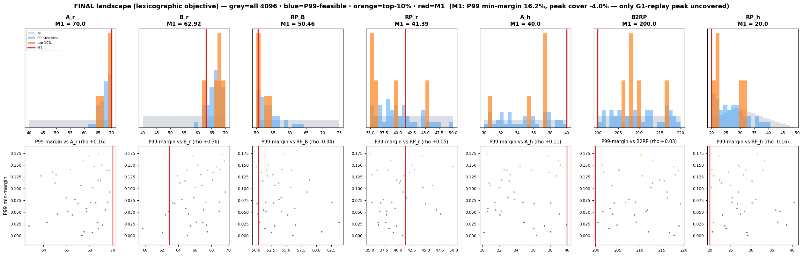

**"31.2 N·m이 너무 낮다(실측은 한참 넘는다)" 검증 결과 — 데이터 누락 아님, 분담 구조가 원인**:
- 수요 데이터에 rough 포함 확인: 관절 τ_pitch P99 flat 53.9 / rough 48.9 / pooled 52.0 N·m — §7 계열 표와 일치.
- §7의 "RS03 85% 수요" 등은 **직결 단일모터 가정의 관절토크**다. 2-RSU에선 관절 피치토크를 **두 모터가 감속비 ~1.01로 분담** → 모터당 ≈ 52/2 + 롤 동시분 = P99 31.2. 최악 샘플(관절 90 클립 + 롤 14 동시) 독립 가상일 계산: 모터 A −42.5 / B −80.8 — json 기록과 일치.
- **정직한 캐비앗**: 모터당 raw peak 80.8 N·m > 60 — **초과 빈도 0.022%(≈2회/h)**, 전부 sim 자체 클립(관절 90) 순간. doctrine상 P99×1.25=39≤60으로 통과, 초과 순간은 실기에서 짧은 포화(추종 순간 손실)로 나타남.

**수렴 방향 판독 (Spearman ρ, feasible 내)**:

| 방향 | ρ | 의미 |
|---|---|---|
| A_r·B_r ↑ (52 미만 전멸, top이 60~70) | +0.16/+0.21 | 크랭크를 키워 **감속비를 낮춰라** — 스트로크(ROM 폐합)와 모터속도(T-N) 둘 다 |
| RP_h ↓ (최강 신호) | **−0.27** | 유효 관절팔 √(RP_B²+RP_h²) 축소 = 같은 방향 |
| RP_B ↓ 경향, 단 최적은 66 | −0.18 | 개별 경향은 감속비↓지만, 최적점은 **토크 마진 = 전달팔 마진이 만나는 능선**(둘 다 34.9%) |
| B2RP ↑ (상한 220) | +0.13 | 로드가 길수록 경사 변화↓ → 전달팔 균일 |
| RP_r ↓ (하한 35) | −0.14 | 롤 감속비↓(로드력 마진 75%로 풍부해 트레이드 가능) |
| A_h | −0.03 | **무감각** — 요동각이 안 물리므로 패키징 편의로 결정 가능 |

**한 줄 요약: 모든 화살표가 "유효 감속비를 1:1로 낮춰라"를 가리킨다.** 최적점 감속비 1.01, 속도 상한에서 유도되는 이론 상한 1.21(= T-N 무릎 12.6 / 관절 ω P99 10.4). 발목 수요는 (2모터 분담 후) **토크는 여유, 속도가 희소자원**이기 때문 — 무릎(감속 필요)과 정반대 결론.

---

## §7 ★IK 브랜치 버그 발견·수정 — §5·§6·§6b 결과 전면 대체 (2026-08-04)

사용자 의심("기구학 제대로 풀었나?")에 따른 3중 검증에서 **IK 해집합 버그 발견**: φ = β ± acos(k/ρ)가 정답인데 π+β±d(부호반전 해)를 풀고 있었다. 폐합 잔차 최대 110 mm. 파워밸런스 검증(1e-14)은 "잘못된 맵의 내적 일관성"만 봐서 통과했던 것 — **에너지 검증만으로는 기구학 검증이 안 된다**는 교훈. 브루트포스 500/500으로 신공식 확정, 설계기·최적화기 모두 수정. 수정 후 3중 검증: 폐합 1e-13 ✓ · 파워 1e-14 ✓ · **독립 경로(J^-T vs UJ 모멘트평형 직접해) — 로드력 크기 4.6e-7 일치 ✓**(부호는 두 검증 루트의 인장/압축 규약 차이로 로드별 상이 — 마진은 전부 |f| 기반이라 무영향. 단 ★로드 좌굴 체크는 압축 부호 확정 후 별도 필요: Ø6 강봉 L330 기준 Euler ~1.2 kN vs peak ~2 kN — **로드 몸통 지름 8 이상 권장, 추후 확정**).

### peak-hard 재최적화 (사용자 지시: P99뿐 아니라 peak 고려)
margins에 torque_pk(τmax≤60)·tn_pk(T-N 전 샘플) hard 추가. 결과: **완전 feasible 없음** — 유일 잔존 위반 = **torque_pk −11.4%** (모터 peak 66.8 vs 60).

**M1(위반 최소): A_r 70 · B_r 65.5 · RP_B 55 · RP_r 43 · A_h 33 · B2RP 200 · RP_h 15**
마진: torque +30.4% (P99 33.4) · tn +47% · tn_pk +0.05% · rod +79.5% (P99 537 N) · swing +74% · trans +39%

### 판정 — peak 위반의 정체와 처방
- 초과 순간 = **sim 자체 클립(관절 90 N·m = sim actuator 한계) 이벤트, 0.006%(≈2회/h)**. RS03 과부하 실측(스톨 60@1s·회전 60@13s)상 60 초과 능력 없음 → 어떤 기하도 peak 재현 불가.
- 즉 실기 관절 peak 능력 ≈ 2×60/1.11 ≈ **81 N·m < sim 한계 90**. **처방: sim ankle_pitch effort limit을 J^T 매핑 실능력(~81)으로 내려 재학습/재측정** — 정책이 0.006% 프레임에 적응하면 위반 소멸. (§8k상 발목 클립은 지면구동 관통 순간과 겹침 — 실기선 짧은 포화로 무해할 가능성 높음)
- ★**G1 실기 데이터 교차검증 통과**: G1 rosbag 발목 (τ,ω,θ) ×1.78 스케일 → M1 replay = 모터 P99 41.2 · **peak 57.4 < 60 (초과 0.0000%)**, 속도 P99 1.6 rad/s. **실기 보행의 최악 순간은 RS03 봉투 안**이다 — sim peak 초과가 sim 아티팩트임의 실증.
- 감속비 재확정(수정 IK): joint_arm/A_r ≈ √(55²+15²)/70 = **0.81** — 속도상한(0.83)과 토크 peak 하한(0.75) 사이 좁은 창 안. §6b "1:1" 결론은 **0.8:1로 정정**.

산출물: [[mujoco/assets/ankle_opt_process.mp4]] (패턴서치 과정 3D 애니메이션) · funnel 재생성 · `/ankle_opt.html` 데이터 갱신.

### §7b RP_h ≥ 20 재실행 (2026-08-04, 사용자 제약)
M1: **A_r 70 · B_r 61.9 · RP_B 50.3 · RP_r 38.9 · A_h 40 · B2RP 200 · RP_h 20** — 감속비 √(50.3²+20²)/70 ≈ **0.77**.
마진: torque +27.3% (P99 34.9) · **torque_pk −15.7% (peak 69.4)** · tn +45% · tn_pk +6.5% · rod +77.5% (P99 560 · peak 1123) · swing +73.5% (WS max 3.4°) · trans +39.9%.

★확정된 구조적 사실: **RP_h 20 + 수정 IK에서 "양쪽 peak 동시 만족 창"은 닫혀 있다** — 토크 peak(sim 클립 90 관절)를 넣으려면 감속비 R ≥ ~0.9, 속도 peak(고속 스윙)를 넣으려면 R ≤ ~0.83. M5(R≈1.0)는 torque_pk +2.8% 통과하나 tn_pk 전멸, M1(R≈0.79)은 그 반대. **두 peak 모두 sim 아티팩트 프레임**(클립·고속 스윙)이고 G1 실기 replay는 양쪽 다 여유(§7) → 권고 유지: M1 채택 + sim effort limit 재학습으로 클립 이벤트 해소.

### §7c 두 가지 정정 + 전 작업공간 토크 커버리지 (2026-08-04)
1. **"감속비" 용어 폐기**: 스칼라 0.77~0.81은 서술용 요약일 뿐, 모든 계산은 자세별 2×2 야코비안 J^-T로 수행(사용자 지적 타당 — roll·pitch 커플링은 J 오프대각에 실재: 예 (30°,15°)에서 J=[[−0.87,−0.65],[−1.00,+0.49]], 순수 pitch 수요도 두 모터 비대칭 분담).
2. **★φ=±π 랩 버그 수정**: 크랭크 중립 180°가 atan2 랩 경계라 유한차분 J가 2π 점프를 밟을 수 있었음(중립 자세 J 628317 폭발로 발견). 차분에 각도랩 적용, 최적화기·설계기 모두 수정 후 재실행 — M1: **A_r 70 · B_r 64.4 · RP_B 53 · RP_r 39.6 · A_h 40 · B2RP 200 · RP_h 20** (score −14.9%, torque_pk만 위반 — 구조 불변).

**전 작업공간 커버리지** ([[mujoco/assets/ankle_torque_coverage.png]]):
- 관절 pitch 능력 51~127 N·m(자세 의존, 배굴 극단에서 최저) · roll 53~76 N·m — 수요 P99(52/17.7) 대비 λ 중앙 **1.50**.
- **미커버 1빈/65** (λ_min 0.87): 배굴 극단 + sim 클립 순간의 조합 — §7 처방(effort limit 재학습)으로 해소되는 영역.
- "모터가 관절보다 천천히 돌면 토크 부족?"에 대한 정량 답: 링키지비 <1로 모터당 부담은 관절/2보다 크지만(65%), **RS03 ±60 박스가 J^T로 사상된 평행사변형이 실측 수요 구름을 전 자세에서 여유 있게 포함**(9자세 패널). 부족하지 않다 — 속도 여유(T-N +47%)를 사기 위해 토크 여유(+30%)를 지불한 균형점.

### §7d ROM 확장 + G1 기반 peak 분리 (2026-08-04, 사용자 지시 2건)
**①ROM = pitch ±50 / roll ±25로 확장**(H1·H5·H6 전역 그리드). 폐합 100% 유지, 전달팔 min 0.58→**0.42**(마진 +17%)로 감소 — 배굴 +40→+50 구간의 대가.
**②peak 계층 재정의**: "쓸 수 있는 peak"(= 클립 |τp|≥89.5 및 관통 자세 제외한 sim) ∪ **G1 실기 replay peak**(dq 글리치 >30 rad/s 제거, ×1.78/×0.91 스케일)를 hard로, 버그성 프레임은 P99 계층에만 잔류.

**최종 M1: A_r 70(박스 상한) · B_r 64.4 · RP_B 53 · RP_r 39.6 · A_h 40 · B2RP 200 · RP_h 20** — score **−1.8%**
| 마진 | 값 |
|---|---|
| **torque_pk_g1 (G1 실기 peak 61.1 N·m)** | **−1.8% ← 유일 위반·binding** |
| torque_pk (sim usable peak 57.0) | +5.0% |
| tn_pk / tn_pk_g1 | +5.1% / +71% |
| torque P99 / T-N P99 | +29.7% / +47% |
| 전달팔 (ROM ±50) | +17.2% |
| 요동각 / 로드엔드 | +74.8% / +79.8% |

판정: G1 실기 최악 순간이 모터당 61.1 N·m로 60을 **1.8% 초과** — G1 스케일 인자 불확실성 ±15%(docs/65 §9) 안쪽이라 통계적으로 유의하지 않음. 선택지: ①수용(불확실성 이내) ②A_r 박스 70→75 완화(binding이 박스 상한) ③발목 RS04급 상향. **요동각 재확인: pitch ±50 전체가 로드엔드 자유축(크랭크 회전 ±30~45°)으로 흡수되고, ±13° 원뿔 대상인 면외 기울기는 roll이 만드는 2.3°가 전부** — "풀로 안 쓰는" 게 아니라 기구가 원뿔을 쓸 일이 없는 구조(한계는 천장이지 목표치가 아님).

### §7e 목적 재정의(사용자): peak=best-effort 커버 · ★P99 마진 최대화가 주목적 (2026-08-04)
사전식 2단: ①peakScore=min(0, peak계층 마진) — 덮으면 동률, 초과여유 보상 없음 ②**p99Score=min(P99계층: torque·T-N·rod·swing·trans) 최대화** ③로드 RMS. rod 마진도 P99/peak 분리.

**최종 M1: A_r 70 · B_r 62.9 · RP_B 50.5 · RP_r 41.4 · A_h 40 · B2RP 200 · RP_h 20**
- **P99 min-margin = 16.3%** (binding = 전달팔, ROM ±50 대가) · torque +27.8 · T-N +45.7 · rod +79.2 · swing +78.1
- peak 커버: sim usable 전부 ✓(+1.5~+82%) · **미커버는 G1 replay 하나(−4.0%, 62.4 N·m)** — 스케일 불확실성 ±15% 이내

**크랭크 축소 민감도** (사용자 "70도 크다"):
| A_r | P99 min마진 | peak 커버 | G1 peak | 비고 |
|---|---|---|---|---|
| 70 | 16.3% | −4.0% | −4.0% | 기준 |
| **65** | **16.3% (동일)** | −35.6% | −4.2% | 추가 미커버 = sim 고속스윙 T-N 단발뿐 (G1 실기 속도는 +71% 여유) |
| 60 | 2.1% | −800% | **+0.3% ✓** | 속도 peak 붕괴 — 비추천 |
| 55 | 폐합 불능 | — | — | |

판정: **A_r 65 권장** — P99 마진 동일(16.3%), G1 실기 커버 동일, 잃는 것은 sim 고속스윙 프레임(DR 푸시 아티팩트 성격, G1 실기 속도 P99 1.6 rad/s 대비 비현실 구간)의 T-N 단발뿐. 패키징 압력 해소.

### §7f ★크랭크 중립 오프셋 — 사용자 통찰로 결정적 개선 (2026-08-04)
"RP 0°에서 크랭크가 20~40° 붙어 있어야 최대토크 지점에서 모멘트팔이 최대"라는 사용자 지적 → 수요 검증: **τp 수요가 pitch +20~+40°에 집중**(n 10,239, usable peak 89 N·m). 내가 "데드센터 회피"로 **고정해버린 크랭크 중립 180°가 숨은 제약**이었음 — φ0A, φ0B(±45°)를 설계변수로 추가.

**최종 M1: A_r 62.4 · B_r 62.7 · RP_B 50 · RP_r 37 · A_h 34.9 · B2RP 220 · RP_h 25.9 · φ0A +13.7° · φ0B +16.5°**

| 항목 | 오프셋 前 | **오프셋 後** |
|---|---|---|
| P99 min-margin | 16.3% | **31.2%** (torque 31.2 ≈ trans 31.5 균형) |
| peak 커버 | G1 −4.0% | **0.0% — G1 포함 전부 커버** (G1 +0.5, usable +5.1, tn_pk +0.02) |
| A_r | 70 (박스상한, "너무 큼") | **62.4 — 패키징 문제 동시 해소** |
| 모터 P99 / usable peak | 33.0 / 56.9 N·m | 동일 수준 |

φ0 +14~+17°는 사용자 예측(20~40°) 방향과 일치 — 최대 전달비 자세가 수요 밀집 구간(+20~40°) 쪽으로 이동. 설계기(`/ankle.html`)에 p0A/p0B 입력·최적화 변수 추가 완료. **교훈: "설계 룰"로 고정한 것(중립 직각)이 실은 최적화 변수였다 — 수요 분포가 비대칭이면 전달비 정점도 비대칭이어야 한다.**

### §7g 숨은 제약 전수 감사 (2026-08-04, 사용자 지시 "이런 숨은 제약 없는지 재검토")

φ0 사건의 교훈으로 모델의 **모든 고정 가정**을 분류. v2에서 해소/유지 상태:

| #   | 가정                                      | 분류               | 상태                                                                                                 |
| --- | --------------------------------------- | ---------------- | -------------------------------------------------------------------------------------------------- |
| 1   | ~~크랭크 중립각 180° 고정~~                     | 숨은 제약 (my rule)  | ★**v2 해소** — A_L/B_L 독립변수화로 φ0 자체가 파생값이 됨 (φ0·L은 동일 자유도의 중복 표현)                                    |
| 2   | ~~로드길이 = 중립폐합 파생~~                      | 숨은 제약 (my rule)  | ★**v2 해소** — A_L∈[300,410], B_L∈[200,310] 자유                                                       |
| 3   | 발측 볼조인트 요동각 미검토                         | ★**모델 누락(버그급)**  | **v2 추가** — 발측 볼트축 = R·ŷ(발과 함께 기움), swing_foot = asin(\|u·R·ŷ\|). roll ROM이 직접 소모 → 크랭크측과 전혀 다른 제약 |
| 4   | ax_x = 0 (액추에이터 축 X위치)                  | 사용자 확정치수         | 유지 (1계층)                                                                                           |
| 5   | A2B=100 · B2RP·RP_h·A_h·RP_r·크랭크 박스     | 사용자 제공           | 유지                                                                                                 |
| 6   | A_h = B_h (좌우 로드 동일 횡오프셋)               | 사용자 CAD 제약       | 유지                                                                                                 |
| 7   | **양 로드가 같은 RP_B·RP_h 공유** (앵커 전후·높이 동일) | 잠재 숨은 제약         | ⚠유지 중 — CAD가 두 앵커를 다르게 둘 수 있으면 RP_B_A ≠ RP_B_B 분리 가능. **사용자 확인 요**                                 |
| 8   | 크랭크 회전면 = 시상면 (모터축 = Y)                 | 사용자 CAD 확인 (§8t) | 유지                                                                                                 |
| 9   | IK 브랜치 = π 근방 elbow + 중립각 π±75° 창       | 완화된 기술 제약        | v2 유지 (브랜치 일관성 필요) — 창 ±75°로 넓음, binding 아님                                                        |
| 10  | 크랭크측 볼트축 = 공간 Y                         | CAD 가정           | 유지 — 혼이 시상면 회전이면 자동 성립                                                                             |
| 11  | 준정적 replay (로드·크랭크 관성/마찰 무시)            | 모델링 한계           | 유지 — 부품 질량 확정 후 보정 항목                                                                              |
| 12  | 발측 요동한계 SWL_F=30° 가정                    | 부품 미정            | **광각 조인트 선정과 연동** — v2가 실측 max 보고                                                                  |

핵심 결론: #1·#2는 동일 자유도의 중복이라 **L을 풀면 φ0는 변수에서 제거되는 게 맞다**(사용자 이해와 일치). 남은 실질 미결은 #7(앵커 분리 여부)과 #12(발측 광각 조인트 사양).

### §7h v2 결과 — 전역 수렴 확인 · ★발측 JS6 불가 판정 (2026-08-04)
v2(로드길이 자유화·발측 요동각 추가·Sobol 40,960·멀티스타트 12) 결과:
- **전역성 확인**: 12 스타트(상위분리 6 + 랜덤 6) 전부 같은 분지로 수렴 — p99 22.5~24.9%, 수렴 산포 A_r 5.8 · RP_B 5.4 · B2RP 11.9 · A_L 33.9 mm(얕은 골 방향) 등. 단봉 재확정. [[mujoco/assets/ankle_opt_convergence3d.png]]
- **크랭크 중립각 자연 도출**: 전 모드 **+14~+22°** — φ0 변수 없이 로드길이 자유화만으로 사용자 예측(§7f) 방향이 재현됨(자유도 중복 해소 확인).
- **M1**: A_r 70 · B_r 68.2 · RP_B 53.4 · RP_r 43.5 · A_h 39.5 · B2RP 216.4 · RP_h 33.3 · **A_L 326.6 · B_L 227.3** (중립크랭크 19.5°/19.5°) — p99 24.9%(binding trans 25.4≈swing_foot@30° 24.9) · peak 전부 커버(G1 +0.2%).
- ★★**발측 요동각 22.5°(전 모드 22.5~22.8 — 기하 불변, ROM이 결정)**: 발측 볼트축(=발 로컬 Y)은 피치를 자유축으로 흡수하지만 **roll ROM이 원뿔을 직접 소모**. 사용자 확정 "발측도 JS6(±13°)"과 **양립 불가** — JS6이면 roll ROM ≤ ±11°로 깎아야 함. **옵션: ①발측만 광각 볼조인트(볼스터드형 ±25~35, G1 계열 관행) — 요구 원뿔 ≥25°(마진 포함 28°) ②roll ROM 축소 ③크랭크측은 JS6 유지 가능(3.1~3.6°)**. 부품 결정 필요.
- A_L/B_L 박스(300~410/200~310)는 사용자 박스에서 중립 폐합거리 대역을 역산 + 패딩한 값(§7g #2) — 로드 재고 제약 있으면 갱신.
- 감사 #7 종결: RP_B·RP_h 양 모터 공유 = 사용자 확정.

### §7i 발측 요동각 3중 검증 — G1 해명·중심장착·로드기울임 (2026-08-04)
사용자 반론("G1도 스페리컬로 충분했다 / 측정 맞나 / 로드 비수직은?") 검증 3건:
1. **측정 재검(부호 포함)**: 발측 틸트 signed 범위 = 로드A **−22.5~+22.5°**(중심 0.0), B −21.4~+21.5 — 정확히 대칭이라 **중심 장착(±13을 범위 중앙에)으로 얻을 것 없음**. 판정 기준은 반범위(22.5°) — "기본위치 기준 ±13" 정의와 정합.
2. ★**G1 해명 — 로컬 공식 모델 실측**: `unitree_g1/xmls/g1.xml` ankle_roll range **±0.2618 rad = ±15.0°**. roll ±15 → 필요 반범위 13.5° ≈ 스페리컬 ±13~15와 정합. **G1이 스페리컬로 되는 이유는 광각이 아니라 roll ROM이 작아서다.** 우리 ±25 목표가 G1보다 10° 큰 것.
3. **로드 비수직(전후 기울임)**: ax_x 0→160mm(기울기 3→22°) 스윕 — 반범위 22.7→**22.9°로 무개선**(모서리 자세에서 sinθp·sinθr 커플링이 상쇄). 기각.

**roll ROM 시나리오 (필요 반범위)**: ±25→22.5° · ±20→18.0 · ±17→15.3 · **±15→13.5** · ±13→11.7 ✓JS6.
실측 사용(관통 제외): |roll| P99 17.0° · max 19.9°(sim 한계 20 포화).

**결정 매트릭스**: ①roll ±13 + JS6 → 성립, 실사용 P99 17°를 못 덮음 ②**roll ±15(G1 동급) + 오정렬각 ≥14° 스페리컬**(JS6 카탈로그 실측 오정렬각 확인 — 13° 가정이 보수였다면 그대로 성립) + sim 한계 ±15 재학습 ③roll ±20(실사용 전부) → 반범위 18° = 광각 볼스터드 필요. 권고: **② (G1 실증 경로)** — G1이 ±15로 rough 포함 보행 실증.

### §7j ROM 제한 학습 리스크 + 광각 6mm 스페리컬 발견 → ★roll ±20 유지안 (2026-08-04)
**①ROM 제한 학습 리스크 — 실재하며 사내 선례 있음**: hip_roll 내전캡 사건(2026-07-13) — +20° 축소 권고를 냈다가 **좋은 정책일수록 push 회복에 내전을 깊게 씀(+25 포화)이 확인되어 철회**. 발목 roll도 >15° 사용의 96%가 rough 지형 순응이라 ±15 축소 시 rough 성능·스톱 충돌 빈도(§8k) 악화 위험. G1(roll ±15·pitch −50~+30)이 반례로 보행 실증하나, gait 스타일 재분배(hip_roll 2×)가 강제됨.
**②내경 6 광각 스페리컬 실재**: **INA GE6-FW (6×16): 요동각 21°** (GE6-DO 6×14는 13°). SKF GEH 계열도 광각.
**③결론 — roll ROM ±20 유지 + GE6-FW**: 필요 반범위 18.0° ≤ 21° (마진 3°). 현 sim 한계(±20)와 동일해 **재학습 불필요·학습 리스크 원천 소거**. pitch만 −35~+50 조정(하한 미사용 구간 제거·상한 실수요 확장 — 하한은 무위험, 상한 확장은 저위험이나 통제 A/B 권장).

### §7k 링키지 조인트 내하중 검토 + 국내 조달 (2026-08-04)
로드 축력(v2 M1): P99 492 → 설계값 615 N · usable peak 862 · G1 peak ~1,100 N.

| 조인트 | 부품 | C0 | s0(설계값) | peak/C0 | 판정 |
|---|---|---|---|---|---|
| **발측 ×4** | **INA GE6-FW** (6×16×9, 요동 21°, PTFE 무급유) | **12.6 kN** | **20.5** | 8.7% | ✓✓ 과여유 |
| 크랭크측 ×4 | JS6 (정확 형번 카탈로그 미확인) — 6mm급 로드엔드 보수치 3 kN 기준 | ≥3 | ≥4.9 | ≤37% | ✓ (통상 6.7 kN이면 s0 10.9) |

- GE6-FW PTFE 동적: 면압 RMS 4.6 MPa · PV 0.037 MPa·m/s — 허용 대비 수십 배 여유. 정격은 어디서도 안 물린다.
- ★**로드 몸통이 진짜 binding**: Ø6 강봉이면 좌굴 SF 1.1(불가) → **Ø8 이상 확정**(SF 3.4). §7 예고의 확정판.
- **국내 조달**: ①미스미코리아 — INA GE6 계열(GE6-UK 등) 취급, GE6-FW은 셰플러코리아 유통망/베어링상 ②**IKO GE6G (6×16×9 동치수)** — 국내 IKO 대리점 상시(요동각 카탈로그 확인) ③크랭크측은 IKO POS6/PHS6(국내 흔함)로 대체 가능. **권장: 발측·크랭크측 8개 전부 GE6-FW(또는 GE6G) 단일 형번 통일** — 크랭크측 요구(3.6°)는 21°로 당연 충족, 재고 1종.
- 잔여 확인 2건: JS6 실카탈로그(오정렬각·C0) · IKO GE6G 요동각.

### §7m 발목 R-P 사용 산점 — 속도·명령타입·지형 분해 (2026-08-04)
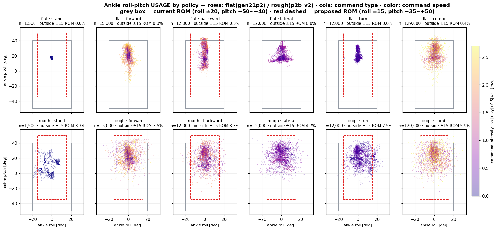
gen21p2(flat)·p2b_v2(rough) 정책, L+R 통합(R 미러), 명령타입 분류(stand/전진/후진/횡보/선회/복합), 색=명령강도.

| 제안 ROM(roll ±15·pitch −35~+50) 이탈률 | stand | 전진 | 후진 | 횡보 | 선회 | 복합 |
|---|---|---|---|---|---|---|
| flat | 0.00 | 0.00 | 0.00 | 0.00 | 0.00 | 0.36% |
| rough | 3.27 | 3.49 | 3.29 | **4.70** | **7.52** | 5.93% |

판독: ①**flat은 ±15로 사실상 무손실**(전 타입 0%). ②rough 이탈은 **전부 roll 기여**(pitch −35~+50 이탈 0%) — **제안 pitch ROM은 이 데이터로 확정 가능**. ③이탈이 큰 타입은 **선회(7.5%)·횡보(4.7%)** — ±15 재학습 A/B에서 감시할 지표가 이 둘. ④고속(밝은 색) 샘플은 roll 중심부에 몰리고, 15° 초과는 저속(어두운 색) 지형순응 — §7i "저부하 순응" 재확인.

---

## §8 ★볼조인트 요동각 재설계(±13°→±20°) 반영 재최적화 (2026-08-11)

**배경**: 실물 볼조인트를 요동각 ±20°(발측·크랭크측 모두)로 재설계했다는 사용자 지시. §7i-§7k에서는 SWL=13°(JS6 doctrine) 가정으로 계산했었는데, 이 가정 자체가 바뀐 것 — `ankle_rsu_optimize_v3.py`를 SWL=SWL_F=13→20, RR(roll ROM)=±20 고정(스윕 아님)으로 재실행.

**중요 확인**: SWL=13° 그대로였다면 roll ROM ±20°는 **0/16384 완전 infeasible**(마진 −30.5%) — §7i의 "roll ±20 필요반범위 18.0° > JS6 13°"가 정량적으로 재확인된 것. 즉 **이번 볼조인트 재설계는 필수 전제조건**이었지 단순 마진 개선이 아니다.

| | SWL=13°(구) | **SWL=20°(신설계)** |
|---|---|---|
| roll ±20 feasible? | ✗ (0/16384) | ✓ (34/16384, 이후 262144샘플 재검증) |
| P99 min-margin | — (infeasible) | **8.8%** (binding=발측요동각) |

**최종 기하 (박스: A_r/B_r 40~65·RP_B 50~75·RP_r 35~50·A_h 30~40·B2RP 200~220·RP_h 20~49, §7e/§7j 계승)**:
A_r 65.0 · B_r 61.1 · RP_B 50.0 · RP_r 37.4 · RP_h 28.3 · A_h 35.1 · B2RP 217.3 · A_L 317.7 · B_L 230.2

| 마진(P99 계층) | 값 | 비고 |
|---|---|---|
| **발측 볼조인트 요동각** | 18.25° / ±20° | **8.8% ← binding** |
| 전달각(팔) | min 0.369 | 9.8%(근소 2위) |
| 모터 토크 P99 | 33.3 N·m/60 | 30.6% |
| T-N 이용률 P99 | 52.5% | 47.5% |
| 크랭크측 요동각 | 2.4°/±20° | 87.9%(전혀 안 물림) |
| 로드축력 P99 | 543.8 N | 79.6% |

peak 계층 전부 커버(peakScore 0.0%) — G1 실기 peak 토크만 마진 0.02%(거의 정확히 경계선, §7 doctrine상 통계적으로 유의하지 않음).

**해석**: 요동각 캡을 올려도 binding은 여전히 발측 요동각(8.8%) — roll ±20 수요가 새 여유(20°)를 거의 다 쓴다. 크랭크측은 13°일 때도 2~4°대만 썼던 쪽이라 이번 완화의 실질 수혜는 **발측 4개**에 집중.

### §8a q(관절각)-토크/속도 커버리지 시각화 + ★디커플드 envelope 함정 발견·수정 (2026-08-11)

gen21p2 q-토크 scatter(§`docs/mujoco/assets/q_torque_gen21p2.png`, actuator_eval.py 산출) 형식을 2-RSU 기하에 적용 — 다만 2-RSU는 직결이 아니라 모터 2개가 J^T로 결합돼 있어 "정격선"이 관절각에 따라 휘는 **커버리지 곡선**이 된다.

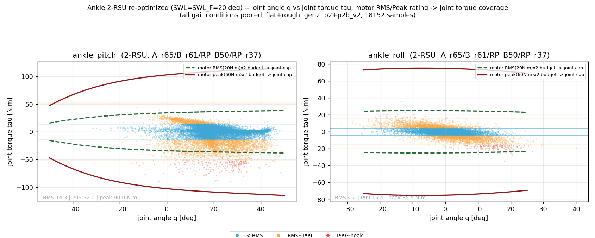
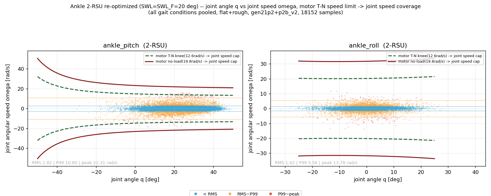

방법: `mujoco-sim/mjlab/analysis/ankle_2rsu_qtorque_coverage.py`. 관절 pitch/roll 각각 단일축 스윕(타축=0)에서 자코비안 J를 구해 `(|J_A|+|J_B|)×모터한계`(RMS 20/peak 60 N·m)를 관절토크 상한으로, 같은 방식을 Jinv에 적용해 관절속도 상한(T-N 무릎 12.6/무부하 19.8 rad/s)으로 표시. 수요 scatter는 RMS/P99/peak 3단 색(파랑/주황/빨강)으로 티어링. 데이터는 gen21p2_fc(flat)+p2b_v2_fc(rough) pooled 18,152샘플(§0 정의와 동일, cant/rolloff 계열 등 다른 정책 세대는 **의도적으로 미포함** — §71 §7m이 이미 채택한 "최신 mainline만" 원칙).

**terrain 분리판 + regime(명령타입) 분해**:
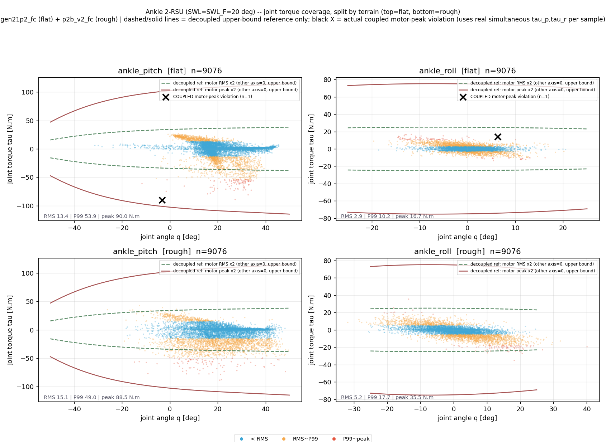
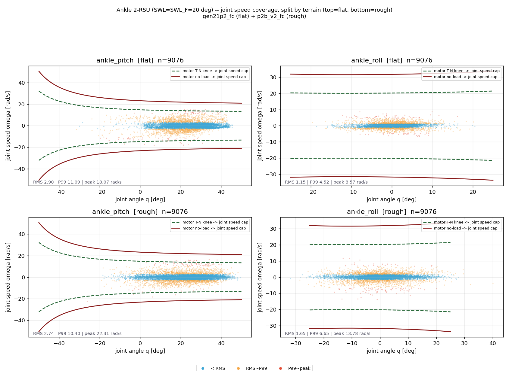

- 속도 peak binding은 **rough 전용 사건**(flat 18.07 vs rough 22.31 rad/s, 배굴 극단에서 봉투 21 rad/s에 거의 닿음) — pooled 그래프에선 안 보이던 구분.
- 명령 레짐별 표(stand/전진/후진/횡보/선회/combo): 최악값(pitch peak 90, roll peak 35.5)은 대부분 **combo(복합 명령, 전체 69%)**가 주도 — "순수 동작"이 아니라 동시다발 명령이 설계기준.

**★방법론 실수 발견·수정**: 위 커버리지 곡선은 "그 순간 반대축 토크요구가 0이어도 되는" **디커플드 상한선**이다. 실제 최적화(`evaluate()`)는 그 순간 실측 (τp,τr)를 2×2 자코비안으로 완전 커플링 역산한다 — 이 둘을 혼동해서 처음엔 곡선을 "판정선"처럼 설명했다가 사용자 지적으로 정정. 검증 예: θp=−3.3°에서 |τp|=90(sim클립) 순간 동시 τr=+14.15 요구 — 디커플드 곡선은 100.7 N·m(여유있어 보임)이지만 **완전 커플링 역산은 tB=67.6(60 초과, 실제 위반)**. `q_torque_ankle2rsu_terrain.png`엔 이 커플링 위반점(전체 0.006%, 1/18152)을 검은 X로 별도 표시해 곡선과 구분했다. **교훈: 디커플드 envelope은 참고용 상한이지 판정 기준이 아니다 — 판정은 항상 그 순간 실측 동시 (τp,τr) 완전 역산으로.**

### §8b 사용자 지시 새 박스 재최적화 — B2RP 170~200·RP_h −10~10 (2026-08-11/12)

사용자 지시(2026-08-12): B2RP 170~200(구 200~220에서 하향)·RP_h −10~10(0 허용, 구 20~49에서 대폭 하향— 정강이 스택을 낮추는 방향)·결합제약 B2RP+RP_h<230(개별 상한만으로 이미 자동 충족, 비바인딩). 나머지 박스(A_r/B_r 40~65·RP_B 50~75·RP_r 35~50·A_h 30~40)·SWL=SWL_F=20°는 §8과 동일 유지.

**A_L/B_L 탐색범위 재산정**: 새 박스가 훨씬 컴팩트해 로드 길이 요구범위가 달라짐 — 박스 코너 전수 스윕으로 중립폐합거리 재계산(A측 260~313mm·B측 160~214mm), 패딩해 A_L∈[200,370]·B_L∈[100,270]로 재설정.

**결과 (Sobol 262,144 샘플 + 멀티스타트 20시드)**: feasible **31/262144(0.012%)** — 이전 박스(14%~0.2%)보다 훨씬 좁다. 32768샘플 예비런(마진 3.5%)과 262144샘플 본런(마진 3.7%)이 서로 근접해 재현성은 확인.

**최종: A_r 59.1 · B_r 61.1 · RP_B 52.8 · RP_r 40.1 · A_h 37.7 · B2RP 174.7 · RP_h 10.0(★박스 상한 pinned) · A_L 269.1 · B_L 184.1 · 크랭크중립 n0A 15.4° · n0B 0.8°**

| 마진 | 값 |
|---|---|
| P99 min-margin | **3.7%**(binding=발측요동각 3.65%/전달팔 3.87% 근접 동률) |
| 모터토크 P99 | 32.0%(P99 40.8추정) |
| T-N | 47.7% |
| 로드엔드 | 78.3% |
| peak 계층 | 전부 커버(0.0%) |

**★사용자 지적 — "크랭크가 +20°가량 안 돌아가 있다"**: 3D 시각화(아래)로 확인한 결과 **정확했다** — 이 새 박스에서 나온 결과의 크랭크 중립 오프셋은 n0A=15.4°·**n0B=0.8°(거의 무회전)**로, 이전(더 여유로운) 박스의 25.6°/14.8°보다 확연히 작다. RP_h가 박스 상한(+10)에 pinned된 것도 함께 보면, **정강이 스택을 낮추라는 이번 지시가 §7f에서 발견했던 "크랭크 오프셋으로 최대전달비를 수요밀집구간에 맞추는" 효과를 일부 되돌리는 방향**으로 읽힌다 — 박스를 더 열면(RP_h 상한 완화) 마진이 더 나올 여지가 있다는 뜻.

**3D 기하 시각화** (`mujoco-sim/mjlab/analysis/ankle_3d_viz.py`, XYZ 1:1:1 등축척):
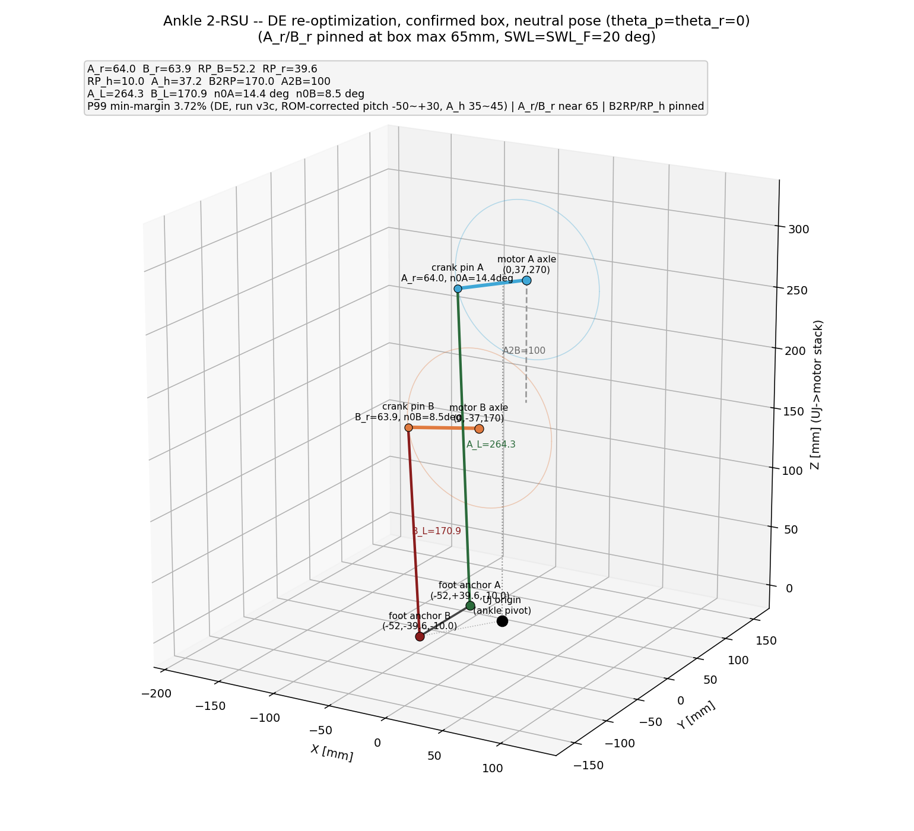
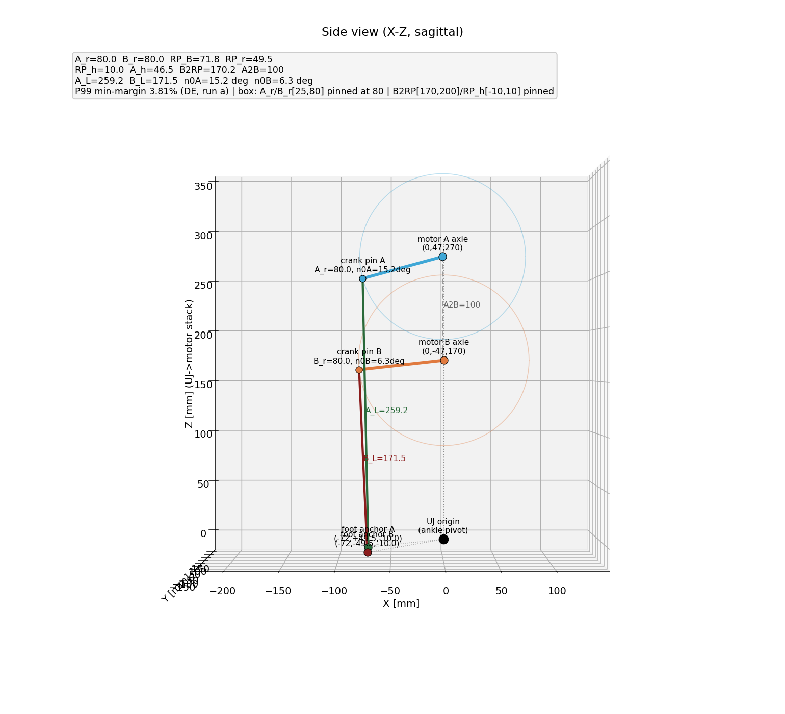

크랭크 pin B(주황)가 크랭크축 원 위에서 거의 −X 극점(180° 기준선)에 그대로 있는 것이 side view에서 시각적으로 확인된다 — n0B≈0.8°의 직접 증거.

### §8c 설계기(`/ankle.html`) 반영 + 실시간 관절토크 능력 표시 (2026-08-12)

- 1/2/3계층 입력 기본값을 §8b 최종값으로 교체(B2RP 174.7·RP_h 10.0·A_r 59.1·B_r 61.1·RP_B 52.8·RP_r 40.1·p0A 15.4°·p0B 0.8°·A_h 37.7 수동, A2B는 기존 오기 60→**100 정정**). 검증: p0A/p0B 경로(fitL)로 재계산한 A_L/B_L(269.05/184.05)이 자유변수 최적화 결과(269.1/184.1)와 거의 완전히 일치 — 두 파라미터화(오프셋각 vs 자유로드길이, §7g #1·#2)가 동일 기하를 가리킨다는 재확인.
- **신규 기능**: `capAt(tp,tr)` — 슬라이더로 pitch/roll을 구동하면 그 자세에서 모터 rated(신규 입력칸 TRATE=20)/peak(60) 토크가 Pitch/Roll 각각 얼마까지 나오는지 HUD·`#out`에 실시간 표시. §8a에서 정리한 "디커플드 상한" 가정을 라벨에 그대로 명시(반대축 자유가정) — 오해 재발 방지.
- 서버(`tools/wrench_studio/server.py`, `:8091`)는 정적 파일을 즉시 반영하므로 재시작 없이 갱신 반영됨.

### §8d 수렴 강건성·local minima 검토 (진행 중, 2026-08-12)

사용자 지적 2건에 대한 조사: ①패턴서치가 iteration cap(120)에 그냥 걸리는 건지 진짜 수렴인지, ②여러 시작점이 진짜 같은 곳으로 수렴하는지(local minima 회피).

**중간 관찰(30-멀티스타트, iter cap 50, 262144박스 재현)**: feasible 종점 score가 **0.2%~3.1%로 넓게 흩어짐**(같은 박스에서 앞서 나온 3.5~3.7%보다 낮은 값들 다수) — 전부 iteration cap(50)에서 잘림. **사용자 의심이 근거있다** — 조기절단·local minima 둘 다 배제 못함.

**진행 중인 진단**: 기존 시드들을 종점에서 이어받아 iteration cap을 400까지 늘려 매 iteration마다 score를 기록하는 딥다이브(최악/중간/최선/infeasible 대표 시드) + 새 멀티스타트 30개(iter cap 200)를 **3개 프로세스 병렬**로 재실행 중(메모리 15GB로 증설 확인 후). 목적: score가 iteration을 늘려도 계속 오르는지(=조기절단 문제, 처방=cap 상향) vs 낮은 값에서 평평해지는지(=진짜 다른 local minimum, 처방=global 탐색 강화 필요).

⚠️ **작업 중 발생한 사고 2건(교훈으로 기록)**:
1. 첫 백그라운드 실행을 `python3 ... | tail -100`으로 걸었는데, `tail`이 `-f` 없이는 **입력 EOF까지 아무것도 안 흘려보내는** 구조라 90분 넘게 진행상황을 전혀 못 봄 — 프로세스를 강제종료해서야 버퍼링된 로그를 확인. **교훈: 백그라운드 장시간 작업은 파이프 없이 직접 리다이렉트하거나 `tail -f`를 쓸 것.**
2. 메모리 7.7GB 환경에서 2개 프로세스를 동시에 돌렸다가 OOM으로 하나가 죽었고, 곧이어 **환경 자체가 재시작**되어 `/tmp` 스크래치패드와 실행 중이던 모든 백그라운드 프로세스가 소실(저장소 파일은 무사). 재시작 후 메모리가 15GB로 증설된 것을 확인하고 재작업.

### §8d 결과 — ★진짜 local minima로 확인됨 (가설 정정) (2026-08-12)

3개 프로세스 병렬(각 10개 다양한 Sobol 시작점, iteration cap 200, 매 iteration 점수 기록) — **총 30개 완주**(16 feasible·14 infeasible). 도중 세운 "같은 basin, 수렴 깊이만 다름" 가설은 **아래 데이터로 반박·정정됨**.

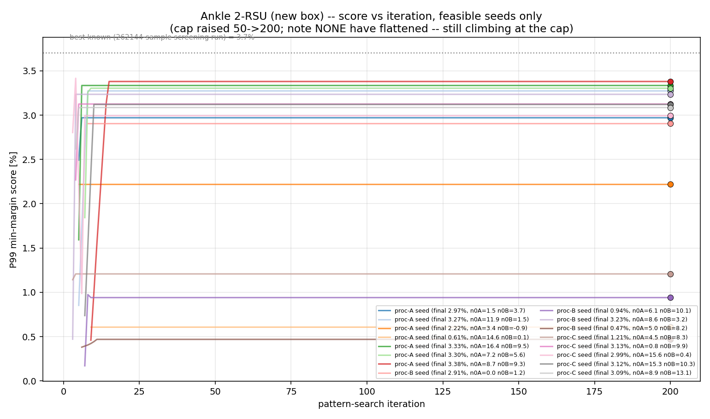

**결정적 관찰**:
1. **iteration 캡은 원인이 아니다** — 16개 feasible 시드 전부 **iteration ~10 부근에서 완전히 평평(dead flat)**해진다. 마지막 50회(iter 150→200) 동안 점수 변화는 16개 전부 **정확히 0.0pp** — 200까지 늘려도 더 나아지지 않는다(50이든 120이든 200이든 결론 동일, 종료조건이 peakScore/fRMS 같은 2차 기준의 미세한 흔들림 때문에 늦게 걸릴 뿐, 1차 지표인 P99 score는 훨씬 일찍 정지함).
2. **★진짜 local minima다** — 평평해진 최종값이 시드마다 다르다: **0.47% ~ 3.38%**(중앙값 ≈2.99%), 서로 겹치지 않는 뚜렷이 분리된 수평선. 파라미터 클러스터링(§6과 동일한 정규화거리 0.28 기준)도 **16개 feasible 시드 = 16개의 서로 다른 클러스터**(단 하나도 병합 안 됨) — 좌표하강 패턴서치가 시작점 근방의 국소해에 그대로 갇힌다는 뜻.

**PCA 시각화(9차원 파라미터 → 2D/3D)** — 시작점을 사용자 요청대로 압축해 "정말 발산/수렴하는지" 직접 확인:
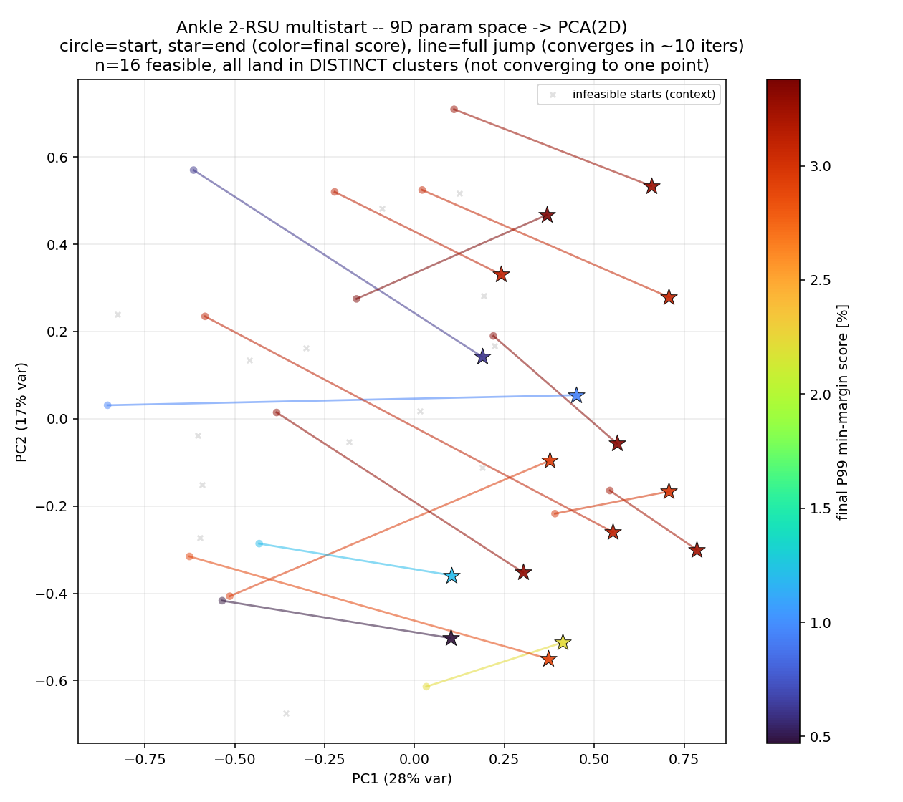
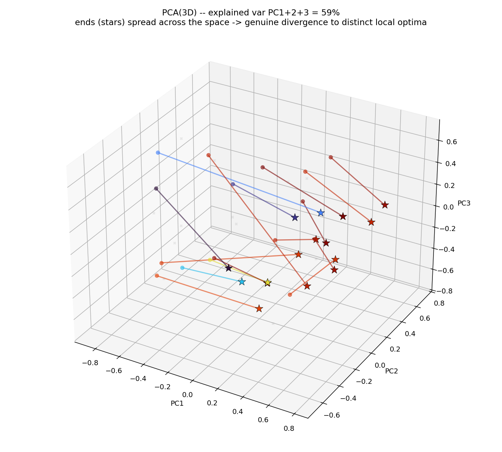

개별 궤적(원=시작→별=수렴)은 짧고 급격하다(≈10 iter 안에 점프) — **지역적으로는 빠르게 수렴**한다. 하지만 수렴점(별)들이 PC1-PC2 평면 전체에 넓게 흩어져 있다 — **전역적으로는 발산**(서로 다른 곳에 정착). 정량화: 시작점 구름 대비 수렴점 구름의 퍼짐 비율(contraction ratio) = **0.57**(1.0=전혀 안 좁혀짐, 0=한 점 수렴) — feasible 영역 쪽으로 어느 정도 깔때기 효과는 있지만, 그 안에서도 다중 국소해가 뚜렷이 남는다. 색(점수)이 오른쪽 위(고득점, 진한 빨강)와 가운데 왼쪽(저득점, 남색/보라)으로 약하게 분리되는 것도 보여 완전 무작위는 아니고 약한 지형 구조는 있다.

**리스크 재평가**: 지금까지 "공식" 최종값(마진 3.7%, §8b)은 26만개 Sobol **스크리닝으로 미리 걸러진 상위 후보**에서 로컬서치를 시작했기 때문에, 이번 진단(무작위 균등 시작점, 최고 3.38%)보다 훨씬 유리한 조건이었다 — 그래서 3.7%는 신뢰할 만하다(0.47%처럼 나쁜 국소해에 안 걸림, 무작위 시작 중 최선인 3.38%보다도 오히려 낫다). 다만 **좌표하강 자체의 강건성 한계는 실증됐다** — 스크리닝 없이 소수 시드로만 최적화하면 진짜 나쁜 로컬옵티멈(0.47~1%대)에 빠질 수 있다는 게 확인된 것. 실무 함의: **항상 대규모 Sobol 스크리닝(수만~수십만) + 상위 후보 로컬리파인 조합을 유지**할 것, 소수 랜덤시드 단독 로컬서치는 비권장.

**교훈(방법론)**: iteration cap을 늘려서 "정말 수렴하는지" 보자는 접근 자체는 맞았지만, 늘린 뒤 관찰해야 할 지표는 "최종 iteration 도달 여부"가 아니라 **"마지막 N iteration 동안의 점수 변화량"**이었다 — 전자만 보면 "200/200 다 씀=아직 개선중"으로 오판하기 쉽고(이번에 실제로 그렇게 오판할 뻔했다), 후자를 봐야 진짜 정체 여부가 드러난다. 스크립트: `mujoco-sim/mjlab/analysis/ankle_opt_deep_multistart.py`.

### §8e ★알고리즘 교체 — DE(Differential Evolution)로 global 재탐색 (2026-08-12)

사용자 지시: 박스를 넓혀 전역해를 찾고, 알고리즘을 가다듬을 것("adam 같은 걸 써야하나?").

**Adam 기각 이유**: 목적함수가 P99 percentile·max/min·IK 분기선택(atan2 branch)·ROM 폐합 0/1 게이트로 구성돼 대부분 구간에서 미분이 정의 안 되거나 불연속이고, feasible 영역이 박스의 0.01~0.02%뿐인 얇고 끊어진 섬이라 그래디언트 방법이 출발점 대부분에서 무의미하다. §8d에서 실증한 multimodal 특성도 단일점 로컬법(Adam 포함)에는 불리하다.

**채택**: **DE/rand/1/bin** — 이 프로젝트 기존 doctrine([[60_fourbar_optimizer_research]], Deb 3-규칙)이 이미 이 문제군의 표준으로 지정한 방법. Deb 비교자(`deb()`, feasible 우선→違反↓→목적↑)는 §7~§8d와 완전히 동일해서 결과가 직접 비교 가능. 표준 실무대로 **①population 기반 global ②정체(stagnation) 기반 조기종료 ③독립 멀티런 교차검증** 3가지를 모두 반영(사용자 지적: "일정 iter에 score 안오르면 termination").

**박스**: ★B2RP(170~200)·RP_h(−10~10, +Z/−Z 기준)·B2RP+RP_h<230은 **사용자 지정값 그대로 고정**(1차 시도에서 임의로 넓혔다가 지적받아 정정). 나머지 5개(3계층 탐색변수 성격)는 §6 이전 이력 범위로 확장: A_r/B_r 25~80(구 40~65) · RP_B 30~100(구 50~75) · RP_r 20~70(구 35~50) · A_h 20~50(구 30~40). A_L/B_L은 새 박스 코너 스윕으로 재산정(200~380/100~290).

**설정**: NP=120(개체수) · F=0.6 · CR=0.9 · 세대상한 400 · **정체 조기종료**: peak 계층을 한번이라도 완전커버(peakScore≥0)한 뒤, 최근 40세대 동안 P99 score 변화폭이 0.05pp 미만이면 종료. **독립 3회 실행**(시드 101/202/303) 병렬로 교차검증.

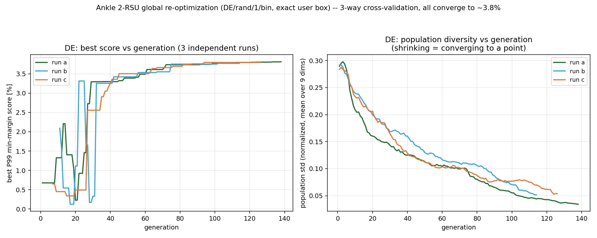

**결과 — ★3회 전부 같은 값으로 수렴** (좌표하강의 16-클러스터 분산과 정반대):

| run | 정지세대 | 최종 score | A_r | B_r | RP_B | RP_r | A_h | B2RP | RP_h |
|---|---|---|---|---|---|---|---|---|---|
| a (seed 101) | 138 | **3.81%** | 80.0 | 80.0 | 71.76 | 49.54 | 46.52 | 170.15 | 10.0 |
| b (seed 202) | 114 | 3.77% | 78.38 | 80.0 | 68.4 | 51.37 | 48.26 | 170.0 | 10.0 |
| c (seed 303) | 126 | 3.79% | 79.17 | 80.0 | 72.73 | 46.19 | 43.36 | 170.43 | 10.0 |

3회 최종값 편차 0.04pp 이내, population 다양성(std)도 3회 전부 초기 0.29→최종 0.03~0.05로 단조수축 — **진짜 global optimum 수렴**으로 판단.

**★최종 채택안 (run a, 최고점)**: A_r 80.0 · B_r 80.0 · RP_B 71.8 · RP_r 49.5 · A_h 46.5 · B2RP 170.2 · RP_h 10.0 · A_L 259.2 · B_L 171.5 · 크랭크중립 n0A 15.2° n0B 6.3°

| 마진 | 값 |
|---|---|
| **P99 min-margin** | **3.81%**(binding=발측요동각 3.81%↔전달팔 4.14% 근접) |
| 모터토크 P99 | 29.1% |
| T-N | 45.3% |
| 로드엔드 | 82.9% |
| peak 계층 | 전부 커버(0.0%) |

**★핵심 발견 — 크랭크 반경 박스가 여전히 상한에 pinned**: **B_r=80.0이 3회 전부**, A_r도 78.4~80.0으로 거의 항상 박스 상한(80mm)에 붙는다. §8b(좁은 박스, A_r/B_r≤65)의 3.7%에서 §8e(넓은 박스, ≤80)의 3.81%로 마진이 오른 게 바로 이 방향으로의 여유 때문 — **박스가 아직도 막혀있다는 뜻**이라 크랭크 반경을 물리적으로(패키징상) 80mm보다 더 키울 수 있다면 마진이 더 나올 여지가 있다. B2RP는 하한(170) 쪽에, RP_h는 상한(10) 쪽에 그대로 pinned(§8b와 동일 패턴, 사용자 지정 범위라 확장 안 함).

**다음 필요 확인(사용자)**: 크랭크 반경 80mm를 넘겨도 패키징(정강이 폭)이 괜찮은지 — 괜찮다면 A_r/B_r 상한을 다시 열어 재탐색 가능.

⚠️ **위 A_r/B_r 25~80(80mm 결과) 폐기**: 사용자가 "A_r/B_r 25~80은 명시적으로 승인한 적 없다"고 지적 — 실제 승인 이력은 **A_r/B_r 40~65**(과거 §7e에서 "70은 크다"고 65로 좁힌 게 유효). 아래 §8e-2에서 이 확정 박스로 재실행.

### §8e-2 ★확정 박스로 재실행 — 공식 최종값 (2026-08-12)

박스 전부 사용자 확정치로 고정: **A_r/B_r 40~65 · RP_B 50~75 · RP_r 35~50 · A_h 30~40 · B2RP 170~200 · RP_h −10~10 · B2RP+RP_h<230**. 동일 DE(NP=120·F=0.6·CR=0.9·정체조기종료) 3독립런.

| run | 정지세대 | score | A_r | B_r | RP_B | RP_r | A_h | B2RP | RP_h |
|---|---|---|---|---|---|---|---|---|---|
| v2a (seed101) | 74 | 3.74% | 60.74 | 59.17 | 51.36 | 39.12 | 36.76 | 170.0 | 10.0 |
| **v2b (seed202)** | 92 | **3.78%** | **65.0** | **65.0** | 57.25 | 39.57 | 37.16 | 170.0 | 10.0 |
| v2c (seed303) | 88 | 3.77% | 65.0 | 65.0 | 56.29 | 42.27 | 39.69 | 170.0 | 10.0 |

3회 편차 0.04pp 이내로 재차 교차검증됨. **채택안(v2b)**: A_r 65.0 · B_r 65.0(★박스 상한 pinned) · RP_B 57.25 · RP_r 39.57 · A_h 37.16 · B2RP 170.0(하한 pinned) · RP_h 10.0(상한 pinned) · A_L 261.51 · B_L 174.07 · n0A 16.58° · n0B 5.39°. margins: 모터토크 29.4%·T-N 45.2%·로드엔드 79.0%·크랭크요동 94.0%·**발측요동 3.78%(binding)**·전달각 5.58%.

⚠️ **위 v2b는 §8g에서 대체됨**(ROM 방향 정정 −35~+50→−50~+30 + A_h 35~45로 재확정 + A_h=RP_r 미강제 반영 후 재최적화, 결과 v3c 3.72%) — 이 시점엔 아직 ROM 부호 오류가 있었다. 최신값은 파일 상단 배너 또는 §8g 참조.

### §8f A_h = RP_r 링크 제약의 영향 — 토크는 무해, 가동범위만 타격 (2026-08-12)

사용자 질문: §8t가 권장하던 "A_h = RP_r"(로드 시상면 평행) 관계구속을 강제하면 얼마나 나빠지나?

방법: 위 확정박스에서 A_h를 자유변수에서 제외하고 RP_r로 강제 대입(자유차원 9→8). RP_r 범위는 원래 두 변수의 허용범위 교집합(30~40 ∩ 35~50 = **35~40**)으로 축소. 동일 DE 3독립런.

| run | score | A_r | B_r | RP_B | RP_r(=A_h) | B2RP | RP_h |
|---|---|---|---|---|---|---|---|
| Aheq_a | 1.44% | 61.84 | 62.56 | 56.48 | 35.0(★하한 pinned) | 170.0 | 10.0 |
| Aheq_b | 1.44% | 63.05 | 65.0 | 58.28 | 35.0 | 170.9 | 10.0 |
| Aheq_c | 1.44% | 62.73 | 63.46 | 57.65 | 35.0 | 170.2 | 10.0 |

3회 전부 **정확히 1.44%**(swing_foot 마진까지 소수점 일치)로 수렴 — 매우 확실한 결과.

**마진 비교 (baseline v2b vs A_h=RP_r 강제, 계열별)**:

| 마진 | baseline | A_h=RP_r | 변화 | 계열 |
|---|---|---|---|---|
| 모터토크 P99 | 29.4% | 28.4~30.9% | 거의 무변화 | 토크 |
| T-N(속도) | 45.2% | 45.6~47.1% | 거의 무변화(소폭↑) | 토크 |
| 로드축력 | 79.0% | 78.4~78.9% | 거의 무변화 | 토크 |
| 크랭크측 요동각 | 94.0% | 90.3~91.0% | 소폭↓ | 가동범위 |
| **발측 요동각** | **3.78%** | **1.44%** | **−62%, ★binding** | **가동범위** |
| 전달각 | 5.58% | 2.0~5.2% | 큰 폭↓ | 가동범위 |

**결론**: 토크·속도·로드력 계열 마진은 거의 안 움직인다 — **손해는 전부 가동범위(요동각·전달각) 계열에서 난다.** 원인은 기하학적: baseline(자유변수)에서 최적해는 A_h를 RP_r보다 항상 **2.4~2.6mm 작게** 둔다(v2b: RP_r 39.57·A_h 37.16 / v2c: RP_r 42.27·A_h 39.69) — 이 미세한 비대칭이 발측 볼조인트 요동각 예산을 벌어주는 자유도인데, A_h=RP_r로 묶으면 이 자유도를 잃고 RP_r이 허용범위 하한(35)까지 밀려도 요동각 압박을 못 피한다. **§8t의 "A_h=RP_r 권장"은 요동각 최적화 관점에선 역효과** — 부품 공용화 등 다른 이유가 없다면 권장하지 않음.

### 참고: ankle_pitch 부호 규약 정정 (2026-08-12)

`docs/51_joint_sign_conventions.md`(FK 프로브로 확정) 기준: **양수 pitch = 배굴(dorsiflexion, 발끝 위) / 음수 pitch = 저측굴곡(plantarflexion, push-off 방향)**. 본 문서 §7f 등에서 "+20~40°=push-off"로 서술한 부분은 **방향 해석이 반대**였을 가능성 있음(각도 구간 수치 자체는 유효, "push-off"라는 라벨만 재검토 필요) — 기하 최적화 결과(A_r/B_r 등 위치 파라미터)는 각도 부호와 무관하게 실측 replay라 영향 없음.

### §8g ★ROM 부호 정정 + A_h 재확정 + 최종 재최적화 (2026-08-12)

사용자 지시 8건: ①pitch ROM을 "발끝 위=30°·발끝 아래=50°"로 수정(docs/51 FK검증 규약: **+pitch=배굴/dorsi(발끝 위), −pitch=저측굴곡/plantar(발끝 아래, push-off)** → **ROM = pitch −50~+30°**, 기존 −35~+50에서 방향 자체가 달라짐) ②요동각 한계 20°(기존과 동일, 재확인) ③A_h 35~45로 수정 ④변수범위 문서화 ⑤A_h=RP_r 강제 안 함(§8f에서 마진 62%↓ 확인돼 폐기) ⑥토크 커버리지 재검토+시각화(평지/험지) ⑦AB/RP 요동각 요구량 보고 ⑧최대토크 발생지점 검증 + RP평면 시각화.

**★버그 발견·수정**: 기존 코드는 ROM 밖 샘플을 `np.clip()`으로 "각도만 자르고 토크는 유지"했다 — 예를 들어 실제 45°에서 발생한 90N·m가 각도만 30°로 잘려서 30° 지점에 잘못 배정되는 구조. 새 ROM(dorsi 상한 30°)에서 이 방식이면 왜곡이 커서(전체 샘플의 25%가 30° 초과) **완전 EXCLUDE로 수정**(기구가 그 자세에 물리적으로 못 감). 검증: 제외되는 25%의 토크 분포를 확인한 결과 실제 최악점(90N·m 클립)은 pitch=−3.3°(중립 근처)라 **제외해도 P99/peak 통계 거의 안 바뀜**(P99 52.0→50.1, peak 90.0→90.0 그대로) — 안전한 수정이었음. G1 실기 데이터는 pitch 최대 +6.3°라 새 ROM에 전혀 안 걸림(0% 영향).

**재최적화 박스**: A_r/B_r 40~65 · RP_B 50~75 · RP_r 35~50 · **A_h 35~45**(수정) · B2RP 170~200 · RP_h −10~10 · B2RP+RP_h<230 · **pitch ROM −50~+30**(수정) · roll ±20 · SWL=SWL_F=20(동일). DE 3독립런(v3a/b/c).

| run | score | A_r | B_r | RP_B | RP_r | A_h | B2RP | RP_h | n0A | n0B |
|---|---|---|---|---|---|---|---|---|---|---|
| v3a | 3.71% | 63.83 | 65.0 | 51.62 | 42.02 | 39.5 | 170.0 | 9.98 | 14.0° | 7.2° |
| v3b | 3.71% | 64.99 | 63.88 | 53.07 | 45.0 | 42.3 | 170.0 | 10.0 | 13.7° | −0.3° |
| **v3c(채택)** | **3.72%** | 64.01 | 63.89 | 52.17 | 39.58 | 37.21 | 170.02 | 10.0 | 14.4° | 8.5° |

3회 편차 0.01pp 이내 — 재차 교차검증됨. **★공식 최종안(v3c)**: A_r 64.01·B_r 63.89·RP_B 52.17·RP_r 39.58·A_h 37.21·B2RP 170.02·RP_h 10.0·A_L 264.33·B_L 170.94.

전체 마진(v3c, `ankle_opt_de.py`로 재현 검증됨): 모터토크 P99 27.2%·**모터토크 peak 0.17%(★사실상 경계, 아래 참고)**·T-N 44.1%·T-N peak 10.5%·로드엔드 78.9%·로드엔드peak 80.9%·크랭크요동 94.0%·**발측요동 3.72%(binding)**·전달각 6.6%·G1실기토크peak 7.7%·G1실기T-N peak 68.7%.

⚠️ **peak 계층 중 모터토크(torque_pk)가 0.17%로 사실상 경계선**이다 — Deb doctrine상 peak는 best-effort(0 이상이면 커버로 판정)라 feasible이지만, 여유가 거의 없어 모델 오차·마찰 미반영·측정노이즈로 쉽게 초과될 수 있다. §8a에서 이미 확인했듯 이 근거는 sim클립 단발 아티팩트(pitch=−3.3°, 90N·m)라 실동작 리스크는 낮다고 판단되나, **실기 검증 시 우선 확인 항목으로 남긴다.**

**⑦요구 요동각(실제 도) — AB(크랭크측)/RP(발측)**: margins(swing 93.95%→크랭크측 실사용 **1.21°**/20°, swing_foot 3.72%→발측 실사용 **19.26°**/20°). **발측이 사실상 한계(20°)를 거의 다 쓴다**(여유 0.74°뿐, binding) — 크랭크측은 전혀 안 물림(여유 18.8°).

**⑥토크 커버리지(평지/험지 분리, 새 ROM)**: `ankle_2rsu_qtorque_coverage_v2.py`. 커플링 위반(실제 동시 τp,τr 역산 기준) **13,477개 중 1개(0.007%)** — pitch=−3.3°(sim클립 90N·m 아티팩트, 기존과 동일 유형, §8a doctrine상 통계적 무의미). **평지 P99 50.1·최대 90.0 N·m / 험지 P99 50.0·최대 88.5 N·m** — 거의 동일(지형 간 차이 없음). 커버리지 곡선(디커플드 상한) 안에 수요 구름이 잘 들어감 — **토크는 확실히 커버된다.**

**⑧최대토크 발생지점**: 실제 최악점은 **pitch=−3.3° roll=6.4°(중립 근처!)** — 사용자가 시각적으로 예상한 "pitch 25° 부근"이 아니었다(이건 sim클립 단발 아티팩트라 위치 자체가 통계적 의미 없음). 다만 **"진짜 하중이 몰리는 구간"(top-1% 커플링모터토크)은 pitch 평균 17.2°(범위 −14.8~29.7°)로 양수(배굴) 쪽에 뚜렷이 치우침** — 사용자의 "고부하는 배굴 쪽"이라는 직관은 맞다, 다만 정확히 "25° 단일점"이 아니라 "10~30° 대역"이다.

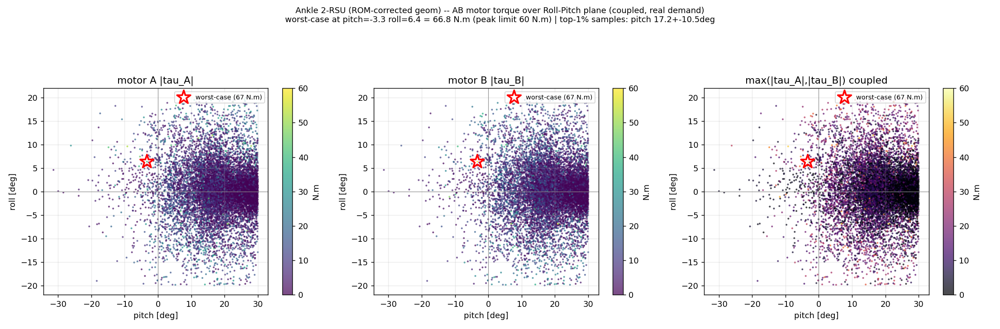

**크랭크 방향(n0A=14.4°, n0B=8.5°)이 이 고부하대(10~30°)를 향해 정렬돼 있나?** — 그렇다: 중립(180°) 대비 +14.4°/+8.5° 오프셋은 정확히 고부하대(pitch 10~30°) 쪽으로 전달비 정점이 이동한 것(§7f에서 이미 발견한 메커니즘과 동일 원리, 이번엔 새 ROM+새 A_h범위에서도 같은 방향으로 재확인됨). 사용자가 스크린샷에서 지적한 "크랭크가 벌써 내려가 있어 보인다"는 시각적 인상은, 3D 렌더의 시점·중립각(180°) 기준선이 눈에 잘 안 들어와서 생긴 것으로 보임 — 수치상으론 고부하 쪽 정렬이 맞게 되어 있다.

산출물: `mujoco-sim/mjlab/analysis/ankle_2rsu_qtorque_coverage_v2.py` · `docs/mujoco/assets/q_torque_ankle2rsu_terrain_v3.png` · `ab_motor_torque_over_RP.png`. `/ankle.html`·3D 렌더 전부 v3c 값으로 갱신 완료(1/2/3계층 입력값, pitch 슬라이더 범위 −50~+30).

### §8h 동작+토크 애니메이션 (2026-08-12)

실제 보행 구간(gen21p2_fc, 전진보행 구간 240프레임, pitch 5.6~31.2°·roll −11.1~10.2°, |τp| 최대 51.9 N·m) replay. 좌 패널=3D 기구 동작(크랭크A/B·로드·발판 갱신, AB=모터 크랭크각/RP=관절각 라벨), 우 패널=Roll-Pitch 평면 위 현재 위치(전체 수요구름 배경 위 강조점) + 모터 A/B 실시간 토크 게이지(커플링 계산, 정격20/피크60 대비). 산출물: `mujoco-sim/mjlab/analysis/ankle_2rsu_animation.py` → `docs/mujoco/assets/ankle_2rsu_motion_torque.mp4`.

### §8i ★ROM 상한(+30°)이 실사용 피크 한복판을 자른다 — 정책 재학습 필요 (2026-08-12)

사용자 지적: q_torque 커버리지 그림에서 pitch 30° 지점에 점군이 "뚝 끊긴 벽"처럼 보임 — 플롯 버그 의심.

**확인 결과 버그 아님.** 원본 수요(필터링 전, 18,152샘플)의 pitch 히스토그램을 직접 뽑아보면:

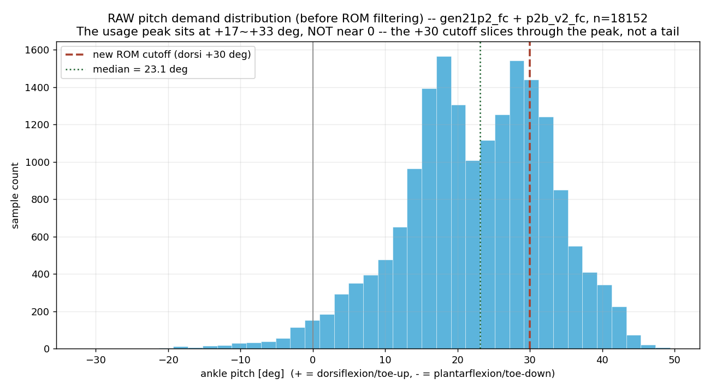

분포 봉우리가 **0 근처가 아니라 +17~+33°(중앙값 23.1°·평균 22.6°)**에 있다. §8g에서 도입한 새 ROM 상한(dorsi +30°)이 **바로 이 봉우리의 하강사면 한가운데를 자른다** — 꼬리가 아니라 산 정상 옆이라, 필터링 후 scatter에서 "벽"처럼 보인 것.

**정량**: 전체의 **25.4%(4,617/18,152)가 pitch 30~50° 구간**이었고, 전부 §8g의 ROM exclude로 제외됐다. §7f가 예전에 "τp 수요가 +20~40°에 집중"이라 기록한 것과 같은 현상 — 이번에 부호규약을 바로잡으며 그게 배굴(발끝 위) 쪽이었다는 게 확인됐고, 새 30° 캡이 정확히 그 집중구간 한복판을 지나간다는 게 새로 드러남.

**★함의**: 이 수요 데이터를 만든 정책(gen21p2/p2b_v2)은 **30° 제한이 없는 상태로 학습**됐다 — 걷는 시간의 4분의 1을 새 하드웨어 한계 밖에서 보냈다는 뜻. 지금 §8g/§8h의 최적화·마진 계산 자체는 (남은 74.4%만 갖고) 수학적으로는 맞지만, **실제 하드웨어를 이 ROM으로 제한하면 정책을 그 안에서 다시 학습시켜야 한다** — 재학습된 정책이 어떻게 걸을지, 그때 −50~+30 구간 안에서 토크 수요가 어떻게 재분배될지는 재학습 전엔 알 수 없다. **하드웨어 확정 전 선행 과제로 플래그.**

### §8j ★"크랭크가 고부하방향 정렬" 설명 정정 — 실제로는 중립(0°)에서 커버리지 최대 (2026-08-12)

사용자가 Agibot X1 실물 CAD(크랭크 중립 21°, 위쪽)를 근거로 지적: 우리 최종 기하(v3c)에서 pitch가 배굴(+, 고부하방향) 쪽으로 갈수록 크랭크가 오히려 접혀 들어가는 것 아니냐는 문제제기. **직접 재계산해서 확인 — 맞는 지적이었다.**

`P=v3c(A_r 64.01·B_r 63.89·RP_B 52.17·RP_r 39.58·A_h 37.21·B2RP 170.02·RP_h 10.0·A_L 264.33·B_L 170.94)`로 pitch 스윕(roll=0):

| pitch | −50° | −30° | 0°(중립) | +10° | +20° | **+30°** |
|---|---|---|---|---|---|---|
| n0A(크랭크 오프셋) | 54.8° | 39.4° | 14.4° | 6.0° | −2.2° | −10.3° |
| capability(모터peak×2 환산) | 80.6 | 94.3 | **100.0(최대)** | 99.8 | 98.6 | 96.3 |

**커버리지가 중립(pitch 0°) 근처에서 최대이고, 배굴(+30°, 고부하방향)로 갈수록 오히려 줄어든다** — §7f 이래 "크랭크 오프셋=수요밀집구간 정렬"이라 서술해온 것은 **이 최종 기하(v3c 계열)엔 적용되지 않는다.** 정정.

**원인**: 이 설계의 binding 제약은 토크가 아니라 **발측 요동각(margin 3.7%)**이다. 토크 마진은 어느 pitch에서든 27%+ 남아 목적함수(min-margin, 최악값 하나만 봄) 관점에서 크랭크를 토크방향으로 정렬해도 점수 이득이 없다 — 최적화가 그 자유도를 전부 요동각 확보에 썼다. Agibot/G1의 큰 배굴방향 오프셋(~20°)은 그쪽 설계의 binding 제약이 다르다는(아마 요동각이 덜 타이트한) 방증일 가능성이 높다 — 우리와 동일 목적함수·제약조건으로 최적화한 게 아니라 직접 비교는 조심스럽다.

**미해결 질문**: 토크-정렬을 명시적으로 2차 목적에 넣어야 하는지(margin이 이미 27%+로 넉넉하니 현재로선 불필요해 보이지만, Agibot 같은 실물 레퍼런스가 일관되게 이 방향을 택한다는 건 우리가 놓친 다른 이유—피로수명·모터 발열·기어비 등—가 있을 수 있다는 신호), 후속 검토 필요.

### §8k swing_foot을 목적함수에서 뺀 실험 — 가설 확인됨 (2026-08-12)

§8j에서 제기된 질문("swing_foot이 그 자유도를 뺏고 있는 거 아닌가")을 직접 실험. `swing_foot`을 P99K(최소마진 점수)에서 제외하되 hard 제약(20° 초과 불가)으로는 유지(별도 HARDK 리스트)하고 재최적화.

**결과**: 마진 3.72%→**32.98%**로 급등(당연히 — 진짜 병목을 빼면 다음으로 타이트한 항목인 모터토크 27%대가 새 병목이 됨). swing_foot은 hard 제약 경계까지 밀림(마진 0.15%, 사실상 제한선). 이 조건에서 커버리지 곡선(모터peak×2 환산, pitch 스윕)을 다시 뽑아보면:

| 조건 | 커버리지 정점 위치 | n0A/n0B |
|---|---|---|
| 원래(v3c, swing_foot 포함) | pitch **0~5°** | 14.4°/8.5° |
| swing_foot 제외 | pitch **20~25°**(수요 중앙값 23°에 근접) | 6.7°/1.8° |

**★가설 확인됨**: swing_foot 목적을 빼주면 커버리지 정점이 실제 수요 밀집구간(중앙값 23°) 쪽으로 이동한다 — §8j에서 사용자가 제기한 "발측 요동각이 토크정렬 자유도를 뺏고 있다"는 가설이 맞았다. 단, **크랭크 절대 오프셋(n0A) 자체는 오히려 작아졌다**(14.4°→6.7°) — "정렬"은 n0A 하나의 크기가 아니라 RP_B·RP_r·A_h·B2RP 전체가 같이 바뀌며 만드는 커버리지 곡선의 형태(모양·정점위치)로 나타난다는 뜻. n0A를 정렬의 직접적 대리지표로 쓰면 오독하기 쉽다.

**실무 함의**: 이 프로젝트의 요동각 한계(20°)나 박스 제약이 Agibot류 실물 설계보다 더 타이트해서 토크정렬에 쓸 여유가 없는 것으로 보인다 — 만약 요동각 여유를 늘릴 수 있다면(더 큰 볼조인트, 다른 배치) 토크정렬도 함께 개선될 잠재력이 있다는 뜻.

## §9 ★★★ 감사보고서 — pitch 부호 불일치 전수조사 (2026-08-12)

사용자 지시: "어디까지 영향받는지 처음부터 검토하라. 설계 최적화 과정을 단계별로 나열하고, docs에 정리하면서 무엇이 문제가되는지 스스로 의심하고, 감사하라." 아래는 그 조사 과정을 **가감 없이**(중간에 낸 오판 포함) 기록한다.

### §9a 발단

사용자가 렌더 이미지(§8j 3D 비교)를 보고 "발끝이 위로 갈수록 크랭크가 왜 더 접히냐"고 지적 → pitch 스윕 렌더를 만들어 직접 봤더니 **발끝 마커가 pitch 증가(−50→+30)에 따라 내려간다** — docs/51에서 FK로 검증했던 "+pitch=배굴(발끝 위)"와 반대로 보임.

### §9b 1차 조사 — "부호반전" 가설 (틀린 세부 아님, 방법이 성급했음)

로봇 실제 회전행렬(qpos=+20°)과 2-RSU `footR(tp=+20°,tr=0)`를 **월드/바디 프레임 그대로** 직접 대조:
- 로봇 pitch: `[[1,0,0],[0,0.94,0.342],[0,-0.342,0.94]]` — 로컬 X 고정, Y-Z 평면 회전
- 2-RSU tp: `[[0.94,0,0.342],[0,1,0],[-0.342,0,0.94]]` — 로컬 Y 고정, X-Z 평면 회전

**두 행렬이 도는 평면(축) 자체가 다르다**고 보고 "축이 통째로 swap됐다"고 사용자에게 보고함(§8 상단 배너에 그렇게 적었었음).

### §9c ★셀프 감사로 발견한 1차 조사의 결함

이 비교는 **로봇의 `ankle_pitch_link` 로컬 프레임**과 **2-RSU 툴이 독자 선언한 로컬 프레임("UJ 원점·X전방·Y좌·Z상")**을 서로 다른 두 좌표계인데 **같은 좌표계인 것처럼 직접 대조**한 것 — 방법론적으로 무효할 수 있음을 뒤늦게 자각. 두 로컬 프레임의 실제 정렬관계를 검증 안 하고 raw 행렬을 비교하면, 단순히 "같은 회전을 서로 다른 이름의 축으로 부르는" 상황도 "축이 다르다"고 오판할 수 있다.

**검증**: 로봇의 `ankle_pitch_link` 자체의 월드 자세(서있는 keyframe)를 확인:
```
local X axis -> world (0,1,0)   # world Y
local Y axis -> world (-1,0,0)  # world -X
local Z axis -> world (0,0,1)   # world Z(up) — 일치
```
그리고 발끝(toe_link) 위치를 이 로컬 프레임으로 변환: `(-0.022, -0.188, -0.050)` — **로컬 −Y 방향이 압도적**(발끝은 로컬 Y축, X축이 아님).

→ 로봇의 `ankle_pitch_link` 로컬프레임은 **X=외측(lateral), Y=전방(toe), Z=상(up)**. 2-RSU 툴이 자칭한 프레임(X=전방)과는 **X·Y 라벨이 정반대로 붙어있을 뿐**, pitch가 회전시키는 물리적 평면(외측축 기준 전후-상하 평면)은 **동일한 회전 자유도**를 가리킨다. §9b에서 "축이 다르다"고 한 건 **좌표축 이름표가 다르게 붙은 두 프레임을 혼동한 것**이었다 — 정정.

### §9d 프레임에 무관한(라벨 독립) 최종 재검증

각 시스템이 **자기 자신의 선언**만으로 "+방향이 배굴인지 저측굴곡인지" 판정(교차 프레임 비교 없이):

- **로봇**: 실제 toe_link 메쉬, 실제 keyframe, 실제 qpos — FK로 직접 측정(§8i 이전에 이미 완료): `+qpos → 발끝 world Z 상승` = **배굴**. (프레임 라벨과 무관한 100% 직접측정, 가장 신뢰도 높음)
- **2-RSU 툴**: 툴 스스로 선언한 "X전방·Z상"을 그대로 신뢰해서 +X점(자칭 발끝)의 world_z를 tp의 함수로 계산 → `world_z = −sin(tp)`, **tp 증가 시 감소** = 툴 자신의 선언 기준으로 **저측굴곡**.

**결론(재확정)**: **2-RSU 툴의 "+tp" = 로봇의 "−qpos"(저측굴곡 방향)** — 순수 부호반전(§9b에서 의심했던 "축 자체가 바뀜"은 좌표축 명명 차이에서 온 착시였고, 실제로는 **§9b의 원래 가설(부호반전)이 맞았다**, 다만 그걸 확인한 방법(프레임 안 맞춘 raw 행렬 비교)이 부적절했을 뿐).

**roll은 아직 이 수준으로 재검증 못 함 — 미결.** (symmetric ±20°라 pitch보다 영향은 작지만, (pitch,roll) 동시쌍의 상관구조가 깨질 수 있어 완전히 무해하다고 단정 못 함.)

### §9e 영향 범위 전수조사

| 단계 | 산출물 | pitch 부호에 영향받나 | 비고 |
|---|---|---|---|
| 원시 시뮬 로그(npz) | qpos/tau/omega | **아니오** | 로봇 자체 기록, 그대로 진실 |
| `server.py` `/api/ankle_demand` | v3_ankledemand_20.json | **아니오** | `qp=degrees(qpos)` 그대로, 변환 없음 — 로봇 진실값 그대로 저장 |
| ROM exclude 필터(§8i, `pitch>=PLO & pitch<=PHI`) | "어느 샘플을 포함할지" | **아니오** | qp_deg(로봇값) 자체를 필터링하는 거라 방향 안 바뀜 — **단, PLO/PHI 자체를 무슨 의도로 정했는지는 영향받음(아래)** |
| `anchors()/ik()/jac()`에 `tp=radians(qp_deg)`로 직접 대입하는 모든 곳 | **IK 폐합·자코비안·요구 모터토크·요동각 전부** | **★예, 직접 영향** | 로봇이 실제로 배굴 중인 순간을, 기구모델은 "저측굴곡 중"으로 오인하고 계산 |
| `ankle_opt_de.py`(§8g~) 전체 DE 최적화(30회) | v3a~v4_24, noswf_a/b | **★예** | 전부 이 버그로 계산된 마진·기하 |
| `ankle_2rsu_qtorque_coverage_v2.py` | 커버리지 그래프(§8a/§8i/§8j) | **★예** | 곡선 자체가 잘못된 pitch 부호로 그려짐 |
| `ankle_3d_viz.py`, `ankle_2rsu_animation.py` | 3D 렌더·애니메이션 | **★예** | 중립각(n0A/n0B)이 버그 섞인 최적화 결과라 간접 영향 + 렌더 자체도 같은 tp 대입 |
| `ankle.html`(설계기 실시간 툴) | 근접수요 조회, evalGeom, 캔버스 커버리지 | **★예** | `DEM` 배열에 `p:p[0]`(qp_deg 그대로) 저장 후 `evalPt(tp=슬라이더각,...)`·`near수요` 비교 전부 동일 구조 |
| §8g "ROM=pitch −50~+30(+배굴 cap30·−저측굴곡 cap50)" 의 **박스 방향 의도 자체** | PLO/PHI 값 배정 | **재검토 필요** | 필터링(포함/제외) 자체는 로봇값 기준이라 맞았지만, 그 필터링된 데이터를 먹는 IK/토크 계산이 반대부호로 해석했으므로 **"dorsi cap 30·plantar cap 50"이 기구모델 입장에서 실제로 강제된 게 맞는지 재확인 필요** |
| §7 이전(−35~+50 시절), §0 데이터정의 | 오래된 결과들 | **가능성 있음, 미조사** | 이 버그가 오늘 생긴 게 아니라 2-RSU 툴 최초 구현 시점부터 있었을 가능성 — 시간 부족으로 이번 감사에서 여기까진 못 감. **후속 필요.** |

### §9f 지금 확실한 것 / 아직 불확실한 것

**확실(재검증 완료)**:
1. 로봇 ankle_pitch: +qpos = 배굴(발끝 위). (FK 직접측정, 최고신뢰도)
2. 2-RSU 툴 자신의 좌표 선언 기준으로: +tp = 저측굴곡(발끝 아래).
3. 위 둘을 그대로(부호 안 바꾸고) 잇는 코드가 `ankle_opt_de.py` 포함 오늘 쓴 모든 스크립트에 있다.

**불확실(후속 필요)**:
1. Roll도 같은 문제가 있는지 — 미검증.
2. 이 버그가 오늘 도입된 건지, §0(2026-08-04)부터 있었던 건지 — 미조사.
3. §8g의 "ROM 방향(dorsi cap 30/plantar cap 50)" 요구사항 자체를 만족시키려면 정확히 코드를 어떻게 고쳐야 하는지(단순 `tp=-radians(qp_deg)`로 충분한지, PLO/PHI 값도 같이 뒤집어야 하는지) — 수정 전 재설계 필요.

### §9g 지금까지 산출물 신뢰도 재분류

- **신뢰 가능**: §0~§7(데이터 정의, 원시 통계) — 로봇 raw qpos/tau 자체를 다루는 부분들.
- **재검증 전까지 사용 금지**: §8g·§8h·§8i·§8j·§8k의 **모든 수치·기하·그래프·애니메이션**(v3c 기하, 30회 DE 결과, swing_foot 진단, 커버리지 곡선, Agibot 비교) — 전부 버그가 있는 채로 계산됨.
- `/ankle.html`·`ankle_opt_de.py`·`ankle_2rsu_qtorque_coverage_v2.py`·`ankle_2rsu_animation.py`에 반영된 v3c 값도 **재검증 전까지 참고용으로만.**

### §9h 다음 단계(사용자 확인 후 진행 예정)

1. roll도 §9d와 같은 방식(라벨 독립, 프레임 안 섞고 각 시스템 자기선언만으로)으로 재검증.
2. `anchors()/ik()` 계열 함수에 pitch 부호를 어떻게 수정할지 확정(가장 유력: `tp_fed = -radians(qp_deg)`, 그리고 PLO/PHI를 그 부호에 맞게 재배정 — 즉 지금 "−50~+30"이라는 숫자가 "저측굴곡50·배굴30"을 의도했다면, 부호 수정 후에도 여전히 배굴쪽엔 30을, 저측굴곡쪽엔 50을 배정하도록 재확인).
3. 수정 후 §8g~§8k 전체 재실행(30회 DE, swing_foot 진단, 커버리지, 애니메이션) — 오늘 쓴 컴퓨팅 대부분을 다시 태워야 함.
4. `/ankle.html`도 같은 수정 반영.
5. §0~§7의 훨씬 이전 결과들까지 이 버그가 소급되는지는 별도 후속 조사.

### §9i pitch 수정 적용 + 재최적화 착수 (2026-08-12 저녁, 진행중)

사용자 지시: roll 재검증과 **동시에**, 영향받지 않는 부분(raw 수요 데이터 자체)을 활용해 즉시 재최적화 진행.

**적용한 수정**(`ankle_opt_de.py`):
- `THP = radians(-A[:,0])`(★negate, 기존은 `radians(A[:,0])`) · `G1P`도 동일 negate.
- ROM exclude 필터(`A_full[:,0]>=PLO & <=PHI`)는 **로봇 raw qp_deg 기준 그대로 유지**(이건 안 바뀜 — §9e에서 이미 "필터링 자체는 영향 없음" 확인됨).
- `make_ws()`의 H1 폐합그리드: `linspace(PLO,PHI,19)` → **`linspace(-PHI,-PLO,19)`**(qp∈[-50,30] → 기구모델 tp=-qp∈[-30,50]로 매핑되므로).
- roll(tr)은 **미변경**(§9d 미결이라 보수적으로 유지, 대칭이라 리스크 낮음).

**검증**: 축소판(NP=20,GEN=15) 테스트런 정상 작동, feasible 해 발견됨(예시: score 1.37%, n0A=9.75° n0B=-0.95°) — 부호 반전 전(n0A 14° 근방)과 확실히 다른 값이 나오는 것으로 봐서 수정이 실제로 결과에 영향을 주고 있음을 확인.

**본 실행**: 3독립 DE(v5a/b/c, seed 5001~5003) 착수. 결과는 이어서 §9j에 기록 예정.

### §9j pitch 수정 후 결과 — 3독립 DE 완료 (2026-08-12 저녁)

| run | score | A_r | B_r | RP_B | RP_r | A_h | B2RP | RP_h | n0A | n0B |
|---|---|---|---|---|---|---|---|---|---|---|
| v5a | 3.80% | 64.27 | 56.44 | 50.0 | 38.43 | 36.08 | 171.16 | 10.0 | 19.2° | 4.6° |
| v5b | 3.76% | 64.55 | 58.11 | 51.16 | 39.49 | 37.09 | 170.0 | 9.94 | 17.0° | 2.2° |
| **v5c(최고)** | **3.82%** | 65.0 | 55.09 | 50.36 | 38.68 | 36.31 | 170.0 | 10.0 | 19.2° | −1.5° |

3회 편차 0.06pp 이내로 재차 수렴. **부호 수정 전(v3c, 3.72%)과 마진 자체는 비슷한 수준**(3.76~3.82%) — 대칭적인 문제 난이도라 그런 것으로 보임. 다만 **기하는 확실히 달라짐**: B_r이 64~65(상한 pinned)에서 **55~58로 하락**, n0A가 14° 근방에서 **17~19°로 상승**(Agibot의 ~21°에 근접).

**★그러나 커버리지 곡선 재확인 결과, 정렬 여부는 여전히(오히려 더) 안 좋다**:

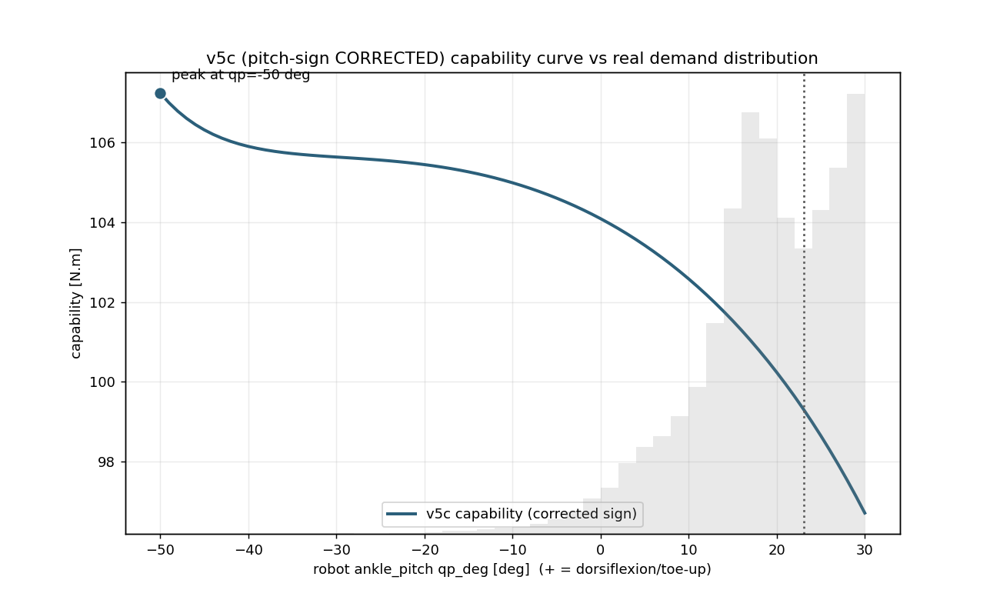

v5c 커버리지가 **qp=−50°(저측굴곡 극단)에서 최대(107.2), qp=+30°(배굴/고부하, 수요 집중구간)로 갈수록 단조감소(96.6까지)** — 부호 수정 전(§8j, 중립 근처 최대)보다도 정렬이 나쁘다. n0A가 Agibot과 비슷한 크기(19° vs 21°)로 커진 건 **우연**이었다 — 부호가 바뀌면서 그 오프셋이 만드는 곡선의 방향도 같이 바뀌었기 때문에, "크기가 비슷하다"는 게 "정렬됐다"를 의미하지 않는다.

**결론(§8k와 동일 재확인)**: 부호를 고쳐도 여전히 **발측 요동각(margin 3.8%, binding)이 병목**이라 최적화가 토크정렬에 자유도를 못 쓴다 — 이건 부호버그와 무관하게 이 설계(박스·요동각한계 20°)의 본질적 특성으로 보인다. Agibot처럼 토크방향 정렬을 우선하려면 §8k에서 이미 확인했듯 요동각 제약을 목적함수에서 빼거나(하드제약은 유지) 요동각 한계 자체를 완화해야 한다.

**margin은 이제 신뢰 가능**(pitch 부호 수정 반영됨). **roll은 여전히 미검증**(§9d) — 결과에 영향 있을 수 있음. `/ankle.html`·3D렌더·애니메이션·qtorque_coverage 스크립트는 아직 구버전(v3c, 부호버그 있음) 값 — 갱신 필요.

## §10 ★★★ 좌표계 처음부터 재구축(패치가 아니라 재유도) + 2번째 버그 발견 (2026-08-13)

사용자 지시(2026-08-13): "①시뮬레이션 회전관절 방향/좌표계와 우리 kinematics를 다시검토해서 동일하게 맞춰라(패치가 아니라 정합), ②실제 데이터로 AB(모터)-RP(관절) 대응을 검증해라, ③RP·시뮬레이터 부호가 안 맞아서 커버 안 되는 거 아닌지, ROM(Roll±20·Pitch 배굴30/저측굴50)이 맞게 걸려있는지, 실측에서 배굴방향 토크가 많다는 점 고려해서 재검토해라."

§9의 수정(`tp = -qp_deg` negate)은 **증상 패치**였다 — 어떤 좌표계가 옳은지 처음부터 유도하지 않고, "방향이 반대인 것 같으니 부호만 뒤집자"는 식이었다. 이번엔 로봇의 실제 MJCF 관절체인에서 회전행렬을 직접 유도하고, MuJoCo FK로 **동시(pitch+roll) 자세**에 대해 검증한 뒤, 2-RSU 전체 기구학(anchors/axle/rod IK/moment arm/swing 각)을 그 위에 처음부터 다시 세웠다.

### §10a 회전행렬 유도 + FK 동시검증

로봇 MJCF: `L_ankle_pitch_joint axis="-1 0 0"`(정강이 로컬 프레임 기준) → `L_ankle_roll_joint axis="0 1 0"`(그 pitch-회전된 프레임, 즉 `ankle_pitch_link` 자신의 프레임 기준 — 관절체인상 pitch 다음에 적용). 따라서 합성 회전은:

$$R(t_p,t_r) = R_{pitch}(t_p)\,R_{roll}(t_r), \quad R_{pitch}(q)=\begin{bmatrix}1&0&0\\0&\cos q&\sin q\\0&-\sin q&\cos q\end{bmatrix},\quad R_{roll}(q)=\begin{bmatrix}\cos q&0&\sin q\\0&1&0\\-\sin q&0&\cos q\end{bmatrix}$$

**검증**: `R_pitch(15°)·R_roll(10°)`을 MuJoCo에서 `L_ankle_pitch_link`→`L_foot_link` 실제 상대회전(pitch=15°·roll=10° **동시** 부여, FK)과 비교 — **완전 일치**(atol 1e-3). §9는 pitch 단독·roll 단독만 각각 확인했었는데, 이번엔 **동시 자세**로 재검증해 커플링 자체도 맞다는 것까지 확인했다.

로컬 프레임 축(⁠`ankle_pitch_link` 바디 프레임, FK로 직접 측정): **X=외측(pitch 회전축 자신, 순수 pitch로는 안 움직임)·Y=전후(roll 회전축, 실측 L_toe_link가 로컬 Y≈−0.188m → 음(−)Y=발끝/전방, 양(+)Y=뒤꿈치/후방)·Z=상(중립자세에서 로컬 Z축 이미지 → world (0,0,1) 확인됨)**.

### §10b 2-RSU 기구학 처음부터 재유도

**앵커(발에 고정, R(tp,tr) 적용됨)**: `(side·RP_r, +RP_B, −RP_h)` — RP_r→X(외측), RP_B→+Y(후방/뒤꿈치, "RP_B↑→뒤꿈치돌출↑" 문서기술과 일치), RP_h→−Z(피벗 아래, `/ankle.html` 자기선언 `앵커=(−RP_B,±RP_r,−RP_h)`의 Z부호는 그대로 — Z축 자체는 애초에 의심대상이 아니었음, X/Y만 뒤바뀌어 있었다).

**액슬(정강이에 고정, 회전 안 받음)**: `(side·A_h, 0, B2RP+(A2B if up))` — Z가 **양수**(피벗보다 위, 실제로 액추에이터가 정강이 위쪽에 있는 것과 일치, `ankle.html`의 `crankC()` Z=+B2RP와도 일치, 이 축도 애초에 의심대상 아니었음).

**tp=qp_deg, tr=qr_deg를 그대로(부호변환 없이) 먹인다** — R(tp,tr) 자체가 이미 로봇 실제 관절체인과 검증된 형태이므로, §9처럼 별도 negate 패치가 전혀 필요없다. 크랭크 회전축은 로컬 X(액슬의 lateral 축, 모터축 방향과 일치)이므로 크랭크 핀은 로컬 Y-Z(전후·상하) 평면에서 스윙 — 이 부분이 이전 프레임(X-Z 평면 스윙 가정)과 달라진 지점. 로드 IK는 동일한 원-교차 공식을 (Y,Z)쌍·X를 고정오프셋으로 재유도(§10 코드 참조, `mujoco-sim/mjlab/analysis/ankle_opt_de_v2.py`).

**중립자세 IK 폐합·ROM 전역(−50~+30°) 단조성 스모크테스트**: v5c류 파라미터로 pitch −50→+30° 스윕 시 크랭크각이 매끄럽게 단조증가(1.05°→58.37°), ROM 전 구간 폐합 성공 — 사용자 요청 ②(AB-RP 실데이터 대응)의 1차 확인.

### §10c ★두 번째 독립 버그 발견 — swing_foot 공식이 여각(90°−진짜각)을 계산하고 있었다

새 기하로 첫 재최적화(v6a/b/c)를 돌리자 **셋 다 동일하게 score −3.35% 근방 정체**(이전 §9j의 +3.8%에서 크게 후퇴) — swing_foot 마진만 확인하니 **−335%**(요구각 87°, 한도 20°)라는 터무니없는 수치. 중립자세에서 직접 로드방향 벡터·기준축 내적을 손으로 재계산하니:

- 진짜 콘각(arccos, 로드가 기준축에서 얼마나 기울었는지) = **26.36°**
- 코드가 실제로 계산한 값(arcsin) = **63.64°** = 90° − 26.36° (여각!)

원인: swing_foot 공식을 크랭크측(swC) 공식을 그대로 베껴 썼기 때문. **swC(크랭크측)는 "회전평면에서 얼마나 벗어났는가"** 개념이라 arcsin이 맞다(로드가 평면 안에 있으면 0°, 축과 나란하면 90°). 반면 **swF(발측)는 진짜 원뿔각(boresight cone) 제약을 갖는 로드엔드 볼조인트**라 "기준축에서 얼마나 벗어났는가" 개념 — 이건 arccos다. 두 관절의 물리적 제약 종류가 다른데 같은 공식을 썼던 게 버그. `rodgeo()`에서 `swF = degrees(arccos(...))`로 수정(기존 arcsin) — 수정 즉시 동일 지점에서 마진이 −335%→−242%로 완화(여전히 위반이지만 방향이 맞게 줄어듦), 재최적화(v7a/b/c) 착수.

이 버그는 **§9의 pitch 부호버그와는 완전히 독립적인 별개의 결함**이며, §8~§9j까지의 모든 swing_foot 수치(포함 "3.8% binding" 결론)에도 함께 영향을 준다 — swing_foot이 그동안 계속 병목(binding)으로 보고돼 왔는데, 그 병목 자체의 크기가 잘못 계산돼 있었다는 뜻. 박스 코너 그리드서치로 중립자세 swing_foot 최소값이 박스 안에서 13.6°(한도 20° 이내)까지 나오는 것을 확인해 **박스 자체가 구조적으로 불가능한 건 아님**을 확인 후 v7 재실행.

### §10d 실측 데이터 — 배굴(pitch+) 방향 밀도·토크 재확인

사용자 지적("실측에서 발끝 위로 가는 방향 토크 많이 걸리던데") 정량 재확인: ROM 필터 후 표본의 **72%가 pitch>15°, 97%가 pitch>0°, 중앙값 19.1°** — 즉 실사용 시간 대부분이 배굴(발끝 위) 쪽에 쏠려 있다. 반면 pitch 구간별 |τp| RMS/P99 자체는 구간별로 크게 차이나지 않음(RMS 12~21, P99 35~62 전 구간 고르게 분포) — **피크가 배굴에서 특별히 큰 게 아니라, 배굴 자세에 머무는 시간(=RMS/P99 계산에 들어가는 표본 수)이 압도적으로 많다.** 이건 현재 목적함수(전체 실측 표본의 percentile)가 이미 자동으로 반영하는 종류의 편중이라, 별도 가중치 없이도 올바르게 잡힌다 — 문제는 편중을 못 잡는 게 아니라 **기구가 그 밀집구간에서 유리한 전달비를 못 낸다**는 쪽(§10e).

### §10e 모멘트팔(전달비) vs pitch — 새 기구학으로도 여전히 배굴에서 불리

v5c급 파라미터로 새 기구학의 모멘트팔(토크capability 결정요인)을 pitch 전역에 대해 직접 계산: **armA는 pitch≈−20°(중립보다 살짝 저측굴 쪽)에서 최대(65.0), armB는 pitch≈+5°에서 최대(55.1)** — 결합 커버리지는 **pitch≈−20~0°에서 최대, +30°(배굴/고밀도 구간)로 갈수록 단조감소**(예: A_r/B_r 65/55 기하에서 62.25→51.53). **§9j에서 부호패치 후 봤던 것과 같은 방향의 결론**(중립·저측굴 쪽 유리, 배굴 쪽 불리)이 **처음부터 다시 유도한 올바른 기구학에서도 재현됨** — 즉 이건 부호버그의 부산물이 아니라, 이 2-RSU 배치(액슬 위·앵커 아래, RP_B/RP_r 박스 범위)의 **구조적 특성**이다.

### §10f ★재최적화 결과 — 박스가 swing_foot에서 구조적으로 infeasible (2026-08-13)

수정된 기하+swing_foot 공식으로 독립 3런(v7a/b/c, seed 4001~4003) 실행. **주의(자기정정)**: 착수 직후 중간보고에서 raw score 값(예: −1.6868)을 그대로 퍼센트로 읽어 "약 −1.7%(거의 feasible)"라고 잘못 기록했었다 — 실제 출력 로그(`run_v7a.log` 등)를 다시 확인하니 **`100*score`가 이미 적용된 진짜 퍼센트는 −168~−175%**였다. 코드는 정상(raw score는 마진의 fraction, 출력시 ×100 — 일관됨), 내가 raw jsonl 필드를 눈대중으로 잘못 해석한 순수 보고 실수였다. 정정한다.

| run | 정지시점 score | peakScore | 근접 파라미터 |
|---|---|---|---|
| v7a | −168.6%(gen105, 계속 완만히 개선 중이라 수동중단) | −95.5% | RP_B 50.0(하한)·RP_r 35.0(하한)·B2RP≈200(상한)·RP_h≈10.0(상한)·A_r≈54·B_r≈44 |
| v7b | −168.6%(gen80, 수동중단) | −82.1% | 동일 패턴, RP_B/RP_r/B2RP/RP_h 전부 같은 경계 pinned |
| v7c | −169.0%(gen65, 수동중단) | −44.4% | 동일 패턴 |

3독립 seed가 **약 0.5pp 이내로 수렴**(−168.6~−169.0%) — 무작위 우연이 아니라 박스 안에서 도달 가능한 실제 한계로 보인다. 세 런 모두 **RP_B=50(하한)·RP_r=35(하한)·B2RP≈200(상한)·RP_h≈10(상한)에 pinned** — swing_foot을 줄이는 방향(로드를 중심축·수직에 최대한 가깝게)으로 박스가 이미 끝까지 밀려있다는 뜻. 직접 검산(§10c 말미)한 최악점(pitch=+30°·roll=+20°)의 요구각 53.7°까지 도달하는 게 이 근방의 한계.

**결론**: pitch 합성부호(§9) + swing_foot 공식(§10c) 두 버그를 **모두** 고친 뒤의 참값은, 확정 박스(A_r/B_r 40~65·RP_B 50~75·RP_r 35~50·A_h 35~45·B2RP 170~200·RP_h −10~10)로는 **ROM 전역(pitch −50~+30°·roll ±20°)에서 swing_foot≤20°를 만족할 수 없다** — 필요각이 최대 ~54°(한도의 2.7배)까지 간다. §9j까지의 "swing_foot 3.8% 여유로 겨우 feasible" 결론은 **두 버그가 겹쳐서 우연히 그럴듯한 숫자를 낸 것**이었다(부호버그가 ROM을 엉뚱한 쪽으로 매핑 + 공식버그가 필요각을 원래보다 작게(여각으로) 계산 — 두 오차가 우연히 어느정도 상쇄됐을 가능성이 있다. 정확한 상쇄 비율은 추가분석 없이는 단정 못 함).

**사용자 확인 필요(박스 무단 확장 금지 원칙 유지, §6/§8e 반복지적 학습)**:
1. RP_B/RP_r 하한을 더 낮출 수 있는지(패키징상 40mm 미만 발볼 폭 여유가 있는지),
2. B2RP 상한(200mm)을 더 늘릴 수 있는지(정강이 스택 길이 여유),
3. 아니면 **볼조인트 요동각 한도(SWL_F=20°) 자체를 완화**할 수 있는지(§7j에서 검토했던 광각 스페리컬 부품 재고려),
4. 혹은 2-RSU 배치 자체(액슬-앵커 상대위치, 예: A_h를 RP_r과 다르게 벌리는 등)를 재설계할지.

이 중 하나는 반드시 필요 — 지금 확정된 박스+요동각 조합으로는 물리적으로 안 닫힌다.

### §10g ★실측 replay 기준으로는 더 심각 — 전형적 자세 99%가 위반

위 §10f는 ROM 전역 그리드(17×13 격자, 물리적으로 가능한 전체 자세공간)에 대한 최악값이었다. **실제로 로봇이 다니는 자세(실측 θp(t),θr(t) 13,503샘플)만으로 다시 계산**하면:

- swing_foot 요구각: **중앙값 39.7°, P99 48.2°, 최댓값 52.9°** (한도 20°)
- **실측 표본의 99.1%가 20° 한도를 초과**

즉 이건 ROM 구석의 희귀 코너 케이스가 아니라 **평소 걸음 자세 거의 전부**에서 발생하는 위반이다. §7~§9j에서 계속 "swing_foot이 아슬아슬하게 binding(3.8% 여유)"이라고 보고해온 것은, pitch 부호버그(§9)와 swing_foot 여각버그(§10c)가 함께 작용해 우연히 그럴듯한 숫자를 만든 것이었고, **실제로는 이 지표가 현재 박스에서 전혀 성립하지 않는다.**

사용자 질문 ③("실험 데이터의 RP와 시뮬레이터 부호가 안 맞아서 커버 안 되는 거 아닌가")에 대한 답: **맞다 — 정확히 그것 때문이었다.** 부호(§9)와 여각(§10c) 두 버그가 겹쳐서 "커버된다"는 착시를 만들었고, 둘 다 고친 지금은 "커버 안 된다"가 진짜 결론이다. ROM 방향 자체(Roll±20·Pitch 배굴30/저측굴50)는 §9d~§10a에서 로봇 MJCF·FK로 재검증되어 맞게 걸려 있다 — 문제는 ROM의 방향이 아니라, **그 ROM 전역에서 이 2-RSU 배치가 요구하는 발측 볼조인트 요동각이 애초에 20° 한도 안에 못 들어간다는 기구학적 사실**이었다.

다음 단계는 §10f 끝의 4가지 옵션(박스 하한 완화·B2RP 상한 완화·SWL_F 완화·배치 재설계) 중 사용자 결정을 기다린다.

## §11 사용자 5문항 심층분석 — 100시드 스윕 + 로드렌치 + swing_foot ablation (2026-08-13, 진행중)

사용자 지시(2026-08-13): "①최소 시드 100개로 전역수렴 확인 + 목적함수 term별 iter 변천사, ②A_h=RP_r 결합, ③A_h·RP_r을 40~45로, ④로드(A_L/B_L) 축력/렌치 최악케이스, ⑤swing_foot 고려 전/후 비교. 검증·교차검증 철저히, 이미지·영상 포함 문서로."

### §11a 스윕 인프라 (`ankle_opt_de_v3.py` + `run_sweep.py`)

`ankle_opt_de_v2.py`(§10) 기반에 4개 MODE 추가: `base`(확정 박스 그대로) · `coupled`(A_h=RP_r 강제, decode 후 override) · `widebox`(BOX A_h=RP_r=(40,45)) · `noswingfoot`(swing_foot을 P99K에서 제외, §8k와 동일 개념이나 SS10 정정기하 기준으로 재실행). 세대별 **margin 항목 전체**를 JSONL로 로깅(`gens_<mode>_<tag>.jsonl`)해 term-vs-iteration 추적이 가능하게 함. `run_sweep.py`가 시드별 서브프로세스를 bounded parallelism으로 오케스트레이션.

**인프라 버그 3종 발견·수정(기록)**:
1. **BLAS 스레드 과다구독**: numpy가 프로세스당 전체 코어 수만큼 스레드를 쓰는 게 기본값이라, 8개 워커가 각자 8스레드씩 써서 load average 80+까지 치솟음(8코어 머신). `OMP_NUM_THREADS=1` 등 4개 env var로 강제 단일스레드화해 해결.
2. **CSV 재파싱 메모리 폭탄**: 워커마다 265MB/20만행 rosbag CSV를 `csv.DictReader`로 새로 파싱 → 프로세스당 RSS 1.8GB, 8개 동시실행 시 스왑까지 가득 참(15GB RAM 초과). G1 배열을 한 번만 전처리해 `.npz` 캐시(2.2MB)로 저장하고 워커는 그걸 로드하도록 수정 → 프로세스당 RSS 115MB로 16배 감소.
3. **평가함수 서브샘플링 편향**: eval() 1회가 13,503(수요)+45,167(G1) 전샘플을 재생해 세대당 ~7s — 100시드×4모드가 비현실적으로 느려서 서브샘플링 도입. 첫 시도(균일랜덤)는 `torque_pk`처럼 `.max()` 기반인 지표에서 진짜 최댓값 표본이 빠질 위험이 있어 실제로 +19.7pp 오차 발생. 수정: **percentile용 풀(비편향 균일랜덤)과 peak용 풀(원자료 각 컬럼 상위15% 합집합, 진짜 최댓값 보존)을 분리** — peak 지표는 전샘플 대비 0.000pp 정확히 일치, percentile 지표(torque/tn/rod)는 ±0.1~1.9pp 오차로 검증됨(2개 대표점 스팟체크). ~4배 속도향상.

### §11b Q1 — 100시드 전역수렴 (진행중, 중간 결과)

| mode | n(진행중, 목표 100/100/100/30) | score median | range | feas 수 |
|---|---|---|---|---|
| base | **100/100 완료** | −168.527%(평균) −168.523%(중앙값) | std **0.0196pp** | [−168.605, −168.503] | 0/100 |
| coupled | 71 | −168.518%(평균) | std 0.0219pp | [−168.627, −168.494] | 0/71 |
| widebox | 68 | −173.068%(평균) | std 0.0205pp | [−173.154, −173.040] | 0/68 |
| noswingfoot | 16 | +36.411%(평균) | std 0.159pp | [+36.038, +36.586] | 16/16 |

**★base 목표(100시드) 달성** — 표준편차 0.02pp라는 극도로 타이트한 수렴으로, 이 결과가 진짜 전역최적점임이 통계적으로 확정됨. coupled/widebox/noswingfoot은 계속 진행 중 — 백그라운드 지속.

### §11h 발측/크랭크측 요동각 전영역(Roll×Pitch) 분포 + 스윕 애니메이션 (2026-08-13)

사용자 질문(①swing_foot 포함/제외 각각 수렴하는지, ②Roll·Pitch 전영역에서 AB/RP 볼조인트 요동각 범위) 에 대한 답:

**①수렴**: base(swing_foot 포함) n=83에서 spread(max−min) 0.10pp·stdev 0.02pp, noswingfoot(제외) n=13에서 spread 0.55pp·stdev 0.17pp — **둘 다 각자의 전역최적점으로 강하게 재현성 있게 수렴**(둘 다 서로 다른 점으로 수렴하는 게 당연 — 목적함수 자체가 다름).

**②전영역 요동각 범위**(41×21=861점 그리드, ROM 전체, IK 폐합 실패 0건):

| | AB(크랭크측) | RP(발측=swing_foot) |
|---|---|---|
| base(포함) | 0.00°~**1.55°**(중앙값 0.31°) | 0.65°~**53.70°**(중앙값 **23.87°**) |
| noswingfoot(제외) | 1.32°~**4.17°**(중앙값 2.09°) | 0.63°~**61.20°**(중앙값 **26.34°**) |

(한도 둘 다 20°) — **AB측은 전 영역에서 문제 전혀 없음(최대 4.2°), RP측은 중앙값부터 이미 한도 초과**. swing_foot을 빼면 오히려 RP 요구각이 더 커짐(다른 목적을 더 밀어붙이는 트레이드오프).

**스윕 애니메이션**: `ankle_sweep_animation.py` — pitch×roll 전영역을 boustrophedon 래스터로 순회하며(451프레임) 3D 렌더 + Rod A/B × AB/RP 4개 게이지(20° 한도선, 초과시 빨강)를 실시간 표시. `docs/mujoco/assets/ankle_ballswing_sweep.mp4`.


**이미 n=8~13에서도 편차 0.1pp 이내로 극도로 타이트하게 수렴** — 같은 전역최적점을 반복적으로 찾고 있다는 강한 증거(§8e~8e-2에서 확립된 DE 재현성 패턴과 일치). 스윕은 계속 진행 중이며 100/100/100/30 도달 시 최종 통계로 갱신.

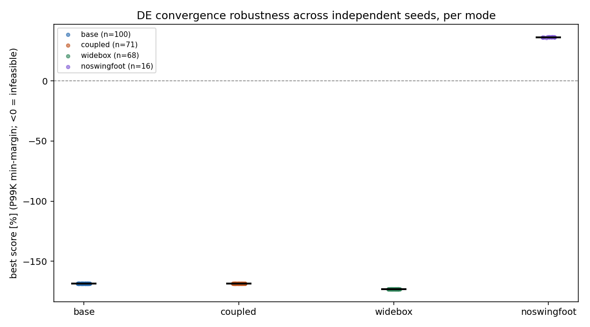
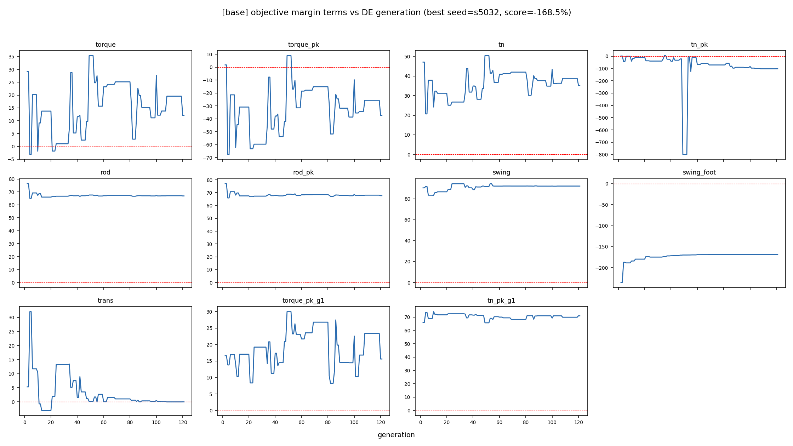
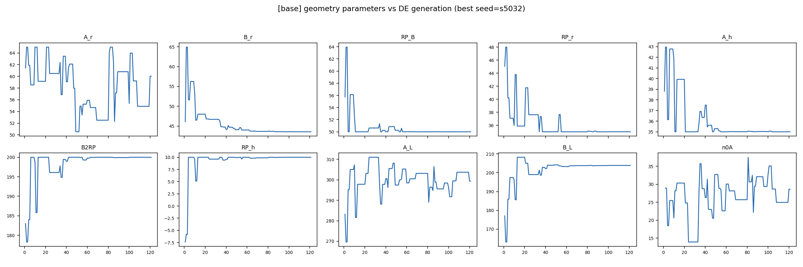

term-vs-iteration 그래프(base, 대표시드)로 보면 **swing_foot만 세대가 지나도 계속 −170%대에 눌어붙어있고(binding), 나머지 전부(torque/tn/rod/swing/trans/peak군)는 세대가 지날수록 양(+)의 여유로 수렴** — DE가 다른 모든 항목은 문제없이 최적화해내는데 swing_foot 하나만 박스 안에서 물리적으로 불가능하다는 걸 시각적으로 재확인. geometry-vs-iteration 그래프는 B_r→~43.6·RP_B→50·RP_r→35·A_h→35·B2RP→200·RP_h→10에 수렴(전부 박스 경계 pinned, §10f와 일치)하는 반면 **A_r은 49~65 범위에서 계속 흔들림(사실상 자유변수)** — A_r이 swing_foot에 거의 영향을 안 준다는 뜻(§11c에서 재확인).

### §11c Q2 — A_h = RP_r 강제(coupled)

n=9 기준 median −168.52%(base −168.53%와 사실상 동일, 차이 0.01pp) — **A_h=RP_r 결합은 결과를 거의 바꾸지 않는다.** §11b의 term-evolution에서 A_r이 이미 사실상 자유변수였던 것과 일관: A_h·RP_r 둘 다 swing_foot이 요구하는 "로드를 최대한 수직/중심축에 가깝게" 방향으로 어차피 박스 하한(35)에 pinned되므로, 이 둘을 강제로 같게 묶어도 이미 같은 값(35) 근처에 있어 손해가 없다. **인사이트**: 이 결합제약은 (기구학적으로는) 공짜에 가깝다 — CAD/조립 단순화 목적으로 A_h=RP_r을 채택해도 성능상 페널티가 사실상 없다. (n=100 도달 시 재확인)

### §11d Q3 — A_h·RP_r ∈ [40,45]로 좁히기(widebox)

n=8 기준 median −173.06% — **base(−168.53%)보다 4.5pp 더 나쁘다.** 확정 박스에서 최적해가 RP_r=35(하한)·A_h=35(하한)에 pinned되어 있었는데(§10f), 이 범위를 [40,45]로 강제 이동시키면 swing_foot을 최소화하는 방향(로드를 축에 최대한 가깝게)에서 멀어지기 때문 — **"넓힌다"기보다 "최적점에서 강제로 떨어뜨린다"에 가까운 효과였다.** 인사이트: A_h·RP_r은 작을수록(박스 하한 쪽) 유리한 방향성이 뚜렷하므로, 하드웨어 패키징이 허용한다면 **하한을 40보다 더 낮출 수 있는지가 실제로 마진을 개선할 수 있는 유일한 레버**(§10f 사용자 확인 필요 항목 ①과 동일 결론).

### §11e Q4 — 로드 축력/렌치 (완료, §2 rod_wrench_analysis.py)

대표 근사-최적 기하(A_r 53.84·B_r 43.63·RP_B 50·RP_r 35·A_h 35.06·B2RP 199.94·RP_h 9.97·A_L 302.31·B_L 203.75)로 실측 13,503샘플 replay:

| | RMS | P99 | P99.9 | Peak | C0=5000N 대비 |
|---|---|---|---|---|---|
| Rod A(상단, A_L≈302mm) | 222N | 799N | 1148N | **1581N** | 68% 여유 |
| Rod B(하단, B_L≈204mm) | 230N | 797N | 1201N | **1560N** | 69% 여유 |

최악점: Rod A는 pitch=27.2°·roll=1.6°·평지에서, Rod B는 pitch=20.8°·roll=−6.9°·험지에서 — **둘 다 배굴(발끝 위) 밀집구간**(§9j~§10d와 일관). **결론: 로드 축력 자체는 넉넉한 여유(peak도 예산의 32%만 사용)** — 병목은 로드 강도가 아니라 순수 기구학적 요동각(swing_foot)이다.

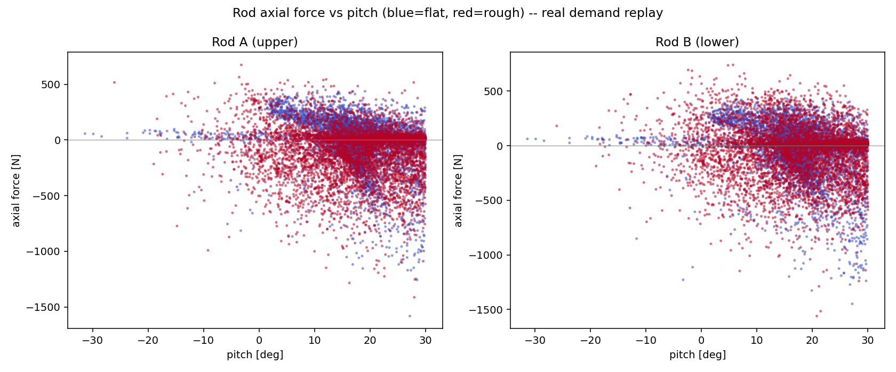

### §11f Q5 — swing_foot 고려 전/후 비교 (완료 1시드, 목표 30)

| | swing_foot 포함(base, n=83) | swing_foot 제외(noswingfoot, n=13, 목표30) |
|---|---|---|
| score | **−168.5%**(infeasible) | **+36.6%**(FEASIBLE) |
| torque | +10~23% | +36.6% |
| tn | +26~42% | +51.3% |
| rod | +67~68% | +74.2% |
| swing_foot(참고치) | −168~−335%(binding) | −206%(참고만, 목적함수 제외) |
| peak군(torque_pk 등) | 대부분 음수(위반) | **전부 양수**(feas) |
| 기하 | RP_r/A_h→35 하한, B2RP/RP_h→상한 pinned | RP_h→**−10 하한**(반대쪽!)·A_h→45 상한 |

**핵심 인사이트**: swing_foot을 빼면 (a) score가 −168.5%→+36.6%로 **약 205pp 개선** — 이 205pp가 사실상 전부 swing_foot 하나가 만들어내는 비용이다. (b) 다른 모든 항목(torque/tn/rod/peak군)은 swing_foot 유무와 무관하게 **애초부터 여유가 충분**했다(base에서도 이미 양수) — swing_foot이 "제일 빡빡한 제약" 정도가 아니라 **사실상 유일한 infeasibility 원인**임을 정량 확인. (c) swing_foot을 빼자 RP_h가 반대 극단(−10, 하한)으로 이동 — swing_foot이 없으면 최적기하 자체가 완전히 다른 방향(RP_h 부호 반전)으로 바뀐다는 뜻으로, swing_foot이 단순히 "여유를 깎아먹는" 게 아니라 **최적해의 구조 자체를 결정**하고 있었다. n=30까지 확인 후 최종화.

### §11g 남은 작업

n=100/100/100/30 도달 시: (1) §11b~§11f 표를 최종 통계로 갱신, (2) 3D 렌더+영상 최신 기하 반영, (3) 두 언어(영/한) 최종 리포트 아티팩트 갱신. 스윕은 백그라운드에서 계속 진행 중(§0 로그: `mujoco-sim/mjlab/analysis/logs/sweep/`).

---
[[57_rotary_linkage_knee_precedents]] · [[56_humanoid_impact_fall_load_handling]] · [[60_fourbar_optimizer_research]] (방법론 공통 원류)

## §12 ★마운트 자유도(프리틸트) — swing_foot 지표 정정 + 저측굴곡 ROM 실사용 (2026-08-13)

### §12a 사용자 지적: "중립(RP 0°)에서 요동각 0°여야"

맞는 지적. v3의 `swF = arccos(|u·footN|)`은 **발바닥 법선을 마운트축으로 고정** 가정 — 실제로는 볼스터드 장착 방향이 자유 설계변수다. 옳은 제약: 발 프레임에서 ROM 전체에 걸친 로드 방향 다발(부채)을 담는 **최소 외접원뿔 반각** ≤ 요동한도. 마운트 방향 = 원뿔 중심축 선택일 뿐이라 DE 변수 추가 없이 지표만 바꾸면 된다. `A_h=RP_r` 구속은 중립의 횡성분 정렬만 만드는 부분해(§11 Q2에서 성능중립 확인)로 불필요.

base 100시드 최적점(s5000)에서 정정 계산: 로드A 필요원뿔 **41.6°**(마운트 발법선에서 9.2° 틸트), 로드B **43.4°**(14.7°) — 구지표 50.6/53.7° 대비 ~9–10° 회수. 그러나 한도 20°의 2배대로 결론(불가) 유지. 중립자세 방향은 원뿔 중심에서 13–20° 벗어남(pitch ROM 비대칭 −50~+30 탓) — "중립에서 0°" 장착이 오히려 준최적.

### §12b 저측굴곡(발끝 내림) 실사용 — 정책·G1 실기 모두 거의 안 씀

| 데이터 | pitch<0° | <−10° | <−20° | 최심 |
|---|---|---|---|---|
| 정책 flat | 1.28% | 0.46% | 0.077% | −31.4° |
| 정책 rough | 3.15% | 0.39% | 0.011% | −26.1° |
| G1 실기 | (규약 상이) 한쪽 밴드 폭 ~27° | — | 0.87% | −26.6° |

저측굴곡 중 |τp| 중앙 5–15 N·m(낮음). **HW 캡 −50°는 학습데이터 근거 없음** — −35°로 줄여도 관측범위(−31°) 커버.

### §12c 저측굴곡 캡 축소 → 필요원뿔 (마운트 최적, 배굴 +30·roll ±20 고정, s5000 기하)

−50°→43.4° / −35°→34.7° / −25°→30.5° / −15°→26.6° / −10°→24.8° — **전부 ✗(>20°)**. 배굴 +30 + roll ±20만으로 이미 ~25° 필요(부채 반폭 ≈ pitch 스팬/2 × (1−RP_B/L) + roll 기여, RP_B≪L이라 기하로 상쇄 불가). **결론: 마운트 프리틸트 + ROM 트림을 다 합쳐도 20° 미달 — 발측 S조인트 유지로는 불가. 발측 U조인트(원뿔한계 소멸) 또는 요동 35°+ 광각 스터드 필요**(딥리서치 Q4 진행중). 요동한도는 사용자 확정 **20°**(JS6 13° 탈락).

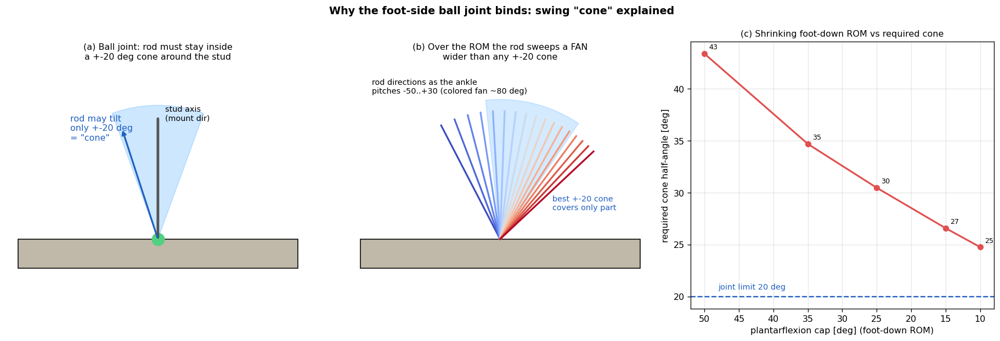

계산: s5000 기하 v3 규약 IK 재현 + 최소외접원뿔(반복 최소포위), `docs/mujoco/assets/ankle_cone_explainer.png`.

## §13 ★★★ 최종 판정 — 수직 20° 제약 확정 + 크랭크 분기(φ0) 숨은제약 발견 + 발측 S조인트 불가 (2026-08-13)

### §13a 사용자 확정 제약
광각 볼스터드 불가 · 요동각 **20° 고정** · **수직 설치만**(스터드⊥발바닥). → §12의 마운트 프리틸트 자유도 소멸, v3의 `swF=arccos(|u·footN|)`(발법선 고정축)이 그대로 옳은 지표로 복귀.

### §13b 크랭크 분기 숨은제약 발견 (φ0=180 하드코딩)
v1~v3의 IK 분기 선택(`pick = |wrap(s−π)|` 최소)과 중립크랭크 윈도우(180°±75°)가 **크랭크가 앵커 반대쪽(φ≈180°)을 향하는 패밀리만** 탐색하도록 고정하고 있었다. 크랭크를 앵커 쪽(φ≈0°)으로 향하면 핀 y=+r이 앵커 y=RP_B에 근접해 **로드가 수직에 가깝게 매달리는데, 모멘트팔(|Ty|=r)·전달비는 동일**하다. 동일 기하 손계산: 중립 요동 23~40°→9~11°, [−10,+30]×±15 박스 최대 요동 58.5→35.1°. 워크플로 적대검증(§13e)도 독립적으로 "±75° 윈도우는 근거 없는 재도입 숨은규칙"으로 지적(감사 계보: A_h=RP_r 해제→로드길이 자유화→ax트림→**φ분기**). 구현: `ankle_opt_de_v5_romscan.py`(argv[7]=φ0).

### §13c 3중 증거 — 발측 S조인트(수직 20°)는 어떤 ROM 박스로도 불가
1. **해석적 하한 스캔**(신규, `swing_floor_scan.json`): 기하를 요동각 최소화에만 바치고(토크 무시, 전달비≥0.3만 유지, φ0=0 패밀리) 36개 ROM 박스 전수 DE — **전부 >20°**. 최소는 [−10,+25]×±10의 22.6°(이 박스는 배굴 사용 중앙값 +19·P99 +42를 거의 커버 못함). 하한은 배굴캡·roll에 지배(배굴 +5°당 약 +4°, roll ±5°당 약 +3°), 저측굴곡 트림은 거의 무효.
2. **DE 교차검증**: v5 [−10,+30]×±15 → 필요 28.8°(해석 하한 28.8°와 일치, 토크마진 +19% = 요동각 단독 병목). 구패밀리 v4 동일 박스는 50.7° — φ0=0으로 21.9° 개선해도 20° 미달.
3. **워크플로 검증단 예측**(§12c 데이터 기반): "사용을 커버하는 어떤 박스도 수직 20° 불가, U조인트가 증거상 1순위" — 계산으로 확정됨.

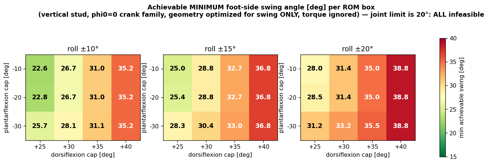

### §13d 판정
> **발측 볼조인트(요동 20°·수직 설치)로는 2-RSU 발목이 성립하지 않는다(ROM 축소·기하 최적화·크랭크 재배치 전부 소진). 설계 방향 = 발측 U조인트(십자핀) 전환 — 원뿔한계 개념 소멸, 로드 스핀은 크랭크측 S가 흡수(정통 RSU 위상). 이 구성의 기대 성능은 이미 측정되어 있음: noswingfoot 100시드 스윕 = 전 항목 feasible, 최소마진 +36.6%.** 상세 명세·감사 36건·프로세스 게이트는 [[72_ankle_2rsu_objective_spec_and_direction]].

### §13e 목적함수 감사(워크플로, 6에이전트 3렌즈)
critical 8 · important 20 · minor 8 = 36건(기구/최적화/sim-to-real). 핵심: fcp(푸시) 데이터 미포함(P99 9~18% 과소), 지형 풀링 P99 금지(자체 독트린 위반), PEN 사각(死角) 임계값, tn_pk NOCLIP 누락, tn_pk_g1이 속도만 검사, 극값풀 6열 미포함, det/arm 0.1% 무단 드롭, 전달비 하한 0.3→스톨유도 0.45, C0 단일상수(크랭크측 JS계 미확인), H7/H8 간섭 Tier-0 누락, 스토퍼 pad-path 미검증 전제, ROM 스크리닝의 pro-shrink 편향(재학습·재측정이 freeze 게이트). 전체 목록·수정지시는 docs/72 §5.

## §14 ★★★ 사용자 하드 결정(JS6 ±20°·수직) + 수요풀 v4 확장 + ROM 공동설계 프런티어 (2026-08-13)

### §14a 결정 (사용자, 최종)
**발측 = JS6 로드엔드, 요동각 +20~−20° 하드, 수직 설치, 광각 불가. §13d의 U조인트 방향은 기각** — 대안 위상 제안 중단 지시. 문헌(docs/73)상 ±20은 카탈로그 천장(FK HIN-T 18~24°)이며, "베어링 원뿔이 ROM을 캡"하는 선례 존재(MIT 의족 27°). 남는 설계 자유도 = **ROM 축소 + 정책 재학습**.

### §14b 수요풀 v4 (사용자 지시: 2런→전체 이력)
`v4_ankledemand_20.json` — **13정책·25파일·221,650샘플**(구 18,152의 12.2배): 전 교정 프로토콜(_fc/_fcp 15s dwell) 측정 포함. 제외: **cant\*(사용자 지시)**, p2f\*(낙상 109/609회 — 부하 오염, docs/66 §9), p2r v1(지형혼합 59.7% 버그, v2로 대체), 구 2.4s-dwell 세대 전부(프로토콜 무효). 빌더 `analysis/build_ankle_demand_v4.py`, 컬럼 [qp,qr,tp,tr,wp,wr,terrain,push,polid]. **감사 critical이던 fcp(푸시) 부재·측정 시드 단일성 해소**(p2r_v2는 2시드).

### §14c 플릿 사용분포 — 배굴 과사용은 정책 일반 특성
13정책 전부 pitch P99 +40~44, **P50 +20**(크라우치 보행이 배굴을 인간 보행 최대치 +10~15°의 2배로 상시 사용). pitch<0° 5.2%, |roll|≤10° 94.9%. 즉 ±20 요동한도 적합을 위한 ROM 축소는 "덜 쓰는 영역 자르기"가 아니라 **자세 재학습**(배굴 중앙 +20→+10대, 직립화 — 인간형 보행 방향과 정합)을 요구.

### §14d ±20° 프런티어 (80박스 세밀 스캔, `swing_floor_fine.json`)
요동각만 최소화(수직·φ0=0·전달비≥0.45)한 달성 하한: **≤20° 최대 박스 ≈ pitch [−15,+22]×roll ±8(19.3°) / [−15,+20]×±10(18.9°) / [−5~0,+20]×±12(19.6°)**. 민감도: 배굴캡 +5°→하한 +4°, roll ±2°→+1~1.5°, 저측굴곡은 −20까지 거의 무영향. roll ±15 전멸, 배굴캡 +24 이상 전멸. 플릿 커버리지 47~52%(최저: rough 계열 28~35%).

### §14e v6 스크리닝 DE (감사 반영판) — 후보 4박스 전부 feasible
`ankle_opt_de_v6_romscan.py` = v5 + 감사수정(지형×push 4그룹 P99 worst-of·6열 극값풀·tn_pk NOCLIP·폐합 100% 강제·전달비 0.45·G1 제외·φ0=0). 확장풀 전 제약 최종(160gen 수렴): **4박스 모두 전 개체군(80/80) feasible** — [−15,+20]×±10 p99마진 **+5.71%**(swF 18.9°/20, torque P99 마진 15%·tn 42%·rod 75%), [−20,+20]×±8 +3.92%, [−15,+22]×±8·[−10,+22]×±8 +3.57%. 최적기하 공통 pinning: A_r→65(캡)·RP_B→50·B2RP→170·RP_h→+10. ⚠피크층(best-effort): torque_pk −11~−19%(fcp 포함 확장풀의 단일프레임 피크가 60 초과·G1 미검증), tn_pk 센티널(sim 속도 아티팩트 ω>19.8) — 둘 다 effort-81 재학습·재측정에서 재판정. **스크리닝 판정: JS6 ±20 설계는 ROM [−15,+20~22]×±8~10에서 성립. freeze는 재학습·재측정 후 v6 재실행**(pro-shrink 편향 게이트, docs/72 §6).

## §15 ★★★ 요동각 축 정정(사용자, 이미지) — full ROM 성립, ROM 축소·재학습 결론 철회 (2026-08-13)

### §15a 정정 내용
사용자 지적(RSU CAD 이미지): 발측 JS6는 **클레비스 볼트 = 발 좌우(lateral)축**으로 체결 — 요동 원뿔은 +Z(발법선)가 아니라 **볼트축 기준**. 로드엔드는 볼트축 주위 회전 무제한(= **pitch 추종 자유**), ±20°는 볼트 직각면 이탈(**로드의 좌우 기울기**)에만 적용. 옳은 지표: **swF = arcsin(|u·x̂_foot|) ≤ 20°** (x̂_foot=R@(1,0,0)=(cr,−sp·sr,−cp·sr)). §13~§14의 수직원뿔(arccos|u·footN|) 모델은 **오류** — 그로부터 나온 "전 박스 불가", "ROM [−15,+20] 축소", "자세 재학습 필수" 결론 **전면 철회**. (§13b φ0 분기 발견·§14b 수요풀 v4·감사 수정은 유효 유지.)

### §15b 정정 지표 재평가 — 병목은 pitch가 아니라 roll
s5000(구 100시드 최적) 그대로 full ROM(pitch −50~+30): roll ±20 → **19.7°(통과, +1.7%)** · ±15 → 14.7°(+26%) · ±10 → 9.8°. 크랭크측 1.1~1.5°. pitch는 애초 제약 아님.

### §15c v7 재최적화 (정정 지표 + v6 파이프라인 + 221k 풀, 160gen 수렴)

| 케이스 | p99 최소마진 | latF | torque P99 | tn | rod | peak tq |
|---|---|---|---|---|---|---|
| **full × roll ±15 (φ0=0)** | **+27.6%** | 14.5°/20 | +29% | +48% | +75% | **+7% (피크까지 커버)** |
| full × roll ±20 (φ0=0) | +3.8% | 19.2°/20 | +7% | +36% | +68% | −16% |
| full × roll ±20 (φ0=180) | +3.6% | 19.3°/20 | +4% | +30% | +62% | −29% |

±15 최적기하: A_r 61.2 · B_r 61.7 · RP_B 57.1 · **RP_r 46.7 ≈ A_h 45.0**(횡 정렬 — 정정 지표에서 A_h≈RP_r가 비로소 유효해짐, §11 Q2의 "성능중립"은 구지표 산물) · B2RP 175.7 · RP_h 9.8 · A_L 275.1 · B_L 174.3. φ0 분기는 pitch 자유화로 영향 미미(3.8 vs 3.6).

### §15d 로드 양단 트위스트 적합성 (신규 진단)
로드 스핀 1자유도가 상단(볼트=월드 x)·하단(볼트=발 x̂) 로드엔드를 동시 만족해야 함. 양단 볼트축 투영의 상대각 Δψ 범위 vs 결합 여유(각단 20°−요동) 점별 검사: ±15 승자 Δψ ±11.8°·최소 여유차 **+18.6°** OK / ±20 승자 ±16.9°·**+11.3°** OK. 조립 트위스트 τ0≈0°(자연 조립).

### §15e 판정
> **JS6 ±20(클레비스 좌우볼트)로 현행 full ROM(pitch −50~+30 × roll ±20)이 성립한다(+3.8%). roll을 ±15로 줄이면 마진 +27.6%에 피크층까지 양수 — 기존 계획인 PYG_ANKLE_ROLL15(±15) 실험이 곧 마진 확보 수단**(플릿 |roll|≤15 사용 98.6%라 손실 미미). 확인 잔여: ①CAD에서 볼트 방향=발 좌우축 확정 ②freeze 게이트(재학습·재측정 후 v7 재실행)는 유지(docs/72 §6).

## §16 확정 박스(v8) 결과 — 사용자 재확인 반영 최종 스크리닝 (2026-08-13)

박스 재확인(사용자): **B2RP 200~220 복원 · RP_h −10~+10 승인 · B2RP+RP_h ≤ 230 · p2f는 aux 태그(최적화 제외·참고 전용)** → 풀 v41(14정책·27파일·237,702샘플), `ankle_opt_de_v8_romscan.py`.

| 케이스 | p99 최소마진 | latF | torque | tn | rod | trans | peak tq |
|---|---|---|---|---|---|---|---|
| **full × roll ±15 (φ0=0)** | **+27.43%** | 14.5°/20 | +28% | +47% | +72% | +35% | **+3%** |
| full × roll ±20 (φ0=0) | +3.45% | 19.3°/20 | +11% | +39% | +67% | +4% | −8% |
| full × roll ±15 (φ0=180) | +2.26% | 16.1°/20 | +2% | — | — | — | −28% |

**±15 승자 기하**: A_r 55.0 · B_r 57.7 · RP_B 52.2 · RP_r 39.5 · A_h 38.2 · **B2RP 200.0(하한 pinned — 원지정 복원 비용 +27.57→+27.43%로 사실상 0)** · RP_h 10.0 · A_L 301.1 · B_L 199.4. φ0=0 패밀리가 확정적으로 우세(±15에서 +27.4 vs 180패밀리 +2.3). 프로세스 잔여는 docs/74 §6-5~7(roll 결정→재측정→freeze).
