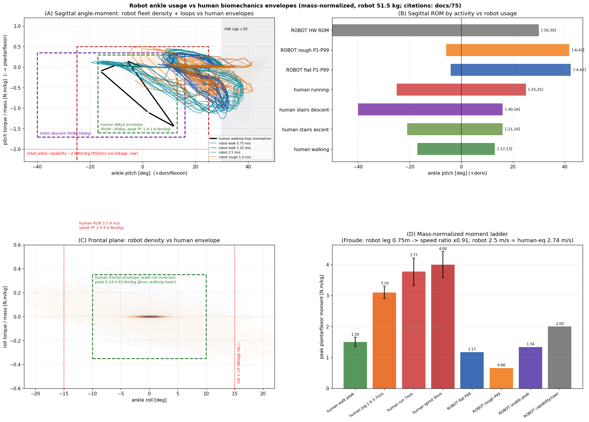

# 75. 인간 발목 생체역학 vs 우리 로봇 실측 — 겹침·정렬성 검토 (2026-08-13)

> 사용자 요청: "사람의 뛰고 걷고 다양한 행동의 ROM·힘을 확인, 우리 실험 데이터와 스케일링해 겹침 시각화 — 학습 결과가 feasible한지/정렬됐는지." 딥리서치(105 에이전트, 3표 적대검증 전건 통과) + v41 풀(14정책 237,702샘플·51.5 kg 질량 정규화) + 원시 50Hz 시계열 루프. 그림: `mujoco/assets/ankle_human_overlap.png`, 로봇측 데이터 `robot_ankle_human_cmp.npz`.

## §1 인간 봉투 (검증 통과 수치·출처)

| 활동 | 시상 각도 | 피크 저측굴곡 모멘트 [N·m/kg] | 출처 |
|---|---|---|---|
| 보행(자유속) | 기능적 ROM ~30°(배굴 +10~15 / 저측굴 −14~−20 at toe-off 60~62%) | ~1.4–1.6 | Shamaei 2013(PLOS ONE)·Brockett&Chapman 2016·Winter/Perry 교차 |
| 보행 루프 준강성 | 배굴상 246±98 N·m/rad(≈3.6/kg, R²96%)·저측굴상 202±53 | push-off 일 ~0.25 J/kg | Shamaei 2013 (26명 216시행) |
| 계단 오르기/내리기 | ROM 37° / **56°**(내리기 저측굴 최대 ~−40°) | ~보행급 | Brockett 2016·Protopapadaki 2007·Riener 2002 |
| 달리기 3.5→9 m/s | 배굴~+25/저측굴~−25 | **2.94→4.00** (midstance) | Schache 2011 |
| 레저 조깅 2.6–3.7 m/s | — | ≈2.9–3.3 | Schache·선호속도 데이터 |
| 스프린트 스탠스 평균 | — | 1.6–1.8 **지속**(보행 피크 이상을 상시) | 곡선주로 스프린트 연구 |
| 관상면(=roll) 달리기 | — | 인버전 0.24→0.63 (jog→sprint, 시상의 8–16%) | Schache 2011 |
| 정규화 규약 | N·m/kg + Froude v*=v/√(g·l₀) | 로봇 다리 0.75 m → 속도비 ×0.91 (2.5 m/s ≒ 인간 2.74 m/s) | Fukuchi 2018·Hof 1996 |

공개 규준 데이터셋(커브 원자료): Fukuchi 2018(8속도 보행)·Bovi 2011(7과제)·Lencioni 2019 — 추후 루프 원곡선 오버레이 가능. 주의: 해부학적 총 ROM(65–75°) 류 주장은 검증에서 **기각**되어 미사용.

## §2 겹침 판정 — 세 축

### ✅ 힘(토크)은 인간 보행급 안, feasible
- 시상: 플릿 P99 **1.17 N·m/kg**(flat)/0.66(rough), usable peak ~1.34 — 인간 **보행 피크(1.4–1.6)의 73~84%** 수준, 달리기(2.9+)에는 크게 미달. 기구 공급능력(~2.0 raw)은 보행 봉투를 여유로 덮고 조깅 하한에 못 미침 → **"보행급 발목"으로 일관** (설계·수요·인간 보행이 정렬).
- 관상: 로봇 0.19–0.43 N·m/kg — 인간 달리기 인버전 봉투(0.24–0.63) **안쪽** ✅. roll ±15 권고와 사용(|roll|≤15 98.6%)도 정합.

### ⚠ 각도 사용은 인간과 "반전"됨 — 정렬 불량 2건
1. **배굴 과사용**: 플릿 중앙 +20°/P99 +42° vs 인간 보행 배굴 최대 +10~15°. 크라우치 자세가 배굴을 상시 점유 — 인간이라면 계단 오르기에서나 닿는 각도를 평지 보행 내내 사용.
2. **push-off 결핍**: 인간 toe-off 저측굴 −14~−20°를 로봇은 거의 안 감(−10° 이하 사용 0.4~0.5%). 각도-모멘트 평면에서 인간 루프의 "push-off 꼬리"가 로봇 밀도에 비어 있음 — 기존 toe-off 연구 계보(§docs/62 자연보행 스택)와 일치하는 진단.

### 판정 요약
> **Feasible? 예** — 토크·속도(Froude 환산 포함)·관상면 모두 인간 보행 봉투와 기구 능력 안. **정렬? 절반** — 힘 스케일은 인간 보행과 정렬됐지만, 각도 사용은 "배굴 시프트 + push-off 없는" 크라우치 시그니처로 인간 패턴과 다름. 이는 결함이라기보다 현 보상 스택의 알려진 특성(무릎굽힘 보행)이며, 개선 방향은 이미 큐에 있는 자연보행 스택(클록 게이팅·toe-off 3단, docs/62)과 정확히 일치. **발목 기구 설계 관점에선 문제 없음**: HW ROM(−50~+30)이 로봇 사용(P99 +42는 sim 캡 +40 시절 관성 — 캡 +30 하드웨어에선 재학습 필요, docs/71 §7j)과 인간 활동(계단 내리기 −40 포함)을 모두 덮고, JS6 ±20 검증(v8)도 이 ROM 전체 기준.

## §3 설계에의 함의
1. **ROM −50~+30 유지 타당**: 인간 활동(보행+계단+달리기 준비)과 로봇 사용을 모두 커버. 저측굴곡 −50는 인간 계단 내리기(−40)까지 여유.
2. **roll ±15 권고 재확인**: 인간 관상 사용·모멘트와 정합, 사용 98.6% 커버, v8 마진 +27.4%.
3. **토크 사이징 적정**: RS03×2(공급 ~2.0 N·m/kg)는 "보행 전 영역+계단" 커버, 달리기(2.9+)는 비목표로 명시적 제외됨을 확인.
4. 자연보행(인간형) 개선 시 수요는 배굴 사용 ↓·push-off 저측굴 ↑ 방향으로 이동 — 발목 수요 재측정 시 각도 분포가 인간 루프 쪽으로 이동하는지가 정렬 지표.

---
리서치 원문: 워크플로 `wf_cf44ac0e-8c3` journal(105 agents). [[71_ankle_2rsu_optimization_setup]] · [[74_ankle_2rsu_process_spec]] · [[62_policy_reward_design_review]](자연보행 차기스택)

## §4 정책별 각도–토크 라인 프로파일 (2026-08-13 추가, `ankle_policy_profiles.png`)

14개 정책 각각 pitch/roll 빈별 라인(피치: 스탠스 가지 P10 실선·중앙값 희미선 — 빈 중앙값은 스윙 0토크가 희석하므로 스탠스 비교는 P10이 옳음; 롤: P90). 소견: ①스탠스 깊이 P10 −0.65~−1.01(정상 정책) vs 인간 피크 −1.45 — 전 정책이 인간보다 얕음 ②**스탠스 피크 위치가 대부분 +33~+39°(크라우치 심부하)** vs 인간 +12° — 플릿 공통의 배굴 시프트 시그니처(개별 정책 차이는 깊이 위주) ③p2f(낙상오염, 회색 파선)만 −1.30@−9°로 이질적 — 제외 판정의 타당성 재확인 ④롤 프로파일은 인간 관상 봉투 내.

**부호 정합 재확인**: 로봇 +pitch = 발끝 위(FK: +20°에서 전방 지오메트리 +46mm 상승, §71-17d) = 인간 배굴(+) — **같은 방향으로 정렬되어 겹침**. 모멘트 부호도 일관(양쪽 다 배굴 자세에서 저측굴곡근 모멘트 음수, 같은 사분면). 과거 §9의 기구모델 pitch 부호 버그는 수정 완료된 상태이며 v41 풀은 로봇 관절 qpos를 직접 읽음.

## §5 실측 인간 커브 5소스로 교체 (2026-08-13, 사용자 지적 반영)

§2의 손그림 근사 루프(Shamaei 준강성 파라미터 기반)를 폐기하고, **공개 데이터셋 5곳의 실측 게이트사이클 커브**(총 231명)로 재작성 — `refs/human_gait/*_ankle.csv`(+메타 JSON, 수집 워크플로 wf_d5c7d6dc-2ce, 부호·타당성 검증 통과):

| 소스 | n | 속도 | 피크 저측굴곡근 모멘트 | 각도 범위 |
|---|---|---|---|---|
| Lencioni 2019 (Sci Data) | 48 | 1.21 m/s | 1.25 N·m/kg | −22.7~+8.8° |
| Fukuchi 2018 (PeerJ) | 42 | 1.27 | 1.41 | −11.8~+13.5° |
| Moissenet 2019 (raw c3d 역동역학 직접계산) | 48 | 1.16 | 1.23 | −17.0~+9.8° |
| Camargo 2021 (GaTech) | 10 | 1.20 | 1.48 | −9.5~**+21.2°** |
| Schwartz 2008 (아동 83) | 83 | free | 1.23 | −19.8~+11.8° |

그림 `ankle_human_loops_real.png`. 실측 반영 후 판정 갱신: ①실측 피크는 1.23~1.48(교과서 1.4~1.6보다 약간 낮음) — **로봇 보행 1.25 m/s 스탠스 깊이(−1.26)가 인간 실측 밴드 안** ②각도 영점규약이 소스별로 달라(입위 오프셋 차감 여부 등) 인간 커브끼리도 배굴 피크가 +8.8~+21.2°로 벌어짐 — Camargo(+21)는 로봇 사용대역과 부분 중첩, 즉 **로봇 배굴 시프트는 여전히 실재하나 §2의 서술보다 정도가 완만** ③push-off 결핍(인간 전 소스가 toe-off에서 −9~−23° 저측굴곡, 로봇은 −10° 미만 희소)은 실측으로도 그대로 확정.
