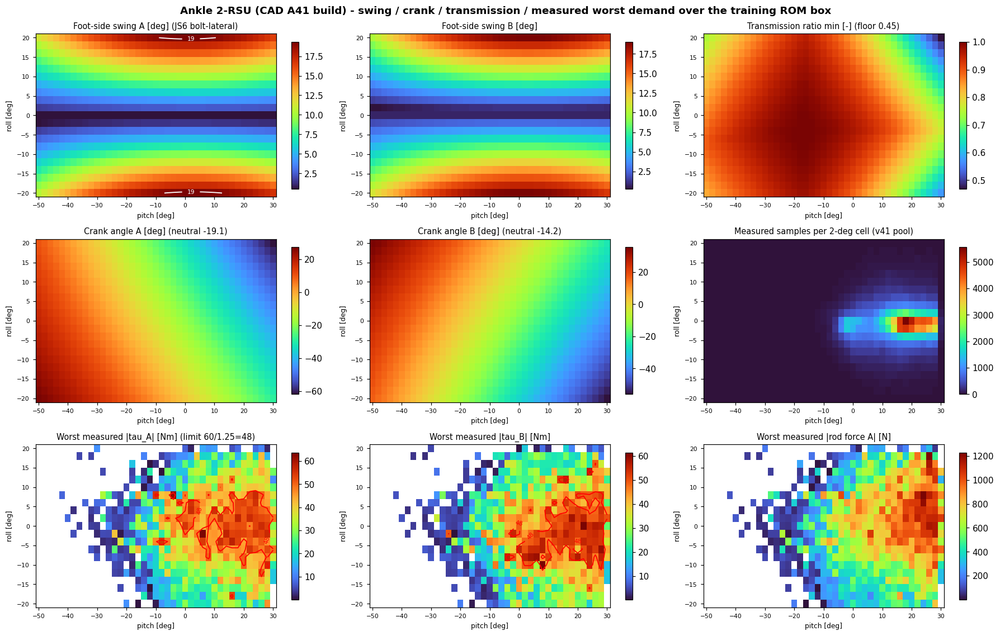
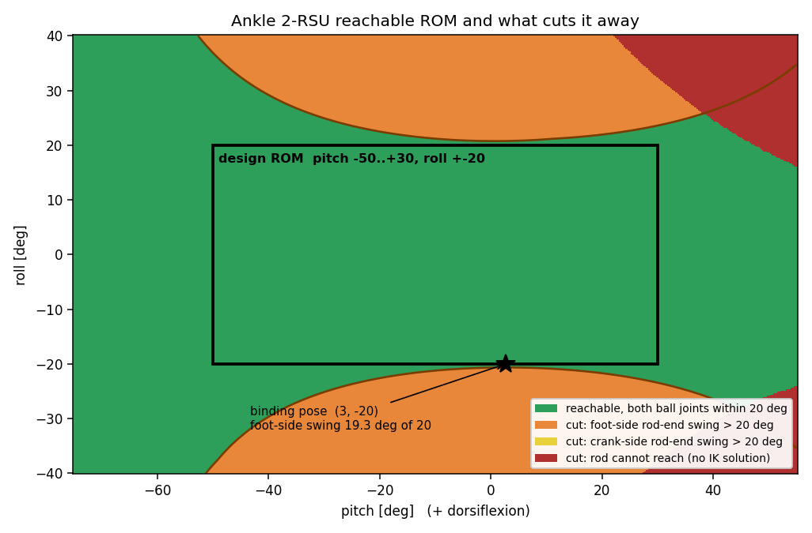
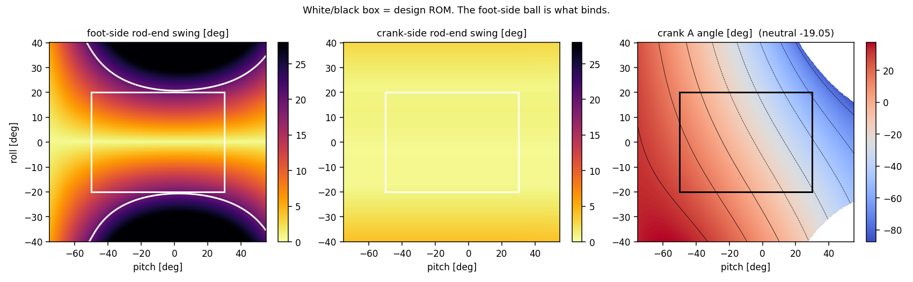
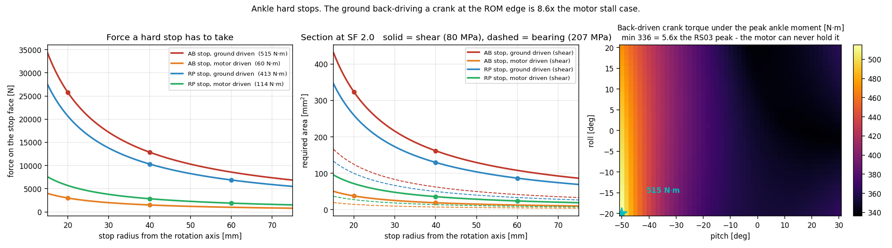

# 76. Ankle 2-RSU 확정 설계 요약 — 파라미터·참고조건·시각화 (2026-08-13, **rev2: v9 = A_h>40·인간 커버리지 반영**)

> 뒤앵커·설계 ROM(roll ±20) 기준 스크리닝 확정안. freeze 절차(재측정→v8 재실행→CAD 게이트)는 [[74_ankle_2rsu_process_spec]] §6. 이력·검증 전말은 [[71_ankle_2rsu_optimization_setup]] §13~§17i.

## §1 설계 파라미터 (v9h2 승자 · 사용자 제약 A_h>40·RP_B≤60 · 인간 보행 커버리지 포함)

| 파라미터 | 값 | −1pp 공차 | 파라미터 | 값 | −1pp 공차 |
|---|---|---|---|---|---|
| A_r | **65.0** | ±0.2(캡 pinned) | B2RP | **200.0** | ±0.5 |
| B_r | **62.0** | ±1.2 | RP_h | **10.0** | 7.5~10 |
| RP_B(뒤) | **50.5** | ±0.2 | A_L | **289.1** | ±0.5 |
| RP_r | **43.8** | ±0.8 ★ | B_L | **193.3** | ±2.0 |
| A_h | **41.2** | ±1.0 ★ | n0A/n0B | −19°/−16° | — |

**마진(±20)**: p99 **+3.41%** — binding ①roll 요동 19.3/20 ②**human 커버 +4%**(실측 5소스 보행 루프 76.4 N·m 피크 ×1.25) ③torque +14% · tn +39% · rod +68% · trans +4%. ⚠공차가 전반적으로 타이트(총마진 3.4%의 구조적 결과) — **roll ±15 채택 시(v9h15: +23.5%) 마진·공차 모두 대폭 완화**. 구 v8 기준(A_h 35.2/RP_r 37.5, +3.45%)은 §1-구판으로 대체됨 — A_h>40 비용은 0.04pp.

### §1-구판 (v8, A_h 제약 前 — 참고)

| 파라미터 | 값 | 공차(feasible·−1pp) | 비고 |
|---|---|---|---|
| A_r (상단 크랭크 반경) | **65.0** | −0/+캡 | 사용자 캡 65에 pinned — 하향 민감 |
| B_r (하단 크랭크 반경) | **62.4** | ±6.5 | 여유 큼 |
| RP_B (앵커 앞뒤, **뒤쪽**) | **50.0** | 46~50 | 박스 하한 pinned |
| RP_r (앵커 좌우) | **37.5** | **±0.8** ★정밀관리 | roll 요동각 binding 직결 |
| A_h (크랭크핀 좌우) | **35.2** | **±1.0** ★정밀관리 | 〃 (RP_r와 연동) |
| B2RP (B모터축~RP) | **200.0** | −0/+3.8 상실 | 박스 하한 pinned |
| RP_h (앵커 높이 오프셋) | **10.0** | 7.5~10 | 전 시드 고착 |
| A_L (상단 로드) | **287.1** | +10/−0 | 길어지는 쪽 관용 |
| B_L (하단 로드) | **194.4** | ±7.5 | |
| (파생) 중립 크랭크각 | n0A **−20.9°** / n0B **−14.7°** | 창 −19~−9° | 하향 필연(§17g-3: 토크 레버) |
| (파생) 조립 트위스트 τ0 | ~0° | 여유 +11.2° | 양단 로드엔드 자연 조립 OK |

**달성 마진**(p99 최소 **+3.45%**): 발측 요동 19.3°/20(binding) · 크랭크측 요동 ~1° · 토크 P99 +11% · T-N +39% · 로드력 +67%(P99 1.10 kN, 스탠스 **인장 92%**) · 전달비 +4%. 피크층(best-effort): rod +74% / torque −8%(sim 클립 잔재·재학습 후 재판정). roll ±15 채택 시 별도 승자(+27.4%, docs/71 §16)로 교체.

## §2 설계에 쓴 참고조건

**고정 입력**: A2B=100 · RS03×2 직결(실측 T-N 60→12.6→0@19.8) · JS6 로드엔드 요동 ±20°(발측 클레비스 볼트=발 좌우축, 볼트회전 자유 — arcsin 좌우기울기 지표) · ROM pitch −50~+30(+=배굴, FK검증)×roll ±20 · 위상(A=상단, 좌우대칭, A_h=B_h, 공용 RP_B/RP_h, 크랭크면=시상면, φ0=0 분기=크랭크가 앵커 쪽).

**박스**(사용자 확정, 2026-08-13 v9 개정): 크랭크 40~65 · **RP_B 50~60** · RP_r 35~50 · **A_h 40~45** · B2RP 200~220 · RP_h −10~+10 · B2RP+RP_h≤230 · 로드 자유.

**데이터**: v41 풀 + **인간 보행 커버셋**(refs/human_gait 5소스 455점, ×51.5kg, ×1.25 SF — T0 하드)·v41 풀 = 교정 프로토콜(_fc/_fcp) 측정 전부 — **14정책·27파일·237,702샘플**(cant 제외·p2f aux 참고전용·p2r-v1 중복제외). 지형(flat/rough)×push(fc/fcp) 4그룹 P99 각각→최악값(풀링 금지), 피크풀 6열 top-2000 극값보존, 클립(|τp|≥89.5) P99유지·피크제외.

**목적함수**(Deb 사전식): T0 hard(폐합 100%·요동 20·토크 P99×1.25≤60·T-N 모터링·로드 P99×1.875≤C0·전달비 0.45) → T1 피크 best-effort → T2 P99 최소마진 최대화. 검증: 18시드(스코어 폭 0.2pp)·정역학 교차검증(0.001 N·m)·트위스트 적합성·FK 부호검증.

**한계(freeze 전 재확인)**: 구정책 리플레이 스크리닝(재학습·재측정이 게이트) · H7 간섭/H8 물리성립은 CAD 게이트 · 크랭크측 JS6 C0 카탈로그 확정 필요.

## §3 시각화 카탈로그 (`docs/mujoco/assets/`)

**확정 설계(r20 기하) 상태**
- `ankle_v8_winner_kin.png` — 등축 3D(중립+pitch·roll 극단) + 전 기구학 도달범위/요동컷 맵
- `ankle_v8_winner_drives.png` — 모터 A/B 분리 T-N 산점 + 토크·속도 분포(J⁻ᵀ 변환)
- `ankle_v8_winner_capacity3d.png` — (pitch,roll)→토크 능력 서피스+실측 scatter
- `ankle_reach_global_r20winner.png` — ±180×±90 전역 도달범위(회색=폐합불가 경계)

**최적화 검증**
- `ankle_v8_seed_analysis.png` — 18시드 평행좌표·수렴·1D 프로파일 / `ankle_v8_pca_v2.png` — 시드별 초기→궤적→최종 PCA-3D + 로딩·붕괴비

**설계 트레이드 연구**
- `ankle_crank_elevation_fine.png`·`_shapes.png` — 앙각 스윕+앙각별 중립형상 / `ankle_mirror_experiment.png` — 앵커 전후 거울상 실험

**인간 정렬** — `ankle_human_loops_real.png`(실측 5소스 231명)·`ankle_human_overlap.png`·`ankle_policy_profiles.png`(정책별 14선)

**인터랙티브** — `tools/wrench_studio/static/crank_torque_player.html`(독립실행: 3D 플레이어·계산사슬·요동각·feasibility·공급 평행사변형·R-P-T 3D scatter) · `ankle.html`(설계기)

**폐기 이력 보존(구지표)** — `ankle_cone_explainer.png`·`ankle_swing_floor_heatmap.png`(수직원뿔 오모델 시기, docs/71 §13~14)

---
[[71_ankle_2rsu_optimization_setup]] · [[74_ankle_2rsu_process_spec]] · [[75_human_ankle_alignment]] · [[73_2rsu_ankle_literature]]

## §4 사용자 CAD 도면 대조 (2026-08-13, Fusion 파라미터 캡처 기준)

CAD 현값: A_L 287·B_L 194.4·AB_r 65(공용)·RP_AB_L(=RP_B) 50·A2B 100·AB_h 40·B2RP 200·RP_h 10·RP_r 37.5.

| 평가(±20, v9 기준) | p99 | 위반 |
|---|---|---|
| **CAD 현재** | **−3.34% 불성립** | ①roll 요동 **20.4°/20**(RP_r가 A_h 상향을 미추종 — 횡정렬 연동 파괴) ②**human −3%**(로드 길이가 구 A_h=35.2용이라 인간 피크 76.4×1.25에서 모터 ~62>60) |
| v9 완전최적 | +3.35% | — |
| **CAD 친화 수정안**(A_h=40.0·AB_r=65 공용 유지, 4개만 변경) | **+2.87%** | — (공용 크랭크 비용 0.5pp) |

**CAD 수정 4개**: `ankle_RP_r` 37.5→**42.0** · `ankle_RP_AB_L` 50→**51.5** · `ankle_A_L` 287→**289.1** · `ankle_B_L` 194.4→**191.0**. (완전최적을 원하면 B_r 62.0·A_h 41.2·RP_r 43.8 세트 = §1 표.)

## §5 "왜 이 값이 최적인가" — 레드팀 검증판 (2026-08-13, 워크플로 wf_4bc46f76: 3렌즈 독립 프로브)

**핵심 구조 (✅확정)**: v9 최적점은 **3중 제약 코너** — roll 요동 19.32°/20(+3.4%) ∧ 전달비 **0.471**/0.45(+3.8%) ∧ 인간 커버(+4.1%)가 0.65pp 안에서 만나고 나머지는 ≥9pp 여유. (초안의 "전달비 0.457"은 오기 — 레드팀 정정.)

| 파라미터 | 왜 이 값인가 (검증 후) |
|---|---|
| RP_r 43.8 · A_h 41.2 | **횡 오프셋(A_h−RP_r)이 진짜 놉** — 둘을 같이 ±2mm 움직이면 요동각 보존(0.0329~0.0341), 한쪽만 움직이면 −1.9pp (✅공동섭동으로 확정). 단 RP_r은 전달비도 강하게 끌고 다님(+2 → trans 0.3%로 추락) — **A_h가 순수 횡 놉, RP_r은 혼합** (초안 수정) |
| A_r 65 (캡) | +2 → 전달비 +8.9pp지만 **인간커버 즉시 불성립**(−4.5pp/2mm, +1.8mm에서 위반); −2 → 전달비 붕괴(−13.2pp). 캡 완화해도 **이득 ~0** (아래 C3) |
| B_r 62.0 (내부) | 초안의 "기울기 상쇄 정류점"은 **오류** — 실제는 **양쪽 한방향 절벽 사이에 낀 점**: +2 → 인간커버 절벽(−3.2pp, trans 불변), −2 → 전달비 절벽(불성립) (레드팀 수정) |
| RP_B 50.5 | 하한 근방이 **무제약 최적과 일치**([199.5,200.1] 플래토의 B2RP와 유사) — 아래로도 위로도 인간커버/전달비가 나빠짐 |
| B2RP 200 (하한) | **하한이 무제약 최적과 일치** — 200 아래로 가면 오히려 악화(인간커버 1.68%로 binding), 202는 전달비 불성립. "박스가 막아서 200"이 아니라 "200이 최적이라 200" (레드팀 정정) |
| RP_h 10 (캡) | 올리면 요동·인간 개선, 전달비 −5.3pp/mm 급락(10.7에서 0) — **캡의 그림자가격 <0.03pp = 사실상 무비용** |
| A_L 289.1 · B_L 193.3 | 폐합 종속 + 전달비·인간커버 코너 위치 결정. A_L 민감(±0.5): 289.1→289.0 라운딩만으로 −0.4pp(+2.48%) — **Fusion 파라미터는 289.1 그대로 입력 권장**(가공공차와 별개) |

**기각된 내 주장 (레드팀 C3, high)**: "박스를 완화하면 1~4pp 더 얻는다" → **틀림**. 세 pinned 경계의 그림자가격 ≈ 0: A_r>65 이득 없음(인간커버 절벽), B2RP<200은 오히려 악화, RP_h 캡 <0.03pp. **코너를 만드는 것은 사용자 박스가 아니라 인간커버·전달비 절벽 자체** — 박스를 넓혀도 마진을 못 삽니다. (이전 보고의 "박스가 없었으면 더 갔을 방향" 서술 정정.)

**설계리뷰 항목 1건 (C5)**: 전달비 하한 0.45(스톨 유도)는 코너의 한 벽. 0.30으로 낮추면 구조는 풀리지만 **헤드라인 마진은 그대로**(~3.4%, 요동각이 min) — 단 **RP_h 캡을 12로 함께 올리면 ~4.1%** 도달 가능. "전달비 하한 ↔ RP_h 캡"은 쌍으로 재검토할 것.

## §6 시각화 최종 (영상 포함)


- **영상** `ankle_v9_rom_sweep.mp4` (24s): v9 기하 pitch −50~+30 → roll ±20 → 복합 8자 스윕, 크랭크각·요동각(/20)·전달비 실시간 오버레이, 등축.
- 상태 3종(§3): `ankle_v8_winner_kin/drives/capacity3d.png`(현 기준기하로 재생성됨) · 전역 도달맵 · 검증 5종(18시드·PCA·앙각·거울상·인간정렬) · 인터랙티브 플레이어.

## §7 미완 항목 감사 (2026-08-13 마감 시점)

✅방금 폐합: v9h2 41×21+코너 정밀그리드(865/865·요동 19.32/20·전달비 0.471) · 트위스트(여유 +11.2°).

| # | 항목 | 성격 | 차단자 |
|---|---|---|---|
| 1 | **roll ±20 vs ±15 결정** (마진 3.4↔23.5%) | 최적화 분기 | PYG_ANKLE_ROLL15 학습검증 — Windows sshd 복구 or 로컬 |
| 2 | **freeze 재측정** (재학습 정책 fc+fcp·지형분리·멀티시드·스토퍼 플래그) — 현 결과는 구정책 스크리닝 | 검증 | 재학습(effort 81 번들 포함) |
| 3 | H7 간섭 (로드–정강이/로드–로드/크랭크–발등 캡슐 근사) | 미구현 제약 | freeze판 코드 추가 예정 |
| 4 | H8 물리성립: 클레비스 볼트방향=발 좌우축·RP_h 스택·요크 ROM·~~스토퍼 패드 경로~~ | CAD 확인 | 사용자 CAD — **스토퍼 하중·단면 요구는 정량 종결**(docs/78 §13: 롤 짐벌 반경 ≥60 mm·전단 ≥87 mm², 크랭크측은 로드엔드 $s_0$ 0.52로 금지). 남은 건 CAD에서 **발↔정강이 패드 경로 확보 여부**뿐 |
| 5 | 크랭크측 JS6 C0 카탈로그 확정 (현 가정 3kN, P99×1.875=2.06kN — 가정이면 마진 얇음) | 부품 데이터 | 카탈로그/실측 |
| 6 | 피크층 torque_pk 음수(−6%) = sim 클립 검열 잔재 | 데이터 | effort-81 재학습으로 원천 제거 |
| 7 | T-N 제동(회생) 사분면 미검사 (모터링만) | 미구현 제약 | RS03 회생 커브 확보 |
| 8 | 준정적 가정 (로드·크랭크 관성/마찰 미반영) | 모델 단순화 | 부품 질량 확정 후 보정 |
| 9 | 전달비 하한 0.45 ↔ RP_h 캡 10 쌍 재검토 (+0.7pp 여지) | 선택적 최적화 | 사용자 결정 |
| 10 | φ0 {0,180} 이산 동시최적·freeze 다중시드(현 2시드) | 마무리 최적화 | freeze 단계 |
| 11 | 인간 커버셋: 보행만 (계단 토크커브 미포함 — ROM은 커버) · 평균커브+×1.25 가정 | 데이터 범위 | 선택적 확장 |

## §8 미결 정리 라운드 2 (2026-08-13 저녁, 사용자 회신 반영)

1. **✅ roll ±20 최종 확정**(사용자) — ±15 옵션 폐기. 설계 마진 +3.41%가 확정값. §7-1 종결.
2. **✅ 크랭크측 JS6 C0 확정**(사용자 카탈로그): **510 kgf = 5,003 N** — 코드 가정 C0=5000 N이 정확했음. 로드 P99×1.875=2.06 kN → **s0=2.43** 여유. §7-5 종결. ⚠카탈로그 요동각도 열은 JS6=13° — 설계는 사용자 하드지정 ±20° 기준(개조/실측 근거로 이해, CAD 게이트에서 재확인 항목).
3. **✅ H7 간섭 스크리닝**(v9h2, WS 전역·중심선 기준): 로드A–B 최소 81.6mm(클리어런스 ~64mm) · 로드–정강이축 반경 ≥50.2mm/횡 ≥38.5mm → **CAD 요구치: 정강이 실폭(z 80~400 구간)이 반경 41mm(횡 ±29.5mm) 이하**면 무간섭 · 크랭크핀 z 147~330(발 구조물과 원거리) · 앵커 z −46~+42(정강이 하단 80까지 38mm, 발바닥 −60까지 14mm). 정밀 판정은 STEP 수령 시.
4. **전신 CAD STEP 분석 가능**(사용자 질문 회신): OCC 기반 파서로 좌표·축방향·클리어런스 측정 예정 — H8 게이트(클레비스 볼트방향·RP_h 스택·요크 ROM·스토퍼 패드)와 H7 정밀판정을 실CAD로 수행.

## §9 CAD STEP 실측 검증 (2026-08-14, `refs/Huphy_1.0_STEP/Ankle2Feet.step`, OCP 파싱)

원통면 385개 서베이로 측정 (스크립트 세션 기록·짐벌중심 = 십자핀 베어링 원통 교점):

| 항목 | CAD 실측 | 설계 기대값 | 판정 |
|---|---|---|---|
| **클레비스 볼트축** | **x = 로봇 좌우축** (앵커 4점 모든 원통 axis-x) | 발 좌우축 (스펙 전제) | ✅ **H8 핵심 확정** |
| RP 짐벌 중심 | (−123.7, 145, −800) — pitch축=x(r5/r7 핀)·roll축=y(r4.3) | — | ✅ 위상 일치 |
| 모터축 방향·위치 | A/B 모두 axis=x, z=−500/−600, y=145(RP와 정렬) | 크랭크면=시상면·y=0 정렬 | ✅ |
| A2B / B2RP | 100.0 / 200.0 | 100 / 200 | ✅ |
| RP_h | 10.0 (앵커 z −810 vs RP −800) | 10.0 | ✅ |
| RP_h 스택 | 볼중심이 발바닥(−843) 위 33mm | 클레비스 스택 공간 | ✅ |
| A_h | 40.0 (핀 x ±40 vs 중심선) | 40.0(CAD안) | ✅ |
| A_r / B_r | **65.0 / 65.0** (핀-축 반경 실측 65.03) | 65/65(CAD안 공용) | ✅ |
| 중립 크랭크각 | **n0A −20.9° / n0B −14.3°** (핀 위치 역산) | −20.9/−14.7(v8 예측) | ✅ 예측 재현 |
| 앵커 위치 | y=195 = RP 뒤 50.0 / 좌우 ±37.5 | RP_B 51.5·RP_r **42.0** (수정안) | ⚠ **미수정** |
| 로드 길이 | 287.0 / 194.4 (볼중심 간 실거리) | **289.1 / 191.0** (수정안) | ⚠ **미수정** |

**결론**: ①H8 게이트 3건(볼트방향=좌우축·RP_h 스택·위상/축 정렬) **CAD로 확정** ②STEP은 §4의 4개 수정(RP_r 42.0·RP_B 51.5·A_L 289.1·B_L 191.0) **적용 전** 상태 — 현 기하는 −3.34% 불성립 판정 그대로이므로 Fusion 파라미터 수정 필요 ③로드엔드 부품 = JMC JS6 확인(볼 r8=Ø15.8·볼트 M6). 잔여: 짐벌 요크 ROM·스토퍼 패드(형상 판독 필요), H7 정밀(로드 스윕 vs 정강이 실형상 — 요청 시 수행), FullBody.step(230MB)로 무릎·힙 확장 가능.

## §10 CAD v2 실측 검증 + 실모델 인터랙티브 뷰어 + 가동각 폐형식(Fusion) (2026-08-14)

### §10a 업데이트 STEP 검증 — A41 변형안 완전 반영 ✅

사용자가 Ankle2Feet.step을 갱신(31솔리드, 전 부품 명명: `Crank_A/B`·`Arm_A/B`·`Inner Ball`×4·`AnkleUniversalJointCore`·`20deg_flange`×4 등). OCP 재측정(볼 구면중심·크랭크 보어축·UJ코어 중심):

| 항목 | CAD 실측 | A41 목표 | 판정 |
|---|---|---|---|
| RP중심 C | (−123.70, 145.00, −800.00) | — | 기준점 |
| 앵커 좌우/전후/상하 | ±43.60 / +50.50 / −10.00 | RP_r 43.6·RP_B 50.5·RP_h 10 | ✅ |
| 크랭크 피벗 | x ±41.0, z +300/+200 | A_h 41·B2RP 200·A2B 100 | ✅ |
| 크랭크 반경 | A 65.00000 / B 62.00000 | 65.0 / 62.0 | ✅ 정확 |
| 로드 길이(볼중심간) | A 289.00000 / B 195.00000 | 289.0 / 195.0 | ✅ 정확 |
| **중립 크랭크각** | **φA −19.0530° / φB −14.2424°** | 예측 −19.0530/−14.2424 | ✅ <1e-4° |

§9의 "미수정" 항목 전부 해소 — **CAD 기하 = 최적화 기하 완전 일치**. 특기: 요동각 ±20°를 **커스텀 `20deg_flange`** 로 구현(카탈로그 13° 이슈의 설계적 해결 확인).

### §10b 실모델 인터랙티브 뷰어 — `http://<workstation>:8091/ankle_cad_viewer.html`

실 CAD 메시(36.5k 삼각형, 7개 기구학 그룹)로 전 자세 구동:
- **자세**: pitch/roll 슬라이더·코너 프리셋·요동최대(p+2,r−20)·ROM 스윕 애니메이션
- **AR 배지**: 볼조인트 4개 요동각(발측=JS6 볼트횡편차 지표·크랭크측, >19° 적색), 모터 A/B 크랭크각+**ROM 호**(3D 원호+현재 틱), RP p/r
- **힘 오버레이**: v41 실측풀(185,850행, NOCLIP·aux제외) 2°빈 최악수요 — τA/τB(×1.25 대 60 게이지)·로드 축력(인장 적/압축 청 화살표+로드 착색), 해당 셀 샘플수 표기
- **Roll-Pitch 맵**(클릭=자세 이동): 요동각 4종·크랭크각·전달비·실측 τ·로드힘·샘플수 12필드
- **자체검증 내장**: 로드 시 JS 폐형식 vs Python 그리드 대조(0.005° ✓)·매 자세 로드길이 폐합오차 표시(≤0.008mm)

정적 요약 그림(9패널): 

### §10c 크랭크 가동각 폐형식 — Fusion 파라메트릭용 (기계정밀도 검증)

**일반식**(도출: 로드 구속 |w−T|=L을 크랭크 평면에 사영, IK와 오차 2.8e-14°):

$$\varphi(p,r) = \arctan\frac{E_z}{E_y} + \arccos\frac{E_y^2+E_z^2+r_c^2-(L^2-D_x^2)}{2\,r_c\sqrt{E_y^2+E_z^2}}$$

앵커 월드좌표 $w = R_{pitch}(p)R_{roll}(r)\,(RP_r,\ RP_B,\ -RP_h)$, $D_x = w_x - A_h$, $E_y = w_y$, $E_z = w_z - A_z$ ($A_z$ = B2RP+A2B(모터A) / B2RP(모터B)). **분기는 항상 +acos**(박스 전역·300 랜덤설계 무예외), $E_y>0$(min 28.2mm)이라 atan2 불필요 — Fusion `atan` 안전. **미러 항등식**: 모터B(p,r) = 모터A식에 B파라미터($B_r$,$B_L$,$A_z$=B2RP) 대입 후 roll 부호 반전.

**가동각(코너 지배 — 0.25° 전수 그리드로 확인)**:

| 파라미터 | 값 | 지배 자세 (p, r) |
|---|---|---|
| ankle_phiA_neutral | **−19.05°** | (0, 0) |
| ankle_phiA_max (+가동) | **+27.18°** (중립+46.2°) | (−50, −20) |
| ankle_phiA_min (−가동) | **−61.87°** (중립−42.8°) | (+30, +20) |
| ankle_phiB_neutral | **−14.24°** | (0, 0) |
| ankle_phiB_max (+가동) | **+35.41°** (중립+49.6°) | (−50, +20) |
| ankle_phiB_min (−가동) | **−55.93°** (중립−41.7°) | (+30, −20) |

(φ 기준: 크랭크핀이 피벗에서 +y(뒤/앵커쪽) 수평일 때 0°, 위로 +.)

**Fusion 단일식 6종**(파라미터명 사용자 파일 그대로: ankle_RP_r/ankle_RP_AB_L/ankle_RP_h/ankle_AB_h/ankle_B2RP/CONS_ankle_A2B/ankle_A_r/ankle_B_r/ankle_A_L/ankle_B_L; 각도상수는 `deg` 단위 표기, 검증오차 ≤7e-15°) — 전문은 `docs/fusion_ankle_phi_expressions.md` 수록. 대표(모터A 중립, p=r=0 단순화):

```
ankle_phiA_neutral = atan((-ankle_RP_h - (ankle_B2RP + CONS_ankle_A2B))/ankle_RP_AB_L)
 + acos((ankle_RP_AB_L^2 + (ankle_RP_h + ankle_B2RP + CONS_ankle_A2B)^2 + ankle_A_r^2
        - (ankle_A_L^2 - (ankle_RP_r - ankle_AB_h)^2))
        /(2*ankle_A_r*sqrt(ankle_RP_AB_L^2 + (ankle_RP_h + ankle_B2RP + CONS_ankle_A2B)^2)))
```

용도: 파라미터 변경 시 크랭크 장착각(중립)과 ±가동각이 CAD에서 자동 갱신 — 모터 배선/하네스 간섭 검토, 스토퍼 각도 설계에 직결.

### §10d 뷰어 수요 통계층 + "힘 모자란 부분" 감사 (2026-08-14 밤, 사용자 질문)

**뷰어 확장**: Roll-Pitch 맵에 ①토크 통계층 분리(|τA|·|τB| × RMS/P99/Peak, T-N util P99/Peak) ②실측 샘플 scatter(그룹별 토글: flat-fc/flat-push/rough-fc/rough-push, 그룹당 2,500 임베드) ③**모터 한계선**(주황 ≥48=60/1.25 설계선·빨강 ≥60=RS03 피크, T-N은 0.8/1.0) ④초과 프레임 전수 링 표시(>48 N·m 또는 util>1, 345개 임베드) ⑤셀 정보에 pk/P99/RMS(정격 20 대비)/T-N util 병기.

**"최적화 제대로 한 거 맞나" — 전체 풀(185,850행) 감사 결과**:

| 지표 | 값 | 판정 |
|---|---|---|
| 하드 제약: 그룹별 P99×1.25 | flat-fc 46.2 · **flat-push 48.6** · rough-fc 32.4 · rough-push 22.4 | **전 그룹 ≤60 성립**(최악 마진 +19%) |
| 피크 \|τ\|>60 프레임 | **4개 (0.002%)** — 전부 flat(1 fc/3 push), 최악 63.6 | T1 best-effort 층(하드 아님) — 설계 의도대로 |
| >48(설계선) 프레임 | 325 (0.17%) | scatter 링으로 뷰어 표시 |
| T-N 커브 초과(util>1) | 21 (0.011%) + 속도초과(≥19.8rad/s 모터링) A2/B10 | 고속 순간 갭 — RS04 무릎 갭과 동계열 |
| 열(RMS vs 정격 20) | A 9.1 / B 9.1 N·m | 46% — 여유 큼 |

**해석**: 히트맵에서 보이는 "모자란 부분"(빨간 셀·링)은 **Peak 층의 단발 최악 프레임 4개**이고, 설계 스펙(docs/62 확정 원칙: 순시 설계값=in-DR P99, 극단 프레임은 사이징 기준이 아닌 계층스택)에서 피크는 T1 best-effort로 의도적으로 하드 제약이 아님 — v9h2 peakScore −6%로 기록돼 있었음. 실HW에서 이 프레임들은 모터 포화→순간 추종오차로 나타남(4/185k). **peak-hard로 재최적화 원하면 PEAKK를 T0로 승격해 v9 재실행 가능** — 단 P99 마진·요동각·휴먼 커버와 트레이드되며 docs/62 원칙 변경이므로 정책 결정 사항.

## §11 설계 ROM과 실제 커버리지 — 제약별 절단 영역 (2026-08-17, 사용자 요청)

`tools/ankle_rom_map.py`. 기구학은 §10c 폐형식 그대로이고, **그리기 전에 §10a의 중립
크랭크각을 재현하는지 자기검증**한다(통과: 0.05° 이내). 사용한 기하는 **CAD 실측값**
(RP_r 43.6 · A_h 41.0 · A_r 65 · B_r 62 · A_L 289.0 · B_L 195.0 · B2RP 200 · A2B 100 ·
RP_B 50.5 · RP_h 10) — §1의 v9h2 최적화 행은 0.2~1.7 mm 달라 중립각을 재현하지 못하므로
ROM 진술의 근거로는 **as-built 값**을 쓴다.

### §11a 커버리지 맵 — 무엇이 어디를 자르는가


*그림. 가로 pitch(+=배굴), 세로 roll. **검은 박스가 설계 ROM**(pitch −50…+30 × roll ±20).
초록 = 도달 가능하며 볼조인트 4개가 모두 20° 이내. 주황 = **발측 로드엔드 요동 20° 초과**로
잘린 영역. 빨강 = 로드가 닿지 못하는 영역(IK 해 없음). 노랑(크랭크측 요동)은 **화면에
나타나지 않는다** — 크랭크측은 어디서도 한계에 닿지 않는다. 별표가 박스 안 최악 자세
(pitch +3, roll −20)이며 발측 요동 **19.3°/20**이다.*

**설계 박스는 100 % 커버된다**(미달 셀 0). 절단선은 박스 바깥에 있고, 유일하게 닿는 곳이
roll 가장자리다.

### §11b 세 필드 — 왜 발측 볼조인트만 문제인가


*그림. 왼쪽: 발측 요동각. **거의 순수하게 |roll|의 함수**(수평 띠)이고 흰 선이 20° 한계다.
가운데: 크랭크측 요동각 — 설계 박스 안 **0.61~1.10°**(한계 20°의 3~6 %), 그려진 전 스윕
(pitch −75…+55 × roll ±40)에서도 최대 **4.13°**다. 오른쪽: 크랭크 A 각도,
중립 −19.05°에서 박스 안 +27…−62°를 훑는다.*

발측이 지배하는 이유는 기하다 — 발측 클레비스 볼트가 **발의 좌우축**이라 볼트 회전은 자유고
제한은 **좌우 기울기(arcsin 성분)** 에만 걸리는데, roll이 바로 그 성분을 직접 키운다.
반면 크랭크측 볼은 크랭크면(시상면) 안에서 움직여 좌우 성분이 거의 생기지 않는다.

### §11c pitch별 실제 사용 가능 roll

좌우 두 분기 중 **구속측(min)** 을 적는다 — 별표 찍힌 binding 자세가 roll 음수쪽이라
+roll 분기만 보면 최대 0.24° 낙관이 된다.

| pitch [°] | +roll | −roll | **구속측 max\|roll\|** | 설계 ±20 대비 |
|---|---|---|---|---|
| −50 | 36.90 | 38.48 | **36.90** | **+16.90** |
| −40 | 29.18 | 29.68 | 29.18 | +9.18 |
| −30 | 24.94 | 25.16 | 24.94 | +4.94 |
| −20 | 22.50 | 22.62 | 22.50 | +2.50 |
| −10 | 21.20 | 21.24 | 21.20 | +1.20 |
| **0** | 20.76 | 20.70 | **20.70** | **+0.70** |
| +10 | 21.10 | 20.86 | 20.86 | +0.86 |
| +20 | 21.94 | 21.72 | 21.72 | +1.72 |
| +30 | 23.60 | 23.46 | 23.46 | +3.46 |

좌우 roll 대칭성 편차는 최대 1.6°(2-RSU가 완전 대칭이 아니라 A/B 로드 길이·반경이 다르기 때문).

**핵심**: ROM은 직사각형이 아니라 **중립 pitch 부근이 잘록한 모래시계**다. 배굴/저굴로 갈수록
roll 여유가 늘고, **pitch 0 근처에서 최소 20.7°**까지 좁아진다. 설계 박스가 이 잘록한 목을
스치듯 지나가므로 **박스 내 최악 여유가 0.68°(3.4 %)** 다 — docs/76 §1의 "마진 +3.41 %,
binding = roll 요동 19.3/20"과 같은 결론이며, 이 맵은 그 마진이 **어디에서** 소진되는지를
보여준다.

**설계 함의**: roll을 ±15로 낮추면(§1의 v9h15 권고) 이 목이 여유 구간 안으로 들어가
마진이 +23.5 %로 뛴다. 반대로 roll ±20을 유지하려면 **RP_r/A_h 공동 섭동**(§5: 횡 오프셋이
진짜 놉)이나 요동각 25° 로드엔드가 필요하다.

---

## §12 하드 스토퍼 — 설계값 요약 (2026-08-17, 사용자 요청)

**유도·검증 전문은 [[78_ankle_stopper_derivation]] §12~§14**(같은 문서 §8·§9가 기구학·접촉좌표).
여기엔 설계값과 판정만 싣는다.



*좌: 스토퍼 반경별 접촉면 하중. 중: SF 2.0 요구 단면적(실선=전단, 파선=베어링).
우: 설계 ROM 전역에서 설계 스톱모멘트가 역구동하는 크랭크 토크 — 최소값조차 RS03 피크(60)의
**최소 336.3 N·m** — RS03의 **1초 과부하** 60 N·m의 5.6배, **연속 스톨 정격 13 N·m**(`Motor_Spec/RS03_overload_stall.csv`)의 **25.9배**다. 스토퍼를 버티는 것은 스톨 조건이므로 비교 기준은 13이고, **모터로는 캡 하중을 지탱할 수 없다**(하드 스토퍼는 선택이 아님).*

### §12a 하중 기준 (확정)

스토퍼가 받는 것은 관절모멘트 전체가 아니라 **모터가 만들지 않은 몫**
$M_{stop} = M_{constraint} - \tau_{motor}$ 이고, **관절이 캡에 닿아 있는 프레임만** 골라 잰다.
현행 수요풀 **31 롤아웃**(rough + 전 `*_fc`/`*_fcp`) × L/R, 전 프레임, §8i 기준점 보정:

| 축 | **설계 peak(구조 단면)** | 최악 출처 | 상시 P99(듀티) | 최악 출처 | 캡 접촉 최악 / 중앙 |
|---|---|---|---|---|---|
| **pitch** | **379.0 N·m** | bent_fcp / L | 172.5 | flat25p1_fcp / R | 9.5 % / **4.0 %** |
| **roll** | **164.2 N·m**† | (peak 153.8 p2b_v2_fc / L) | 82.1 | flat25p1_fcp / L | 7.7 % / **0.25 %** |

† docs/65 §5 **과부하층 `max(peak 상한, P99×2)`** — 원 peak 단독 사이징은 금지(±47 % CI·클립).
pitch는 peak가(379.0 > 345.0), **roll은 P99×2 = 164.2가 지배**(> peak 153.8).

⚠**각 열은 서로 다른 롤아웃이다 — 곱해 읽으면 안 된다.** 172.5를 내는 flat25p1_fcp/R의 캡 접촉은
**3.84 %**이고, 9.5 %를 내는 gen21r1_fc/L의 상시 P99는 **46.4**다. **피로 판정에 쓸 동시 페어**
(같은 롤아웃·같은 채널)는 pitch **172.5 N·m @ 3.84 %** / **102.1 @ 7.64 %**(gen2p1_fcp/L),
roll **82.1 @ 0.27 %** / **31.3 @ 6.49 %**(rough/R)다.

⚠**roll 캡 접촉은 지형 조건부다** — 중앙값 0.25 %이고 상위는 전부 `p2r_*`/`rough`,
flat gen21은 0.01~0.08 %다. "상시 하중"은 **pitch에만** 확실히 성립한다.

⚠**포락은 구세대 정책이 지배한다** — peak 379.0은 bent_fcp(init-pose A/B 실험), P99 172.5/82.1은
flat25p1_fcp(P1·no-DR, 발목이 pitch −85.7°/roll −112.1°까지 가는 낙상 계열)에서 나온다.
현세대 gen21만 쓰면 pitch P99 6.8~46.4 / peak 21.8~148.0, roll 2.1~26.4 / 2.4~105.3 — **2~10배 차이**.
docs/62 최악조건 프로토콜(수렴·in-DR·멀티시드) 재측정 전까지 **보수측을 채택**한다.

★**스토퍼는 abuse 부재가 아니라 상시 하중 부재다** — 관절이 시간의 7.7~9.5 %를 캡에 붙어 있다
(docs/64 §8k "상시 접촉", docs/72 §3d 경고와 일치). 정적 강도 외에 **피로·마모** 판정이 필요하다.

⚠**선행 두 기준은 모두 틀렸다** — docs/64 §8e(pitch peak 1056)는 §8i 기준점 버그 포함(→ docs/64에
경고 추가), 총 관절모멘트(152.1)는 과소(충격 시 제약모멘트와 모터토크가 반대 부호 + 소스가
왼다리·서브샘플). 상세는 docs/78 §12a.

### §12b 요구 단면적 (6061-T6, SF 2.0 — 전단 80 MPa / 베어링 207 MPa)

| 스토퍼 / 구동원 | 토크 | 반경 | 접촉면 힘 | **A(전단)** | A(베어링) |
|---|---|---|---|---|---|
| AB 크랭크, 지면 구동 | 515.1 N·m | 40 mm | 12,879 N | 161.7 mm² | 62.2 mm² |
| AB 크랭크, 모터 스톨 | 60.0 N·m | 40 mm | 1,500 N | 18.8 mm² | 7.2 mm² |
| **✅롤 짐벌, 지면 구동 ← 채택** | **413.0 N·m**† | **60 mm** | **6,884 N** | **86.5 mm²** | 33.3 mm² |
| ├ pitch 면 단독 | 379.0 N·m | 60 mm | 6,317 N | 79.3 mm² | 30.5 mm² |
| └ roll 면 단독 | 164.2 N·m | 60 mm | 2,737 N | 34.4 mm² | 13.2 mm² |
| 롤 짐벌, 모터 구동(양 피크) | 113.7 N·m | 60 mm | 1,896 N | 23.8 mm² | 9.2 mm² |

전단이 항상 지배($A=F/\tau_a$). 반경에 반비례하므로 **스토퍼를 바깥으로 빼는 것이 단면을 키우는
것보다 싸다**.

### §12c ★ 판정 — 롤 짐벌 스톱, 크랭크측은 금지

docs/78 §8이 기구학으로 이미 내린 결론(**롤 짐벌 스톱 필수·충분**, 100 % ROM 유지)에
구조 근거가 붙는다: 크랭크 스톱이 사건을 받으면 **로드엔드가 먼저 깨진다**.

$$F_{rod} = \frac{443.4\times10^3}{46.1} = 9{,}620\ \text{N}
\quad\Rightarrow\quad s_0 = \frac{C_0}{F} = \frac{5003}{9620} = \mathbf{0.52}$$

(최악은 크랭크 B, pitch −50 / roll +20. 레버는 크랭크 반경이 아니라 크랭크축→로드 **직선**의
수직거리 **46.1 mm** — 반경 62 mm를 쓰면 26 % 과소.) JS6 정격을 **1.9배 초과**하고,
docs/64 §8k의 연성리밋 관통(17.7~23.3°)을 감안하면 **하한**이다.

**권고**: 롤 짐벌 = **발↔정강이 직접 접촉 패드**(십자핀 커플 경로 금지, docs/64 §8e),
반경 **≥60 mm** · 전단 유효면적 **≥87 mm²** · 우레탄 범퍼(Shore 90A) + 금속 하드스톱 2단.
크랭크 스톱은 모터 스톨 전용이며 **롤 짐벌 스톱보다 나중에 닿아야** 한다.

> $s_0$ 기호 주의: §8-2는 $s_0 = C_0/(P99\times1.875) = 2.43$(P99층), 여기는
> $s_0 = C_0/F_{event}$(사건 하중 직접)다. 1.875 = 1.25×1.5는 **P99층 계수**이고
> 피크/abuse 하중의 문턱이 아니다 — 병기 시 분모를 밝힐 것.

### §12d ★ 최대 미결 — 설계 ROM에서는 스토퍼의 성격이 바뀐다

sim의 pitch 캡은 **+40**, 설계 ROM은 **+30**이다. 학습된 보행이 설계캡을 넘는 프레임은
**최악 33.0 % / 중앙 16.6 %**(62 채널 전 프레임 실측). 설계캡 +30을 실제로 걸면 pitch 스토퍼는
4~9 % 듀티 부재가 아니라 **프레임의 1/6~1/3 동안 하중을 받는 상시 구조부재**가 되고,
본 절의 정적 판정 프레임 전체가 마모·연속접촉 해석으로 대체돼야 한다.
**따라서 §12는 ①설계캡을 +40으로 올리거나 ②+30 캡으로 재학습·재측정하기 전까지 잠정**이다.
(roll은 설계 ±20 = sim ±20이라 해당 없음.) 상세 docs/78 §13c.

그 외 미결: 에너지 기반 범퍼 사이징($\tfrac12 I\omega^2$) 미착수 · 접촉면 피로·마모 미판정 ·
구세대 정책 포함 포락(gen21만 쓰면 2~10배 완화) · 스토퍼 굽힘 미포함. 전체 표는 docs/78 §14.
