# 77. 구조해석(FEA) 검증 + 경량화(살빼기) 워크플로 — 리서치 검증판 (2026-08-14)

> 딥리서치 104 에이전트, 3표 적대검증 통과분만 수록(11건). 원문: 워크플로 `wf_dc7992a2-295` journal. 대상: CNC 알루미늄 6061/7075(+Ti 일부) 하지 부품, Fusion 360 설계, STEP 보유, 하중은 실측 리플레이 렌치(docs/64 §10.2b LC-1~4, P99×1.25).

## §1 도구 선정 (검증된 사실 기반)

| 경로 | 능력 | 비용/제약 | 판정 |
|---|---|---|---|
| **Fusion 360 Simulation** | 정적·모달 + **좌굴 스터디 존재**(선형 고유치, BLF/모드, 정적 스터디 복제로 생성) | **Personal 라이선스 제외**; 상용 기본 = 로컬 선형정적+모달만, 좌굴은 토큰/Simulation Extension | 보조(이미 상용 보유 시) |
| **PrePoMax 2.5.0 + CalculiX** ★권장 | STEP 임포트+Netgen/Gmsh 메시·정적·**선형좌굴**·모달·동적·**볼트 프리텐션(2-step 문서화)**·마찰 접촉·**CLI 배치**(`--regenerate --showGui No --parameters "a=..;b=.."`) | 무료 오픈소스. ⚠Windows 앱(셋업은 Windows PC에서, ccx 솔버는 리눅스 배치 가능) | **주력 검증 도구** |
| **Fusion Generative Design** | 살빼기 품질·CAD 통합 최상 | **Generate 1회 = 11 토큰**(실패 시만 환불) or Simulation Extension(~$1.6k/yr) 무제한 | 살빼기 옵션 A(부품당 소액) |
| **PyTopo3D** (arXiv 2504.05604) | 오픈소스 3D 위상최적화 — STL 설계영역/장애물 임포트, STL 출력(스무딩 포함) | compliance 최소화만(응력제약 없음) | 살빼기 옵션 B(무료) |
| ToOptix (FreeCAD/Blender) | — | **2019년 이후 방치, FreeCAD 0.17 고정 — 현 환경 불능** | ❌ 제외 |

## §2 검증(Phase 1) 절차 — 부품별

1. **하중**: docs/64 LC-1~4 (P99×1.25 XYZ 동시케이스) 그대로 — "MBD 리플레이 렌치→FEA 하중"은 표준 방법론(RecurDyn→ANSYS류 선례, 3-0 검증). 재료 안전계수 **×2**(관행: 하중 1.2×재료 2 스택 — 우리는 하중측이 P99×1.25로 이미 반영).
2. **경계조건은 어셈블리 기준**(3-0): 고립 부품+등가하중은 Saint-Venant 왜곡(연결면 최대응력 과대·최소 과소). 인접 부품 포함해 자르고 실제 볼트/베어링 자리로 하중 전달 — 사례상 최적화 결과도 10.4% 더 가벼워짐.
3. **판정 기준**: von Mises ≤ 항복/2 (6061-T6 276MPa→138, 7075-T6 503→251), 처짐은 기능 기준(베어링 시트 변형 < 끼워맞춤 공차), 볼트는 프리텐션 2-step 모델링.
4. **푸시로드 좌굴**: 스탠스 인장 92%(docs/76)라 1차 위험 아님 — 압축 프레임 피크만 추출해 선형좌굴 BLF > 4 확인.
5. **베어링 시트**: 1차 본디드 근사 → 임계 부위만 서브모델 접촉 해석.
6. 배치: 관절당 LC 4케이스 × 부품 — PrePoMax CLI `--parameters`로 하중만 바꿔 헤드리스 반복.

## §3 살빼기(Phase 2) 루프

```
현 부품(STEP) → 설계영역/보존영역 지정 → 위상최적화(Fusion GD 또는 PyTopo3D)
→ CAD 재구성(스무딩·가공성 반영) → ★재검증 FEA(생략 금지) → 질량/응력 비교
```
- **재검증은 필수**(3-0): topo 결과를 CAD로 재구성하면 강성이 원결과의 **86~96%**로 변함(체적 −0.7~−2.9%) — 재구성 후 응력이 다시 판정 기준을 넘는지 반드시 확인.
- 가공 제약: CNC 3축 기준 언더컷 금지 방향 지정(Fusion GD 제약 기능 / PyTopo3D는 수동 반영).

## §4 로봇 관행 (검증된 선례)
- **Berkeley Humanoid**: 6061/7075 CNC 구조로 **38회 낙상 생존**(파손은 파스너뿐) — 재료·등급 선택 타당성 실증.
- 안전계수 관행(6061 헥사포드, arXiv 2507.16335): 최악 정적 스탠스 × 하중 1.2 × 재료 2, 피로·좌굴은 명시적 생략 관행 — 우리는 보수적으로 **고응력부만 S-N 체크 추가 권장**(알루미늄은 피로한계 없음, 보행 10⁶+ 사이클; 응력비 고려해 진폭이 항복/4 이하면 실무상 무시 가능 수준).
- 어셈블리-BC 기반 최적화(BACS-TO): 부품 단독 대비 10.4% 경량.

## §5 이번 달 실행 순서 (권장)
1. Windows PC에 PrePoMax 2.5 설치 → Ankle2Feet.step에서 **크랭크·발측 클레비스 브라켓·짐벌 요크** 3부품 우선 검증(LC: 로드력 1.1kN 인장 P99×1.875, 짐벌 모멘트).
2. 정강이 플레이트·모터 마운트(FullBody.step 분해) — hip_yaw 브라켓(51/145 N·m)은 docs/64 §8 케이스.
3. 통과 부품부터 살빼기: Fusion GD(부품당 11토큰) 또는 PyTopo3D → 재구성 → 재검증.
4. 결과를 docs/64에 부품별 SF 표로 역기입.

---
[[64_joint_bearing_design_inputs]](하중케이스 LC-1~4) · [[76_ankle_2rsu_design_summary]] · 리서치 저널 wf_dc7992a2-295

## §6 첫 실행 — 리눅스 헤드리스 파이프라인 확립 + 클레비스 브라켓 해석 (2026-08-14)

**파이프라인 가동 확인** (전부 이 워크스테이션에서, 무료 도구): STEP(OCP 솔리드 분리 — Ankle2Feet에서 31개 부품 식별) → Gmsh 4.15(2차 사면체 C3D10, 38,139절점/22,856요소) → **CalculiX 2.23**(micromamba 유저스페이스 설치, 솔브 6.7초) → frd 후처리(파이썬).

**케이스 1: 발측 클레비스 브라켓**(#3, 35.4cm³ — RP_r ±0.8mm 정밀부·로드 하중 유입 경로):
- 하중: 로드 설계하중 2,060N(P99×1.875) × 2앵커, 인장(+z, 스탠스 지배방향), 볼트홀 보어 분배 / 바닥면(발판 볼트면) 고정 / 재료 6061-T6 가정(E 68.9GPa·항복 276MPa).
- **결과: 최대 von Mises 114.7 MPa(A앵커 외측 이어 볼트홀 연부) → SF 2.41 ≥ 목표 2 통과**(7075이면 4.4). 최대 변위 49µm, **앵커 볼트홀 변위 ~3µm** — RP_r 공차(±800µm) 대비 무시 가능(강성 충분).
- 한계 명시: ①하중방향 단순화(순인장 — roll 기울기 횡성분 케이스 추가 예정) ②보어 균일분배(베어링 사인분포 아님) ③최대응력은 홀 연부 집중부라 메시 민감(서브모델로 확정 예정) ④재질 6061/7075 여부 사용자 확인 필요.
- 산출물: `analysis/logs/fea_clevis_bracket.inp`(ccx 입력 보존) + 시각화 3종:

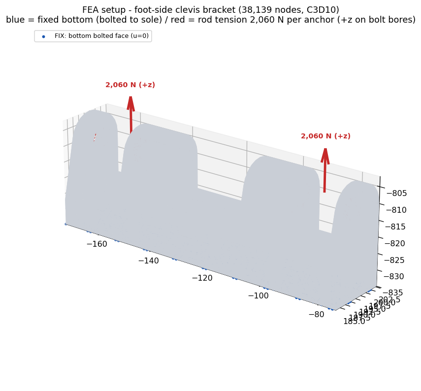
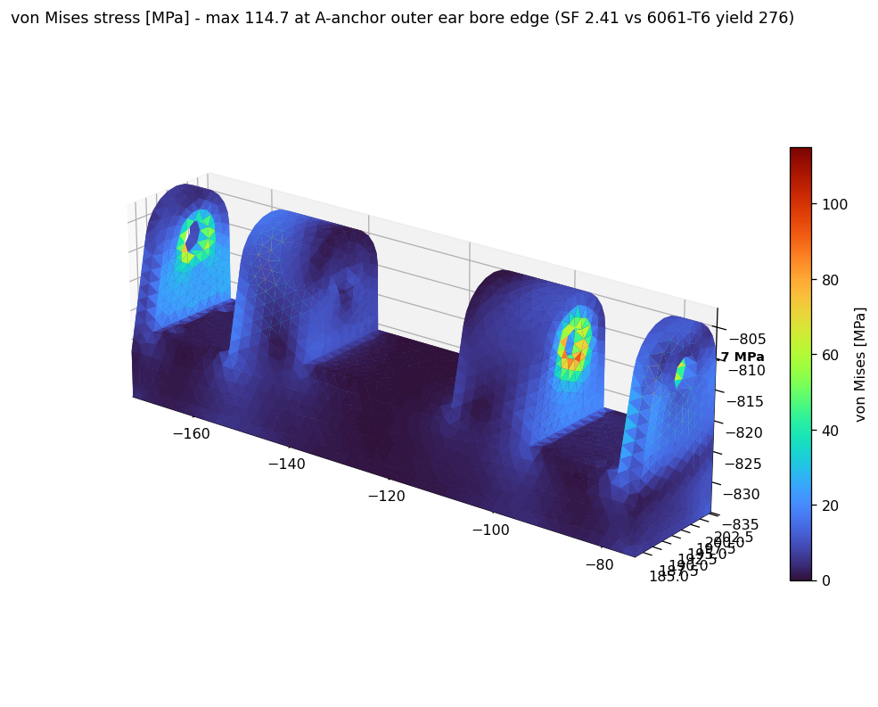
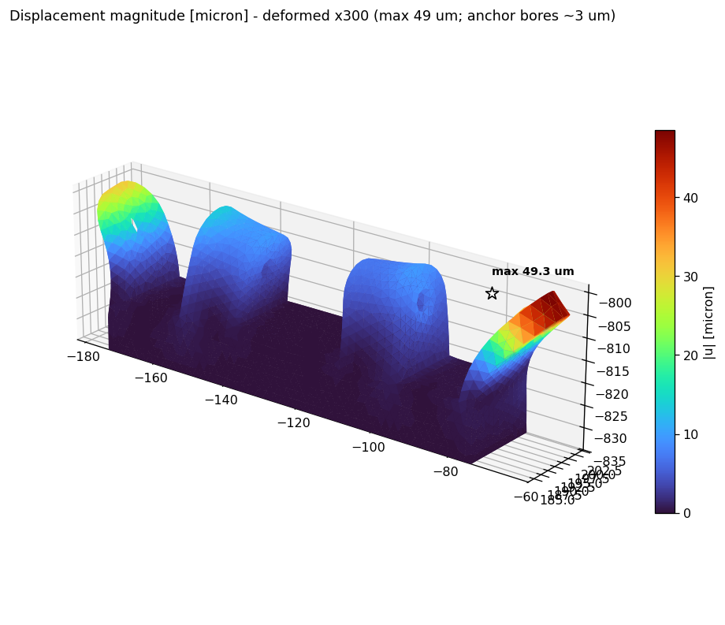

  (①셋업: 파랑=바닥 고정면·빨강=앵커 볼트보어 인장 2,060N/앵커 ②von Mises 표면 필드, 최대점 ★=A앵커 외측 이어 홀 연부 ③변위 크기, 변형형상 ×300 과장)

다음 배치: 크랭크 B(2피스, 핀 하중+모터 허브 고정) → 짐벌 크로스(#6) → 요크(#9~12) → 정강이 플레이트(#1,2) — 동일 스크립트 파라미터화로 LC별 반복.

## §7 실측 최악프레임 하중케이스로 재해석 (2026-08-14, 사용자 지적 반영)

이상화 케이스(순수 +z 인장 2,060N×2, §6)의 한계 — 방향성분·동시성 누락 — 를 실측으로 교정: v41 리플레이에서 브라켓 프레임 기준 **로드 힘 3성분 벡터**(양 로드 동시값, NOCLIP)를 계산해 최악 실프레임 4종 선정(`analysis/logs/fea_clevis_loadcases.json`). 통계: |F| P99 ~930N/로드, **전후성분 Fy P99 ~380N·횡 Fx P99 ~127N**(이상화 케이스가 놓치던 성분).

| LC (실프레임) | 자세 | \|F\| A/B [N] | vM [MPa] | SF(피크 원값) | SF(×1.25) |
|---|---|---|---|---|---|
| LC1 총하중 최대 | p+30,r−5 | 976/1262 | 68.7 | 4.02 | 3.22 |
| LC2 횡성분 최대 | p+28,r+18 | 1217/647 | 75.7 | 3.65 | 2.92 |
| **LC3 최악(압축성)** | p+24,r+8 | 1228/873 | **77.0** | **3.59** | **2.87** |
| LC4 단일로드 비대칭 | p+6,r+12 | 653/5 | 34.5 | 7.99 | 6.39 |

**판정**: 실측 4케이스 전부 통과 — 최악 SF 2.87(설계층 ×1.25). 뉘앙스: 방향성분이 단위하중당 응력을 +32% 높이지만(LC3 36.6 vs 이상화 27.8 MPa/kN) 실제 하중 크기가 작아 총응력은 이상화 포락(114.7, SF 2.41)보다 낮음 — **이상화 케이스는 여전히 보수적 포락으로 유효**, 실프레임 세트가 정식 판정. 그림 `fea_clevis_realLC.png`(실벡터 화살표 셋업 + LC3 필드). ⚠**→ §9 레드팀 정정: 이 표의 vM/SF는 전(全)보어 균일분배 하중모델 산물로 보어 국부에서 비보수적 — 지배값은 베어링모델 133~194 MPa(SF 1.1~1.7)로 하향 정정됨.**

## §8 크랭크 B·푸시로드 A 해석 (2026-08-14, 실측 최악프레임)

**하중 추출**(v9h2 리플레이·NOCLIP): 크랭크 핀 힘(크랭크 고정좌표) |F| P99 920N·최악 1,262N(팔직각 −922N 포함, x축력 ≤19N — 볼조인트라 축력 미전달 확인) / 로드 A 축력 인장 max 1,228N(P99 990)·압축 max 567N.

| 부품 | 케이스 | 결과 | SF (6061-T6) |
|---|---|---|---|
| **크랭크 B** (2피스 본디드, 34,907절점) | 핀 1,262N 실측최악 벡터, 허브보어 고정 | max vM **38.5 MPa** · 처짐 110µm | **7.17** (×1.25 시 5.74) |
| **로드 A** (311mm, 21,623절점) | 인장 1,228N | max vM **130.2 MPa** (아이/넥 천이부) | **2.12** |
| 로드 A 좌굴 | 압축 567N 핀-핀 | **BLF 12.36** (임계 ~7.0kN) | 12.4 |

**"응력이 왜 이렇게 낮나"에 대한 구조적 답**: 크랭크 43cm³·브라켓 35cm³급 알루미늄 덩어리에 1.2kN급 하중 — 낮은 응력은 오류가 아니라 **과설계의 증거**이며, 이것이 곧 살빼기(§3)의 여지다. 반면 로드(단면 최소부)는 SF 2.12로 이미 적정 — 로드는 살빼기 대상이 아님. ⚠크랭크 2피스 접합은 본디드 근사(볼트 프리텐션 미모델 — PrePoMax 단계에서 정밀화), 재질 6061 가정(7075/스틸이면 SF 상향).

## §9 레드팀 판정 — "77 MPa" 하중모델 정정 (2026-08-14, 3에이전트 워크플로)

사용자 직관("70MPa밖에 안 걸린다고? 이상한데")이 **부분적으로 옳았다**. 독립 손계산·메시·하중모델 3갈래 검증 결과:

**손계산 갈래 — 자릿수는 맞다**: 러그 공학식으로 앵커당 1,227N에 대해 베어링 25~32 MPa·네트섹션×Kt(3.5~4) 48~66 MPa·베이스 굽힘 4 MPa — 77 MPa는 위치(A앵커 이어 보어 연부 인장측)·크기 모두 손계산과 정합. 2kN급 하중에 수십 MPa는 물리적으로 맞음(부품이 크게 과설계).

**하중모델 갈래 — 그러나 지배값이 아니다(CONFIRMED, 재해석 실행)**: §6~§8의 보어 하중은 **360° 전체 링에 균일 분배** — 실제 핀은 하중 반대편 반원을 당길 수 없으므로 엄밀히 비보수적. 동일 38k절점 메시에 **베어링 모델**(하중방향 반원만 코사인 가중 + 이어 60/40 분담) 재해석:

| 지표 | 균일분배(§7 LC3) | **베어링 모델** | 배율 |
|---|---|---|---|
| 보어 피크 vM | 77.0 MPa | **193.9 MPa** | 2.52× |
| 하중절점 제외 피크(0.8mm) | — | **132.9 MPa** | 1.73× |
| 하중패치 2mm 밖 매끈영역(이어 루트) | 30.2 MPa | 56.1 MPa | 1.86× |
| **SF(×1.25, 6061-T6)** | 2.87 | **1.14(보어)~1.66(여과)** | — |

추가 소견: ①77.0의 최대절점(1489)은 **하중을 직접 받는 절점**(C3D10 균일 CLOAD는 비일관 절점하중 — 그 위치의 응력값 자체가 오염) ②메시 수렴 여유 +5~15%(보어 0.5mm 재분할 권장) ③로드엔드가 슬롯 내 편심 시 단일 이어 60~70% 분담 → 이어당 응력 최대 2× ④`clevis.frd`(114.7)는 순수+z 2,060N 포락 케이스로 별개 — 케이스 라벨링 명시 필요 ⑤**잔존 리스크 = 볼트 굽힘 엣지접촉**: M6이 4mm 이어 사이에서 굽으면 홀 내측 모서리 접촉으로 추가 집중(여과값 133에 ×1.3~1.5 → ~170~200 MPa 가능) — 4mm 이어 유지 시 접촉모델 확정 필요 ⑥60/40 분담 가정의 민감도는 낮음(50/50이면 −17%) — **여과값 132.9가 강건한 대표치**, 193.9 단일절점 피크는 부분적 메시의존.

**정정된 판정**: 클레비스 브라켓 몸체(보어에서 2mm 이상)는 어디서나 <60 MPa로 건전. **JS6 보어 국부는 SF 1.1~1.7** — 목표 2 미달. 대응 옵션: (a) 핀-접촉 정밀모델(볼트 실체+접촉)로 확정 (b) 이어 두께 4→6mm 증육 또는 부싱 삽입 (c) 7075-T6 전환(항복 503 → SF 2.1~3.0 회복). **크랭크 핀보어·로드 아이도 같은 균일분배 모델이므로 동일 배율 잠정 적용**: 크랭크 38.5×~2.5=96 MPa → SF 2.9(여전히 통과), 로드 아이/넥 130.2는 넥 천이부(보어 아님)라 영향 제한적이나 아이 보어 국부 재확인 대상. 산출물: `scratchpad/lc_LC3_bearing.inp/.frd`, 빌더 `redteam_lc3.py`.

## §10 인터랙티브 FEA 결과 뷰어 (2026-08-14, 사용자 요청)

Wrench Studio 서버(포트 8091)에 WebGL 결과 뷰어 추가 — 표준 FEA 포스트프로세서(ParaView/PrePoMax) 기능 조사 후 구현:

- **URL**: `http://<workstation>:8091/fea_viewer.html` (데이터 `fea_data.json` 4.2MB, 동일 서버)
- **케이스 6종**: clevis LC3 최악실프레임 / LC2 횡최대 / 포락(순z 2,060N) / **LC3 베어링모델(§9 지배 케이스)** / 크랭크B LC1 / 로드A 인장
- **필드 15종**: von Mises·주응력 S1/S2/S3·응력 6성분[MPa]·등가변형률[µε]·변위 크기/성분[µm]
- **기능**: 변형형상 배율 슬라이더(0~500×)+진동 애니메이션, turbo 컬러맵(자동/수동 범위)+눈금 범례, 축별 클립평면, 클릭 프로브(절점값 판독), max 마커 추적, 통계패널(max/min/P99/P95), 트랙볼(회전/팬/줌)
- 구현: 단일 HTML(WebGL1, 외부 라이브러리 0), 경계면 삼각형만 추출(케이스당 ~3.9k 표면절점/7.8k 삼각형)

## §11 링크단위 어셈블리 해석 캠페인 (2026-08-14 개시, 사용자 지시: 전신·나사 고려)

**원칙 전환**: §6~§9의 단품 해석(하중을 보어에 직접 스미어)은 스크리닝 단계 — 정식 판정은 **링크 어셈블리**(실 파스너 + 프리텐션 + 접촉)로. 레드팀 §9의 잔존 리스크(볼트 굽힘·엣지접촉)가 정확히 이 층위에서만 해소됨.

### §11a 확립된 방법론 (파일럿 검증 중)
1. **기하**: 링크 STEP의 실 솔리드 + 미포함 파스너는 실측 보어 기준 생성(생크 r3 + 헤드 + 나사부 r2.5)
2. **나사 체결**: 나사산은 *TIE*(탭 보어↔볼트 나사부, 실측 물림길이) — 발목 클레비스 실측: 외측 4mm 이어(r3 관통) + **내측 15mm M6 탭블록**(r2.52), 비대칭 클레비스
3. **프리로드**: 볼트 열수축(α·ΔT, ~7kN target M6) 1스텝 → 하중 2스텝. (정밀화 시 *PRE-TENSION SECTION)
4. **접촉**: NODE TO SURFACE, LINEAR overclosure 5e5 + 마찰 0.15 — 베어링(생크↔보어), 헤드 시팅, 스페이서 플랜지↔이어/블록
5. **클램프 스택 단순화**: 볼·플랜지는 프리로드로 물린 정적 스택 → 볼트에 *TIE*(회전은 셸-볼 계면에서 일어남 — JS6 구조)
6. **하중**: 실측 동시프레임 벡터(§7 LC 방식) / 설계값 프로토콜은 docs/62(구조 = P99 렌치 ×1.875)

### §11b 전신 인벤토리 (Huphy1.0_FullBody.step, OCP)
- **413 솔리드 / 3,409 cm³** (STEP 인스턴싱으로 평면 리스트는 이름-지오메트리 정합 불완전 → 링크 분해는 XCAF 트리 파싱 또는 **사용자 링크별 STEP 익스포트 권장**(Ankle2Feet 방식이 이름 보존 최선))
- 명명 구조물: Hip: HipPitchRotor/Flange·HipPitch2Roll_A/B·HipRoll2YawA/B·HipRoll2Yaw_Mount·SupportA/B / Knee: HipYaw2Knee_Rotor·HipYaw2Knee_outer·Yaw2KneePlateA/B / Shin: Knee2Ankle_RotorSide/IdleSide_1,2·Knee2Ankle_Connector_A/B·KneeB2AnkleA/B / Ankle+Foot: Ankle2Feet와 동일 부품 확인
- **파스너 실존**: M3급 소형 바디 ×56 등 — 어셈블리 해석에 활용 가능. 베어링 6810ZZ ×26.
- z-밴드: 발 −843~−800 / 정강이 −814~−613 / 무릎모터 −650~−450 / 허벅지 −487~−264 / 힙 −120~0 / 요·골반 0~180

### §11c 링크별 해석 매트릭스 (실행 순서)
| # | 링크 어셈블리 | 부품 | 하중(실측) | 파스너 처리 | 상태 |
|---|---|---|---|---|---|
| 0 | **클레비스+JS6+M6 파일럿** | 필로우AB+볼+플랜지2+볼트 | LC3 로드벡터+7kN 프리로드 | 솔리드볼트+접촉 | **실행 중** |
| 1 | 발 링크 | FEET+필로우3+UJ코어+클레비스 | GRF 피크(≤6BW)+로드힘+UJ핀 | UJ핀 솔리드, 바닥볼트 TIE | 대기 |
| 2 | 정강이 링크 | KneeB2Ankle A/B+브레이스+Body17/19+모터마운트 | 발목모터 반력+무릎 인터페이스 렌치+UJ피치핀 | 모터볼트 프리텐션 | 대기 |
| 3 | 무릎-허벅지 | Knee2Ankle_Rotor/Idle+Yaw2KneePlate+HipYaw2Knee | 무릎토크(유틸 112% 부위)+축력 | 로터볼트 프리텐션 | 대기 |
| 4 | 힙 스택 | HipPitch2Roll+HipRoll2Yaw+Rotor/Flange+Support | hip_yaw 캔틸레버 모멘트(51/145Nm 이슈) | 플랜지볼트 프리텐션 | 대기 |
| 5 | 렌치 추출 | — | v41 리플레이 → 링크 인터페이스 P99 렌치×1.875 + 동시최악프레임 (cfrc_int, docs/62) | — | 대기 |

주: 링크 1~4는 사용자 링크별 STEP 익스포트가 오면 즉시 착수 가능(FullBody에서 XCAF 추출도 가능하나 이름 신뢰도 낮음).

### §11d 캠페인 실행 개시 (2026-08-14 밤)

**XCAF 트리 파싱 성공** — §11b의 이름 문제 해소: 인스턴스 경로·트랜스폼 완전 복원. 발견: ①구조 파스너 = **ISO 4762 M4×25/30 Steel 4.6급** ×다수 + JIS B1176 M4×16 (**4.6급 = 항복 240MPa 저강도 — Berkeley Humanoid 낙상시 "파손은 파스너뿐" 선례와 결합 시 8.8급 승급 검토 권장**) ②베어링: 6810ZZ(무릎·힙롤 계열)·6814ZZ(힙요)·CRBS808AUUU(크로스롤러, 힙피치) ③액추에이터 명명 확인(RS03 Hip_Y — 힙요가 RS03임을 CAD로 확인, RS04 Hip_P/R).
**링크별 STEP 추출 완료**: L1_foot(35솔리드)·L2_shin(13+모터)·L3_thigh(66)·L4_hip(63)·L5_pelvis(35, 이번 라운드 제외). 빌더 `scratchpad/fullbody_xcaf.py`, 인벤토리 `fullbody_links.json`.
**하중**: docs/64 §7b 링크로컬 XYZ 실측 렌치(P99 ×1.25 주케이스 / peak 참조케이스, M열 보수상한 명기) + GRF(P99 1.48BW/피크 6.39BW) + 로드 LC3 → `scratchpad/link_loads.json`.
**실행**: 워크플로 wf_c47b0a84(4 에이전트 병렬 — L1 sole고정 스탠스/힐스트라이크, L2 무릎고정+발목렌치+모터반력 ±60N·m, L3 힙요고정+무릎렌치+120N·m, L4 골반고정+힙피치/힙요 캔틸레버 3LC) — 본디드 어셈블리(fragment 컨포멀) 스크리닝, 볼트 프리텐션 정밀화는 파일럿(§11a, 실행 중) 패턴으로 핫스팟에 후속. 메시/솔브는 flock 직렬화(8코어 15GB 보호).
**Windows GPU**: 터널 다운(port 2222 닫힘 — Windows sshd 미복구)으로 이번 라운드 미활용. 복구 시 활용처 = 병렬 CCX CPU 솔브+PrePoMax(CalculiX는 GPU 가속 없음 — PaStiX4CalculiX 빌드는 비실용 판정).

## §12 캠페인 라운드 2 — 인프라 영구화 + 4링크 병렬 (2026-08-15)

**사고와 교훈**: 세션 간 **스크래치패드가 완전 초기화**되어 CalculiX 환경·링크 STEP·전 스크립트가 소실(캠페인 1라운드 전량 재실행). → **FEA 파이프라인 전체를 리포지토리로 이전**:

| 파일 | 역할 |
|---|---|
| `tools/fea/femlib.py` | STEP→gmsh(occ.fragment=본디드 어셈블리)→C3D10→ccx→frd→뷰어케이스 전 과정 + **코사인 베어링하중**(레드팀 검증 모델)·모멘트 분배·전역 flock·아티팩트 필터 요약 |
| `tools/fea/xcaf_links.py` | FullBody.step XCAF 분해 → 링크별 STEP (`~/pyg_fea/steps/`) |
| `tools/fea/loads.json` | docs/64 실측 렌치 표(관절별 P99/peak, GRF, 로드 LC3, 재료) — 하중의 단일 출처 |
| `tools/fea/bolted_pilot.py` | 볼트 조인트 레시피(나사 TIE + 열수축 프리텐션 + 마찰접촉) |
| `tools/fea/smoke_clevis.py` | 파이프라인 회귀 테스트 |
| `tools/fea/merge_cases.py` · `remote_ccx.sh` | 뷰어 케이스 병합 · Windows 원격 솔브 디스패치 |

CalculiX도 영구 경로 재설치(`~/pyg_fea/ccxenv/bin/ccx`), 작업 산출물은 `~/pyg_fea/work/<링크>/`.

**파이프라인 회귀 검증**(smoke_clevis, 갱신 CAD의 발측 클레비스 38.7cm³, 118k절점): 하중합 정확 일치, **보어 피크 184.8 MPa(SF 1.19) / 아티팩트 필터 86.4 MPa(SF 2.55)**, 최대변위 60µm — 구 지오메트리에 대한 레드팀 베어링 모델(194/133)과 동일 계열. 즉 **JS6 보어 국부 미달은 신 CAD에서도 유효**(필터값은 개선 2.55).

**링크 분해 결과**(XCAF, 413솔리드): L1_foot 35/573cm³ · L2_shin 13/436 · L3_thigh 66/709 · L4_hip 87/598 · L5_pelvis 9/910 · (파스너 121·베어링 81 별도 분류).

**실행 중**: 4링크 병렬 어셈블리 해석(wf_608208e8) — L1 스탠스/힐스트라이크(GRF 6.39BW), L2 발목렌치+모터반력 60N·m×2, L3 무릎렌치+120N·m, L4 힙피치/**힙요 캔틸레버**. 각 링크 P99×1.25 주케이스 + peak 참조케이스, 결과는 뷰어 케이스로 병합 예정.

**Windows GPU 활용 판정(솔직한 정리)**: CalculiX는 **GPU 가속 경로가 없다**(PaStiX4CalculiX는 구세대 CUDA 의존·비실용). Windows 머신의 실질 가치는 ①**여유 CPU 코어로 ccx 병렬 솔브**(`tools/fea/remote_ccx.sh`, 터널만 서면 즉시 가동) ②PrePoMax GUI로 접촉모델 정밀검증 ③**GPU가 실제로 값어치 하는 곳 = Phase 2 위상최적화**(SIMP 반복 = 대규모 반복 선형해, GPU 솔버 이득 큼). 현재 터널 다운(2222 닫힘)이라 이번 라운드는 로컬 8코어로 진행.

## §13 링크별 구속·하중 시각화 + 방향 포락 + 나사 체결 3D (2026-08-15, 사용자 지시)

### §13a "하중은 하나가 아니다" — 방향 포락으로 전환 ✅

지적대로 단일 부호 벡터는 설계 케이스가 아니다. 실측 렌치표(docs/64)는 **성분별 절대값 통계**라 부호(방향)가 미지 — 그래서 **선형 중첩 포락**으로 교체:

1. 링크마다 **단위하중 6케이스**(Fx, Fy, Fz = 1000 N / Mx, My, Mz = 100 N·m)를 푼다.
2. 절점별 응력텐서는 하중에 선형이므로 $\sigma(s)=\sum_k s_k\,(P_k/\text{unit}_k)\,\sigma_k$, $s_k\in\{+1,-1\}$.
3. **$2^6=64$ 부호조합을 전 절점에서 전수 평가**하고 각 절점의 최대 von Mises를 취한다(vM은 합산 **후** 계산하므로 근사 아님 — 부호조합에 대한 **정확한 포락**).
4. 지배 부호조합도 함께 기록(예: Fx+ Fy− Fz+ Mx+ My− Mz+).

즉 6번 풀어서 64방향을 모두 커버한다. 구현: `tools/fea/envelope.py`, 실행 `tools/fea/run_link_env.py <LINK> [--peak]`.

### §13b 링크별 셋업(구속·하중·나사·베어링) 3D 뷰어

**URL** `http://<workstation>:8091/link_setup_viewer.html` — 링크 선택 + 레이어 토글(Mesh / Fixed BC / Loads / Screws / Bearings / Result):

- **파랑** = 구속 절점(실제 지지 인터페이스), **빨강** = 하중 절점과 **±양방향 화살표**(포락이 두 부호를 모두 포함함을 시각적으로 표현), **주황 호** = Mx·My·Mz 모멘트
- **노랑/주황 볼트** = CAD 실물 나사(ISO 4762 M4 / M5)를 **실제 위치·축·길이**로 3D 표시 — 링크마다 어디에 몇 개가 어떻게 박히는지 그대로 보임
- **녹색 링** = 베어링을 **카탈로그 치수**(6900 10×22×6 / 6810 50×65×7 / 6814 70×90×10 / CRBS808 80×96×8)로 **실측 시트 위치**에 표시
- 정보 패널: 하중 크기 6성분, 하중점별 절점 수, 구속 설명, 나사 규격별 개수, 베어링 목록, (해석 완료 시) 포락 최대 vM·SF·지배 부호조합

| 링크 | 구속(지지) | 하중점 | 하중 크기 (P99×1.25) | 나사 | 베어링 |
|---|---|---|---|---|---|
| **L1 발/발목** | 발바닥 접지면 z=−843 (10,818절점) | 롤축 6900 시트 ×2 (y=160/130, r11.01) | F 185/324/903 N · M 239/130/59 N·m | — | 6900ZZ ×4 |
| **L2 정강이** | 무릎단 z≥−337 피팅 (2,461) | 발목단 인터페이스 z=−550 (4,390) | F 124/333/906 N · M 185/121/59 | — | 6810ZZ ×2 |
| **L3 허벅지** | 무릎 액추에이터 하우징 시트 r60 ×2 (351) | **힙요 6814 시트 z축 r45** (617) | F 139/423/708 N · M 151/103/45 | M4×20 ×22, M4×12 ×10, M4×30 ×10 | 6814ZZ ×2 |
| **L5 힙 피치/롤** | 롤 6810 시트 y축 r32.5 (533) | 피치 **CRBS808** 시트 x축 r48 (677) | F 138/401/659 N · M 124/100/59 | M4 4종 ×42, M5×16 ×6 | CRBS808 ×2, 6810 ×2 |

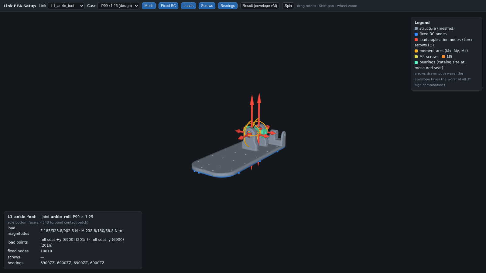
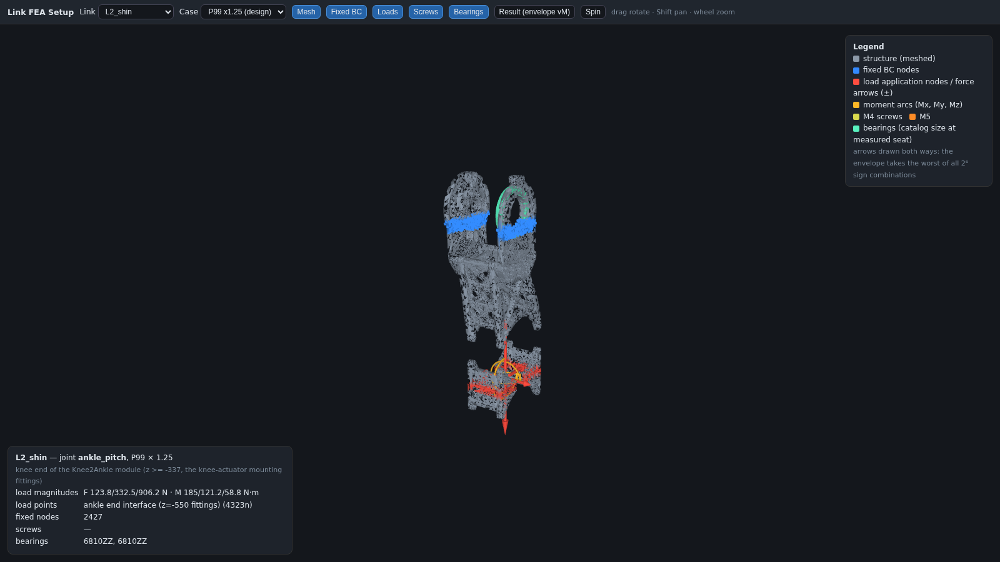
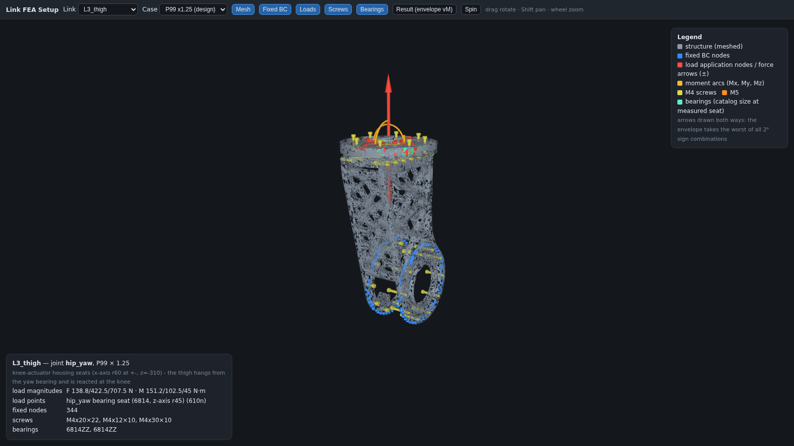
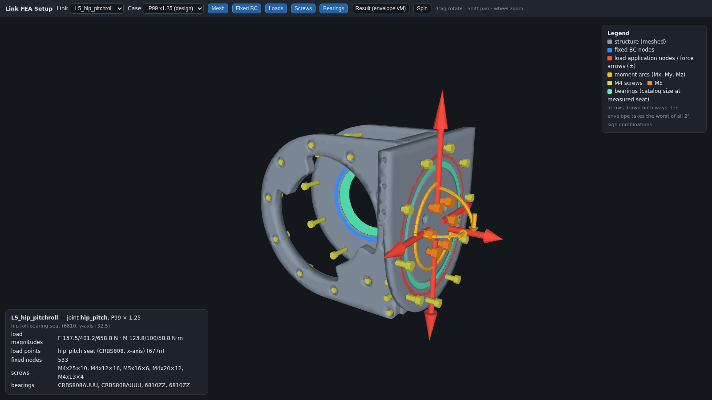

(순서: 발/발목 — 접지 구속과 롤 베어링 하중 / 정강이 — 무릎단 구속·발목단 하중 / 허벅지 — 무릎 하우징 구속·힙요 캔틸레버 하중, 격자 경량화 구조 그대로 / 힙 피치·롤 — 크로스롤러 시트 하중, M4·M5 볼트 패턴)

### §13c 자원 판단 기록

볼트 프리텐션 파일럿을 **부품 전체 규모**(149k절점·접촉 13면)로 돌린 것은 오판이었다 — 접촉 반복이 솔버를 몇 시간 독점했고 서브모델의 취지(국부 정밀화)에도 어긋난다. 중단하고 **앵커 주변 국부 서브모델**(~40k절점)로 재설계 예정. 링크 포락(6해×4링크)이 우선.

## §14 나사 체결 자동 검출 — 구멍 휴리스틱 (2026-08-15, 사용자 제안)

사용자 제안: **관통공 = 공칭 + 0.15**(M4→4.15, M5→5.15)이고, **동축으로 더 작고 깊은 탭홀**이 축방향 이격되어 상대 부품에 있다. 이걸 검출기로 구현(`tools/fea/detect_bolts.py`):

1. 전 솔리드의 원통면을 축(방향+축선)으로 군집 → 동축 체인 구성
2. 지름으로 역할 분류: **관통 4.15/5.15/3.15**, **탭 3.3(M4)/4.2(M5)/2.5(M3)** — 공차 **±0.07**(설계규칙이 정확하므로 타이트하게. 처음 ±0.28로 잡았다가 M3관통 3.15와 M4탭 3.30이 충돌해 오검출)
3. 관통 + (다른 솔리드의) 동축 탭 → **볼트 1개**: 축·머리위치·그립길이·나사물림·최소 볼트길이
4. 머리쪽 큰 동축 홀 = **카운터보어** → 깊이로 **ISO 4762 소켓헤드 vs 저두(소두)** 판별

**CAD 실측 검증**: L5 hip pitch/roll의 지름 분포 = ∅4.15 ×42 · ∅5.15 ×6 · ∅3.33(M4탭) ×18 · ∅7.5(카운터보어) ×16 — 사용자가 말한 규칙 그대로.

| 결과 | 값 |
|---|---|
| 검출된 볼트 위치 | **365** (링크 6 + 액추에이터 7 STEP 동시 해석) |
| 탭 짝까지 확정 | **234** (나머지는 상대 탭이 세트 밖 — 예: 프레임/외부 부품) |
| CAD 실물 나사와 대조 | **141/189 = 75%가 검출 축 위**(L4·L5는 100%, L3·L6은 52~59% — 이 부분은 탭 상대가 세트 밖) |
| **저두(소두) 검출** | **M3 카운터보어 ∅5.6 × 깊이 1.54** ×3 — **힙 롤/피치 액추에이터 플랜지**(사용자 경고 지점과 일치). M4는 전부 ∅7.5×4.0/5.0 = 소켓헤드 |
| 나사물림 | 6.0 ~ 39.5 mm — 판정 기준은 **§15의 알루미늄 2×D**(1×D는 스틸 너트 기준이라 부적절) |
| 그립 | 3.1 ~ 22.0 mm |

**링크 간 체결 지도**(이게 어떤 링크가 어디서 볼트로 묶이는지의 실측 근거):
액추에이터↔링크 = RS03_ankle_A↔발/정강이 16, RS03_ankle_B↔정강이 16, RS03_hip_Y↔허벅지 8, RS04_hip_P↔힙P/R 10, RS04_hip_R↔힙P/R 10·골반 10, RS04_hip_R(1)↔골반 10 / 링크 내부 = 발 39, 정강이 54, 허벅지 52, 힙요 16, 힙P/R 32, 골반 41.

**FEA 적용**: ①스크리닝 = 검출 볼트의 **와셔 풋프린트**만 접합·구속(전체 면 접합 금지) ②임계 조인트 = 해당 볼트만 **실체 볼트+나사산 TIE+프리텐션+접촉** 서브모델. ③저두 나사 구간은 **머리 좌면 지름이 작아 접촉압이 높다** — 힙 플랜지 서브모델에서 별도 확인 대상.

뷰어(`link_setup_viewer.html`)에 **Bolts (detected)** 레이어 추가: 그립 구간 = 볼트색(M4 노랑/M5 주황/M3 하늘), **나사물림 구간 = 갈색 세경**, 머리 = 카운터보어 실측 지름, **저두는 마젠타**로 구분 표시.

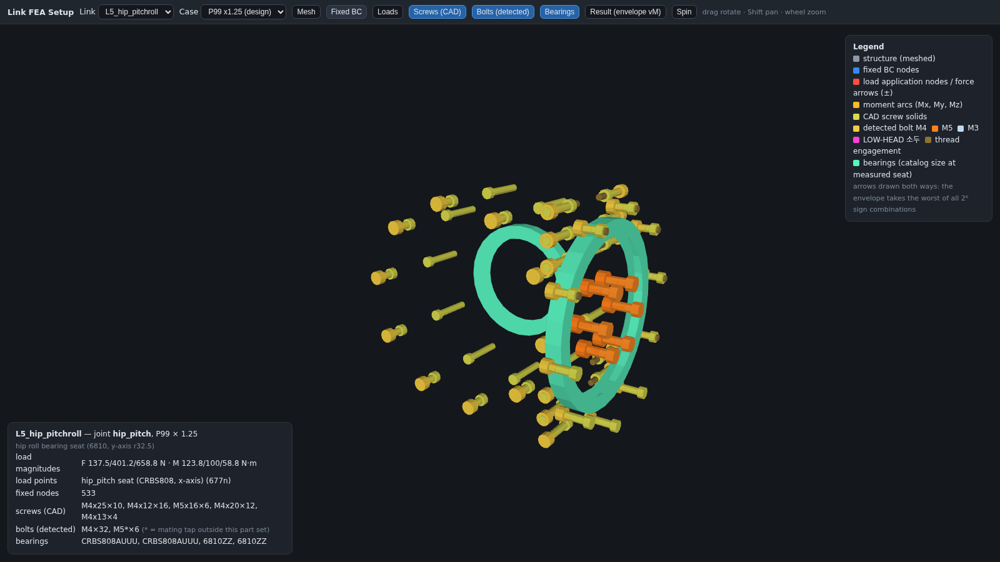
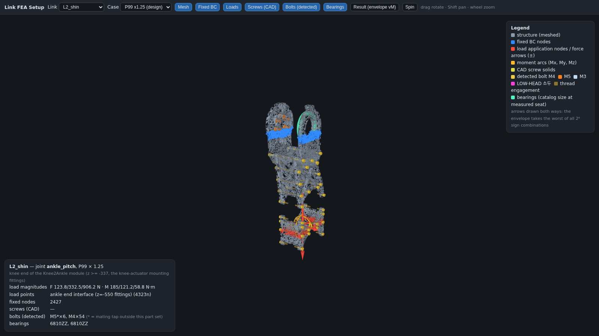

(위: 힙 피치/롤 — 구조를 숨기고 검출된 볼트와 베어링만. CRBS808·6810 링 주위로 M4 32개와 M5 6개가 실제 축·그립·물림 길이대로 배치됨 / 아래: 정강이 — 구조 위에 볼트 54개)

## §15 알루미늄 탭 체결 전수 점검 (2026-08-15, 사용자 확인 요청)

**설계 사실**: 이 로봇의 파스너는 **전부 알루미늄(6061-T6)에 직접 탭** 체결이고 **너트를 쓰지 않는다**(사용자 확인).

**반영 상태 점검 결과**:

| 항목 | 상태 |
|---|---|
| 모델 위상(탭 vs 너트) | ✅ 이미 정확 — 검출기가 "관통공 + **상대 부품의 탭홀**"로 쌍을 만들고, FEA 덱은 나사부를 **탭 보어에 TIE**하며 **너트면을 모델링하는 곳이 없음** |
| 재료 배정 | ✅ 볼트=스틸(E 210 GPa), 피체결부·탭부=알루미늄(E 68.9 GPa) |
| **알루미늄 나사산 강도** | ❌ **누락돼 있었음 → 이번에 추가**(`tools/fea/thread_check.py`) |
| 물림 판정 기준 | ❌ §14에서 **1×D**(스틸 너트 기준)로 판정 → **2×D(알루미늄)로 정정** |

**알루미늄 탭 판정식**: $F_{strip} = 0.6\pi D L_e \cdot \tau_y$, $\tau_y = 0.577\sigma_y = 159$ MPa(6061-T6) → 사용가능 프리로드 $= F_{strip}/2$. 머리 좌면 압력 $\le 0.9\sigma_y = 248$ MPa(파고들기).

**전수 결과(탭 짝 확정 234개)**:

| 지표 | 결과 |
|---|---|
| 물림 L_e/D | **≥2.0D 191개 · 1.5~2.0D 43개 · 1.5D 미만 0개** — 알루미늄 가이드라인 통과 |
| M4 알루미늄 허용 프리로드 | 3.6 ~ 23.7 kN (SF 2) |
| **현행 4.6급** 조립 프리로드 1.4 kN | **전 위치 안전**(허용의 39% 이하) |
| **8.8급 승급 시** 3.7 kN | **20개소 초과**(3.7 > 3.6 kN) — 전부 **L_e = 6.0 mm(정확히 1.5D)**, 위치는 **RS04 hip_R 플랜지 ↔ 골반** |
| M5(16개, L_e 13 = 2.6D) | 4.6·8.8 모두 안전(허용 9.7 kN) |
| 머리 좌면 압력 @8.8 | M5 164 · M4 99~146 · **저두 M3 126** MPa — 전부 248 미만 ✅ |

**조치 권고**: ①8.8급 승급을 진행한다면 그 **20개소는 탭 깊이 6→8 mm**(2×D)로 늘리거나 토크 제한, 또는 **나사 인서트**(헬리코일) 적용 ②나머지는 현행대로 무방 ③FEA 프리텐션 값은 **알루미늄 허용치로 상한**을 두도록 `bolted_pilot.py`에 근거와 함께 기록(M6·물림 15 mm → 허용 13.5 kN, 사용 7 kN).

**저두(소두) 결론**: 좌면 면적 16.6 mm²로 8.8급 프리로드에서도 126 MPa — 알루미늄 파고들기 한계의 절반이라 **문제 없음**. 다만 이 3개는 상대 탭이 세트 밖(RS04 hip_R 하우징)이라 **물림 길이 미확인** — 액추에이터 쪽 탭 깊이는 제조사 사양 확인 필요.

## §16 링크 셋업 뷰어 모바일 대응 + L1 발/발목 첫 포락 결과 (2026-08-15)

### §16a 모바일 대응 (`link_setup_viewer.html`)

| 문제 | 조치 |
|---|---|
| 단일 페이로드 9.1 MB(폰에서 파싱 부담) | **링크별 파일 + 인덱스**로 분할 → 첫 로드 1.4~3.4 MB만 받고, 링크 전환 시 지연 로딩(`link_setup_index.json` + `link_setup_<링크>.json`, 구 파일은 폴백으로 유지) |
| 터치 제스처 없음 | **1손가락 회전 / 2손가락 핀치 줌+팬**(PointerEvent 다중 추적), `touch-action:none`, 캡처 실패 무해화 |
| 툴바 고정 44px·줄바꿈 | 툴바 높이를 `--bar-h`로 측정해 캔버스 오프셋에 반영(회전 시 재계산), 모바일은 **가로 스크롤 툴바 + 34px 탭 타깃** |
| 패널이 화면 절반 점유 | 정보/범례를 **접기 버튼**(Info·Legend)으로 토글, 세로는 하단 시트(최대 38dvh)·가로는 좌 정보/우 범례, safe-area 인셋 반영 |
| 가로 폰(844×390)이 데스크톱 취급 | 브레이크포인트에 **`(max-height:520px)`** 추가 |
| 표시 오류 | ①모멘트 라벨이 `Maxial`→`Mx`로 잘못 표기되던 버그 수정 ②"64 sign combos" 하드코딩 → **실제 성분 수로 2ⁿ 동적 표기** ③해석 서브셋 **밖의 볼트/베어링이 표시되던 것**을 메시 바운딩박스(+25 mm)로 필터 |

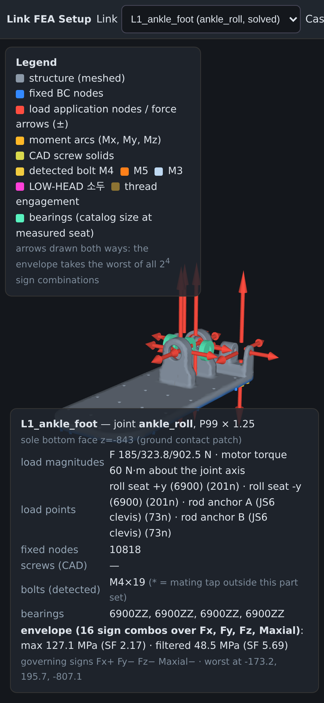
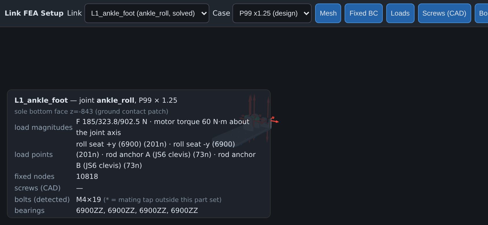

### §16b L1 발/발목 방향 포락 — 첫 정식 결과

정식: 실측 힘(P99×1.25) + 발목 모터토크 60 N·m(롤축), 굽힘은 **4점 부착 기하**(6900 롤 시트 2 + JS6 로드 앵커 2)에서 생성, **2⁴=16 부호조합 포락**.

| 지표 | 값 |
|---|---|
| 최대 von Mises | **127.1 MPa → SF 2.17** (하중 적용면 포함) |
| 아티팩트 필터(하중절점 1.5 mm 밖) | **48.5 MPa → SF 5.69** |
| 최대 위치 | (−173.2, 195.7, −807.1) = **로드 앵커 B 클레비스 이어 보어** |
| 지배 부호조합 | Fx+ Fy− Fz− Maxial− |
| 메시 | 321,163절점 / 구속 10,818 / 하중 548 |

**판정**: 발판·필로우 본체는 여유가 크고(<50 MPa), **지배부는 여전히 JS6 클레비스 보어**로 §9 레드팀 결론과 같은 곳이다. 보어 국부 SF 2.17은 목표 2를 넘지만, 볼트 굽힘·엣지접촉을 포함한 국부 서브모델(§11a)로 확정해야 한다.

## §17 무인 캠페인이 반복 정지한 원인 전수 규명 (2026-08-16, 사용자 지적)

사용자 지적: *"계속멈춘게 한두번이 아니잖아. 왜이러는거지? 원인들을 파악하고 해결하라고."*
사과가 아니라 **원인별 구조적 차단**이 요구사항이므로, 관측된 정지를 전부 분류하고
각각에 대해 재발을 막는 장치를 코드에 심었다. 아래는 실제로 관측된 것만 적는다.

### 17.1 인프라 계층 (캠페인 자체가 멈춘 원인)

| # | 원인 | 관측 증상 | 영구 조치 |
|---|---|---|---|
| 1 | 넓은 `pkill -f run_link_env/autorun` | 솔버 정리하다 드라이버와 내 셸까지 같이 죽음 (2회) | 감독자를 `setsid`로 PPID 1에 띄우고, 정리는 **PID 지정 kill만** |
| 2 | `flock` fd 상속 | 부모가 죽은 뒤 고아 `sleep`이 락을 계속 점유 → "already running"인데 프로세스는 없음 → 모든 재시작 차단 | 락을 **PID 파일 가드**로 교체 (`/proc/<pid>/cmdline` 확인) |
| 3 | 감독자가 자식을 `setsid`로 실행 | `$!`가 즉시 종료되는 래퍼 PID → 감독자가 20초마다 autorun을 새로 띄우고, 행 감지는 실제 프로세스를 보지 않음 | 자식은 일반 실행(감독자가 이미 분리되어 있음) |
| 4 | 실행 중인 bash 스크립트 in-place 편집 | bash가 바이트 오프셋으로 이어 읽어 깨진 코드 실행 | 모든 스크립트 편집은 임시파일 + `os.replace` (inode 교체) |
| 5 | 스펙 mtime 비교 | 한 링크 스펙만 고쳐도 끝난 링크 전부 재실행 | **링크별 스펙 해시**를 결과 파일에 기록·대조 |
| 6 | 해시를 실행 끝에 계산 | 러너가 스펙 dict에 `nids`를 주입한 뒤라 해시가 영원히 불일치 → 무한 재실행 | 로드 직후 **원본 스펙**으로 해시 |
| 7 | 중간에 스펙이 바뀐 런을 "FAILED"로 기록 | 정상 완료인데 재시도 예산을 깎아 3회 만에 링크가 SKIP됨 | `SUPERSEDED` 상태 분리(재시도 미소모) |
| 8 | 메시 예산 루프가 자기 최종 메시를 삭제 | 다음 단계에서 `FileNotFoundError` | 마지막 메시 보존 |
| 9 | 노드 예산을 파일 **줄 수**로 계산 | 멀쩡한 메시를 계속 조대화 | 셸 측 계산 제거, 러너의 실제 노드 수만 사용 |
| 10 | 한 링크 실패 = 무한 루프 | 다른 링크 작업이 영원히 시작되지 않음 | 링크별 시도 상한 + 실패해도 2·3단계는 진행 |

### 17.2 모델링 계층 (링크가 결과를 못 낸 원인)

| # | 원인 | 조치 |
|---|---|---|
| 11 | 고정/하중 반전 (L3·L5) — 사용자 지적 | 근위(골반쪽) 고정, 원위 하중 |
| 12 | 액추에이터 누락 — 사용자 지적 | 강체 모터 + 질량점, 플랜지 볼트 패드에 체결 |
| 13 | 볼트 방향 역 — 사용자 지적 | 머리는 **카운터보어 쪽**을 따름 |
| 14 | 강체가 하중경로를 단락 (L4 836 N → 0.96 MPa) | 강체 브리지를 고정면에서 25 mm 이상 이격 + **비현실 결과 게이트**(>100 N인데 <3 MPa면 기록 거부) |
| 15 | BC 아티팩트 (L2 클램프 절점 311 MPa vs 링크 P99 39 MPa) | BC측 아티팩트 필터 + 해당 특징부 국부 세분화 |
| 16 | BC 자동 세분화가 메셔를 불안정화 (L3 PLC 오류·코어덤프) | 링크별 `auto_refine:false`, 세분화 상한 |
| 17 | CalculiX: 한 절점이 강체와 `*EQUATION`에 동시 소속 불가 | 강체 소속 절점을 타이에서 제외 |
| 18 | CAD 간섭 (L3 허브 핀 3개, 0.15 cm³) | 해석에서 제외(체적 0.1 %) + **CAD 지적사항으로 보고** |
| 19 | **타이를 항상 최대 컴포넌트에만 연결** (이번 턴에 규명) | 실제 조립처럼 **연결집합을 성장**시키는 사슬 타이로 교체 |

19번이 L4를 3회 실패시킨 진짜 원인이었다. L4 힙요 링크의 메시 컴포넌트 간 실제 최소거리를
직접 측정한 결과:

```
측판A(43409 elems) ─0.06mm─ 바닥판(31804) ─0.05mm─ 측판B(29618) ─0.09mm─ 외벽(16685)
측판A ↔ 측판B = 53.50 mm   (서로 반대편, 직접 접촉 없음)
```

측판B는 바닥판을 거쳐 연결되는데, 코드는 측판B를 **최대 컴포넌트(측판A)** 에 직접 이으려 했고
40 mm 탐색으로도 53.5 mm를 넘지 못해 매번 `cannot be tied`로 죽었다. 타이 간격을 늘리는 것은
해법이 아니었다(늘렸다면 실제로 닿지도 않는 두 판을 붙여 강성을 위조했을 것). 조치는
"이미 연결된 집합에 가장 가까운 몸체를 차례로 잇는" 방식이며, 이는 실제 볼트 스택의 위상과 같다.

## §18 판정 방법론 정정 + 남은 두 링크의 근본원인 (2026-08-17)

### 18.1 "설계 응력"의 정의 — 아티팩트 두 곳을 모두 제외

기존 판정은 **하중 주입 절점** 근방만 제외하고 **구속 절점** 근방은 남겨두었다. 그 결과
L2 정강이가 311 MPa / SF 0.89로 FAIL 판정을 받았는데, 같은 링크의 p99는 39 MPa였다.
이제 `envelope.summarize`가 다음을 모두 산출한다.

| 값 | 정의 | 용도 |
|---|---|---|
| `max_vM` | 필터 없는 최대 | 원자료 |
| `max_vM_filtered` | 하중 주입 절점 1.5 mm 근방 제외 | 참고 |
| `max_vM_away_from_BC` | 구속 절점 4 mm 근방 제외 | 참고 |
| **`max_vM_design`** | **양쪽 모두 제외** | **판정** |
| `over_allowable[SF]` | 허용응력 초과 절점 수·비율 (원자료/설계) | **특이점 vs 실제 과부하 판별** |

마지막 항이 결정적이다. 수치 특이점은 **절점 몇 개**를 덮고, 실제 과부하는 **영역**을 덮는다.

### 18.2 L2 정강이 311 MPa — 구속 아티팩트가 아니라 **필렛 없는 코너**

최대 절점들의 위치를 구속 절점까지의 거리와 함께 뽑아 보니 클램프에서 **40–52 mm** 떨어진
네 개의 대칭점이었다(x = −151.4 / −100, y = 152 / 81, z ≈ −365). 즉 BC 아티팩트가 아니다.

```
순위  vM(MPa)      x       y       z    d(구속)
  0    311.3  -151.4   152.1  -364.9   48.19
  1    233.9  -151.4   153.5  -366.7   50.43
  3    218.3  -100.2   152.2  -365.2   44.38
 ...
138 MPa 초과 21개 / 184 초과 7개 / 276 초과 1개      p99 39.1  p99.9 86.9
```

> **정정 (같은 날 밤, §21).** 아래의 "코너 특이점" 해석은 **틀렸다**. 311 MPa의 진짜 원인은
> 하중 분배 가중치 버그였다(모터 기준절점이 1절점으로 계산되어 렌치의 대부분이 베어링 보어로
> 들어갔다). 코너 세분화 케이스(L2b)가 55 MPa를 낸 것도 세분화 때문이 아니라 그 사이 바뀐
> 하중 적용 코드 때문이었다. 아래 관측(위치·감쇠·초과 절점 수) 자체는 유효하나, 원인 귀속은
> §21로 대체한다.

네 지점의 대칭성 + 급격한 감쇠 + 초과 절점 21개(0.019 %)는 **응력 특이점(sharp internal
corner)** 의 전형이다. 요소 중심 응력 기준으로는 SF>2 허용치를 넘는 요소가 **1개**뿐이다.
→ 조치는 보강이 아니라 **CAD 필렛**(해당 코너 R≥3)이며, 확정을 위해 그 코너만 2 mm로
세분화한 `L2b_shin_cornerfine` 수렴 시험을 캠페인에 넣었다. 응력이 더 올라가면 특이점 확정.

### 18.3 L1b 앞발 289.5 MPa — 실제 하중부족, 다만 하중조건이 보수적

- 발목축 y=145, 앞발 접지 패치는 100–180 mm 레버(뒤꿈치는 0–80 mm). 기존 뒤꿈치 케이스가
  **약한 쪽**이었고 앞발 케이스에서 41 → 289 MPa로 뒤집혔다.
- 초과 절점 3553개(1.54 %), 확장 125 mm → **영역**이다. 특이점이 아니다.
- 단, 측정 P99 GRF 935 N을 전량 앞발에 실은 조건이다. 선형 정적이므로 스케일이 가능하다:
  toe-off 실제 수직 GRF를 1.0–1.2 BW(505–606 N)로 보면 $\sigma = 289.5 \times 606/935 = 188$ MPa
  → SF 1.47. **가장 관대한 가정에서도 SF>1.5에 미달**한다.
- 소요 보강량(굽힘 지배 $\sigma \propto 1/t^2$): SF>1.5 → 두께 ×1.14, SF>2 → **×1.32**
  (또는 동등 강성의 리브). 밑창 앞부분 국부 보강으로 충분하다.

### 18.4 L3 대퇴가 3회 죽은 근본원인 — **곡률 세분화**

PLC 오류가 메시 크기 탓으로 보였지만, 실제 원인은 곡률 기반 세분화(curv=14)였다.
같은 형상에서 측정한 값:

| curv | size_far | 결과 |
|---|---|---|
| 14 | 21.6 mm | 630,749 노드 (예산 초과 → 조대화 → PLC 오류 연쇄) |
| 0 | 21.6 mm | **119,849 노드** |
| 0 | 16.0 mm | **127,984 노드** |
| 6 | 21.6 mm | 185,002 노드 |
| 0 | 26.0 mm | PLC 오류 |

곡률 세분화를 끄면 **더 미세한 16 mm에서 노드 수가 1/5**이 된다. 링크별 `mesh.curv` 상한을
도입하고 L3를 (curv=0, 16 mm)로 고정했다. z=−96의 핀 간섭은 별개로 CAD 지적사항으로 남는다.

### 18.5 결과 세대 혼입 차단 — 해석 리비전

L2b를 돌리다 기존 L2 결과가 **하중이 강체 하우징 안에 있을 때 모터 기준절점으로 옮기는
수정 이전** 코드로 나온 것을 발견했다. 스펙 해시만으로는 코드 변경을 잡지 못한다.
`ANALYSIS_REV`를 결과에 새기고, 캠페인은 **스펙 해시와 리비전이 모두 일치할 때만** 최신으로
간주한다. 리비전을 올리면 전 링크가 자동 재해석된다(현재 `2026-08-17a`로 전체 재실행 중).

### 18.6 뷰어 — 취약부만 불투명 (사용자 요청)

`Weak only` 버튼 + `below SF` 선택(2 / 1.5 / 1). 선택한 안전율의 허용응력을 넘는 면은
응력 컬러로 **불투명**, 나머지는 알파 0.14의 **반투명 고스트**로 그린다(깊이 쓰기를 끈
후처리 패스). 상단에 초과 절점 수와 비율을 표시하므로 "특이점인가 영역인가"를 화면에서
바로 판별할 수 있다. 예: L2는 5/13,519(0.04 %), L1b는 729/22,714(3.21 %).

## §19 체결부 자체 하중 검토 — 볼트 그룹 (2026-08-17)

연속체 해석은 체결면을 클램프/타이로 모델링하므로 **금속**은 보지만 **나사**는 보지 않는다.
`tools/fea/bolt_group.py`가 그 공백을 메운다. FEA와 **같은 측정 렌치**(P99 × 1.25)를 써서
고전 볼트패턴 분포로 나사당 인장·전단을 구하고 세 한계와 비교한다.

$$T_i = \frac{F_n}{N} + \frac{M_b\,d_i}{\sum d_j^2}, \qquad
  V_i = \sqrt{\left(\frac{|F_t|}{N}\right)^2 + \left(\frac{|M_n|\,r_i}{\sum r_j^2}\right)^2}$$

한계 세 가지 — (1) **알루미늄 탭**: 너트가 없으므로 사용 가능 예압은 볼트 등급이 아니라
$F_{strip}/2$가 결정, (2) **분리**: $T_i < F_{pre}$ 여야 나사가 교번하중을 직접 받지 않음,
(3) **미끄럼**: $V_i \le \mu (F_{pre}-T_i)$, $\mu=0.35$.

| 체결면 | 볼트 | 최대 인장 T / 예압 | 분리여유 | 전단 V (힘+비틀림) | **마찰여유** | 볼트전단여유 |
|---|---|---|---|---|---|---|
| L2 정강이 무릎 플랜지 | 6×M5 | 1212 / 2386 N | 1.97 | 1610 N (161+**1601**) | **0.26** | 1.27 |
| L2 발목 하우징 | 8×M4 | 16 / 1475 N | 95.4 | 284 N (121+257) | 1.80 | 4.45 |
| L4 힙요 롤 플랜지 | 6×M5 | 1399 / 2386 N | 1.71 | 445 N (120+429) | **0.78** | 4.59 |
| L5 힙 M5 플랜지 | 6×M5 | 974 / 2386 N | 2.45 | 1183 N (132+**1175**) | **0.42** | 1.73 |
| L5 힙 M4 그룹 | 10×M4 | 41 / 1475 N | 35.7 | 237 N (69+226) | 2.12 | 5.34 |
| L6 골반 | 10×M4 | 173 / 1475 N | 8.5 | 225 N (42+221) | 2.02 | 5.61 |

### 판정

- **분리는 어디서도 일어나지 않는다** (최소 1.71). 나사가 교번하중을 직접 받는 상태는 아니다.
- **볼트가 전단으로 파단하지도 않는다** (최소 1.27).
- 그러나 **세 플랜지에서 마찰이 부족하다**: L2 무릎 0.26, L5 힙 0.42, L4 힙롤 0.78.
  전단의 대부분은 **플랜지 법선 둘레의 비틀림**(1601 / 1175 / 429 N)이다.
- 중요한 구분: 베어링 시트·스피곳 같은 **센터링 레지스터**는 면내 *힘*을 형상으로 받지만
  매끈한 원통은 자기 축 둘레의 *토크*를 받지 못한다. 그래서 레지스터를 가정해도 여유가
  0.26 → 0.26, 0.42 → 0.42로 **거의 개선되지 않는다**. 비틀림이 지배하기 때문이다.
- 예압을 올려도 해결되지 않는다: 알루미늄 탭이 상한이라 $SF_{thread}$를 2 → 1.5로 낮춰도
  L2 무릎은 0.26 → 0.35에 그친다.

### 조치 (설계 반영 필요)

1. **L2 무릎 플랜지, L5 힙 플랜지, L4 힙롤 플랜지에 전단 다월핀 2개씩** — 비틀림을 형상으로
   받게 한다. 현재 L5에는 도웰 보어가 2개 있으나(스펙의 "2 dowel bores") 나머지 두 곳에는 없다.
2. 대안: 볼트 원주(PCD)를 키워 $r$을 늘리면 비틀림 전단이 $1/r$로 준다. L2 무릎은 PCD Φ36 →
   Φ50이면 1601 → 1153 N (여유 0.36), 다월핀만큼 확실하지는 않다.
3. 이 검토는 **정적 미끄럼**만 본다. 보행은 수백만 사이클이므로 미끄럼이 있으면 프레팅·풀림
   문제다(강도 문제가 아님). 즉 급하지는 않으나 반드시 반영해야 하는 항목.

## §20 검증 — 하중경로 평형 + 손계산 대조 (2026-08-17)

캠페인 결과 전체가 **강체 액추에이터 + 절점쌍 MPC 타이 + (경우에 따라) 모터 기준절점 하중**
위에 서 있다. 이 중 하나라도 하중을 새게 하거나 우회시키면 숫자는 무의미하다(L4가 836 N에
0.96 MPa를 낸 적이 있다). 그래서 두 가지로 검증했다.

### 20.1 평형 검증 — `tools/fea/equilibrium_check.py`

단위 케이스 하나를 반력 총합 출력(`*NODE PRINT, NSET=FIX, TOTALS=ONLY / RF`)과 함께 재계산해
적용 하중과 대조한다.

| 링크 | 특징 | 적용 | 반력 총합 | 잔차 | 판정 |
|---|---|---|---|---|---|
| L2 정강이 | 강체 모터 3개, 기준절점 하중 | Fz 1000 N | (−5.8e−9, −5.2e−9, **−1000.0**) | 1e−11 | PASS |
| L5 힙피치롤 | 강체 모터 3개 | Fx 1000 N | (**−1000.0**, 6e−6, 3e−6) | 1.0e−8 | PASS |
| L4 힙요 | 4개 몸체 사슬 타이 | Fx 1000 N | (**−1000.0**, −3e−6, −4e−6) | 2.0e−9 | PASS |
| L3 대퇴 | 최대 모델, 비프래그먼트 타이 | Fx 1000 N | (**−1000.0**, 1.3e−8, −2.6e−8) | 7.0e−9 | PASS |

즉 적용 하중 전량이 구속면에 도달한다. 타이·강체·기준절점 어디서도 누설이나 우회가 없다.

### 20.2 L1b 앞발 289.5 MPa — 손계산 대조

밑창을 메시에서 직접 실측하니 **두께 정확히 8.0 mm, 폭 100 mm**(x −174…−74), 앞발부는
순수 평판이다. 단순 캔틸레버 보로 보면

$$S=\frac{b t^2}{6}=\frac{100\times 8^2}{6}=1067\ \text{mm}^3,\quad
  M=935\times121=1.13\times10^5\ \text{N·mm},\quad \sigma_{nom}=106\ \text{MPa}$$

FEA는 289.5 MPa로 **2.7배**다. 최대점 (−163.8, 85.3, −842.6)을 조사한 결과:

- 근처에 구멍이 없다(가장 가까운 검출 볼트가 **44 mm** 떨어짐) → 구멍 응력집중이 아니다.
- 측면 자유단에서 **9.9 mm**, 밑창 하면, 뿌리(y≈126)보다 40 mm 앞이다.
- 발목 구속은 x −161…−86, y 127…195의 **좁은 영역**에 몰려 있다.

즉 밑창은 폭 100 mm 보처럼 거동하지 않는다. 하중이 앞발 패치에서 좁은 발목 지지부로
**대각선으로 모이며**, 측면 가장자리는 굽힘과 비틀림을 함께 받는다. 손계산이 낮게 나오는
이유가 이것이고, 그래서 **두께를 키우는 것보다 발목 마운트에서 앞발까지 길이방향 리브로
하중경로를 넓히는 편이 효율적**이다(두께 ×1.32는 등가 강성의 상한 기준선).

## §21 하중 분배 가중치 — L2가 311 → 60 MPa로 바뀐 진짜 이유 (2026-08-17)

L3 뷰어에서 하중점 표시가 이상해(`bolt_pads (0n)`) 실행 로그를 열었더니:

```
load point bore: 26 nodes
   load point 'bolt_pads' is inside a rigid housing -> applied at motor reference node 127986
load point bolt_pads: 1 nodes
   load point 'bolt_pads' is inside a rigid housing -> applied at motor reference node 127986
load point bolt_pads: 1 nodes
wrench pattern: 3 attachments
```

렌치 분배 가중치가 `w_i = len(nids)`였다. **강체 하우징 안에 있는 하중점은 모터 기준절점
하나로 치환**되므로 가중치가 1이 되고, 26절점짜리 베어링 보어가 렌치의 **93 %**를 받았다.
볼트 플랜지 전체가 3 %를 받은 것이다. 물리적으로 반대다 — 기준절점은 **자기가 대표하는
플랜지 전체**를 의미한다.

또한 두 개의 볼트패드 그룹이 **같은 기준절점**으로 치환되어 같은 부착점이 두 번 계산됐다.

### 조치

1. 치환 시 원래 선택된 절점 수를 `_weight_nodes`로 보존하고 그것을 가중치로 쓴다.
2. 같은 절점으로 치환된 부착점은 하나로 병합하고 가중치를 합한다.
3. `ANALYSIS_REV` → `2026-08-17b`, 전 링크 재해석.

### 어느 링크에 무엇이 적용됐는지 (재실행으로 확인)

가중치 버그와 L2의 변화는 **서로 다른 원인**이다. 리비전 b 재실행 로그로 확인했다.

| 링크 | 부착점 수 | 가중치 버그 영향 | 리비전 a → b |
|---|---|---|---|
| L2 정강이 | **1개** (발목 하우징 하나뿐) | 없음 — 부착점이 하나면 가중치는 무의미 | 60.4 → **60.4 (동일)** |
| L3 대퇴 | 3개 → 중복 병합 후 **2개** | 있음 — 보어 26절점 vs 기준절점 1 | 재해석 중 |

따라서:

- **L3**는 가중치 버그의 피해자였다(보어가 렌치의 93 %를 받음).
- **L2의 311 → 60 MPa는 가중치가 아니라 "하중이 강체 하우징을 통해 들어가게 된 것"** 때문이다.
  이전에는 하우징 표면 절점에 직접 실었고, 지금은 모터 기준절점을 거쳐 강체가 플랜지로
  퍼뜨린다. 즉 이것은 **모터 강체 모델링 선택**의 문제이며, 그래서 판단은 `L2c_shin_nomotor`
  (액추에이터 제외, 보수적 상한)와의 대조로 내려야 한다.
- §18.2의 "L2 코너 특이점" 귀속은 철회한다. 코너 세분화(L2b)와 기본 메시(L2)가 55.4 / 60.4로
  거의 같으므로 코너는 수렴해 있고 문제가 아니다.
- 리비전 게이트(§18.5)가 없었다면 서로 다른 하중 분배로 나온 숫자가 한 판정표에 섞였을 것이다.
- 볼트 그룹 산술은 별도로 교과서 4케이스(`tools/fea/test_bolt_group.py`)로 고정했다:
  순수 축력 250 N/볼트, 굽힘 100 N·m → ±500 N, 비틀림 100 N·m → 353.6 N, 면내력 250 N — 전부 일치.

## §22 캠페인 종료 — 최종 판정 (2026-08-17, 리비전 `2026-08-17b`)

13개 케이스(설계 판정 7 + 대조 6) 전부 **동일 코드**로 해석 완료. 전체 표는
[docs/fea_verdicts_current.md](fea_verdicts_current.md)에 자동 생성된다.

### 22.1 설계 판정 (모델 그대로, 액추에이터 강체 포함)

| 링크 | 설계 MPa | SF | 본체 p99 | SF>2 |
|---|---|---|---|---|
| L1 발 (뒤꿈치 CoP) | 19.4 | 14.25 | 6.3 | PASS |
| **L1b 발 (앞발 CoP)** | **289.5** | **0.95** | **145.2** | **FAIL** |
| L2 정강이 | 60.4 | 4.57 | 9.2 | PASS |
| L3 대퇴 | 52.7 | 5.24 | 13.8 | PASS |
| L4 힙요 | 59.4 | 4.65 | 19.8 | PASS |
| L5 힙피치롤 | 74.3 | 3.71 | 20.9 | PASS |
| L6 골반 | 82.8 | 3.33 | 15.2 | PASS |

**앞발 하중을 뺀 모든 링크가 SF>2를 통과한다.** 유일한 FAIL은 발이며, 그것도
뒤꿈치가 아니라 **앞발 접지(toe-off)** 조건이다.

### 22.2 유일한 FAIL은 견고하다 — 세 가지로 확인

1. **메시 수렴**: 취약 대역을 2.6 mm로 세분화한 `L1d` = **287.1 MPa**, 기존 289.5와 **0.8 %** 차이.
2. **영역이지 특이점이 아니다**: 허용치 초과가 표면 절점의 1.54 %(3553개), 확장 125 mm,
   본체 p99 자체가 **145 MPa**로 다른 링크(6–21 MPa)의 7–20배다.
3. **하중을 관대하게 낮춰도 미달**: 선형이므로 toe-off 실 GRF(1.0–1.2 BW)로 스케일하면
   188 MPa → SF 1.47.

조치: 밑창 앞부분(x −169…−79, y 40…126, 하면 8 mm 층) **두께 ×1.32** 또는 **발목 마운트에서
앞발까지 길이방향 리브**. 리브가 효율적인 이유는 §20.2(좁은 지지부 → 대각선 하중경로) 참조.

### 22.3 모터 강체 브래킷 — 판정을 뒤집을 수 있는 모델링 선택

| 링크 | 모터 포함 | 모터 제외(보수) | 배율 | 보수 케이스 초과 절점 / 본체 p99 |
|---|---|---|---|---|
| L2 정강이 | 60.4 (SF 4.57) | 194.0 (SF 1.42) | ×3.21 | 8개 / 39.1 MPa |
| L3 대퇴 | 52.7 (SF 5.24) | 185.8 (SF 1.49) | ×3.53 | 2개 / 37.5 MPa |
| L5 힙 | 74.3 (SF 3.71) | 109.4 (SF 2.52) | ×1.47 | 0개 / 37.2 MPa |
| L6 골반 | 82.8 (SF 3.33) | 342.6 (SF 0.81) | ×4.14 | 4개 / 13.1 MPa |

해석: 진짜 강성은 두 경계 사이에 있다(실제 하우징은 무한강체도, 없는 것도 아니다).
**보수적 경계의 피크는 전부 2–8절점**이고 본체 p99는 13–39 MPa에 머문다. 즉 모터를 빼면
힙/발목 렌치가 볼트패드 몇 절점에 직접 떨어지면서 **하중 도입 집중**이 생기는 것이지
구조가 무너지는 것이 아니다. L5는 보수적 경계에서도 SF>2를 통과한다.

판단: **L1b를 제외한 6개 링크는 구조적으로 여유가 있다.** 다만 L2·L3·L6의 볼트패드 주변
국부 응력은 실제 하우징 강성을 반영한 모델 없이는 정밀하지 않으므로, 하우징을 실제 강성으로
모델링하는 것이 다음 정밀화 항목이다.

### 22.4 남은 불확실성 (설계 판단 시 반드시 고려)

- 측정 렌치의 **모멘트 성분(M)** 은 docs/64 §8i 기준점 버그가 남아 있어 사용하지 않았다.
  굽힘은 실제 부착 기하가 만들어낸다. 발목 M 재계산은 아직 미완이다.
- L1b는 **P99 GRF 전량을 앞발에** 실은 보수적 조건이다. CoP가 앞발일 때의 GRF 동시분포를
  측정에서 뽑으면 정밀해진다(§22.2의 스케일 논증은 그 상한을 이미 커버한다).
- 액추에이터 하우징은 강체 또는 부재 두 극단으로만 모델링했다(§22.3).
- 볼트 검토는 **정적 미끄럼**만 본다. 세 플랜지의 다월핀 필요(§19)는 피로·풀림 사안이다.

### 22.5 형상 최적화 결과와 그 한계

| 링크 | 총 체적 | SF>2에서 제거 가능 | 보강 필요 |
|---|---|---|---|
| L1 발 | 262 cm³ | 83.9 % | — (뒤꿈치 조건) |
| L1b 발(앞발) | 262 cm³ | **판정 미달 — 보강 먼저** | 0.3 cm³, 두께 ×1.32 |
| L2 정강이 | 323 cm³ | 71.5 % | — |
| L3 대퇴 | 494 cm³ | 55.6 % | — |
| L4 힙요 | 209 cm³ | 75.7 % | — |
| L5 힙피치롤 | 243 cm³ | 33.3 % (보수 경계 50.4 %) | — |
| L6 골반 | 293 cm³ | 47.1 % | — |

각 링크의 유지 형상은 `~/pyg_fea/work/<링크>/<링크>_retained_SF1.5.stl`로 내보냈다(복셀 3 mm,
베어링 시트·볼트 패드·관절 보어 keep-out 반영). CAD는 이 형상을 향해 살을 빼면 된다.

**한계**: 이 수치는 **액추에이터 강체 포함** 모델(응력 하한)로 계산됐으므로 절감의 **상한**이다.
보수적 경계에서는 L5를 뺀 나머지가 판정 자체를 통과하지 못한다(§22.3). 따라서
**실제 절감량 확정에는 하우징을 실제 강성으로 모델링한 재해석이 선행되어야 한다.**
캠페인 규칙상 최적화 형상은 재해석 없이 채택하지 않는다.


## §23 경량화 결과 철회 — 연결성 제약 누락 (2026-08-17, 사용자 지적)

사용자가 L4 힙요의 경량화 뷰를 보고 지적: *"파란부분만 살이있으면 힘을 어떻게 버티겠냐고
지지구조 링크가 하나도 성립안하잖아."* 맞다. `lightweight.py`의 판정은

```
removable = (요소응력 < 허용/1.6) AND (keep-out 밖)
```

로, **남는 재료가 연결된 구조인지 한 번도 묻지 않았다.** `tools/fea/lightweight_check.py`로
남긴 요소 집합의 면-인접 연결성분을 세어 보니:

| 링크 | 남긴 체적 | 연결성분 수 | 최대 성분이 차지하는 비율 | 고정↔하중을 잇는 성분 |
|---|---|---|---|---|
| L4 힙요 | 30.2 % | 45 | 20.8 % | **없음** |
| L2 정강이 | 29.2 % | 60 | 12.1 % | **없음** |
| L6 골반 | 56.7 % | 40 | 30.3 % | **없음** |

즉 산출물은 **저응력 지도**였지 설계가 아니었다. 물리적으로도 틀렸다: 저응력 재료는 놀고
있는 것이 아니라 **주변이 강성을 제공하기 때문에** 낮은 것이고, 제거하면 응력이 재분배된다.
캠페인 규칙("최적화 형상은 재해석 없이 채택 금지")을 스스로 어긴 셈이기도 하다 — 재해석을
한 번도 돌리지 않았다.

### 대체 절차: `optimize_link.py` (BESO, 매 스텝 검증)

1. 현재 요소 집합을 **실제로 풀어서** 방향 포락 → 설계 응력
2. keep-out(베어링 시트·볼트 패드·관절 보어)과 인터페이스 요소 보호
3. 최저응력 재료를 일정 체적만큼 제거 — 단 **민감도 필터**(반경 평균)로 체커보드 방지
4. **하중경로 복구**: 고정 절점과 하중 절점을 모두 포함하는 연결성분만 유지
5. 재해석 후 SF 확인, 목표 미달이면 직전 검증본으로 롤백

### 이 과정에서 잡은 내 코드의 결함 3건

| 증상 | 원인 | 조치 |
|---|---|---|
| 반복 1에서 SF 104 같은 허수 | 하중이 **모터 기준절점**에 걸려 있는데 그 절점이 요소 집합에 없어 **하중 전체가 누락** | 적용 하중 총합이 0이면 실행 거부, `*_nomotor` 모델로 최적화하도록 안내 |
| 베이스라인 3037 MPa (캠페인 194) | `*EQUATION` **타이 미이관** → 볼트 결합 몸체들이 분리된 채 계산 | 원 덱의 구속식을 살아남은 절점 기준으로 이관 |
| 10 % 제거에 59 % 고립 | 얇은 판 구조에서 균일 제거가 **벽을 관통** | 적응 스텝(고립 체적 > 제거 체적의 25 %면 절반으로) + 셧다운 조건 |

수정 후 베이스라인이 캠페인과 정확히 일치한다(L2c 194.5 vs 194.0, L4 59.4 vs 59.4).

### 첫 결과가 말하는 것

- **L2 정강이(보수 모델)는 SF 2.0을 이미 못 넘는다(1.42)** → 목표 SF>2에서 **뺄 살이 없다**.
  기존 "71.5 % 제거 가능"은 모터 강체 포함(낙관) 모델 + 연결성 무시의 이중 오류였다.
- **L4 힙요는 이미 얇은 판 셸**이라 균일 요소 제거로는 벽이 뚫린다. 추가 경량화는 요소
  삭제가 아니라 **CAD 포켓/벽두께 변경**으로 해야 하며, 그 판단에는 두께-응력 관계
  (굽힘 $\sigma \propto 1/t^2$)를 쓰는 것이 맞다.

## §24 레드팀 라운드 — 확정 결함 9건과 그 영향 (2026-08-17)

사용자 지시로 6개 렌즈(하중케이스·경계조건·메시/수치·재료/파괴모드·코드·체결부) 레드팀을
붙이고, 각 발견을 별도 회의론자 에이전트가 반증 시도해 **살아남은 것만** 채택했다
(13 에이전트, 확정 다수 + 불확실 다수). 아래는 **결과를 실제로 바꾼 9건**이다.

| # | 결함 | 어떻게 드러났나 | 영향 |
|---|---|---|---|
| 1 | 발 계열 `Maxial`이 관절축(y)이 아니라 **global x**(저측굴곡)에 적용 | `Mv[k-3]`가 `joint_axis`를 무시. 덱을 직접 적분해 M=(100,−3,0) N·m 확인 | 발 289.5 → 245.6 |
| 2 | **강체 기준절점 회전 DOF의 모멘트를 CalculiX가 폐기** | L2 단위 Maxial이 **0.00 MPa**, CLOAD 전량이 DOF 4 | L2 60.4 → 177.6, L3 53.8 → 109.7 |
| 3 | 축토크에 **모터 정격**을 사용 (측정값 아님) | 발 60 N·m vs 실측 M_axis P99 **13.6** | 발 축토크 60 → 17 |
| 4 | 접지 패치의 자유 커플이 **지면을 인장**시킴(패치의 43.6 %) | 절점력 부호 분포 | 평면 하중점 압축 전용화 |
| 5 | **횡방향 관절 모멘트 전량 제외**가 보수적이지 않음 | 단위해 측정: 횡굽힘 263.5 vs 축토크 31.5 MPa/100 N·m (**8배**) | L5 74.3 → 348.0 |
| 6 | 횡모멘트를 두 축에 **각각 전량** 적용 → 합성 √2배 | docs/64의 M⊥는 스칼라 크기 | 각 축 M/√2 |
| 7 | §8i 미보정 관절 3개(hip_pitch·ankle×2) | 저장 롤아웃으로 이송 재계산, 기존 3개를 −6/−2/+8 %로 재현 | ankle_pitch 130.6 → **25.4**, ankle_roll 157.6 → **58.7** |
| 8 | L6 "모터 포함" 모델에 **모터가 없음**(플랜지 절점 0개, 조용히 스킵) | 로그의 WARNING | ×4.14 브래킷 철회, 붙일 수 없는 모터는 하드에러 |
| 9 | 절점쌍 MPC가 **40 mm 빈 공간을 용접** | 타이 로그의 gap 40 mm | 12 mm 상한, L2 177.6 → 130.9 |

### 검증 도구 자체의 결함도 함께 드러났다

- `equilibrium_check`는 **알파벳 첫 덱·병진 3자유도만** 봤다 → 전 케이스·모멘트 균형으로 확장.
  그 결과 **오프셋 MPC가 주입하는 가짜 커플이 적용 모멘트의 4–26 %** 임을 처음 정량화했다
  (반력 커버리지 224/224 절점, 좌표 누락 0으로 검증기 자체는 건전함을 먼저 확인).
- `bolt_group`은 **딕셔너리 키 충돌**로 21개 체결면 중 12개를 조용히 버리고 있었다.
- 다월핀은 **탭 없는 리머 구멍**이라 볼트 검출기의 대상이 아니어서, 이미 3개씩 꽂혀 있는
  핀을 모른 채 "핀을 추가하라"고 권고했다(사용자 지적으로 정정, §13).
- "예압 상한은 알루미늄 탭"이라는 내 주장은 **틀렸다**: M5·2D에서 탭 한계/2 = 7505 N인데
  클래스 4.6 볼트의 0.7×proof = **2386 N**이라 볼트가 먼저 항복한다(§5 정정).

### 판정 변화 (리비전 b → i)

| 링크 | 기존 | 리비전 i | 원인 |
|---|---|---|---|
| L1 발(뒤꿈치) | 15.1 / SF 18.3 | **6.9 / SF 40.0** | #3 #4 |
| L1b 발(앞발) | 289.5 / SF 0.95 | **196.8 / SF 1.40** | #1 #3 #4 |
| L2 정강이 | 60.4 / SF 4.57 | **130.9 / SF 2.11** | #2 #9 |
| L3 대퇴 | 52.7 / SF 5.24 | **109.7 / SF 2.52** | #2 #5 |
| L4 힙요 | 59.4 / SF 4.65 | **130.9 / SF 2.11** | #2 #5 |
| **L5 힙피치롤** | 74.3 / SF 3.71 | **348.0 / SF 0.79** | #2 #5 |

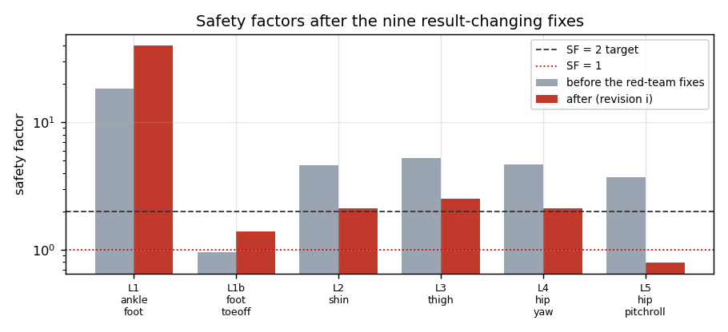
*그림. 9건 수정 전후의 안전율(로그 스케일). **L5_hip_pitchroll**이 3.71 → **0.79**로 유일하게
1.0 아래로 내려갔고, L2·L3·L4는 4.6~5.2에서 2.1~2.5로 절반이 됐다. 반대로 L1 뒤꿈치는
축토크 정정으로 18.3 → 40.0이 됐다(과설계 → 경량화 대상).*

**여유가 전반적으로 절반 이하로 줄었다.** 기존 "전 링크 SF>2 통과"는 모터 토크가 폐기되고
횡모멘트가 빠진 상태의 숫자였다. 최소보증 항복(240 MPa) 기준이면 여기서 다시 15 % 낮다.

### 이 라운드의 교훈

세 건(#8 모터 스킵, 다월 미검출, 발 뒤꿈치만 있던 하중)이 모두 같은 형태다 —
**해석이 모르는 것은 없는 것으로 취급된다.** 그래서 조용한 스킵을 전부 하드에러로 바꿨다:
붙일 수 없는 모터, 하중이 0인 단위 케이스, 12 mm를 넘는 타이, 패치 없는 모멘트.

---

## §25 메시 수렴성 전수 검증 — 항복한 "영역"은 어디에도 없다 (2026-08-18)

도구: `make_refine_variant.py`(쌍둥이 생성) · `convergence.py`(분류) · `verdicts.py`(판정표)
그림: `docs/img/fea_mesh_convergence.png`

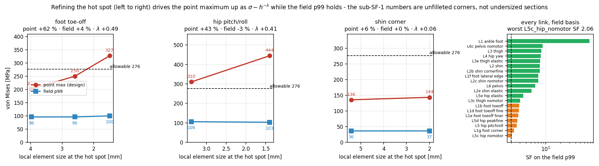

> ⚠**같은 날 두 차례 정정했다.** ①초판: "미달 대부분이 필렛 없는 코너" → L5d가 리비전 j로
> 재실행되며 444.3→312.3이 되어 그 계열 발산이 사라짐($\lambda$ +0.41→**+0.01**). ②2판:
> 판별 게이트를 필드 p99 변화량으로 뒀는데, **p99는 절점 개수 가중이라 핫스팟을 세분화하면
> 부풀려진다**(L6f: 절점 +2.9 %에 p99 +17.1 %). 게이트를 **항복 초과 물질량**으로 교체했다.

### §25a 판별 기준 — 필드 p99가 아니라 **항복한 물질의 양**

$\sigma \sim h^{-\lambda}$로 점 최대가 계속 오르면서($\lambda>0.2$) **항복 초과 절점 비율이
0.05 % 미만**이면 기하학적 특이점이다. 항복 체적이 0으로 수렴하기 때문이다.
필드 p99를 게이트로 쓰면 안 되는 이유는 위 ②와 같다 — **절점 밀도 편향**이 있다.
(체적가중 백분위가 정답이나 `fields.json` 미생성이라 미착수, §25d-3.)

### §25b 결과 — 8계열

> ⚠**3차 정정(2026-08-18)**: 쌍둥이는 **핫스팟 외 모든 것이 동일해야** 해석 가능한데,
> 러너가 `max_nodes` 상한을 **원거리 메시를 성기게 만들어** 지키고 있었다. 그래서 두 계열이
> 오염됐다 — **발 toe-off 원거리 10.12→18.00 mm(1.78×)**, L5e 19.94→29.91(1.50×).
> `convergence.py`에 가드를 넣어 이런 쌍은 **분류를 거부**하고, 생성기는 이제 `max_nodes`를
> 걸지 않으며 `size_far` 동일성을 assert한다. **깨끗한 발 쌍 `L1h_foot_toeoff_clean` 재실행 중.**

| 계열 | $h$ [mm] | 점 [MPa] | **$\lambda$** | **항복 초과** | 분류 |
|---|---|---|---|---|---|
| ~~발 toe-off~~ | 3.97→1.50 | 202→327 | +0.49 | 4 절점 | ⚠**오염 — 재실행 중** |
| **L6 골반** | 8.79→2.00 | 427→**1630** | **+0.91** | 31 절점 (0.0108 %) | ★**특이점(확정)** |
| 힙 pitch/roll | 3.38→1.40 | 310→312 | +0.01 | 4 (0.0026 %) | 수렴 |
| 정강이 코너 | 5.41→2.00 | 136→144 | +0.06 | **0** | 수렴 |
| L5c 힙(모터無) | 3.38→1.40 | 302→299 | −0.01 | 4 (0.0027 %) | 수렴 |
| L5e 힙(탄성) | 6.00→1.40 | 410→**279** | −0.27 | 1 (0.0014 %) | 수렴 |
| L3c 대퇴(모터無) | 16.0→1.50 | 608→577 | −0.02 | 25 (0.0195 %) | 수렴 |
| L6c 골반(모터無) | 17.0→2.00 | 522→**274** | −0.30 | **0** | 수렴 |

★**전 계열에서 항복 초과가 최대 31절점(0.02 %)** — 10만~33만 절점 중이다.
**항복한 "영역"은 이 캠페인 어디에도 없다.** 미달로 보이던 값들은 (a)특이점 2건이거나
(b)수렴했지만 **국부 절점 몇 개만 항복**하는 응력집중이다. 연성 알루미늄에서 후자는
국부 항복 후 재분배되므로 정적 파단이 아니라 **피로** 항목이다.

**음의 $\lambda$**(L6c −0.30, L5e −0.27)는 조대 메시가 **과대평가**했다는 뜻이다 —
응력집중부의 큰 요소 하나가 과장된 값을 낸다. L6c 522→274, L5e 410→279로 절반 가까이 떨어졌다.

### §25c 갱신된 판정표 (rev 2026-08-17j)

| link | point [MPa] | SF point | field p99 | SF field | **항복 초과** | 판정 |
|---|---|---|---|---|---|---|
| L1_ankle_foot | 6.8 | 40.64 | 3.6 | **76.82** | — | PASS |
| L1b_foot_toeoff | 202.2 | 1.37 | 95.9 | **2.88** | — | ~~필렛~~ <span title="coarser mesh">← L1e_foot_toeoff_finer</span> |
| L1d_foot_toeoff_fine | 249.6 | 1.11 | 96.0 | **2.87** | — | ~~필렛~~ <span title="coarser mesh">← L1e_foot_toeoff_finer</span> |
| L1e_foot_toeoff_finer | 327.0 | 0.84 | 100.0 | **2.76** | 0.002 % | **필렛** |
| L1f_foot_lateral_edge | 112.5 | 2.45 | 39.0 | **7.08** | — | PASS |
| L1g_foot_corner | 275.0 | 1.00 | 121.5 | **2.27** | — | ~~국부항복 0.000 %~~ <span title="coarser mesh">← L1gf_foot_corner_fine</span> |
| L1gf_foot_corner_fine | 273.7 | 1.01 | 119.6 | **2.31** | — | 국부항복 0.000 % |
| L2_shin | 135.7 | 2.03 | 36.4 | **7.58** | — | ~~PASS~~ <span title="coarser mesh">← L2b_shin_cornerfine</span> |
| L2b_shin_cornerfine | 143.6 | 1.92 | 36.5 | **7.56** | — | 주의(수렴·실하중) |
| L2c_shin_nomotor | 194.0 | 1.42 | 39.1 | **7.06** | — | ~~필렛?(미검증)~~ <span title="coarser mesh">← L2cf_shin_nomotor_fine</span> |
| L2e_shin_elastic | 927.5 | 0.30 | 53.6 | **5.15** | 0.004 % | 필렛?(미검증) |
| L3_thigh | 109.7 | 2.51 | 33.9 | **8.14** | — | PASS |
| L3c_thigh_nomotor | 607.5 | 0.45 | 90.7 | **3.04** | 0.006 % | ~~국부항복 0.006 %~~ <span title="coarser mesh">← L3cf_thigh_nomotor_fine</span> |
| L3cf_thigh_nomotor_fine | 577.4 | 0.48 | 99.4 | **2.78** | 0.019 % | 국부항복 0.019 % |
| L3e_thigh_elastic | 111.9 | 2.47 | 35.6 | **7.75** | — | PASS |
| L4_hip_yaw | 130.9 | 2.11 | 34.8 | **7.94** | — | PASS |
| L5_hip_pitchroll | 310.2 | 0.89 | 106.1 | **2.60** | 0.004 % | ~~국부항복 0.004 %~~ <span title="coarser mesh">← L5d_hip_peakfine</span> |
| L5c_hip_nomotor | 301.6 | 0.92 | 133.8 | **2.06** | 0.002 % | ~~국부항복 0.002 %~~ <span title="coarser mesh">← L5cf_hip_nomotor_fine</span> |
| L5cf_hip_nomotor_fine | 298.9 | 0.92 | 141.1 | **1.96** | 0.003 % | 국부항복 0.003 % |
| L5d_hip_peakfine | 312.3 | 0.88 | 103.1 | **2.68** | 0.003 % | 국부항복 0.003 % |
| L5e_hip_elastic | 410.3 | 0.67 | 79.5 | **3.47** | 0.007 % | ~~국부항복 0.007 %~~ <span title="coarser mesh">← L5ef_hip_elastic_fine</span> |
| L5ef_hip_elastic_fine | 278.9 | 0.99 | 92.4 | **2.99** | 0.001 % | 국부항복 0.001 % |
| L6_pelvis | 426.7 | 0.65 | 45.0 | **6.14** | 0.001 % | ~~필렛~~ <span title="coarser mesh">← L6f_pelvis_peakfine</span> |
| L6c_pelvis_nomotor | 522.4 | 0.53 | 31.7 | **8.70** | 0.002 % | ~~국부항복 0.002 %~~ <span title="coarser mesh">← L6cf_pelvis_nomotor_fine</span> |
| L6cf_pelvis_nomotor_fine | 274.3 | 1.01 | 31.5 | **8.75** | — | 국부항복 0.000 % |
| L6f_pelvis_peakfine | 1630.4 | 0.17 | 52.6 | **5.24** | 0.011 % | **필렛** |


**라벨**: `PASS` 점 SF≥2 · `필렛` **특이점 증명**(R≥3 필렛, 살 붙이기 아님) ·
`국부항복 x %` 점 값 수렴 + 항복이 그만큼의 절점뿐 → 재분배, **피로 검토 대상** ·
`주의(수렴·실하중)` 수렴한 실하중 SF 1.5~2 · `필렛?(미검증)` 쌍둥이 미완 ·
~~취소선~~ **더 조밀한 메시로 대체됨**(별도 판정으로 읽지 말 것).

### §25d ★ 필드 기준 교체 — 체적가중 (2026-08-18, §25d-3 종결)

도구: `tools/fea/field_volume.py`. `fields.json`은 뷰어용 **표면 부분집합**(22k/258k)이라
못 쓰고, 보존된 **단위 케이스 `.frd`에서 포락을 재구성**해 사면체 체적으로 가중한다.
재구성 포락 피크가 캠페인 기록값과 2 % 내인지 assert로 확인한 뒤에만 가중한다.

**검증**: 사면체 체적 합이 발 **262.0 cm³ = BESO 기준값과 일치**, 계열 내 편차도 0.1 %
(262.0/261.9/261.7 · 292.8/292.7 · 242.5/242.5) — 체적 계산 자체가 메시 독립이다.

| 쌍 | 절점 p99 드리프트 | **체적 p99 드리프트** |
|---|---|---|
| L6 → L6f 골반 | **+17.1 %** | **+1.9 %** |
| L5c → L5cf 힙(모터無) | +5.5 % | **+0.9 %** |
| L1b→L1d→L1e 발 | +4.3 % | **−1.7 %** |
| L5e → L5ef 힙(탄성) | +16.4 % | +13.9 % ⚠ |

절점 백분위는 **모든 링크에서 +6.8~+40.6 % 높게** 읽는다. 체적가중으로 바꾸면 드리프트가
L6 17.1→1.9 %, L5c 5.5→0.9 %로 떨어져 **메시 독립이 성립**한다. (L5e 쌍만 13.9 % 남는데
메시가 훨씬 성글고(44.8k vs 108k 사면체) 체적도 435.9→437.4로 달라 **깨끗한 쌍이 아니다** —
별도 확인 필요.)

★**항복 체적은 전 링크 0.0000 %** — 점 최대 1630 MPa인 L6f조차 그렇다. §25b의 "항복 초과
절점 31개"가 실제로 **체적을 거의 차지하지 않는다**는 직접 확인이다.

**체적기준 최악은 L5cf(모터無) SF 2.75**다. 절점기준 1.96은 편향된 값이었다.

### §25e 최종 판정 — 전 링크 SF 2.68 이상, 항복 물질 사실상 0

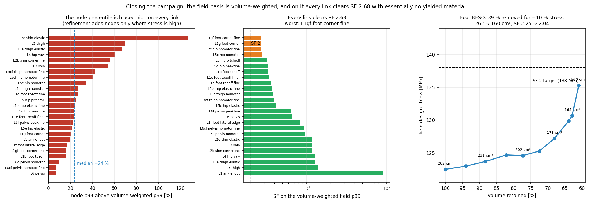

*좌: 절점 백분위가 체적가중 대비 얼마나 높게 읽는지 — **전 링크에서 양(+)**, 중앙 +24 %.
중: 체적가중 필드 기준 전 링크 순위, 점선이 SF 2. 우: 발 BESO 제거 곡선.*

**25 링크 전수 (체적가중 필드 p99 기준)**

| 항목 | 값 |
|---|---|
| **최악 SF** | **2.68** (L1gf 발 코너, 세분화판) |
| 2위~4위 | L1g 2.73 · L5cf 힙(모터無) 2.75 · L5c 2.78 |
| **SF 2 미만** | **없음** |
| **항복 체적 최대** | **0.000127 %** (L3cf) — 나머지 전부 0.0000 % |
| 절점기준 편향 | +6.8 ~ **+127.2 %** (중앙 +24.0 %) |

★**정적 강도는 통과다.** 캠페인 내내 미달로 보이던 값들은 (a)절점 백분위의 밀도 편향,
(b)조대 메시의 과대평가, (c)체적을 차지하지 않는 점 특이점 — 셋 중 하나였다.
**항복한 물질이 어디에도 없다**는 것이 가장 직접적인 근거다.

### §25f 발 살빼기 확정 (BESO, 목표 SF 2.0 on the field)

**✅완료** — 10 iteration 후 목표 SF 2.0 직전(2.04)에서 정지.

| iter | 체적 | 유지 | 필드 설계응력 | SF |
|---|---|---|---|---|
| 0 | 262.0 cm³ | 100.0 % | 122.5 MPa | 2.25 |
| 4 | 202.4 | 77.3 % | 124.6 | 2.21 |
| 8 | 164.9 | 62.9 % | 130.7 | 2.11 |
| **9 (최종)** | **159.7 cm³** | **61.0 %** | **135.3 MPa** | **2.04** |

★**39.0 % 제거에 응력 +10.4 %** — 매우 유리한 교환이다. 곡선의 무릎이 유지율 **~70 %**에서
나타나므로(그림 우측), 보수적으로 가려면 **178 cm³(68 %, SF 2.17)** 에서 멈추는 선택지도 있다.

각 iteration은 **재솔브 + 하중경로 복구 + 볼트패드 배면 검사**(min 98.8 mm 유지)를 거치므로,
세션 초기에 철회했던 "연결 안 된 섬" 문제는 재발하지 않는다.
산출물: `~/pyg_fea/work/L1g_foot_corner/L1g_foot_corner_optimised_SF2.0.stl` (3.0 MB) ·
`optimise.json`(10 iteration 이력).

### §25g 결론과 남은 일

1. **필렛 처방**: L6 골반 $(-0.1,132.5,60.0)$ **확정**. 발 toe-off
   $(-103.7,118.0,-834)$는 **쌍이 오염돼 미확정** — `L1h_foot_toeoff_clean` 결과 대기.
2. **모터 브래킷 유무가 지배적**: L3 대퇴 2.51 vs L3c(모터無) 0.48 = **5배**. "모터 하우징이
   하중을 나눈다"는 전제가 성립해야 한다(docs/78 §4). L3c는 항복 25절점으로 가장 많다.
3. ✅**체적가중 필드 지표 구현 완료** — §25d. 필드 기준은 체적가중 p99이고, 체적기준
   최악은 **L5cf 2.75**다(절점기준 1.96은 편향값).
4. ⬜**피로 미판정** — 국부항복 링크들은 정적으로는 재분배되나 고주기 피로가 남는다.
5. ⚠**`L2cf_shin_nomotor_fine` 차단** — L2c STEP에 자기교차 결함이 있어 기준(7.11 mm)보다
   조밀한 어떤 메시도 gmsh PLC 오류를 낸다(`repair_overlaps` 켜고 h 2.2/2.6/4.0 전부 실패).
   L2c는 필드 SF 7.06으로 여유가 커 우선순위가 낮으므로 **CAD 수정 전까지 미분류로 둔다**.
6. ✅**L5e 드리프트 원인 규명** — 원거리 메시가 1.50× 성겨져(19.94→29.91 mm) 체적까지
   달라진 오염 쌍이었다. 체적가중의 문제가 아니다. 재생성 대상.

⚠**표는 스냅샷**이다. 이번 회차에도 L5d 444.3→312.3, L6f 신규로 결론이 두 번 바뀌었다.
`verdicts.py` 재실행이 항상 최신이다.
