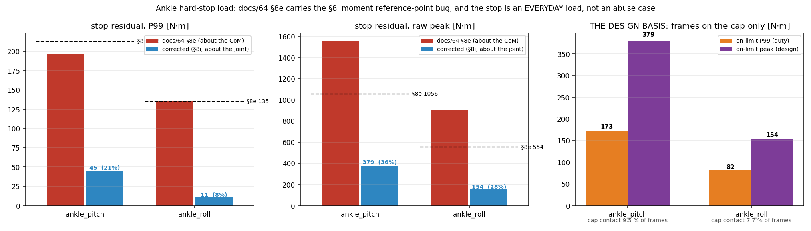

# 78. 발목 크랭크 스토퍼 — 유도 과정 (2026-08-16)

Fusion 설계 파라미터에서 출발해 **AB 모터 하드스토퍼 각도·접촉좌표·하중**까지 어떻게 나왔는지의 전 과정.
결론만 필요하면 §9 요약표로.

---

## §1 좌표계와 부호 규약

| 항목 | 정의 |
|---|---|
| CAD 좌표 | $x$ 좌우, $y$ 전후(**+y = 뒤쪽 = 앵커 쪽**), $z$ 상하(+ 위) |
| 설계 좌표 | RP(발목 중심)를 원점으로 옮긴 CAD 좌표. RP 중심 = $(-123.7,\,145.0,\,-800.0)$ |
| 발 자세 | $R(p,r) = R_{\text{pitch}}(p)\,R_{\text{roll}}(r)$, **+pitch = 배굴**(발끝 올림, FK 검증됨) |
| 크랭크각 $\varphi$ | 크랭크 핀이 피벗에서 **+y 수평일 때 0**, 핀이 **위로(+z) 돌 때 +** |
| ROM 박스 | pitch $-50^\circ \sim +30^\circ$ × roll $\pm 20^\circ$ (학습 명령 범위) |

두 크랭크는 좌우 미러: 모터 B는 모터 A와 같은 식에 **B 파라미터를 넣고 roll 부호만 반전**하면 된다.

## §2 설계 파라미터 (Fusion 사용자 파라미터, CAD 실측과 일치 확인)

$$A_r = 65,\quad B_r = 62,\quad A_L = 289,\quad B_L = 195$$
$$RP_r = 43.6,\quad RP_B = 50.5,\quad RP_h = 10,\quad A_h = 41,\quad B2RP = 200,\quad A2B = 100 \ \ [\text{mm}]$$

모터 축 높이: A는 $A_z = B2RP + A2B = 300$, B는 $A_z = B2RP = 200$ (설계 좌표 기준).

## §3 1단계 — 발이 기울면 로드 앵커가 어디로 가나

앵커의 중립 위치는 $(\,RP_r,\ RP_B,\ -RP_h\,)$. 발이 $(p, r)$로 기울면

$$\mathbf{w}(p,r) = R_{\text{pitch}}(p)R_{\text{roll}}(r)\begin{pmatrix} RP_r \\ RP_B \\ -RP_h \end{pmatrix}
= \begin{pmatrix}
c_r\,RP_r + s_r(-RP_h) \\
-s_p s_r\,RP_r + c_p\,RP_B + s_p c_r(-RP_h) \\
-c_p s_r\,RP_r - s_p\,RP_B + c_p c_r(-RP_h)
\end{pmatrix}$$

($c_p=\cos p$ 등. 모터 B는 $r \to -r$.)

## §4 2단계 — 로드 길이 구속을 크랭크 평면으로 사영

크랭크 핀은 모터 축 둘레의 원 위에 있다:

$$\mathbf{T}(\varphi) = \big(A_h,\ \ r_c\cos\varphi,\ \ A_z + r_c\sin\varphi\big)$$

로드는 길이 $L$의 **2력 부재**이므로 $|\mathbf{w}-\mathbf{T}| = L$. 좌우 성분은 $\varphi$와 무관하므로 분리한다:

$$D_x = w_x - A_h \quad(\text{고정}), \qquad
R_c^2 \equiv L^2 - D_x^2$$

즉 크랭크 평면(yz) 안에서는 **반지름 $R_c$ 의 원 구속**이 된다. $E_y = w_y,\ E_z = w_z - A_z$ 로 두면

$$(E_y - r_c\cos\varphi)^2 + (E_z - r_c\sin\varphi)^2 = R_c^2$$

## §5 3단계 — 닫힌 해

전개하고 $\cos,\sin$ 항을 모으면

$$E_y\cos\varphi + E_z\sin\varphi = \underbrace{\frac{E_y^2 + E_z^2 + r_c^2 - R_c^2}{2\,r_c}}_{\displaystyle k}$$

좌변은 $\rho\cos(\varphi - \beta)$, 단 $\rho = \sqrt{E_y^2+E_z^2},\ \beta = \operatorname{atan2}(E_z, E_y)$. 따라서

$$\boxed{\ \varphi = \beta \pm \arccos\frac{k}{\rho}\ }$$

**분기 선택**: 이 설계 박스 전역(0.05° 격자 128만 자세 + 랜덤 20만)에서 **항상 $+\arccos$** 가 정답이고, 반대 분기와의 간격이 최소 45.8°라 경계 근처도 아니다. 또 $E_y \ge 28.2\text{ mm} > 0$ 이라 `atan2` 대신 `atan`을 써도 안전하다(Fusion 수식에 그대로 넣을 수 있는 이유). 정의역도 $|k/\rho| \le 0.921$ 로 여유가 있다.

## §6 4단계 — 숫자로 한 번 (모터 A, pitch −50 / roll −20)

| 단계 | 값 |
|---|---|
| 앵커 $\mathbf{w}$ | $(+44.3908,\ +28.2359,\ +42.2303)$ |
| $D_x = w_x - A_h$ | $+3.3908$ |
| $E_y,\ E_z = w_z - A_z$ | $+28.2359,\ -257.7697$ |
| $\rho$ | $259.3115$ |
| $R_c^2 = L^2 - D_x^2$ | $83509.50$ |
| $k$ | $-92.6310$ → $k/\rho = -0.35722$ |
| $\beta = \operatorname{atan2}(E_z,E_y)$ | $-83.7488^\circ$ |
| $\delta = \arccos(k/\rho)$ | $+110.9295^\circ$ |
| $\varphi = \beta + \delta$ | $\mathbf{+27.1807^\circ}$ |

중립(0,0)에 같은 절차를 적용하면 $\varphi_0^A = -19.0530^\circ$. 따라서 **중립 기준 +46.23°** — 이것이 모터 A의 HI 스톱이다.

## §7 5단계 — ROM 박스 전체를 훑어 극값 뽑기

pitch·roll 격자(0.25° 간격, 약 9.7만 자세)로 $\varphi$를 계산하면:

| | 절대 $\varphi$ | 중립 기준 | 발생 자세 |
|---|---|---|---|
| A LO | $-61.874^\circ$ | $-42.82$ | pitch +30, roll +20 |
| A HI | $+27.181^\circ$ | $+46.23$ | pitch −50, roll −20 |
| B LO | $-55.930^\circ$ | $-41.69$ | pitch +30, roll −20 |
| B HI | $+35.407^\circ$ | $+49.65$ | pitch −50, roll +20 |

**극값이 코너에서 나오는 이유**: $\varphi$ 는 pitch·roll 각각에 대해 **단조**다(0.05° 격자 전 구간에서 부호 변화 0). A는 pitch·roll 모두에 감소, B는 pitch에 감소·roll에 증가. 단조 함수의 극값은 항상 정의역 모서리에 있으므로, 격자를 아무리 세분해도 위 값은 바뀌지 않는다.

네 코너 전체:

| 자세 | $\varphi_A$ | $\varphi_B$ |
|---|---|---|
| p−50 r−20 | **+27.181** | +16.735 |
| p−50 r+20 | +10.418 | **+35.407** |
| p+30 r−20 | −29.165 | **−55.930** |
| p+30 r+20 | **−61.874** | −24.545 |

## §8 6단계 — 스토퍼가 "가동한계에 정확히"여야 하는 이유, 그리고 그것만으론 부족한 이유

- **여유를 주면 안 된다**: 제어 오버슛은 소프트웨어 리미트의 몫이다. 하드스톱을 5° 밖에 두면 그만큼 미검증 영역이 열린다.
- **그런데 크랭크 스톱만으로는 볼조인트를 못 지킨다**: 모터별 독립 스톱은 $(\varphi_A,\varphi_B)$ 공간에서 **축에 나란한 직사각형**만 만들 수 있는데, ROM 박스의 상(image)은 상관계수 $+0.713$ 의 **비스듬한 띠**다(pitch는 두 크랭크를 같이, roll은 반대로 움직이므로). 직사각형은 띠보다 크고, 그 초과 영역에서 요동각이 **최대 27.6°** 까지 간다(한계 20°).
- **직사각형을 조여 RP를 ROM 안에 가두면** ROM이 **22.5%** 만 남는다(저굴 전 영역 상실) — 감내 불가.
- **원인은 롤**: 요동각 지표는 $\arcsin|\mathbf{u}\cdot\hat{x}_{\text{foot}}|$ (로드가 발 좌우축에서 기운 정도)이고, 발을 좌우로 기울이는 것은 롤이다. 실제로 최악점은 **pitch +2.8°, roll ±40°** — 거의 중립 피치.

| 짐벌 스톱 | 최대 요동각 | 남는 ROM |
|---|---|---|
| 없음 / **피치만** | 40.34° ❌ | 100% |
| **롤만 (±20°)** | **19.33°** ✅ | **100%** |
| 둘 다 | 19.33° ✅ | 100% |

→ **롤 하드스톱이 필수이자 충분**, 피치 스톱은 미검증 자세영역 차단용 보험, 크랭크 스톱은 3차 방어선.

## §9 7단계 — 스톱 접촉 좌표

접촉점은 크랭크 평면 위의 반경 $r_s$ 원 위에 있다:

$$\mathbf{C}(\varphi) = \mathbf{P}_{\text{pivot}} + r_s\,(0,\ \cos\varphi,\ \sin\varphi), \qquad
\hat{n}(\varphi) = (0,\ -\sin\varphi,\ \cos\varphi)$$

($\hat n$ = 접촉점의 운동 방향 = 스톱면 법선.)

**모터 A** (피벗 $(-82.7,145,-500)$, $r_c$ 65):

| $r_s$ | LO $\varphi=-61.874^\circ$ | HI $\varphi=+27.181^\circ$ |
|---|---|---|
| 30 | (−82.7, 159.14, −526.46) | (−82.7, 171.69, −486.30) |
| 35 | (−82.7, 161.50, −530.87) | (−82.7, 176.13, −484.01) |
| **40** | **(−82.7, 163.86, −535.28)** | **(−82.7, 180.58, −481.73)** |
| 45 | (−82.7, 166.21, −539.69) | (−82.7, 185.03, −479.44) |

법선: LO $(0,+0.882,+0.471)$ / HI $(0,-0.457,+0.890)$ · 스윕 89.06°

**모터 B** (피벗 $(-164.7,145,-600)$, $r_c$ 62):

| $r_s$ | LO $\varphi=-55.930^\circ$ | HI $\varphi=+35.407^\circ$ |
|---|---|---|
| 30 | (−164.7, 161.81, −624.85) | (−164.7, 169.45, −582.62) |
| 35 | (−164.7, 164.61, −628.99) | (−164.7, 173.53, −579.72) |
| **40** | **(−164.7, 167.41, −633.13)** | **(−164.7, 177.60, −576.82)** |
| 45 | (−164.7, 170.21, −637.28) | (−164.7, 181.68, −573.93) |

법선: LO $(0,+0.828,+0.560)$ / HI $(0,-0.579,+0.815)$ · 스윕 91.34°

**스트라이커 핀 보정**: 지름 $d$ 핀이 평면 보스를 때리면 핀 중심은 기하 각도보다 $\arcsin\!\big(d/2r_s\big)$ 만큼 못 미쳐 멈춘다(예: $d$ 8, $r_s$ 40 → 5.74°). 보스면을 그만큼 바깥으로 옮기거나, 위 접촉점을 지나고 위 법선을 갖는 평면으로 정의하면 보정 불필요.

## §10 8단계 — 스토퍼 하중  ⚠**2026-08-17 폐기 — §12·§13이 대체**

> 아래 표의 기준(로드 설계하중 2,060 N을 거꾸로 써서 크랭크 토크 134 N·m)은 **순환논법**이다:
> 로드가 한계 부재라고 가정하고 스톱을 그 용량에 맞춘 것이라 "스톱에 실제로 얼마가 걸리나"를
> 묻지 않았다. 실측 스톱잔여모멘트로 다시 잡으면 크랭크 토크는 **499.4 N·m(3.7배)**, 로드력은
> **9,325 N**으로 JS6 정격($C_0$ 5,003 N)을 **1.9배 초과**한다 → §13a.
> **결론 방향(§8의 "롤 짐벌 스톱 필수·충분")은 유지**되며 오히려 강화된다.
> 아래 접촉좌표(§9)와 2단 범퍼 구성은 그대로 유효하다.

크랭크를 밀어붙이는 최악은 모터가 아니라 **발에서 로드를 통해 들어오는 힘**이다.

$$\tau_{\text{stop}} = F_{\text{rod}} \cdot r_c, \qquad F_{\text{contact}} = \frac{\tau_{\text{stop}}}{r_s}$$

| 구동원 | 크랭크 토크 | $r_s=40$ 에서 접촉력 |
|---|---|---|
| RS03 스톨 60 N·m | 60 N·m | 1,500 N |
| **로드 설계하중 2,060 N**(P99×1.875) × $r_c$ 65 | **134 N·m** | **3,348 N** |

- 알루미늄 파고들기 한계 $0.9\sigma_y = 248$ MPa 기준 필요 패드 면적 **13.5 mm²**(정적) — 6×3 mm 패드면 충분
- 충격은 별개: **우레탄 범퍼(Shore 90A) + 뒤쪽 금속 하드스톱** 2단, 보스는 정강이판에 **일체 가공**(M4 4.6급 볼트 체결 금지)
- **배치**: 로드 선이 모터 축에서 최소 30.5 mm(A)/35.6 mm(B)까지 접근하므로, 보스는 반드시 **크랭크의 모터 쪽 면**(A: $x>-82.7$, B: $x<-164.7$)

## §11 검증 기록

| 항목 | 결과 |
|---|---|
| 닫힌 해 vs 수치 IK | 최대 오차 $2.8\times10^{-14}$ deg (128만 자세) |
| 분기($+\arccos$) 타당성 | 반대 분기와 최소 간격 45.8°, 위반 0/1,282,401 |
| $E_y>0$ (atan 안전) | 최소 28.2 mm |
| 극값의 코너 지배 | 단조성 위반 0 → 격자 세분화와 무관 |
| CAD 파라미터 일치 | 9개 전부 확정 최적값과 동일 |

시각화: `docs/mujoco/assets/ankle_stopper_rom_trim.png` · 관련: [[76_ankle_2rsu_design_summary]] §10c(폐형식) · `docs/fusion_ankle_phi_expressions.md`

---

## §12 하중 기준 정정 — §10의 기준이 틀렸다 (2026-08-17)

도구: `tools/ankle_stop_residual.py`(하중 기준 재측정) · `tools/ankle_stopper_sizing.py`(사이징)

*좌·중: docs/64 §8e(빨강)와 §8i 보정본(파랑) — §8e의 pitch P99 213 / peak 1056은 보정 후
45 / 280로 내려간다. 우: 확정 설계기준 — 관절이 **캡에 닿아 있는 프레임만** 골라낸 통계.*

§10은 크랭크 스토퍼 하중을 **로드 설계하중을 거꾸로 써서** 잡았다:
$\tau_{stop} = F_{rod,design} \cdot r_c = 2{,}060 \times 65 = 134$ N·m.
이건 순환논법이다 — 로드가 한계 부재라고 **가정**하고 스톱을 그 용량에 맞춘 것이라,
"실제로 스톱에 얼마가 걸리나"를 묻지 않았다. 측정하면 그 가정이 깨진다.

### §12a 스토퍼가 실제로 받는 것 = 모터가 만들지 않은 몫

$$M_{stop} = M_{constraint} - \tau_{motor}$$

세 가지 기준이 후보였고 **둘은 틀렸다**:

| 출처 | pitch P99 / peak | 판정 |
|---|---|---|
| docs/64 §8e (2026-07-24) | 213 / **1056** | ❌ **§8i 기준점 버그 포함**(모멘트가 관절이 아니라 로봇 CoM 기준). 같은 롤아웃 재계산 시 21 % / 26 %로 내려감. §8c·§8d·§8f엔 붙은 경고가 §8e만 누락돼 있었다 → docs/64에 경고 추가함 |
| 총 관절모멘트 `moments_8i.json` | 56.0 / **152.1** | ❌ **과소**. ①충격 순간 제약모멘트와 모터토크가 **반대 부호**여서 잔여가 관절모멘트보다 크다 ②소스가 `rough.npz` 7,200프레임 **왼다리만·서브샘플**(`recompute_moments.py`의 `_L_` 하드코딩 + `n//4000` — 둘 다 수정함) |
| **✅확정: 실측 스톱잔여, 캡 접촉 프레임만** | **172.5 / 379.0** | 현행 수요풀 **31 롤아웃**(rough + 전 `*_fc`/`*_fcp`) × L/R, **전 프레임**(피크는 단일 프레임이라 데시메이션에 살아남지 않음) |

**확정 설계기준**

| 축 | 상시(on-limit P99) | **설계 peak** | 최악 출처 | 캡 접촉 비율 |
|---|---|---|---|---|
| **pitch** | 172.5 | **379.0 N·m** | bent_fcp / L | **9.5 %** |
| **roll** | 82.1 | **153.8 N·m** | p2b_v2_fc / L | **7.7 %** |

### §12b ★ 스토퍼는 abuse 부재가 아니다 — 상시 하중이다

관절이 시간의 **7.7~9.5 %를 캡에 붙어** 있다. docs/64 §8k의 "상시 접촉" 관측과
docs/72 §3d의 경고("ROM 캡이 사용 밀집대역에 접근할수록 스토퍼 접촉이 일상 하중이 됨")가
둘 다 맞았다 — §3d의 **수치**(peak 490–630 N·m)만 §8c-RT의 기준점 버그를 물려받은 것이었다.

따라서 **정적 강도만으로 판정하면 안 된다**: docs/64 §8j 기준 ~2.2×10⁶ 사이클/100 h에서
접촉면은 **고주기 피로·마모** 부재다(§14-2).

## §13 하중과 요구 단면적 — §10 표 대체

*좌: 반경별 접촉면 하중. 중: SF 2.0 요구 단면적(실선=전단, 파선=베어링).
우: 설계 ROM 전역에서 설계 스톱모멘트가 역구동하는 크랭크 토크 — 최소값조차 RS03 피크의
수 배라 **모터로는 캡 하중을 지탱할 수 없다**.*

6061-T6, SF 2.0: 전단 $\tau_a = 0.577\times276/2 = 80$ MPa · 베어링 $\sigma_a = 207$ MPa.

| 스토퍼 / 구동원 | 토크 | 반경 | 접촉면 힘 | A(전단) | A(베어링) |
|---|---|---|---|---|---|
| AB 크랭크, 지면 구동 | **499.4 N·m** | 40 mm | 12,486 N | 156.8 mm² | 60.3 mm² |
| AB 크랭크, 모터 스톨 | 60.0 N·m | 40 mm | 1,500 N | 18.8 mm² | 7.2 mm² |
| **✅RP 짐벌(롤), 지면 구동 ← 채택** | **409.0 N·m** | 40 mm | 10,225 N | 128.4 mm² | 49.4 mm² |
| | | **60 mm** | **6,817 N** | **85.6 mm²** | 32.9 mm² |
| RP 짐벌, 모터 구동(양 피크) | 113.7 N·m | 60 mm | 1,896 N | 23.8 mm² | 9.2 mm² |

**§10 대비**: 크랭크 토크 134 → **499.4 N·m (3.7배)**, 필요 패드면적 13.5 → 60~157 mm².
§10의 13.5 mm²는 **순환논법 기준 + 안전율 없는 파고들기 한계(0.9σ_y)** 였다.

### §13a ★ 크랭크 스토퍼는 로드엔드를 파단시킨다 — §8 결론의 새 근거

$$F_{rod} = \frac{\tau_{crank}}{r_c\cos\theta}$$

**레버는 크랭크 반경이 아니다.** 로드는 크랭크에 수직이 아니므로 실제 팔은 크랭크축에서
로드 **직선**까지의 수직거리다. 최악은 **크랭크 B, pitch −50 / roll +20**에서 실제 팔
**46.1 mm**(반경 62 mm를 쓰면 −26 % 과소):

$$F_{rod} = \frac{429.8\times10^3}{46.1} = \mathbf{9{,}325\ N}
\quad\Rightarrow\quad s_0 = \frac{C_0}{F} = \frac{5003}{9325} = \mathbf{0.54}$$

**JS6 정적 정격을 1.9배 초과**한다(§7-5 확정 $C_0 = 5{,}003$ N = 510 kgf).
게다가 docs/64 §8k에 따르면 sim 관절리밋은 연성이라(관통 17.7~23.3°) 강체 스토퍼는
관절을 더 급하게 세운다 — 즉 **이 값은 하한**이다.

→ §8이 기구학으로 내린 결론(**롤 짐벌 스톱이 필수이자 충분**, 크랭크 스톱은 3차 방어선)에
**구조적 근거가 하나 더 붙는다**: 크랭크 스톱이 실제로 사건을 받으면 **로드엔드가 먼저 깨진다**.
따라서 크랭크 스톱은 "3차 방어선"이 아니라 **절대 먼저 닿아서는 안 되는 부재**다 —
롤 짐벌 스톱보다 반드시 **뒤에** 닿도록 각도 여유를 배분할 것.

> $s_0$ **기호 주의**: docs/76 §8-2는 $s_0 = C_0/(P99\times1.875) = 2.43$(P99층·설계계수 포함),
> 여기 §13a는 $s_0 = C_0/F_{event}$(사건 하중 직접)다. 같은 기호 다른 정의이므로 병기할 때
> 반드시 분모를 밝힐 것. 1.875 = 1.25×1.5는 **P99층 계수**이며 피크/abuse 하중의 문턱이 아니다.

### §13b 권고 (§10 대체)

- **롤 짐벌 스톱 = 발↔정강이 직접 접촉 패드**(docs/64 §8e 지시: 십자핀 커플 경로 **금지** —
  span 40 mm에서 커플 하중 과대). 반경 **≥60 mm**, 전단 유효면적 **≥86 mm²**
  (예: 폭 22 × 두께 4 mm 리브 2곳). 접촉면은 6061 직접 대신 **강재 인서트** 권장.
- **2단 구성 유지**(§10): 우레탄 범퍼(Shore 90A) 앞, 금속 하드스톱 뒤. 보스는 정강이판 일체 가공.
- **크랭크 스톱**은 모터 스톨 전용(반경 40 mm에서 19 mm²)이며 **롤 짐벌 스톱보다 나중에 닿을 것**.
- §9의 접촉 좌표·법선·스트라이커 핀 보정은 **그대로 유효**(기구학이라 하중 기준과 무관).

## §14 미결

| # | 항목 | 왜 |
|---|---|---|
| 1 | **에너지 기반 범퍼 사이징 미착수** ($\tfrac12 I\omega^2$, 접근 660~1000 °/s) | docs/64 §8k·docs/72 §3d가 요구. 위 단면적은 **강체 접촉 정적**값이고 sim 연성리밋 때문에 **하한**이다 |
| 2 | **접촉면 피로·마모 미판정** | 캡 접촉 7.7~9.5 % = 상시. ~2.2×10⁶ 사이클/100 h |
| 3 | **sim ROM ≠ 설계 ROM** — sim은 pitch −50..**+40**, 설계는 −50..**+30** | 배굴캡이 10° 더 조이면 접촉 빈도·하중이 **증가**. 현 포락은 그만큼 비보수 |
| 4 | 구세대 정책(flat25p1 P1·no-DR) 포함 포락 | docs/62 프로토콜(수렴·in-DR·멀티시드) 재측정 시 완화 여지 |
| 5 | 스토퍼 **굽힘**은 보스 형상 확정 후 별도 | 단면적 답에는 전단·베어링만 포함 |

관련: [[76_ankle_2rsu_design_summary]] §11(ROM 커버리지)·§12(요약) ·
[[64_joint_bearing_design_inputs]] §8c-RT·§8e·§8i·§8k · [[72_ankle_2rsu_objective_spec_and_direction]] §3d ·
[[56_humanoid_impact_fall_load_handling]](계층 스택 — 스토퍼 하나로 최악을 버티게 하지 않는다)
