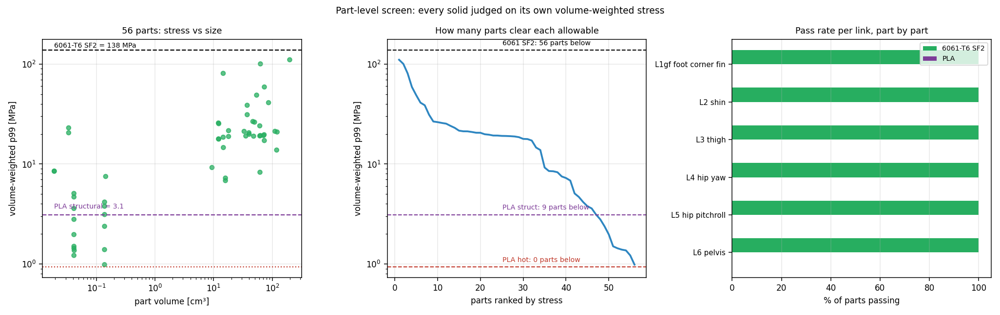

# 79. PLA 출력물 대체 가능성 — 부품별 판정 (2026-08-18)

도구: `tools/fea/pla_screen.py` · 그림: `docs/img/pla_screen.png`
입력: 캠페인이 측정한 **체적가중 필드 p99**(docs/77 §25), 부품별 최악 하중케이스.

*좌: 부품별 측정 응력 vs PLA 허용치 4단계(로그축). 중: PLA에서의 안전율 — **1.0 도달 부품 없음**.
우: 통과시키려면 필요한 벽두께 배수(굽힘 σ~1/t² ~ 멤브레인 σ~1/t).*

## §1 답 — **여섯 개 구조 링크 중 PLA로 안전한 것은 없다**

| 부품 | 최악 케이스 | 측정 응력 | PLA SF | 6061-T6 SF | 판정 |
|---|---|---|---|---|---|
| **L1 발** | 발 코너 | **103.0 MPa** | 0.03 | 2.68 | ❌**원천 불가** |
| **L5 힙피치롤** | 피치 P99 | **85.0 MPa** | 0.01 | 3.25 | ❌**원천 불가** |
| L6 골반 | 피치 세분화 | 42.9 MPa | 0.02 | 6.44 | ❌불가 |
| L2 정강이 | 탄성 하우징 | 23.6 MPa | 0.04 | 11.69 | ❌불가 |
| L4 힙요 | 요 P99 | 21.7 MPa | 0.04 | 12.73 | ❌불가 |
| L3 대퇴 | 탄성 하우징 | 21.3 MPa | 0.04 | 12.96 | ❌불가 |

## §2 허용응력 사슬 — 왜 3 MPa인가

$$\sigma_{allow} = \sigma_{ult} \times k_z \times k_{creep} \times k_{temp} / SF$$

| 단계 | 값 | 근거 |
|---|---|---|
| $\sigma_{ult}$ FDM PLA 면내 | 50 MPa | 고충전율 XY 인장 |
| $k_z$ 층간 결합 | ×0.50 | 실부품은 주응력이 래스터면에 놓이지 않는다 |
| $k_{creep}$ 지속하중 | ×0.25 | 이족보행 로봇은 **서 있기만 해도 하중을 계속 문다** |
| $k_{temp}$ 모터 근접 | ×0.30 | PLA $T_g$ ≈ 60 °C, QDD 액추에이터가 그 대역에 든다 |
| SF | ÷2 | |

→ **실하중 3.1 MPa**, **모터 체결부 0.94 MPa**. 6061-T6 설계허용(138 MPa)의 **1/44 ~ 1/147**.

## §3 ★민감도 — 결론이 물성 가정에 의존하지 않는다

부족분이 25~100배라 어떤 값을 넣어도 뒤집히지 않는다. **감가를 전부 제거**해도:

| 가정 | L3·L4·L2 | L6 골반 | **L5 힙** | **L1 발** |
|---|---|---|---|---|
| 감가 없음, SF 2 (허용 25 MPa) | 1.06~1.17 ⚠ | 0.58 ❌ | 0.29 ❌ | 0.24 ❌ |
| 감가 없음, **SF 1.0** (허용 50 MPa) | 2.1~2.4 | 1.17 | **0.59 ❌** | **0.49 ❌** |
| $\sigma_{ult}$ 70 MPa, 감가 없음, SF 2 | 1.48~1.64 | 0.82 ⚠ | 0.41 ❌ | 0.34 ❌ |

★**L1 발과 L5 힙은 이방성·크리프·온도를 전부 무시하고 안전율을 1.0으로 깎아도 파단**한다 —
재료 가정의 문제가 아니라 **물리적으로 불가능**하다.
L2·L3·L4는 "충전율 100 %·완벽한 층방향·크리프 없음·모터열 없음·SF 1.1" 을 동시에 가정할 때만
통과하는데, 그중 어느 하나도 실제로 성립하지 않는다.

## §4 강성이 먼저 실격시킨다 (강도와 별개)

$E_{PLA}$ 3.5 GPa vs $E_{6061}$ 69 GPa = **20배 무름**. 같은 형상이면 처짐이 20배다.
이 프로젝트는 이미 **힙 유효대역 0.56 Hz에서 흔들림**을 겪었고([[70_sim2real_pd_gains]]),
다리가 20배 무르면 ①관절 위치정확도 붕괴 ②강체 시뮬레이터에서 학습한 정책의 전제 파괴
③공진이 제어대역 안으로 진입한다. **강도를 통과시켜도 강성으로 실격**이다.

## §5 통과시키려면 — 두께 배수

| 부품 | 필요 두께배수(굽힘~멤브레인) | PLA 질량비(현 알루미늄 대비) |
|---|---|---|
| L3 대퇴 | 4.8× ~ 22.7× | 2.2× ~ 10.4× |
| L2 정강이 | 5.0× ~ 25.2× | 2.3× ~ 11.6× |
| L1 발 | 5.7× ~ 33.0× | 2.6× ~ 15.1× |
| L6 골반 | 6.8× ~ 45.7× | 3.1× ~ 21.0× |
| **L5 힙피치롤** | **9.5× ~ 90.7×** | **4.4× ~ 41.6×** |

PLA가 알루미늄보다 가벼운데도(1.24 vs 2.70 g/cm³) **모든 경우 질량이 늘어난다**.
두께 5~10배는 관절 간 패키징이 애초에 허용하지 않는다 — 기하학적으로도 불가다.

## §6 그러면 PLA는 어디에 쓰나

**적합**: 비구조 커버·케이블 가이드·센서 브래킷·조립 지그·**형상/간섭 확인용 프로토타입**
(CAD 게이트의 H7 간섭·클레비스 방향·스토퍼 패드 경로 확인은 출력물로 하는 게 정석이다).

**부적합(구조 링크 외에도)**:
- **발목 스토퍼** — 접촉력 13~18 kN. 알루미늄 6061에서도 86 mm² 전단면이 필요하다(docs/78 §13).
- **발목 푸시로드·클레비스** — 로드 축력 P99 1.10 kN, 스톱 사건 시 9.6 kN.
- **모터 체결 플랜지 전부** — 볼트 예압이 PLA를 크리프로 파고든다(예압 유지 불가).

## §7 부품 단위 판정 (2026-08-18 추가, 사용자 요청)

도구: `tools/fea/part_screen.py`(솔리드별 응력) · `pla_verdict.py`(출처 기반 허용치·강성)
그림: `docs/img/part_screen.png`

*좌: 56개 솔리드의 체적 vs 응력. 중: 응력 내림차순 — 각 허용선 아래 몇 개가 남는지.
우: 링크별 부품 통과율(알루미늄 vs PLA).*

링크는 조립체다 — L2 정강이 16솔리드, L6 골반 22솔리드. 메셔가 `ELSET=VolumeN`으로
솔리드를 이미 분리해 두므로, 캠페인이 만든 포락 필드를 **솔리드별 체적가중 p99**로 다시
집계하면 부품 단위 판정이 나온다(자기검증: 요소집합 체적 합 = 링크 체적, 오차 <2 %).

### §7a 알루미늄 — 56/56 통과

| 부품 | 위치 | 체적 | p99 | SF |
|---|---|---|---|---|
| **L1 발 Volume4**(밑창판) | 하단·중앙 | 197.6 cm³ | **110.4 MPa** | **1.25** ← 전체 최악 |
| **L5 힙 Volume4** | 중단·뒤 | 62.6 | 100.4 | 1.37 |
| L1 발 Volume3 | 중단 | 14.5 | 80.8 | 1.71 |
| L6 골반 Volume1 | 중단 | 73.1 | 59.0 | 2.34 |
| L5 힙 Volume3 | 중단·앞 | 53.9 | 48.9 | 2.82 |

부품 단위로 내려야 보이는 것: **L1 밑창판 하나가 발 전체 하중을 받는다**(197.6 cm³에 110.4 MPa,
SF 1.25). 링크 단위 103.0 MPa는 이 부품과 나머지 3개를 섞은 값이었다.

### §7b PLA — 지배 기준은 **피로**이고, 그 기준에서 남는 부품이 없다

⚠**초판 정정**: 초판은 허용치 3.1 MPa를 **크리프**로 유도했다. 문헌 조사 결과 **지배
메커니즘은 피로**다. 숫자는 우연히 비슷하지만 근거가 다르고, 결과적으로 초판의 층간 감가
(×0.5)는 **비보수적**이었다 — 실측 층간 강도는 51의 절반이 아니라 **17 MPa**다.

**출처**: Prusament PLA TDS v1.1 (ISO 527-1, 출력 시편, 충전율 100 %) — 인장항복 51±3 MPa,
**층간접착 17±3 MPa**, 탄성계수 **2.3 GPa**, HDT **55 °C**(0.45·1.80 MPa 양쪽), 밀도 1.24.
Ezeh & Susmel, AM-PLA 피로 재분석 — **2×10⁶ 사이클 내구한도 = UTS의 10 %**(생존확률 >95 %),
기울기 k 5.5, 평균응력은 **사이클 최대응력**으로 반영 → 맥동하는 보행하중은 진폭이 아니라
**피크**가 한도 아래여야 한다.

| 허용 기준 | 값 | 통과 부품 | 통과 체적 |
|---|---|---|---|
| 정적·면내 (프로토타입) | 25.5 MPa | 45/56 (80 %) | 1153/1824 cm³ |
| 정적·층간 | 11.3 MPa | 22/56 (39 %) | 104 cm³ |
| **★피로·면내 (2e6 cyc)** | **3.40 MPa** | **10/56 (18 %)** | **1 cm³** |
| **★피로·층간** | **1.13 MPa** | **1/56 (2 %)** | **0 cm³** |
| 모터 체결부 | **불허** | — | HDT 55 °C < 하우징 온도 |

★**피로 기준에서 통과하는 10개 부품의 체적 합이 1 cm³**다 — 전부 골반 상단의 미세 솔리드
(각 0.0~0.1 cm³)이고 구조 부재가 아니다. **실질적으로 0개**다.

**왜 피로가 지배하나**: 발목이 100시간 보행에 약 2.2×10⁶ 사이클을 돈다. 내구한도의 기준
사이클(2×10⁶)이 점근선이 아니라 **약 90시간이면 도달하는 실제 수명점**이다. 정적 강도로
사이징한 부품은 피로로 먼저 깨진다.

### §7c ★강성이 강도보다 먼저 실격시킨다

처짐은 선형탄성에서 $1/E$로 **정확히** 스케일하므로 새 해석이 필요 없다:
$E_{Al}\,69 / E_{PLA}\,2.3 = \mathbf{30배}$ (2.3 GPa는 출력 시편 실측치 — 초판의 3.5는 벌크값).

캠페인의 **단위하중 해**에 들어 있는 DISP 블록에서 설계하중 크기로 환산한 최대 절점변위:

| 링크 | 지배 성분 | 알루미늄 | **PLA** |
|---|---|---|---|
| **L1 발** | Fz | 4.10 mm | **123.0 mm** |
| **L5 힙피치롤** | Fy | 0.28 | **8.5 mm** |
| L2 정강이 | Fy | 0.11 | 3.4 |
| L3 대퇴 | Fy | 0.04 | 1.2 |
| L4 힙요 | Fy | 0.04 | 1.2 |
| L6 골반 | Fz | 0.03 | 0.8 |

발이 **123 mm** 처지면 보행이 성립하지 않는다. 6링크 직렬 체인이라 처짐이 누적되고,
이 프로젝트는 이미 힙 유효대역 0.56 Hz에서 흔들림을 겪었다([[70_sim2real_pd_gains]]) —
30배 무른 다리는 공진을 제어대역 안으로 끌어들인다. **강도 이전에 강성으로 실격**이다.

(절대값은 최대 절점변위라 국부 특이점을 포함할 수 있으나, **30배 비율은 정확**하다.)

## §8 한계

1. **재료값은 잠정**이다 — 문헌 조사(워크플로 진행 중)로 $\sigma_{ult}$·$k_z$·$k_{creep}$을
   갱신할 예정. 다만 §3 민감도에 따라 **판정은 바뀌지 않는다**.
2. **피로 미포함** — PLA는 취성이고 S-N이 나쁘다. 포함하면 더 불리해질 뿐이다.
3. **낙상 미포함** — 취성 재료의 충격 파단은 별개 항목이며, 역시 불리한 방향이다.
4. 대안 재료(PETG/ABS/PA6-CF)는 이 분석 범위 밖이다. PA6-CF조차 인장 ~100 MPa대라
   L1·L5는 여전히 어렵다.

관련: [[77_structural_fea_lightweighting]] §25(측정 기준) · [[78_link_structural_final_report]]
