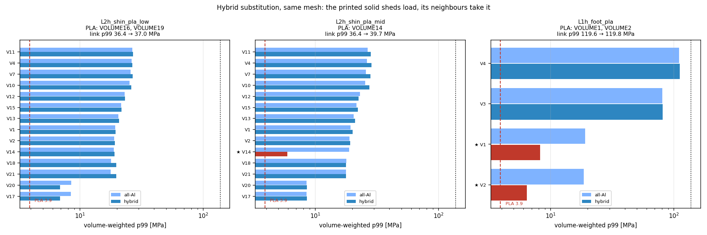

# 80. 하이브리드(알루미늄 + PLA 출력) — 부위별 대치 검증 (2026-08-18)

도구: `tools/fea/run_link_env.py`(`pla_parts` 옵션) · `hybrid_compare.py` ·
그림 `docs/img/hybrid_compare.png` · 재현: `link_specs.json`의 `_hybrid_of` 스펙

## §1 방법 — 스크리닝이 아니라 **재해석**이어야 하는 이유

PLA 부품은 알루미늄의 **1/30 강성**($E$ 2.3 vs 69 GPa)이다. 그래서 대치하면

- **자기 응력은 내려간다** — 무르니까 하중을 이웃에 떠넘긴다
- **이웃 응력은 올라간다** — 떠넘겨진 만큼
- **링크 전체 처짐은 커진다**

현재 응력만 보고 "낮으니 PLA 가능"이라 판정하면 **틀린다**. 실제로 그 솔리드에 PLA 물성을
넣고 다시 풀어야 한다. `femlib.write_deck`이 이미 elset별 재료를 받으므로
`spec['pla_parts']`로 지정하고, **기준 링크의 메시를 그대로 복사**해 두 해석의 차이가
**재료뿐**이도록 통제했다(elset 집합 동일성 assert).

## §2 후보 선정 — 모터 거리가 1차 필터

부품 중심에서 모터 표면까지 거리를 재면 **다수가 음수**다(솔리드가 모터를 감싼다).
PLA의 HDT 55 °C는 하중 무관이므로([[79_pla_material_screen]] §8b) 이들은 **응력과 무관하게 실격**.

| 후보 | 체적 | 현재 p99 | 모터 표면거리 | 비고 |
|---|---|---|---|---|
| L2 정강이 V16+V19 | 15.9×2 | **6.8 / 7.3 MPa**(최저) | 18 mm ⚠ | 열 경계 |
| L2 정강이 V14 | 17.9 | 18.9 | 44 mm ✅ | 열 여유 유일 |
| L1 발 V1+V2 | 35.3+14.5 | 19.1 / 18.6 | 168~180 mm ✅ | **발엔 모터 없음** |

## §3 결과 — 3종 재해석

*파랑=전(전량 알루미늄), 진파랑=후(이웃), 빨강=후(PLA 대치 부품). 빨간 점선이 PLA 허용 3.9 MPa.*

### §3a ✅ **L2 정강이 V16+V19 — 통과**

| 부품 | 위치 | 체적 | 전 | 후 | 변화 | 판정 |
|---|---|---|---|---|---|---|
| ★**V19** | 하단·앞·중 | 15.9 cm³ | 7.25 | **2.20** | **−69.7 %** | **PLA ✅** |
| ★**V16** | 하단·뒤·중 | 15.9 cm³ | 6.84 | **2.44** | **−64.3 %** | **PLA ✅** |
| V21 (이웃 최대) | 하단·앞·좌 | 12.2 | 17.78 | 19.73 | +11.0 % | Al ✅ |
| V18 | 하단·뒤·좌 | 12.1 | 17.85 | 19.75 | +10.7 % | Al ✅ |
| V11 (최대응력) | 중단·중앙·우 | 46.6 | 26.65 | 26.83 | +0.7 % | Al ✅ |

- **링크 필드 p99 36.4 → 37.0 MPa (+1.6 %) · SF 3.79 → 3.73**
- **처짐 0.112 → 0.114 mm (+1.2 %)**
- 대치 체적 **31.8 cm³ / 323.1 cm³ = 9.8 %**

두 부품이 하중의 65~70 %를 벗어던지고 **2.2~2.4 MPa**에 안착한다 — 면내 피로 허용 3.9 아래다.
이웃 상승은 최대 +11 %이고 전부 알루미늄 여유 안이다.

### §3b ❌ L2 정강이 V14 — 미달

18.88 → **5.95 MPa (−68.5 %)**. 65 % 이상 떨궈도 허용 3.9를 못 넘긴다.
게다가 이웃이 최대 **+9.1 %** 오르고 링크 p99가 **+9.1 %**(SF 3.79 → 3.47), 처짐 **+7.0 %**다.
**출발 응력이 너무 높다** — 대치의 이득보다 비용이 크다.

### §3c ❌ L1 발 V1+V2 — 미달 (열 제약은 없는데도)

19.09 → **8.20**, 18.57 → **6.41 MPa**. 57~66 % 떨어져도 허용의 **2배**다.
링크 p99는 거의 안 변하고(119.6 → 119.8, +0.2 %) 처짐만 **+6.7 %**(4.10 → 4.38 mm) 늘었다 —
**이 두 부품은 애초에 발의 주 하중경로가 아니었다**는 뜻이다(밑창판 V4가 110 MPa로 다 받는다).
그런데도 자기 응력이 허용을 못 넘는다.

## §4 판정 — 최대 대치 가능 범위

★**L2 정강이의 V16 + V19 (하단 앞·뒤 중앙 리브, 각 15.9 cm³) 두 점만 대치 가능**하다.
전 구조 체적 1,824 cm³ 중 **31.8 cm³ = 1.7 %**다.

**단, 세 조건이 붙는다**:

1. ⚠**열 — 이게 실질 블로커다.** 두 부품은 RS03 발목 하우징에서 **18 mm**로, 내가 세운 기준
   (≥30 mm)에 못 미친다. 하우징이 권선한계에서 73~90 °C에 이르고 PLA의 HDT는 55 °C다.
   **실측 온도 확인 없이는 이 대치도 승인 불가**다. 확인 방법: 정강이 하단에 열전대를 붙이고
   최악 duty(rough+push)로 30분 주행.
2. ⚠**층방향 — 2.2/2.4 MPa는 면내 허용(3.9) 기준이다.** 층간 허용은 **0.73 MPa**라 그 기준으로는
   3배 초과다. 즉 **주응력이 층면 안에 오도록 출력 방향을 고정**해야 하고, 그게 도면에
   명시돼야 한다. 방향을 못 잡으면 대치 불가.
3. ⚠**볼트 예압이 지나가면 안 된다** — M4 예압 1475 N이 민머리에서 62 MPa 지압으로 PLA 항복
   초과다([[79_pla_material_screen]] §8e). 이 두 부품에 체결이 걸리면 금속 부시나
   관통 슬리브가 필요하다.

## §5 왜 더는 못 늘리나

대치 후보의 조건이 **동시에** 걸린다:

| 조건 | 걸리는 이유 |
|---|---|
| 출발 응력 ≲ 12 MPa | 대치해도 65~70 %까지만 떨어진다(§3 실측) → 3.9 넘기려면 출발이 12 이하여야 |
| 모터 표면 ≥30 mm | 대부분의 솔리드가 모터를 감싸거나 근접(거리 음수) |
| 볼트 예압 없음 | 구조 솔리드 대부분이 체결점을 갖는다 |
| 이웃이 상승분 흡수 | L2는 여유(SF 3.7)가 커 가능했지만 L1·L5는 SF 1.2~1.6이라 여지 없음 |

특히 **L1 발·L5 힙은 링크 SF가 1.15~1.56**이라 이웃에 +10 %를 얹을 여유 자체가 없다.

## §6 한계

1. **선형 정적**이다. PLA의 크리프로 시간이 지나면 하중을 더 떠넘겨 이웃이 더 올라간다 —
   즉 §3a의 +11 %는 **초기값이고 상한이 아니다**.
2. **접촉·타이는 완전 결합**으로 모델링됐다. 실제로는 PLA-알루미늄 계면이 미끄러지거나
   파고들 수 있다.
3. **피로 허용 3.9 MPa 자체가 판단값**을 포함한다([[79_pla_material_screen]] §10).
   0.73(층간)으로 보면 §3a도 실패다.
4. 세 조합만 시험했다. 더 넓은 탐색(예: L6 골반의 저응력 솔리드들)은 미실시.
