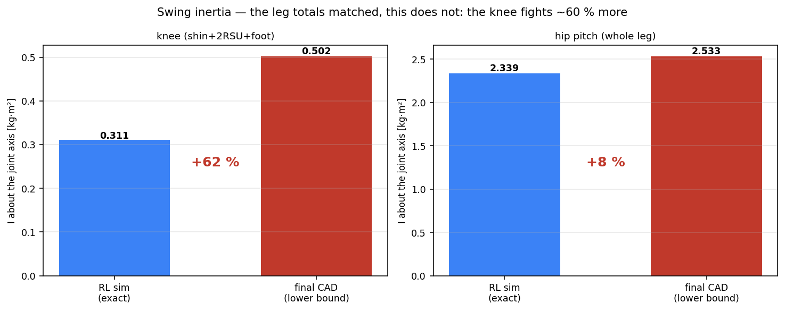

# 81. RL 모델 vs 최종설계 CAD — 질량·형상 대조와 하중 기준 점검

*v1 2026-08-18 (질량만, 모터 배치 추정) · v2 2026-08-20 (사용자 최종설계 표 반영) ·
v3 2026-08-20 (★`Ankle2Feet` 기하 분해로 발 판정 정정: +252/+80 % → +11.8 %) ·
**v4 2026-08-20** (적대적 검증 반영: 발 질량은 **밴드 −18~+12 %**, 발자국 수직 레버 −39 %
추가, 형상 주장 전 항목 재현 확인)*

이 캠페인의 **모든 하중**은 MuJoCo에서 RL 정책을 굴려 측정한 것이다. 그 측정은 시뮬레이터
모델의 질량·관성·**기하**에 직접 의존하므로, 모델이 현 설계와 다르면 하중 기준 전체가 흔들린다.

> 힙피치 축을 원점으로 두 모델을 겹친 것. **아무것도 스케일하지 않았다.** 파랑 = RL 심 모델
> (외피 메시), 빨강 = 최종 CAD(FEA가 실제로 푼 표면). 왼쪽 두 패널이 다리 전체 실루엣,
> 가운데가 구간 길이와 위치별 질량, 오른쪽 6칸이 위치별 형상 겹침, 맨 오른쪽이 발자국이다.

## §1 출처

| | 출처 | 비고 |
|---|---|---|
| RL 모델 | `mjlab/.../pygmalion/xmls/pygmalion.xml` | 총 51.5268 kg, 바디 14개 |
| 최종 CAD (질량) | 사용자 최종설계 질량표 (2026-08-20) | 편측 다리 + 편측 팔 + 중앙, 합 31.021 kg |
| 최종 CAD (형상) | `~/pyg_fea/steps/link_L*.step` → FEA 표면 | 캠페인이 실제로 푼 그 지오메트리 |

★**두 CAD 출처가 같은 어셈블리임을 독립 확인했다** — 나사 개수가 정확히 일치한다:
CenterParts 69개 = `L6_pelvis` 69개, HipPitch2Roll 48 = `L5` 48, PipRoll2Yaw 30 = `L4` 30.
`L2_shin` 알루미늄 본체는 **0.855 kg(캠페인) vs 0.854 kg(사용자 표)** 로 0.1 % 이내 일치한다.

⚠**메시 체적으로 비교하면 안 된다** — RL 메시는 **외피**다. `L_bukji_up_1` 외피 4,815.6 cm³를
알루미늄으로 채우면 13.0 kg인데 선언 질량은 5.10 kg(유효밀도 1.06).

## §2 v1에서 정정한 것

1. ★**RL 발 질량은 1.083 kg이다(1.212 아님).** `pygmalion.xml`의 `L_toe_link` / `R_toe_link`는
   **주석 처리되어 있다**(line 88·138). 총질량 28.089 + 2×11.719 = 51.527로 검산된다.
   v1은 비활성 toe 0.129 kg을 RL 쪽에 더해 격차를 **과소** 보고했다.
2. **모터 배치는 더 이상 추정이 아니다.** v1의 "가정" 행은 사용자 표로 대체됐다.

## §3 ★위치별 질량 — 다리 합은 맞고 분포가 완전히 다르다

CAD 쪽은 두 가지로 읽는다.
- **A** = 사용자 표 그대로(어셈블리 그룹 = 강체로 간주). **틀린 읽기다** — 아래 참조.
- **B** = `Ankle2Feet`를 **기하학적으로 분해**해 각 솔리드를 실제로 붙어 있는 강체에 귀속.

### ⚠ A가 틀린 이유 — `Ankle2Feet`는 링크가 아니라 **메커니즘**이다

솔리드 31개를 열어보면 **z = −503.7(정강이 상부 크랭크)부터 −839.0(밑창)까지** 걸쳐 있고,
JMC-JS06 로드엔드 4개가 **정강이쪽 쌍(−523/−616)** 과 **발쪽 쌍(−810)** 으로 나뉜다.
즉 발목 관절을 가로지르는 **2-RSU 기구 전체**다. 강체 하나가 아니다.

| Ankle2Feet 내역 | 솔리드 | cm³ | kg(Al) | 귀속 |
|---|---|---|---|---|
| 발측 구조 | 5 | 286.88 | 0.775 | 발 |
| ㄴ **캠페인 FEA가 푼 발판** | 4 | **262.07** | 0.708 | 발 |
| ㄴ 발목 크로스(축상) | 1 | 24.81 | 0.067 | 발(관례) |
| **클레비스 포크+브레이스** (y=145, 발목 피치 베어링 홀더) | 4 | **154.38** | 0.417 | ★**정강이 고정** |
| 크랭크+클램프 (모터축 상) | 4 | 85.26 | 0.230 | 정강이(모터와 함께 움직임) |
| **푸시로드 2개** (50/50) — COM이 JMC 볼조인트 중점과 0.1 mm 일치 | 2 | **35.44** | 0.096 | 절반씩 |
| JMC-JS06 볼조인트·플랜지 | 16 | 6.91 | 0.019 | 위치별 |

⚠v3은 62.05 cm³ 쌍(y=145 중앙면)을 로드로 오분류했다. 로드는 볼조인트(y≈195~208)를 잇는
부재여야 하고, **20.11/15.33 cm³ 솔리드의 COM이 각 볼조인트 쌍의 중점과 0.1 mm 이내로
일치**한다(`ankle_group_split.py`가 assert). 62.05 쌍은 발목 피치 베어링(6900ZZ)을 무는
클레비스 포크 = 정강이 구조다.

★**캠페인이 `L1_ankle_foot`으로 푼 262.0 cm³ = 발판 솔리드 4개 262.07 cm³** — 구조 판정과
기하학적 발은 같은 물체다. 나머지 307 cm³는 애초에 발이 아니었다.

### 결과

| 위치 | RL kg | CAD-A(그룹 그대로) | CAD-B(★기하 분해) | %B |
|---|---|---|---|---|
| 힙피치 hip_pitch | 0.967 | 2.262 | 2.262 | **+133.8 %** |
| 힙롤 hip_roll | 1.741 | 1.536 | 1.536 | −11.8 % |
| 대퇴 thigh | 5.104 | 1.476 | 1.476 | **−71.1 %** |
| 정강이 shin | 2.823 | 2.598 | **5.357** | **+89.8 %** |
| **발 foot** | 1.083 | ~~3.818~~ | **1.059** | **−2.3 %** |
| **다리 합(편측)** | **11.719** | 11.690 | **11.690** | **−0.2 %** |

★**질량은 대퇴 → 정강이로 이동했고, 발은 심 모델과 2 % 안에서 같다.** 2-RSU가 발목 모터를 정강이에
올려 발끝 관성을 낮춘다는 설계 의도([[37_ankle_linkage_fidelity]])가 그대로 관철됐다.

⚠**발 1.211 kg은 점추정이 아니라 밴드의 상한이다**(검증 반영). 어디까지를 "발 강체"로
보느냐에 따라: 하한 = FEA가 푼 발판+발측 볼조인트+베어링+안분 나사 = **0.885 kg(−18.2 %)**,
상한 = 발측 구조 전체+로드 절반+안분 체결구 = **1.212 kg(+11.9 %)**. 심 모델 1.083 kg은
**밴드 안**에 있다 — 즉 발 질량 편의는 어느 정의로도 유의하지 않다.

⚠ 정강이 +84.4 %는 무릎 RS04를 표대로 `Knee2Ankle`에 둔 값이다. CAD 기하로는
**정강이 요크가 무릎 축(−310)을 감싸고**(솔리드 COM −329.2 / −336.8) **대퇴 구조는 −235에서
끝나므로** 표의 귀속이 기하학적으로 타당하다. 무릎 모터를 대퇴로 옮겨 읽으면
대퇴 3.034(−40.6 %) / 정강이 3.799(+34.6 %)가 된다 — **발 판정은 어느 쪽이든 −2.3 %로 불변.**

## §4 ★형상 — 무릎이 77 mm 올라갔다

두 모델의 힙피치 축 높이가 **+59.4 mm(RL) vs +60.0 mm(CAD)** 로 사실상 동일하므로, 이를
원점으로 놓으면 나머지 관절 높이는 직접 비교된다(코드에 assert로 강제).

| 관절 축 높이 [mm] | RL | CAD | 차이 |
|---|---|---|---|
| hip_pitch | 0.0 | 0.0 | 0.0 |
| hip_yaw | −137.2 | −157.0 | −19.8 |
| **knee** | −446.5 | **−370.0** | **+76.5** |
| ankle | −846.4 | −860.0 | −13.6 |

| 구간 | RL | CAD | 차이 |
|---|---|---|---|
| 대퇴 hip_pitch→knee | 446.5 | 370.0 | **−76.5 mm (−17.1 %)** |
| 정강이 knee→ankle | 399.8 | 490.0 | **+90.2 mm (+22.5 %)** |
| 다리 전체 | 846.4 | 860.0 | +13.6 mm (+1.6 %) |

**다리 길이는 그대로인데 무릎만 77 mm 올라갔다.** 대퇴:정강이 비가 1.12 → 0.76으로 바뀐다.
질량 재분포(§3)는 이것의 직접 결과다 — 짧아진 대퇴는 가벼워지고 길어진 정강이는 무거워진다.

### 발자국 — GRF가 실제로 작용한 면 (레버는 **발목 피치축** 기준)

| | 전장 | 발끝 레버 | 뒤꿈치 레버 | **밑창↓축 수직 레버** |
|---|---|---|---|---|
| RL 심(콜리전 캡슐, 반경 포함) | 246 mm | 199 | 47 | **70** |
| 최종 CAD(밑창) | 260 mm | 180 | **80** | **43** |
| 변화 | | −9.6 % | **+71.0 %** | **−38.6 %** |

힐스트라이크 발목 피치 모멘트는 M ≈ F_z·(전후 레버) + F_x·(수직 레버)인데 **두 레버가
반대 방향으로 움직였다** — 전후 +71 %, 수직 −39 %. 수직항 몫이 큰 보행(제동 마찰력)에서는
상쇄가 상당하므로, "힐스트라이크 모멘트 과소평가"는 **방향은 맞되 크기는 재측정 없이 단정할
수 없다.** 토우오프 모멘트는 소폭 과대평가(−10 %) 방향.

> 그림의 다리 실루엣에서 CAD(빨강)가 z −587 ~ −785 구간에 비어 보이는 것은 **2-RSU 로드와
> 클레비스가 FEA용 STEP으로 내보내지지 않았기 때문**이지 부품이 없어서가 아니다.

### 검증 상태 (2026-08-20, 적대적 검증 13 에이전트)

형상 주장은 **전 항목이 독립 재현**됐다(관절 높이 0.05 mm 이내, 발자국 수치 일치, toe 주석
확인, 프레임 부호 3중 확인). 검증이 추가로 잡아준 것: ① 무릎은 위로만이 아니라 **앞으로도
~8 mm** 이동(심 +55.3 → CAD +46.9는 후방 이동, 발목은 +67.1 → +76.9 전방 이동 — y 부호
규약상 forward = −y이므로 그림과 함께 읽을 것), ② "다리 길이 +1.6 %"는 힙피치→발목 기준이고
**힙피치→지면**은 916 → 903 mm로 오히려 짧아진다(밑창-축 거리 70 → 43 mm), ③ 관절 좌표를
스크립트에 하드코딩했던 것을 STEP 파생 파일에서 읽도록 고쳤다(리비전 갱신 시 묵은 값을
조용히 보고하는 사고 방지).

## §4b ★스윙 관성 — 총질량이 감춘 진짜 수치: **무릎 +62 %, 고관절 +8 %**

질량 대조(§3)의 "다리 합 −0.2 %"는 결론이 아니라 위장이다. 관성은 질량×거리²이고,
대퇴에서 빠진 질량이 **두 축 모두에서 더 먼 곳**(정강이·2-RSU)에 다시 나타났다.

| 축 | 대상 | RL(정확) | CAD(**하한**) | 변화 |
|---|---|---|---|---|
| **무릎** | 정강이+2-RSU+발 | 0.311 kg·m² (3.91 kg, COM 228 mm) | **0.502** (4.75 kg, COM 287 mm) | **+62 %** |
| 고관절 피치 | 다리 전체 | 2.339 (11.72 kg, COM 354 mm) | 2.534 (12.16 kg, COM 351 mm) | +8 % |

- CAD 쪽은 **점질량 병렬축 하한**(413 솔리드 각자 COM + 모터 실린더 + 표 나사질량)이다.
  빠진 것은 각 솔리드의 자기관성뿐이라 **실제 값은 이보다 크다** — +62 %는 바닥이다.
- ★**무릎 모터 귀속 논쟁(§3)은 이 수치에 무관하다**: RS04가 무릎 축 위에 앉아 있어
  포함/제외 차이가 0.6 %다(코드에 assert). §3에서 "불확정"이라 한 유일한 항목이 관성에서는
  가장 확실한 항목이 된다.
- **고관절은 거의 안 변했다** — 질량이 원위로 갔지만 다리 전체 COM은 354 → 351 mm로
  오히려 살짝 올라와 상쇄됐다.

★따라서 §6의 "고관절·무릎 토크 과소평가"는 **무릎만**으로 좁혀진다. 무릎은 이미 유일한
포화 관절(RS04 수요 112 %, [[ankle-actuator-tn-sizing]])인데, 그 수요가 **관성이 62 % 작은
다리로 측정된 값**이다.

### 심 모델을 고칠 수 있는 범위 (재-export 없이)

| 대상 | 패치 가능? | 근거 |
|---|---|---|
| 다리 질량·COM·관성 | ✅ ~5 % 정밀도 | `fullbody_links.json` 솔리드별 vol+COM + 모터 실린더 |
| 다리 기하(무릎 −370 등) | ❌ | 메시(`bukji_*`)가 옛 형상 — 새 export 필요 |
| **몸통(base_link)** | ❌ **데이터 자체가 없음** | 상체 CAD 없음(§82 참조). base_link는 총질량의 54.5 %,
  발 접점 기준 전신 관성의 **84 %** — 캠페인의 GRF·발목·고관절 하중을 지배하는 항이 검증 불가 |

## §5 프레임 규약이 다르다 (해석 시 주의)

RL 월드는 **전방 = +x, 좌우 = y**, CAD 글로벌은 **전방 = −y, 좌우 = x**다. 겹치려면 z축
−90° 회전이 필요하다. 코드는 이 회전을 가정하지 않고 **검증**한다 — 회전 후 발 캡슐이
CAD 전후축으로 226 mm, 좌우 80 mm가 나오고 toe가 CAD의 전방쪽(−y)에 놓여야 통과한다.

## §6 ★하중 기준에 미치는 영향

| 항목 | 방향 | 근거 |
|---|---|---|
| **무릎 스윙 관성** | **과소평가 +62 %(하한)** | §4b — 정강이 질량 +84 %가 +22.5 % 긴 팔에 실림 |
| 고관절 스윙 관성 | 거의 영향 없음 (+8 %) | §4b — 다리 COM 354 → 351 mm로 상쇄 |
| 뒤꿈치 착지 모멘트 | 과소평가 추정, **크기 불확정** | 전후 레버 +71 % vs 수직 레버 −39 %가 상쇄 |
| 발 착지 충격 | 거의 영향 없음 | 발 질량 −18~+12 % (밴드가 심 값을 포함) |
| 발끝 밀기 토크 | 소폭 과대평가 | 발끝 레버 −10 % |
| 무릎 토크(정적) | 불확정 | 정강이 레버 +23 %(↑) vs 대퇴 질량 −71 %(↓) |
| 전체 GRF·CoM 궤적 | 거의 영향 없음 | 다리 합 −0.2 %, 총질량 동일 |

★**v2 초판 정정**: 이 문서의 첫 판은 `Ankle2Feet` 그룹을 발로 읽어 "발이 +80~252 % 무겁다"고
했다. 기하 분해(+로드 재식별) 결과 **발은 −2.3 %로 심 모델과 사실상 같다.** 발 구조 판정(필드 SF 2.68, 피로 1.52,
밑창판 점 1.25)에 질량 기인 편의는 **거의 없다.** 남는 편의는 **뒤꿈치 레버 +70 %** 이며,
이것은 질량이 아니라 기하 문제다 — 힐스트라이크 시 발판·발목 크로스에 걸리는 모멘트가
측정값보다 크다.

⚠**정량 보정은 하지 않았다.** 충격 하중이 질량·레버암에 선형인지 확인하지 않았고, 재측정
없이 계수를 곱하는 것은 [[feedback-load-basis-provenance]] 위반이다.

## §7 조치

1. ★**무릎이 최우선**이다 — 스윙 관성 +62 %(하한, §4b)인데 무릎은 이미 유일한 포화
   관절(RS04 수요 112 %)이다. 고관절은 +8 %로 문제가 아니다.
2. **뒤꿈치 전후 레버 +71 % / 수직 레버 −39 %** — 발 질량은 문제가 아니고, 힐스트라이크
   모멘트는 두 레버가 상쇄해 **재측정으로만 판정 가능**하다. 발판·발목 크로스 판정은 그때
   재확인.
3. **RL 모델을 최종 CAD로 갱신하고 재측정**: 무릎 높이 −370, 정강이 490, 발자국(뒤꿈치 80),
   2-RSU 병렬 발목(모터를 정강이에).
4. 갱신 시 **바디별 부품 구성을 기록**해 두면 다음 대조가 추정 없이 끝난다.

도구: `tools/fea/rl_vs_cad_shape.py`(질량·관절높이·형상 겹침·발자국) ·
`tools/fea/ankle_group_split.py`(Ankle2Feet 기하 분해, FEA 발 262.0 cm³ 대조를 assert로 강제) ·
`tools/fea/rl_vs_cad_inertia.py`(스윙 관성 — 심은 정확, CAD는 병렬축 하한, 무릎모터 무관성을
assert로 강제)

관련: [[77_structural_fea_lightweighting]] · [[78_link_structural_final_report]] ·
[[82_final_design_mass_review]] · [[feedback-load-basis-provenance]]
