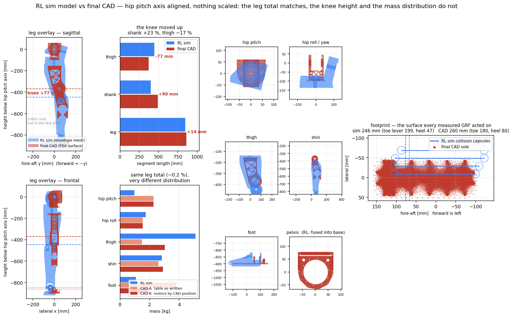

# 81. RL 모델 vs 최종설계 CAD — 질량·형상 대조와 하중 기준 점검

*v1 2026-08-18 (질량만, 모터 배치 추정) · **v2 2026-08-20** (사용자 최종설계 표 반영,
모터 배치 확정, 형상·관절위치 추가)*

이 캠페인의 **모든 하중**은 MuJoCo에서 RL 정책을 굴려 측정한 것이다. 그 측정은 시뮬레이터
모델의 질량·관성·**기하**에 직접 의존하므로, 모델이 현 설계와 다르면 하중 기준 전체가 흔들린다.

> 힙피치 축을 원점으로 두 모델을 겹친 것. **아무것도 스케일하지 않았다.** 파랑 = RL 심 모델
> (외피 메시), 빨강 = 최종 CAD(FEA가 실제로 푼 표면). 왼쪽 두 패널이 다리 전체 실루엣,
> 가운데가 구간 길이와 위치별 질량, 오른쪽 6칸이 위치별 형상 겹침, 맨 오른쪽이 발자국이다.

## §1 출처

| | 출처 | 비고 |
|---|---|---|
| RL 모델 | `mjlab/.../pygmalion/xmls/pygmalion.xml` | 총 51.5268 kg, 바디 14개 |
| 최종 CAD (질량) | 사용자 최종설계 질량표 (2026-08-20) | 편측 다리 + 편측 팔 + 중앙, 합 31.021 kg |
| 최종 CAD (형상) | `~/pyg_fea/steps/link_L*.step` → FEA 표면 | 캠페인이 실제로 푼 그 지오메트리 |

★**두 CAD 출처가 같은 어셈블리임을 독립 확인했다** — 나사 개수가 정확히 일치한다:
CenterParts 69개 = `L6_pelvis` 69개, HipPitch2Roll 48 = `L5` 48, PipRoll2Yaw 30 = `L4` 30.
`L2_shin` 알루미늄 본체는 **0.855 kg(캠페인) vs 0.854 kg(사용자 표)** 로 0.1 % 이내 일치한다.

⚠**메시 체적으로 비교하면 안 된다** — RL 메시는 **외피**다. `L_bukji_up_1` 외피 4,815.6 cm³를
알루미늄으로 채우면 13.0 kg인데 선언 질량은 5.10 kg(유효밀도 1.06).

## §2 v1에서 정정한 것

1. ★**RL 발 질량은 1.083 kg이다(1.212 아님).** `pygmalion.xml`의 `L_toe_link` / `R_toe_link`는
   **주석 처리되어 있다**(line 88·138). 총질량 28.089 + 2×11.719 = 51.527로 검산된다.
   v1은 비활성 toe 0.129 kg을 RL 쪽에 더해 격차를 **과소** 보고했다.
2. **모터 배치는 더 이상 추정이 아니다.** v1의 "가정" 행은 사용자 표로 대체됐다.

## §3 ★위치별 질량 — 다리 합은 맞고 분포가 완전히 다르다

CAD 쪽은 두 가지로 읽는다.
- **A** = 사용자 표 그대로(어셈블리 그룹 = 강체로 간주)
- **B** = 각 모터를 **CAD 좌표가 실제로 놓인 바디**에 계상
  (무릎 RS04는 z=−310 = 무릎 자체 → 대퇴, 발목 RS03×2는 z=−500/−600 = 정강이 구간 → 정강이)

| 위치 | RL kg | CAD-A | %A | CAD-B | %B |
|---|---|---|---|---|---|
| 힙피치 hip_pitch | 0.967 | 2.262 | **+133.8 %** | 2.262 | +133.8 % |
| 힙롤 hip_roll | 1.741 | 1.536 | −11.8 % | 1.536 | −11.8 % |
| 대퇴 thigh | 5.104 | 1.476 | **−71.1 %** | 3.034 | −40.6 % |
| 정강이 shin | 2.823 | 2.598 | −8.0 % | 2.904 | +2.9 % |
| **발 foot** | 1.083 | **3.818** | **+252.4 %** | 1.954 | **+80.4 %** |
| **다리 합(편측)** | **11.719** | **11.690** | **−0.2 %** | 11.690 | −0.2 % |

**다리 총합은 0.2 % 이내로 일치하는데 개별 위치는 −71 ~ +252 % 벌어진다.**

A와 B의 차이는 **발 3.818 vs 1.954 kg**이며, 이것이 이 문서에서 가장 중요한 미해결 항목이다.
§6 참조. 어느 쪽이든 **발은 무거워졌다**(최소 +80 %).

## §4 ★형상 — 무릎이 77 mm 올라갔다

두 모델의 힙피치 축 높이가 **+59.4 mm(RL) vs +60.0 mm(CAD)** 로 사실상 동일하므로, 이를
원점으로 놓으면 나머지 관절 높이는 직접 비교된다(코드에 assert로 강제).

| 관절 축 높이 [mm] | RL | CAD | 차이 |
|---|---|---|---|
| hip_pitch | 0.0 | 0.0 | 0.0 |
| hip_yaw | −137.2 | −157.0 | −19.8 |
| **knee** | −446.5 | **−370.0** | **+76.5** |
| ankle | −846.4 | −860.0 | −13.6 |

| 구간 | RL | CAD | 차이 |
|---|---|---|---|
| 대퇴 hip_pitch→knee | 446.5 | 370.0 | **−76.5 mm (−17.1 %)** |
| 정강이 knee→ankle | 399.8 | 490.0 | **+90.2 mm (+22.5 %)** |
| 다리 전체 | 846.4 | 860.0 | +13.6 mm (+1.6 %) |

**다리 길이는 그대로인데 무릎만 77 mm 올라갔다.** 대퇴:정강이 비가 1.12 → 0.76으로 바뀐다.
질량 재분포(§3)는 이것의 직접 결과다 — 짧아진 대퇴는 가벼워지고 길어진 정강이는 무거워진다.

### 발자국 — GRF가 실제로 작용한 면

| | 전장 | 발끝 레버(발목→앞) | 뒤꿈치 레버(발목→뒤) |
|---|---|---|---|
| RL 심(콜리전 캡슐) | 246 mm | **199 mm** | **47 mm** |
| 최종 CAD(밑창) | 260 mm | 180 mm | **80 mm** |

**뒤꿈치 레버가 47 → 80 mm로 70 % 늘었고 발끝은 10 % 줄었다.** 힐스트라이크 모멘트는
커지고 토우오프 모멘트는 작아지는 방향이다. 발 구조·발목 피치 수요 양쪽에 직결된다.

> 그림의 다리 실루엣에서 CAD(빨강)가 z −587 ~ −785 구간에 비어 보이는 것은 **2-RSU 로드와
> 클레비스가 FEA용 STEP으로 내보내지지 않았기 때문**이지 부품이 없어서가 아니다.

## §5 프레임 규약이 다르다 (해석 시 주의)

RL 월드는 **전방 = +x, 좌우 = y**, CAD 글로벌은 **전방 = −y, 좌우 = x**다. 겹치려면 z축
−90° 회전이 필요하다. 코드는 이 회전을 가정하지 않고 **검증**한다 — 회전 후 발 캡슐이
CAD 전후축으로 226 mm, 좌우 80 mm가 나오고 toe가 CAD의 전방쪽(−y)에 놓여야 통과한다.

## §6 ★하중 기준에 미치는 영향

| 항목 | 방향 | 근거 |
|---|---|---|
| **발 착지 충격·발목 모멘트** | **과소평가** | 발이 최소 +80 %, 최대 +252 % 무겁다 |
| **뒤꿈치 착지 모멘트** | **과소평가** | 뒤꿈치 레버 +70 % |
| 무릎 토크 | 불확정(양방향) | 정강이 +22.5 % 길어짐(레버↑) vs 대퇴 질량 −40 %(관성↓) |
| 발끝 밀기 토크 | 과대평가 | 발끝 레버 −10 % |
| 전체 GRF·CoM 궤적 | 거의 영향 없음 | 다리 합 −0.2 %, 총질량 동일 |

발은 이미 **캠페인 최악 링크**(필드 SF 2.68, 피로 SF 1.52, 밑창판 점 SF 1.25)다. 그 하중이
**적어도 80 % 가벼운 발**과 **70 % 짧은 뒤꿈치 레버**로 측정된 것이므로, 보고된 여유는
실제보다 크다.

⚠**정량 보정은 하지 않았다.** 충격 하중이 질량·레버암에 선형인지 확인하지 않았고, 재측정
없이 계수를 곱하는 것은 [[feedback-load-basis-provenance]] 위반이다.

## §7 조치

1. ★**Ankle2Feet의 모터 귀속을 확정**할 것(§3 A vs B). 발 질량이 3.818인지 1.954인지가
   발 계열 판정 전체를 좌우한다. CAD 좌표(z=−500/−600, 무릎 −310 ~ 발목 −800 사이)는
   **정강이(B)** 를 가리킨다.
2. **RL 모델을 최종 CAD로 갱신하고 재측정**한다 — 무릎 높이 −370, 정강이 490, 발 질량,
   뒤꿈치 레버 80, 2-RSU 병렬 발목. 갱신 전까지 발·정강이 판정에는 편의가 남아 있다.
3. 갱신 시 **바디별 부품 구성을 기록**해 두면 다음 대조가 추정 없이 끝난다.

도구: `tools/fea/rl_vs_cad_shape.py` (질량·관절높이·형상 겹침·발자국을 한 번에, 프레임
정합은 assert로 강제)

관련: [[77_structural_fea_lightweighting]] · [[78_link_structural_final_report]] ·
[[82_final_design_mass_review]] · [[feedback-load-basis-provenance]]
