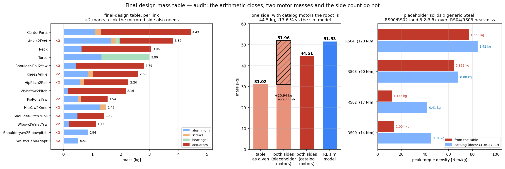

# 82. 최종설계 질량표 검토 (2026-08-20)

사용자가 노트에 확정 기재하기 전 검토를 요청한 표. **산술은 전부 통과**했고, 물리적
정합성에서 확정 3건 + 확인요청 3건이 나왔다.

★**2026-08-20 적대적 검증 반영**(에이전트 13, 주장 6건 × 독립 2렌즈 반증 시도):
**4건 유지 · 2건 반증**. 반증된 것은 §4(발 귀속, 자체 정정 완료)와 §6(독립 대조 주장 —
사실은 같은 파일을 두 번 읽은 것). §2의 "51.96 kg" 방증도 순환이라 철회했다.

★★**2026-08-20 Fusion360 실측 반영**([[83_fusion360_measurement_spec]] §0·§1 완료):
리비전 동일 확정(앵커 3종 일치, Ankle2Feet 나사는 45+루즈 2 = 47). **§3의 (a) 질량 오류로
사실상 확정** — 모터 7종 실측 전부 단일 자리표시자 솔리드 + 범용 "Steel", 바운딩박스는
카탈로그 외형과 정확히 일치(라벨·배치는 맞음). §2·§3을 이에 맞춰 갱신했다. §2~§7 측정은
미착수.

> 왼쪽: 링크별 질량을 분류로 쌓은 것(빨강 ×2 = 미러 측에도 필요한 링크).
> 가운데: 표가 편측이라는 근거. 오른쪽: 모터 토크밀도 — RS00·RS02가 추세를 깬다.

## §1 산술 — 전부 통과 (오차 ≤ 0.001 kg, 반올림)

| 검사 | 결과 |
|---|---|
| 링크 14행 합 vs 선언 총합 | 31.021 = 31.021 ✅ |
| 분류 4행 합 | 31.022 (+0.001, 반올림) ✅ |
| 링크별 파츠 내역 합 vs 링크 질량 | 14개 전부 |Δ| ≤ 0.001 ✅ |
| 분류 재집계(내역→분류) | 액추 17.700 / 알루 10.518 / 베어링 1.836 / 나사 0.966 ✅ |
| 백분율 | 14행 전부 표기값과 일치 ✅ |

**계산은 그대로 써도 된다.** 이하는 계산이 잡을 수 없는 것들이다.

## §2 ★확정 1 — 이 표는 **편측**이다. 로봇 총질량은 31.02 kg가 아니다

액추에이터 재고가 증거다. 표에 **모터 15개**(RS04 4 · RS03 6 · RS02 2 · RS00 3)가 있는데,
이 DoF 구성의 완성체는 다리 6×2 + 팔 5×2 + 허리 2 + 목 2 = **26개**가 필요하다.
다리·팔 링크가 각각 **한 벌씩만** 올라와 있다.

검증이 찾아준 더 강한 방증 넷 — 어느 것도 "완성체" 해석과 양립하지 않는다:

1. **CAD 기하**: `fullbody_links.json` 413개 솔리드 중 **y < 0 인 것이 0개**(y 범위 +4.5 ~ +208).
   다리 링크 COM x가 전부 ≈ −125 mm 한쪽에만 있고 +125 쌍이 없다.
2. **모터 분해 유일성**: 각 링크의 모터 합을 {1.558, 0.932, 1.432, 1.004} 조합으로 전수
   탐색하면 **모든 행이 유일해**를 갖고 각 모터가 정확히 1회씩만 등장한다 → 어떤 행도
   좌우 합산이 아니다.
3. **다리 합**: 표 편측 11.690 kg vs 심 모델 편측 11.719 → −0.25 %.
4. **몸통 메시**: `base_link.stl` bbox가 x ±0.2854 m로 **0.06 mm 이내 좌우대칭**(어깨 2개).
   표의 중앙+**팔 1벌** = 19.331 vs 심 base_link 28.089 → −31 %; **팔 2벌**이면 +1.7 %.

⚠**철회**: 초판은 "표를 좌우로 완성하면 51.956 kg, 심 모델 51.527 대비 +0.83 % — 독립된 두
경로가 1 % 안에서 만난다"고 썼다. **이 방증은 순환이다.** 51.956은 §3이 "물리적으로
불가능"이라 판정한 RS00 1.004 · RS02 1.432을 그대로 쓴 값이다. §3의 카탈로그 질량으로
고치면 **46.07 kg**(−10.6 %)이 된다. 또 `pygmalion.xml`이 같은 CAD에서 나왔을 가능성을
배제하지 못해 "독립"도 성립하지 않는다.

★**Fusion 실측으로 밴드가 닫혔다**: 모터가 전부 자리표시자로 확정됐으므로(§3) 카탈로그
치환이 맞고, **좌우 완성 = 중앙 9.263 + 편측 16.758×2 + 미러 모터 1.730 = 44.51 kg**.
심 모델 51.53 대비 **−13.6 %** — 다리는 −3.9 %로 근접하고 차이는 상체에 몰려 있다.
노트 표기: `"편측+중앙 31.02(자리표시자 모터) / 카탈로그 모터 교정 시 26.02 / 좌우 완성
≈ 44.5 kg (배터리 제외)"`.

## §3 ★확정 2 — 모터 질량은 전부 자리표시자다 (Fusion 실측으로 (a) 확정)

| 모터 | peak | 표 kg | 카탈로그 kg | 차이 | 표 N·m/kg | 카탈로그 |
|---|---|---|---|---|---|---|
| RS04 | 120 | 1.558 | 1.42 | +9.7 % | 77.0 | 84.5 |
| RS03 | 60 | 0.932 | 0.88 | +5.9 % | 64.4 | 68.2 |
| RS02 | 17 | **1.432** | **0.380~0.405** | **+254 %** | **11.9** | 42.0 |
| RS00 | 14 | **1.004** | **0.31** | **+224 %** | **13.9** | 45.2 |

(RS02 카탈로그 출처: [[39_ankle_qdd_uptorque_survey]] L29 — RS01/RS02 = 17/6 N·m,
380–405 g, Φ78.5, 7.75:1. 포락 밀도 논거: RS00 1.004 kg ÷ Φ57×51 = **7.71 g/cm³ = 통강철**.)

### ★Fusion 실측 결과 (2026-08-20) — (a) 질량 오류, (b) 라벨은 정상

측정 7종(RS00×3 · RS02×2 · RS04-Hip_P · RS03-Ankle_A) **전부**:
- **단일 솔리드 바디**, 재질 = 범용 **"Steel"**(특정 합금 미지정)
- **바운딩박스가 카탈로그 외형과 정확히 일치**(RS00 Φ57×51, RS02 Φ78.5) → 라벨·배치는 맞다
- → 표의 모터 질량 = **자리표시자 체적 × Steel 밀도**의 산출값. RS04/RS03은 형상 비율상
  우연히 카탈로그에 근접했고, RS00/RS02는 짧고 굵어 크게 벗어났다.

⚠**초판 해석 철회**: "RS04 +9.7 %/RS03 +5.9 %는 케이블·어댑터로 설명되는 정상 범위"라고
썼다. 실측 결과 이 둘도 자리표시자이므로 **+9.7/+5.9 %는 우연이지 실측이 아니다.**
교정은 RS00/RS02만이 아니라 **네 모델 전부 카탈로그 치환**이 맞다.

⚠단서(실측 세션이 남긴 것): Material 밀도 수치 직접 조회는 실패(정황 판단), override 여부도
확정 아님. RS04-Hip_P bbox 161.88 mm는 모터 지름치곤 커서 **브래킷이 한 솔리드로 합쳐졌을
가능성**(미확인) — §2 측정 때 확인할 것.

### 카탈로그 치환 교정표 (모터 4종 전부)

| 링크 | 표 kg | 교정 kg | Δ |
|---|---|---|---|
| CenterParts | 4.429 | 4.153 | −0.276 |
| HipPitch2Roll | 2.262 | 2.124 | −0.138 |
| PipRoll2Yaw | 1.536 | 1.484 | −0.052 |
| HipYaw2Knee | 1.476 | 1.476 | — |
| Knee2Ankle | 2.598 | 2.460 | −0.138 |
| Ankle2Feet | 3.818 | 3.714 | −0.104 |
| Shoulder-Pitch2Roll | 1.418 | 1.366 | −0.052 |
| **Shoulder-Roll2Yaw** | 2.794 | **1.715** | **−1.079** |
| Shoulderyaw2Elbowpitch | 0.838 | 0.838 | — |
| Wlbow2WaistYaw | 1.125 | 1.073 | −0.052 |
| **WaistYaw2Pitch** | 2.163 | **0.775** | **−1.388** |
| Waist2HandAdapt | 0.508 | 0.508 | — |
| Torso | 2.998 | 2.998 | — |
| **Neck** | 3.058 | **1.337** | **−1.721** |
| **편측+중앙 합** | 31.021 | **26.021** | **−5.000** |

### 잔존 질문 — Waist_Pitch 언더스펙은 교정 후에도 남는다

교정된 허리 위 질량(Torso+Neck+팔×2) = **15.34 kg**. COM 오프셋 150/200/300 mm에서 정적
토크 **22.6 / 30.1 / 45.1 N·m** — 표대로 RS00(peak 14)이면 **1.6~3.2배 초과**. 라벨이
맞다고 실측됐으므로 이제 이것은 라벨 문제가 아니라 **설계 결정 사항**이다: Waist_Pitch에
실제로 무엇을 쓸 것인가. (배터리를 얹으면 더 커진다.)

## §4 ★확정 3 — `Ankle2Feet`는 링크가 아니라 **2-RSU 기구 전체**다

표는 이 그룹을 한 행(3.818 kg)으로 잡았지만, 솔리드 31개는 **하나의 강체가 아니다.**

| 증거 | 값 |
|---|---|
| 그룹의 z 범위 | **−503.7 ~ −839.0 mm** (발목 축 −800을 가로지름) |
| 크랭크 2개 | z = −503.7, −602.5 (= 발목 모터 높이, **정강이**) |
| 푸시로드 2개 | z = −697.9, 62.05 cm³ ×2 |
| JMC-JS06 로드엔드 | **정강이쪽** Ankle-A/B −523/−616 · **발쪽** FEET-A/B −810 |
| 발판 | z = −839.0 (197.6 cm³) |

★**캠페인이 `L1_ankle_foot`으로 푼 262.0 cm³ = 발판 솔리드 4개 262.07 cm³.** 구조 판정이
붙어 있는 물체와 기하학적 발이 정확히 같다. 나머지 307 cm³는 발이 아니다.

기하로 분해하면(로드는 병렬기구 관례대로 50/50):

| | kg |
|---|---|
| **발**(발측 구조 + 로드 절반 + 발측 볼조인트 + 안분한 나사·베어링) | **1.211** |
| **정강이**(크랭크·로드엔드 + 로드 절반 + RS03×2) | **2.608** |

→ 발 질량은 RL 심 모델(1.083 kg) 대비 **+11.8 %**에 그치고, **정강이가 +84 %** 로 뛴다.
2-RSU가 발목 모터를 근위에 올려 발끝 관성을 낮춘다는 설계 의도 그대로다
([[37_ankle_linkage_fidelity]]).

⚠**노트에 이 행을 "발"로 쓰면 안 된다.** `Ankle2Feet`는 정강이·로드·발에 걸친 기구다.
가능하면 표를 **강체 기준**(발 / 정강이)으로 재편하거나, 최소한 그룹임을 명기할 것.
→ [[81_rl_model_vs_cad_mass]] §3.

### 무릎 RS04는 표대로 정강이가 맞다

같은 검사를 무릎에 적용하면 표의 귀속이 **기하학적으로 타당**하다:
정강이 요크의 두 최대 솔리드가 무릎 축(−310)을 **감싸고**(COM −329.2 · −336.8, x = −160.2 /
−87.0 = 좌우 포크), 대퇴 구조는 z = −235.5에서 끝난다. 발목 모터와 달리 옮길 근거가 없다.

## §4b 스윕에서 추가로 나온 것 (표 자체의 결함)

1. **PSU는 있고 배터리는 없다.** Torso의 `PSU-RSP-2000-48`(1.677 kg)은 상용 AC-DC 전원
   계열의 부품명이다. 표 어디에도 배터리 행이 없다 — 이대로면 이 로봇은 **유선(테더)**이고,
   자율 구동이 목표라면 배터리 질량(수 kg)이 통째로 빠진 것이다. 어느 쪽인지 확정 필요.
   부수적으로, 분류표의 "베어링·기구물 1.837 kg" 중 **실제 베어링은 0.159 kg**뿐이다
   (나머지가 PSU) — 분류 합산은 맞지만 읽을 때 주의.
2. **네 링크에서 베어링이 0으로 계상됐다.** CAD에는 있는데 표에 없다: `Knee2Ankle` 0.000
   (CAD `link_L2_shin_joints.json`에 6810ZZ ×2 ≈ 0.075 kg), `PipRoll2Yaw` 0.000(6814ZZ 힙요
   세트), `CenterParts`·`HipPitch2Roll` 0.000(CRBS808AUU 크로스롤러가 그 구간에 있음).
   CAD 쪽에도 **베어링 솔리드 137/151개가 어느 링크에도 미배정**(0.339 kg)이라 양쪽 다
   이 부품군을 흘리고 있다. 규모는 다리당 ~0.2 kg.
3. **상체 8행(14.9 kg, 표의 48 %)은 CAD가 아예 없다.** `Huphy1.0_FullBody.step`에 Neck·
   Torso·Shoulder·Elbow·Waist 계열 제품이 없고, 정확히 그 8행만 **나사 = 0.000**이다
   (다리·골반 6행은 전부 나사가 있음). `WaistYaw2Pitch`는 알루미늄 0.155 kg이 모터 2.008 kg과
   상체 전체 굽힘모멘트를 받는 구성 — 구조물이 아니라 자리표시자다. §3의 (a)/(b) 판단과
   함께 이 블록 전체를 "미설계"로 읽는 것이 안전하다.

## §5 확인요청 — 명칭

| 표기 | 추정 | 근거 |
|---|---|---|
| `PipRoll2Yaw` | `HipRoll2Yaw` 오타 | 계보상 HipPitch2Roll 다음 |
| `Wlbow2WaistYaw` | `Elbow2WristYaw`? | 팔 계열인데 "Waist"가 들어감 |
| `WaistYaw2Pitch`의 `RS00 - Elbow_Yaw` | `Wrist_Yaw`? | 허리 링크에 팔꿈치 모터 |
| `Ankle2Feet`의 `RS03 - Ankle_A (1)` | `Ankle_B` | 같은 이름 2개 |
| CenterParts `RS04 - Hip_R` 축 = x(좌우) / HipPitch2Roll `RS04 - Hip_P` 축 = y(전후) | 두 이름이 서로 바뀐 것으로 보임 | 무릎·발목 피치축이 모두 x. 피치는 좌우축 회전 |

⚠ 마지막 항은 내 STEP 축검출 결과이므로 CAD에서 직접 확인 필요.

## §6 ⚠반증 — "독립 대조"가 아니었다. 그리고 표는 **더 새로운 리비전**이다

초판은 나사 개수 일치(69·48·30)를 "두 데이터가 같은 어셈블리라는 독립 증거"로 썼다.
**독립이 아니다.** `tools/fea/xcaf_links.py`의 `link_of()`는 STEP 경로의 **서브어셈블리
이름을 그대로 링크로 삼는다**(`/Joints/CenterParts/…` → `L6_pelvis`). 캠페인 CAD와
사용자 표는 **같은 파일**(`refs/Huphy_1.0_STEP/Huphy1.0_FullBody.step`)이므로 일치는
구성상 당연하다.

★**같은 파일인데 상태가 다르다** — 나사 개수를 전부 대면:

| 링크 | CAD 트리 | 표 | 차 |
|---|---|---|---|
| L6_pelvis / CenterParts | 69 | 69 | 0 |
| L5 / HipPitch2Roll | 48 | 48 | 0 |
| L4 / PipRoll2Yaw | 30 | 30 | 0 |
| L3 / HipYaw2Knee | 42 | 72 | **+30** |
| L2 / Knee2Ankle | **0** | 64 | **+64** |
| L1 / Ankle2Feet | **0** | 47 | **+47** |
| **합** | **189** | **330** | **+141** |

L2의 알루미늄이 316.8 cm³ × 2.70 = 0.855 kg로 표의 0.854와 맞는다 → **나사는 그 체적에
포함돼 있지 않다.** 즉 캠페인이 메시한 STEP에 **L1·L2·L3의 나사 141개가 없다.**
초판의 설명("FEA용 export에서 체결구가 빠졌다")은 방향이 반대다 — 소스 CAD 쪽이 옛 상태다.

| 캠페인 링크 | Al(캠페인) | Al(표) | 차이 |
|---|---|---|---|
| L6_pelvis | 0.848 | 1.111 | **+31.0 %** |
| L5_hip_pitchroll | 0.654 | 0.582 | −11.0 % |
| L4_hip_yaw | 0.563 | 0.505 | −10.3 % |
| L3_thigh | 1.320 | 1.270 | −3.8 % |
| L2_shin | 0.855 | 0.854 | −0.2 % |
| L1_ankle_foot | 1.536 | 1.643 | +7.0 % |

**차이가 양쪽으로 난다**(+31 ~ −11 %). "export가 빠뜨렸다"는 한 방향 설명으로는 이 집합을
만들 수 없다. → ★**조치는 "L6 +31 % 원인 확인"이 아니라 "현 CAD를 재-export하고 6개 링크
FEA 지오메트리를 전부 재확인"이다.**

## §7 노트 확정 전 체크리스트

1. ★ 총질량을 **"편측+중앙 26.02(카탈로그 모터) / 좌우 완성 ≈ 44.5 kg (배터리 제외)"** 로
2. ~~RS00·RS02 정체~~ → **완료**(자리표시자 확정). 남은 것: ★**Waist_Pitch 액추에이터
   설계 결정**(요구 22.6~45.1 N·m vs RS00 14) · RS04-Hip_P 브래킷 병합 여부(§2에서)
3. ★ **Ankle2Feet 행을 강체 기준으로 재편** — 이 그룹은 기구 전체다(발 ~0.9~1.2 / 정강이 ~2.6)
4. ★ **현 CAD 재-export 후 6개 링크 FEA 지오메트리 재확인** — 표에 있는 나사 141개가
   캠페인 STEP에 없고, 알루미늄 차이가 양방향(+31 ~ −11 %)이다
5. **배터리 유무 확정** — 표에는 PSU만 있다(§4b). 유선이면 그대로, 자율이면 +수 kg
6. 명칭 정리(§5) · 베어링 0 계상 4개 링크 보정(§4b, 다리당 ~0.2 kg)

관련: [[81_rl_model_vs_cad_mass]] · [[78_link_structural_final_report]] ·
[[36_all_actuator_tn_envelopes]] · [[37_ankle_linkage_fidelity]]

도구: `tools/fea/mass_table_review.py`(산술·재고·토크밀도 검산) ·
`tools/fea/ankle_group_split.py`(Ankle2Feet 기하 분해, FEA 262.0 cm³ 대조를 assert로 강제) ·
`tools/fea/rl_vs_cad_shape.py`(질량·관절높이·형상 겹침·발자국)
