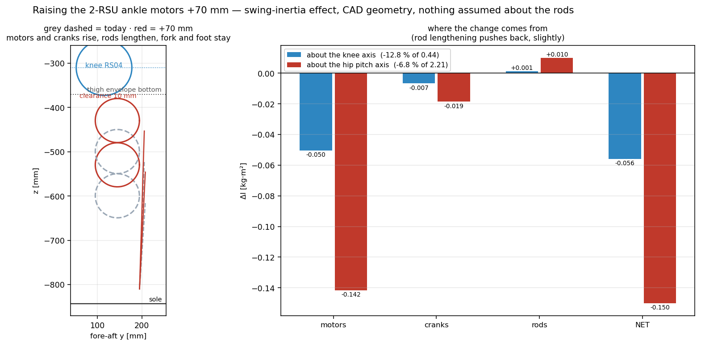

# 84. 2-RSU 발목 모터 +70 mm 인상 — 스윙 관성 효과 (2026-08-20)

질문: 발목 2-RSU 모터(RS03 ×2, 현재 ctr z = −499.5 / −599.5)를 **70 mm 올리면** 관성이
얼마나 줄어드나.

> 왼쪽: 회색 점선 = 현재, 빨강 = +70 mm. 모터·크랭크가 오르고 로드가 길어지며, 클레비스
> 포크와 발은 그대로다. 오른쪽: 축별 ΔI 기여 — 로드 연장이 소폭 되민다.

## §1 답

| 기준 축 | ΔI | 기준 관성 | 감소율 |
|---|---|---|---|
| **무릎 축**(무릎 이하 스윙세트) | **−0.056 kg·m²** | 0.437 | **−12.8 %** |
| **힙피치 축**(다리 전체) | **−0.150 kg·m²** | 2.214 | **−6.8 %** |

기여 분해 (힙 축): 모터 −0.142 · 크랭크 −0.019 · **로드 연장 +0.010** (되미는 항).
ΔI는 순수 평행축 항이라 질량이 주어지면 정확하고, 모터 질량(카탈로그 0.88 kg)에
선형이다 — 실물이 브래킷 포함 1.0 kg이면 모터 항을 ×1.14 하면 된다.

## §2 움직이는 것 / 안 움직이는 것

| | 무엇 | 변화 |
|---|---|---|
| 모터 RS03 ×2 | 0.88 kg씩 | +70 mm |
| 크랭크+클램프 ×2 | 115 g씩 (COM −503.7 / −602.5) | +70 mm (모터축에 실림) |
| 푸시로드 A | 287→357 mm · 54.3→67.5 g | 상단만 +70, COM +35 |
| 푸시로드 B | 194→264 mm · 41.4→56.3 g | 〃 |
| **클레비스 포크** (154.4 cm³, 발목 피치 베어링 홀더) | **불변** | 정강이 고정 |
| 발 (발판+크로스, 1.06 kg) | **불변** | |

로드 식별은 가정이 아니다: 두 로드 솔리드(20.11/15.33 cm³)의 COM이 각자의 JMC 볼조인트
쌍 중점과 **0.1 mm 이내로 일치**한다(`ankle_motor_raise.py`·`ankle_group_split.py` assert).

## §3 ★패키징 — 70 mm가 사실상 상한이다

| 간섭 검사 (상부 모터 ankle_b, +70 후) | 여유 |
|---|---|
| 모터 상단(z −379.8) vs 대퇴 외피 하단(−370) | **9.8 mm** |
| 모터 외경 vs 무릎 RS04 외경 (중심거리 123.2, 반경합 112.5) | **10.7 mm** |

둘 다 ~10 mm. **더 올릴 여지가 거의 없고**, 무릎 굴곡 시 대퇴 요크 스윕과의 동적 간섭은
별도 확인이 필요하다(여기선 정적 외피만 검사).

## §4 단서

1. **전달비·요동각 미검증** — 모터가 오르면 로드가 서고 크랭크-로드 각이 바뀐다.
   J = ∂(φA,φB)/∂(pitch,roll)와 JS6 요동각(±20°) 재확인 필요 → [[78_link_structural_final_report]]
   §12의 자코비안 도구로 새 기하 검산할 것. 토크 여유(pitch 47 %)가 변할 수 있다.
2. 정강이 구조 보강/연장 질량은 0으로 가정(모터 마운트가 위로 이동만 한다고 봄).
3. 로드 +70 mm에 좌굴 여유 재확인(현 로드 9,620 N 압축 기준, 길이 +24~36 %면
   오일러 임계는 −35~−46 %) — **rod B 264 mm는 괜찮아도 rod A 357 mm는 좌굴 체크 필수**.
4. 관성 총량(0.437/2.214)은 솔리드 점질량 근사(수 % 오차). Δ는 정확.

## §5 맥락 — 심 모델 대비

정강이는 현 CAD가 심 모델보다 **+89.8 % 무겁다**([[81_rl_model_vs_cad_mass]] v4). 70 mm
인상은 그 격차의 원인(저위 모터 배치)을 직접 줄이는 조치로, 힙 스윙관성 −6.8 %는 심 모델
방향으로 되돌리는 것이다. 정확한 sim-to-real 정합은 §2 강체 측정([[83]]) 후 재계산.

도구: `tools/fea/ankle_motor_raise.py` (`--raise=N`으로 임의 인상량; 로드 중점·모터 앵커·
간섭을 assert)

관련: [[81_rl_model_vs_cad_mass]] · [[82_final_design_mass_review]] · [[37_ankle_linkage_fidelity]]
