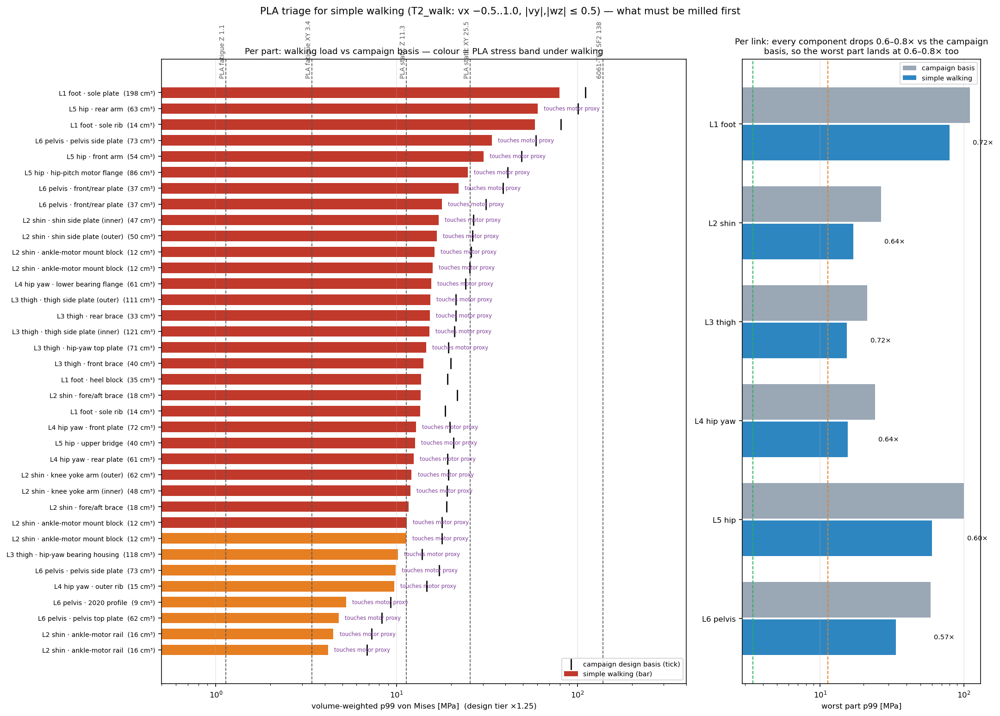
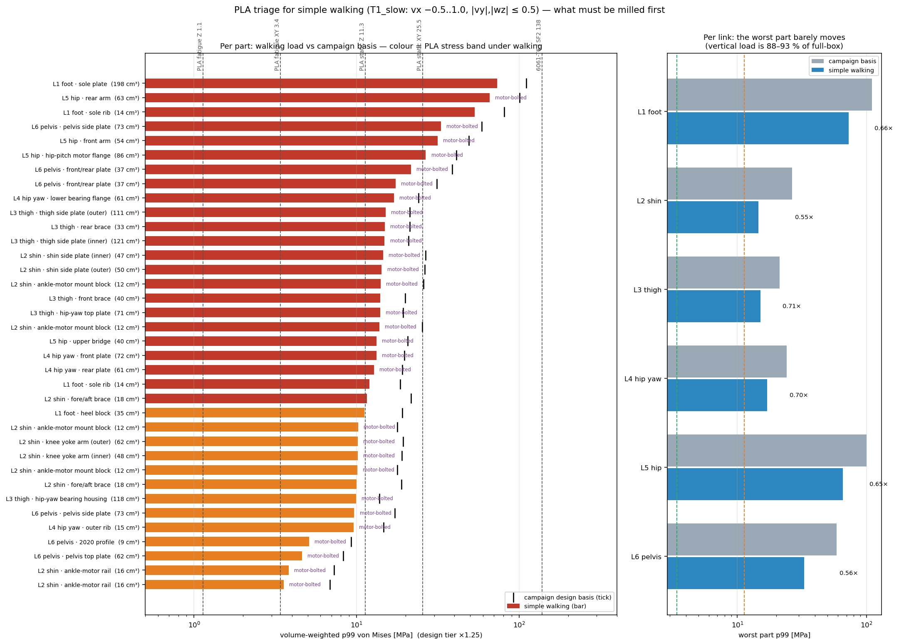

# 85. 단순 보행 조건 PLA 트리아지 — 무엇을 먼저 CNC로 바꿔야 하나 (2026-08-20)

질문: 전 부품을 당장 CNC 가공할 수 없다. **평지 단순 보행**만 한다면 어느 파츠를 먼저
알루미늄으로 바꿔야 하고, 어느 것은 PLA 출력물로 당분간 버티나.

> 막대 = 단순보행 하중에서의 부품별 체적가중 p99 응력, 검은 눈금 = 캠페인 설계기준
> (rough+push 포락). 색 = PLA 응력 밴드. 오른쪽 = 링크별 최악 부품의 캠페인 대비 비율.

## §1 답 — 단순 보행이어도 **구조 부품은 전부 바꿔야 한다**. 순서만 정해진다

단순 보행(T2: vx −0.5~1.0 m/s, |vy|·|wz| ≤ 0.5)으로 하중을 낮춰도 부품 응력은 캠페인
기준의 **0.63~0.78배**에 그친다. 체중이 만드는 **수직력이 88~93 % 그대로**이기 때문이다
(§3). PLA 피로 허용 3.4 MPa는 주요 부품 응력(12~77 MPa)의 **1/4~1/23**이다.

**36개 실부품 중 RED 30 · ORANGE 6 · GREEN 0.** (메시 슬리버 20개 < 0.5 cm³ 제외)

### 1순위 — 정적으로도 깨진다 (출력물 최대 면내강도 25.5 MPa 초과): **첫 걸음에 파단**

| 순위 | 부품 | cm³ | 캠페인 | **보행** | 비고 |
|---|---|---|---|---|---|
| 1 | **L1 발 밑창판** | 198 | 110.4 | **76.7** | 원 UTS 51도 초과 |
| 2 | **L5 힙 뒤 암** | 63 | 100.4 | **76.0** | 〃, CRBS808 베어링 시트 |
| 3 | L1 발 밑창 리브 | 15 | 80.8 | 56.1 | 6900ZZ 시트 |
| 4 | L6 골반 측판 | 73 | 59.0 | 42.5 | 모터 체결 |
| 5 | L5 힙 앞 암 | 54 | 48.9 | 36.5 | 베어링 시트 |
| 6 | L5 힙피치 모터 플랜지 | 86 | 41.1 | 30.8 | 모터 체결 |
| 7 | L6 골반 앞/뒤판 | 37 | 38.7 | 27.5 | |

→ **발(L1)·힙(L5)·골반(L6)은 링크째로 1순위.** 셋 다 출력물로는 서 있지도 못한다.

### 2순위 — 정적 층간강도 11.3 초과: **수 분~1시간 내 파단** (피로수명 0.1~0.9 h)

L2 정강이 측판 내/외(17.6/17.3) · 발목모터 마운트 블록 4개(12~17) · 무릎 요크 암 2개(12.4) ·
전후 브레이스 2개(12~14) / L3 대퇴 측판 내/외(16.4/16.6) · 뒤/앞 브레이스(16.5/15.5) ·
힙요 상판(15.1) / L4 힙요 하부 베어링 플랜지(17.3) · 앞/뒤판(13.9/13.4) / L5 상부 브릿지(15.3) /
L6 골반 측판 #2(12.3) / L1 뒤꿈치 블록(12.0) · 리브 #2(12.7)

→ **L2·L3·L4도 판재 전부.** 면내 방향으로 출력해 운이 좋아도 시간 단위다.

### 3순위(ORANGE) — 응력만 보면 몇 시간~수백 시간 버팀. 단, 전부 모터에 체결돼 있다

| 부품 | cm³ | 보행 MPa | PLA 피로수명 | 걸리는 것 |
|---|---|---|---|---|
| L3 힙요 베어링 하우징 | 118 | 10.8 | **1.4 h** | 6814ZZ 시트(크리프) + 모터 체결 |
| L4 힙요 외측 리브 | 15 | 10.2 | 2.0 h | 모터 체결 |
| L6 2020 프로파일 | 9 | 5.7 | 48 h | **압출재 — CNC 대상 아님, 구매품** |
| **L6 골반 상판** | 62 | 5.2 | **79 h** | 모터 체결 (Waist_Yaw RS04) |
| **L2 발목모터 레일 ×2** | 16+16 | 4.7 / 4.3 | **146 / 220 h** | 모터 체결 (RS03 ×2) |

★**실질적으로 PLA로 미룰 수 있는 것은 셋뿐**: **L6 골반 상판, L2 발목모터 레일 2개**
(+ 2020 프로파일은 애초에 구매품). 셋 다 모터 하우징에 직접 체결되므로 열 조건이 붙는다 —
단순 보행이면 RMS 토크가 낮아(§3 tau 0.4~0.8×) 하우징이 HDT 55 °C까지 안 갈 가능성이
있지만, **서모커플로 확인 전까지는 가정**이다(docs/79 §8b: RobStride 정격은 알루미늄 방열판
부착 기준).

## §2 왜 하중을 낮춰도 안 되나 — 수직력은 체중이다

| 관절 | Fz P99 전박스 | **T2 보행** | 비 | 수평력 비 | 토크 비 |
|---|---|---|---|---|---|
| hip_pitch | 401 | 371 | 0.93 | 0.69~0.75 | **0.42** |
| knee | 524 | 480 | 0.92 | 0.77~0.83 | 0.69 |
| ankle_pitch | 596 | 525 | **0.88** | 0.50~0.73 | 0.68 |
| ankle_roll | 595 | 527 | 0.88 | 0.49~0.59 | 0.79 |

GRF_z P99: 634 → 545 N(1.08 BW). **수직력은 10 %대만 빠진다.** 수평력·토크는 절반으로
빠지지만 링크 판재의 응력은 수직 하중(압축·굽힘)이 지배한다. 캠페인 기준(flat∪rough)
대비로는 Fz가 0.70~0.73(rough 분이 빠짐), 결과적으로 부품 응력 0.63~0.78.

느린 보행(T1: ≤0.5 m/s)로 더 낮춰도 Fz 비는 0.85~0.89 — 밴드가 바뀌지 않는다(T1 전수
결과는 `walk_triage_T1_slow.json`, §6).

## §3 방법 — 캠페인 파이프라인 재사용, 재검증 3중

1. **하중**: `tools/fea/walk_basis.py` → `loads_walk.json`. flat 앵커(gen21p2_fc, 121명령×15 s)
   중 단순보행 박스 안의 블록만(T2 25/121, 17,400 step). 이전 블록이 박스 밖이면 첫 3 s
   (고속→감속 과도) 제거. 링크로컬 프레임·R미러·|성분| P99 = wrench_studio `sweep`
   (cfrc_int→관절앵커 이송 §8i, 자식링크 회전, 반력 부호) 그대로. ★**전박스 재집계가 서버
   캐시와 0.1 N 이내 일치**(assert).
2. **응력**: 링크별 단위해(.frd) 7개를 `envelope.combine`으로 부호조합 포락 재합성.
   ★**캠페인 크기로 합성하면 기록된 최대응력을 2 % 이내 재현**해야 진행(assert).
   Fx/Fy/Fz = 보행 P99×1.25, Maxial = 보행 τ P99×1.25(캠페인값 상한), Mt = 보행 횡모멘트
   P99×1.25(상한 동일), Gbody 3 g 유지.
3. **부품**: ELSET별 체적가중 p99(캠페인의 메시독립 지표). 부품명은 CAD 솔리드 COM 최근접
   매칭 + 위치 기반 추정명. 모터 체결 = 액추에이터 프록시 원통과 1.5 mm 이내 절점.
4. **PLA 밴드**: docs/79 사다리 — 정적 면내 25.5 / 정적 층간 11.3 / 피로 면내 3.4(SF1.5) /
   피로 층간 1.13. 수명 = Ezeh & Susmel S-N(2e6에서 0.10 UTS, 기울기 5.5):
   N = 2e6·(5.1/σ)^5.5, 2.2×10⁴ cycle/h(docs/79 §8a).

## §4 응력 밖의 것 둘 — 강성과 온도

- **강성**: E 2.3~3.5 vs 69 GPa → 처짐 20~30배. 단순보행에서도 하중 0.7배라 처짐은 14~21배.
  2-RSU 로드 기하·베어링 정렬·제어대역 공진(docs/79 §4)은 응력과 무관하게 걸린다 —
  PLA로 미루는 셋(상판·레일)은 강성 경로가 아니라서 허용 가능하다고 본다.
- **온도**: 모터 체결 부품 전부에 HDT 55 °C 조건. ORANGE 6개 전부 해당.

## §5 단서

- 하중 프레임: loads.json의 Fx/Fy/Fz를 CAD 링크축에 그대로 얹은 **캠페인의 규약을 상속**했다.
  크기만 바꿨으므로 비교는 일관되나, 절대값은 그 규약의 정확도에 묶인다.
- 단순보행 정의는 명령 박스 기준이다. 넘어짐·외란·계단은 없다는 가정.
- 부품 응력은 가장 나쁜 1 %의 체적 기준(p99)이다. 피크(점응력)는 더 높다.
- 모터 프록시는 카탈로그 외형 원통이라 "체결"은 접촉으로 판정한 것이다. 실제 체결면은
  플랜지이므로 보수적(넓게) 잡힌다.

## §6 T1(느린 보행 ≤0.5 m/s) 감도 — 순서는 같고, 경계 부품 몇 개가 "몇 시간"으로 내려온다

T1(9/121 블록, 6,300 step)에서는 **RED 23 · ORANGE 13 · GREEN 0**. 1순위 7개는 그대로
1순위다(밑창판 73.1·힙 뒤 암 65.7·리브 53.3·골반 측판 33.0·힙 앞 암 31.6·모터 플랜지 26.6 —
전부 25.5 초과; 골반 앞/뒤판 21.6/17.4). RED→ORANGE로 내려오는 것은 경계선 부품들이고
**수명이 1~3시간**이라 실무상 달라지는 게 없다:

| 부품 | T2 | T1 | T1 수명 |
|---|---|---|---|
| L1 뒤꿈치 블록 | 12.0 | 11.2 | 1.2 h |
| L2 무릎 요크 암 외/내 | 12.4/12.4 | 10.2/10.1 | 2.0/2.1 h |
| L2 발목모터 마운트 블록 #21/#18 | 12.0/11.9 | 10.2/10.1 | 2.0/2.1 h |
| L2 전후 브레이스 #14 | 12.3 | 10.0 | 2.2 h |
| L3 힙요 베어링 하우징 | 10.8 | 9.9 | 2.4 h |
| L6 골반 측판 #2 | 12.3 | 9.7 | 2.7 h |
| L4 힙요 외측 리브 | 10.2 | 9.6 | 2.8 h |
| **L6 골반 상판** | 5.2 | 4.6 | **158 h** |
| **L2 발목모터 레일 ×2** | 4.7/4.3 | 3.8/3.6 | **439/650 h** |

결론 불변: **PLA로 미룰 수 있는 것은 골반 상판과 발목모터 레일 2개뿐**이고, 느리게 걸으면
그 셋의 수명이 2~3배 늘어난다.

도구: `tools/fea/walk_basis.py` · `tools/fea/walk_triage.py [--tier=T1_slow] [--replot]`
결과: `~/pyg_fea/work/walk_triage_T2_walk.json`

관련: [[79_pla_feasibility]] · [[80_hybrid_substitution]] · [[78_link_structural_final_report]] ·
[[64_joint_bearing_design_inputs]] §8i
