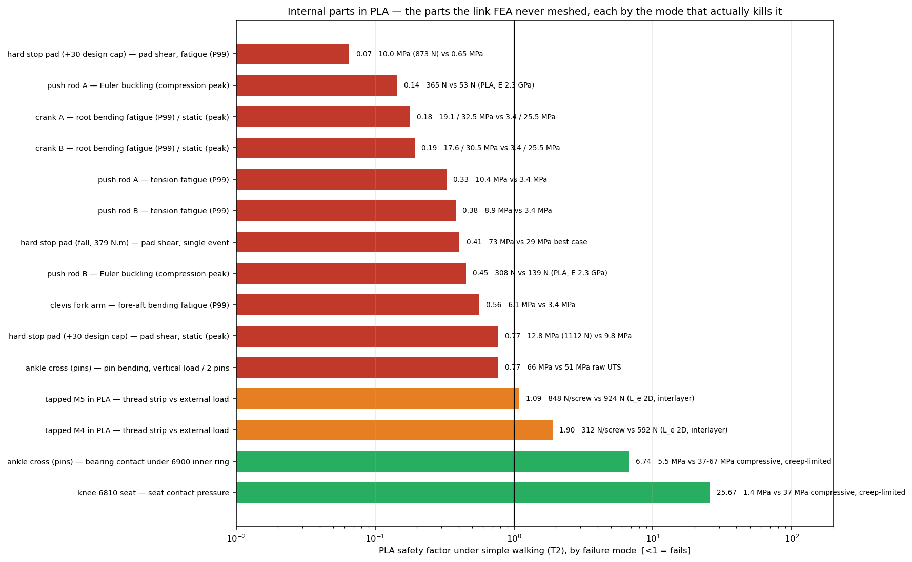

# 86. 링크 내부 부품 PLA 위험 순위 — 단순 보행 기준 (2026-08-20, v2 수명 환산 정정)

질문: 링크 **내부 부품**(스토퍼·로드·크랭크·십자·포크·베어링 시트·나사산)을 출력물로 쓰면
어느 것부터 위험한가. [[85_pla_triage_simple_walking]]이 판재를 다뤘다면, 이 문서는 FEA가
메시하지 않은 나머지다 — 그리고 이들은 대부분 **von Mises 지도에 안 나오는 모드**로 깨진다:
스트럿은 좌굴, 핀은 굽힘, 스톱면은 타격, 나사산은 벗겨짐, 시트는 크리프.

> 부품×파괴모드별 PLA 안전율(단순 보행 T2, 설계계수 1.25). 1 미만 = 못 버팀.

## §1 답 — 위험 순서

| 순위 | 부품 | 모드 | 보행 수요 | PLA 능력 | **SF** | 수명 |
|---|---|---|---|---|---|---|
| 1 | **하드 스토퍼 패드** (+30 설계캡) | 패드 전단 피로 | 10.0 MPa (873 N, P99) | 0.65 MPa | **0.07** | **0.6 h** |
| 2 | **푸시로드 A** | 오일러 좌굴 (압축 피크) | 365 N | **53 N** (E 2.3 GPa) | **0.14** | 즉시 |
| 3 | **크랭크 A / B** | 허브 굽힘 피로 | 19.1 / 17.6 MPa | 3.4 MPa | **0.18 / 0.19** | 0.3 / 0.5 h |
| 4 | 푸시로드 A / B | 인장 피로 | 10.4 / 8.9 MPa | 3.4 MPa | 0.33 / 0.38 | 9 / 21 h |
| 5 | 푸시로드 B | 오일러 좌굴 | 308 N | 139 N | 0.45 | 즉시 |
| 6 | 클레비스 포크 암 | 전후 굽힘 피로 | 6.1 MPa | 3.4 MPa | 0.56 | 178 h |
| 7 | **발목 십자(크로스) 핀** | 핀 굽힘, 정적 | **66 MPa** | 51 MPa (원 UTS) | **0.77** | 첫 걸음 |
| 7 | 하드 스토퍼 패드 (+30) | 패드 전단, 정적 피크 | 12.8 MPa (1,112 N) | 9.8 MPa | 0.77 | — |
| 8 | 탭 M5 (PLA에 직접) | 나사산 벗겨짐 | 848 N/본 | 924 N | 1.09 | 예압 넣으면 < 1 |
| 9 | 탭 M4 | 〃 | 312 N | 592 N | 1.90 | 〃 |
| — | 십자 핀 베어링 접촉 · 무릎 6810 시트 | 접촉압 | 5.5 / 1.4 MPa | 37 MPa | 6.7 / 26 | 크리프로 끼워맞춤 상실 |

★**출력물로 쓰면 안 되는 것(SF < 1)**: 스토퍼 패드, 푸시로드 2개, 크랭크 2개, 발목 십자,
클레비스 포크. **전부 2-RSU 발목 기구다.** 발목 기구 부품은 하나도 PLA가 안 된다.

### 스토퍼 — 사용자 직감이 맞다, 단 "어느 캡이냐"에 달렸다

- **sim 캡(+40/−50, ±20)은 보행에서 닿지 않는다**: 접촉 프레임 0.04 %, 잔류모멘트 0.3 N·m.
  이 캡이면 스토퍼는 보행 중 **무부하**다.
- **설계 캡 +30은 보행 프레임의 4.4 %(L) / 11.7 %(R)에서 넘는다.** 그 프레임의 관절모멘트는
  P99 52.4 / peak 66.7 N·m → r 60 mm 패드에 **873 / 1,112 N**, 매 걸음 타격. PLA 패드(설계
  전단면적 87 mm²)는 정적 SF 0.77, 피로 SF 0.07 → **수십 분**.
- **낙상 사건(379 N·m, docs/76 §12)**: 패드 전단 73 MPa vs PLA 최선 29 → 산산조각. PLA는
  노치 Izod 2.5~5 kJ/m²라 충격 부재 자체가 불가(docs/79 §8g).

→ 스토퍼는 **+40 캡이라도 알루미늄**이어야 한다. 보행에서 안 닿는 이유로 PLA를 쓰면 첫 낙상에
깨지고, 그 다음 낙상부터는 로드엔드(JS6 s₀ 0.52)가 받는다.

### 푸시로드 — 가장 확실한 즉시 파단

좌굴 임계는 E에 비례한다. 알루미늄 로드 A의 오일러 하중 1,578 N(`rods.json`)이 PLA에선
**53~80 N**. 보행 압축 피크 292 N(×1.25 = 365) → **SF 0.14**. 보행 프레임의 53 %가 압축이다.
로드 B(짧음)도 0.45. 인장 쪽도 P99 10 MPa로 피로 허용의 3배.

### 크랭크 — 단면 추정치이지만 자릿수가 명확하다

보행 크랭크 토크 P99 24 / peak 41 N·m (자코비안 역변환, 8,700 프레임). 14×26 mm 판 가정
(32.8 cm³ / 90 mm 암)으로 허브 굽힘 19 MPa P99 → 피로 SF 0.18. 단면을 2배로 봐도 0.36.
덧붙여 **RS03 출력축 클램프 허브**가 PLA면 크리프로 체결이 풀린다 — 응력 이전의 문제.

### 발목 십자 — 핀이 Ø10(6900ZZ 내경)이라 굽힘이 크다

수직 658 N을 두 핀이 나누고 시트 중심까지 19.75 mm 캔틸레버 → **66 MPa**. 알루미늄 SF 4.2,
PLA는 **원 UTS도 초과**(0.77). 핀을 강재로 넣고 몸통만 PLA로 해도 핀 구멍 베어링압 5.5 MPa는
정적으로 버티나 크리프로 헐거워진다.

## §2 출력물로 쓸 수 있는 것은? — 응력으로는 거의 없고, "접촉압만 받는 것"뿐

베어링 시트(무릎 6810: 1.4 MPa, 십자 핀 접촉 5.5 MPa)는 응력은 사소하나 **압입 끼워맞춤이
크리프로 풀려 래디얼 유격**이 생긴다 — 정밀도 문제지 파단은 아니다. 나사산은 외력만으로 SF
1.1~1.9이고 **예압을 넣는 순간 벗겨지거나 크리프**한다(docs/79 §8g: 모터 체결 플랜지 전부 불가).
인서트를 써도 인서트 주위 PLA가 같은 한계다.

## §3 방법

| 항목 | 출처 |
|---|---|
| 관절력 | `loads_walk.json` T2 (링크로컬 P99 ×1.25) |
| 로드 힘·크랭크 토크 | 보행 프레임 8,700개(L+R, 4배 데시메이션)의 (τ_pitch, τ_roll, q)를 `ankle_stopper_sizing.jacobian` 역변환 → 크랭크 토크 → `statics_direct`로 로드 축력(부호: 핀→볼 방향 양 = 압축) |
| 스토퍼 수요 | 보행 프레임 중 q_pitch > +30° 인 프레임의 §8i 보정 관절모멘트(sim 캡 접촉 프레임은 0.04 %뿐) |
| 로드 기하 | `rods.json`(캠페인 좌굴 해석: I_min·핀 스팬·오일러 하중) — PLA는 E 비로 스케일 |
| 수명 환산 | **v2**: 보행 사이클 = 스탠스 개시율 1.16~1.19 Hz(T2 실측) → 4.3×10³/h. v1의 2.2×10⁴/h는 관절 각속도 반전율(베어링 프레팅 수치)이라 5배 과소 수명이었다. 면내 σ_e 5.1 기준 — 층간이 주응력을 받으면 420배 짧다 |
| PLA 물성 | docs/79: UTS 51 면내·17 층간, E 2.3(3.5) GPa, 압축 37~67, Izod 2.5~5, 피로 0.10 UTS @2e6, k 5.5 |

**추정 단면**(CAD 커널 없이 체적·반경에서 유도, ±50 % 불확실): 크랭크 14×26, 포크 암 30×14.
⚠클레비스 포크는 **어느 링크 FEA에도 들어 있지 않다** — L1 모델에선 고정 경계(M6 클레비스 스택)이고
L2 모델에선 모터 프록시로 우회된다(`setup_L2_shin.json`). 여기 손계산이 유일한 평가다.
로드는 Ø14×1.5 튜브 + JS6 로드엔드(docs/78 §11)라 알루미늄으로 만드는 비용이 가장 싸다.
스토퍼 패드 87 mm²는 알루미늄 설계값(docs/76 §12b). 십자 핀 Ø10은 6900ZZ 내경으로 확정.

도구: `tools/fea/internal_parts_pla.py` → `~/pyg_fea/work/internal_parts_pla.json`

관련: [[85_pla_triage_simple_walking]] · [[76_ankle_2rsu_design_summary]] §12 ·
[[78_ankle_stopper_derivation]] · [[79_pla_feasibility]] §8g
