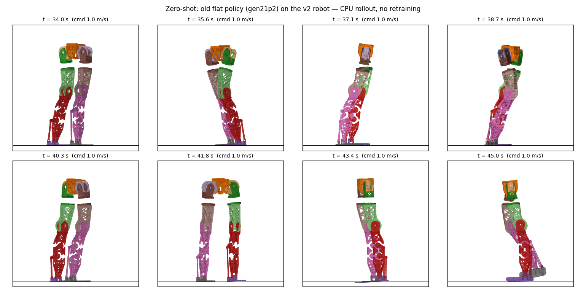

# 87. Pygmalion v2 로봇 모델 — 최종 CAD에서 URDF·MJCF 재구축 (2026-08-20)

*v1 → v2 (레드팀 1차, 13에이전트: massprops·frames·placeholders REFUTED, env-binding DISPUTED) →
**v2.1 (레드팀 2차, 9에이전트: 4주장 전부 "수치 재현, 부차 정정")**. 정정 내역은 §7.*

목표([[83_fusion360_measurement_spec]] 후속): 최종 CAD에서 조인트·질량(모터/나사/베어링)을 정확히
걸어 **URDF + mjlab 로봇 파일 + 충돌 메시**를 만들고, 전 관절 구동·관성을 검증해 보행 RL에 쓸 수
있게 한다. 발목은 **roll/pitch 직렬**.

> 위: 직립 자세(좌 측면 x–z, 우 정면 y–z), MJCF가 실제로 읽는 메시를 MuJoCo 바디 자세로 투영.
> 아래: 관절별 ROM 최소/중간/최대 스윕(왼다리). 이 호스트는 GL이 없어 자체 투영 렌더다.

## §1 결과물

| 파일 | 내용 |
|---|---|
| `pygmalion_locomotion/assets/pygmalion_v2/pygmalion_v2.urdf` | 13관절(free + 12) URDF, 메시·관성 포함 |
| `mujoco-sim/mjlab/.../xmls/pygmalion_v2.xml` | mjlab 로봇 파일 (기존 `pygmalion.xml`과 같은 클래스·이름 규약) |
| `pygmalion_locomotion/assets/pygmalion_v2/meshes/*.stl` | 시각 메시(바디별, 링크 프레임, m) + `*_hull.stl` 충돌 볼록껍질 + `R_*` 미러. 47 MB, git 제외 — STEP에서 결정적으로 재생성 |
| `~/pyg_fea/steps/robot_massprops_step.json` | 강체별 질량·COM·관성텐서(CAD 전역 mm) + 모터 축 |
| `pygmalion_locomotion/assets/pygmalion_v2/validation.json` | 검증 수치(직립 높이 등) — mjlab 키프레임이 이 파일을 읽음 |

**웹 뷰어**: `tools/robot_model/web_viewer.py --port=8890` (viser) → `http://192.168.20.177:8890` —
관절 슬라이더(실제 ROM)·HOME/BENT 프리셋·L/R 링크·시각/충돌/껍질/모터 토글·바디별 질량·COM·관성(모델 vs CAD).

사용: `PYG_V2=1` 로 mjlab 전 태스크가 v2 모델을 쓴다(`pygmalion_constants.py` 토글, 기존 cant/rolloff
토글과 같은 패턴). 액추에이터·관절명·발 사이트·충돌 geom 이름(`L_foot2..6_collision`)은 기존과 동일해
task 설정을 손대지 않는다.

## §2 어떻게 만들었나 (`tools/robot_model/`)

1. **질량속성 — `massprops_step.py`**: 링크별 STEP의 모든 솔리드를 OCC 체적적분으로 질량·COM·**풀 관성텐서**
   (6061 2.70). 나사·베어링은 인벤토리 체적×7.85의 점질량. 모터 7개는 자리표시자 형상 + **카탈로그 질량**
   (RS04 1.42, RS03 0.88 — CAD 질량은 자리표시자, docs/83 §1). 모터 회전축은 솔리드의 최대 원통면에서
   **실측**. 체적은 인벤토리와 0.5 % 이내 일치(assert), 텐서는 양정·삼각부등식(assert).
2. **강체 귀속 (v2 정정)**: 볼트 패턴(`interface_review`)을 따른다 — 골반 = CenterParts + Waist_Yaw RS04
   + **양쪽** 힙피치 스테이터(오른쪽은 미러) + CRBS808 외측 하우징(힙피치 스테이터에 10×M4); 힙피치링크 =
   HipPitch2Roll 나머지 + 힙롤 RS04; 힙롤링크 = PipRoll2Yaw + 힙요 RS03 + **힙요 베어링 링 70 cm³**(RS03
   스테이터에 8×M4, 6814 외륜 시트); **대퇴 = HipYaw2Knee + 무릎 RS04**(스테이터가 대퇴 클레비스 판 사이에
   2×10×M4 PCD106으로 물리고, 정강이는 6×M5 출력 플랜지에 매달림); 정강이 = Knee2Ankle + 발목 RS03×2 +
   클레비스 포크 + 크랭크 + 로드/2; 발목피치링크 = 십자; 발 = 발판 + 로드/2. 베어링은 **관절 축까지의
   거리**로 고른 두 바디에 반씩(힙피치·힙롤이 한 점을 공유해 점 기준으론 롤 쌍이 절대 선택되지 않던 버그 수정).
   발목 6900ZZ 4조는 피치 트러니언 쌍 → 정강이/십자, 롤 필로 쌍 → 십자/발. 골반 STEP은 왼쪽 반만 있어
   왼다리 그룹에서 골반으로 옮긴 부품(CRBS808 하우징·베어링 절반)과 힙피치 스테이터는 **x-미러 복제**.
   결과: 골반 **5.65**(좌우 대칭, COM x 0.1 mm) / 힙피치 2.18 / 힙롤 1.82 / **대퇴 2.76 / 정강이 3.35** /
   십자 0.09 / 발 0.78 kg.
   ⚠사용자 표는 무릎 모터를 `Knee2Ankle` 그룹에 둔다 — Fusion 컴포넌트 트리 기준이고, 여기서는 볼트
   경로 기준. 실물 조립에서 어느 쪽이 맞는지 Fusion에서 확인 요망.
3. **관절 프레임**: 힙 3축이 **(−123.7, 70, 60)에서 교차**(모터 원통축 실측 — 구 MJCF의 힙롤 15° 캔트는
   현 CAD에 없다). 무릎 (y115, z−310), 발목 (y145, z−800). CAD→sim = z축 +90° (sim = (−y, x, z)):
   전방 +x, 왼다리 −y — 기존 모델 규약. 축 부호도 기존과 동일(왼다리 hip_pitch +y, hip_roll +x, hip_yaw −z,
   knee −y, ankle_pitch −y, ankle_roll −x; **오른다리는 구 모델처럼 두 롤 축만 미러** — +q = 양쪽 모두
   내전 / 발바닥이 바깥을 보는 **외번**(eversion), 요는 양쪽 같은 방향). `validate_robot.py`가 +dq에 대한
   **발 바디 회전벡터의 L×R 부호 지문**(기하와 무관)을 구 모델과 관절별로 대조한다 — 결과 hip_roll (−1,0,0),
   hip_yaw (0,0,+1), 피치 3관절 (0,+1,0), ankle_roll (−1,0,0), 전부 구 모델과 일치.
   ROM: 무릎 **−120°**(정강이 무릎판이 대퇴 클레비스와 −120°에서 간섭, 구 −140은 이 CAD에서 불가),
   발목 pitch **−50/+30**(설계 캡, docs/71 §8g·76 §12), 나머지 구 모델과 동일.
4. **메시 — `meshes_step.py`**: gmsh(OCC)로 솔리드별 표면 메시(8 mm) → 바디별 병합 → 링크 프레임 변환 →
   STL; 충돌 = 구조 솔리드 볼록껍질. 모터 자리표시자는 gmsh가 솔리드당 수 분을 쓰길래 메시하지 않고
   **실측 축·반경·길이의 해석 원통**으로 그린다(`build_robot.py`).
5. **빌드 — `build_robot.py`**: 같은 JSON에서 URDF와 MJCF를 동시에 생성(일관성 보장), MuJoCo 컴파일 검사.
   충돌 프리미티브 **23개**(몸통·머리·골반 박스 + 다리당 10: 힙피치 구 r 68·힙롤 캡슐·대퇴·정강이·**정강이 뒤
   발목모터 쌍 캡슐**·발 캡슐 5열). 골반–힙롤링크, 힙피치링크–대퇴는 구조상 중첩된 클러스터라 제외. 볼록껍질은
   `hull` 클래스(기본 비활성; 켜려면 정강이–발 제외 필요, 29.5 mm 관입). flat 태스크의 제약 예산 **njmax 300**에
   맞춰 모터 원통은 충돌에서 뺐다. 검증에서 프리미티브 접촉 개시는 hull 메시와 1° 이내(내전 11.0 vs 9.5°).

## §3 검증 (`validate_robot.py`)

| 항목 | 결과 | 기준 |
|---|---|---|
| 바디 질량 | MJCF = 질량속성 파일 (1e-3 이내) | |
| 힙→무릎 / 무릎→발목 | **0.370 / 0.490 m** | CAD 370 / 490 ✓ |
| 힙→밑창 | 0.903 m → 직립 base 높이 **0.903** | 구 모델 0.87 |
| 스탠스 폭 | 0.2474 m | CAD 2×123.7 ✓ |
| 관절 스윕 자기충돌(61점) | hip_roll 내전 **11.0°**부터 L/R 정강이(다른 다리 직립 시; 양다리 내전이면 4.75°), hip_pitch **−120°**부터 대퇴–몸통 — 둘 다 기하학적 사실 | 나머지 4관절 0 |
| **관성 실측(MuJoCo 질량행렬)** | 힙피치 축 **2.261 kg·m²**, 무릎 축 **0.451** | 부품목록 점질량 추정 2.240 / 0.443 (+1~2 % = 부품 자체 텐서) ✓ |
| 총질량 | **43.70 kg** | 표 교정값 44.51(배터리 제외) — 차이 ≈ 나사 141개/다리(~0.8 kg)·CAD 리비전 차 |
| 좌우 규약 | 구 모델과 일치: hip_roll 미러·hip_yaw 동방향 (assert) | |
| mjlab 태스크 환경(CPU, `PYG_V2=1`) | 빌드·리셋·100 step 정상, 액추에이터 12개 정규식 바인딩 ✓ | 태스크 설정 무수정 |
| 직립 안정(순수 MuJoCo, 관절 PD 300 유지) | base 0.899~0.901 m, 3 s, 접촉 20, 관입 0.4 mm | 발이 체중을 받침 |
| 직립 자세 CoM | 발목 앞 **+63 mm**, 지지마진 발끝 117 / 뒤꿈치 143 mm | 구 모델 +65 mm — **v1의 "+23 mm, 더 균형"은 상체 집중질량을 104 mm 뒤에 둔 오류였다(철회)** |

⚠**영행동(zero action) 테스트는 직립 테스트가 아니다**: 태스크의 PD(발목 Kp 28.5, Kd 6)만으로는
정책 없이 구 모델도 42 step에 `low_base`로 종료된다(v2는 53 step). 모델 결함이 아니라 정책 몫.

## §4 자리표시자 — Fusion이 붙으면 교체할 것

1. **상체 16.11 kg 집중질량**(Torso+Neck+팔×2 15.34 + WaistYaw2Pitch 0.78, docs/82 교정표). COM은 구
   base_link COM을 **힙 높이 원점으로 재표현**한 (+0.012, 0, 0.366) — v1은 x를 구 base 원점 기준(−0.092)
   그대로 써서 104 mm 뒤에 놓았었다. 관성은 구 base 스케일링. → Fusion §2 상체 질량속성 또는 §7 재-export.
2. **모터 질량 = 카탈로그**(케이블·브래킷 제외). → Fusion 실측. 양쪽 힙피치 스테이터와 CRBS808 하우징·
   베어링 모두 골반에 계상(v1은 오른쪽 1.42 kg 누락, v2는 하우징 0.17 kg 누락 → 지금 골반 좌우 대칭).
3. 이 STEP(8/14)에는 **나사 141개/다리가 없다**(docs/82 §6) — ~0.8 kg. 총 43.53 vs 표 44.51의 차이가 이것.
4. 발목 roll 캡 ±20(`PYG_ANKLE_ROLL15` 토글 그대로), pitch 캡 **+30**(설계값). 발목 2-RSU의 JS6 콘·크랭크
   사점·스톱 패드는 직렬 모델에 없다 — 정책이 기구가 못 가는 자세를 배울 수 있는 구조적 한계, v2.1(§5)이 답.
5. 액추에이터 armature: `PYG_V2`이면 2-RSU 반영관성 pitch 0.0064 / roll 0.0035(2×0.005/레버비², 레버비
   1.25/1.68) — 구 모델의 RS00 값(0.0005)은 roll에 7배 과소였다. 태스크의 `thermal_effort` 정격(ankle 20/5)은
   아직 구 직렬 분할 — 2×RS03 기준 ≈32/24가 맞음(태스크 측 수정 필요).

## §5 2-RSU 폐루프(AB 모터 링크) — **MuJoCo에서 된다** (v2.1 후보, `pygmalion_v21_loop.xml`)

`tools/robot_model/loop_ankle_test.py`가 v2 위에 실기구를 얹는다: 정강이의 두 RS03 축(실측)에 크랭크
힌지, 크랭크 핀(JMC 상부 볼조인트 위치)에 로드 볼조인트, 로드 끝 사이트 ↔ 발 볼조인트 사이트를
`equality/connect`(site–site)로 닫는다. 루프당 DOF +1+3−3 = +1, 두 루프 = +2 → 직렬 pitch/roll은
수동이 되고 크랭크가 구동한다.

| 검사 | 결과 |
|---|---|
| CAD 자세에서 폐루프 잔차 | A/B **0.000 mm** (로드 길이 287.0 / 194.5 = CAD 거리, 크랭크 반경 65.0) |
| 준정적 기구학(크랭크 잠금, 중력 0) | 크랭크 ±11.5° → pitch ∓14.4° (비 1.25 = 65/52 레버비), 차동 ±5.7° → roll ±9.6°, 잔차 ≤0.01 mm |
| 크랭크 위치서보(kp 100, 중력 on) | 크랭크 +11.5 → pitch −14.8 / roll +1.0, −11.5 → +14.1, 차동 → roll −19.3, 복귀 0; 잔차 ≤0.08 mm |

⚠교훈 둘: ① 가벼운 중간체(십자 0.067 kg)+폐루프는 `armature`(0.005)와 dt 1 ms 없이는 솔버가 반대
분기로 넘어간다. ② **MjSpec 액추에이터는 `biastype=AFFINE`을 명시해야** 위치서보가 된다 — 기본값
(none)이면 biasprm이 무시돼 순수 토크모터가 되고, 이게 첫 시도의 "폭주"였다.

RL 통합(v2.1)은 액션 공간 변경(발목 pitch/roll → 크랭크 A/B)과 태스크 정규식·보상의 발목 참조
수정이 필요해 **별도 단계**. 이득은 로드 힘·스토퍼 하중을 시뮬에서 직접 재는 것.

## §7 레드팀 정정 요약 (13 에이전트, 6주장 × 2렌즈 + 누락 스윕)

| 주장 | 판정 | 정정 |
|---|---|---|
| massprops | REFUTED | 무릎 RS04 → 대퇴, 힙요 링 → 힙롤링크, CRBS808 하우징 → 골반, 베어링 축거리 분배(버그), 오른쪽 힙피치 스테이터 추가 |
| frames | REFUTED | 오른다리 hip_roll/ankle_roll 축 미러(구 모델 규약) — 안 그러면 +25° 내전캡이 오른쪽에선 45° 내전 |
| inertial-transform | STANDS | R·I·Rᵀ, 평행축, 미러 전부 재현 |
| meshes | STANDS | 링크 프레임·미러·껍질 0.33 mm 이내 재현 |
| env-binding | DISPUTED | 이름은 전부 바인딩되나 롤 축 규약(위) |
| placeholders | REFUTED | 상체 COM +104 mm 오류, 오른쪽 모터 누락, WaistYaw2Pitch 누락, 나사 0.8 kg |
| 누락 스윕 | — | 무릎 −120° 기하 스톱, 발목 +30 캡, 롤 armature 7배 과소, 힙 충돌체 부재, 몸통 캡슐/IMU +104 mm |

**2차(정정본 재검증, 9 에이전트)**: rebooking·axes-ranges·collision DISPUTED(수치 전부 재현, 부차), base-lump STANDS.
정정: 골반으로 옮긴 CRBS808 하우징·베어링 절반을 **오른쪽에 미러하지 않은 회귀**(0.17 kg) 수정 · 발목 6900 4조를
십자 경유로 분배 · 검증기 좌우 규약 assert를 점 변위(4관절이 'n/a')에서 **회전벡터 지문**으로 교체 · 빌더 수정 후
XML 미재생성(무릎 모터 시각 원통) 재빌드 · "내번"→외번 · 23 geoms / njmax 300 / 접촉 개시 11.0°·−120°로 수치 정정 ·
루프 테스트 `explicitinertial` 누락 수정(크랭크·로드 0.33 kg 이중계상은 v2.1 통합 시 정리).

남은 미결: hip_roll 내전 ≥18°에서 힙피치/힙롤 전면판 간섭 시작(CAD 확인 필요, +25° 캡이 스톱에 걸칠 수 있음;
반대 다리 외전 시 24°에서 대퇴 캡슐–골반 박스 접촉) · 태스크 `thermal_effort` 정격 · URDF velocity 20 rad/s 출처
(RS04 무부하 19.9) · 8개 링 나사/10개 하우징 나사는 링크 규칙상 옛 바디에 잔류(34 g).

## §8 RL 준비 상태 — 구 정책 제로샷 (CPU, 학습 없이)

GPU가 내려가 있어 학습은 못 하지만, **학습 파이프라인과 같은 경로**(`measure_loads.py`, 체크포인트 →
정책 추론 → mjlab 환경 → MuJoCo Warp)로 구 flat 앵커 정책(gen21p2, 구 모델로 학습)을 v2에 그대로 돌렸다
(`analysis/zeroshot_v2.py`, 3명령 × 15 s).

| 명령 vx | base z min/mean | 달성 vx | 낙상 | knee |τ| P99 | GRF_z P99 |
|---|---|---|---|---|---|
| 0.0 (정지) | 0.880 / 0.907 | +0.01 | 0 | 84.6 N·m | 420 N |
| 0.5 | 0.697 / 0.879 | **+0.23** | 0 | **120 (포화)** | 956 N (1.9 BW) |
| 1.0 | 0.696 / 0.873 | −0.03 | 0 | **120 (포화)** | 925 N |

**45 s 동안 넘어지지 않고 서 있고**, 0.5 m/s 명령엔 절반 속도로 걷지만 1.0에선 제자리 — 질량 분포·무릎 높이·
정강이 길이가 바뀐 로봇에서 구 정책은 무릎 토크를 포화시키며 버틴다. 즉 **파이프라인은 v2에서 끝까지 동작**하고,
재학습이 필요하다는 것(예상대로)과 그 출발점(직립 유지)이 확인됐다. 영상: `docs/img/robot_v2_zeroshot_walk1.mp4`.

## §6 환경 제약 (이 호스트)

- **GPU 드라이버 미로드**(`nvidia-smi` 통신 실패, `/dev/nvidia*` 없음). DKMS 모듈 570.195.03은 현 커널
  6.8.0-136용으로 **빌드돼 있고 로드만 안 된 상태**(`modinfo nvidia` 정상) — `sudo modprobe nvidia`
  (또는 재부팅)로 복구 가능하나 sudo 비밀번호가 필요해 사용자 몫. 학습은 복구 후 `scripts/run_training.sh`.
- **Fusion MCP(27182)**: 이 리눅스 호스트·LAN에 리스너 없음 — Windows PC의 `ssh -L`은 그쪽 로컬용.
  PC(192.168.20.172 추정)는 SSH 22번도 닫혀 있어 여기서 정방향 터널도 불가. PC에서
  `ssh -R 27182:127.0.0.1:27182 syaro@192.168.20.177` 역터널이 유일한 경로.
  클라이언트는 준비됨(`tools/fusion/mcp_client.py list`).

관련: [[81_rl_model_vs_cad_mass]] · [[82_final_design_mass_review]] · [[83_fusion360_measurement_spec]]
