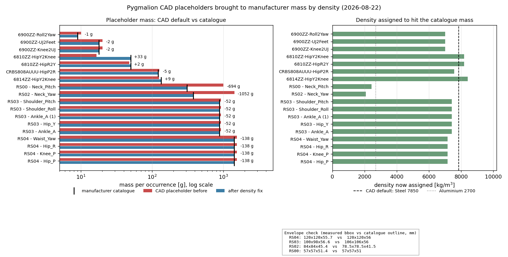
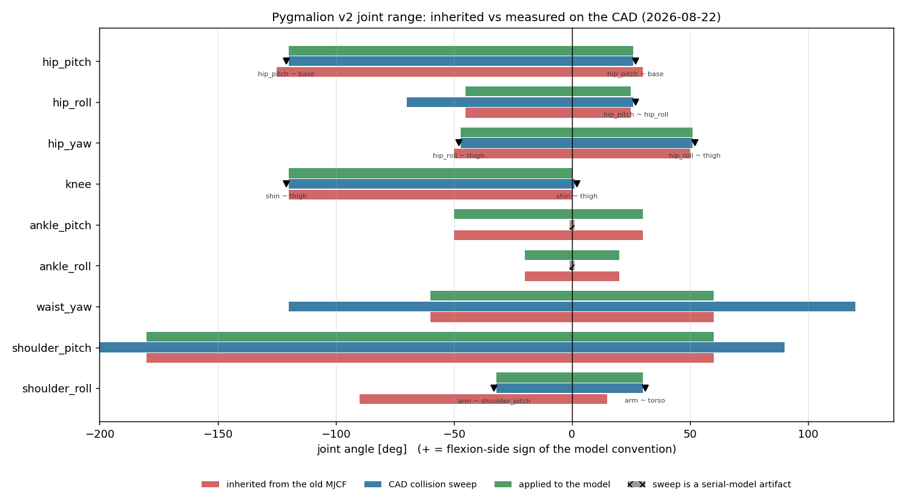
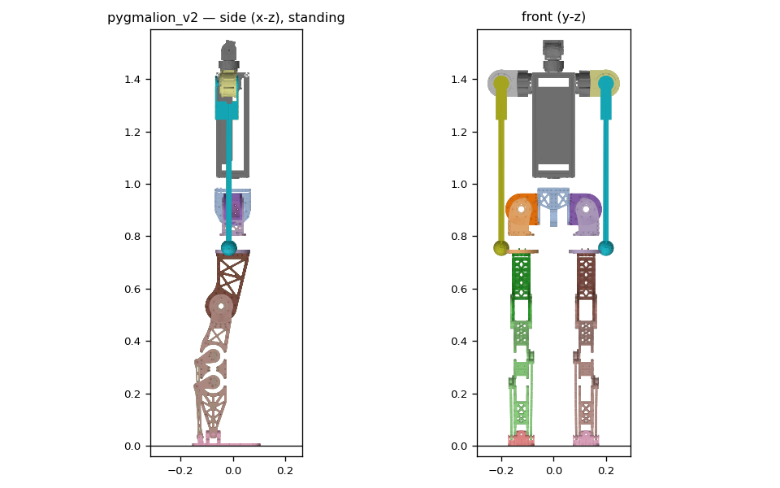
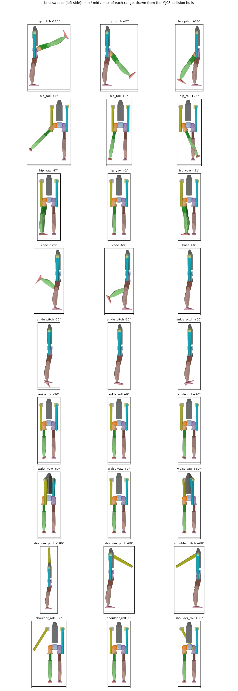

# 88. CAD 자리표시자 질량 보정 · 실측 가동범위 · 상체 관절화 (2026-08-22)

> 상위: [[87_robot_model_v2]] · [[82_final_design_mass_review]] · [[83_fusion360_measurement_spec]]
> 원문: [[raw/bearing-rodend-masses]] · [[raw/robstride-datasheet]] (§RS02 정정, §자리표시자 외피 실측)
> 도구: `tools/fusion/set_placeholder_density.py` · `tools/fusion/dump_bodies.py` ·
> `tools/robot_model/rom_check.py` · `tools/robot_model/upper_meshes_fusion.py` ·
> `tools/robot_model/plot_density_fix.py`

사용자 지시 4건: (1) 관절을 실제로 돌려 충돌 없는 지점으로 가동범위 설정, (2) 모터 질량을 스펙시트
기준으로 밀도 수정, (3) 베어링 실물 무게 조사 후 밀도 보정, (4) waist yaw + shoulder pitch/roll +
ArmR 더미로 상체 모델링.

---

## §0 MCP 연결이 바뀐 점 — stdout이 죽고 예외 채널이 열렸다

이번 세션의 Fusion 빌드에서 `fusion_mcp_execute(featureType="script")`가 **`print` 출력을 전혀
돌려주지 않는다**(`{"message": "", "success": true}`). 반면 스크립트가 예외로 끝나면 **traceback
전문이 `error`로 돌아온다**. 그래서 페이로드를 예외로 실어 보낸다:

```python
def emit(o):
    raise _P("JSONSTART" + json.dumps(o))
```

- 용량: 200 KB까지 손실 없이 확인(이전의 20 KB 캡·base64 청크 분할이 전부 불필요해짐).
- ★ **함정**: 예외로 끝나면 Fusion이 **문서 편집을 롤백한다**. 밀도 변경이 한 번 통째로 되돌아갔다.
  → 문서를 바꾸는 스크립트는 `mcp_client.run_script()`로 **정상 종료**시키고, 확인은 별도 읽기 호출로.
- `fusion_mcp_read`의 `queryType` enum: `apiDocumentation · screenshot · document · projects ·
  activeCommand`. `document`는 `operation`(search/open/recent)이 추가로 필요.

---

## §1 자리표시자 질량 — 13.695 kg → 11.171 kg (−2.492 kg)



*왼쪽*: 오커런스별 질량(로그축). 빨강 = 보정 전 CAD, 파랑 = 보정 후, 검정 막대 = 제조사 카탈로그.
*오른쪽*: 각 자리표시자에 새로 부여한 밀도. 점선이 CAD 기본값 Steel 7850과 Aluminium 2700.

| 부품 | 개수(문서) | 전 | 후 = 카탈로그 | 새 밀도 kg/m³ |
|---|---|---|---|---|
| RS04 (hip pitch·roll, knee, waist yaw) | 4 | 1558.3 g | **1420 g** | 7153 |
| RS03 (hip yaw, ankle ×2, shoulder ×2) | 5 | 931.7 | **880** | 7414 |
| RS02 (neck yaw) | 1 | 1432.3 | **380** | 2083 |
| RS00 (neck pitch) | 1 | 1004.1 | **310** | 2424 |
| IKO CRBS 808 A UU | 1 (53바디) | 126.5 | **122** | 7568 |
| NSK 6814ZZ | 1 | 125.1 | **134** | 8407 |
| NSK 6810ZZ ×2 | 2 | 48.0 / **16.5** | **50** | 8174 |
| NSK 6900ZZ ×5바디 | 3 오커런스 | 10.08 각 | **9** 각 | 7008 |
| JMC-JS06 ×4 | 4 | 12.8 | **손대지 않음** | — |

CAD는 좌측 다리 1개만 모델링하고 나머지는 미러이므로, 실제 로봇 기준 개수는 RS04 ×7 · RS03 ×8 ·
RS02 ×1 · RS00 ×1이다.

### 이번 작업에서 잡힌 실제 오류 3건

1. **`6810ZZ-HipY2Knee`가 Aluminium 6061로 지정돼 있었다** (16.5 g). 같은 품번의 다른 개체는
   Steel(48.0 g). 베어링이 알루미늄일 수 없다 → 50 g으로 보정, **다리당 +33.5 g**.
2. **RS02는 380 g이다.** 405 g은 리셀러 값이고 매뉴얼(`RS02User Manual260713.pdf` §1.4)은
   `380g±3g`. 검증 에이전트가 다른 호스트의 다른 리비전을 `pdftotext`로 직접 추출해 재확인.
3. **JMC-JS06 자리표시자는 로드엔드가 아니라 구면 베어링 인서트다.** 바디 3개(Outer Shell /
   Brass Bushing / Inner Ball), 볼 지름 **12.7 mm**, 합계 12.83 g — THK **PB6 인서트 13 g**과
   1.3 % 차이로 **이미 맞다**. 리서치가 추정한 "15.8 mm 볼 로드엔드 35 g"을 그대로 넣었다면
   유닛당 +22 g, 8개 176 g을 발목 끝단에 잘못 얹을 뻔했다.

### 리서치가 틀렸고 실측이 맞았던 지점 (기록해 둘 가치가 있음)

검증 워크플로는 "RS04 자리표시자 체적 198.5 cm³ = 카탈로그 외피 633 cm³의 31 % → 형상이 축소돼
있으므로 관성과 간섭 판정을 믿지 말라"고 결론냈다. **Fusion에서 bbox를 직접 재니 RS04는
120.0 × 120.0 × 55.7 mm로 카탈로그 120 × 120 × 56과 일치한다.** 체적이 작은 이유는 축소가 아니라
**중공(셸)**이다. → 밀도 보정은 타당하다.

다만 셸에 균일 밀도를 주면 질량은 정확해도 **관성은 실제보다 크게** 나온다(자축 기준 최대 2배:
균일 원판 ½mr² vs 링 mr²). 링크 자체 관성 대비 10 % 수준이라 보수적 방향으로 수용한다.

**교훈: 자리표시자는 "무엇을 대신하는가"를 형상으로 먼저 재고, 그 다음에 카탈로그를 찾는다.**

---

## §2 상체 관절화 — 3 DoF, 더 이상 덩어리가 아니다

CAD가 실제로 가진 관절만 쓴다. 세 축은 모두 베어링/모터 기하에서 나온다.

| 관절 | 축 (CAD → sim) | 위치 (CAD mm) | 모터 | 부모 → 자식 |
|---|---|---|---|---|
| `waist_yaw` | z → z | (0, 70, 177.5) | RS04 | base_link → torso_link |
| `shoulder_pitch` | x → +y | (−200, 85, 540) | RS03 | torso_link → {L,R}_shoulder_pitch_link |
| `shoulder_roll` | y → ∓x | (−200, 85, 540) | RS03 | {L,R}_shoulder_pitch_link → {L,R}_arm_link |

부호는 다리와 같은 규약: pitch +q = 신전(사지 뒤), roll +q = 내전(중심선 쪽, 우측은 축 반전),
yaw +q = 좌회전. 어깨 pitch/roll 축은 동심이므로 `arm_link`의 부모 오프셋은 0이다.

| 바디 | 질량 kg | COM (링크프레임 m) | 주관성 kg·m² |
|---|---|---|---|
| `torso_link` | 5.966 | (−0.0152, 0, 0.2790) | 0.162 / 0.134 / 0.0398 |
| `shoulder_pitch_link` ×2 | 1.178 | (−0.0018, 0.0069, 0) | 0.0020 / 0.0013 / 0.0015 |
| `arm_link` ×2 | 2.841 | (−0.006, −0.0001, −0.2558) | 0.175 / 0.177 / 0.0025 |

메시는 STEP에 없으므로(STEP은 다리+골반뿐) MCP로 직접 받아 링크 프레임 STL로 썼다. 어깨 피치
모터는 CAD에 하나뿐이라 별도 그룹(`torso_shpitch`)으로 받아 좌우 두 벌로 그린다.

**전체 로봇 42.098 kg** = 골반 5.166 + 몸통 5.966 + 다리 11.464 ×2 + 팔측 4.019 ×2.
사용자 최종설계표의 31.02 kg는 [[82_final_design_mass_review]] §2에서 확인한 대로 **편측+중앙**
합계이며, 같은 기준으로 우리 값은 26.615 kg (표의 카탈로그 교정치 26.021과 0.6 kg 차 — 나중에
발견된 나사 20개와 베어링 보정분).

---

## §3 가동범위 — 물려받은 값이 아니라 CAD에서 실제로 돌려서 잰 값

`tools/robot_model/rom_check.py`: 조립된 CAD를 관절별로 0.5–1°씩 돌리면서, **q=0에서 이미
닿아 있지 않던** 두 솔리드가 서로를 파고드는 각도를 찾는다. 결과는
`/home/syaro/pyg_fea/fusion/rom_measured.json`.

### 이 측정이 신뢰할 만해지기까지 고친 것 3가지

세 번을 다시 짰다. 각 단계가 어떤 가짜 결론을 냈는지 기록해 둔다.

1. **바디 단위 제외 → 무릎 스토퍼가 사라진다.** q=0에서 닿아 있는 *바디 쌍*을 통째로 빼면
   thigh~shin이 제외되고, 무릎의 진짜 스토퍼(깊은 굴곡에서 종아리가 허벅지에 닿음)가 안 보인다.
   → "무릎은 −160°까지 자유" 라는 오답.
2. **볼록 껍질 → 동심 부품이 전부 가짜 간섭.** 솔리드마다 convex hull을 쓰면 포크(요크) 형상의
   빈 공간이 메워져, 요크 안에서 도는 모터가 계속 "파고든다". q=0 기준선에서 thigh~shin이
   **105 mm** 겹쳐 있었다. → hip_roll ±4°, 무릎 −70° 같은 오답.
   **실제 삼각형 메시(FCL BVH, 59만 삼각형)로 바꾸니 q=0 겹침이 52쌍/105 mm → 6쌍/최대 5.1 mm**로
   떨어졌다. 이 숫자 자체가 볼록 껍질이 원인이었다는 증거다.
3. **관절과 무관한 쌍이 잡힌다.** `hip_pitch`가 "팔~어깨" 접촉으로 막힌다고 나왔다 — 그 관절은
   팔을 움직이지 않는다. → **스윕 관절이 두 바디의 상대 자세를 실제로 바꾸는 쌍만** 인정하도록 필터.

추가로 두 종류의 접촉을 판정에서 분리했다:
- **cross-limb**(반대쪽 다리, 또는 늘어뜨린 팔 vs 다리): 관절 스토퍼가 아니라 전신 자세 제약이다.
  시뮬레이터가 접촉으로 풀 문제이고, 관절 범위에 굽어 넣으면 하드웨어가 낼 수 있는 자세를 금지하게 된다.
- **closed chain**(발목): 아래 §3b.

### 결과



| 관절 | 물려받은 값 | **CAD 스윕** | 무엇이 막는가 | **모델에 적용** | 적용 근거 |
|---|---|---|---|---|---|
| hip_pitch | −125 / +30 | **−120 / +26** | 양쪽 다 `hip_pitch_link ~ base_link` (힙 요크가 골반에) | −120 / +26 | 실측 그대로 |
| hip_roll | −45 / +25 | −70(탐색끝) / **+26** | 내전측 `hip_pitch_link ~ hip_roll_link` | −45 / **+25** | 외전은 설계 캡 45 유지, 내전 +25는 gen21 판정(2026-07-13)이고 실측 하드스톱 +27의 2° 안쪽 |
| hip_yaw | −50 / +50 | **−47 / +51** | 양쪽 다 `hip_roll_link ~ thigh_link` | −47 / +51 | 실측 그대로 |
| knee | −120 / 0 | **−120 / +1** | 양쪽 다 `shin_link ~ thigh_link` | −120 / **0** | 굴곡 −120은 실측이 이전 red-team 추정과 정확히 일치. 과신전은 금지(금속은 +2에서 닿음) |
| ankle_pitch | −50 / +30 | (±1, 무효) | 닫힌 사슬 — §3b | −50 / +30 | 메커니즘([[71_ankle_2rsu_design]] §8g · docs/76 §12) |
| ankle_roll | −20 / +20 | (±2, 무효) | 닫힌 사슬 — §3b | −20 / +20 | JS6 클레비스 스윙콘 (`PYG_ANKLE_ROLL15`로 ±15) |
| waist_yaw | (신규) | **±120 이상 자유** | 없음 | ±60 | 케이블 배선 여유. 기하는 ±120까지 열려 있음 |
| shoulder_pitch | (신규) | **−200 / +90 전 구간 자유** | 없음 | −180 / +60 | 팔이 더미 봉이라 어디에도 안 닿음 → 인체 타당 범위를 **선언**했음을 명시 |
| shoulder_roll | (신규) | **−32 / +30** | 외전 `arm ~ shoulder_pitch_link`, 내전 `arm ~ torso` | −32 / +30 | 실측 그대로 |

★ **무릎 −120°는 이전 red-team 추정치와 정확히 일치**했고, **hip_roll 내전 하드스톱 +27°는 RL
gen21 분석이 독립적으로 도출한 +25° 캡을 기하학적으로 뒷받침**한다. 서로 다른 두 경로가 같은 곳을
가리킨 셈이다.

### §3b 발목은 이 방법으로 잴 수 없다 (그리고 그게 정상이다)

2-RSU 발목은 **닫힌 사슬**인데 URDF/MJCF 본체는 이를 직렬 pitch→roll로 근사한다. 크랭크와 푸시로드가
정강이에 강체로 붙어 있으므로, 직렬 모델에서 발목을 돌리면 **따라 움직였어야 할 로드에 발이 그대로
박힌다.** 그래서 스윕이 ±1–2°를 뱉는다. 이것은 하드웨어 한계가 아니라 모델링 아티팩트다.
`rom_check.py`가 `CLOSED_CHAIN`으로 표시하고, `build_robot.py`가 메커니즘 값으로 대체한다.
닫힌 사슬 자체의 검증은 별도 모델 `pygmalion_v21_loop.xml`(closure 0.000 mm, 레버비 1.25)에 있다.



*상체가 덩어리가 아니라 링크가 된 v2 (좌: 측면, 우: 정면). 회색 = 몸통+목, 청록/노랑 = 좌우 팔.
서 있을 때 발바닥부터 머리 끝까지 약 1.55 m, 골반 원점 0.903 m.*

### §3c 관절 스토퍼가 **아닌** 것 — CAD가 알려준 자세 제약 2건

| 쌍 | 각도 | 의미 |
|---|---|---|
| `L_foot ~ R_foot` | hip_roll 내전 **+10°** | 두 발이 서로 닿는다. 반대쪽 다리를 편 상태에서만 성립하는 **전신 자세** 제약 |
| `L_arm ~ L_hip_roll` | hip_pitch +3/−7, hip_roll −1 | ★ **더미 팔이 영자세에서 이미 힙을 5.1 mm 파고든다** |

두 번째는 CAD 관측 결과다. `ArmR_Dummy`는 직선 봉이고 어깨(sim y = ∓0.200)에서 수직으로 내려오는데,
힙(∓0.124)과 측방 여유가 부족하다. 실제 팔은 관절이 있어 비켜가지만, **현재 CAD의 영자세에서는
간섭한다.** 팔 형상 또는 기본 자세를 손볼 때 확인이 필요한 지점이다.



*각 관절의 최소/중간/최대 자세를 MJCF 충돌 껍질로 그린 것. 9개 관절 중 7개는 전 범위에서
자기충돌 0이고, 남은 hip_roll 외전 −4.2° 이하와 shoulder_roll 내전 +1.1° 이상만 팔-허벅지
근접(§3c)에 걸린다.*

---

## §4 시뮬레이터 쪽 처리 — 상체 DOF는 기본 용접, 토글로 해방

`pygmalion_v2.xml`은 이제 상체 3 DoF(좌우 어깨까지 세면 관절 5개)를 갖는다. 그대로 두면 액션
공간이 12 → 17로 바뀌어 기존 정책·태스크·키프레임의 의미가 전부 달라지고, 다리만 학습하는 정책
아래에서 팔이 흐느적거린다. 그래서 `pygmalion_constants.get_spec()`이 **기본적으로 이 5개 관절을
삭제(용접)** 한다 — 몸통과 팔의 **질량·관성·형상은 CAD 그대로 남고**, 12 DoF 의미가 보존된다.

```bash
PYG_V2=1                     # 기본: 상체 용접, hinge 12개, 42.098 kg
PYG_V2=1 PYG_UPPER_DOF=1     # 상체 구동, hinge 17개, 42.098 kg
```

`PYG_UPPER_DOF=1`이면 액추에이터 2조가 추가된다: `waist_yaw`(RS04, Kp 150 / Kd `_HIP_KD`),
`shoulder_pitch|roll`(RS03, Kp 150 / Kd `_HIP_YAW_KD`). 게인은 새로 만들지 않고 힙과 같은
reference-scaled 계열을 따랐다.

### 팔 충돌체

팔 메시의 최대 단면(어깨 끝)으로 캡슐을 만들면 반지름 44 mm가 팔 전 길이에 걸려 힙 안에
영구적으로 박힌다. 그래서 상체 3개 링크 모두 **메시 바운딩 박스 기반 박스**를 쓴다.
그래도 §3c의 CAD 간섭(5.1 mm)은 남으므로, `{L,R}_arm_link ↔ {L,R}_hip_pitch_link/hip_roll_link`
쌍을 MJCF `<contact><exclude>`로 막았다. **숨긴 것이 아니라 표시하고 보고하는 것**이다 —
CAD에서 팔 형상이나 기본 자세를 고치면 제외를 되돌려야 한다.

---

## §5 남은 것 / 확인 필요

1. **팔-힙 간섭 5.1 mm** (§3c) — CAD 수정 대상.
2. **JS06 실제 품번** — 자리표시자는 구면 베어링 인서트(13 g)다. 실제 하드웨어가 완제품 로드엔드라면
   생크가 로드 파트에 포함돼 있는지 확인. 아니면 유닛당 6–12 g, 8개 50–100 g 과소.
3. **셸 관성 편향** (§1) — 모터 자축 관성이 최대 2배 과대(보수적).
4. **hip_roll 외전** — 기하는 −70° 이상 열려 있는데 설계 캡 −45°를 유지했다. 캡을 풀 이유가 생기면
   근거를 남기고 `DESIGN_CAP`에서 제거할 것.
5. **보행 RL** — GPU 드라이버 미로딩(`sudo modprobe nvidia` 필요) 상태라 학습은 아직 못 돌린다.
