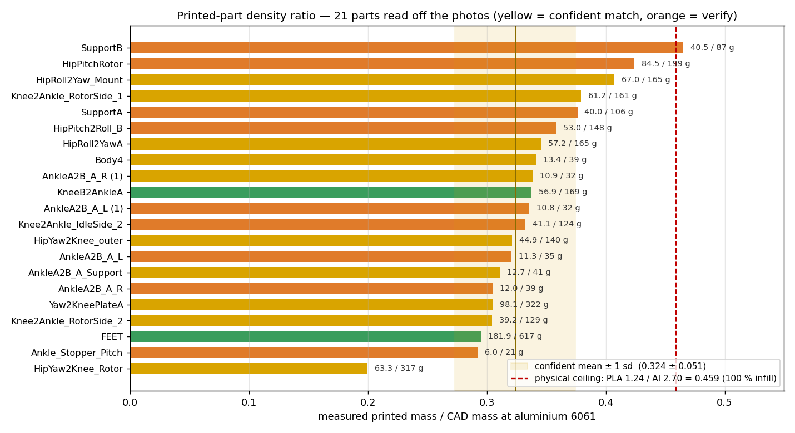
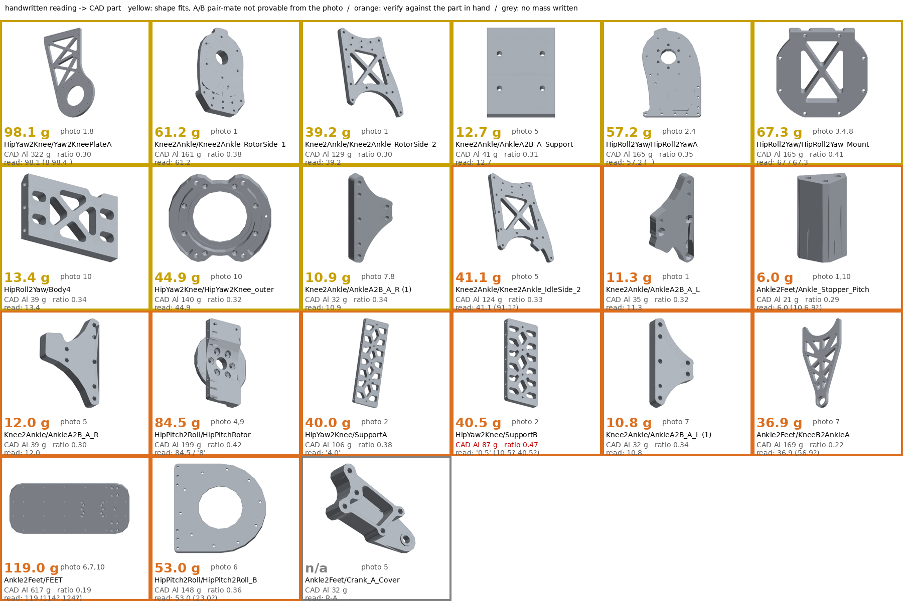
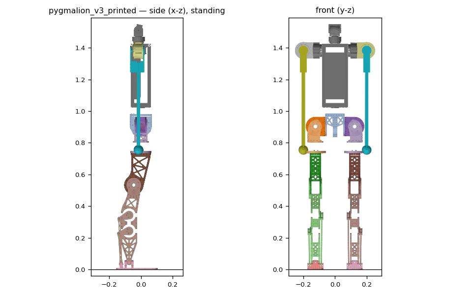

# 89. 3D 프린트 출력물 밀도비 — 실측 질량 / CAD(알루 6061) 질량 (2026-08-23)

> 상위: [[87_robot_model_v2]] · [[88_cad_placeholder_mass_rom]] · 시트: `docs/aluminium_parts_3dprint_masses.xlsx`
> 데이터: `tools/robot_model/alu_parts_measured.json` (판독·배정·신뢰도) · 통계: `alu_parts_ratio.py` → `alu_parts_ratio_stats.json`
> 목적: 알루미늄으로 설계된 링크 부품 중 **실제로는 3D 프린터로 출력된 것**의 밀도비를 구해, CAD 밀도를 갱신하고
> 그 질량으로 URDF/MJCF를 다시 만든다.

## §0 CAD 리비전 — 기준은 `260814 … v5` (8/16 04:07 KST 저장본)

**정정.** 아래 §0(구)의 "질량 동일" 결론은 틀렸다. 그때 비교한 "0814 v21"은 같은 파일의 **8/18 저장본**이었고, 8/16
이후 2일간 15개 버전이 더 쌓인 상태였다. 사용자가 **v5**를 열어 주어 그걸 기준으로 다시 뽑았다
(`/home/syaro/pyg_fea/fusion/alu_parts_v5/` — 인덱스·메시·렌더 전부 v5에서 새로 추출, 숨은 바디 1개
`AnkleUniversalJointCore` 포함). 0819 대비 실제로 다른 부품:

| 부품 | v5 (8/16) | 0819 | 차이 |
|---|---|---|---|
| HipYaw2Knee_outer | **189.4** | 139.9 | −26 % |
| HipPitchRotor | **232.4** | 199.2 | −14 % |
| HipRoll2YawA / B | **194.8 / 164.5** | 165.5 / 135.5 | −15 / −18 % |
| HipPitch2Roll_B | **168.7** | 148.0 | −12 % |
| Knee2Ankle_RotorSide_1 | **176.5** | 161.4 | −9 % |
| Crank_A / B | **94.0 / 92.4** | 73.9 / 72.2 | −21 % |
| AnkleA2B_A_L / R | **32.0 / 31.8** | 35.2 / 39.4 | +10 / +24 % |
| Ankle_Stopper_Pitch/Roll, Crank_A/B_Cover | **없음** | 있음 | 8/16 이후 추가 |

즉 0819는 힙·무릎 부품을 가볍게 깎은 리비전이고, 출력물은 그 전 형상이다. 분모를 바꾸니 **63.3 g(outer)이
0.45 → 0.334로** 평균 띠 한가운데에 들어왔다 — 사용자 지적("다르다")이 맞았다.

## §0(구) CAD 리비전 확인 (2026-08-23 저녁) — ~~8/16 리비전과 질량 동일~~ (틀림, 위 참고)

사용자 지적: "지금 모델(0819)은 최신이라 출력물과 무게가 안 맞을 것". Fusion에 열린 **`260814_HumanMesh_OMAKASE
_RrecoverFromCrash v21`**(8/16 시점 리비전)에서 알루미늄 바디 질량을 직접 뽑아 0819 v7 인덱스와 대조했다
(`/home/syaro/pyg_fea/fusion/alu_bodies_0814v21.json`):

| | 0814 v21 | 0819 v7 |
|---|---|---|
| 살아있는 알루미늄 바디 | 52 | 81 |
| 공통 바디 | 46 | 46 |
| **공통 바디 중 질량이 0.5 g 이상 다른 것** | **0** | **0** |
| 한쪽에만 있는 것 | 6810ZZ ×2(재질 오류, 0819에서 수정됨), `PipRoll2Yaw`(=HipRoll2Yaw 오타) 4개 | 상체·목·어깨·압출바·플랜지·Baselink_toWaistYaw·NoSim 참조 35개 |

→ **다리 부품의 CAD 질량(분모)은 두 리비전에서 완전히 같다.** 0819 기준 대조를 그대로 쓴다. 0819는 0814 v21에
상체를 얹은 것이지 다리를 고친 것이 아니다.

## §1 결과 — 밀도비 통계

사용자가 출력물 위에 매직으로 적어 둔 저울값을 사진 10장에서 읽어 CAD 부품에 대조했다. 21개 부품. 사용자가
직접 확정해 준 값 3개(발판 181.9 · 정강이 트러스 56.9 · hipyaw2knee 63.3)를 반영했다.

**v5 기준 (최종):**

| 집합 | n | **평균** | 중앙값 | 최소 | 최대 | **표준편차** | → 출력물 밀도 = 2.70 × 평균 |
|---|---|---|---|---|---|---|---|
| **확실(초록+노랑)** | 11 | **0.329** | 0.334 | 0.294 | 0.407 | **0.033** | **0.887 g/cm³** |
| 전체(주황 포함) | 19 | 0.344 | 0.340 | 0.294 | 0.465 | 0.042 | 0.929 g/cm³ |

권장값 **0.33 (밀도 0.89 g/cm³)**. 63.3 g는 사용자 확인대로 **HipYaw2Knee_outer**(v5 189.4 g) → 0.334.
v5에 없는 부품 2개(Ankle_Stopper_Pitch 6.0 g, Crank_A_Cover)는 분모가 없어 통계에서 빠졌다. 44.9 g 판독은
어느 부품인지 미확정(미배정 목록).

### 물리 상한으로 본 의미

PLA 1.24 / Al 2.70 = **0.459** 가 100 % 충전의 상한이다. 평균 0.34는 그 **74 %** — 즉 출력물이 평균적으로
**실효 충전율 ~74 %** 로 뽑혔다는 뜻이다 (외벽+내부 충전 합산 기준). 확실 집합의 최소 0.30~최대 0.41은 부품별
충전율 65~89 %에 해당한다.

### 밖으로 벗어난 셋 — 전부 주황(판독 불확실)이고, 이유가 각각 다르다

| 부품 | 비율 | 판단 |
|---|---|---|
| SupportB | **0.465** | 상한 **초과** = 물리적으로 불가. 판독 'ㅣ0.5'가 가장 흐림 → 오독 확실 |
| FEET (발판) | ~~0.19~~ → **0.295** | 사진 판독 119는 오독. 사용자 확정 **181.9 g** → 평균 띠 안 |
| KneeB2AnkleA (정강이 긴 트러스) | ~~0.22~~ → **0.338** | 3/5 오독. 사용자 확정 **56.9 g** → 평균에 정확히 |
| HipYaw2Knee_Rotor (요 로터 원판) | **0.20** | 사용자 값 63.3 g. 바디 배정에 따라 0.20 또는 0.45 — 위 참고 |

사진 판독 오류 둘은 사용자 확정값으로 해소됐고, 둘 다 평균 띠 안으로 들어왔다. 남은 저비율 하나(요 로터 원판
0.20)는 두꺼운 부품의 저충전일 수도, 바디 오배정일 수도 있다. 확정 전까지 URDF에는 **실측값 그대로** 넣는 것이
맞다 (§3 (a)).

## §2 대조 시트

노랑 = 형상·숫자 모두 맞지만 A/B 짝 중 어느 쪽인지는 사진만으로 증명 불가. 주황 = 숫자 판독 또는 부품 배정에
불확실 — 실물 대조 필요. 시트 E열 색과 동일하며, G열에 사진 번호·원문 판독·대안 부품을 적어 뒀다.

값을 고치려면 `alu_parts_measured.json`의 `g`/`body`를 바꾸고 `alu_parts_xlsx.py`, `alu_parts_ratio.py`를 다시 돌린다.

## §3 다음 단계 — CAD 밀도 갱신 → URDF

1. ~~CAD 리비전 확인~~ **완료(§0)** — 8/16 리비전(0814 v21)과 0819의 다리 부품 질량이 동일. 재추출 불필요.
2. **출력 부품 목록 확정.** 사진상 다리는 전부 흰 출력물이다. 골반(CenterParts)·몸통·팔은 확인 안 됨.
   **예외(사용자 확인 2026-08-23): 발목 AB 푸시로드 `Arm_A`·`Arm_B`(긴 바)는 알루미늄 가공품** — 밀도 갱신 대상에서
   제외, 비율 통계에도 넣지 않는다. 시트에서 회색, CAD 질량 그대로(54.8 / 38.8 g). `alu_parts_measured.json`의
   `aluminium` 목록이 기준.
3. ~~밀도 적용 두 가지 중 선택~~ → **(a)로 완료, §5**:
   - (a) 실측값이 있는 20개는 **실측 질량 그대로**(밀도 = 실측/체적), 나머지 출력 부품은 **0.92 g/cm³**.
   - (b) 전부 0.92 g/cm³ 일괄. 단순하지만 발판 같은 두꺼운 부품은 1.8배 과대.
   → (a) 권장. `set_placeholder_density.py`와 같은 방식(부품별 재질 복사 + 밀도 편집)으로 Fusion에 쓴다.
4. `dump_bodies.py` → `massprops_fusion.py` → `build_robot.py` → `validate_robot.py` 순으로 재생성.

## §5 CAD 밀도 갱신 → URDF (2026-08-23, 완료)

**Fusion:** 0819 최신본(v7)을 **`260819_HumanMesh_wUpper_URDFexport_printedDensity`** 로 따로 저장하고(설명에
"URDF export copy … do not design in this file"), 그 복사본에만 밀도를 썼다 (`tools/fusion/set_printed_density.py`,
v2 저장). 원본 설계 파일은 건드리지 않았다.

적용 규칙 (하체 `Joints_UnderBody`의 Aluminum 6061 바디 **50개**):
- 측정·대조가 확실한 부품(초록·노랑 9개) → **그 부품의 v5 비율 × 2.70** (형상이 v5↔0819에서 바뀐 부품은 g이 아니라
  비율이 이전되도록)
- 나머지, 그리고 판독이 불확실(주황)했던 부품 → **0.329 × 2.70 = 0.888 g/cm³** (SupportB의 0.465를 그대로 쓰면 밀도
  1.26 > PLA 1.24가 CAD에 박힌다)
- 제외: `Arm_A`·`Arm_B`(알루 푸시로드), `CenterPin`, 베어링·모터(이미 카탈로그 보정), 상체 전부(실측 없음 → 알루 유지)
- 전구 꺼짐은 표시 상태일 뿐이라 무시 — 이 문서는 발목 그룹 외 전부 꺼져 있었다

**결과 (링크별, 한쪽 기준):**

| 링크 | 알루 6061 (kg) | **출력물 (kg)** | 변화 |
|---|---|---|---|
| pelvis | 5.367 | **4.841** | -10 % |
| hip_pitch_link | 2.174 | **1.783** | -18 % |
| hip_roll_link | 1.618 | **1.287** | -20 % |
| thigh | 2.929 | **2.070** | -29 % |
| shin | 3.627 | **2.646** | -27 % |
| ankle_pitch_link | 0.085 | **0.040** | -53 % |
| foot | 1.030 | **0.424** | -59 % |
| torso | 5.966 | **5.966** | +0 % |
| shoulder_pitch_link | 1.178 | **1.178** | +0 % |
| arm | 2.841 | **2.843** | +0 % |

**전체 42.30 → 35.35 kg** (−6.95 kg). 다리 한쪽 11.46 → 8.25 kg.

**출력 파일 (새 이름, v2 알루 모델은 그대로 둠):**
- `pygmalion_locomotion/assets/pygmalion_v2/pygmalion_v3_printed.urdf` (+ 같은 이름 `.xml`)
- `mujoco-sim/mjlab/src/mjlab/asset_zoo/robots/pygmalion/xmls/pygmalion_v3_printed.xml` — `PYG_V2=1 PYG_V2_XML=pygmalion_v3_printed.xml`
- 질량 원천: `/home/syaro/pyg_fea/fusion/bodies_printed.json` → `robot_massprops_printed.json`

**전방 축:** CAD에서 전방은 **−Y**(발판이 발목축에서 −Y로 180 mm, +Y로 80 mm). 빌더가 `sim = (−y, x, z)`, 즉 z축
+90° 회전을 적용해 URDF/MJCF에서는 **전방 = +X**다. 검증: `foot.stl` 링크프레임에서 발끝 +180 / 뒤꿈치 −80 mm,
무릎 −60°에서 발이 −x(뒤)로 0.41 m, 발목 RS03이 정강이 −x(뒤)에 위치.

검증(`validate_robot.py --tag=pygmalion_v3_printed`): 35.348 kg, L/R 규약 pygmalion.xml과 일치, 가동범위 v2와 동일,
9관절 중 7개 전 범위 자기충돌 0.

### 커넥터 함정 하나 더 (기록)
`fusion_mcp_execute`는 **스크립트 소스가 4 KiB를 넘으면 실행하지 않고도 `success: true`** 를 돌려준다
(3777 B 실행, 4289 B 무시). 50개 밀도 계획을 한 스크립트에 넣었다가 "성공 0건"을 세 번 겪고 찾았다.
`mcp_client`가 3.8 KB 초과를 거부하고, 적용은 묶음으로 나눈다.

## §4 기록 — 판독 과정의 함정

- 손글씨 **3/5, 1/7, 4/9** 혼동이 주된 오차원이다. 0.459 상한과 0.30~0.41 띠를 기준으로 걸러냈다.
- 같은 부품이 여러 사진에 찍히면 값이 교차검증된다 (57.2 두 번, 61.2 세 번, 39.2 세 번, 10.9 두 번). 한 장에만 나온
  값이 주황의 대부분이다.
- 사진만으로 **A/B 짝은 구분할 수 없다.** 두 판이 CAD에서 같은 질량이면 비율에는 영향 없고, 다르면(Yaw2KneePlate
  A 322 / B 297) 비율이 8 % 흔들린다.
