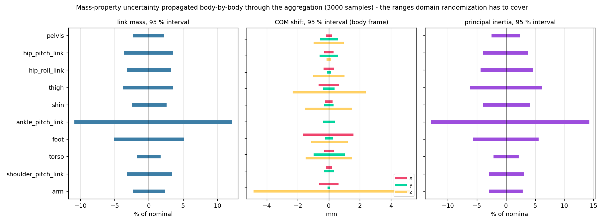
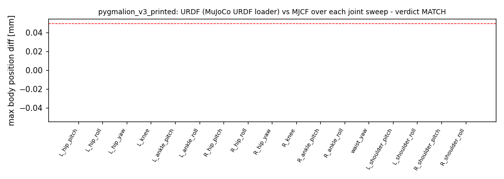

# 90. CAD → URDF/MJCF 파이프라인, 변환에서 결정한 것들, 질량 불확실성 기반 DR (2026-08-23)

> 상위: [[87_robot_model_v2]] · [[88_cad_placeholder_mass_rom]] · [[89_printed_parts_density_ratio]]
> 코드: `tools/robot_model/make_printed_robot.sh` (전 구간 한 번에) · `build_robot.py` · `massprops_fusion.py` ·
> `mass_dr.py` · `validate_robot.py` · `tools/fusion/set_printed_density.py`
> 실측치는 바뀐다. 그래서 이 문서는 숫자보다 **숫자가 흘러가는 길**을 적는다.

---

## §1 파이프라인 — 측정값이 바뀌면 다시 도는 길

```
사진·저울값 ──▶ alu_parts_measured.json ──▶ alu_parts_ratio.py ──▶ alu_parts_ratio_stats.json
                      │                                                    │
                      └──────────────▶ set_printed_density.py --apply ◀────┘   (Fusion: URDF 출력용 복사본에만 씀)
                                                   │
     make_printed_robot.sh [tag] ──────────────────┘
       1 dump_bodies.py        활성 Fusion 문서 → bodies_<tag>.json      바디별 m·COM·I(원점 기준)·bbox·재질·전구상태
       2 massprops_fusion.py   → robot_massprops_<tag>.json             강체 집계, 모터 카탈로그 질량 assert, 대체분기 제외
       3 motor_proxies_fusion.py → motor_proxies_<tag>.json             모터 원통 중심·축·크기 — **같은 덤프**에서
       4 build_robot.py        → <tag>.urdf / <tag>.xml                 프레임 변환·관절·충돌체·센서 (§2)
       5 validate_robot.py     질량 대조·치수·L/R 규약·관절 스윕·관성 readback·그림
       6 mass_dr.py            → mass_dr.json + docs/img/mass_dr_ranges.png  (§3)  ──▶ mjlab PYG_INERTIAL_DR=1
```

- **사람이 고치는 입력**: `alu_parts_measured.json`과 Fusion 활성 문서. 그 외에 빌더가 읽는 **형상 입력**이 셋 더
  있고, 이것들은 형상이 바뀔 때만 따로 만든다(스크립트가 재생성하지 않는다): `rom_measured.json`(`rom_check.py`,
  관절당 수십 분), 링크 메시(`meshes_step.py` / `upper_meshes_fusion.py`), 그리고 `build_robot.py`의 `DESIGN_CAP`
  표(§2a-5). ROM 파일이 없으면 빌드는 **assert로 멈춘다** — 예전엔 구 MJCF 범위로 조용히 되돌아갔다.
- 1단계는 **활성 문서 이름이 URDF 출력용 복사본**(`260819_HumanMesh_wUpper_URDFexport*`)이 아니면 **아무것도 쓰지
  않고** 멈춘다(`dump_bodies.py --expect=`). 예전 버전은 덤프를 먼저 쓰고 나서 이름을 봤다 — 엉뚱한 문서가 태그
  덤프를 덮어쓸 수 있었다.
- 3단계를 같은 덤프에서 만드는 이유: 모터 원통은 원래 8/22 원본 덤프(`bodies.json`)에서 만든 별도 파일을 읽었고,
  그 사이 사용자가 힙 피치 RS04를 축 위로 **75.6 mm** 옮겼다(옛 (−27.3, 122.9, 6.2) → v7 (−29.6, 69.3, 59.6)).
  질량은 새 위치, 그림은 옛 위치였다. 이제 원통 중심 = 고정자 COM (골반 프레임 (0.0007, ∓0.0296, −0.0004)).
- 출력은 **태그로 분리**된다(`pygmalion_v3_printed`). 알루미늄 기준 `pygmalion_v2`는 그대로 남아 A/B가 된다 — 단,
  v2는 힙 피치 모터가 옮겨지기 전 리비전(골반 COM CAD y 97.7→69.4, z 62.7→90.8)이라 골반 비교는 리비전 차이가 섞인다.
- 재실행 비용: Fusion 덤프 ~1분, 검증 ~10분(관절 스윕 그림). 밀도 적용은 4 KiB 커넥터 한계 때문에 묶음으로
  나간다(§4). **재적용 가능**: 이미 PLA 재질인 바디도 다시 계획해, 값이 바뀐 바디만 새 재질(`PLA <body> <밀도>`)로
  갈아 끼우고 같은 값은 건너뛴다 — 초판은 `Aluminum 6061`만 골라 변환본에서는 0건(no-op)이었다.

---

## §2 URDF → MJCF 변환에서 고려한 것, 수정한 것

URDF와 MJCF는 **한 빌더(`build_robot.py`)가 같은 수치에서 동시에 쓴다.** URDF를 먼저 만들고 변환기로 MJCF를 얻는
구조가 아니다 — 변환기(mujoco의 URDF 로더)는 관성 프레임·충돌체·접촉 제외·센서를 제대로 옮기지 못해서, 처음부터
둘 다 직접 쓰는 쪽을 택했다. 아래는 그 과정에서 결정하거나 고친 항목이다. 번호는 코드 위치와 대응한다.

### 2a. 프레임과 기구학

| # | 항목 | 결정 | 근거·검증 |
|---|---|---|---|
| 1 | **CAD→sim 회전** | z축 +90°: `sim = (−y_cad, x_cad, z_cad)` | CAD 전방은 −Y(발판이 발목축에서 −Y로 180, +Y로 80 mm). 출력에서 발끝 +x 180 mm, 무릎 굴곡 시 발이 −x, 발목 모터가 정강이 −x — 세 가지로 확인 |
| 2 | **링크 원점 = 관절점** | base: 골반 중심 CAD (0,70,60) · 힙 3축 동심점 (−123.7,70,60) · 무릎 (−123.7,115,−310) · 발목 (−123.7,145,−800) | 힙 3축 동심은 모터 원통 축으로 측정. 빌드가 hip→ankle 860 mm를 assert |
| 3 | **관절 축·부호** | 구 모델 `pygmalion.xml` 규약 유지: hip_pitch +y, hip_roll +x, hip_yaw −z, knee −y, ankle_pitch −y, ankle_roll −x. 우측 다리는 roll 2축만 반전(양쪽 +q = 내전/내번) | 정책·리워드·키프레임의 의미 보존. 검증은 발의 **회전벡터 지문**을 구 모델과 관절별로 대조 (발 위치 비교는 구 모델의 캔트 축 때문에 기하와 규약이 섞여 못 씀) |
| 4 | **우측 다리 = 좌측의 y-미러** | CAD에 다리가 한쪽뿐 | COM y 반전, 관성 `M I M`(M=diag(1,−1,1)), 메시는 정점 y 반전 + 면 와인딩 뒤집기 |
| 5 | **가동범위** | CAD 충돌 스윕 실측(`rom_check.py`) + 명시된 설계 캡(`DESIGN_CAP`, 손으로 적고 이유를 단다). 캡이 실측보다 넓으면, 또는 스윕 파일이 없으면 빌드 assert 실패. 빌드 로그가 관절별 출처(실측/캡/메커니즘)를 찍는다 | [[88]] §3. 폐루프 발목 2축은 메커니즘 값 |
| 6 | **발목 2-RSU 폐루프** | 본체 모델은 **직렬 pitch→roll** 근사. RS03 2개·크랭크·클레비스는 정강이, 푸시로드는 반씩, 십자(40 g)는 별도 바디 | 폐루프 자체는 `pygmalion_v21_loop.xml`(closure 0.000 mm, 레버비 1.25)로 따로 검증. 직렬 근사의 질량 오차는 §3 DR의 구조적 여유에 포함 |
| 7 | **상체** | 5 DoF(waist_yaw + 좌우 shoulder pitch/roll) 관절화, 12 → 17. **mjlab에서는 기본 용접**(MjSpec에서 관절 삭제, 질량·형상은 유지), `PYG_UPPER_DOF=1`로 해방 + 액추에이터 2조 | 액션 공간 12→17 변화로 기존 정책이 깨지는 것을 막음 |

### 2b. 질량·관성

| # | 항목 | 결정 | 근거 |
|---|---|---|---|
| 8 | **관성 기준점** | Fusion `getXYZMomentsOfInertia`는 **루트 원점 기준** → 바디 텐서를 그대로 합산 → 링크 COM으로 평행축 이동 → `R I Rᵀ`로 sim 프레임 | 원점 기준임을 CenterParts로 검증(Ixx 192.25 > m(y²+z²)=144.48). COM 기준이었다면 합산 불가 |
| 9 | **MJCF 표기** | `<inertial pos=COM mass fullinertia=(Ixx Iyy Izz Ixy Ixz Iyz)>` — COM 기준 전체 텐서 | MuJoCo가 주축 분해. 양정치 assert |
| 10 | **URDF 표기** | `<inertial><origin xyz=COM/><inertia ixx…/>` — 같은 COM 기준 텐서 | URDF 규약(관성은 inertial origin 기준)과 일치 |
| 11 | **모터 질량의 소속** | 고정자가 붙는 링크: 힙 피치 RS04 → 골반(좌우 미러), 힙 롤 RS04 → hip_pitch_link, 요 RS03 → hip_roll_link, **무릎 RS04 → 허벅지**(클레비스 판), 발목 RS03 ×2 → 정강이 | red team 2026-08-20: 사용자 표는 무릎 모터를 Knee2Ankle에 묶었으나 고정자는 허벅지 판에 체결됨 |
| 12 | **자리표시자 밀도** | 모터·베어링: 카탈로그 질량이 되도록 밀도 편집(형상은 실측 외피와 일치, 속이 빈 셸) · 출력 부품: v5 비율 × 2.70 또는 0.888 g/cm³ | [[88]] §1, [[89]] §5. 셸에 균일 밀도를 주면 모터 자축 관성이 최대 2배 과대 — 보수적 방향 |
| 13 | **무엇을 세고 무엇을 빼는가** | 대체 설계 분기(`NotUse`/`fullDoF`/`REF`)는 분기째 제외. `NoSim` 그룹, 루트에 떠 있는 낱개 나사 21개(37 g), 이름 규칙에 안 걸리는 상체 경로는 `classify()`가 버린다(알려진 누락). **전구 꺼짐은 표시 상태**라 무시하고 센다 | [[88]] §4b — 이 구분을 잘못해 골반 나사 69개(201 g)가 빠졌던 사고 |

### 2c. 형상·접촉·센서

| # | 항목 | 결정 | 근거 |
|---|---|---|---|
| 14 | **시각 메시** | 링크당 STL 하나(링크 프레임, m). 다리는 STEP에서 gmsh로, 상체는 Fusion MCP로(STEP에 없음). **모터는 메시 대신 해석적 원통** — 중심 = 그 바디의 COM, 축 = bbox가 가장 얇은 방향, 반경·길이는 모델군별 | 모터 STEP은 gmsh가 수 분간 멈춤. 원통은 질량과 **같은 덤프**에서 나온다(§1 3단계) |
| 15 | **MJCF 충돌체 = 프리미티브** | 허벅지·정강이 캡슐(반경 = 메시 반폭에서 측정), 힙 구·캡슐, 발 = 발바닥 캡슐 5개(`SOLE_Z` −0.043, x −0.08…+0.18), 팔·어깨·몸통 박스(메시 bbox) | 물려받은 허벅지 캡슐이 58 mm(실제 35)라 팔 안에 박혀 있었음 → 메시에서 재측정. 볼록 껍질 STL은 group 4(뷰어용, 비충돌) |
| 16 | **URDF 충돌체 = 볼록 껍질 STL** | `<collision>`에 `*_hull.stl` | URDF에는 캡슐 다발을 넣을 표준 방법이 약해 껍질로. **MJCF와 URDF의 충돌 형상이 다름** — URDF를 다른 시뮬레이터에 넣을 때 주의 |
| 17 | **접촉 제외** | 부모-자식 쌍, 힙 클러스터의 2칸 건너 쌍(모터 하우징이 서로 안에 들어감), 몸통-팔, **팔-힙**(더미 팔이 CAD 영자세에서 힙을 5.1 mm 파고듦 — CAD 수정 대상으로 기록) | 제외는 숨기기가 아니라 표시: [[88]] §3c |
| 18 | **사이트·센서** | `imu_in_base`, `left_foot`/`right_foot`(발바닥), gyro·velocimeter·accelerometer·framezaxis·subtreeangmom | 태스크 옵저베이션이 요구하는 이름 |
| 19 | **관절 한계 표기** | MJCF `range`(rad, `autolimits`), URDF `<limit lower upper effort velocity=20>` — effort: RS04 120(힙 피치·롤, 무릎, 허리 요), RS03 60(힙 요, 어깨 2축), 2-RSU 발목 90 피치(공동구동)/50 롤(차동). 이 모델에 RS00 구동 관절은 없다 | velocity 20 rad/s는 보수적 상한; 실제 무부하는 RS04 19.9 rad/s([[reference-robstride-motor-specs]]) |
| 20 | **컴파일러** | `angle=radian`, `meshdir` = `assets_v2` 심링크(mjlab) / `meshes`(URDF 옆), `autolimits` | 두 위치의 XML이 meshdir만 다름 |

### 2d. 모델에 **없는** 것 (DR이 대신 떠안아야 하는 것)
- 케이블 하네스·커넥터·결속. 배터리와 전자장비의 위치.
- 반대쪽 다리의 출력 편차(측정은 한쪽).
- 발목 폐루프의 실제 질량 분포(직렬 근사).
- 상체가 출력물인지 알루미늄인지 — **현재 알루미늄 5.97 kg로 가정.** 출력물이면 ~2 kg. 확인되면 §1의
  `set_printed_density.py`에서 범위를 `Joints_UpperBody`까지 넓히고 파이프라인을 다시 돌린다.

---

## §3 질량 불확실성 → DR 범위

### 3a. 방법 — "링크에 ±10 %" 대신 바디별로 전파
`mass_dr.py`는 로봇을 만드는 **그 집계 함수**(`massprops_fusion.collect/aggregate`)에 바디별 질량 배율을 넣어
로봇을 3000번 다시 만든다. 바디의 텐서는 질량에 비례하므로(형상 고정) 밀도 오차 = (m, I_o)의 배율.

| 바디 부류 | 1σ | 근거 |
|---|---|---|
| 출력물, 실측·대조 확실 | 3 % | 그 부품의 v5 비율이 CAD에 있음; 판독 오차 + A/B 짝 모호 |
| 출력물, 평균 밀도 사용 | **10 %** | 조사의 부품 간 sd 0.033 / 평균 0.329 |
| 출력물 **공통 모드** (한 번 뽑아 전부에 곱함) | 3 % | 평균의 표준오차 sd/√11 = 0.010; 반대 다리도 같은 프린터 — 배치 편향은 공유됨 |
| 모터 | 2 % | 카탈로그 ±20 g / 1420·880, ±3 g / 380·310 |
| 베어링·체결류·강재 | 2 % | 카탈로그/도면 그대로, 윤활·여분 와셔 |
| 알루미늄 가공품 | 2 % | 6061 가공 공차 |

링크별로 질량 배율, COM 이동(바디 프레임, m), 주관성 배율의 2.5/97.5 백분위를 낸다.

### 3b. 결과 — 측정 불확실성이 말해 주는 것



| 링크 | 질량 95 % | COM 95 % x / y / z [mm] | 관성 95 % |
|---|---|---|---|
| pelvis | 0.979 … 1.019 | ±0.1 / ±0.5 / ±0.9 | 0.978 … 1.020 |
| hip_pitch_link | 0.966 … 1.033 | ±0.2 / ±0.5 / ±0.1 | 0.964 … 1.034 |
| hip_roll_link | 0.970 … 1.030 | ±0.3 / ±0.1 / ±0.9 | 0.959 … 1.044 |
| thigh | 0.964 … 1.032 | ±0.6 / ±0.3 / ±2.3 | 0.941 … 1.058 |
| shin | 0.978 … 1.023 | ±0.2 / ±0.2 / ±1.5 | 0.964 … 1.038 |
| ankle_pitch_link (40 g) | **0.894 … 1.119** | ±0.0 / ±0.3 / ±0.0 | 0.874 … 1.139 |
| foot | 0.952 … 1.048 | ±1.6 / ±0.2 / ±1.1 | 0.946 … 1.052 |
| torso / shoulder / arm | 0.985…1.015 / 0.971…1.031 / 0.979…1.021 | ≤ ±1.4 / ≤ ±0.3 / ≤ ±5.2 | ≤ ±2.8 % |

**해석.** 측정으로 설명되는 불확실성은 링크 질량 **±2–5 %**, COM **±0.1–2 mm**다. 모터(카탈로그값)가 힙·허벅지·
정강이 질량의 **66–88 %**를 차지하고 출력물은 **5–20 %**(발은 63 %, 발목 십자는 55 %)라서다 (출력물 자체는
알루미늄 CAD 질량의 1/3 — 다른 수치다). 유일한 예외는 발목 십자(40 g, 전부 평균밀도+베어링)로 ±11 %.
즉 **측정을 더 해서 줄일 수 있는 건 발(출력물 63 %) 정도이고, DR은 §2d의 "모델에 없는 것"을 위해 거는 것**이다.

### 3c. 권고 DR = 측정 구간 ∪ 구조적 하한
`mass_dr.py`의 `STRUCT`(판단이며, 고치라고 적어 둔 값):

| 항목 | 값 | 이유 |
|---|---|---|
| 모든 링크 질량 | 최소 **±5 %** | 반대 다리 출력 편차, 결속류, 직렬 발목 근사 |
| 모든 링크 COM | 최소 **±5 mm** 전 축 | 같은 이유 |
| 골반·몸통 질량 | **−5 … +15 %** | 하네스·전자장비·배터리는 더해지기만 함 |
| 골반·몸통 COM | **±20 mm** | 그 추가 질량이 어디 붙는지 모름 |
| 관성 형상 잔차 d | ≤ ±0.02, **그리고 링크별로 d가 일으키는 COM 이동이 COM 하한을 넘지 않도록** d ≤ ln(1 + floor/\|c\|) | d는 바디 원점 기준 스트레치라 COM도 \|c\|(e^d−1)만큼 움직인다(§3d). 허벅지(\|c_z\| 0.33 m)는 d=0.02만으로 6.7 mm — 하한 5 mm보다 크다 |

`mass_dr.json`은 t 범위와 함께 **실효 COM 범위**(t + \|c\|(e^d−1))를 따로 적는다. 읽는 사람이 보는 숫자가 mjlab이
실제로 거는 크기가 되도록.

| 링크 | 권고 질량 배율 | t ± [mm] | d | **실효 COM ± [mm] x/y/z** | `alpha_range` |
|---|---|---|---|---|---|
| pelvis, torso | 0.95 … 1.15 | 20 / 20 / 20 | 링크별 캡 | 20 부근 (COM이 원점에 가까움) | −0.0256 … +0.0699 |
| 다리·팔 링크 | 0.95 … 1.05 | 5 / 5 / 5 | 링크별 캡(허벅지 0.015, 팔 ≈0.02) | ≤ 10 (d 기여 ≤ 5) | −0.0256 … +0.0244 |
| ankle_pitch_link | 0.894 … 1.119 (측정이 더 넓음) | 5 / 5 / 5 | — | 5 | −0.0562 … +0.0562 |

정확한 링크별 값은 `mass_dr.py` 출력표(`effective COM` 열)와 `mass_dr.json`의 `com_effective_m`이 기준이다.

### 3d. mjlab에 거는 법 — `dr.pseudo_inertia`, 토글 `PYG_INERTIAL_DR=1`
`mjlab.envs.mdp.dr.pseudo_inertia`(Rucker & Wensing 2022의 의사관성 행렬 파라미터화)를 링크 종류당 1항씩,
좌우 같은 범위로 건다. 범위는 코드에 타이핑하지 않고 **`mass_dr.json`을 읽는다.** 기존 `base_com`
항(±25/25/30 mm 일괄)은 이중 적용을 막기 위해 제거된다. 기본은 꺼짐이라 진행 중인 실험은 영향 없다.

파라미터 의미(구현 `_build_perturbation_U` 확인):
- **α**: 질량·관성 × e^{2α}, COM 불변 → 질량 배율 k에 α = ln k / 2
- **t₁₋₃**: COM 이동 [m], 바디 프레임. **α와 무관하게 정확히 t** — J′ = U J Uᵀ에서 h′와 m′이 모두 e^{2α}배라
  COM = h/m에서 상쇄된다. d가 함께 걸리면 COM′ = e^{d}⊙c + t. (초판에 적었던 t·e^{−α}는 틀렸다 — 실제 함수로
  α=0.07, t=0.02를 넣으면 정확히 0.02 이동)
- **d₁₋₃**: 바디 **원점** 기준 축 스트레치. 관성뿐 아니라 **COM도 e^{d}배**로 움직인다 — 허벅지(COM −0.33 m)에
  d=0.02면 6.7 mm, 하한 5 mm보다 크다. 그래서 `mass_dr.py`가 링크별로 d ≤ ln(1 + floor/|c|)로 캡하고 실효 COM
  범위를 따로 적는다
- 적용 후 `body_inertia`의 주축 **순서가 바뀌고** `body_iquat`가 함께 바뀐다. 런타임에서 I_zz만 보면 4배로
  보이는데 trace 비율은 질량 비율과 일치 — 정상
- 같은 바디에 startup 항이 둘 걸리면 **합산되지 않고 나중 항이 기본값에서 다시 쓴다**(두 항 모두 기본 필드에서
  샘플). `base_com`을 제거한 이유는 이중 적용이 아니라 그 혼동을 없애기 위해서다.
- `mode="startup"`: env 생성 시 1회, 전량. **이건 기존 항들도 마찬가지였다** — `base_com`·`foot_friction`·
  `encoder_bias`가 전부 startup 모드라, `dr_levels` 커리큘럼이 이 항들의 파라미터를 램프해도 **이미 적용된 값은
  바뀌지 않는다**(램프는 interval 모드인 `push_robot`에만 실제로 작용). 검증: 8-env에서 첫 reset 후 dr_factor=0인데
  모델의 마찰·COM 값은 startup 때 전량 그대로. 즉 **지금까지의 "phase 2 DR 램프"는 push 외엔 램프가 아니었다** —
  별도 과제로 올림. 진짜 램프가 필요하면 항을 `mode="reset"`으로(`pseudo_inertia`는 기본 필드에서 다시 샘플하므로
  reset마다 재적용해도 안전, 단 reset마다 `set_const` 재계산) 바꾸고 `dr_levels`에서 alpha/t/d를 스케일해야 한다.
- **`PYG_NO_DR=1`(phase 1)이면 `PYG_INERTIAL_DR`은 무시된다** — phase 2 설정에서만 유효. 둘 다 켜면 경고를 찍는다.

검증(CPU, env 8개): 총질량 34.6–36.7 kg로 env마다 다르고, 허벅지 COM x가 −31.7…−38.7 mm로 흩어짐.

### 3e. 측정치가 바뀌면
1. `alu_parts_measured.json` 수정 → `alu_parts_ratio.py`
2. Fusion에서 URDF 출력용 복사본을 활성화 → `set_printed_density.py --apply` (이미 변환된 복사본에 다시 돌려도
   값이 바뀐 바디만 갈아 끼운다; 형상이 바뀐 새 리비전이면 원본에서 복사본을 새로 저장한 뒤)
3. `make_printed_robot.sh pygmalion_v3_printed` (형상이 바뀌었으면 그 전에 `rom_check.py`와 메시 재생성)
4. 학습: `PYG_V2=1 PYG_V2_XML=pygmalion_v3_printed.xml PYG_INERTIAL_DR=1 …` — **phase 2에서만**(`PYG_NO_DR`와 함께면 무시)

---

## §4 함정 기록 (이 파이프라인을 만들며 실제로 겪은 것)
- 이 문서 초판을 **코드 대조·DR 물리·mjlab 연결** 세 관점으로 레드팀(탐색 3 + 반박 58 에이전트)했더니 **19건**이
  확정됐다. 코드를 고친 것: 모터 원통이 옛 덤프를 보던 것(힙 피치 75.6 mm), 밀도 재적용 no-op, 덤프 후 이름 검사,
  ROM 파일 없을 때의 조용한 fallback, d 캡이 COM 하한을 넘던 것, `PYG_NO_DR` 무경고 무시. 문서만 고친 것: t·e^{−α}
  (없는 인자), "3 DoF", effort 표의 RS00, "1/3", 제외 규칙, base_com 제거 사유, 램프 주장.
- Fusion 커넥터는 **4 KiB 초과 스크립트를 실행하지 않고 `success: true`** 를 돌려준다 (3777 B 실행 / 4289 B 무시).
  `mcp_client`가 3.8 KB 초과를 거부하고 밀도 적용은 묶음으로 나간다.
- 예외로 끝나는 스크립트는 **문서 편집을 롤백**한다. 읽기는 예외 채널(`emit`), 쓰기는 정상 종료(`run_script`).
- 같은 파일의 "v21"은 8/18 저장본이었다 — 버전 번호가 아니라 **저장 시각**을 봐야 했다 ([[89]] §0).
- 전구 꺼짐 ≠ 억제. 골반 나사 69개를 잃었다 ([[88]] §4b).
- 순회 스크립트에서 자식 오커런스를 스택에 넣는 한 줄을 빼먹으면 루트만 돌고 "성공 0건"이 된다.

## §5 URDF ↔ MJCF 교차검증 (`tools/robot_model/urdf_crosscheck.py`, 2026-08-23)

URDF가 맞는지는 우리 emitter가 아니라 **독립 파서**로 읽어 확인한다: MuJoCo 자체의 URDF 로더로 `.urdf`를 읽고, `.xml`은 평소 경로로 읽어 베이스를 원점에 고정한 뒤 비교한다.

| 검사 | 기준 | `pygmalion_v3_printed` 결과 |
|---|---|---|
| 관절 집합 | 이름 일치 | 17/17 |
| 관절 축(월드)·앵커·범위 (영점) | < 0.01°, < 0.05 mm, < 1e-5 rad | **0.0000°, 0.0000 mm, 4.9e-6 rad**(텍스트 소수 자릿수) |
| 관절별 범위 스윕(16점, 나머지 0) → 전 링크 위치/자세 | < 0.05 mm, < 0.01° | **0.0000 mm, 2.4e-6°** |
| 전 관절 랜덤 자세 200개 | 동일 | 0.0000 mm, 0.0000° |
| 링크별 질량·COM·관성 | < 1e-4 kg, < 0.05 mm, < 1e-5 kg·m² | 17 링크 전부 통과 (dI ≤ 5e-7) |
| 루트 링크 | — | URDF 로더가 base_link(4.84 kg)를 월드에 병합 — 로더 관례, 결함 아님 |

판정 **MATCH**. 결과 JSON: `pygmalion_locomotion/assets/pygmalion_v2/pygmalion_v3_printed_urdf_crosscheck.json`.



*그림 — 관절별 스윕에서의 최대 링크 위치차(mm). 빨간 점선 = 0.05 mm 기준.*

영상 [urdf_crosscheck_pygmalion_v3_printed.mp4](video/urdf_crosscheck_pygmalion_v3_printed.mp4): MJCF 메시(채움) 위에 URDF 메시(빨간 와이어)를 겹쳐 관절 하나씩 범위를 스윕 — 두 모델이 한 로봇으로 보이면 일치. 루프 모델(`_loop`, URDF는 트리)은 같은 스크립트로 `--tag=pygmalion_v3_printed_loop`.

주의: URDF 로더는 `<visual>`을 기본 폐기하므로(`discardvisual`) 스크립트가 `<mujoco><compiler discardvisual="false"/></mujoco>` 확장을 주입해 읽는다. 캡슐 컬리전은 URDF에 없어서(URDF는 box/cylinder/sphere/mesh) URDF 쪽 컬리전은 hull 메시다 — 컬리전 형상은 MJCF만 권위가 있다.
