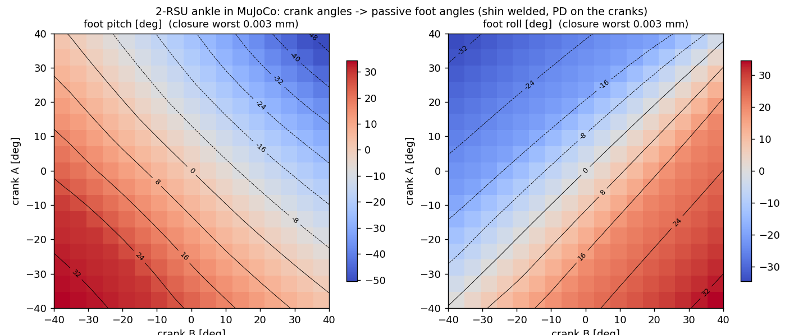

# 91. 2-RSU 폐루프 발목으로 학습하기 — 선례 조사, 구현, 검증, mjlab 연결 (2026-08-23)

질문: *"mujocolab에서 2-RSU 구조(폐루프 4절링크) 상태로 학습시킬 수 있겠나?"*

**답: 된다.** 선례(BRUCE·Digit·Cassie·ToddlerBot)가 MuJoCo 계열에서 equality 구속으로 폐루프를 그대로 두고 학습했고,
우리 모델도 plain MuJoCo와 **mjlab(mujoco_warp) 안에서** 폐루프가 닫힌 채 크랭크 → 발바닥 전달이 동작함을 확인했다.
`PYG_ANKLE_LOOP=1` 토글로 학습 배선까지 끝났고, GPU만 붙으면 처리량 확인 후 바로 학습에 들어갈 수 있다.
리서치 원자료: [research_raw/2026-08-23_closed_loop_ankle_rl_claims.md](research_raw/2026-08-23_closed_loop_ankle_rl_claims.md) (50 채택 / 20 기각).

---

## 0. 결론 요약

| 항목 | 결과 |
|---|---|
| 선례 | **BRUCE** (Humanoids 2025): 폐루프 3종을 MJX equality로 그대로 학습, 스텝비용 **+3.4 %**, zero-shot 전이. **Digit** (Berkeley 2024) CPU MuJoCo equality. **Cassie** Menagerie `connect`. 반대 진영(Booster T1·Tien Kung·Unitree·XBot-L)은 PhysX가 폐루프를 못 해서 직렬+Jᵀ 배포매핑 |
| 모델 | `pygmalion_v3_printed_loop.xml`: 다리당 크랭크 2(RS03 로터) + 푸시로드 2(유니버설 힌지 2개씩) + `connect` 4개, 발목 pitch/roll 힌지는 **수동**. 27 바디·30 관절(XML nv 35) → 학습 spec은 상체 5관절을 기본 weld(`PYG_UPPER_DOF` 미설정)하므로 **nv 30** |
| plain MuJoCo 검증 | 영점 폐루프 오차 0.000 mm, 크랭크 ±40° 격자 289점, 전달비(중심 ±10°) pitch −1.21 / roll −1.42 (°/크랭크°), 설계 ROM 6코너 전부 도달, 지면 접촉 정상 |
| mjlab 검증 | 매단 상태 크랭크 +11.5° 공동구동 → pitch −14.0°, 차동 → roll ∓16.4°, 오차 0.000 mm. 정적 접촉 하중에서 진동 없음(발목 속도 rms ≤ 0.013 rad/s, 4 env 편차 0) |
| 고친 것 | 기본 `connect`는 물렁함(10 N·m에 2.7 mm 벌어짐, 발목 처짐 23° vs 직렬 20°) → `solimp 0.999 0.9999 1e-4`로 0.04 mm / 19.9° |
| 학습 배선 | `PYG_ANKLE_LOOP=1`: 크랭크 4개에 RS03 위치서보(Kp 22.3 / Kd 1.41 / 60 N·m), 관측 45→53(수동 발목 4관절 추가, 로드 관절 제외), 액션 12 유지, pose 보상은 발목(수동)에, thermal rated에 크랭크 20 N·m, bent 키프레임 루프 정합해 |
| 남은 것 | GPU 처리량(BRUCE 기준 +3 %대 예상; nv 30 < 32 희소화 임계 미만 — 단 `PYG_UPPER_DOF=1`이면 nv 35로 임계를 넘으니 따로 측정), 첫 학습 런 |

---

## 1. 선례 — 누가 어떻게 했나

| 로봇 / 논문 | 시뮬 | 루프 처리 | 결과·교훈 |
|---|---|---|---|
| **BRUCE** ([arXiv 2507.00273](https://arxiv.org/abs/2507.00273), Humanoids 2025) | MJX (GPU MuJoCo) | 차동풀리(tendon eq)·5절·4절(connect) 전부 네이티브, 액션은 **모터 공간** | 8192 env에서 스텝 +3.4 %, zero-shot. 직렬-vs-루프 ablation은 없음 |
| **Digit** ([arXiv 2410.03654](https://arxiv.org/abs/2410.03654), Berkeley 2024) | CPU MuJoCo | 4절 무릎 루프를 equality로 | IsaacGym보다 느리지만 "감당 가능", zero-shot |
| Digit 초기 ([arXiv 2303.03381](https://arxiv.org/abs/2303.03381)) | Isaac Gym | 고강성 "가상 스프링"+서브스텝 보정 | PhysX 우회책, 이후 MuJoCo equality로 대체 |
| **Cassie** ([Menagerie](https://github.com/google-deepmind/mujoco_menagerie/blob/main/agility_cassie/cassie.xml), [OSU DRL](https://github.com/osudrl/cassie-mujoco-sim)) | MuJoCo | plantar/achilles 로드를 `connect`(solref 5 ms) | RL 바이페드의 정석 폐루프 모델. 모터는 직렬 출력관절에(하이브리드) |
| **ToddlerBot** ([arXiv 2502.00893](https://arxiv.org/abs/2502.00893)) | MJX/Brax | 평행링크 weld/connect, 기어 joint-eq | 1024 env, sim2real 갭 작음 |
| Tien Kung / LiPS ([arXiv 2503.08349](https://arxiv.org/abs/2503.08349)) | Isaac Gym | 직렬 발목 + 정책·PD는 모터공간, 매 스텝 Jᵀ | 수동(kp 0) 발목은 "심하게 기울어 손상" |
| Booster T1 ([arXiv 2506.15132](https://arxiv.org/abs/2506.15132)) | Isaac Gym | 직렬, 변환은 배포 SDK | 이유를 명시: "PhysX가 폐루프 미지원" |
| Unitree G1/H1 ([unitree_sdk2](https://github.com/unitreerobotics/unitree_sdk2)) | Isaac | 공개 모델은 직렬, 펌웨어에 PR/AB 모드 | 변환은 벤더가 흡수(비공개) |
| XBot-L ([arXiv 2408.14472](https://arxiv.org/abs/2408.14472)) | Isaac Gym | 가상 직렬 모터 2개, 배포시 재매핑 | 능동 발목 필수(수동은 험지 실패) |
| Bipetto/LAAS ([arXiv 2503.22459](https://arxiv.org/abs/2503.22459)) | Isaac Lab | 직렬 + **해석적 비선형 임피던스 전달** | 임피던스 전달 없이 토크만 매핑 → 넘어짐 |
| Fourier GR-1 → GR-2 | — | 하드웨어를 평행 → 직렬로 바꿈 | 제어·정비·sim2real 비용 때문 |

읽는 법: **MuJoCo 계열이면 루프를 그대로 두는 쪽이 정석**이고, 직렬 근사는 PhysX 제약에서 나온 우회다.
직렬 근사의 누락분(구성 의존 관성 재분배, 최대 76 % 관성오차 — [arXiv 2608.01697](https://arxiv.org/abs/2608.01697))을 배포 매핑으로 메우는 것이 그 진영의 주된 노력이다.
우리는 mjlab(mujoco_warp)이므로 루프를 그대로 둘 수 있고, 발목 메커니즘 하중(로드·크랭크·볼조인트)까지 학습 중에 직접 측정된다 — 이 프로젝트의 목적(하드웨어 설계 하중 측정)에 정확히 맞는다.

## 2. 시뮬레이터 사실과 우리 모델에의 적용

| 사실 | 출처 | 우리 모델 |
|---|---|---|
| MuJoCo는 트리만 허용, 루프는 equality로(소프트) | [computation](https://mujoco.readthedocs.io/en/stable/computation/index.html) | `connect` 4개 (site↔site) |
| mujoco_warp 3.10.0.1: CONNECT/WELD/JOINT/TENDON/FLEX 지원 (DISTANCE 제외) | `io.py:716-719`, [README](https://github.com/google-deepmind/mujoco_warp) | site-site connect = 가장 견고한 형태(바디앵커 버그 #1270은 2026-07 수정) |
| MuJoCo 3.7.0: connect/weld에 J̇·v 바이어스 추가 → 4절 드리프트 −75 % | [changelog](https://mujoco.readthedocs.io/en/stable/changelog.html) | 설치본 3.10 포함 |
| fp32 + refsafe: solref timeconst ≥ 2·dt = **10 ms**로 클램프 | [mjwarp docs](https://mujoco.readthedocs.io/en/latest/mjwarp/index.html) | §4.3 — solimp로 강성 확보 |
| nv > 32면 관성행렬 희소 경로 | mjwarp FAQ | 학습 spec **nv = 30** (XML 35 − 상체 weld 5; 로드는 힌지 2개, 볼조인트 없음). `PYG_UPPER_DOF=1`은 35 → 희소 경로 |
| mjlab Entity는 볼조인트(qpos 4) 인덱싱 깨짐 ([mjlab #918](https://github.com/mujocolab/mjlab/issues/918)) | entity.py | 해당 없음 — 구형 `v21_loop`의 볼조인트를 **유니버설 힌지 2개**로 바꾼 이유 |
| njmax는 world당 엄격한 상한 | mjwarp docs | connect 4×3 = 12행, 현재 njmax 1500 |
| fp32 소프트 equality + 접촉 진동 ([mujoco_warp #1510](https://github.com/google-deepmind/mujoco_warp/issues/1510)) | open issue | §4.4에서 직접 측정 — 이 기하에선 없음 |

## 3. 모델



*그림 1 — 크랭크 A/B 각도 → 수동 발목 pitch(좌)·roll(우). 정강이 고정, 크랭크 PD. 공동구동 대각 = pitch, 차동 대각 = roll. (첫 렌더는 기본 solimp 기준 최악 0.605 mm였고, 현재 XML의 강성 구속(§4.3)으로 재생성됨 — 수치는 `loop_ankle_verify.json`.)*

- 빌드: `build_robot.py --ankle=loop --massprops=robot_massprops_v3_printed_loop.json --tag=pygmalion_v3_printed`
  → `pygmalion_v3_printed_loop.xml/.urdf`. massprops는 `PYG_ANKLE_LOOP=1 massprops_fusion.py`(크랭크=프린트 크랭크+커버, 로드=알루미늄 바+인서트 2), 메시는 `meshes_step.py --loop`(shin_noloop/foot_noloop/crank/rod 분리).
- 다리당: `crank_A/B`(힌지, 축 = RS03 축, ±1.2 rad, armature 0.005) → `rod_A/B`(유니버설: u1 = 크랭크축, u2 = u1×로드방향) → `rod_end` 사이트 ↔ 발의 `ball` 사이트 `connect`. 발목 `ankle_pitch → ankle_roll` 힌지는 트리에 남되 액추에이터 없음.
- 자유도: 수동 발목 2 + 크랭크 2 + 로드 4 − connect 2×3 = **2** (크랭크). 질량(다리당): shin 2.485, foot 0.371, crank 0.035/0.034, rod 0.081/0.065 kg — 직렬 모델과 합계 동일.
- URDF는 트리: 크랭크(revolute) → 1 g 더미 링크 → 로드(revolute×2 = 유니버설). URDF엔 루프 닫힘도 유니버설 조인트도 없어서 로드 끝은 열어 두고 주석으로 닫힘을 명시. 교차검증 MATCH — [docs/90 §5](90_urdf_mjcf_pipeline_and_dr.md).

영상: [loop_ankle_pitch.mp4](video/loop_ankle_pitch.mp4) (정강이 고정, 공동구동 ±30° → 발바닥 pitch −37.6/+31.5°), [loop_ankle_roll.mp4](video/loop_ankle_roll.mp4) (차동 → roll), [loop_ankle_ground.mp4](video/loop_ankle_ground.mp4) (베이스 고정·고관절/무릎 PD 유지, 발바닥을 바닥 2 mm 위에 두고 크랭크 구동 → 앞꿈치/뒤꿈치 모서리가 바닥에 닿음; 초록 삼각 = 접촉점, 크기 ∝ 법선력). 로드 = 분홍, 로드엔드 = 빨간 점.

## 4. 검증

### 4.1 plain MuJoCo (`tools/robot_model/loop_ankle_verify.py`, dt 1 ms, fp64)

| 시험 | 결과 |
|---|---|
| 영점 폐루프 | 0.000 mm |
| 크랭크 격자 ±40° (289점) | 전달비(중심 ±10°) pitch **−1.21** °/°(공동), roll **−1.42** °/°(차동) — 강성 구속(§4.3) 적용 후 재측정. (구 soft 구속 런: −1.167/−1.348, 최악 오차 0.605 mm — 구속 컴플라이언스만큼 전달비가 작게 나왔던 것) |
| 설계 ROM 코너 도달 | pitch −50 (크랭크 +36.9/+40.3), +30 (−25/−25), roll ±20 (±13.8/∓14.3), (−50,+20) (+29.5/+49.9), (+30,−20) (−10.3/−42.1) — 6/6 도달, 오차 < 0.03 mm |
| 지면 | 접촉 0–3점, 법선력 0–99 N, 오차 < 0.27 mm |

→ 크랭크 필요각 최대 ±50° = 0.87 rad < 범위 1.2 rad (소프트 0.9 → ±62°).

### 4.2 mjlab / mujoco_warp (CPU, dt 5 ms, fp32) — 매단 상태(루트 매 스텝 고정)

| 액션(0.8 = 11.5° 크랭크 목표) | 크랭크 A/B | 발목 pitch / roll | 오차 |
|---|---|---|---|
| 공동 + | +11.5 / +11.5 | **−14.0** / −0.3 | 0.000 mm |
| 공동 − | −11.5 / −11.5 | **+13.8** / +0.1 | 0.000 |
| 차동 A+B− | +11.5 / −11.5 | −0.1 / **−16.4** | 0.000 |
| 차동 A−B+ | −11.5 / +11.5 | +0.2 / **+16.2** | 0.000 |
| A만 + | +11.5 / 0 | −7.0 / −8.5 | 0.000 |
| B만 + | 0 / +11.5 | −6.8 / +8.2 | 0.000 |

직렬 모델 동일 테스트: pitch ±11.5 / roll ±11.5 (1:1). 전달비 −1.22 / −1.43은 §4.1의 −1.21 / −1.42와 일치.
**부호 규약(배포 매핑용)**: 크랭크 + (공동) → ankle_pitch −, A+B− → ankle_roll −.

### 4.3 구속 강성 A/B — 외력 토크(발, 매단 상태)

| 설정 | 10 N·m 처짐 / 오차 | 20 N·m | 40 N·m |
|---|---|---|---|
| 직렬 모델(기준, Kp 28.5) | 20.1° / — | 40.2° | 51.8°(한계) |
| connect 기본 `solimp 0.9 0.95` | 23.3° / 2.74 mm | 52.4° / 6.17 | 65.9° / 7.76 |
| `0.99 0.999 1e-3` | 20.3° / 0.39 | 50.4° / 0.59 | 62.6° / 0.63 |
| **`0.999 0.9999 1e-4`** (채택) | **19.9° / 0.04** | 50.2° / 0.06 | 62.4° / 0.06 |

기본 구속은 ~3×10⁴ N/m 수준(실제 로드엔드+알루미늄 바 ~10⁷)이라 서보 위에 가짜 직렬 스프링이 얹힌다.
refsafe가 solref를 10 ms로 클램프하므로 solref로는 못 고치고 solimp로 고친다. 채택값은 `build_robot.py`가 XML에 직접 쓴다(`PYG_LOOP_SOLIMP`/`PYG_LOOP_SOLREF` env는 A/B용 오버라이드).
20 N·m 이상에서 루프가 직렬보다 10° 더 처지는 것은 구속이 아니라 **크랭크 서보의 역구동**(크랭크 35–47°, 발목 roll까지 섞임)이며, 이는 실제 메커니즘의 물리다.

### 4.4 접촉 하중 정적 시험 (mujoco_warp #1510 점검)

루트를 서 있는 높이 −10/−20 mm에 고정해 다리 PD가 발을 지면에 누르는 상태, 4 env.

| 단계 | 기본 solimp 오차 평균/최대 | 채택값 | 발목 속도 rms | env 편차 |
|---|---|---|---|---|
| 정지 3 s | 0.42 / 1.75 mm | **0.022 / 0.93** | 0.001 rad/s | 0 |
| −20 mm 2 s | 0.65 / 0.70 | 0.012 / 0.06 | 0.013 | 0 |
| 크랭크 공동 ∓0.1 rad | 0.63–1.04 | 0.023–0.038 | ≤ 0.006 | 0 |
| 크랭크 차동 | 0.87 / 1.07 | 0.018 / 0.03 | 0.004 | 0 |
| 공중 2 s | 0.003 / 0.08 | 0.003 / 0.12 | 0.000 | 0 |

진동 없음, env 간 발산 없음. (최대값 ~0.9 mm은 단계 전환 시 루트 점프의 1스텝 과도.)

## 5. mjlab 학습 배선 (`PYG_ANKLE_LOOP=1`)

| 요소 | 직렬(기존) | 루프 |
|---|---|---|
| XML | `pygmalion_v3_printed.xml` | `pygmalion_v3_printed_loop.xml` |
| 발목 액추에이터 | `.*_ankle_pitch/roll_joint` Kp 28.5 / Kd 1.81, 90/50 N·m, 반영 armature | `.*_crank_[AB]_joint` **Kp 22.3 / Kd 1.41** (= 28.5·1.25²/2, 가상일; CAD 레버 1.25 기준, MuJoCo 실측 1.21이면 19.5 — 같은 대역), 60 N·m(RS03 피크), armature 0.005(로터 직결) |
| 액션 | 12 | 12 (발목 2 자리에 크랭크 2), 스케일 0.25 rad |
| 관측 joint_pos/vel | 전 관절(12) | hip·knee·crank·**ankle(수동)** = 16 (로드 8 제외: 엔코더 없음·크랭크의 함수) → actor 45→53, critic 60→68 |
| pose 보상 | 전 관절 | hip·knee·ankle(수동) — 발 자세를 잡지 모터각을 잡지 않음. 크랭크/로드 제외(미매칭 std는 shape 오류) |
| thermal_effort rated | ankle 20/5 | + `.*_crank_[AB]_joint: 20` (미등록이면 rated 1 → 30 N·m 크랭크가 cost 900) |
| dof_pos_limits | — | 로드 무제한 관절은 mjlab이 ±inf 처리, 크랭크 ±1.08 rad 소프트 |
| 키프레임 HOME | 전부 0 | 전부 0 (루프 닫힘 0.000 mm) |
| 키프레임 BENT (`PYG_INIT_BENT`) | ankle 0.36 | `pygmalion_v3_printed_loop_bent.json`: crank −0.299, rod_u1 +0.306, ankle 0.3596/0.0027 — 리셋 오차 0.001 mm (정합 안 하면 ~20 mm 찢김). 파일 부재 시 PYG_INIT_BENT일 때만 실패(import는 됨) |
| 관성 DR | `mass_dr.json` | `PYG_MASS_DR_JSON`으로 루프용 파일 지정 가능(크랭크·로드 분리된 shin) |

파일: `pygmalion_constants.py`(토글·액추에이터·OBS/POSE_JOINT_NAMES·bent), `env_cfgs.py`(관측/pose/thermal/DR 경로), `robots/__init__.py`. §4.2–4.4와 bent 해의 스크립트: `tools/robot_model/loop_tests/` (README).

스모크(CPU, 4 env): env 빌드·리셋·스텝·보상 전 항 shape 정상, 23 steps/s(CPU). 학습 커맨드(예정):
```bash
PYG_V2=1 PYG_ANKLE_LOOP=1 scripts/run_training.sh ...   # GPU 장착 후 처리량 먼저 확인
```

## 6. 배포 매핑(하드웨어)

정책 출력 = 크랭크 목표각 (RS03 위치모드에 그대로). 발목각이 필요하면 §3의 전달 맵/FK로 계산(관측의 수동 발목 4채널은 **크랭크 엔코더 → 메커니즘 FK**로 만든다). 직렬 학습 시 필요했던 Jᵀ 토크·임피던스 전달(Bipetto·LiPS)이 **필요 없다** — 이것이 루프 학습의 실질 이득.

## 7. 레드팀 (haiku 탐색 3 → sonnet 반박, 2026-08-23)

7건 중 **확정 3 / 반박 4**.
- 확정·수정: (1) nv를 관절 수와 혼동 — XML nv 35, 학습 spec(상체 weld) 30, `PYG_UPPER_DOF=1`이면 35로 희소 경로(§2). (2) bent JSON을 `PYG_ANKLE_LOOP`만으로 import 시 강제 → `PYG_INIT_BENT`일 때만 요구. (3) §4.1 전달비가 구(soft 구속) 런의 값(−1.167/−1.348) → 강성 구속 재측정 −1.21/−1.42로 갱신, constants 주석 동기화. 게인 자체는 CAD 레버 1.25로 유도되어 영향 없음.
- 반박: HOME(전부 0)이 루프를 못 닫는다 → 측정상 0.000 mm; 관측 오버라이드가 직렬 모드에도 실행 → `(".*",)`라 동일; 가상일 게인 유도 불완전 → 에너지 등가로 성립; solref 표기 불일치 → 중복 항목.

## 8. 잔여·열린 질문

1. **GPU 처리량** 미측정(드라이버 다운). BRUCE +3.4 %, nv 30 → 희소화 없음. 8192/16384 env에서 connect 포함 스텝비용과 OOM 확인 필요.
2. 크랭크 범위 ±1.2 rad(±69°)는 설계 코너 최대 50° + 여유. 더 넘어가면 발목 힌지 한계가 루프를 통해 크랭크를 막는다(실물도 동일).
3. 관측의 수동 발목은 sim에선 정확, 실물에선 FK 오차·백래시가 있다 → 노이즈 DR(현재 ±0.01 rad)로 충분한지는 실기 후 판단.
4. 로드 관절 damping 0.02·armature 0.0005는 수치 안정용 가상값(docs/87 §5 교훈). 하중 측정 시 로드 축력은 `connect`의 efc_force로 읽는다(다음 단계: WrenchLogger 확장).
5. 직렬-vs-루프 정책 품질 ablation은 아무 선례도 안 했다(BRUCE도 보류). 우리가 같은 보상·DR로 A/B 돌리면 첫 데이터.
