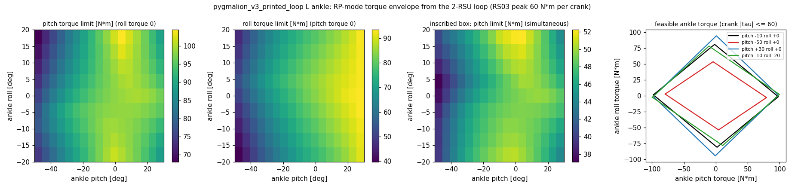

# 92. 발목 AB/RP 학습 세팅 — 실측 모터 파라미터, 하드웨어 한계, 자세별 토크 포락, T-N, 커리큘럼 (2026-08-23)

사용자 지시(2026-08-23): GPU 장착, 실측 모터 파라미터 적용, 관절각/토크 한계는 하드웨어 기준, 발목은 **AB 모드 / RP 모드 두 케이스**로 학습(RP는 IK/FK로 푼 자세별 선형화 토크 한계, 위치 한계는 두 모드 모두 roll/pitch 각), 보상은 이전 그대로, DR·선형속도·외력은 커리큘럼. 추가 결정(질문·답): vx 2.5 단계표, bent init, 32k iter(DR 10k→20k), **T-N 곡선 액추에이터 포함**.

런: [[2026-08-23_ankleAB_c1]] · [[2026-08-23_ankleRP_c1]] (registry [[66_experiment_registry]] Era-10). 폐루프 모델 자체는 [[91_closed_loop_ankle_rl]].

## 1. 실측 모터 파라미터 → 어디에 들어갔나

| 모터 | armature J [kg·m²] | damping b [N·m·s/rad] | frictionloss tc [N·m] | 적용 관절 |
|---|---|---|---|---|
| RS04 | 0.016333 (±0.000106) | 0.009492 | 0.269456 | hip_pitch, hip_roll, knee (waist) |
| RS03 | 0.015265 (±0.000067) | 0.022342 | 0.285370 | hip_yaw, 발목 모터 ×2 (shoulder) |

- 출력축 기준(벤치 시스템ID, motor-id 127)으로 받아 **그대로** 관절에 넣는다(구 카탈로그 0.007/0.005, 마찰 0 → 2.3–3×).
- `pygmalion_constants.py` `MOTOR_MEAS` → `BuiltinPositionActuatorCfg/TnPdActuatorCfg`의 armature·frictionloss·viscous_damping. `PYG_MOTOR_MEAS=0`이면 구값(구 런 재현용).
- AB 크랭크: RS03 원값. RP/직렬 발목 힌지: 루프로 **반영**한 값(§2, 중심자세) — pitch J 0.0209 / b 0.0306 / tc 0.472, roll 0.0153 / 0.0223 / 0.403. 반영식 $J_{ankle}=J_c^{\top}\,\mathrm{diag}(J_m)\,J_c$, $b$ 동일, $\tau_{f}=t_c\sum_i|J_{c,i\cdot}|$.

## 2. RP 모드 토크 한계 — 루프 IK/FK에서 자세별로 (`tools/robot_model/ankle_rp_envelope.py`)

*그림 1 — 좌: pitch 단독 토크 한계(roll 토크 0) [N·m], 중: roll 단독, 우 2: 동시 요구 내접 박스, 맨 오른쪽: 4개 자세의 실현 가능 토크 집합(평행사변형, 크랭크 |τ|≤60). 폐루프 모델 `pygmalion_v3_printed_loop.xml`, 격자 pitch −50..+30 × roll −20..+20 (5° 간격, 153절점, 미도달 0).*

- 절점마다: 크랭크 IK(로드 길이 A 289.0 / B 195.0 mm 폐쇄식 $|pin_i(\theta_{c,i})-ball_i(p,r)|=L_i$ 이분법, 중심에서 바깥으로 연속 분기) → 자코비안 $J_c=\partial\theta_c/\partial(p,r)$ (폐쇄식 음함수 미분, 중심차분) → $\tau_{ankle}=J_c^{\top}\tau_c$.
- 중심 $J_c$ = [[−0.817, −0.698],[−0.839, +0.715]] (크랭크°/발목°; 전달비 역수 1.22/1.43 일치). 단독 extent: **pitch 98.2 / roll 83.7 N·m**(구 직렬 고정값 90/50과 달리 roll이 큼), ROM 전역 pitch 68–105, roll 40–93. 내접 박스 49/42.
- **학습에 쓰는 형태**(선형화 한계): `AnkleRpActuator` — 관절 PD 토크 $\tau$ → $\tau_c=J_c^{-\top}(q)\,\tau$ → 크랭크당 ±60 클립(+T-N) → $\tau'=J_c^{\top}\tau_c$. 자세 (p, r)에서 $J_c^{\top}$를 격자 쌍선형 보간하고 그 역행렬을 env별로 계산(보간 행렬을 따로 역산하면 0.4 % 새어 나감 → 레드팀 전 자체 발견). 이것이 실물 동작(모터 토크 클램프) 그 자체라 단독-축 상한 표보다 충실하다. 검증: 200 랜덤 자세 numpy 대조 오차 0.0000, 클램프 후 크랭크 토크 ≤ 59.68(곡선 피크).
- 위치 한계: 두 모드 다 발목 힌지 범위(−50/+30, ±20)로. AB는 수동 힌지의 하드스톱 + 소프트 0.9 페널티가 그대로 작동, 크랭크 ±1.2 rad은 먼저 걸리지 않음(ROM 코너 최대 ±50°).

## 3. T-N 곡선 액추에이터 (`tn_actuator.py`)

| | corner | 피크 | 롤오프 | 무부하(공식) |
|---|---|---|---|---|
| RS04 | 95 rpm = 9.95 rad/s | 120.1 N·m | 150 rpm 78 → 190 rpm 11.2 | 200 rpm |
| RS03 | 120 rpm = 12.6 rad/s | 59.7 | 160 rpm 41.6 → 188 rpm 10.1 | 200 rpm |

- Motor_Spec/*_TN_curve_48V.csv 그대로(선형보간, corner 이하 평탄, 무부하 0 추가). 구동 사분면($\tau\omega>0$)만 속도별 상한, 제동 사분면은 피크(IsaacLab DCMotor 관례).
- 적용: hip/knee/hip_yaw(`TnPdActuator`, Python PD, 서브스텝 200 Hz), AB 크랭크 직접, RP 발목은 **크랭크 공간**에서($\omega_c=J_c\omega$, §2 클램프와 합쳐 `AnkleRpTnActuator`). 부호 확인: pitch +20 rad/s에 +300 요구 → 크랭크 ~16.5 rad/s 구동 → 70.6 N·m(롤오프), −300 요구는 제동 → 98.8(피크).
- `PYG_TN=0`이면 MuJoCo builtin 위치 액추에이터(평탄 피크)로 복귀. 무릎 overspeed 페널티(19.9 rad/s)는 그대로(두 arm 동일).

## 4. 커리큘럼 (단일 런, 두 arm 동일)

| 항목 | 스케줄 | 비고 |
|---|---|---|
| 명령 vx | 0.8 → 1.2 → 1.6 → 2.0 → 2.5 m/s (iter 4k/8k/12k/16k), yaw 0.5→1.0 | 기존 `command_vel` 단계표 |
| DR (push·friction·encoder·CoM) | dr_levels 0→1, **iter 10k→20k** | push ±0.7 m/s·±0.52 rad/s 등 push_max × factor |
| 외력 | push_robot interval, 위 램프 | |
| 관성 DR | PYG_INERTIAL_DR=1 (docs/90 §3), startup 고정 | 물리 불확실성이라 램프 없음 |

**고친 것**: friction/encoder/CoM DR 이벤트가 `startup`이라 dr_levels가 파라미터를 바꿔도 **한 번 샘플된 값이 끝까지** 갔다(램프는 push에만 실제 작용). `reset` 모드로 바꿔 에피소드 리셋마다 램프된 범위로 재샘플(`PYG_DR_STARTUP=1`로 구동작 복귀). 또 RP 모드가 v2(알루미늄) XML을 쓰던 것 → v3_printed로, 발 마찰 DR의 `foot2..6` 하드코딩 → 정규식(박스 발바닥 모델에서 크래시).

## 5. 런 설정과 단일변인 실증

- 공통: `PYG_V2=1 PYG_INIT_BENT=1 PYG_INERTIAL_DR=1 PYG_DR_START_ITER=10000 PYG_DR_END_ITER=20000`, 16384 env, 32k iter, video 8000 간격, wandb. AB: `PYG_ANKLE_MODE=AB`, RP: `PYG_ANKLE_MODE=RP`.
- launch 직후 `params/env.yaml` diff(AB vs RP) = 발목 항목만: init 키프레임(루프 정합해 vs ankle 0.36), 발목 액추에이터(크랭크 TnPd 22.3/1.41/60 + RS03 vs AnkleRpTn 28.5/1.81 envelope), 관측/pose 관절 집합, action scale 키, thermal rated(crank 20 vs ankle 32.7/27.9). 그 외 0건.
- 처리량(동시 실행): 두 런 모두 **5.0 s/iter**(collection 4.3 + learning 0.7) → 32k ≈ 44 h. 단독 env-step 기준 AB 121k / RP 204k env-steps/s(루프가 −40 %, nv 30 vs 18). 참고: gen21_bent_p1은 8192 env 단독 1.26 s/iter(20k = 7 h). GPU 13.7 GB / 16 GB.

## 6. 미결·가정 (사용자 확인용)
1. 실측 J/b/tc는 **출력축 환산값**으로 간주(기어 포함). 로터 기준이면 ×기어비² 필요 — 확인 요망.
2. RP 토크 한계는 단독-축 표가 아니라 **크랭크 공간 평행사변형 클램프**(§2). 단독-축 박스를 원하면 `tau_extent`/`tau_box` 표가 JSON에 있음.
3. T-N 구동/제동 사분면 규칙(제동 = 피크 허용)은 관례이며 회생 한계는 미반영.
4. 관성 DR은 램프 없이 startup 고정(불확실성 모델). 크랭크·로드 질량은 DR 미적용(35–80 g).
5. 16384 env로 32k면 두 런 동시 ~44 h. 8192 env면 ~22 h(샘플 수 = 구 P1+P2와 동일). 현재 16384로 진행 중 — 바꾸려면 말해 달라(재시작 비용 수 분).
