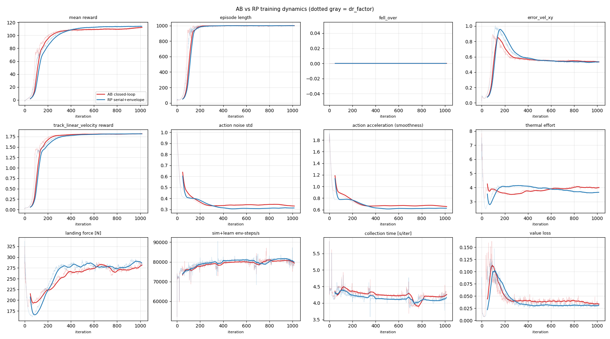
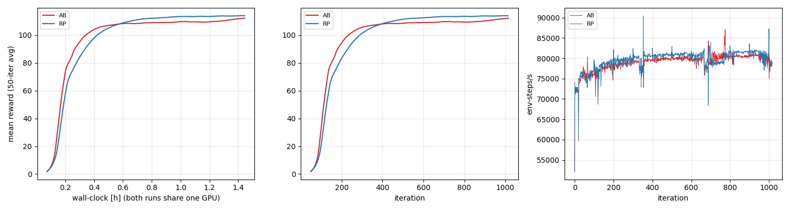

# 93. 발목 AB vs RP 비교 — 로깅 준비와 분석 계획 (2026-08-23)

두 런(`ankleAB_c2` / `ankleRP_c2`, [[92_ankle_ab_rp_training_setup]])은 보상·커리큘럼·질량·모터·T-N·init·상체·DR이 같고 **발목 기구만** 다르다(env.yaml diff = 발목 항목만, docs/92 §5). 나중에 안정성·학습비용·배포비용·설계하중을 비교할 수 있도록, **지금 무엇을 기록하고 있고, 완주 후 무엇을 어떻게 분석할지**를 고정한다.

## 0. 한 줄 질문과 판정 기준

> 폐루프를 그대로 학습(AB)하는 것이 직렬+자세별 토크 포락(RP)보다 (a) 설계 하중을 더 믿을 만하게 내고, (b) 학습 비용이 얼마나 더 들며, (c) 배포가 얼마나 단순한가?

우선순위: **① 설계 하중의 충실도**(이 프로젝트의 목적) → ② 정책 안정성/강건성 → ③ 학습 비용 → ④ 배포 비용. 같으면 단순한 쪽(RP 학습·AB 배포 중 무엇이 단순한지는 ④에서 정량화).

## 1. 두 arm이 같은 것 / 다른 것

| | AB (폐루프) | RP (직렬+포락) |
|---|---|---|
| XML | `pygmalion_v3_printed_loop.xml` (nv 30, connect 4) | `pygmalion_v3_printed.xml` (nv 18) |
| 발목 액추에이터 | 크랭크 TnPd Kp 22.3/Kd 1.41/60 N·m, RS03 J/b/tc 원값 | AnkleRpTn Kp 28.5/Kd 1.81, 크랭크공간 ±60+T-N, 반영 J/b/tc |
| 관측 | 53 (수동 발목 4ch 포함) | 45 |
| 액션 | 12 (크랭크 4) | 12 (발목 4) |
| pose 보상 관절 | hip·knee·ankle(수동) | 전 관절 |
| thermal rated | crank 20 | ankle 32.7/27.9 |
| 그 외 전부 | 동일 | 동일 |

주의: 관측 차원이 달라 네트워크 입력이 다르고(정책 용량 동일), AB의 발목 관측은 sim에선 정확하지만 실물에선 크랭크 FK(백래시·탄성)라는 점이 ④의 핵심.

## 2. 지금 기록되는 것 (로깅 인벤토리)

| 항목 | 어디 | 용도 |
|---|---|---|
| TB 스칼라 50종 (reward·ep_len·fell·err_vel·Loss·Policy/std·Perf/total_fps·collection/learning time·Curriculum·Metrics/thermal·landing·slip·air_time·Episode_Reward 항별) | run dir `events.out.tfevents.*` | 학습 동역학·비용 (§3-A/B) |
| 체크포인트 100 iter마다 (`model_N.pt`) | run dir | 체크포인트별 평가(수렴 곡선을 **평가 지표**로), 커리큘럼 전환 전후 비교 |
| 롤아웃 클립 ~333 iter마다 (`videos/train/rl-video-step-*.mp4`) | run dir | accumulate 영상(iter 캡션) |
| GPU util/메모리 + 프로세스별 메모리 60 s 샘플 | `analysis/out/gpu_usage.csv` | 학습 비용 (§3-A) |
| 1 h 스냅샷 + 게이트 판정 | 노트 §2c 표, `docs/mujoco/assets/<run>_progress.png` | 학습 안정성 기록 |
| `params/env.yaml, agent.yaml` | run dir | 단일변인 증명 |
| **측정(fc/fcp) 추가 필드** (2026-08-23, `measure_loads.py`) | npz | §3-C/D/E |
| · AB: `closure_mm_{L,R}`, `Frod_{L,R}_{A,B}`(로드 축력, equality efc), `tauank_eq_{L,R}_{pitch,roll}` = $J_c^{\top}\tau_{crank}$ | | 발목 공간 비교 |
| · RP: `taucrank_eq_{L,R}_{A,B}` = $J_c^{-\top}\tau_{ankle}$ | | 모터 공간 비교 |
| · `qtarget_*`: T-N(모터형) 액추에이터에서도 **위치 목표**(종전엔 ctrl=토크를 읽는 잠재 버그) | | q/qtarget 분석 |

완주 후 두 arm 각각 `measure_full.py` fc(clean)+fcp(push) — **토글 동일 지정 필수** `PYG_V2=1 PYG_INIT_BENT=1 PYG_ARM_ABD_DEG=15 PYG_ANKLE_MODE=AB|RP`, `PYG_BOX`는 최종 커리큘럼 박스(vx −2.0..2.5, vy ±1, wz ±1).

## 3. 분석 차원 · 지표 · 방법

### A. 학습 비용
| 지표 | 방법 | 주의 |
|---|---|---|
| s/iter, env-steps/s | TB Perf/* | 두 런이 **GPU를 공유**하므로 공유 중 값은 같게 나온다(80k씩). 순수 sim 비용은 단독 측정값 사용: AB 121k / RP 204k env-steps/s(16384 env, docs/92 §5) = **루프 −40 %** |
| GPU 메모리 | gpu_usage.csv 프로세스별 max | AB 7.0 / RP 6.5 GB (초기) |
| 수렴 비용 | 보상 고원의 50/80/90/95 % 도달 iter·env-step·wall-clock (`ab_rp_compare.py` stage 1) | 커리큘럼 단계(4k/8k/12k/16k)·DR 램프(10k–20k) 전환마다 **재수렴 시간**도 |
| 표본 효율 | reward vs env-steps | 16384 env 동일 |
| 시드 분산 | **단일 시드** — 결론이 미세하면 8192 env × 2시드 추가 런 | 예산 의사결정 |

### B. 학습 안정성 (동역학)
- 커리큘럼 전환(vx 1.2/1.6/2.0/2.5, DR 0→1) 직후 reward·fell·err_vel의 **딥 깊이와 회복 iter** — 두 arm 비교. 수치: 전환 전 200 iter 평균 대비 최저점, 95 % 회복까지 iter.
- value loss·noise σ·entropy 궤적, 이상 이벤트(NaN·발산·낙상 급증) 유무 — 노트 §2c 표 + docs/27 판정.
- AB 고유: 학습 중 폐루프가 찢어지는지 — 체크포인트 평가에서 `closure_mm` P99(§C).

### C. 정책 안정성·강건성 (평가, 체크포인트별)
| 지표 | 방법 |
|---|---|
| 추종 달성률 (순수축·복합, 15 s dwell) | `track_from_npz.py` on fc |
| 낙상률·푸시 회복 | fcp: push 후 재추종까지 시간, 낙상 수 (`push_step`) |
| **강건성 마진** (학습 DR 범위 밖) | 신규 `robustness_sweep.py`: 마찰 0.2–1.4, 질량 ±15 %, 액션 지연 0–40 ms, Kp/Kd ±20 %, 발목 관측 노이즈/백래시(AB) — 각 조건 낙상률·추종 곡선 |
| AB 구속 건전성 | fc/fcp `closure_mm` RMS/P99/peak, 접촉 충격 시 스파이크 |
| 모터 포화율 | 크랭크(AB) / 크랭크 환산(RP) 토크가 60 N·m·T-N 상한에 머무는 시간 비율 (`actuator_eval`, `tn_design.py`) |

### D. 보행 품질
CoT, L/R 대칭(토크·각도·GRF %차), 떨림 지표(지지상 ankle 5 Hz+ 파워·|Δqtarget|), 발 클리어런스·체공·접촉 타이밍, landing force·GRF 피크(×BW). 영상: `ab_sidebyside.py`(동일 명령 프레임잠금 좌/우, 실시간) + 각 arm accumulate.

### E. 설계 하중 (프로젝트 목적)
- 공통 공간 표: 발목 pitch/roll 토크(AB 환산 vs RP 직접), 크랭크 A/B 토크(AB 직접 vs RP 환산), knee/hip 토크·wrench — RMS(열)·P99(순시)·peak(클립 주의), docs/65 SF 규칙.
- **AB만 주는 것**: 로드 축력 `Frod`(로드엔드 정격 720 kgf 대비), 크랭크 힌지 wrench(`cfrc_int` crank/rod 바디), 볼조인트 요동각 사용량(rod_u1/u2 범위). RP에서는 이것이 **Jacobian 환산 추정**에 불과하므로, 두 arm의 환산값 차이 = "직렬 근사가 놓치는 하중"을 정량화.
- 모터 활용 §7/§8c: T-N 엔벨로프 위 (ω, τ) 산포 — AB는 크랭크 실측, RP는 환산.

### F. 배포 비용
| 항목 | AB | RP | 정량화 방법 |
|---|---|---|---|
| 정책 출력 → 모터 | 크랭크 목표각 그대로 (MIT 모드 Kp 22.3/Kd 1.41) | 발목 목표 → **IK + 임피던스 변환**(Bipetto식 $J^{-\top}KJ^{-1}$) 매 제어주기 | 변환층 구현·연산량·지연 측정 |
| 관측 | 수동 발목 4ch = 크랭크 엔코더 **FK** (백래시·탄성 오차) | 없음 | **신규 `rp_policy_on_loop.py` / `ab_obs_perturb.py`**: (i) AB 정책에 FK 오차(±0.5–2°, 지연) 주입 → 추종/낙상 민감도; (ii) **RP 정책을 루프 모델 위에서 IK+임피던스 변환으로 실행(sim-to-sim 전이)** → RP 모델 대비 추종·낙상·토크 차이 = 직렬 학습의 배포 갭 |
| 안전 | 크랭크 한계·T-N 학습에 내재 | 포락 클램프가 실물 클램프와 같음(§2, 설계상 동일) | 포화율 비교 |
| 펌웨어 | 1 kHz 서보 필수(docs/70) | 동일 + 변환층 | — |

### G. sim 충실도 민감도 (AB)
구속 강성(solimp 0.99 vs 0.999)·dt(5 vs 2.5 ms)에서 같은 정책을 평가해 하중·추종이 얼마나 바뀌는지 — AB 하중 수치의 신뢰구간.

## 4. 실행 순서

1. **지금~완주**: 게이트(iter 4k·8k·12k·16k·20k·완주)마다 `snapshot_review.py` 판정 + `ab_rp_compare.py --ab --rp`(stage 1) 재실행 → `docs/mujoco/assets/abrp_*` 갱신.
2. **완주 직후**: 두 arm fc/fcp(15 s dwell, 토글 동일) → `track_from_npz` → `ab_rp_compare.py` stage 2(공통공간 하중 표) → `ab_compare.py`(Δ% 막대) → `ab_sidebyside.py` → `tn_design.py`/`wrench_design_stats.py`/`wrench3d.py` → §7/§8/§10.
3. **배포 갭 실험**: `rp_policy_on_loop.py`(RP 정책 → 루프 모델, IK+임피던스 변환), `ab_obs_perturb.py`(AB 관측 FK 오차) — 신규 작성 예정.
4. **강건성 스윕**: `robustness_sweep.py` — 신규.
5. 각 arm 정식 노트 §2–§12 + **비교노트** `docs/experiments/2026-08-2x_ankle_ab_rp_compare.md` + registry/canvas 판정.

## 5. 첫 stage-1 스냅샷 (iter 1016, 1.4 h)

| 지표 | AB | RP |
|---|---|---|
| 보상 고원(50-avg) | 112.2 | 114.0 |
| 50 / 80 / 95 % 도달 iter | 118 / 179 / 332 | 134 / 235 / 401 |
| fell · err_vel_xy | 0 · 0.539 | 0 · 0.532 |
| action accel · noise σ | 0.667 · 0.338 | 0.625 · 0.313 |
| thermal · landing [N] | 4.00 · 275 | 3.65 · 283 |
| GPU 메모리 max [MiB] | 7045 | 6457 |

초기 읽기(결론 아님): AB가 초기 수렴은 빠르고(95 % 도달 332 vs 401 iter) 고원은 RP가 약간 높음(+1.6 %); 둘 다 vx 0.8 단계 상한에서 고원이라 커리큘럼 진입 후 다시 본다.

## 6. 주의·한계
- 단일 시드. GPU 공유로 공유 중 처리량은 동일하게 보임(순수 sim 비용은 단독값 사용).
- AB/RP는 관측 차원이 다르다 — "같은 정책"이 아니라 "같은 보상·환경에서의 최적 정책" 비교.
- RP의 크랭크/로드 하중은 환산 추정이고, AB의 하중은 구속 강성(solimp)에 민감(§G).
