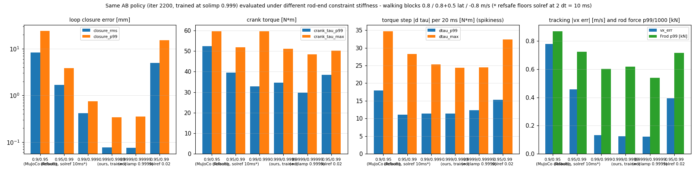

# 94. 폐루프 구속 강성(solimp/solref) — 전례 조사·변인통제 비교·판정 (2026-08-24)

> 피드백(외부 리뷰): "solimp를 1에 너무 붙이면 토크가 심하게 튈 수 있고, 약간의 유연성이 학습에도 도움 될 것 같다. 컨벤션이 있는지 찾아봐야."
> 우리 설정: `pygmalion_v3_printed_loop.xml` 의 `connect` 4개 = `solref="0.002 1" solimp="0.999 0.9999 0.0001"` ([[91_closed_loop_ankle_rl]] §4.3에서 A/B로 고른 값).

조사 = haiku/sonnet 워크플로(6 렌즈·14 원문 추출), **검수 = 본인이 원문 XML·문서를 직접 읽어 확인**(아래 ✓ 표시). 원자료: [research_raw/2026-08-24_equality_solimp_conventions.md](research_raw/2026-08-24_equality_solimp_conventions.md).

## 0. 결론

1. **컨벤션은 "정해진 값"이 아니라 두 진영**: ① 부드럽게(Cassie `solref 0.005` + 기본 solimp 0.9/0.95, Robotiq 2F-85 `0.95/0.99`, BRUCE는 **의도적 데드밴드** `0.2 0.95 0.002 0.9 6`으로 백래시를 모델링) ② 단단하게(ToddlerBot MJX `0.9999 0.9999 0.001`, MuJoCo 내부 클램프 최대치). 우리 0.999는 ②쪽이고 ToddlerBot보다 한 단계 아래.
2. **"단단하면 토크가 튄다"는 이 시스템에선 측정상 성립하지 않는다**: 같은 AB 정책을 0.9→0.9999까지 5단계 강성에서 돌린 결과(§3) 토크 스텝 |Δτ| p99는 0.99–0.9999에서 11.3–12.4 N·m로 평탄하고, **가장 부드러운 기본값(0.9/0.95)이 17.99로 가장 튄다**(루프가 8 mm 처지며 정책과 싸움). 폐루프 오차는 0.9에서 RMS 8.4 / p99 24 mm — 메커니즘이라 부르기 어렵고, 0.99에서 0.4 mm, 0.999에서 0.08 mm.
3. 단, 이 정책은 0.999에서 학습된 정책이라 **학습 단계 효과(부드러운 구속이 학습을 돕는가)는 별도 A/B가 필요** — 메모리 한계로 본 런 중에는 못 띄우고(§4, 01:03 시도 후 RAM 2 GB 남아 중단), 본 런 종료 후 `solimp 0.95/0.99·solref 0.005`(Cassie/Robotiq) vs 현행 0.999 쌍을 같은 조건으로 돌린다. **BRUCE식 데드밴드**(로드엔드 유격을 물리로 모델링)는 3번째 arm 후보.
4. 현행 0.999 유지 근거: 폐루프 오차·로드 축력·정책 거동이 0.99와 같고(§3), ToddlerBot 전례가 0.9999로 더 단단하며, 실물 로드엔드 강성(~10⁷ N/m)에 가깝다. 바꾼다면 0.99(오차 0.4 mm, 모든 지표 동일)가 안전한 타협.

## 1. 전례 (직접 확인한 원문)

| 모델 | equality | solref | solimp | dt | 솔버 | RL | 출처 |
|---|---|---|---|---|---|---|---|
| **Cassie** (Menagerie/OSU DRL) ✓ | connect ×4 (plantar·achilles 로드) | `0.005 1` (equality 기본클래스) | MuJoCo 기본 `0.9 0.95 0.001` | **0.0005** | 기본 | ✓ | [cassie.xml](https://github.com/google-deepmind/mujoco_menagerie/blob/main/agility_cassie/cassie.xml) L4,10,228–232 |
| **Robotiq 2F-85** (Menagerie) ✓ | connect ×2 (4절) + joint eq | `0.005 1` | `0.95 0.99 0.001` | 기본 | cone elliptic impratio 10 | — | [2f85.xml](https://github.com/google-deepmind/mujoco_menagerie/blob/main/robotiq_2f85/2f85.xml) L174–177 |
| **BRUCE** (og_bruce, Humanoids 2025) ✓ | connect ×2 (무릎 4절) + tendon eq ×4(차동) | `0.005 1.05` | **`0.2 0.95 0.002 0.9 6`** (폭 2 mm 데드밴드, 백래시 모델) | **0.005** | implicitfast, iterations 3 / ls 5 | ✓ MJX 8192 env, zero-shot | [og_bruce.xml](https://github.com/alvister88/og_bruce/blob/main/og_bruce.xml) L4,364–367 (주석엔 `0.005 1` 기본판도 있음) |
| **ToddlerBot** (MJX) ✓ | site-site connect ×4 (목 링키지) | `0.004 1` | **`0.9999 0.9999 0.001 0.5 2`** | 기본 | iterations 1 / ls 4 | ✓ | [toddlerbot_2xc_mjx.xml](https://github.com/hshi74/toddlerbot/blob/main/toddlerbot/descriptions/toddlerbot_2xc/toddlerbot_2xc_mjx.xml) L594–602, 636 |
| ALOHA (Menagerie) ✓ | joint eq(손가락 커플링)만 | 기본 | 기본 | — | — | — | aloha.xml L291 |
| Digit (Berkeley 2024) | connect (무릎 4절) | 기본(논문 미기재) | 기본 | CPU MuJoCo | — | ✓ | arXiv 2410.03654 (에이전트 보고, 원문 XML 미확인) |
| MuJoCo 기본값 ✓ | — | `0.02 1` | `0.9 0.95 0.001 0.5 2` | — | — | — | [modeling](https://mujoco.readthedocs.io/en/stable/modeling.html) |
| **우리** | site-site connect ×4 | `0.002 1` → refsafe로 **10 ms** | `0.999 0.9999 0.0001` | 0.005 | Newton, iterations 10 / ls 20 (mjlab velocity cfg) | ✓ mujoco_warp | [[91_closed_loop_ankle_rl]] §4.3 |

읽기: 시간상수는 전부 4–5 ms(우리는 refsafe 때문에 10 ms로 더 무름), 임피던스는 0.95(Robotiq/BRUCE 상한)·0.9999(ToddlerBot)로 갈린다. 워크플로 브리프의 "mjlab iterations 50/20"은 오류(실제 10/20) — 검수에서 정정.

## 2. MuJoCo 의미론 (원문 확인)

- 정규화자 $R_{ii} = \frac{1-d_i}{d_i}\hat{A}_{ii}$, $R\to0$이면 하드 구속, $R\to\infty$이면 구속 없음 ([computation](https://mujoco.readthedocs.io/en/stable/computation/index.html) 식 11). d=0.9 → R=0.11Â, d=0.999 → 0.001Â, d=0.9999 → 0.0001Â.
- 임피던스는 내부에서 **[0.0001, 0.9999]로 클램프**(`mjMINIMP/mjMAXIMP`) — 우리 dmax 0.9999가 상한이고, §3의 "0.9999/0.99999" arm은 실제로 0.9999/0.9999.
- solref `timeconst ≥ 2·dt`(refsafe): dt 5 ms에서 10 ms 미만은 전부 10 ms. "timeconst가 dt의 2배보다 작으면 적분기 대비 너무 단단해져 불안정해질 수 있다"(modeling).
- 임계감쇠 시 정상상태 침투량은 구속공간 유효질량과 무관(impedance-scaled) — 그래서 임피던스만으로 "처짐"이 정해진다.
- BRUCE가 쓴 수법: $D(r)$을 폭 ε 안에서 낮게(0.2) 두고 밖에서 0.95로 올려 **백래시 데드밴드**를 구속 자체로 모델링(논문 III-D, 원문 확인).

## 3. 변인통제 ① — 같은 정책, 구속 강성만 변경 (2026-08-24 00:30)

AB 정책 `ankleAB_c2r model_2200`(0.999에서 학습)을 `PYG_LOOP_SOLIMP/SOLREF`로 구속만 바꿔 같은 4명령(정지·0.8·0.8+0.5·−0.8, 각 8 s, CPU)에서 측정. 스크립트 `tools/robot_model/loop_tests/solimp_policy_sweep.py`.



| solimp (solref) | 폐루프 RMS / p99 / max [mm] | 크랭크 τ p99 / max | **|Δτ| p99 / max** (튐) | >5 Hz 비율 | Frod p99 / max [N] | 발목환산 τ RMS | vx 오차 |
|---|---|---|---|---|---|---|---|
| 0.9 / 0.95 (기본) | **8.37 / 24.1 / 26.9** | 52.4 / 59.7 | **18.0 / 34.7** | 0.05 | 870 / 1050 | 25.1 | **0.78** |
| 0.95 / 0.99 (Robotiq) | 1.68 / 3.86 / 4.41 | 39.5 / 51.8 | 11.1 / 28.3 | 0.02 | 723 / 876 | 25.3 | 0.46 |
| 0.99 / 0.999 | 0.42 / 0.75 / 0.87 | 32.8 / 59.7 | 11.4 / 25.4 | 0.04 | 603 / 1055 | 15.3 | 0.13 |
| **0.999 / 0.9999 (현행)** | 0.08 / 0.34 / 0.51 | 34.6 / 51.0 | 11.4 / 24.4 | 0.05 | 618 / 872 | 13.9 | 0.13 |
| 0.9999 (클램프) | 0.08 / 0.35 / 1.05 | 29.8 / 48.5 | 12.4 / 24.4 | 0.07 | 540 / 883 | 12.5 | 0.12 |
| 0.95 / 0.99, solref 0.02 | 4.93 / 15.2 / 18.6 | 38.4 / 50.2 | 15.3 / 32.4 | 0.05 | 717 / 1040 | 18.7 | 0.39 |

해석:
- **튐 지표(|Δτ| p99·max, >5 Hz)는 0.99 이상에서 평탄** — 단단할수록 튀지 않는다. 가장 튀는 쪽은 기본값: 루프가 8 mm씩 벌어졌다 닫히며 구속력이 요동(mujoco_warp #1510의 "부드럽게 해도 안 나아진다"와 일치).
- 부드러운 구속은 **가짜 직렬 스프링**이 돼 정책의 추종이 무너진다(vx 오차 0.13 → 0.46 → 0.78). 이 정책이 0.999에 적응된 탓도 있어, 학습 단계 효과는 §4에서 본다.
- 로드 축력 p99는 단단할수록 낮다(870 → 540 N) — 처짐-복원 요동이 사라지기 때문.

## 4. 변인통제 ② — 학습 A/B (계획, 본 런 종료 후)

01:03에 2048 env 쌍을 띄워 봤으나 GPU 15.6/16.3 GB·RAM 2 GB 남아 본 런 OOM 위험 → 중단(`logs/solimp*` 삭제). 본 런(ankleAB_c2r/ankleRP_c2, ~8/25 오후) 종료 후:

| arm | 설정 | 비고 |
|---|---|---|
| A | 현행 XML (0.999/0.9999, solref 0.002→10 ms) | = ankleAB_c2r 그대로 |
| B | `PYG_LOOP_SOLIMP="0.95 0.99 0.001" PYG_LOOP_SOLREF="0.005 1"` | Cassie/Robotiq 관례 |
| C (선택) | `PYG_LOOP_SOLIMP="0.2 0.95 0.0002 0.9 6"` | BRUCE식 데드밴드, 폭 = JS06 로드엔드 유격 ~0.2 mm |

동일: 16384 env, 보상·커리큘럼·init·모터·T-N·팔. 비교 지표(docs/93): 학습 곡선(reward·fell·err_vel), 체크포인트별 §3 표(자기 강성에서), 떨림(>5 Hz·|Δqtarget|), 로드 축력·폐루프 오차, 그리고 **교차 평가**(A 정책을 B 구속에서, B 정책을 A 구속에서 — 강성 민감도 = 배포 강건성). 명령:
```bash
PYG_V2=1 PYG_INIT_BENT=1 PYG_INERTIAL_DR=1 PYG_DR_START_ITER=10000 PYG_DR_END_ITER=20000 PYG_ARM_ABD_DEG=15 PYG_ANKLE_MODE=AB \
PYG_LOOP_SOLIMP="0.95 0.99 0.001" PYG_LOOP_SOLREF="0.005 1" .venv/bin/python3 analysis/train_wandb_video.py Mjlab-Velocity-Flat-Pygmalion \
  --video True --video-interval 8000 --video-length 500 --env.scene.num-envs 16384 --agent.max-iterations 32000 --agent.run-name ankleAB_c3_soft --agent.logger wandb
```

## 5. 리뷰어 피드백에 대한 답

- "solimp가 1에 가까우면 토크가 튄다": MuJoCo의 임피던스는 0.9999에서 클램프되고, 우리 측정(§3)에서 0.99–0.9999 구간의 토크 스텝은 동일(|Δτ| p99 11–12 N·m). 튀는 것은 오히려 부드러운 기본값이었다. 단단한 구속에서 토크가 튈 수 있는 조건은 **솔버 반복이 부족해 잔차가 다음 스텝에 과보정되는 경우**(MuJoCo #1129, Digit 사용자 보고: 반복을 줄일수록 구속이 깨짐) — 우리는 Newton 10/20이고 접촉 정적 시험(docs/91 §4.4)·보행 측정 모두에서 진동이 없었다.
- "약간의 유연성이 학습에 도움": 가능성은 열어 두되, 이 메커니즘에선 유연성 = 로드 처짐 = 발목 전달 정확도 손실이라 **물리적 근거가 있는 유연성(BRUCE식 유격 데드밴드)**으로 넣는 게 맞다. §4 A/B에서 판단.
- 컨벤션: "4–5 ms 시간상수 + 0.95~0.99" (Cassie·Robotiq·BRUCE) 또는 "최대 강성"(ToddlerBot). 양쪽 다 RL 성공 사례가 있으므로 **우리 선택은 물리(로드엔드 강성)와 측정(§3)에 근거**하고, 학습 효과는 §4로 닫는다.
