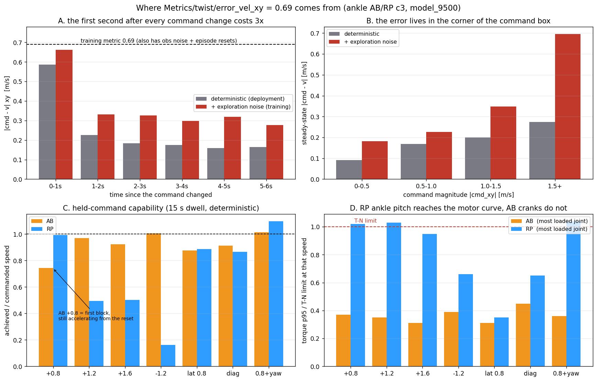

# 96. 추종 오차(error_vel_xy 0.69)의 병목 — 분해 측정 (2026-08-24, 자율 세션)

사용자 질문: "error vel 이 너무큰데, 병목이 어디지?" (학습 지표 `Metrics/twist/error_vel_xy` ≈ 0.69 m/s @ iter 9.5k).
결론부터: **하드웨어(토크·속도) 병목이 아니다. 지표가 측정되는 방식(명령 전환 과도 + 탐색 노이즈 + 리셋)과 명령 박스의 모서리가 대부분이다.** RP만 발목 pitch가 모터 곡선에 붙는다.

## 1. 지표 정의부터
`velocity_command.py:_update_metrics` — 명령창 전체에 대해 `‖cmd_xy − v_xy‖`의 평균. 명령은
`resampling_time_range=(3.0, 8.0)` s마다 새로 뽑히고(평균 5.5 s), 박스는 vx ±1.6(커리큘럼, 16k에 ±2.5),
**vy ±1.0(커리큘럼 없음, 고정)**, wz ±1.0, heading 30 %/standing 10 %/forward 20 %.
즉 **가속 과도구간이 창의 큰 몫**을 차지하고, vx·vy가 동시에 크면 명령 크기가 1.9 m/s까지 간다.

## 1b. ★ 진짜 1차 원인: 지표가 평균이 아니다 (2.5배 부풀려짐)

`CommandTerm.reset()`은 **에피소드 리셋 때만** 지표를 0으로 되돌린다. 그런데 `_update_metrics`는
매 스텝 오차를 더하면서 **가장 긴 명령창**(`resampling_time_range[1]/step_dt` = 8 s/0.02 = 400 스텝)으로 나눈다.
에피소드는 `episode_length_s=20.0` = **1000 스텝**이므로

$$\text{error\_vel\_xy} = \frac{\sum_t e_t}{400} = \bar{e}\cdot\frac{1000}{400} = 2.5\,\bar{e}$$

즉 **로그의 0.69는 평균오차 0.276 m/s**다. 내 오프라인 재현값(결정론적 0.257)과 정확히 맞는다.

**실증 2개**
1. 학습 초기 로그(ankleAB_c2 iter 0–9): 아직 못 걷고 곧바로 넘어지는 정책인데 `error_vel_xy`가 **0.02–0.08**로 매우 "좋다". 에피소드 길이가 22–47 스텝이기 때문 — 공식대로 $0.7\times40/400=0.07$. 즉 **못 걸을수록 지표가 좋아 보인다.**
2. 4-env CPU 스모크 테스트(액션 0, 로봇 정지): legacy `error_vel_xy` 0.061 vs 새 `error_vel_xy_mean` **0.687** = 명령 크기 평균 그대로. 공식 확인.

**따라서**
- 에피소드 길이가 다른 런끼리 `error_vel_xy`를 비교하면 안 된다(과거 노트의 err_vel 열 전부 해당).
- c3의 0.69는 "추종이 나쁘다"가 아니라 **평균 0.276 m/s**이며, 그 안에서 정상상태는 0.17이다.
- 조치(적용 완료, 리워드 불변): `velocity_command.py`에 **`error_vel_xy_mean`**(정직한 스텝 평균)과
  **`error_vel_xy_steady`**(명령 전환 후 2 s 제외) 두 지표를 추가했다. 기존 `error_vel_xy`는 과거 런과의 연속성을 위해 그대로 둔다.
  진행 중인 c3 두 arm은 재시작 시에만 새 지표가 붙고, 기존 지표는 변하지 않으므로 A/B 비교는 그대로 유효하다.

## 2. 분해 결과 (AB, model_9500, CPU 재생)
학습과 같은 방식으로 박스에서 24개 명령을 무작위로 뽑아 각 5.5 s 유지(`tools/robot_model/loop_tests/tracking_error_decomp.py`).

| 성분 | 값 [m/s] | 비고 |
|---|---|---|
| 정상상태(전환 후 2 s 이후), 결정론적 | **0.172** | 배포 시 실제 추종 오차 |
| 전환 직후 0–1 s | 0.586 | 창의 18 %가 여기 |
| 전환 직후 0–2 s | 0.406 | 창 시간의 **36 %** |
| 전체 평균(결정론적) | **0.257** | = 정상상태 + 과도 |
| 전체 평균 + 탐색 노이즈 σ 0.378 | **0.378** | 학습은 **샘플된 액션**으로 측정 |
| 학습 로그 값 ÷ 2.5 (§1b) | **0.276** | 결정론적 재현 0.257과 일치 — 남는 차이는 관측노이즈·리셋·표본 |

명령 크기별 정상상태 오차(결정론적 / +노이즈): 0–0.5 **0.09 / 0.18**, 0.5–1.0 0.17 / 0.23,
1.0–1.5 0.20 / 0.35, **1.5+ 0.27 / 0.70**. → 오차는 박스 모서리(대각 고속)에 몰려 있다.

## 3. 유지 명령 능력 (15 s dwell, `speed_bottleneck.py`)
| 명령 | AB 도달률 | RP 도달률 |
|---|---|---|
| +0.8 | 0.74* | 0.99 |
| +1.2 | **0.95** | 0.49† |
| +1.6 | **0.92** | 0.50† |
| −1.2 | **1.00** | 0.16† |
| 측면 0.8 | 0.87 | 0.88 |
| 대각 (0.8, 0.8) | 0.91 | 0.92 |
| 0.8 + 선회 1.0 | 1.00 | 1.10 |

\* AB의 +0.8은 첫 블록이라 리셋 직후 가속 중(3 s 창 평균 0.08 → 0.49 → 0.86 → 0.89) — 능력이 아니라 과도.
† RP의 1.2/1.6/−1.2 붕괴는 **단일 롤아웃 아티팩트**였다: 같은 체크포인트를 무작위 명령(§2 방식)으로 재측정하면
정상상태 오차 0.241로 AB(0.172)보다 조금 나쁠 뿐 붕괴가 없고, 크기별로도 1.5+ 구간이 0.21로 오히려 낮다.
블록을 리셋 없이 이어 붙인 순서(1.2→1.6→−1.2)에서 상태가 누적 악화된 것으로 보인다 —
**유지-명령 프로브는 블록 사이 리셋이 필요**하다(도구 개선 항목).

## 4. 액추에이터는 병목이 아니다 (AB) / ~~RP는 발목이 붙는다~~
> ⚠ **정정 2026-08-26**: 아래 RP 행(ankle_pitch util 0.83·포화 3.7 %)은 **발목축 토크를 모터 T-N 곡선에 직접 대조한 오류**다.
> RP도 모터는 크랭크에 있고(`AnkleRpTnActuator`가 크랭크공간에서 클램프), 모터축으로 사상하면 **0.44–0.55·포화 ≤0.03 %**로 AB와 동률이다.
> 검증(변환 corr 1.0000)과 상세는 [[2026-08-24_ankleRP_c3]] 정정 블록. 이 절의 **AB 수치와 "액추에이터는 병목이 아니다"는 결론은 유효**하다.
무작위 명령 롤아웃 전체에서 실측 48 V T-N 곡선(그 순간 속도에서의 한계 토크) 대비 사용률:

| arm | 최다 부하 관절 | util p95 | 한계 도달 비율 | τ p95 |
|---|---|---|---|---|
| AB | R_knee | 0.43 | 0.000 | 51.4 N·m |
| AB | L_crank_A / B | 0.38 / 0.35 | 0.000 | 22.4 / 21.0 |
| **RP** | **L/R ankle_pitch** | **0.83 / 0.82** | **0.037 / 0.038** | 49.4 / 48.9 |

- AB의 발목은 수동관절이라 τ=0이고, 실제 구동은 크랭크 2개가 나눠서 한다 → **2-RSU 링키지의 전달비 이득이 실측으로 확인**(같은 보행에서 크랭크 35–38 % vs 직결 발목 82 %).
- RP는 스텝의 3.7 %에서 모터 곡선에 붙는다. 지금은 추종을 무너뜨리지 않지만 vx 2.0–2.5 커리큘럼과 DR가 들어가면 여유가 없다 → 16k 게이트에서 재확인.
- 관절 속도는 양쪽 모두 무부하의 ≤28 %로 여유.

## 5. 그래서 무엇을 할 것인가
1. **지표 수정(완료)**: §1b — `error_vel_xy_mean` / `error_vel_xy_steady` 추가. 논문·리포트에는 결정론적 정상상태 **0.17 (AB) / 0.24 (RP)**, 전환 포함 0.26/0.34를 쓴다. 학습 곡선의 0.69는 2.5배 스케일된 legacy 값임을 명시.
2. **박스 모서리**: vy ±1.0은 커리큘럼 없이 처음부터 최대다. vx가 ±2.5까지 가면 대각 명령이 2.7 m/s가 되어 물리적으로 무리 → vy도 커리큘럼으로 램프하거나 상한을 낮추는 안을 **리워드/커리큘럼 연구 노트를 쓴 뒤** 적용(현재 런은 건드리지 않는다).
3. **과도 응답**: 정지→0.8에 6 s는 느리다. 가속을 직접 보상하는 항은 [[62_policy_reward_design_review]]의 "명령 게이팅" 원칙과 충돌할 수 있으니, 다음 세대 번들에서 연구 후 시험.
4. **RP 발목 여유**: 16k·24k 게이트에서 ankle_pitch util을 계속 기록(§4 표 갱신).

도구: `tools/robot_model/loop_tests/speed_bottleneck.py`(유지 명령 + T-N 사용률), `.../tracking_error_decomp.py`(학습 방식 재현·과도/정상 분해, `PYG_ACTION_NOISE`로 탐색 노이즈 재생), `tools/robot_model/tracking_bottleneck_plot.py`(그림).
