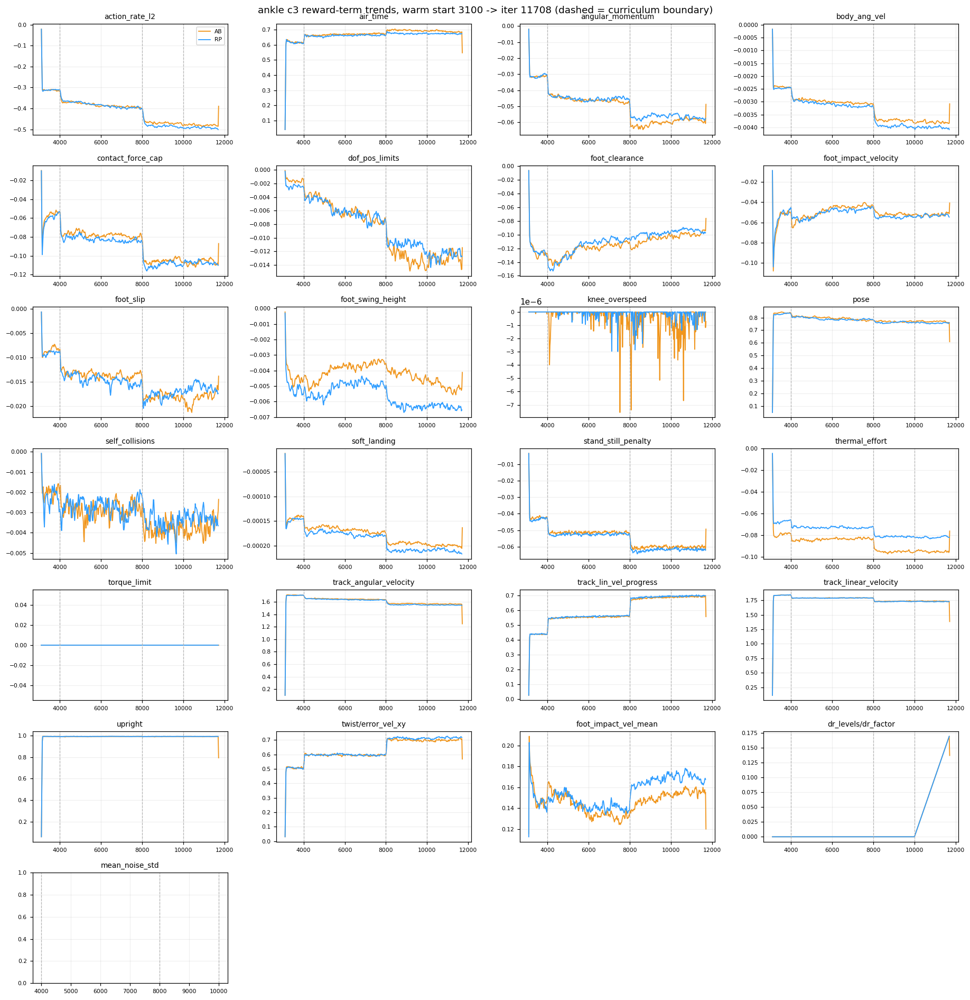
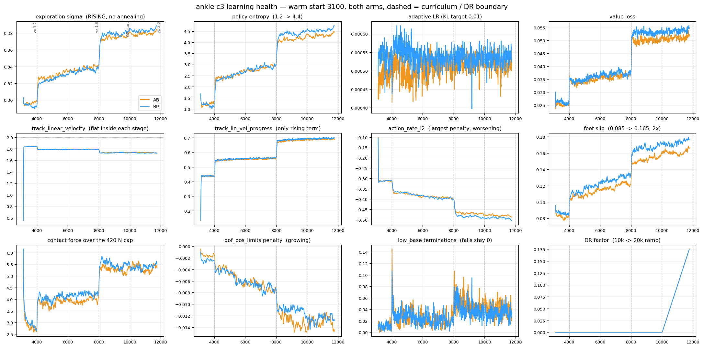

# 97. c3 리워드 항별 추세·학습 건강도·커리큘럼/DR 적절성 (2026-08-24, iter 11.7k)

사용자 질문: "리워드의 추세들을 하나하나 분석해봐. 학습이 제대로 되고 있나? 지금 DR 및 커리큘럼은 적절한가?"
도구: `tools/robot_model/reward_trend_report.py`(TB 전 항목 추출·경계별 Δ·기울기), `tools/robot_model/c3_learning_health_plot.py`.

## 0. 결론
| 질문 | 판정 |
|---|---|
| 학습이 제대로 되고 있나 | **안정성은 합격**(낙상 0 / 8.6k iter, 에피소드 999/1000, 리워드 붕괴 없음, 목표였던 접지속도 개선 유지). **다만 스테이지 안에서는 사실상 학습이 없다** — 주 목적함수가 경계 직후 20 iter 안에 평탄해지고 3,980 iter를 놀린다 |
| 커리큘럼 | **간격 4,000 iter는 과잉**(warm-start 런 기준). 적응이 즉시라서 재배분 여지가 크다. 단 최종 단계(2.5)+DR 만배 구간은 유지해야 한다 |
| DR | **아직 판정 불가**(10k 시작, 현재 factor 0.17). 어떤 항도 반응 없음 — 설계상 정상. 실질 시험은 15k 이후 |
| 즉시 손댈 것 | 없음(A/B 변인 통제). 다음 세대 후보 4개는 §6 |

## 1. 리워드 항별 추세 (AB 기준, RP 병기)
`AB now` = iter 11,708 이동평균, `@3200` = warm-start 직후, `slope /1k` = 최근 2k 선형기울기, `share %` = 양(+)·음(−) 예산 내 비중, `Δ` = 경계 전후 400 iter 차.

| term | AB now | RP now | AB @3200 | AB slope /1k | share % | AB Δvx 1.2 | AB Δvx 1.6 | AB ΔDR ramp |
|---|---|---|---|---|---|---|---|---|
| track_linear_velocity | +1.730 | +1.726 | +1.643 | -0.0024 | 27.0 | -0.054 | -0.062 | +0.002 |
| track_angular_velocity | +1.561 | +1.545 | +1.530 | -0.0026 | 24.3 | -0.057 | -0.068 | -0.001 |
| upright | +0.990 | +0.991 | +0.889 | -0.0002 | 15.4 | -0.001 | -0.001 | +0.001 |
| pose | +0.761 | +0.756 | +0.747 | -0.0024 | 11.8 | -0.032 | -0.003 | +0.005 |
| track_lin_vel_progress | +0.693 | +0.697 | +0.392 | +0.0031 | 10.8 | +0.110 | +0.117 | +0.004 |
| air_time | +0.684 | +0.674 | +0.567 | -0.0053 | 10.7 | +0.046 | +0.025 | +0.002 |
| action_rate_l2 | -0.485 | -0.498 | -0.282 | -0.0043 | -48.6 | -0.061 | -0.073 | -0.004 |
| contact_force_cap | -0.109 | -0.109 | -0.067 | +0.0002 | -10.9 | -0.021 | -0.027 | -0.006 |
| thermal_effort | -0.095 | -0.082 | -0.073 | -0.0002 | -9.6 | -0.006 | -0.013 | +0.000 |
| foot_clearance | -0.094 | -0.097 | -0.100 | +0.0034 | -9.4 | -0.008 | +0.002 | +0.002 |
| stand_still_penalty | -0.061 | -0.062 | -0.038 | -0.0000 | -6.1 | -0.010 | -0.010 | +0.000 |
| angular_momentum | -0.060 | -0.058 | -0.028 | +0.0005 | -6.0 | -0.013 | -0.015 | +0.002 |
| foot_impact_velocity | -0.051 | -0.054 | -0.077 | +0.0007 | -5.1 | -0.007 | -0.012 | -0.001 |
| foot_slip | -0.017 | -0.017 | -0.008 | +0.0012 | -1.7 | -0.005 | -0.005 | -0.002 |
| dof_pos_limits | -0.014 | -0.013 | -0.001 | +0.0004 | -1.4 | -0.002 | -0.005 | +0.001 |
| foot_swing_height | -0.005 | -0.006 | -0.003 | -0.0004 | -0.5 | -0.000 | -0.001 | -0.000 |
| body_ang_vel | -0.004 | -0.004 | -0.002 | -0.0000 | -0.4 | -0.000 | -0.001 | -0.000 |
| self_collisions | -0.003 | -0.004 | -0.002 | +0.0002 | -0.3 | -0.000 | -0.001 | +0.000 |
| soft_landing | -0.000 | -0.000 | -0.000 | -0.0000 | -0.0 | -0.000 | -0.000 | -0.000 |
| knee_overspeed | -0.000 | -0.000 | +0.000 | +0.0000 | -0.0 | -0.000 | +0.000 | -0.000 |
| torque_limit | +0.000 | +0.000 | +0.000 | +0.0000 | 0.0 | +0.000 | +0.000 | +0.000 |

**읽기**
- **양의 예산**(합 6.42): 추종 2종이 51 %, upright 15 %, pose 12 %, progress 11 %, air_time 11 %. **음의 예산**(합 −1.00): **action_rate_l2 혼자 48.6 %**.
- **오르는 항은 사실상 progress 하나**(+0.0031/1k). 나머지 양의 항은 0 또는 완만한 하락(track_lin −0.0024/1k, air_time −0.0053/1k).
- **경계에서 추종은 내리고 progress는 오른다**: vx 1.2에서 track_lin −0.054 / progress +0.110, vx 1.6에서 −0.062 / +0.117. 명령이 커지면 상대오차는 커지지만 절대속도는 오르므로 **정상적인 트레이드**이고, 2026-07-10에 progress 항을 넣은 목적("고속 명령에서 얼어붙지 않게")이 실제로 작동 중이라는 증거다.
- **action_rate가 계속 나빠진다**: −0.282(3200) → −0.485(현재), 경계마다 −0.061·−0.073. 빠른 명령 = 빠른 액션 변화라 구조적이지만, 이미 벌점 예산의 절반이다.
- **soft-landing 항(foot_impact_velocity)은 −0.077 → −0.051로 개선**(+0.0007/1k). 도입 목적대로 작동. `peak_height` 0.063으로 유지 → 스윙 높이를 깎아 회피하는 해킹 없음.
- **knee_overspeed ≈ 0**(간헐 −7e-6): 무릎 속도가 실측 무부하 19.9 rad/s 안에 있다. **torque_limit은 정확히 0인데, 이건 좋은 게 아니라 `weight=-0.0`으로 꺼져 있기 때문**(§5).
- AB vs RP: 모든 항이 ±2 % 안에서 겹친다. 유일한 계통 차이는 **thermal_effort AB −0.095 vs RP −0.082(AB가 16 % 비쌈)**, 그리고 foot_swing_height(RP가 −0.0065로 AB −0.0051보다 큼).

## 2. 학습 건강도 (PPO)
| 지표 | @3200 | @6000 | @9000 | @11600 | 판정 |
|---|---|---|---|---|---|
| Policy/mean_std | 0.296 | 0.335 | 0.374 | **0.381** | ⚠ 계속 상승, 어닐링 없음 |
| Loss/entropy | 1.20 | 2.72 | 4.10 | **4.39** | ⚠ 3.7배 |
| Loss/learning_rate | 4.7e-4 | 5.0e-4 | 5.2e-4 | 5.2e-4 | 정상(adaptive, KL 0.01 타깃) |
| Loss/value | 0.025 | 0.036 | 0.050 | 0.052 | 과제 난도 상승분, 정상 |
| mean_episode_length | 907 | 999 | 999 | 999 | 만기(1000) |
| fell_over | 0 | 0 | 0 | **0** | ✅ |
| low_base | 0.7 % | 2.5 % | 4.8 % | 3.8 % | 감시 |

- **σ와 entropy는 경계에서 계단으로 뛰고(4000: 0.296→0.32, 8000: 0.34→0.375) 그 뒤 완만히 오른다.** 즉 "탐색이 서서히 붕괴/폭주"가 아니라 **명령 범위가 넓어질 때마다 탐색이 커지고 되돌아오지 않는** 구조다. `entropy_coef=0.01` 고정이고 어닐링 스케줄이 없다(`rl_cfg.py:32`).
- 배포는 결정론적 평균 액션이라 성능 자체엔 직접 손해가 없다([[96_tracking_error_bottleneck]]에서 실측: 결정론 정상상태 0.17 m/s). 다만 (a) 학습 지표가 그만큼 부풀고, (b) 32k에서 σ≈0.4로 학습된 정책을 σ=0으로 배포하게 된다.
- 낙상 0·에피소드 만기·리워드 붕괴 없음 → **불안정 징후는 없다**.

## 3. 커리큘럼: 간격이 과잉이다 (측정)
경계 이후 주 지표가 새 평탄값의 ±2 % 안에 들어가 머무는 데 걸린 iter:

| 경계 | pre → plateau | 정착 |
|---|---|---|
| 4000 (vx 1.2) | track_lin 1.839 → 1.791 (−0.048) | **4 iter** |
| 8000 (vx 1.6) | 1.790 → 1.733 (−0.058) | **20 iter** |
| 4000 | mean_reward 114.1 → 111.7 (−2.4) | 1 iter |
| 8000 | 111.7 → 108.7 (−3.0) | 3 iter |

- **적응 전이가 사실상 없다.** 4,000 iter 간격 중 3,980 iter는 평탄 구간이다. 2026-07-10에 간격을 3000→4000으로 넓힌 근거("ramp 직후 track 급락, P1 3000 계단응답")는 **from-scratch 런의 관찰**이고, model_3100 warm-start + progress 리워드가 들어간 지금 계보에는 해당하지 않는다.
- 다만 스테이지 안에서 **느리게 개선되는 것들은 있다**: progress +0.0031/1k, foot_clearance +0.0034/1k. 4,000 iter면 각각 +0.012 정도 — 계단(+0.13)에 비하면 미미하다.
- ⇒ 다음 세대 권고: **간격 4,000 → 1,500~2,000**, 남는 예산을 (a) 최종 2.5+DR 만배 구간, (b) rough 전이, (c) 스테이지 세분(2.0→2.25→2.5)에 재배분. **현재 런은 변경 금지**(A/B 무결성).

## 4. DR: 아직 시험대에 오르지 않았다
- `dr_factor`는 10,000에서 정확히 시작해 현재 **0.17**, 20,000에 1.0. 경계 전후 400 iter에서 **모든 리워드 항의 Δ가 ±0.006 이내** = 관측 가능한 영향 없음.
- 일정 자체는 합리적이다: 최난 명령(vx 2.5)이 16k에 오고 그때 DR≈0.6, 20k부터 32k까지 12k iter(=런의 37 %)를 **최종 명령 × 만배 DR**로 소화한다.
- 위험은 하나: 16k~20k에 **명령 확장과 DR 상승이 겹친다**. 두 요인이 동시에 들어오면 딥의 원인 분해가 어렵다 → 게이트에서 `dr_factor`와 `lin_vel_x_max`를 함께 기록하고, 딥이 오면 12k·16k 체크포인트로 원인을 되짚는다(이미 게이트 루틴에 포함).
- 판정 시점: **15k(DR≈0.5) 게이트**. 그 전 판단은 데이터가 없다.

## 5. ★ torque_limit이 꺼져 있다 (설계 목적과 충돌)
`env_cfgs.py:228-231` — `cfg.rewards["torque_limit"].weight = -0.0`(원래 −0.5가 주석 처리). 그래서 TB의 `Episode_Reward/torque_limit`이 정확히 0이다.
- 결과: 정책이 **모터 한계를 넘는 토크를 요구해도 보상 신호가 없다**. 물리적으로는 T-N 클램프가 잘라내므로 조용히 흡수된다.
- 실제로 RP는 [[96_tracking_error_bottleneck]] §4에서 **ankle_pitch가 T-N 대비 사용률 0.82, 스텝의 3.7 %에서 한계 도달**. AB 크랭크는 0.35–0.38로 여유.
- 게다가 이 항은 **정적 effort_limit** 기준이라, 켜더라도 속도 의존 T-N 롤오프는 못 본다. 하드웨어 사이징이 프로젝트 목적이므로 **T-N 인지형 토크 여유 항**이 다음 세대 1순위 후보다(연구 노트 선행 필요).

## 6. 다음 세대 후보 (전부 연구 게이트 통과 후, 현재 런 무변경)
1. **T-N 인지 torque_limit** — `τ vs tn_limit(ω)` 초과분 벌점. RP 발목 포화가 실측된 상태라 근거가 있다. (신규 연구 노트 필요)
2. **커리큘럼 간격 4,000 → 1,500~2,000** + 남는 예산 재배분 (§3, 측정 근거 확보됨).
3. **엔트로피 어닐링**(예: 20k 이후 `entropy_coef` 0.01 → 0.002) — σ가 안 되돌아오는 문제. 실패 선례([[2026-08-24_command_box_and_transient]] §2, Cassie 평활 과다 → 정지 선호)와는 방향이 반대이므로 별도 검증 필요.
4. **품질 드리프트 3종에 대한 가중치 재검토**: foot_slip(0.085 → 0.165 m/s, 2배), contact_force_excess(3.6 → 5.5), dof_pos_limits(−0.001 → −0.014). 현 가중치로는 이 추세를 못 막는다. 어느 관절이 한계를 치는지부터 측정할 것.
5. 이미 구현·대기 중(기본 OFF): `PYG_CMD_VY_STAGES`, `PYG_CMD_NORM_CAP` ([[2026-08-24_command_box_and_transient]] §5b).
