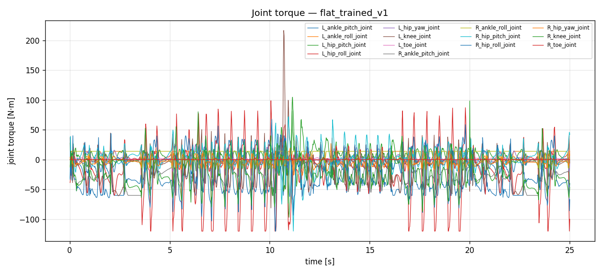
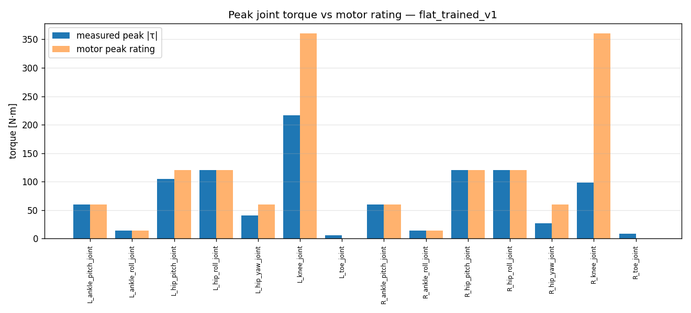
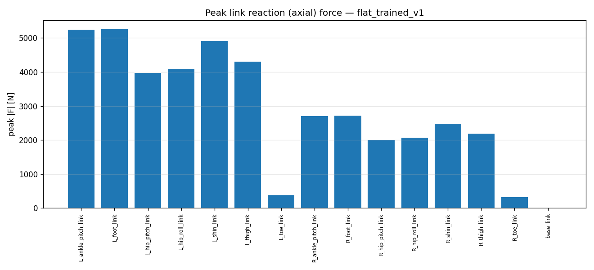
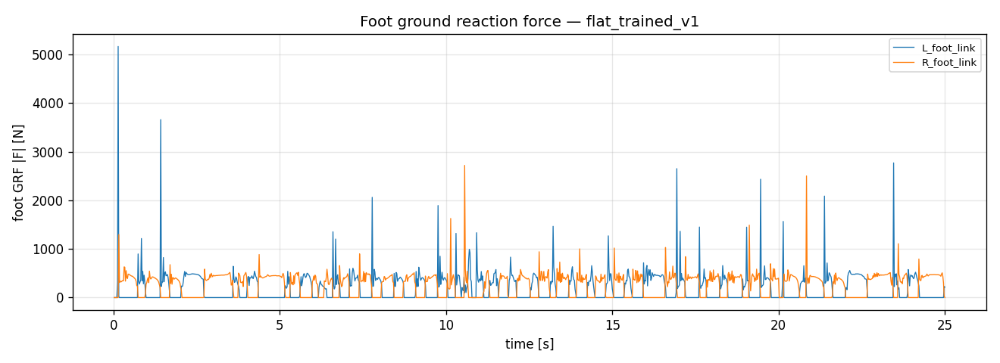

# Measurement analysis — `flat_trained_v1`

- steps: 1250, duration: 24.98 s

## Joint torque vs motor rating

| joint | peak |τ| [N·m] | RMS [N·m] | motor peak | motor rated | peak util % |
|---|---|---|---|---|---|---|
| L_ankle_pitch_joint | 60.0 | 27.8 | 60.0 | 20.0 | 100 |
| L_ankle_roll_joint | 14.0 | 8.6 | 14.0 | 5.0 | 100 |
| L_hip_pitch_joint | 104.9 | 16.6 | 120.0 | 40.0 | 87 |
| L_hip_roll_joint | 120.0 | 42.1 | 120.0 | 40.0 | 100 |
| L_hip_yaw_joint | 41.1 | 8.8 | 60.0 | 20.0 | 69 |
| L_knee_joint | 216.9 | 27.3 | 360.0 | 120.0 | 60 |
| L_toe_joint | 5.6 | 1.1 | - | - | - |
| R_ankle_pitch_joint | 60.0 | 26.4 | 60.0 | 20.0 | 100 |
| R_ankle_roll_joint | 14.0 | 10.4 | 14.0 | 5.0 | 100 |
| R_hip_pitch_joint | 120.0 | 17.4 | 120.0 | 40.0 | 100 |
| R_hip_roll_joint | 120.0 | 39.0 | 120.0 | 40.0 | 100 |
| R_hip_yaw_joint | 27.2 | 7.3 | 60.0 | 20.0 | 45 |
| R_knee_joint | 98.5 | 31.0 | 360.0 | 120.0 | 27 |
| R_toe_joint | 8.4 | 0.8 | - | - | - |

## Link reaction (axial) force

| link | peak |F| [N] | RMS [N] | peak|Fx| | peak|Fy| | peak|Fz| |
|---|---|---|---|---|---|---|
| L_ankle_pitch_link | 5247 | 390 | 566 | 708 | 5232 |
| L_foot_link | 5260 | 391 | 716 | 750 | 5197 |
| L_hip_pitch_link | 3978 | 304 | 543 | 423 | 3918 |
| L_hip_roll_link | 4093 | 311 | 1473 | 1123 | 3649 |
| L_shin_link | 4909 | 363 | 185 | 531 | 4907 |
| L_thigh_link | 4297 | 323 | 4270 | 482 | 317 |
| L_toe_link | 369 | 53 | 70 | 188 | 317 |
| R_ankle_pitch_link | 2702 | 377 | 428 | 455 | 2635 |
| R_foot_link | 2713 | 378 | 449 | 1152 | 2619 |
| R_hip_pitch_link | 2006 | 302 | 553 | 252 | 1919 |
| R_hip_roll_link | 2066 | 307 | 725 | 607 | 1842 |
| R_shin_link | 2478 | 352 | 169 | 344 | 2454 |
| R_thigh_link | 2182 | 318 | 2170 | 269 | 248 |
| R_toe_link | 322 | 62 | 145 | 99 | 280 |
| base_link | 0 | 0 | 0 | 0 | 0 |

## Figures

