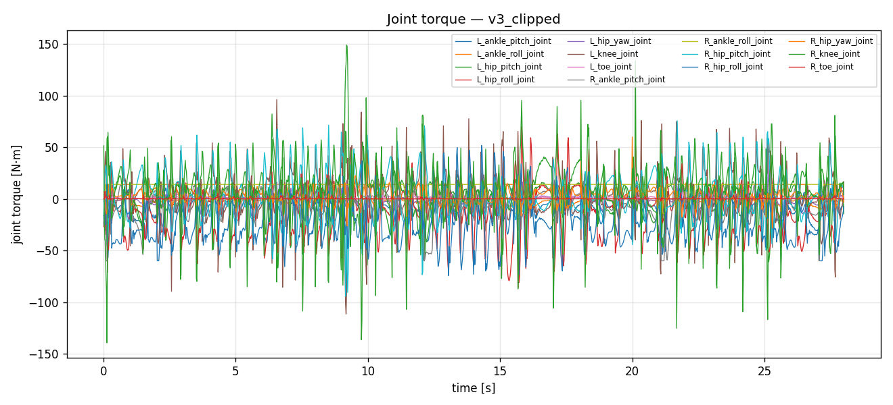
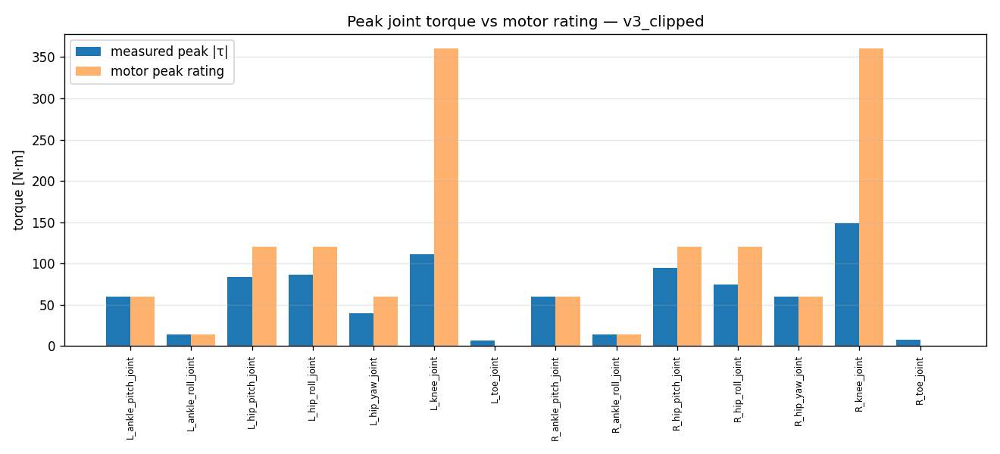
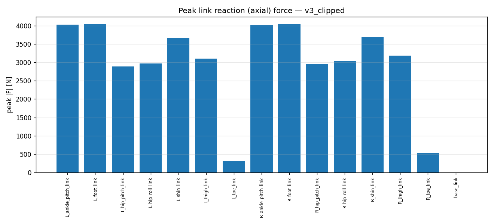
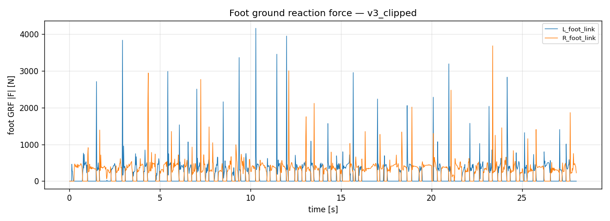

# Measurement analysis — `v3_clipped`

- steps: 1400, duration: 27.98 s

## Joint torque vs motor rating

| joint | peak |τ| [N·m] | RMS [N·m] | motor peak | motor rated | peak util % |
|---|---|---|---|---|---|---|
| L_ankle_pitch_joint | 60.0 | 14.4 | 60.0 | 20.0 | 100 |
| L_ankle_roll_joint | 14.0 | 8.4 | 14.0 | 5.0 | 100 |
| L_hip_pitch_joint | 83.7 | 22.3 | 120.0 | 40.0 | 70 |
| L_hip_roll_joint | 86.1 | 25.5 | 120.0 | 40.0 | 72 |
| L_hip_yaw_joint | 39.6 | 6.7 | 60.0 | 20.0 | 66 |
| L_knee_joint | 111.5 | 21.9 | 360.0 | 120.0 | 31 |
| L_toe_joint | 6.7 | 1.2 | - | - | - |
| R_ankle_pitch_joint | 60.0 | 14.9 | 60.0 | 20.0 | 100 |
| R_ankle_roll_joint | 14.0 | 11.1 | 14.0 | 5.0 | 100 |
| R_hip_pitch_joint | 94.3 | 22.0 | 120.0 | 40.0 | 79 |
| R_hip_roll_joint | 74.5 | 29.2 | 120.0 | 40.0 | 62 |
| R_hip_yaw_joint | 60.0 | 7.8 | 60.0 | 20.0 | 100 |
| R_knee_joint | 149.0 | 28.3 | 360.0 | 120.0 | 41 |
| R_toe_joint | 7.3 | 0.8 | - | - | - |

## Link reaction (axial) force

| link | peak |F| [N] | RMS [N] | peak|Fx| | peak|Fy| | peak|Fz| |
|---|---|---|---|---|---|---|
| L_ankle_pitch_link | 4024 | 423 | 724 | 1722 | 4019 |
| L_foot_link | 4039 | 425 | 1722 | 1231 | 4035 |
| L_hip_pitch_link | 2888 | 323 | 581 | 598 | 2858 |
| L_hip_roll_link | 2968 | 329 | 1303 | 1165 | 2637 |
| L_shin_link | 3656 | 386 | 112 | 458 | 3645 |
| L_thigh_link | 3104 | 341 | 3086 | 595 | 602 |
| L_toe_link | 314 | 61 | 94 | 155 | 312 |
| R_ankle_pitch_link | 4016 | 426 | 537 | 721 | 3937 |
| R_foot_link | 4031 | 427 | 783 | 902 | 3916 |
| R_hip_pitch_link | 2954 | 331 | 456 | 708 | 2940 |
| R_hip_roll_link | 3041 | 338 | 1293 | 919 | 2770 |
| R_shin_link | 3691 | 393 | 107 | 450 | 3686 |
| R_thigh_link | 3184 | 350 | 3168 | 739 | 486 |
| R_toe_link | 532 | 60 | 144 | 257 | 466 |
| base_link | 0 | 0 | 0 | 0 | 0 |

## Figures

