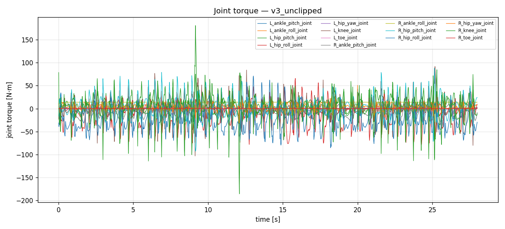
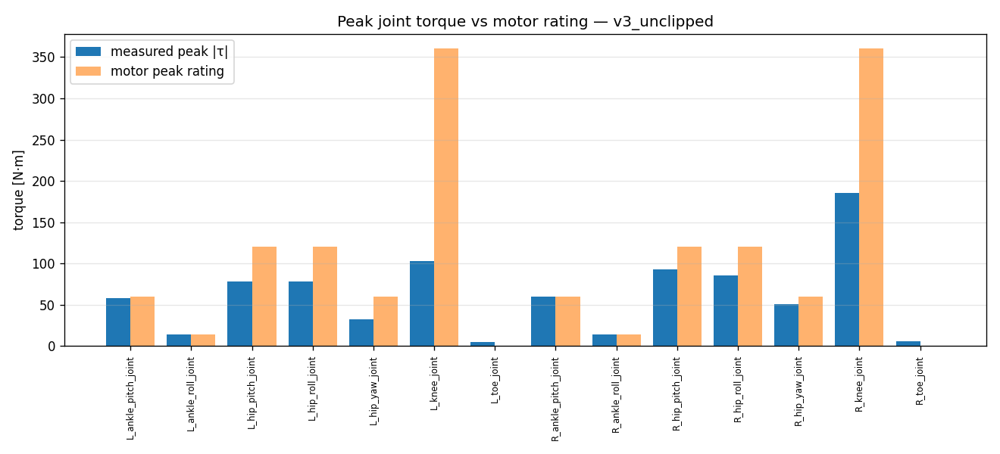
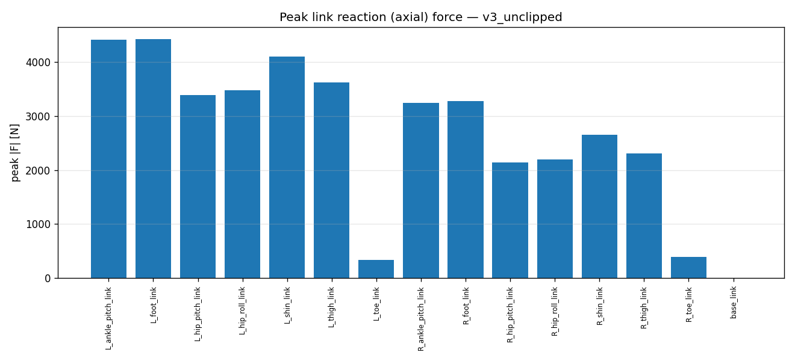
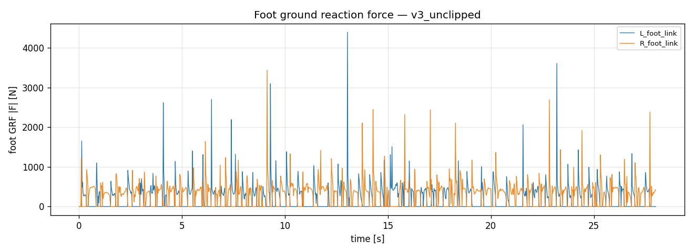

# Measurement analysis — `v3_unclipped`

- steps: 1400, duration: 27.98 s

## Joint torque vs motor rating

| joint | peak |τ| [N·m] | RMS [N·m] | motor peak | motor rated | peak util % |
|---|---|---|---|---|---|---|
| L_ankle_pitch_joint | 57.8 | 11.6 | 60.0 | 20.0 | 96 |
| L_ankle_roll_joint | 14.0 | 8.0 | 14.0 | 5.0 | 100 |
| L_hip_pitch_joint | 78.0 | 20.9 | 120.0 | 40.0 | 65 |
| L_hip_roll_joint | 78.1 | 26.2 | 120.0 | 40.0 | 65 |
| L_hip_yaw_joint | 32.5 | 5.9 | 60.0 | 20.0 | 54 |
| L_knee_joint | 103.3 | 19.6 | 360.0 | 120.0 | 29 |
| L_toe_joint | 4.8 | 0.7 | - | - | - |
| R_ankle_pitch_joint | 60.0 | 14.4 | 60.0 | 20.0 | 100 |
| R_ankle_roll_joint | 14.0 | 10.8 | 14.0 | 5.0 | 100 |
| R_hip_pitch_joint | 92.8 | 21.8 | 120.0 | 40.0 | 77 |
| R_hip_roll_joint | 85.4 | 32.9 | 120.0 | 40.0 | 71 |
| R_hip_yaw_joint | 50.8 | 7.3 | 60.0 | 20.0 | 85 |
| R_knee_joint | 185.8 | 27.1 | 360.0 | 120.0 | 52 |
| R_toe_joint | 5.7 | 0.7 | - | - | - |

## Link reaction (axial) force

| link | peak |F| [N] | RMS [N] | peak|Fx| | peak|Fy| | peak|Fz| |
|---|---|---|---|---|---|---|
| L_ankle_pitch_link | 4410 | 388 | 715 | 1490 | 4374 |
| L_foot_link | 4424 | 389 | 1516 | 1701 | 4077 |
| L_hip_pitch_link | 3382 | 308 | 713 | 436 | 3288 |
| L_hip_roll_link | 3470 | 313 | 1223 | 1233 | 3061 |
| L_shin_link | 4096 | 356 | 143 | 580 | 4095 |
| L_thigh_link | 3622 | 322 | 3593 | 408 | 660 |
| L_toe_link | 336 | 60 | 122 | 168 | 292 |
| R_ankle_pitch_link | 3238 | 449 | 427 | 970 | 3082 |
| R_foot_link | 3271 | 451 | 962 | 1098 | 2927 |
| R_hip_pitch_link | 2140 | 352 | 402 | 365 | 2131 |
| R_hip_roll_link | 2201 | 360 | 774 | 882 | 1993 |
| R_shin_link | 2650 | 417 | 213 | 605 | 2646 |
| R_thigh_link | 2303 | 373 | 2294 | 430 | 470 |
| R_toe_link | 395 | 69 | 129 | 167 | 370 |
| base_link | 0 | 0 | 0 | 0 | 0 |

## Figures

