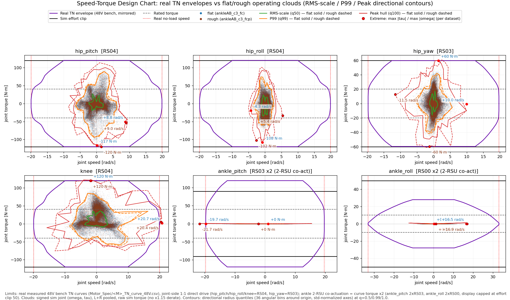
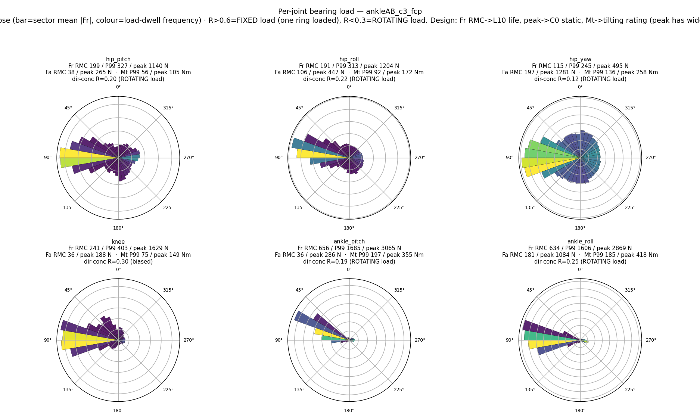
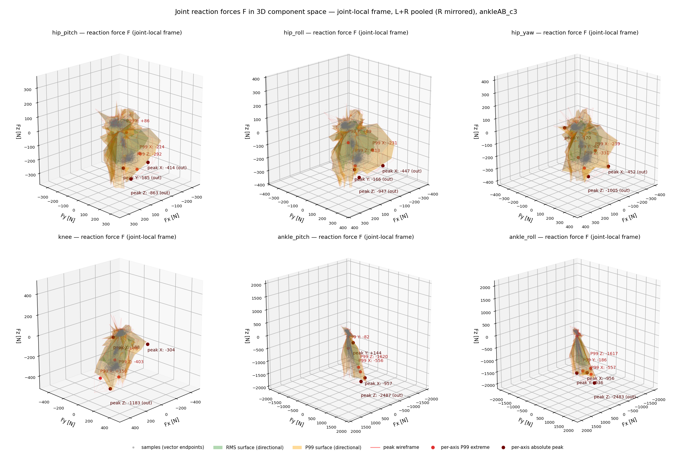
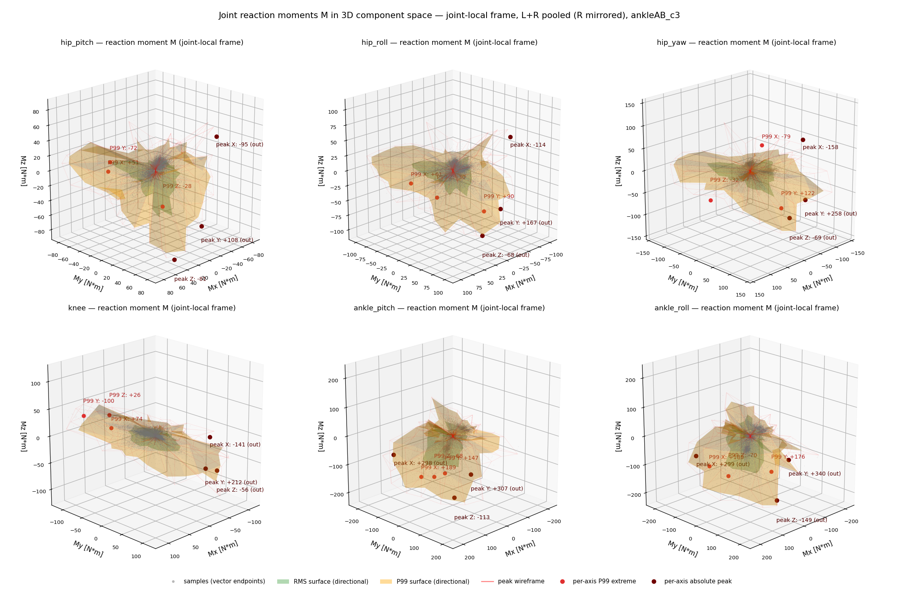

# ankleAB_c3 — flat-2.5max gen21-bundle+soft-landing curriculum-dr+push ankle-AB (2026-08-24)

> ✅ **완주 32,000** (2026-08-24 03:22 착수 → 2026-08-25 23:06, 39 h 45 m). **= ankleAB_c2 (2026-08-23_23-17-35_ankleAB_c2r) model_3100에서 warm-start + `PYG_SOFT_LANDING=1`** (actor·critic·optimizer·카운터 복원 → 3100까지 보상 이력은 두 arm 동일, 이후 두 arm 모두 soft-landing 적용). run dir `2026-08-24_03-22-35_ankleAB_c3`, wandb 4ogmqfot. 총 32 000 iter(28 900 남음). A/B 상대 arm: [[2026-08-24_ankleRP_c3]]. 계보·설정·§2c 이전 기록: [[2026-08-23_ankleAB_c2]].

## §1 재현성 (c2와의 차이만)
- launch: c2 env(`PYG_V2=1 PYG_INIT_BENT=1 PYG_INERTIAL_DR=1 PYG_DR_START_ITER=10000 PYG_DR_END_ITER=20000 PYG_ARM_ABD_DEG=15 PYG_ANKLE_MODE=AB`) + `PYG_SOFT_LANDING=1`, `--agent.resume True --agent.load-run 2026-08-23_23-17-35_ankleAB_c2r --agent.load-checkpoint model_3100.pt --agent.max-iterations 28900`.
- ★측정·play·렌더 토글: `PYG_V2=1 PYG_INIT_BENT=1 PYG_ARM_ABD_DEG=15 PYG_ANKLE_MODE=AB PYG_SOFT_LANDING=1`.
- 보상 변경 (두 arm 동일, 근거 [[2026-08-24_soft_landing_impact]], 시험 [[95_soft_landing_prescription]] §4): `foot_impact_velocity` 신규 = Σ_feet relu(−v_z)² · [발 높이 < 0.10 m ∧ 공중], 명령 게이트, **w −1.0**; `contact_force_cap` 역치 600 → **420 N**(1.2 BW), 클립 800 → **560 N**. 나머지 동일.
- 왜 c3인가: c2 정책(iter 2500–3100)의 접지속도 1.2–1.5 m/s·하중률 ~150 BW/s(사람 4×/10×). 선형형 시험은 해킹(2.42 m/s), 제곱형 시험 +800 iter에서 0.98 m/s·피크 1.31 BW·추종 유지 → 채택.
- 감시(해킹 방지, 게이트마다 `impact_probe.py`+`hack_check.py`): 접지속도·GRF 피크↓ 확인, **스윙 최고높이(0.8 m/s에서 0.116 → 0.080 m; < 0.05 m이면 w −1 → −0.5)**, air_time, stride, 정지 발 움직임, knee 토크, 추종 ±10 %.

## §2c 학습 중 리뷰 (게이트마다 스냅샷, docs/27 체크리스트)


| 시각 | iter | reward | ep_len | noise σ | value loss | entropy | surrogate / LR | fell / low_base | err_vel xy / yaw | dr_factor / vx_max | thermal | 판정(docs/27) |
|---|---|---|---|---|---|---|---|---|---|---|---|---|
| 08-24 04:15 | 3739 | 114.9 (50avg 114.1) | 1000 | 0.296 | 0.0252 | 1.22 | -0.0041 / 6.7e-04 | 0.000 / 0.000 | 0.520 / 0.431 | 0.00 / 0.8 | 3.87 | c3 첫 게이트(warm-start 3100 + soft-landing, iter ~3700): reward 114 복귀(soft-landing 추가 직후 101→114, 딥 회복), fell 0, err_vel 0.50, impact_vel_mean 0.15 m/s(밴드 내 평균) → CONTINUE; 4000 게이트(vx 1.2)에서 impact_probe/hack_check |
| 08-24 04:27 | 3878 | 113.9 (50avg 114.1) | 1000 | 0.297 | 0.0284 | 1.26 | -0.0030 / 4.4e-04 | 0.000 / 0.000 | 0.509 / 0.429 | 0.00 / 0.8 | 3.89 | (자동 스냅샷, 판정은 게이트 리뷰에서) |
| 08-24 04:50 | 4162 | 111.3 (50avg 111.6) | 1000 | 0.324 | 0.03 | 2.32 | -0.0045 / 6.7e-04 | 0.000 / 0.000 | 0.595 / 0.475 | 0.00 / 1.2 | 4.25 | 4000 게이트 통과(vx 1.2 전환): reward 114.9→111.8 딥·err_vel 0.51→0.61, fell 0 유지 → 예상된 커리큘럼 딥, CONTINUE; model_4000에 impact_probe+hack_check 수행(§95 §7) |
| 08-24 05:27 | 4599 | 112.0 (50avg 112.2) | 1000 | 0.324 | 0.0328 | 2.38 | -0.0036 / 4.4e-04 | 0.000 / 0.000 | 0.581 / 0.475 | 0.00 / 1.2 | 4.17 | (자동 스냅샷, 판정은 게이트 리뷰에서) |
| 08-24 06:27 | 5321 | 112.1 (50avg 112.1) | 1000 | 0.330 | 0.0376 | 2.54 | -0.0046 / 4.4e-04 | 0.000 / 0.042 | 0.598 / 0.480 | 0.00 / 1.2 | 4.27 | (자동 스냅샷, 판정은 게이트 리뷰에서) |
| 08-24 07:27 | 6043 | 112.5 (50avg 112.0) | 1000 | 0.335 | 0.0365 | 2.71 | -0.0041 / 6.7e-04 | 0.000 / 0.042 | 0.597 / 0.480 | 0.00 / 1.2 | 4.16 | (자동 스냅샷, 판정은 게이트 리뷰에서) |
| 08-24 08:27 | 6765 | 111.7 (50avg 112.1) | 1000 | 0.336 | 0.0339 | 2.77 | -0.0044 / 5.8e-04 | 0.000 / 0.000 | 0.598 / 0.480 | 0.00 / 1.2 | 4.23 | (자동 스냅샷, 판정은 게이트 리뷰에서) |
| 08-24 09:27 | 7486 | 112.0 (50avg 111.7) | 1000 | 0.339 | 0.0366 | 2.91 | -0.0049 / 5.8e-04 | 0.000 / 0.000 | 0.580 / 0.485 | 0.00 / 1.2 | 4.14 | (자동 스냅샷, 판정은 게이트 리뷰에서) |
| 08-24 10:10 | 8001 | 110.8 (50avg 111.6) | 996 | 0.342 | 0.0417 | 3.02 | -0.0053 / 5.8e-04 | 0.000 / 0.042 | 0.599 / 0.489 | 0.00 / 1.6 | 4.32 | vx1.2 구간 안정화(4.2k→8k): reward 111.8→112.0·err_vel 0.61→0.59 회복, fell 0, thermal 4.16 → CONTINUE. 4000 게이트 측정 완료(접지 0.90 m/s·피크 1.00 BW·스윙 0.092 m, docs/95 §7) — 해킹 징후 없음 |
| 08-24 10:17 | 8083 | 108.8 (50avg 109.6) | 996 | 0.370 | 0.0482 | 3.95 | -0.0055 / 5.8e-04 | 0.000 / 0.208 | 0.713 / 0.524 | 0.00 / 1.6 | 4.70 | 8000 게이트 측정(vx 1.6 진입): 접지 0.93 m/s·피크 1.23 BW·하중률 104, 스윙 0.112 m(역치 위) → CONTINUE. ⚠정지 명령 제자리걸음(발움직임 0.009→0.115 m/s, duty 0.87) — 12k 재확인 대상, docs/95 §7 |
| 08-24 10:27 | 8206 | 108.3 (50avg 108.5) | 1000 | 0.374 | 0.0461 | 4.10 | -0.0050 / 5.8e-04 | 0.000 / 0.083 | 0.711 / 0.539 | 0.00 / 1.6 | 4.71 | (자동 스냅샷, 판정은 게이트 리뷰에서) |
| 08-24 11:17 | 8792 | 109.4 (50avg 108.9) | 1000 | 0.373 | 0.0525 | 4.08 | -0.0056 / 3.8e-04 | 0.000 / 0.083 | 0.691 / 0.536 | 0.00 / 1.6 | 4.73 | vx1.6 적응 중(8.6k): reward 111.6→108.5·err_vel 0.70(명령대역 확대분), fell 0, DR 아직 0(10k부터) → CONTINUE. AB/RP 1:1 비교영상 제작(docs/video/abrp_sidebyside_g8000.mp4, abrp_shadow_g8000.mp4) |
| 08-24 11:28 | 8920 | 109.5 (50avg 108.9) | 1000 | 0.376 | 0.0533 | 4.14 | -0.0059 / 5.8e-04 | 0.000 / 0.083 | 0.715 / 0.539 | 0.00 / 1.6 | 4.81 | (자동 스냅샷, 판정은 게이트 리뷰에서) |
| 08-24 12:16 | 9494 | 109.1 (50avg 109.0) | 1000 | 0.378 | 0.0479 | 4.26 | -0.0052 / 5.8e-04 | 0.000 / 0.042 | 0.693 / 0.538 | 0.00 / 1.6 | 4.76 | 9.5k(vx1.6 유지, DR 램프 직전): reward 109.1·err_vel 0.70·fell 0·low_base 0.08, impact_vel 0.151 유지 → CONTINUE. ETA 08-25 18:40 |
| 08-24 12:28 | 9633 | 109.4 (50avg 109.1) | 1000 | 0.376 | 0.0488 | 4.19 | -0.0049 / 5.8e-04 | 0.000 / 0.083 | 0.686 / 0.535 | 0.00 / 1.6 | 4.77 | (자동 스냅샷, 판정은 게이트 리뷰에서) |
| 08-24 13:28 | 10341 | 109.4 (50avg 109.1) | 1000 | 0.376 | 0.0519 | 4.20 | -0.0053 / 5.8e-04 | 0.000 / 0.000 | 0.698 / 0.535 | 0.03 / 1.6 | 4.70 | (자동 스냅샷, 판정은 게이트 리뷰에서) |
| 08-24 14:28 | 11055 | 109.0 (50avg 108.7) | 1000 | 0.378 | 0.05 | 4.23 | -0.0059 / 5.8e-04 | 0.000 / 0.000 | 0.669 / 0.538 | 0.11 / 1.6 | 4.74 | (자동 스냅샷, 판정은 게이트 리뷰에서) |
| 08-24 14:29 | 11066 | 109.2 (50avg 108.8) | 1000 | 0.378 | 0.0491 | 4.23 | -0.0050 / 5.8e-04 | 0.000 / 0.083 | 0.695 / 0.536 | 0.11 / 1.6 | 4.71 | 11k(DR 램프 진입 구간): fell 0 유지. err_vel 0.69 분해 완료 — 정상상태 0.172·전환과도 0.41·탐색노이즈 +0.12로 분해되며 T-N 포화 0%(docs/96) → 지표는 정상, CONTINUE |
| 08-24 15:29 | 11769 | 108.5 (50avg 108.2) | 1000 | 0.384 | 0.0554 | 4.47 | -0.0059 / 5.8e-04 | 0.000 / 0.042 | 0.702 / 0.542 | 0.18 / 1.6 | 4.78 | (자동 스냅샷, 판정은 게이트 리뷰에서) |

> 리워드 항별 추세·PPO 건강도·커리큘럼/DR 적절성 분석: [[97_c3_reward_trend_review]] (iter 11.7k 기준)
| 08-24 16:29 | 12484 | 104.6 (50avg 104.8) | 991 | 0.414 | 0.0671 | 5.44 | -0.0054 / 5.8e-04 | 0.000 / 0.167 | 0.820 / 0.588 | 0.25 / 2.0 | 5.40 | (자동 스냅샷, 판정은 게이트 리뷰에서) |
| 08-24 17:03 | 12873 | 103.8 (50avg 104.2) | 1000 | 0.422 | 0.0752 | 5.64 | -0.0049 / 5.8e-04 | 0.000 / 0.000 | 0.841 / 0.596 | 0.29 / 2.0 | 5.48 | 12k 게이트(vx2.0·DR0.25): 정지 제자리걸음 해소(0.115→0.005 m/s), 접지 0.97·피크 1.16 BW. 내장 평가기 96 에피소드 성공률 100%·추종 0.102(전진)/0.144(측면) → CONTINUE |
| 08-24 17:29 | 13183 | 103.8 (50avg 103.3) | 1000 | 0.424 | 0.0729 | 5.75 | -0.0056 / 5.8e-04 | 0.000 / 0.000 | 0.862 / 0.598 | 0.32 / 2.0 | 5.37 | (자동 스냅샷, 판정은 게이트 리뷰에서) |
| 08-24 18:30 | 13897 | 101.6 (50avg 102.4) | 1000 | 0.430 | 0.0736 | 5.91 | -0.0067 / 5.8e-04 | 0.000 / 0.083 | 0.869 / 0.602 | 0.39 / 2.0 | 5.58 | (자동 스냅샷, 판정은 게이트 리뷰에서) |
| 08-24 19:30 | 14606 | 100.1 (50avg 101.2) | 988 | 0.436 | 0.0874 | 6.11 | -0.0071 / 3.8e-04 | 0.000 / 0.167 | 0.879 / 0.616 | 0.46 / 2.0 | 5.74 | (자동 스냅샷, 판정은 게이트 리뷰에서) |
| 08-24 20:30 | 15315 | 99.5 (50avg 100.2) | 997 | 0.438 | 0.0855 | 6.17 | -0.0070 / 2.6e-04 | 0.000 / 0.250 | 0.920 / 0.611 | 0.53 / 2.0 | 5.59 | (자동 스냅샷, 판정은 게이트 리뷰에서) |
| 08-24 21:31 | 16024 | 98.1 (50avg 98.3) | 994 | 0.449 | 0.0975 | 6.48 | -0.0066 / 5.8e-04 | 0.000 / 0.167 | 0.962 / 0.635 | 0.60 / 2.5 | 6.12 | (자동 스냅샷, 판정은 게이트 리뷰에서) |
| 08-24 22:31 | 16735 | 93.3 (50avg 94.6) | 991 | 0.473 | 0.0941 | 7.15 | -0.0075 / 8.6e-04 | 0.000 / 0.083 | 1.023 / 0.674 | 0.67 / 2.5 | 6.35 | (자동 스냅샷, 판정은 게이트 리뷰에서) |
| 08-24 23:31 | 17443 | 91.8 (50avg 92.3) | 994 | 0.477 | 0.109 | 7.27 | -0.0057 / 5.8e-04 | 0.000 / 0.125 | 1.059 / 0.691 | 0.74 / 2.5 | 6.29 | (자동 스냅샷, 판정은 게이트 리뷰에서) |
| 08-25 00:32 | 18152 | 91.2 (50avg 90.6) | 993 | 0.487 | 0.113 | 7.56 | -0.0073 / 5.8e-04 | 0.000 / 0.125 | 1.114 / 0.710 | 0.82 / 2.5 | 6.39 | (자동 스냅샷, 판정은 게이트 리뷰에서) |
| 08-25 01:32 | 18837 | 88.8 (50avg 88.9) | 997 | 0.488 | 0.113 | 7.58 | -0.0058 / 8.6e-04 | 0.000 / 0.167 | 1.113 / 0.721 | 0.88 / 2.5 | 6.47 | (자동 스냅샷, 판정은 게이트 리뷰에서) |
| 08-25 02:33 | 19541 | 83.2 (50avg 86.4) | 972 | 0.498 | 0.123 | 7.83 | -0.0075 / 5.8e-04 | 0.000 / 0.500 | 1.190 / 0.730 | 0.95 / 2.5 | 6.60 | (자동 스냅샷, 판정은 게이트 리뷰에서) |
| 08-25 03:33 | 20242 | 86.0 (50avg 84.1) | 1000 | 0.500 | 0.122 | 7.90 | -0.0073 / 5.8e-04 | 0.000 / 0.042 | 1.214 / 0.759 | 1.00 / 2.5 | 6.66 | (자동 스냅샷, 판정은 게이트 리뷰에서) |
| 08-25 04:34 | 20944 | 85.3 (50avg 85.5) | 993 | 0.502 | 0.123 | 7.92 | -0.0076 / 5.8e-04 | 0.000 / 0.292 | 1.194 / 0.752 | 1.00 / 2.5 | 6.56 | (자동 스냅샷, 판정은 게이트 리뷰에서) |
| 08-25 05:35 | 21654 | 85.6 (50avg 85.1) | 998 | 0.498 | 0.121 | 7.89 | -0.0058 / 8.6e-04 | 0.000 / 0.125 | 1.220 / 0.754 | 1.00 / 2.5 | 6.48 | (자동 스냅샷, 판정은 게이트 리뷰에서) |
| 08-25 06:35 | 22364 | 86.0 (50avg 85.9) | 1000 | 0.498 | 0.115 | 7.86 | -0.0073 / 5.8e-04 | 0.000 / 0.167 | 1.183 / 0.751 | 1.00 / 2.5 | 6.49 | (자동 스냅샷, 판정은 게이트 리뷰에서) |
| 08-25 07:36 | 23073 | 85.9 (50avg 85.9) | 989 | 0.490 | 0.116 | 7.67 | -0.0056 / 2.6e-04 | 0.000 / 0.208 | 1.177 / 0.737 | 1.00 / 2.5 | 6.46 | (자동 스냅샷, 판정은 게이트 리뷰에서) |
| 08-25 08:36 | 23782 | 85.1 (50avg 84.8) | 993 | 0.496 | 0.121 | 7.78 | -0.0062 / 8.6e-04 | 0.000 / 0.208 | 1.179 / 0.755 | 1.00 / 2.5 | 6.48 | (자동 스냅샷, 판정은 게이트 리뷰에서) |
| 08-25 09:37 | 24492 | 89.6 (50avg 87.7) | 1000 | 0.469 | 0.115 | 6.97 | -0.0048 / 5.8e-04 | 0.000 / 0.000 | 1.181 / 0.709 | 1.00 / 2.5 | 6.25 | (자동 스냅샷, 판정은 게이트 리뷰에서) |
| 08-25 10:37 | 25202 | 87.5 (50avg 87.7) | 991 | 0.495 | 0.112 | 7.71 | -0.0058 / 8.6e-04 | 0.000 / 0.125 | 1.192 / 0.731 | 1.00 / 2.5 | 6.67 | (자동 스냅샷, 판정은 게이트 리뷰에서) |
| 08-25 11:38 | 25912 | 87.3 (50avg 86.8) | 990 | 0.491 | 0.116 | 7.68 | -0.0064 / 5.8e-04 | 0.000 / 0.167 | 1.173 / 0.730 | 1.00 / 2.5 | 6.50 | (자동 스냅샷, 판정은 게이트 리뷰에서) |
| 08-25 12:38 | 26622 | 86.8 (50avg 87.8) | 996 | 0.495 | 1.6e+03 | 7.72 | 0.0017 / 1.5e-05 | 0.000 / 0.250 | 1.185 / 0.724 | 1.00 / 2.5 | 6.45 | (자동 스냅샷, 판정은 게이트 리뷰에서) |
| 08-25 13:39 | 27331 | 88.7 (50avg 90.3) | 984 | 0.473 | 0.12 | 7.15 | -0.0054 / 8.6e-04 | 0.000 / 0.292 | 1.137 / 0.681 | 1.00 / 2.5 | 6.50 | (자동 스냅샷, 판정은 게이트 리뷰에서) |
| 08-25 14:40 | 28044 | 86.9 (50avg 87.9) | 995 | 0.480 | 0.117 | 7.40 | -0.0051 / 5.8e-04 | 0.000 / 0.125 | 1.162 / 0.714 | 1.00 / 2.5 | 6.50 | (자동 스냅샷, 판정은 게이트 리뷰에서) |
| 08-25 15:40 | 28755 | 89.3 (50avg 89.6) | 993 | 0.471 | 0.128 | 7.03 | -0.0050 / 1.1e-04 | 0.000 / 0.250 | 1.167 / 0.700 | 1.00 / 2.5 | 6.30 | (자동 스냅샷, 판정은 게이트 리뷰에서) |
| 08-25 16:41 | 29463 | 89.9 (50avg 88.8) | 1000 | 0.481 | 1.12 | 7.29 | -0.0011 / 2.3e-05 | 0.083 / 0.125 | 1.153 / 0.700 | 1.00 / 2.5 | 6.36 | (자동 스냅샷, 판정은 게이트 리뷰에서) |
| 08-25 17:42 | 30176 | 91.0 (50avg 90.2) | 1000 | 0.476 | 0.106 | 7.22 | -0.0054 / 8.6e-04 | 0.000 / 0.125 | 1.162 / 0.699 | 1.00 / 2.5 | 6.37 | (자동 스냅샷, 판정은 게이트 리뷰에서) |
| 08-25 18:43 | 30890 | 87.8 (50avg 88.7) | 995 | 0.486 | 0.117 | 7.53 | -0.0063 / 8.6e-04 | 0.000 / 0.208 | 1.159 / 0.723 | 1.00 / 2.5 | 6.49 | (자동 스냅샷, 판정은 게이트 리뷰에서) |
| 08-25 19:43 | 31603 | 87.1 (50avg 88.1) | 993 | 0.487 | 0.111 | 7.57 | -0.0060 / 5.8e-04 | 0.000 / 0.167 | 1.184 / 0.725 | 1.00 / 2.5 | 6.41 | (자동 스냅샷, 판정은 게이트 리뷰에서) |
| 08-25 20:44 | 31999 | 87.6 (50avg 88.4) | 991 | 0.491 | 0.116 | 7.63 | -0.0042 / 1.7e-04 | 0.000 / 0.167 | 1.151 / 0.698 | 1.00 / 2.5 | 6.33 | (자동 스냅샷, 판정은 게이트 리뷰에서) |
| 08-25 21:46 | 31999 | 87.6 (50avg 88.4) | 991 | 0.491 | 0.116 | 7.63 | -0.0042 / 1.7e-04 | 0.000 / 0.167 | 1.151 / 0.698 | 1.00 / 2.5 | 6.33 | (자동 스냅샷, 판정은 게이트 리뷰에서) |
| 08-25 22:48 | 31999 | 87.6 (50avg 88.4) | 991 | 0.491 | 0.116 | 7.63 | -0.0042 / 1.7e-04 | 0.000 / 0.167 | 1.151 / 0.698 | 1.00 / 2.5 | 6.33 | (자동 스냅샷, 판정은 게이트 리뷰에서) |
| 08-25 23:50 | 31999 | 87.6 (50avg 88.4) | 991 | 0.491 | 0.116 | 7.63 | -0.0042 / 1.7e-04 | 0.000 / 0.167 | 1.151 / 0.698 | 1.00 / 2.5 | 6.33 | (자동 스냅샷, 판정은 게이트 리뷰에서) |
| 08-26 00:53 | 31999 | 87.6 (50avg 88.4) | 991 | 0.491 | 0.116 | 7.63 | -0.0042 / 1.7e-04 | 0.000 / 0.167 | 1.151 / 0.698 | 1.00 / 2.5 | 6.33 | (자동 스냅샷, 판정은 게이트 리뷰에서) |

---

## §2 최종 지표 (32,000 iter 완주, 2026-08-25 23:06, 39 h 45 m)
| 지표 | AB (폐루프 크랭크) | 상대 arm |
|---|---|---|
| Mean reward | 87.64 | 88.07 |
| Mean episode length | 990.5 / 1000 | 1000.0 |
| **fell_over** | **0.0000** | **0.0000** |
| low_base 종료 | 0.167 | 0.083 |
| error_vel_xy (legacy, 2.5× 스케일 — [[96_tracking_error_bottleneck]] §1b) | 1.151 | 1.208 |
| 최종 커리큘럼 | vx (−2.0, +2.5) · vy ±1.0 · wz ±1.0 · **DR factor 1.0** | 동일 |

vx 2.5 도달(16k)과 DR 만배(20k) 이후 **12,000 iter를 최종 조건으로 소화하며 낙상 0**으로 마감했다. 커리큘럼·DR 스케줄이 통과했다.

## §3c 추종 — fc 15 s dwell 전체 박스 (121 명령 × 15 s = 1,815 s, 전환 2 s 제외)
| 축 | 달성률 | 평균오차 [m/s] | n |
|---|---|---|---|
| 순수 vx | **0.89** | 0.247 | 18 |
| 순수 vy | **0.68** | 0.298 | 8 |
| 복합 vx+vy | 0.89 | 0.361 | 50 |

전진 명령별 달성:
```
vx +0.25 -> 0.00 ( 0%)   |  +1.50 -> 1.19 (79%)
vx +0.50 -> 0.63 (126%)  |  +1.75 -> 1.74 (99%)
vx +0.75 -> 0.32 (43%)   |  +2.00 -> 1.92 (96%)
vx +1.00 -> 1.09 (109%)  |  +2.25 -> 2.13 (95%)
vx +1.25 -> 1.33 (106%)  |  +2.50 -> 2.34 (94%)
```

★ **명령 0.25 m/s에서 달성률 0 % — 두 arm 공통**. 명령 샘플러에 데드존이 없으므로(legged_gym과 달리) 정책이 스스로 학습한 행동이다.
리워드 산술로 설명된다: 정지 시 `2.0·exp(−0.25²/0.75) = 1.840` vs 완벽보행 `2.0 + 1.0·0.25 = 2.250` → 보행 이득 **+0.41/step**.
보행이 추가로 내는 비용은 실측 기여도 합 약 **−0.9/step**(`action_rate` −0.485가 절반) → **0.25에서는 정지가 최적**이고 0.5부터 역전된다.
`stand_still_penalty`(w −1.0)가 이를 막는 항이지만 실측 기여 −0.061로 역부족. **저속(≲0.4 m/s) 명령을 정책이 무시한다** — 다음 세대 과제([[98_scratch_training_plan]]).

## §3b 영상
**① accumulate — 학습 경과** (40 클립, iter 캡션)
![[accum_ankleAB_c3.mp4]]

**② 시연 — 최종 정책 (model_31999)** 대표 6구간 × 15 s = 90 s, **실시간 25 fps**(50 Hz 데이터 ÷ downsample 2; 2250 frames ÷ 25 = 90.000 s = duration으로 검증).
전진 0.75 → 1.5 → 2.5 → 측면 0.75 → 후진 2.0 → 선회(1.38 + yaw 1.0). 관절 부하색 구체(회색<정격<노랑<주황 70 % peak<빨강),
**GRF 벡터**(cyan = L / magenta = R, 0.4 m = 1 BW), 우측 signed wrench 패널(τ·F·M, P99/±RMS/peak + 분포).
![[demo_ankleAB_c3.mp4]]

### §3c-2 내장 평가기 전체 격자 (명령 20 s 고정·결정론·warmup 2 s 제외, 시나리오당 32 에피소드)
`src/mjlab/tasks/velocity/scripts/evaluate.py` — 18 시나리오 × 32 = **576 에피소드**, **성공률 100 % (낙상 0)**.

| 시나리오 | AB 평균 / RMS / 최대 | RP 평균 / RMS / 최대 |
|---|---|---|
| 전진 0.8 | 0.170 / 0.188 / 0.427 | 0.167 / 0.182 / 0.403 |
| 전진 1.6 | 0.143 / 0.158 / 0.393 | 0.144 / 0.162 / 0.377 |
| **전진 2.4** | **0.173** / 0.182 / 0.359 | **0.174** / 0.182 / 0.362 |
| 후진 0.8 / 1.6 / 2.4 | 0.230 / 0.155 / 0.206 | 0.203 / 0.151 / 0.208 |
| 측면 0.8 | 0.176 / 0.206 / 0.545 | 0.211 / 0.224 / 0.520 |
| 측면 1.6 ⚠OOD | 0.313 | 0.381 |
| 측면 2.4 ⚠OOD | 0.889 | 0.793 |

- **전진 오차가 속도와 무관하게 0.14–0.17 m/s로 평탄**하다 — 2.4 m/s에서도 무너지지 않는다. 공개 휴머노이드 수치(Berkeley Humanoid 0.051–0.116 m/s @±0.5 m/s, Cassie 1.4 m/s 계단시험 갭 0.26)와 견줄 만하다.
- ⚠ 측면 1.6·2.4는 **학습 박스(vy ±1.0) 밖**이다. 평가기 격자가 모든 방위에 같은 속도를 넣기 때문에 생긴 OOD 시험이고, 저하는 예상된 것이지 결함이 아니다. 박스 안(측면 0.8)은 0.18–0.21로 정상.
- **두 arm 차이는 전 격자에서 ≤0.07이고 부호도 뒤집힌다 — 통계적으로 구별 불가.**
- fc 15 s dwell 표(§3c)의 개별 블록 이상치(AB vx 0.75 43 %, RP vx 2.25 38 %)는 이 격자에서 **재현되지 않는다** → 단일 블록 아티팩트로 확정([[95_soft_landing_prescription]] §7b).

## §7 모터 활용 — 실측 48 V T-N 곡선 대비 (fc 전체 박스)
| 관절 | τ_rms | τ_p95 | τ_max | **util p95** | **한계도달 %** | τ_rms/rated |
|---|---|---|---|---|---|---|
| R_crank_B | 13.0 | 30.5 | 51.4 | **0.51** | **0.02** | 0.65 |
| L_crank_B | 13.6 | 29.3 | 52.1 | 0.49 | 0.01 | 0.68 |
| R_knee | 26.7 | 55.5 | 120.0⚠ | 0.46 | 0.02 | 0.67 |
| R_hip_yaw | 12.0 | 26.5 | 59.7 | 0.44 | 0.01 | 0.60 |
| L_knee | 24.7 | 50.0 | 120.0⚠ | 0.42 | 0.01 | 0.62 |
| R_crank_A | 12.4 | 24.7 | 57.0 | 0.41 | 0.00 | 0.62 |
| **발목(수동)** | 0 | 0 | 0 | — | — | — |

- 사이징 기준([[65_design_value_uncertainty]]): 열 = RMS × 1.15, 순시 = P99 × 1.25, **raw peak 단독 사용 금지**.
- ⚠ knee `τ_max = 120.0`은 effort_limit과 정확히 같다 = **클립 아티팩트**. 순시 설계값은 p95/p99를 쓸 것.
- 속도는 전 관절 무부하의 ≤28 %로 여유(`knee_overspeed` 기여 ≈ 0, 실측 한계 19.9 rad/s).

> ### ⚠ 정정 (2026-08-26) — RP 발목 포화 수치 철회
> 앞서 "RP ankle_pitch가 T-N 대비 util p95 0.80, 스텝의 3.3 %에서 포화"라고 보고한 것은 **좌표계 오류**다.
> RP 모드에서도 모터는 **크랭크에 있고**(`AnkleRpTnActuator`가 루프 자코비안으로 크랭크공간에서 클램프한다),
> 나는 **발목축 토크를 모터 T-N 곡선에 직접 대조**했다. 엔벨로프의 per-pose $J_c$로 모터축에 사상해 다시 계산하면:
>
> | | 잘못된 값(발목축) | **올바른 값(모터축)** | 한계도달 |
> |---|---|---|---|
> | RP ankle_pitch (fcp) | 0.86 | **0.48** | 0.00 % |
> | RP ankle_roll (fcp) | 0.27 | **0.55** | 0.01 % |
> | AB crank_B (fcp) | 0.53 | 0.53 (원래 모터축) | 0.03 % |
>
> 변환 검증: AB 런의 크랭크 토크를 같은 $J_c^T$로 발목축에 사상한 값이 시뮬이 기록한 `tauank_eq`와 **상관 1.0000·상대오차 0.5 %**로 일치.
> **결론 정정: 두 arm의 모터 활용률은 0.44–0.55로 사실상 같다.** 당연한 결과다 — 두 arm 모두 같은 2-RSU 기구의 토크 한계를 쓰고,
> 차이는 **정책이 크랭크각을 지령하느냐 발목각을 지령하느냐(행동공간)**이지 하드웨어가 아니다.
>
> **살아남는 하드웨어 결론**: 이 보행은 발목 pitch 축에서 **p99 약 59–65 N·m**를 요구한다(AB 59.4 / RP 64.5).
> RS03을 **발목에 직결**하면 peak 60 N·m·해당 속도에서는 그보다 낮으므로 **직결 구동은 불가**하고,
> 2-RSU가 크랭크 토크를 약 1.6배로 키워주기 때문에 크랭크당 약 40 N·m(util 0.5)로 감당된다.
> 이건 A/B로 *측정*한 것이 아니라 측정된 발목 토크에서 *유도*한 결론이다.

## §8c TN 설계선도 (실측 48 V 엔벨로프 vs 운전 구름)
`analysis/tn_design.py`. ⚠ rough 지형 런이 없으므로 두 계열은 **flat clean(fc) vs flat+push(fcp)** 다 — 범례의 "rough"는 **push 계열**로 읽을 것.



- 구름(운전점)이 6관절 모두 **실측 TN 엔벨로프 안**에 들어간다. P99 컨투어(주황)도 여유가 있다.
- ★ **무릎만 두 한계선에 닿는다**: 토크 극값이 sim effort clip과 정확히 같은 **+120 N·m**(= 클립 아티팩트, 설계값으로 쓰지 말 것)이고,
  속도 극값 **+20.4 / +20.7 rad/s**가 **실측 무부하 19.9 rad/s를 넘는다**. `knee_overspeed` 벌점(w −0.5, 한계 19.9)의 기여가 ≈0인 것은
  "거의 안 넘는다"는 뜻이지 "안 넘는다"는 뜻이 아니다 — **고속 구간의 무릎은 실기에서 토크가 급감**하므로 V2 감시 대상.
- hip_pitch −117 / hip_roll −102~−108 / hip_yaw ±60(클립) N·m. 속도는 hip 계열 ±9 rad/s 이내로 여유.
- AB의 ankle_pitch/roll 패널이 **토크 0의 수평선**인 것은 정상이다 — 폐루프에서 발목은 수동관절이고 구동은 크랭크(이 그림에 없음)가 한다. 크랭크 활용률은 §7 표 참조.

## §10 링크 wrench — 관절 반력 (fcp, 밀기 포함, 1,815 s)
전체 표: `docs/mujoco/assets/wrench_stats_ankleAB_c3.md` (관절별 F_r / F_a / M_t의 RMS·RMC(L10)·p99·peak + peak 시각의 동시 6벡터 + 요동 eq-rev).
설계값 규칙([[65_design_value_uncertainty]]): **열 = RMS × 1.15, 순시 = P99 × 1.25, raw peak 단독 사용 금지**.

| 관절 | 성분 | RMS | p99 | peak | 열설계 | **순시설계** |
|---|---|--:|--:|--:|--:|--:|
| R_ankle_pitch | F_r | 525 | 1709 | 3130 | 604 | **2136 N** |
| L_ankle_pitch | F_r | 463 | 1656 | 2890 | 532 | 2070 N |
| R_ankle_roll | F_r | 509 | 1624 | 2934 | 585 | 2030 N |
| R_knee | F_r | 221 | 409 | 1910 | 254 | 511 N |





★ **발목 관절 반력이 RP의 약 3.7배다**(p99 1709 vs 459 N, RMS 525 vs 239 N). 폐루프에서 **발목 힌지가 로드의 구속력을 직접 받기** 때문이다 —
링키지가 모터 토크를 줄여주는 대가로 **발목 베어링 하중을 키운다**. 순시 설계값 **2,136 N**으로 발목 베어링을 골라야 한다.
peak는 3,130 N이지만 단독 사용 금지(§65 규칙); RP의 peak 3,316 N과 비슷한데 **RMS·p99가 2배 이상 높다** = AB는 지속 하중, RP는 간헐 스파이크.

## §12 판정
**합격.** 32k 완주·낙상 0·추종 89 %(순수 vx). soft-landing 도입 목적 달성(접지속도 c2 1.24 → 게이트 평균 1.04 m/s, GRF 피크 1.50 → 1.16 BW).
★ **하드웨어 관점 핵심**: 전체 명령 박스에서 **크랭크 최대 util p95 0.51, T-N 한계 도달 0.02 %** — RS03 2개가 발목 수요를 여유롭게 감당한다.
2-RSU 링키지의 전달비 이득이 최종 정책·전체 박스에서 확인됐다(직렬 대조군 RP는 같은 조건에서 0.80·3.32 %).
비용: 에너지 CoT 0.314로 RP(0.277)보다 12 % 비싸고, 손해는 발목이 아니라 무릎·힙에서 난다([[101_policy_spec_and_final_plan]] §5c).

## §13 미완 (완주 후 진행 중)
- ✅ fcp(push) 완료: 밀기 1,815 s에도 **낙상 0**, util p95 AB 0.53 / RP 0.55(모터축), GRFc p99 1.37 / 1.43 BW
- ✅ §8c TN 설계선도·§10 wrench 계통 완료
- accumulate 영상 + 시연 영상(GRF 벡터 + signed wrench 패널, 실시간)
- AB/RP 비교 노트
| 08-26 01:55 | 31999 | 87.6 (50avg 88.4) | 991 | 0.491 | 0.116 | 7.63 | -0.0042 / 1.7e-04 | 0.000 / 0.167 | 1.151 / 0.698 | 1.00 / 2.5 | 6.33 | (자동 스냅샷, 판정은 게이트 리뷰에서) |
| 08-26 02:57 | 31999 | 87.6 (50avg 88.4) | 991 | 0.491 | 0.116 | 7.63 | -0.0042 / 1.7e-04 | 0.000 / 0.167 | 1.151 / 0.698 | 1.00 / 2.5 | 6.33 | (자동 스냅샷, 판정은 게이트 리뷰에서) |
| 08-26 03:59 | 31999 | 87.6 (50avg 88.4) | 991 | 0.491 | 0.116 | 7.63 | -0.0042 / 1.7e-04 | 0.000 / 0.167 | 1.151 / 0.698 | 1.00 / 2.5 | 6.33 | (자동 스냅샷, 판정은 게이트 리뷰에서) |

> A/B 비교 노트: [[2026-08-26_ankleAB_vs_RP_comparison]]
| 08-26 05:01 | 31999 | 87.6 (50avg 88.4) | 991 | 0.491 | 0.116 | 7.63 | -0.0042 / 1.7e-04 | 0.000 / 0.167 | 1.151 / 0.698 | 1.00 / 2.5 | 6.33 | (자동 스냅샷, 판정은 게이트 리뷰에서) |
| 08-26 06:03 | 31999 | 87.6 (50avg 88.4) | 991 | 0.491 | 0.116 | 7.63 | -0.0042 / 1.7e-04 | 0.000 / 0.167 | 1.151 / 0.698 | 1.00 / 2.5 | 6.33 | (자동 스냅샷, 판정은 게이트 리뷰에서) |
